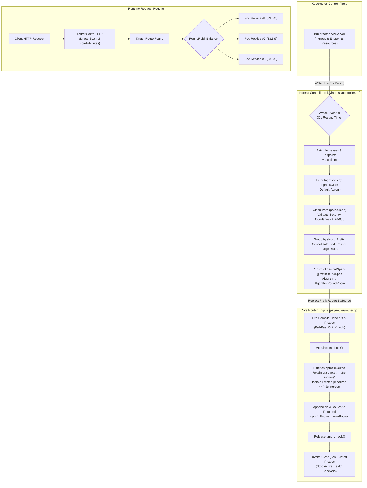
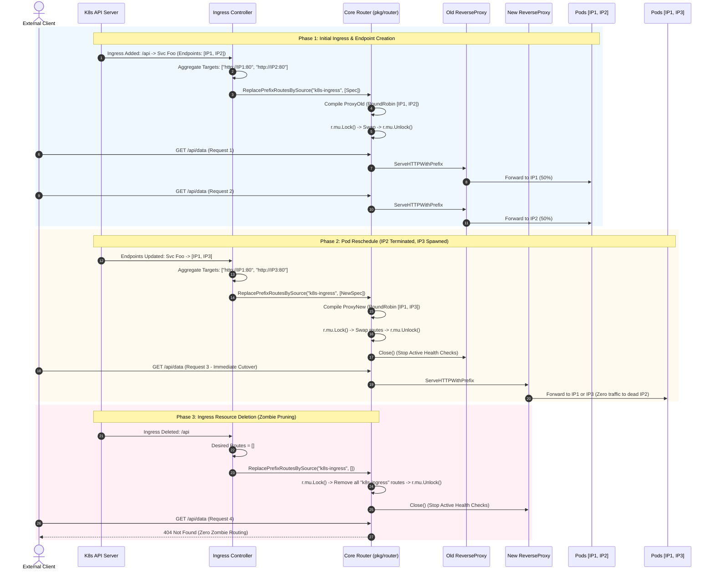

# ADR-089 - Source-Tagged Atomic Prefix Routing & Multi-Pod Ingress Endpoint Aggregation

## Context & Problem Statement

Toron Edge Gateway provides a native, zero-dependency Kubernetes Ingress Controller ([`pkg/ingress/controller.go`](file:///Users/sneha/Developer/toron-research/toron/pkg/ingress/controller.go)) that watches `networking.k8s.io/v1` `Ingress` and `Endpoints` resources from the Kubernetes API server, translates them into upstream reverse proxies, and dynamically registers prefix routes within the core routing engine ([`pkg/router/router.go`](file:///Users/sneha/Developer/toron-research/toron/pkg/router/router.go)).

During comprehensive security audit [`SR-091 Finding 3`](file:///Users/sneha/Developer/toron-research/toron/docs/securityReview/SR-091.md#L130-L152) and vulnerability assessment [`SEC-33`](file:///Users/sneha/Developer/toron-research/toron/SECURITY_AUDIT.md#L449-L457) ([CWE-400 Uncontrolled Resource Consumption](https://cwe.mitre.org/data/definitions/400.html), [CWE-670 Use of Incorrect Operator / Control Flow](https://cwe.mitre.org/data/definitions/670.html), [CWE-1059 Incomplete Technical Documentation](https://cwe.mitre.org/data/definitions/1059.html)), a set of four cascading failure modes was identified in route synchronization:

1. **Unbounded Route Table Memory Leak (CWE-400)**:
   In [`pkg/ingress/controller.go`](file:///Users/sneha/Developer/toron-research/toron/pkg/ingress/controller.go), `syncIngresses` executes every 30 seconds via `periodicResyncWorker` and reactively upon processing watch events. On every sync invocation, `syncIngresses` calls `c.router.RoutePrefix(...)`. In [`pkg/router/router.go`](file:///Users/sneha/Developer/toron-research/toron/pkg/router/router.go), `RoutePrefix` unconditionally appends new entries to `r.prefixRoutes` under `r.mu.Lock()`. Because `r.prefixRoutes` is an append-only slice lacking pruning or source scoping, a cluster with 50 Ingress routes appends 100 entries per minute, or **144,000 duplicate route entries every 24 hours**. Over hours of operation, heap memory consumption climbs monotonically, bloating memory caches and inducing Out-Of-Memory (OOM) termination.
2. **Zombie Route Persistence & Route Hijacking (CWE-670)**:
   When an Ingress resource, host rule, or path rule is deleted from the Kubernetes cluster, `syncIngresses` updates its local `activeRoutes` map, but leaves `r.prefixRoutes` untouched. Consequently, deleted routes remain permanently active in the core routing table ("zombie routes"). Client traffic dispatched to these obsolete endpoints continues to be forwarded to decommissioned, stale, or repurposed backends, creating critical cross-tenant data leakage risks.
3. **Stale Endpoint Shadowing**:
   In [`pkg/router/router.go`](file:///Users/sneha/Developer/toron-research/toron/pkg/router/router.go), `router.ServeHTTP` iterates linearly through `r.prefixRoutes` and dispatches requests to the *first matching route*. When a pod is rescheduled or updated with a new IP address, the updated route is appended to the *end* of `r.prefixRoutes`. The obsolete route entry at the beginning of the slice continues to intercept all traffic, routing requests to dead or terminated pod IPs and inducing persistent `502 Bad Gateway` or `504 Gateway Timeout` errors.
4. **Multi-Pod Replica Starvation**:
   In [`pkg/ingress/translator.go`](file:///Users/sneha/Developer/toron-research/toron/pkg/ingress/translator.go), `TranslateIngress` iterates through each IP in `targetIPs` and returns individual 1-target `DiscoveredRoute` records. In `syncIngresses`, each record is registered as an independent prefix route. Because `router.ServeHTTP` selects the first matching route in `r.prefixRoutes`, **pod replica #1 receives 100% of the traffic**, while replicas #2 through $M$ receive 0% of traffic. Horizontal scaling is completely incapacitated, and individual pods are subjected to catastrophic overload crashes.
5. **Background Goroutine & Socket Leaks on Route Churn**:
   When reverse proxy instances are abandoned in memory upon route changes, active background health checks (`UpstreamTarget.StartActiveHealthCheck`) continue to run ticker goroutines and keep open idle TCP connections indefinitely, leading to socket exhaustion (`EMFILE`) and memory leaks.

Remediating `SEC-33` requires establishing an **atomic, bounded route lifecycle** across `pkg/router`, `pkg/ingress`, and `pkg/proxy`, guaranteeing $O(K)$ bounded memory, zero zombie routes, instantaneous endpoint cutover, fair multi-pod load balancing, and clean resource teardown.

---

## Architectural Decisions

### 1. Component Interaction & Route Ownership

To allow dynamic subsystems (such as the Kubernetes Ingress Controller) to manage the lifecycle of their routes without impacting other subsystems (such as static file servers or configuration-driven routes), we introduce route ownership tagging and active proxy tracking within the core router.

#### 1.1 Source-Tagged Prefix Route Definition (`prefixRoute`)

We extend the internal `prefixRoute` structure in [`pkg/router/router.go`](file:///Users/sneha/Developer/toron-research/toron/pkg/router/router.go) with two new fields:

```go
type prefixRoute struct {
    source       string                // Originating subsystem identifier (e.g., "k8s-ingress", "config", "static")
    proxy        *proxy.ReverseProxy   // Active upstream reverse proxy (retained for lifecycle teardown)
    routeType    string
    method       string
    host         string
    prefix       string
    matcher      func(path string) bool
    headers      map[string]string
    redirectHTTP *bool
    accessLog    string
    securityLog  string
    handler      HandlerFunc
}
```

- **`source string`**: Identifies the owning subsystem. Subsystems partition route mutations by `source`. Unspecified sources default to `"config"`.
- **`proxy *proxy.ReverseProxy`**: For routes of type `RouteTypeUpstream`, the instantiated reverse proxy is retained directly on `prefixRoute`. When a route is evicted, the router can directly invoke `proxy.Close()`.

#### 1.2 Route Specification Encapsulation (`PrefixRouteSpec`)

To decouple route definition from router-internal handlers and middleware compilation, we introduce a declarative specification struct in [`pkg/router/router.go`](file:///Users/sneha/Developer/toron-research/toron/pkg/router/router.go):

```go
// PrefixRouteSpec defines a declarative configuration for registering or replacing a prefix route.
type PrefixRouteSpec struct {
    TargetType RouteType
    Host       string
    Prefix     string
    Headers    map[string]string
    DirPath    string
    Opts       proxy.ProxyOptions
}
```

#### 1.3 Backward Compatibility & Source Delegation (`RoutePrefixWithSource`)

We introduce `RoutePrefixWithSource` to allow explicit source tagging during individual route registration. To preserve 100% backward compatibility with all existing callers and tests, `RoutePrefix` delegates directly to `RoutePrefixWithSource` using the default source `"config"`:

```go
// RoutePrefix registers a prefix route tagged with the default source "config".
func (r *Router) RoutePrefix(targetType RouteType, host, prefix string, headers map[string]string, dirPath string, opts proxy.ProxyOptions) error {
    return r.RoutePrefixWithSource("config", targetType, host, prefix, headers, dirPath, opts)
}

// RoutePrefixWithSource registers a prefix route tagged with a specific subsystem source identifier.
func (r *Router) RoutePrefixWithSource(source string, targetType RouteType, host, prefix string, headers map[string]string, dirPath string, opts proxy.ProxyOptions) error {
    if strings.TrimSpace(source) == "" {
        source = "config"
    }
    // Compile handler, rate limiter, auth, WAF...
    // Instantiate px via proxy.NewProxyWithOptions(opts) when targetType == RouteTypeUpstream
    // Retain px on prefixRoute.proxy
    // Append to r.prefixRoutes under r.mu.Lock()
}
```

#### 1.4 Observability & Telemetry Parity (`RouteSnapshot`)

The public `RouteSnapshot` struct and inspection method `GetPrefixRoutes()` are updated to expose the `Source` field:

```go
type RouteSnapshot struct {
    Source  string            `json:"source,omitempty"`
    Type    string            `json:"type"`
    Host    string            `json:"host,omitempty"`
    Prefix  string            `json:"prefix"`
    Headers map[string]string `json:"headers,omitempty"`
}
```

This ensures administrative telemetry and control plane audit logs can inspect route ownership across distinct subsystems.

---

### 2. Atomic Prefix Route Replacement by Source (`ReplacePrefixRoutesBySource`)

To prevent race conditions, memory leaks, and transient routing errors during route updates, we implement an atomic batch replacement API in [`pkg/router/router.go`](file:///Users/sneha/Developer/toron-research/toron/pkg/router/router.go):

```go
func (r *Router) ReplacePrefixRoutesBySource(source string, specs []PrefixRouteSpec) error
```

#### 2.1 Execution Mechanics & Concurrency Guarantees

The method operates in three distinct phases:

1. **Pre-Compilation & Validation (Out of Lock)**:
   - For each spec in `specs`, all components (path cleaning, reverse proxy compilation via `proxy.NewProxyWithOptions`, rate limiters, auth middleware, WAF engines) are constructed and validated *before* acquiring `r.mu.Lock()`.
   - **Fail-Fast Invariant**: If any spec is malformed (e.g. invalid route type, unparseable rate limit, invalid proxy target URL), the function returns an error immediately. The existing routing table remains completely unmodified (all-or-nothing guarantee).
   - Minimizes write lock hold time to nanoseconds (simple slice slicing and pointer copy).
2. **Atomic Partition & Swap (Under `r.mu.Lock()`)**:
   - Acquire exclusive write lock: `r.mu.Lock()`.
   - Partition existing `r.prefixRoutes`:
     - **Retained Slice**: All routes where `pr.source != source` are preserved in their exact original relative order.
     - **Evicted Slice**: All routes where `pr.source == source` are extracted for resource teardown.
   - Construct the new route slice by appending the pre-compiled new routes (all tagged with `source`) to the retained slice.
   - Atomically overwrite `r.prefixRoutes = newPrefixRoutes`.
   - Release write lock: `r.mu.Unlock()`.
3. **Asynchronous / Deferred Resource Teardown (Out of Lock)**:
   - Iterate through the evicted routes slice. For every route where `pr.proxy != nil`, invoke `pr.proxy.Close()`.
   - Releases active health check ticker goroutines, closes probe channels, and halts background workers.
4. **Empty Replacement Slice Pruning**:
   - If `len(specs) == 0`, all routes belonging to `source` are evicted and closed, leaving routes from other sources completely intact.

#### 2.2 Reader Non-Blocking & Consistency Invariant

Readers executing `router.ServeHTTP` acquire `r.mu.RLock()`. Because slice assignment in Go is a pointer write protected by `r.mu.Lock()`, concurrent HTTP requests observe either the complete prior route table or the complete new route table. No request ever observes a partially updated, half-evicted, or inconsistent routing state.

---

### 3. Ingress Controller Dynamic Reconciliation Loop (`syncIngresses`)

In [`pkg/ingress/controller.go`](file:///Users/sneha/Developer/toron-research/toron/pkg/ingress/controller.go), we redesign `syncIngresses` to build a desired state specification of the cluster and atomically push it to the router.

#### 3.1 Reconciliation Workflow

1. **Cluster State Retrieval**:
   - Retrieve all Ingress resources matching `c.cfg.IngressClass` and their associated `Endpoints` via `c.client`.
2. **Endpoint Grouping & Aggregation**:
   - Group translated routes by unique routing tuple `(Host, Prefix)`.
   - For each `(Host, Prefix)`, aggregate all healthy pod target URLs (`http://<ip>:<port>`).
   - If no pod endpoints exist, fall back to the Kubernetes cluster service DNS name (`http://<svc>.<namespace>.svc.cluster.local:<port>`).
   - Construct a single `PrefixRouteSpec` per unique `(Host, Prefix)` configured with `proxy.AlgorithmRoundRobin`.
3. **Atomic Router Synchronization**:
   - Call `c.router.ReplacePrefixRoutesBySource("k8s-ingress", desiredRoutes)`.
   - Guarantees bounded memory: exactly $K$ routes in `r.prefixRoutes` for $K$ active Ingress rules.
4. **Active Route Snapshot Update**:
   - Under `c.mu.Lock()`, update `c.activeRoutes` to store an aggregated snapshot for telemetry and `c.ActiveRoutes()` backward compatibility.

```go
func (c *Controller) syncIngresses(ctx context.Context) {
    ingList, err := c.client.ListIngresses(ctx)
    if err != nil {
        log.Printf("[INGRESS] Failed to list ingresses: %v", err)
        return
    }

    endpointsMap := c.buildEndpointsMap(ctx, ingList)
    desiredSpecs, activeSnapshot := c.translateAndAggregate(ingList, endpointsMap)

    if c.router != nil {
        if err := c.router.ReplacePrefixRoutesBySource("k8s-ingress", desiredSpecs); err != nil {
            log.Printf("[INGRESS] Failed to replace prefix routes: %v", err)
            return
        }
    }

    c.mu.Lock()
    c.activeRoutes = activeSnapshot
    c.mu.Unlock()
}
```

---

### 4. Multi-Target Pod Endpoint Aggregation & Load Balancing

#### 4.1 Root Cause of Replica Starvation

Previously, [`pkg/ingress/translator.go`](file:///Users/sneha/Developer/toron-research/toron/pkg/ingress/translator.go) generated an individual single-target `DiscoveredRoute` for each pod IP. When these were registered as individual prefix routes in `router.Router`, the linear prefix matching loop in `ServeHTTP` matched the first registered pod IP for every incoming request. Subsequent pod IPs were never evaluated.

#### 4.2 Aggregation Architecture

We refactor route translation and controller synchronization to consolidate all pod IPs sharing `(Host, Prefix)` into a single multi-target route:

1. **Target Grouping**:
   - Ingress rules mapping to the same Host and Path Prefix are consolidated into a single target URL list:
     ```go
     targetURLs := []string{
         "http://10.244.0.5:8080",
         "http://10.244.1.8:8080",
         "http://10.244.2.12:8080",
     }
     ```
2. **Multi-Target `ProxyOptions`**:
   - Exactly **one** `PrefixRouteSpec` is generated per `(Host, Prefix)`.
   - The spec is configured with:
     ```go
     Opts: proxy.ProxyOptions{
         Targets:   targetURLs,
         Algorithm: proxy.AlgorithmRoundRobin,
         Timeout:   c.cfg.DefaultTimeout,
     }
     ```
3. **Fair Load Distribution**:
   - `proxy.NewProxyWithOptions` initializes Toron's built-in `RoundRobinBalancer`.
   - Sequential requests matching `(Host, Prefix)` are distributed evenly across all healthy pod targets:
     $$\text{Traffic Share} \approx \frac{1}{M} \quad \text{for } M \text{ replicas}$$
   - Eliminates replica starvation, restores horizontal pod autoscaling effectiveness, and prevents single-pod cascading crashes.

---

### 5. Lifecycle & Resource Cleanup

#### 5.1 Teardown Contract on `proxy.ReverseProxy`

In [`pkg/proxy/proxy.go`](file:///Users/sneha/Developer/toron-research/toron/pkg/proxy/proxy.go), `ReverseProxy` provides a `Close()` method that coordinates balancer and health checker shutdown:

```go
// Close stops active background health checks and terminates balancer resources.
func (p *ReverseProxy) Close() {
    if p != nil && p.Balancer != nil {
        p.Balancer.Stop()
    }
}
```

Each load balancer (`RoundRobinBalancer`, `WeightedRoundRobinBalancer`, `LeastConnBalancer`, etc.) implements `Stop()`:

```go
func (b *RoundRobinBalancer) Stop() {
    for _, t := range b.targets {
        t.StopActiveHealthCheck()
    }
}
```

When `StopActiveHealthCheck()` is invoked on an `UpstreamTarget`:
- The health check ticker loop goroutine is halted via channel signal or context cancellation.
- Any pending socket probes are aborted.
- Memory and network socket descriptors (`EMFILE`) are promptly reclaimed.

#### 5.2 Router Eviction Integration

In [`pkg/router/router.go`](file:///Users/sneha/Developer/toron-research/toron/pkg/router/router.go), we guarantee that any operation that removes or replaces a route holding an active `*proxy.ReverseProxy` invokes `Close()`:

1. **`ReplacePrefixRoutesBySource`**: Evicted routes matching `source` have `pr.proxy.Close()` called.
2. **`RemovePrefixRoute(host, prefix)`**: Any evicted route matching `(host, prefix)` has `pr.proxy.Close()` called.
3. **`Reset()`**: All evicted prefix routes in `r.prefixRoutes` have `pr.proxy.Close()` called before clearing the slice.

---

## Architectural Flows & Sequence Diagrams

### 1. Ingress Synchronization & Route Replacement Flow (System Flowchart)



---

### 2. Route Lifecycle Across Sync, Pod Updates, and Deletion (Sequence Diagram)



---

## Alternatives Considered & Trade-Offs

### Alternative 1: Dynamic Radix Tree / Map-Based Prefix Routing
- **Description**: Replace the linear slice `r.prefixRoutes` with a concurrent Radix Tree or nested map keyed by `(Host, Path)`.
- **Evaluation & Trade-offs**:
  - *Pros*: Theoretical $O(\log N)$ or $O(1)$ exact lookup time for very large routing tables ($> 10,000$ routes).
  - *Cons*: Toron's prefix routes require rich matching rules: domain wildcards (`*.example.com`), host-conditional fallbacks, header matchers, path prefix normalization, and priority ordering. A radix tree for dynamic multi-condition prefix matching is significantly more complex and prone to lock contention or memory allocations on the hot path.
  - Furthermore, typical edge gateway deployments maintain tens to hundreds of prefix routes ($K < 1000$). Traversing a contiguous slice in Go standard library takes tens of nanoseconds due to modern CPU hardware prefetching and cache-line locality.
  - Radix tree mutations in Go require either fine-grained tree locking or complex copy-on-write pointer trees, which introduce substantial garbage collection overhead.
- **Decision**: **Rejected**. Retain linear slice iteration for prefix routes, but make route slice updates atomic via `ReplacePrefixRoutesBySource`.

---

### Alternative 2: Caller-Side Incremental Route Diffing (`RemovePrefixRoute`)
- **Description**: Have `pkg/ingress/controller.go` maintain a local cache of registered routes, compute set differences (`added = desired - current`, `deleted = current - desired`), and issue multiple individual `RemovePrefixRoute` and `RoutePrefix` calls.
- **Evaluation & Trade-offs**:
  - *Pros*: Reuses existing `RemovePrefixRoute` API without introducing a new batch replacement method.
  - *Cons*:
    1. **Transient 404 Outages (Window of Vulnerability)**: During the time between `RemovePrefixRoute` and `RoutePrefix`, incoming requests matching the route encounter 404 Not Found.
    2. **Lock Thrashing**: Mutating $K$ routes requires $2K$ separate write lock acquisitions (`r.mu.Lock()`), degrading request processing throughput.
    3. **Partial Failure State**: If an error occurs midway through registering updated routes, the router is left in a corrupted, half-migrated state.
- **Decision**: **Rejected**. Source-tagged atomic replacement (`ReplacePrefixRoutesBySource`) executes all-or-nothing replacement under a single lock acquisition with zero transient 404s.

---

### Alternative 3: Registering Individual 1-Target Routes per Pod IP
- **Description**: Keep the legacy translation model where `TranslateIngress` returns a distinct route for every pod IP, but adjust `router.ServeHTTP` to randomly select among matching routes.
- **Evaluation & Trade-offs**:
  - *Pros*: Keeps `translator.go` output unchanged.
  - *Cons*:
    1. Violates separation of concerns: the router's role is path/host dispatching, whereas load balancing across multiple targets belongs to `pkg/proxy.LoadBalancer`.
    2. Duplicates reverse proxy instances, rate limiters, auth middleware, and WAF engines $M$ times for $M$ pod replicas, multiplying memory and CPU consumption.
    3. Defeats advanced balancer capabilities (smooth weighted round-robin, least connections, sticky sessions, active health check circuit breaking) implemented in `pkg/proxy`.
- **Decision**: **Rejected**. Aggregate all pod IPs into a single multi-target reverse proxy per `(Host, Prefix)` configured with `proxy.AlgorithmRoundRobin`.

---

## Security Invariants & Constraints

1. **Strict $O(K)$ Memory Bound Invariant**:
   - For an invariant cluster state with $K$ active Ingress rules, executing $N$ consecutive synchronization cycles (via periodic 30-second resync or watch events) MUST guarantee:
     $$\text{Count}(r.prefixRoutes, \text{source} = \text{"k8s-ingress"}) = K \quad \forall N \ge 1$$
   - The router memory footprint MUST be strictly $O(K)$ with respect to cluster rules, and strictly $O(1)$ with respect to sync cycle iterations $N$.
2. **Atomic Cutover & Zero Stale Shadowing Invariant**:
   - Old pod endpoints and zombie Ingress routes MUST be purged atomically during route replacement.
   - Readers acquiring `r.mu.RLock()` MUST NEVER observe stale routes shadowing updated routes. Requests dispatched after replacement MUST route exclusively to the updated pod IPs.
3. **Zero Resource Leaks (EMFILE & Goroutines)**:
   - All reverse proxy instances evicted during route replacement or controller reset MUST have `Close()` invoked, cleanly stopping background health check ticker goroutines and releasing socket descriptors.
4. **Thread Safety & Race Detection Invariant**:
   - All router and controller mutations MUST be 100% thread-safe and free of data races under `go test -race ./pkg/router/... ./pkg/ingress/...`.
5. **Zero Third-Party Dependencies Invariant**:
   - All implementations MUST strictly use the Go standard library (`sync`, `net/http`, `net/url`, `time`, `context`, `strings`, `path`, `fmt`, `log`). No external client libraries (such as `k8s.io/client-go`) are permitted.

---

## Traceability & Verification Matrix

| Requirement / Artifact | Component / File | Scope | Test Identification ([`TC-094`](file:///Users/sneha/Developer/toron-research/toron/docs/testCases/TC-094.md)) |
| :--- | :--- | :--- | :--- |
| [`REQ-094-AC-01`](file:///Users/sneha/Developer/toron-research/toron/docs/requirements/REQ-094.md#L120-L125)<br>[`TASK-116`](file:///Users/sneha/Developer/toron-research/toron/docs/tasks/TASK-116.md) | [`pkg/router/router.go`](file:///Users/sneha/Developer/toron-research/toron/pkg/router/router.go) | `prefixRoute` stores `source` and `proxy`; `RoutePrefixWithSource` accepts source; `RoutePrefix` delegates to `"config"`. `RouteSnapshot` exposes `Source`. | `TestRouter_RoutePrefixWithSource_BackwardCompatibility` |
| [`REQ-094-AC-02`](file:///Users/sneha/Developer/toron-research/toron/docs/requirements/REQ-094.md#L126-L138)<br>[`TASK-116`](file:///Users/sneha/Developer/toron-research/toron/docs/tasks/TASK-116.md) | [`pkg/router/router.go`](file:///Users/sneha/Developer/toron-research/toron/pkg/router/router.go) | `ReplacePrefixRoutesBySource` atomically partitions and replaces matching source routes, preserving other sources. Empty specs prune source routes. | `TestRouter_ReplacePrefixRoutesBySource` |
| [`REQ-094-AC-03`](file:///Users/sneha/Developer/toron-research/toron/docs/requirements/REQ-094.md#L139-L144)<br>[`TASK-117`](file:///Users/sneha/Developer/toron-research/toron/docs/tasks/TASK-117.md) | [`pkg/ingress/controller.go`](file:///Users/sneha/Developer/toron-research/toron/pkg/ingress/controller.go) | Bounded route table invariant: 50 sync cycles with 3 Ingress rules results in exactly 3 prefix routes in router. | `TestIngressController_BoundedRouteTable` |
| [`REQ-094-AC-04`](file:///Users/sneha/Developer/toron-research/toron/docs/requirements/REQ-094.md#L145-L150)<br>[`TASK-117`](file:///Users/sneha/Developer/toron-research/toron/docs/tasks/TASK-117.md) | [`pkg/ingress/controller.go`](file:///Users/sneha/Developer/toron-research/toron/pkg/ingress/controller.go) | Ingress deletion from K8s API server prunes route on next sync cycle, returning HTTP 404 Not Found. | `TestIngressController_ZombieRoutePruning` |
| [`REQ-094-AC-05`](file:///Users/sneha/Developer/toron-research/toron/docs/requirements/REQ-094.md#L151-L157)<br>[`TASK-117`](file:///Users/sneha/Developer/toron-research/toron/docs/tasks/TASK-117.md) | [`pkg/ingress/translator.go`](file:///Users/sneha/Developer/toron-research/toron/pkg/ingress/translator.go)<br>[`pkg/ingress/controller.go`](file:///Users/sneha/Developer/toron-research/toron/pkg/ingress/controller.go) | Multi-pod endpoint aggregation into single route with `RoundRobinBalancer`. Sequential requests distributed evenly across all replicas ($\approx 1/M$). | `TestIngressController_MultiPodLoadBalancing` |
| [`REQ-094-AC-06`](file:///Users/sneha/Developer/toron-research/toron/docs/requirements/REQ-094.md#L158-L163)<br>[`TASK-117`](file:///Users/sneha/Developer/toron-research/toron/docs/tasks/TASK-117.md) | [`pkg/ingress/controller.go`](file:///Users/sneha/Developer/toron-research/toron/pkg/ingress/controller.go) | Pod endpoint IP updates immediately route traffic to new IPs without stale route shadowing or connection drops. | `TestIngressController_EndpointUpdateNoShadowing` |
| [`REQ-094-AC-07`](file:///Users/sneha/Developer/toron-research/toron/docs/requirements/REQ-094.md#L164-L169)<br>[`TASK-116`](file:///Users/sneha/Developer/toron-research/toron/docs/tasks/TASK-116.md) | [`pkg/proxy/proxy.go`](file:///Users/sneha/Developer/toron-research/toron/pkg/proxy/proxy.go)<br>[`pkg/router/router.go`](file:///Users/sneha/Developer/toron-research/toron/pkg/router/router.go) | Discarded reverse proxies have `.Close()` invoked, cleanly stopping active health checks without socket or goroutine leaks. | `TestIngressController_HealthCheckCleanupOnRouteReplace` |
| [`REQ-094-AC-08`](file:///Users/sneha/Developer/toron-research/toron/docs/requirements/REQ-094.md#L170-L173)<br>[`TASK-116`](file:///Users/sneha/Developer/toron-research/toron/docs/tasks/TASK-116.md)<br>[`TASK-117`](file:///Users/sneha/Developer/toron-research/toron/docs/tasks/TASK-117.md) | `pkg/router/...`<br>`pkg/ingress/...` | High-concurrency test executing parallel `ServeHTTP` requests while repeatedly triggering `syncIngresses`, verifying race-free execution. | `TestIngressController_ConcurrentSyncAndRouting_RaceClean` |

---

## Status & Governance Sign-Off

> [!NOTE]
> This Architecture Decision Record is **approved** for implementation. Implementation tasks [`TASK-116`](file:///Users/sneha/Developer/toron-research/toron/docs/tasks/TASK-116.md) and [`TASK-117`](file:///Users/sneha/Developer/toron-research/toron/docs/tasks/TASK-117.md) and verification test cases [`TC-094`](file:///Users/sneha/Developer/toron-research/toron/docs/testCases/TC-094.md) are authorized to commence.
