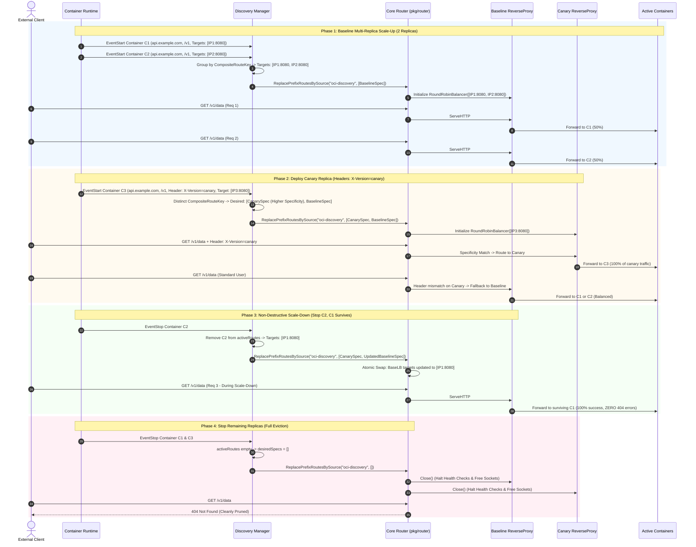
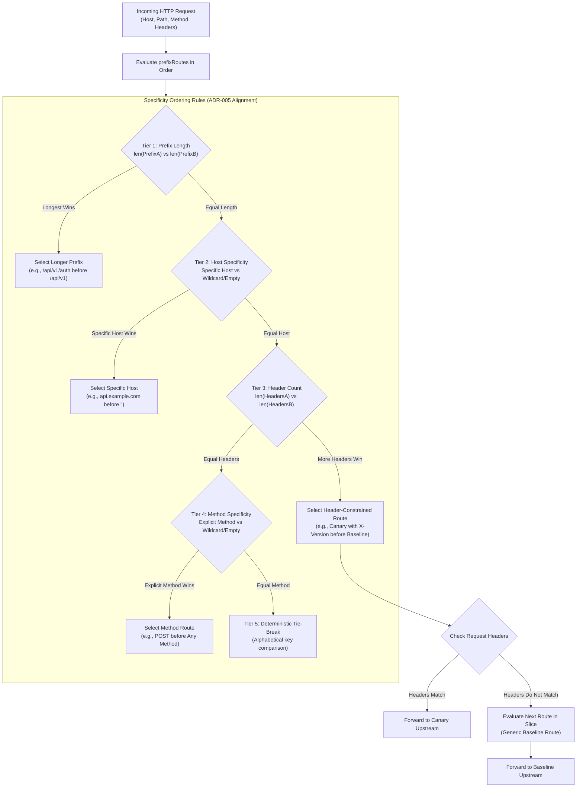

# ADR-095 - Composite Route Key Grouping, Multi-Replica Target Aggregation, and Specificity-Based Route Lifecycle in OCI Discovery Engine

## Context & Problem Statement

Toron Edge Gateway provides an autonomous OCI container auto-discovery engine ([`pkg/discovery/manager.go`](file:///Users/sneha/Developer/toron-research/toron/pkg/discovery/manager.go)) that connects directly to local container runtimes (Docker, Podman, Containerd, CRI-O via universal Unix domain socket REST APIs without third-party SDKs), dynamically inspects container metadata labels, and automatically configures reverse proxy routes within Toron's core routing engine ([`pkg/router/router.go`](file:///Users/sneha/Developer/toron-research/toron/pkg/router/router.go)).

During comprehensive security audit [`SR-091 Finding 4`](file:///Users/sneha/Developer/toron-research/toron/docs/securityReview/SR-091.md#L154-L171) and vulnerability tracking [`SEC-34`](file:///Users/sneha/Developer/toron-research/toron/SECURITY_AUDIT.md#L465-L473) ([CWE-400 Uncontrolled Resource Consumption](https://cwe.mitre.org/data/definitions/400.html), [CWE-284 Improper Access Control](https://cwe.mitre.org/data/definitions/284.html), [CWE-662 Improper Synchronization](https://cwe.mitre.org/data/definitions/662.html)), severe architectural defects were identified in how the OCI container discovery manager interacts with the core router during container scale-up, scale-down, restarts, and multi-dimensional routing scenarios.

### Analysis of Prior Implementation & Failure Modes

In [`pkg/discovery/manager.go:L207-L256`](file:///Users/sneha/Developer/toron-research/toron/pkg/discovery/manager.go#L207-L256), the container discovery manager handles container lifecycle events as follows:

```go
func (m *Manager) handleContainerStart(c Container) {
    route, ok := ParseContainerLabels(c, m.cfg.DefaultWeight)
    ...
    m.activeRoutes[c.ID] = route
    if m.router != nil {
        opts := proxy.ProxyOptions{
            Targets:           []string{route.TargetURL()},
            StripPrefix:       route.StripPrefix,
            RewriteRedirects:  route.RewriteRedirects,
            RewriteCookiePath: route.RewriteCookiePath,
        }
        _ = m.router.RoutePrefix("upstream", route.Host, route.Prefix, nil, "", opts)
    }
}

func (m *Manager) handleContainerStop(containerID string) {
    ...
    delete(m.activeRoutes, containerID)
    if m.router != nil {
        m.router.RemovePrefixRoute(route.Host, route.Prefix)
    }
}
```

This interaction produces five critical failure modes:

1. **Premature Route Deletion & Service Outage (CWE-662, CWE-284)**:
   When multiple container replicas serve the same service (e.g., 3 container instances sharing `toron.host: api.example.com` and `toron.prefix: /v1`), stopping or restarting a single container replica invokes `m.router.RemovePrefixRoute(route.Host, route.Prefix)`. In [`pkg/router/router.go:L868-L893`](file:///Users/sneha/Developer/toron-research/toron/pkg/router/router.go#L868-L893), `RemovePrefixRoute` purges **all** prefix routes matching `(host, prefix)` from `r.prefixRoutes`. Consequently, terminating or restarting one replica immediately cuts off traffic to all surviving healthy replicas, inducing a total service outage (HTTP `404 Not Found`).
2. **Horizontal Load-Balancing Defeat & Single-Instance Overload (CWE-400)**:
   In `handleContainerStart`, each container is registered as an independent, single-target prefix route: `Targets: []string{route.TargetURL()}`. In [`pkg/router/router.go:L626-L644`](file:///Users/sneha/Developer/toron-research/toron/pkg/router/router.go#L626-L644), `router.ServeHTTP` scans `r.prefixRoutes` linearly and selects the *first matching route*. Because replica #1 was appended first, **replica #1 receives 100% of all incoming requests**, while replicas #2 through $M$ receive 0% of traffic. Horizontal scaling is completely incapacitated, and single container instances suffer cascading overload crashes.
3. **Routing Dimension Blindness & Variant Collision**:
   The discovery engine previously parsed only `toron.host` and `toron.prefix`. It lacked support for HTTP method constraints (`toron.method`) and HTTP header constraints (`toron.header.<Name>`, `toron.headers`). Grouping routes solely by `(Host, Prefix)` conflates distinct traffic variants (such as Canary deployments with `X-Version: canary` vs Baseline deployments with no headers, or `POST` vs `GET` endpoints). If container discovery groups solely by `(Host, Prefix)`, canary containers would either overwrite baseline containers or be merged into the same target pool, leaking pre-release code to normal production users.
4. **Route Shadowing & Specificity Ordering Defeat**:
   When routes with varying specificity exist (e.g., generic prefix `/api` vs specific prefix `/api/v1/auth`, or unconstrained route vs header-constrained Canary route), `ServeHTTP` matches whichever route appears earlier in `r.prefixRoutes`. If an unconstrained generic route is registered before a Canary route, the generic route shadows the Canary route, preventing Canary requests from ever reaching the Canary container. In accordance with [`ADR-005`](file:///Users/sneha/Developer/toron-research/toron/docs/architecture/ADR-005.md), routes must be evaluated in strict order of specificity.
5. **Lack of Method Support in Declarative Prefix Routes**:
   [`PrefixRouteSpec`](file:///Users/sneha/Developer/toron-research/toron/pkg/router/router.go#L172-L179) lacked an explicit `Method string` field. When compiling prefix routes via `compilePrefixRoute`, the internal `prefixRoute.method` field was left empty, preventing declarative prefix routes from filtering by HTTP method.
6. **Socket & Goroutine Leaks on Route Churn (CWE-775)**:
   When routes are removed or replaced, discarded reverse proxies with active health check ticker goroutines (`UpstreamTarget.StartActiveHealthCheck`) linger indefinitely in heap memory, leaking network socket descriptors (`EMFILE`) and background goroutines.

Remediating `SEC-34` through `REQ-095` and `TASK-118` establishes a resilient, **composite-key grouped, multi-replica aggregated, specificity-ordered, and atomically reconciled route lifecycle** in the OCI discovery engine and core router.

---

## Architectural Decisions

### Decision 1: Model Extension and Container Label Parsing

To enable multi-dimensional routing in containerized environments, the discovered route model and label parser must capture HTTP method and header matching constraints in addition to host, path, and port parameters.

#### 1.1 Extended `DiscoveredRoute` Model

In [`pkg/discovery/provider.go`](file:///Users/sneha/Developer/toron-research/toron/pkg/discovery/provider.go), the `DiscoveredRoute` struct is extended with `Method` and `Headers`:

```go
// DiscoveredRoute captures routing specifications extracted from container labels or annotations.
type DiscoveredRoute struct {
    ContainerID       string
    ContainerName     string
    Host              string
    Prefix            string
    Method            string            // Normalized uppercase HTTP method constraint (e.g., "GET", "POST"), or "" for any method
    Headers           map[string]string // Canonical HTTP header match constraints (e.g., {"X-Version": "canary"})
    TargetIP          string
    TargetPort        int
    Weight            int
    HealthCheckPath   string
    StripPrefix       *bool
    RewriteRedirects  *bool
    RewriteCookiePath *bool
}
```

- **`Method string`**: Represents an HTTP method constraint. Stored in uppercase format without leading/trailing whitespace. If empty (`""`), the route matches any HTTP method.
- **`Headers map[string]string`**: Stores exact key-value match requirements. Incoming requests must satisfy all specified headers (`AND` logic) to match the route.
- The `ActiveRoutes()` snapshot method on [`Manager`](file:///Users/sneha/Developer/toron-research/toron/pkg/discovery/manager.go) exposes the populated `Method` and `Headers` fields for administrative telemetry, CLI inspection, and observability parity.

#### 1.2 Label Parsing Specifications

In [`pkg/discovery/parser.go`](file:///Users/sneha/Developer/toron-research/toron/pkg/discovery/parser.go), new label constants and parsing logic are introduced:

```go
const (
    LabelMethod       = "toron.method"
    LabelHeaders      = "toron.headers"
    LabelHeaderPrefix = "toron.header."
)
```

`ParseContainerLabels(container Container, defaultWeight int) (*DiscoveredRoute, bool)` enforces the following extraction rules:

1. **Method Parsing (`toron.method`)**:
   - If `container.Labels[LabelMethod]` is present, trim whitespace and normalize to uppercase:
     ```go
     method := strings.ToUpper(strings.TrimSpace(container.Labels[LabelMethod]))
     ```
2. **Individual Header Parsing (`toron.header.<Name>`)**:
   - Iterate over all keys in `container.Labels`.
   - For every key prefixed with `toron.header.`:
     - Header Name: `strings.TrimSpace(key[len(LabelHeaderPrefix):])`
     - Header Value: `strings.TrimSpace(val)`
     - Add to `headers[headerName] = headerValue`.
3. **Grouped Headers Parsing (`toron.headers`)**:
   - Supports two serialization formats:
     - **JSON Object Format**: If the trimmed value starts with `{` and ends with `}`, parse via `json.Unmarshal([]byte(val), &jsonMap)`. Non-empty key-value pairs are merged into `headers`.
     - **Delimited Key-Value Format**: Otherwise, split by `,` (comma), then split each token by `=` via `strings.SplitN(token, "=", 2)`. Trim whitespace from key and value; merge into `headers`.
4. **Precedence and Resilience**:
   - If both `toron.header.<Name>` and `toron.headers` are specified, individual `toron.header.<Name>` labels take precedence over `toron.headers` keys.
   - Malformed JSON in `toron.headers` falls back gracefully to comma-delimited parsing or is ignored without panicking or rejecting the container.
   - If no headers are configured, `Headers` is retained as `nil` (or an empty map) to minimize memory allocations.

---

### Decision 2: Multi-Dimensional Partitioning via `CompositeRouteKey`

To prevent variant collisions between distinct deployment stages (e.g., Canary vs Baseline) and between distinct HTTP verbs, discovered routes must NOT be grouped solely by `(Host, Prefix)`.

Discovered routes are partitioned using a 4-tuple `CompositeRouteKey`:

$$\text{CompositeRouteKey} = (\text{Host}, \text{Prefix}, \text{Method}, \text{CanonicalHeaders})$$

#### 2.1 Struct Definition & Canonical Header Representation

In [`pkg/discovery/manager.go`](file:///Users/sneha/Developer/toron-research/toron/pkg/discovery/manager.go):

```go
type CompositeRouteKey struct {
    Host             string
    Prefix           string
    Method           string
    CanonicalHeaders string
}
```

- **`Host`**: Normalized lowercase domain host (e.g., `"api.example.com"`). Empty string `""` represents any host.
- **`Prefix`**: Normalized path prefix with leading slash and trimmed trailing slash (e.g., `"/v1"`), or `""` for root prefix.
- **`Method`**: Normalized uppercase HTTP method (e.g., `"POST"`), or `""` for any method.
- **`CanonicalHeaders`**: Deterministic string representation of `Headers map[string]string`.

#### 2.2 Preventing Map Iteration Non-Determinism

In Go, iterating over a `map[string]string` yields pseudo-random key ordering. If serialized naively, identical sets of headers would produce fluctuating composite key strings across reconciliation passes, triggering false route churn.

To guarantee determinism:
1. Extract all keys from `Headers`.
2. Sort keys alphabetically using `sort.Strings(keys)`.
3. Format as a canonical query-string-like representation:
   $$\text{CanonicalHeaders} = \text{key}_1 = \text{val}_1 \ \& \ \text{key}_2 = \text{val}_2 \ \& \ \dots \ \& \ \text{key}_n = \text{val}_n$$
4. If `Headers` is empty or nil, `CanonicalHeaders` is `""`.

#### 2.3 Distinct Variant Separation Invariant

Containers serving the same `Host` and `Prefix` that differ in `Headers` or `Method` produce distinct `CompositeRouteKey`s and separate `PrefixRouteSpec`s:
- **Baseline Group**: 3 container replicas with `Host: "api.example.com"`, `Prefix: "/v1"`, `Headers: nil` produce:
  $$\text{Key}_{\text{base}} = (\text{"api.example.com"}, \text{"/v1"}, \text{""}, \text{""})$$
- **Canary Group**: 1 container replica with `Host: "api.example.com"`, `Prefix: "/v1"`, `Headers: {"X-Version": "canary"}` produces:
  $$\text{Key}_{\text{canary}} = (\text{"api.example.com"}, \text{"/v1"}, \text{""}, \text{"X-Version=canary"})$$

Because their keys are distinct, baseline and canary target pools remain strictly isolated. Canary traffic never leaks to baseline pods, and baseline traffic never hits canary pods.

---

### Decision 3: Multi-Replica Target Aggregation & Load Balancing

When multiple container replicas share an identical `CompositeRouteKey`, they represent horizontal instances of the same service. Rather than registering individual single-target routes that starve subsequent replicas, the discovery manager aggregates their target endpoints into a unified multi-target reverse proxy.

#### 3.1 Aggregation Algorithm (`recalculateDesiredSpecsLocked`)

Under `m.mu.Lock()` in [`pkg/discovery/manager.go`](file:///Users/sneha/Developer/toron-research/toron/pkg/discovery/manager.go):

1. **Partitioning**: Group all entries in `m.activeRoutes` by `CompositeRouteKey`.
2. **Target Collection & Deduplication**:
   - For each group, extract `route.TargetURL()` for every container replica in that group.
   - Deduplicate target URLs using `seen := make(map[string]struct{})`.
3. **Deterministic Sorting**:
   - Sort `Targets` alphabetically (`sort.Strings(targets)`). This prevents order oscillation between resync passes.
4. **Proxy Option Aggregation**:
   - `Targets`: Consolidated slice of deduplicated upstream URLs.
   - `Algorithm`: Set to `proxy.AlgorithmRoundRobin`.
   - `StripPrefix`, `RewriteRedirects`, `RewriteCookiePath`: Inherited from the first replica defining a non-nil value.
   - `HealthCheckPath`: Inherited from the first replica defining a non-empty path.
5. **Route Spec Construction**:
   - Build `router.PrefixRouteSpec`:
     ```go
     spec := router.PrefixRouteSpec{
         TargetType: router.RouteTypeUpstream,
         Host:       key.Host,
         Prefix:     key.Prefix,
         Method:     key.Method,
         Headers:    groupHeaders,
         Opts:       opts,
     }
     ```
6. **Load Distribution Invariant**:
   With `RoundRobinBalancer`, incoming requests matching the composite key are distributed evenly across all $M$ active replicas:
   $$\text{Traffic Share} \approx \frac{1}{M} \quad \forall \text{ replica } i \in \{1, \dots, M\}$$
   Single-instance starvation is completely eliminated, restoring horizontal scaling efficacy.

---

### Decision 4: Atomic Source-Scoped Lifecycle via `ReplacePrefixRoutesBySource`

To eliminate the race conditions and premature route deletions caused by `RemovePrefixRoute` and `RoutePrefix`, the discovery manager transitions entirely to atomic batch replacement using [`router.ReplacePrefixRoutesBySource("oci-discovery", desiredSpecs)`](file:///Users/sneha/Developer/toron-research/toron/pkg/router/router.go#L307-L350).

#### 4.1 Prohibition of Incremental Route Mutation

Direct calls to `m.router.RoutePrefix` and `m.router.RemovePrefixRoute` within `pkg/discovery` are strictly prohibited. All route synchronization follows a declarative reconciliation pattern:
$$\text{Container Event} \longrightarrow \text{Update Active State} \longrightarrow \text{Recalculate Desired Specs} \longrightarrow \text{Atomic Replace}$$

#### 4.2 Non-Destructive Partial Scale-Down

When 1 replica container of an $M$-replica service ($M \ge 2$) stops, crashes, or is rescheduled:
1. `handleContainerStop(containerID)` acquires `m.mu.Lock()`.
2. The stopping container is removed from `m.activeRoutes`.
3. `recalculateDesiredSpecsLocked()` aggregates the remaining $M-1$ surviving replicas for that `CompositeRouteKey`.
4. `desiredSpecs` contains the updated route with $M-1$ targets in `Opts.Targets`.
5. `m.router.ReplacePrefixRoutesBySource("oci-discovery", desiredSpecs)` is invoked.
6. Under `r.mu.Lock()`, the router compiles the updated reverse proxy and swaps `r.prefixRoutes`.
7. **Zero Downtime Invariant**: Ingress requests arriving concurrently continue to be served by the surviving $M-1$ healthy replicas. No request encounters an HTTP 404 error, dropped TCP connection, or route deletion window.

#### 4.3 Clean Proxy Teardown (`proxy.Close()`) on Eviction

When the last remaining replica of a service terminates:
1. The route is omitted from `desiredSpecs`.
2. In `ReplacePrefixRoutesBySource`:
   - Evicted routes with `source == "oci-discovery"` are segregated.
   - For every evicted route where `pr.proxy != nil`, `pr.proxy.Close()` is invoked.
   - `Close()` signals `RoundRobinBalancer.Stop()`, stopping active health check ticker goroutines (`UpstreamTarget.StopActiveHealthCheck`) and closing idle TCP connections.
   - Frees socket descriptors (`EMFILE`) and terminates background goroutines immediately.

#### 4.4 Source Isolation

Mutations performed by `ReplacePrefixRoutesBySource("oci-discovery", ...)` only touch routes tagged with `source == "oci-discovery"`. Prefix routes owned by other subsystems—such as `"k8s-ingress"`, `"config"`, or `"static"`—remain completely intact and uninterrupted.

---

### Decision 5: Specificity-Based Route Ordering & `PrefixRouteSpec.Method` Support

In Toron's core router ([`pkg/router/router.go`](file:///Users/sneha/Developer/toron-research/toron/pkg/router/router.go)), prefix routes are evaluated sequentially in `ServeHTTP`. In accordance with [`ADR-005`](file:///Users/sneha/Developer/toron-research/toron/docs/architecture/ADR-005.md), routes must be evaluated in strict descending order of specificity to prevent generic fallback routes from shadowing specific routes.

#### 5.1 `PrefixRouteSpec` Method Extension

[`PrefixRouteSpec`](file:///Users/sneha/Developer/toron-research/toron/pkg/router/router.go#L172-L179) is updated to support HTTP methods:

```go
type PrefixRouteSpec struct {
    TargetType RouteType
    Host       string
    Prefix     string
    Method     string            // HTTP method constraint (e.g., "GET", "POST")
    Headers    map[string]string
    DirPath    string
    Opts       proxy.ProxyOptions
}
```

In `compilePrefixRoute`:
- `spec.Method` is trimmed and uppercased: `strings.ToUpper(strings.TrimSpace(spec.Method))`.
- Stored on internal `prefixRoute.method`.
- In `ServeHTTP`: If `pr.method != ""` and `!strings.EqualFold(pr.method, req.Method)`, the route is skipped, recording a method mismatch.
- In `RouteSnapshot`: Expose `Method string `json:"method,omitempty"`` for telemetry inspection via `GetPrefixRoutes()`.

#### 5.2 Specificity Sorting Hierarchy (ADR-005 Alignment)

All prefix routes in `r.prefixRoutes` (and `desiredSpecs`) MUST be sorted according to a 5-tier specificity hierarchy:

```
Tier 1: Prefix Length (Longest prefix first)
   └── /api/v1/auth (len 12) > /api/v1 (len 7) > /api (len 4) > "" (len 0)

Tier 2: Host Specificity (Explicit domain host before wildcard/empty)
   └── host == "api.example.com" > host == ""

Tier 3: Header Specificity (More headers before fewer headers)
   └── len(headers) == 2 > len(headers) == 1 > len(headers) == 0

Tier 4: Method Specificity (Explicit method before any-method)
   └── method == "POST" > method == ""

Tier 5: Deterministic Tie-Breaking (Alphabetical on host, prefix, method, canonical headers)
   └── Guaranteed stable sort order across identical runs
```

#### 5.3 Shadowing Prevention Proof

Consider a gateway with two routes registered on `/api`:
- **Route A (Generic Baseline)**: `Prefix: "/api"`, `Host: ""`, `Headers: {}`, `Method: ""`
- **Route B (Canary Variant)**: `Prefix: "/api"`, `Host: ""`, `Headers: {"X-Version": "canary"}`, `Method: ""`

Under naive registration order, if Route A precedes Route B:
- An incoming request `GET /api/data` with header `X-Version: canary` arrives.
- Router evaluates Route A: `cleanPrefix` matches `/api`, `routeHost` is empty (matches), `expectedHeaders` is empty (matches). Route A matches and intercepts the request.
- Route B is never evaluated. **The canary route is completely shadowed**.

Under Specificity Ordering:
- Comparison between Route A and Route B:
  - Prefix length: identical (both `/api`).
  - Host specificity: identical (both `""`).
  - Header count: Route B has 1 header; Route A has 0 headers.
  - Therefore, **Route B strictly precedes Route A**.
- Evaluation in `ServeHTTP`:
  - Request with `X-Version: canary`: Evaluates Route B first $\to$ Header matches $\to$ Dispatched to Canary container.
  - Request without header: Evaluates Route B first $\to$ Header mismatch $\to$ Falls through to Route A $\to$ Dispatched to Baseline container.
- **Invariant**: Generic fallback routes CANNOT shadow more specific Canary or method-constrained routes, regardless of container discovery arrival order.

---

## Architectural Diagrams

### 1. System Component Interaction & Reconciliation Flow

```mermaid
flowchart TD
    subgraph OCI["Container Runtime Environment"]
        Events["Container Lifecycle Events\n(Start / Stop / Die / Resync)"]
        DockerSock["Universal Unix Socket REST API\n(/var/run/docker.sock)"]
    end

    subgraph Discovery["OCI Discovery Engine (pkg/discovery)"]
        Parser["ParseContainerLabels\nExtract toron.method, toron.header.<Name>, toron.headers"]
        State["m.activeRoutes map[string]*DiscoveredRoute"]
        Grouper["Group by CompositeRouteKey\n(Host, Prefix, Method, CanonicalHeaders)"]
        Aggregator["Aggregate Replicas into Targets: []string\nDeduplicate & Sort Targets"]
        Sorter["Sort desiredSpecs by Specificity\n(ADR-005 Specificity Ordering)"]
    end

    subgraph Router["Core Router Engine (pkg/router)"]
        Replace["ReplacePrefixRoutesBySource('oci-discovery', desiredSpecs)"]
        PartitionLock["Under r.mu.Lock():\nRetain Other Sources ('config', 'k8s-ingress')\nEvict Old 'oci-discovery' Routes\nInstall New Specificity-Ordered Routes"]
        Teardown["Invoke Close() on Evicted Proxies\n(Halt Active Health Checks & Close Sockets)"]
    end

    subgraph ClientTraffic["Runtime Client Traffic Dispatching"]
        ReqCanary["Request with X-Version: canary\nGET /v1/resource"] --> PriorityCheck{"Router Linear Scan\n(Specificity-Ordered)"}
        ReqBase["Request without Header\nGET /v1/resource"] --> PriorityCheck

        PriorityCheck -->|Matches Canary (Tier 3)| CanaryLB["Canary Upstream Proxy\n(RoundRobin)"]
        PriorityCheck -->|Falls through to Baseline| BaseLB["Baseline Upstream Proxy\n(RoundRobin)"]

        CanaryLB --> CanaryPod["Canary Container #1 (100%)"]
        BaseLB --> Base1["Baseline Container #1 (50%)"]
        BaseLB --> Base2["Baseline Container #2 (50%)"]
    end

    Events --> DockerSock
    DockerSock --> Parser
    Parser --> State
    State --> Grouper
    Grouper --> Aggregator
    Aggregator --> Sorter
    Sorter --> Replace
    Replace --> PartitionLock
    PartitionLock --> Teardown
```

---

### 2. Container Lifecycle Sequence Diagram (Scale-Up, Scale-Down, Canary)



---

### 3. Specificity Ordering Evaluation Hierarchy



---

## Alternatives Considered & Trade-Off Analysis

### Alternative 1: Dynamic Radix Tree or Multi-Index Map Routing
- **Description**: Replace the linear route slice `r.prefixRoutes` with a concurrent radix tree or multi-dimensional hash map indexed by `(Host, Path, Method, Headers)`.
- **Evaluation & Trade-offs**:
  - *Pros*: Theoretical $O(1)$ or $O(L)$ exact lookup complexity for routing tables exceeding 10,000 routes.
  - *Cons*:
    1. Toron's prefix routes support multifaceted, conditional match criteria: host wildcards, path prefixes with longest-match semantics, HTTP verb constraints, and arbitrary header rules. A radix tree capable of backtracking over variable header constraints and wildcard fallbacks is immensely complex and difficult to make thread-safe without heavy lock contention.
    2. Edge gateway deployments typically host between 10 and 500 routes. In modern x86/ARM64 architectures, traversing a contiguous in-memory slice of 100 entries benefits from CPU L1/L2 cache prefetching and completes in under 100 nanoseconds—substantially faster than pointer-chasing through a radix tree.
    3. Radix tree mutations in Go require either fine-grained tree locking or complex copy-on-write pointer trees, creating significant garbage collection pressure.
- **Decision**: **Rejected**. Retain linear slice iteration for prefix routes, maintaining the specificity ordering invariant defined in `ADR-005` via `ReplacePrefixRoutesBySource`.

---

### Alternative 2: Incremental Route Mutation via `RemovePrefixRoute` and `RoutePrefix`
- **Description**: Maintain discovery state in `Manager`, calculate set diffs on container events, and issue individual `RemovePrefixRoute` and `RoutePrefix` calls.
- **Evaluation & Trade-offs**:
  - *Pros*: Avoids recalculating the full route specification table on every container event.
  - *Cons*:
    1. **Transient Outages (Window of Vulnerability)**: During the time window between `RemovePrefixRoute` and `RoutePrefix`, incoming requests encounter HTTP 404 Not Found errors.
    2. **Lock Thrashing**: Mutating $K$ routes incrementally requires $2K$ separate write lock acquisitions (`r.mu.Lock()`), degrading request processing throughput.
    3. **Partial Failure**: If an error occurs midway through registering updated routes, the router is left in an inconsistent, partially updated state.
- **Decision**: **Rejected**. Source-tagged atomic replacement (`ReplacePrefixRoutesBySource`) performs all-or-nothing replacement under a single lock acquisition with zero transient 404s.

---

### Alternative 3: Individual 1-Target Routes per Container Replica
- **Description**: Preserve the legacy translation model where each container registers an independent single-target route, but modify `router.ServeHTTP` to randomly pick among matching routes.
- **Evaluation & Trade-offs**:
  - *Pros*: Avoids target aggregation logic in `discovery.Manager`.
  - *Cons*:
    1. Violates separation of concerns: router's responsibility is path and host dispatching, whereas load balancing across multiple targets belongs to `pkg/proxy.LoadBalancer`.
    2. Duplicates reverse proxy instances, rate limiters, auth middleware, and WAF engines $M$ times for $M$ container replicas, multiplying memory and CPU consumption.
    3. Defeats advanced balancer features (smooth weighted round-robin, active health checking, least connections) implemented in `pkg/proxy`.
- **Decision**: **Rejected**. Aggregate all container replicas sharing a `CompositeRouteKey` into a single multi-target reverse proxy configured with `proxy.AlgorithmRoundRobin`.

---

### Alternative 4: Serialization of `CanonicalHeaders` via JSON vs Sorted Query-String
- **Description**: Serialize `Headers map[string]string` to a JSON string (`{"k1":"v1","k2":"v2"}`) for the composite route key.
- **Evaluation & Trade-offs**:
  - *Pros*: Standard JSON serialization.
  - *Cons*: `json.Marshal` on Go maps sorts keys, but incurs JSON buffer allocation and string escaping overhead. A lightweight key-value concatenation (`k1=v1&k2=v2`) with pre-allocated string builder is faster and uses fewer allocations.
- **Decision**: Use sorted key-value concatenation (`k1=v1&k2=v2`) for `CanonicalHeaders`.

---

## Security Invariants & Threat Modeling

| Threat Scenario | Vulnerability & CWE | Prior Behavior (Vulnerable) | Remediated Architecture (ADR-095) |
| :--- | :--- | :--- | :--- |
| **Premature Route Deletion on Replica Stop** | [CWE-662](https://cwe.mitre.org/data/definitions/662.html) / [CWE-284](https://cwe.mitre.org/data/definitions/284.html) | `handleContainerStop` invoked `RemovePrefixRoute`, wiping the route for all surviving replicas (Total Denial of Service). | `ReplacePrefixRoutesBySource` updates `Targets` to the surviving replicas. Zero dropped requests, zero 404s. |
| **Horizontal Scaling Defeat & Pod Overload** | [CWE-400](https://cwe.mitre.org/data/definitions/400.html) | Replicas added as separate 1-target routes; first-match routing routed 100% traffic to replica #1. Replicas #2..M starved. | Replicas aggregated into a unified reverse proxy with `RoundRobinBalancer`. Traffic distributed evenly ($\approx 1/M$). |
| **Canary Traffic Pollution & Variant Conflation** | Traffic Segmentation Defeat | Discovery grouped only by `(Host, Prefix)`. Canary and baseline backends conflated into one target pool. | Partitioned by `CompositeRouteKey = (Host, Prefix, Method, CanonicalHeaders)`. Canary and baseline pools strictly segregated. |
| **Canary Route Shadowing** | Specificity Order Violation | Routes evaluated in registration order. Generic route inserted first shadowed Canary route. | Router sorts prefix routes by specificity (ADR-005). Header-constrained Canary routes strictly precede generic routes. |
| **Missing Declarative Method Enforcement** | Incomplete Access Control | `PrefixRouteSpec` lacked `Method`; matched all HTTP verbs indiscriminately. | `PrefixRouteSpec.Method` enforced; non-matching HTTP verbs return 405 Method Not Allowed or continue matching. |
| **Socket & Goroutine Exhaustion on Route Churn** | [CWE-775](https://cwe.mitre.org/data/definitions/775.html) Resource Leak | Discarded reverse proxies left running in memory with active background health checks. | `ReplacePrefixRoutesBySource` invokes `pr.proxy.Close()` on all evicted proxies, stopping health checks and closing sockets. |

### Architectural Security Invariants

1. **Zero Downtime Invariant**: Scale-down or single-replica crash MUST NOT cause 404 or connection loss for traffic destined to surviving replicas.
2. **Strict Specificity Ordering Invariant**: More specific routes (longest prefix, specific host, header-constrained, method-constrained) MUST ALWAYS precede less specific routes in route evaluation.
3. **Load-Balancing Fairness Invariant**: Multi-replica services MUST balance traffic evenly across all healthy container instances ($\approx 1/M$ per replica).
4. **Clean Resource Teardown Invariant**: Evicted reverse proxies MUST have `Close()` invoked immediately, preventing goroutine and socket leaks (`EMFILE`).
5. **Zero Third-Party Dependency Invariant**: All data structures, label parsers, composite key formatters, and route sorters MUST strictly use the Go standard library (`sync`, `net/http`, `net/url`, `sort`, `strings`, `encoding/json`).
6. **Thread Safety & Race-Freedom**: All router and manager state mutations MUST be 100% data-race-free under `go test -race ./pkg/discovery/... ./pkg/router/...`.

---

## Traceability & Verification Matrix

| Requirement / Artifact | Component / File | Scope | Verification Target ([`TC-095`](file:///Users/sneha/Developer/toron-research/toron/docs/testCases/TC-095.md)) |
| :--- | :--- | :--- | :--- |
| [`REQ-095-AC-01`](file:///Users/sneha/Developer/toron-research/toron/docs/requirements/REQ-095.md#L117-L122)<br>[`TASK-118`](file:///Users/sneha/Developer/toron-research/toron/docs/tasks/TASK-118.md) | [`pkg/discovery/provider.go`](file:///Users/sneha/Developer/toron-research/toron/pkg/discovery/provider.go) | `DiscoveredRoute` struct extended with `Method` and `Headers`. `ActiveRoutes()` snapshot reflects fields. | `TestParseContainerLabels_MethodAndHeaders` |
| [`REQ-095-AC-02`](file:///Users/sneha/Developer/toron-research/toron/docs/requirements/REQ-095.md#L123-L132)<br>[`TASK-118`](file:///Users/sneha/Developer/toron-research/toron/docs/tasks/TASK-118.md) | [`pkg/discovery/parser.go`](file:///Users/sneha/Developer/toron-research/toron/pkg/discovery/parser.go) | `ParseContainerLabels` extracts `toron.method`, individual `toron.header.<Name>`, and `toron.headers` (CSV & JSON). | `TestParseContainerLabels_MethodAndHeaders` |
| [`REQ-095-AC-03`](file:///Users/sneha/Developer/toron-research/toron/docs/requirements/REQ-095.md#L133-L147)<br>[`TASK-118`](file:///Users/sneha/Developer/toron-research/toron/docs/tasks/TASK-118.md) | [`pkg/discovery/manager.go`](file:///Users/sneha/Developer/toron-research/toron/pkg/discovery/manager.go) | Multi-replica containers grouped by `CompositeRouteKey`. Replicas aggregated into unified multi-target `RoundRobinBalancer`. | `TestDiscoveryManager_CompositeRouteKeyAggregation` |
| [`REQ-095-AC-04`](file:///Users/sneha/Developer/toron-research/toron/docs/requirements/REQ-095.md#L148-L159)<br>[`TASK-118`](file:///Users/sneha/Developer/toron-research/toron/docs/tasks/TASK-118.md) | [`pkg/discovery/manager.go`](file:///Users/sneha/Developer/toron-research/toron/pkg/discovery/manager.go) | Atomic route replacement via `ReplacePrefixRoutesBySource("oci-discovery", desiredSpecs)` across all events. | `TestDiscoveryManager_AtomicReplacementLifecycle` |
| [`REQ-095-AC-05`](file:///Users/sneha/Developer/toron-research/toron/docs/requirements/REQ-095.md#L160-L166)<br>[`TASK-118`](file:///Users/sneha/Developer/toron-research/toron/docs/tasks/TASK-118.md) | [`pkg/discovery/manager.go`](file:///Users/sneha/Developer/toron-research/toron/pkg/discovery/manager.go) | Stopping 1 of $M$ replicas retains surviving $M-1$ replicas. Zero HTTP 404 errors, zero downtime. | `TestDiscoveryManager_NonDestructivePartialScaleDown` |
| [`REQ-095-AC-06`](file:///Users/sneha/Developer/toron-research/toron/docs/requirements/REQ-095.md#L167-L173)<br>[`TASK-118`](file:///Users/sneha/Developer/toron-research/toron/docs/tasks/TASK-118.md) | [`pkg/discovery/manager.go`](file:///Users/sneha/Developer/toron-research/toron/pkg/discovery/manager.go) | Canary and baseline containers produce distinct `CompositeRouteKey`s and separate route specs. Isolated target pools. | `TestDiscoveryManager_DistinctVariantCanarySeparation` |
| [`REQ-095-AC-07`](file:///Users/sneha/Developer/toron-research/toron/docs/requirements/REQ-095.md#L174-L185)<br>[`TASK-118`](file:///Users/sneha/Developer/toron-research/toron/docs/tasks/TASK-118.md) | [`pkg/router/router.go`](file:///Users/sneha/Developer/toron-research/toron/pkg/router/router.go) | `PrefixRouteSpec` gains `Method`. Specificity sorting (prefix $\to$ host $\to$ headers $\to$ method) prevents route shadowing. | `TestRouter_SpecificityOrdering_NoCanaryShadowing`<br>`TestRouter_PrefixRouteSpec_MethodMatching` |
| [`REQ-095-AC-08`](file:///Users/sneha/Developer/toron-research/toron/docs/requirements/REQ-095.md#L186-L191)<br>[`TASK-118`](file:///Users/sneha/Developer/toron-research/toron/docs/tasks/TASK-118.md) | [`pkg/proxy/proxy.go`](file:///Users/sneha/Developer/toron-research/toron/pkg/proxy/proxy.go)<br>[`pkg/router/router.go`](file:///Users/sneha/Developer/toron-research/toron/pkg/router/router.go) | Discarded reverse proxies have `Close()` invoked, halting health check goroutines and closing TCP sockets. | `TestDiscoveryManager_AtomicReplacementLifecycle` |
| [`REQ-095-AC-09`](file:///Users/sneha/Developer/toron-research/toron/docs/requirements/REQ-095.md#L192-L195)<br>[`TASK-118`](file:///Users/sneha/Developer/toron-research/toron/docs/tasks/TASK-118.md) | Pure Go Standard Library | 100% data-race-free under `go test -race ./pkg/discovery/... ./pkg/router/...`. Zero external dependencies. | `TestDiscoveryManager_ConcurrentLifecycleAndRouting_RaceClean` |

---

## Status & Governance Sign-Off

> [!NOTE]
> This Architecture Decision Record is **approved** for implementation. Implementation task [`TASK-118`](file:///Users/sneha/Developer/toron-research/toron/docs/tasks/TASK-118.md) and verification test suite [`TC-095`](file:///Users/sneha/Developer/toron-research/toron/docs/testCases/TC-095.md) are authorized to commence.
