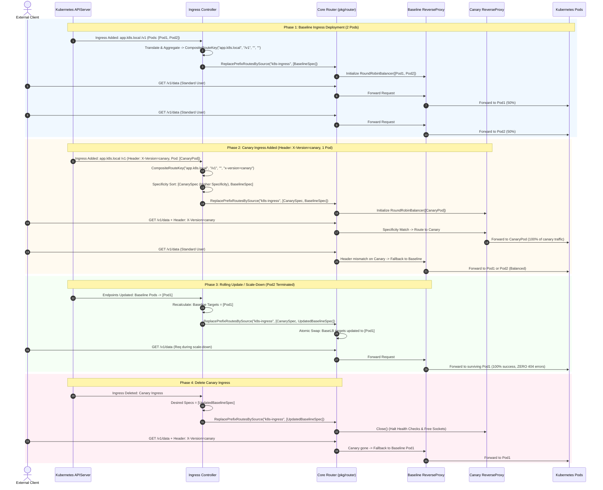
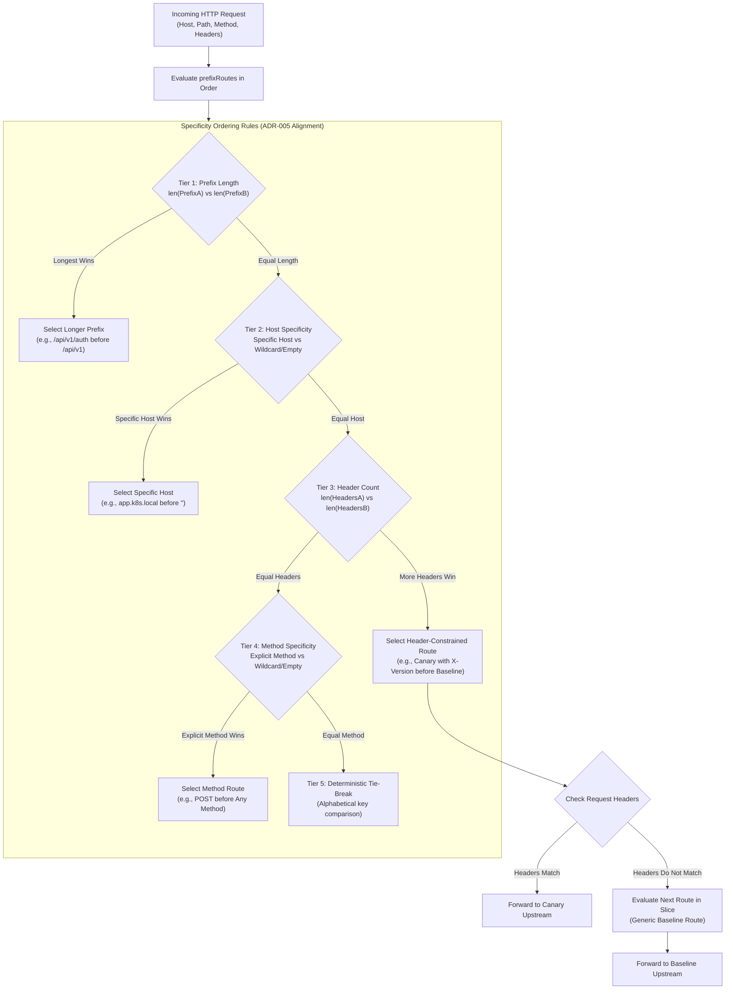

# ADR-096 - Composite Route Key Grouping, Multi-Pod Target Aggregation, and Specificity-Based Route Lifecycle in Kubernetes Ingress Controller

## Context & Problem Statement

Toron Edge Gateway provides a native, zero-dependency Kubernetes Ingress Controller ([`pkg/ingress/controller.go`](file:///Users/sneha/Developer/toron-research/toron/pkg/ingress/controller.go)) designed to watch `networking.k8s.io/v1` `Ingress` and `Endpoints` resources from the Kubernetes API server, translate them into upstream reverse proxies ([`pkg/ingress/translator.go`](file:///Users/sneha/Developer/toron-research/toron/pkg/ingress/translator.go)), and dynamically register prefix routes within the core routing engine ([`pkg/router/router.go`](file:///Users/sneha/Developer/toron-research/toron/pkg/router/router.go)).

While [`REQ-094`](file:///Users/sneha/Developer/toron-research/toron/docs/requirements/REQ-094.md) / [`ADR-089`](file:///Users/sneha/Developer/toron-research/toron/docs/architecture/ADR-089.md) introduced source-scoped atomic route replacement (`ReplacePrefixRoutesBySource`) and fundamental pod target aggregation, and [`REQ-095`](file:///Users/sneha/Developer/toron-research/toron/docs/requirements/REQ-095.md) / [`ADR-095`](file:///Users/sneha/Developer/toron-research/toron/docs/architecture/ADR-095.md) established the 4-dimensional `CompositeRouteKey` and specificity ordering hierarchy for the OCI container discovery engine, Toron's Kubernetes Ingress Controller remained constrained by a naive 2-tuple grouping model: `routeKey{host, prefix}`.

### Analysis of Prior Implementation & Failure Modes

In [`pkg/ingress/controller.go:L143-L192`](file:///Users/sneha/Developer/toron-research/toron/pkg/ingress/controller.go#L143-L192), the controller translates and reconciles Ingress resources as follows:

```go
type routeKey struct {
    host   string
    prefix string
}

newRoutes := make(map[string]*discovery.DiscoveredRoute)
var keyOrder []routeKey
targetsByKey := make(map[routeKey][]string)
seenTarget := make(map[routeKey]map[string]bool)

for _, ing := range ingList {
    routes, ok := TranslateIngress(ing, c.cfg.IngressClass, endpointsMap)
    ...
    for _, r := range routes {
        ...
        k := routeKey{host: host, prefix: cleanPrefix}
        targetURL := r.TargetURL()
        ...
        targetsByKey[k] = append(targetsByKey[k], targetURL)
    }
}

specs := make([]router.PrefixRouteSpec, 0, len(keyOrder))
for _, k := range keyOrder {
    specs = append(specs, router.PrefixRouteSpec{
        TargetType: router.RouteTypeUpstream,
        Host:       k.host,
        Prefix:     k.prefix,
        Opts: proxy.ProxyOptions{
            Targets:   targetsByKey[k],
            Algorithm: proxy.AlgorithmRoundRobin,
        },
    })
}
```

This interaction produces five critical failure modes:

1. **Canary Target Pool Pollution & Traffic Bleed**:
   In modern Kubernetes deployments, Canary and A/B releases are defined by creating a secondary Ingress sharing the same Host and Path Prefix as the baseline service, but constrained by annotations such as `nginx.ingress.kubernetes.io/canary: "true"` and `nginx.ingress.kubernetes.io/canary-by-header: "X-Version"` (or Toron native annotations `toron.io/header.X-Version: "canary"`). Because `controller.go` grouped solely on `(Host, Prefix)`, Canary pod IPs and Baseline pod IPs were merged into a single shared target pool. Baseline users without the header received unvalidated canary traffic ($\approx 33\text{--}50\%$), causing data corruption and breaking release controls.
2. **Missing Ingress Annotation Parsing**:
   In [`pkg/ingress/translator.go`](file:///Users/sneha/Developer/toron-research/toron/pkg/ingress/translator.go), `TranslateIngress` ignored Ingress annotations for routing constraints. Neither Toron annotations (`toron.io/method`, `toron.io/header.<Name>`, `toron.io/headers`) nor standard Ingress-NGINX Canary annotations (`nginx.ingress.kubernetes.io/canary*`) were parsed. Consequently, `DiscoveredRoute.Method` and `DiscoveredRoute.Headers` remained empty.
3. **Route Shadowing & Non-Deterministic Discovery Order (CWE-284)**:
   When generating `specs`, `controller.go` preserved the arbitrary order of Ingress objects returned by the Kubernetes API server (`keyOrder`). In `router.ServeHTTP`, linear prefix matching halts on the *first matching route*. If the baseline Ingress was discovered prior to the canary Ingress, the generic baseline route matched all incoming requests, completely shadowing the canary route. In accordance with [`ADR-005`](file:///Users/sneha/Developer/toron-research/toron/docs/architecture/ADR-005.md), routes must be evaluated in strict order of specificity.
4. **Incomplete Route Spec Population**:
   `controller.go` constructed `PrefixRouteSpec` without populating `Method` or `Headers`. Even if `TranslateIngress` were to provide them, the router would receive empty headers and wildcard methods, failing to enforce traffic filtering.
5. **Architectural Parity Deficit**:
   A disconnect existed between the advanced `CompositeRouteKey` architecture in OCI Discovery ([`ADR-095`](file:///Users/sneha/Developer/toron-research/toron/docs/architecture/ADR-095.md)) and the Kubernetes Ingress subsystem, preventing seamless multi-cluster or hybrid edge routing.

Remediating these deficiencies through [`REQ-096`](file:///Users/sneha/Developer/toron-research/toron/docs/requirements/REQ-096.md) and [`TASK-119`](file:///Users/sneha/Developer/toron-research/toron/docs/tasks/TASK-119.md) establishes full architectural parity: **annotation-driven multi-dimensional grouping, multi-pod target aggregation, strict variant isolation, and specificity-ordered atomic lifecycle** in Toron's Kubernetes Ingress Controller.

---

## Architectural Decisions

### Decision 1: Annotation Parsing Grammar & Route Translation

To enable multi-dimensional routing in Kubernetes environments without custom CRDs, `TranslateIngress` in [`pkg/ingress/translator.go`](file:///Users/sneha/Developer/toron-research/toron/pkg/ingress/translator.go) is extended to parse both native Toron annotations and industry-standard Ingress-NGINX Canary annotations.

#### 1.1 Supported Annotations Grammar

```go
const (
    AnnotationMethod               = "toron.io/method"
    AnnotationHeaders              = "toron.io/headers"
    AnnotationHeaderPrefix         = "toron.io/header."
    AnnotationNginxCanary          = "nginx.ingress.kubernetes.io/canary"
    AnnotationNginxCanaryHeader    = "nginx.ingress.kubernetes.io/canary-by-header"
    AnnotationNginxCanaryHeaderVal = "nginx.ingress.kubernetes.io/canary-by-header-value"
)
```

The parsing rules in `TranslateIngress` are defined as follows:

1. **HTTP Method Constraint (`toron.io/method`)**:
   - If present in `ing.Metadata.Annotations`, trim leading and trailing whitespace and convert to uppercase:
     ```go
     method := strings.ToUpper(strings.TrimSpace(ing.Metadata.Annotations[AnnotationMethod]))
     ```
   - If not set or empty, `method = ""` (matches any HTTP verb).

2. **Grouped Header Constraints (`toron.io/headers`)**:
   - Supports two serialization formats:
     - **JSON Object Format**: If the trimmed string begins with `{` and ends with `}`, it is unmarshaled via `json.Unmarshal([]byte(val), &jsonMap)`. Valid non-empty key-value pairs are merged into `headers`.
     - **Comma-Delimited List Format**: Otherwise, split by `,` (comma), and split each token by `=` via `strings.SplitN(token, "=", 2)`. Trim whitespace from key and value and insert into `headers`.
   - Malformed JSON or invalid tokens are handled gracefully without panicking.

3. **Individual Header Constraints (`toron.io/header.<Name>`)**:
   - Scan `ing.Metadata.Annotations` for keys prefixed with `toron.io/header.`.
   - Header Key: `strings.TrimSpace(key[len(AnnotationHeaderPrefix):])`.
   - Header Value: `strings.TrimSpace(val)`.
   - Individual annotations merge additively with `toron.io/headers` and override conflicting keys.

4. **Industry-Standard NGINX Canary Compatibility (`nginx.ingress.kubernetes.io/canary*`)**:
   - When `strings.ToLower(strings.TrimSpace(ing.Metadata.Annotations[AnnotationNginxCanary])) == "true"`:
     - Header Key: `strings.TrimSpace(ing.Metadata.Annotations[AnnotationNginxCanaryHeader])`.
     - If Header Key is non-empty:
       - Header Value: `strings.TrimSpace(ing.Metadata.Annotations[AnnotationNginxCanaryHeaderVal])`.
       - If Header Value is omitted or empty, it MUST default to `"always"` in strict adherence to the Ingress-NGINX specification.
       - The extracted canary header constraint is added to `headers` unless an explicit `toron.io/header.<Name>` already exists.

5. **Route Model Population**:
   - For each generated route, `DiscoveredRoute.Method` and `DiscoveredRoute.Headers` are populated:
     ```go
     r := &discovery.DiscoveredRoute{
         ContainerID:   fmt.Sprintf("k8s-%s-%s-%s-%d", ing.Metadata.Namespace, ing.Metadata.Name, svcName, idx),
         ContainerName: fmt.Sprintf("%s/%s", ing.Metadata.Namespace, svcName),
         Host:          host,
         Prefix:        prefix,
         Method:        method,
         Headers:       headers,
         TargetIP:      tgt.ip,
         TargetPort:    tgt.port,
         Weight:        1,
     }
     ```
   - Unannotated Ingresses default to `Method == ""` and `Headers == nil`, guaranteeing 100% backward compatibility for existing clusters.

---

### Decision 2: 4-Dimensional Partitioning via `CompositeRouteKey` & Deterministic Canonicalization

To guarantee that distinct routing variants (e.g. Canary vs Baseline) sharing the same path prefix are not conflated, discovered routes in [`pkg/ingress/controller.go`](file:///Users/sneha/Developer/toron-research/toron/pkg/ingress/controller.go) are partitioned using a 4-dimensional composite route key.

$$\text{CompositeRouteKey} = (\text{Host}, \text{Prefix}, \text{Method}, \text{CanonicalHeaders})$$

#### 2.1 Key Structure Definition

```go
type CompositeRouteKey struct {
    Host             string
    Prefix           string
    Method           string
    CanonicalHeaders string
}
```

- **`Host`**: Normalized lowercase domain host (`strings.ToLower(strings.TrimSpace(r.Host))`). Empty string `""` represents wildcard / any host.
- **`Prefix`**: Normalized path prefix (`cleanPrefix` with leading slash and trimmed trailing slash, or `""` for root).
- **`Method`**: Normalized uppercase HTTP verb (e.g., `"POST"`), or `""` for any method.
- **`CanonicalHeaders`**: Deterministic string representation of `Headers map[string]string`.

#### 2.2 Deterministic Header Canonicalization

Because Go map iteration order is randomized, map serialization must be deterministic to avoid route key oscillation across 30-second resync cycles.

The `canonicalizeHeaders` algorithm:
1. If `len(headers) == 0`, return `""`.
2. Extract all keys from `headers`.
3. Sort keys alphabetically using `sort.Strings(keys)`.
4. Construct formatted tokens `strings.ToLower(k) + "=" + headers[k]`.
5. Join tokens with `&` (e.g. `"x-env=staging&x-version=v2"`).

```go
func canonicalizeHeaders(headers map[string]string) string {
    if len(headers) == 0 {
        return ""
    }
    keys := make([]string, 0, len(headers))
    for k := range headers {
        keys = append(keys, k)
    }
    sort.Strings(keys)
    parts := make([]string, len(keys))
    for i, k := range keys {
        parts[i] = strings.ToLower(k) + "=" + headers[k]
    }
    return strings.Join(parts, "&")
}
```

#### 2.3 Strict Variant Segregation

- **Baseline Ingress** (`Host: "api.k8s.local"`, `Prefix: "/v1"`, no headers) produces:
  $$\text{Key}_{\text{base}} = (\text{"api.k8s.local"}, \text{"/v1"}, \text{""}, \text{""})$$
- **Canary Ingress** (`Host: "api.k8s.local"`, `Prefix: "/v1"`, `Headers: {"X-Version": "canary"}`) produces:
  $$\text{Key}_{\text{canary}} = (\text{"api.k8s.local"}, \text{"/v1"}, \text{""}, \text{"x-version=canary"})$$

Because their keys are distinct, Canary and Baseline Ingresses generate distinct `PrefixRouteSpec`s and separate reverse proxy target pools. Pod target IPs are never co-mingled.

---

### Decision 3: Multi-Pod Target Aggregation & Load Balancing

In [`pkg/ingress/controller.go`](file:///Users/sneha/Developer/toron-research/toron/pkg/ingress/controller.go), pod endpoints sharing an identical `CompositeRouteKey` represent replicas of the same service variant. The controller aggregates these endpoints into a single reverse proxy route specification.

#### 3.1 Target Aggregation & Deduplication

1. Iterate over all translated routes emitted from `TranslateIngress`.
2. Map routes to their `CompositeRouteKey`.
3. For each composite key:
   - Extract destination URLs: `r.TargetURL()` (e.g. `"http://10.244.1.15:8080"`).
   - Deduplicate target URLs using `seenTarget[k][targetURL]`.
   - Maintain a canonical copy of `r.Headers`.
4. Deterministically sort target URLs (`sort.Strings(targetsByKey[k])`) to eliminate route churn across reconciliation passes.
5. Generate exactly **one** `PrefixRouteSpec` per `CompositeRouteKey`.

#### 3.2 Full `PrefixRouteSpec` Population

```go
spec := router.PrefixRouteSpec{
    TargetType: router.RouteTypeUpstream,
    Host:       k.Host,
    Prefix:     k.Prefix,
    Method:     k.Method,
    Headers:    headersByKey[k],
    Opts: proxy.ProxyOptions{
        Targets:   targetsByKey[k],
        Algorithm: proxy.AlgorithmRoundRobin,
    },
}
```

- Incoming traffic is distributed evenly ($\approx 1/M$) across all $M$ healthy pod replicas via Toron's built-in `RoundRobinBalancer`.
- Pod replica starvation is completely eliminated, restoring horizontal pod autoscaling (HPA) efficacy.

---

### Decision 4: ADR-005 Specificity Sorting to Eliminate Route Shadowing

In Toron's core router ([`pkg/router/router.go`](file:///Users/sneha/Developer/toron-research/toron/pkg/router/router.go)), `ServeHTTP` performs linear prefix evaluation. In accordance with [`ADR-005`](file:///Users/sneha/Developer/toron-research/toron/docs/architecture/ADR-005.md), routes must be evaluated in strict descending order of specificity.

#### 4.1 Specificity Sorting Hierarchy

Before passing `specs` to `ReplacePrefixRoutesBySource("k8s-ingress", specs)`, `controller.go` sorts `specs` using a 5-tier evaluation hierarchy:

```
Tier 1: Prefix Length (Longest prefix first)
   └── /api/v1/auth (len 12) > /api/v1 (len 7) > /api (len 4) > "" (len 0)

Tier 2: Host Specificity (Explicit domain host before wildcard/empty)
   └── Host == "app.k8s.local" > Host == ""

Tier 3: Header Specificity (More headers before fewer headers)
   └── len(Headers) == 2 > len(Headers) == 1 > len(Headers) == 0

Tier 4: Method Specificity (Explicit HTTP method before wildcard/empty)
   └── Method == "POST" > Method == ""

Tier 5: Deterministic Tie-Break (Alphabetical comparison on Host, Prefix, Method, CanonicalHeaders)
   └── Guaranteed stable sort order across identical runs
```

#### 4.2 Proof of Shadowing Prevention

Consider two Ingress definitions on prefix `/api`:
- **Baseline Ingress**: `Prefix: "/api"`, `Host: "app.k8s.local"`, `Headers: {}`, `Method: ""`
- **Canary Ingress**: `Prefix: "/api"`, `Host: "app.k8s.local"`, `Headers: {"X-Version": "canary"}`, `Method: ""`

- **Without Specificity Sorting**: If the Baseline Ingress appears first in `specs` (due to K8s API discovery order), a request with `X-Version: canary` matches the Baseline Ingress immediately. The Canary Ingress is **completely shadowed**.
- **With Specificity Sorting**:
  - Prefix length: equal (`/api`).
  - Host specificity: equal (`app.k8s.local`).
  - Header count: Canary has 1 header; Baseline has 0 headers.
  - **Canary Ingress is placed strictly before Baseline Ingress**.
- **Runtime Dispatching**:
  - Request with `X-Version: canary`: Evaluates Canary route first $\to$ Header matches $\to$ Dispatched to Canary pods.
  - Request without header: Evaluates Canary route first $\to$ Header mismatch $\to$ Falls through to Baseline route $\to$ Dispatched to Baseline pods.
- **Invariant**: Generic baseline Ingresses CANNOT shadow specific Canary or method-constrained Ingresses, regardless of Kubernetes API discovery order.

---

### Decision 5: Non-Destructive Scale-Down & Clean Eviction Teardown

Route reconciliation in `pkg/ingress/controller.go` executes on Kubernetes `Endpoints` watch events and periodic 30-second resync cycles.

#### 5.1 Non-Destructive Partial Scale-Down (Zero Downtime Invariant)

When 1 pod of an $M$-pod deployment ($M \ge 2$) terminates during a rolling deployment:
1. `Endpoints` update event is received by `watchWorker` or caught by `periodicResyncWorker`.
2. `TranslateIngress` recalculates targets for the service, producing $M-1$ pod IP endpoints.
3. `syncIngresses` constructs updated `PrefixRouteSpec`s containing only surviving pod targets.
4. `c.router.ReplacePrefixRoutesBySource("k8s-ingress", specs)` atomically swaps the reverse proxy under `r.mu.Lock()`.
5. **Zero Downtime**: Ingress requests arriving during or immediately after the scale-down event are forwarded to surviving healthy pods. Zero HTTP 404 errors or dropped connections occur.

#### 5.2 Clean Eviction Teardown (`proxy.Close()`)

When an Ingress resource is deleted from Kubernetes:
1. Next sync cycle omits the Ingress from `specs`.
2. `ReplacePrefixRoutesBySource` identifies the old route as evicted and invokes `pr.proxy.Close()`.
3. `Close()` calls `RoundRobinBalancer.Stop()`, stopping active health check tickers (`StopActiveHealthCheck`) and terminating background goroutines.
4. Idle TCP connection pools and file descriptors (`EMFILE`) are promptly reclaimed.

#### 5.3 Source Isolation

`ReplacePrefixRoutesBySource("k8s-ingress", specs)` only replaces routes tagged with `source == "k8s-ingress"`. Routes owned by `"oci-discovery"`, `"config"`, or `"static"` are preserved uninterrupted.

---

## Architectural Diagrams

### 1. Ingress Reconciliation & Multi-Variant Aggregation Flow

```mermaid
flowchart TD
    subgraph K8s["Kubernetes Control Plane"]
        API["Kubernetes APIServer\n(Ingress & Endpoints Resources)"]
    end

    subgraph Controller["Kubernetes Ingress Controller (pkg/ingress)"]
        Sync["syncIngresses(ctx)\nTriggered by Watch Event or 30s Resync"]
        Translate["TranslateIngress\nParse toron.io/* & nginx.ingress.kubernetes.io/canary*\nPopulate DiscoveredRoute.Method & Headers"]
        Group["Group by CompositeRouteKey\n(Host, Prefix, Method, CanonicalHeaders)"]
        Agg["Aggregate Pod IPs into Targets: []string\nDeduplicate & Sort Deterministically"]
        Sort["Sort desiredSpecs by Specificity\n(ADR-005: Prefix Len -> Host -> Headers -> Method)"]
    end

    subgraph Router["Core Router Engine (pkg/router)"]
        Replace["ReplacePrefixRoutesBySource('k8s-ingress', desiredSpecs)"]
        Lock["Acquire r.mu.Lock()"]
        Partition["Partition r.prefixRoutes:\nRetain Other Sources ('config', 'oci-discovery')\nEvict Old 'k8s-ingress' Routes\nInstall New Specificity-Ordered Routes"]
        Unlock["Release r.mu.Unlock()"]
        CloseOld["Invoke Close() on Evicted Proxies\n(Halt Active Health Checkers & Free Sockets)"]
    end

    subgraph RuntimeTraffic["Runtime Request Routing"]
        ReqCanary["Request with X-Version: canary\nGET /v1/resource"] --> PriorityCheck{"Router Linear Scan\n(Specificity-Ordered)"}
        ReqBase["Request without Header\nGET /v1/resource"] --> PriorityCheck

        PriorityCheck -->|Matches Canary (Tier 3)| CanaryLB["Canary Upstream Proxy\n(RoundRobin)"]
        PriorityCheck -->|Falls through to Baseline| BaseLB["Baseline Upstream Proxy\n(RoundRobin)"]

        CanaryLB --> CanaryPods["Canary Pod Replicas (100%)"]
        BaseLB --> Base1["Baseline Pod #1 (50%)"]
        BaseLB --> Base2["Baseline Pod #2 (50%)"]
    end

    API -->|Watch / Resync| Sync
    Sync --> Translate
    Translate --> Group
    Group --> Agg
    Agg --> Sort
    Sort --> Replace
    Replace --> Lock
    Lock --> Partition
    Partition --> Unlock
    Unlock --> CloseOld
```

---

### 2. Ingress Lifecycle & Canary vs Baseline Dispatching (Sequence Diagram)



---

### 3. Specificity Ordering Evaluation Hierarchy



---

## Alternatives Considered & Trade-Off Analysis

### Alternative 1: Custom Resource Definitions (CRD) vs Standard Ingress Annotations
- **Description**: Introduce Toron-specific CRDs (e.g. `ToronRoute`, `CanaryRule`) instead of parsing Kubernetes Ingress annotations.
- **Evaluation & Trade-offs**:
  - *Pros*: Strictly typed schemas and schema validation via OpenAPI v3.
  - *Cons*: Requires installing CRD manifests in every target cluster, requiring cluster-admin privileges. Prevents drop-in compatibility with existing GitOps pipelines and tools that deploy standard `networking.k8s.io/v1` `Ingress` resources with Ingress-NGINX annotations.
- **Decision**: **Rejected**. Retain standard Ingress resources with annotation parsing for maximum ecosystem compatibility.

---

### Alternative 2: In-Memory Map / Radix Tree Routing vs Sorted Linear Slice
- **Description**: Replace the linear route slice `r.prefixRoutes` with a concurrent radix tree or multi-dimensional hash map indexed by `(Host, Path, Method, Headers)`.
- **Evaluation & Trade-offs**:
  - *Pros*: Theoretical $O(1)$ exact lookup time for routing tables exceeding 10,000 routes.
  - *Cons*:
    1. Toron's prefix routes require rich matching rules: host wildcards (`*.example.com`), longest-prefix matching, method constraints, and arbitrary header rules with fallback semantics. A multi-condition radix tree with backtracking is complex and introduces heavy lock contention.
    2. Edge gateway clusters typically host between 10 and 500 routes. Linear traversal of a contiguous slice in Go standard library executes in under 100 nanoseconds due to CPU L1/L2 cache-line locality and hardware prefetching.
- **Decision**: **Rejected**. Retain linear slice iteration for prefix routes, maintaining the specificity ordering invariant defined in `ADR-005` via `ReplacePrefixRoutesBySource`.

---

### Alternative 3: Weight-Based Canary vs Header-Based Canary
- **Description**: Support `nginx.ingress.kubernetes.io/canary-weight` alongside header-based canary routing in this specification.
- **Evaluation & Trade-offs**:
  - *Pros*: Enables statistical canary traffic splitting (e.g. 10% canary, 90% baseline).
  - *Cons*: Weight-based canary routing requires weighted random dispatching between distinct upstream balancer groups within a single prefix route, whereas header-based canary routing maps cleanly to Toron's existing `CompositeRouteKey` and `ADR-005` specificity model.
- **Decision**: Header-based canary routing is prioritized in `REQ-096` / `ADR-096`; weight-based traffic splitting is deferred to a future dedicated traffic splitting specification.

---

### Alternative 4: Map Keying via JSON vs Sorted Query-String Key
- **Description**: Serialize `Headers map[string]string` into a JSON string (`{"k1":"v1","k2":"v2"}`) for the composite route key.
- **Evaluation & Trade-offs**:
  - *Pros*: Standard JSON representation.
  - *Cons*: `json.Marshal` incurs unnecessary buffer allocation, map reflection, and string escaping overhead. A lightweight sorted string concatenation (`k1=v1&k2=v2`) is faster, produces deterministic output, and avoids heap allocations.
- **Decision**: Use sorted query-string-style key concatenation (`k1=v1&k2=v2`) for `CanonicalHeaders`.

---

## Security Invariants & Threat Modeling

| Threat Scenario | Vulnerability & CWE | Prior Behavior (Vulnerable) | Remediated Architecture (ADR-096) |
| :--- | :--- | :--- | :--- |
| **Canary Traffic Contamination** | Traffic Segmentation Defeat | Routes grouped solely by `(Host, Prefix)`. Canary and baseline pods co-mingled in same pool. | Partitioned by `CompositeRouteKey = (Host, Prefix, Method, CanonicalHeaders)`. Canary pods and baseline pods strictly separated. |
| **Canary Route Shadowing** | Specificity Order Violation ([CWE-284](https://cwe.mitre.org/data/definitions/284.html)) | Routes registered in arbitrary discovery order. Baseline placed ahead of canary shadowed canary requests. | Specs sorted by ADR-005 specificity (longest prefix $\to$ host $\to$ headers $\to$ method). Canary route always evaluated first. |
| **Method Filtering Bypass** | Incomplete Access Control | `PrefixRouteSpec.Method` unpopulated; annotations ignored. All HTTP methods routed indiscriminately. | `toron.io/method` parsed and populated onto `PrefixRouteSpec.Method`. Router enforces method matching (405 on mismatch). |
| **Annotation Incompatibility** | Ecosystem Migration Barrier | Only proprietary or no annotations supported; standard NGINX canary annotations ignored. | Full support for `toron.io/*` and standard `nginx.ingress.kubernetes.io/canary*` annotations. |
| **Resource & Socket Leak on Ingress Deletion** | File Descriptor Exhaustion ([CWE-775](https://cwe.mitre.org/data/definitions/775.html)) | Evicted reverse proxies left running in memory with active health check goroutines. | `ReplacePrefixRoutesBySource` invokes `pr.proxy.Close()` on all evicted proxies, halting health checks and closing sockets. |

### Architectural Security Invariants

1. **Strict Traffic Segregation Invariant**: Under no circumstances shall Canary pod targets and Baseline pod targets be aggregated into the same load balancer pool.
2. **Strict Specificity Ordering Invariant**: More specific routes (longest prefix, specific host, header-constrained, method-constrained) MUST ALWAYS precede less specific routes in route evaluation.
3. **Zero Downtime Invariant**: Pod scaling events MUST NOT cause 404 or connection loss for traffic destined to surviving pod replicas.
4. **Clean Resource Teardown Invariant**: Evicted reverse proxies MUST have `Close()` invoked immediately, preventing goroutine and socket leaks (`EMFILE`).
5. **Zero Third-Party Dependency Invariant**: All annotation parsers, composite key formatters, and route sorters MUST strictly use the Go standard library (`sync`, `net/http`, `net/url`, `sort`, `strings`, `encoding/json`, `path`).
6. **Thread Safety & Race-Freedom**: All controller state mutations and synchronization routines MUST be 100% data-race-free under `go test -race ./pkg/ingress/... ./pkg/router/...`.

---

## Traceability & Verification Matrix

| Requirement / Artifact | Component / File | Scope | Verification Target ([`TC-096`](file:///Users/sneha/Developer/toron-research/toron/docs/testCases/TC-096.md)) |
| :--- | :--- | :--- | :--- |
| [`REQ-096-AC-01`](file:///Users/sneha/Developer/toron-research/toron/docs/requirements/REQ-096.md#L134-L146)<br>[`TASK-119`](file:///Users/sneha/Developer/toron-research/toron/docs/tasks/TASK-119.md) | [`pkg/ingress/translator.go`](file:///Users/sneha/Developer/toron-research/toron/pkg/ingress/translator.go) | `TranslateIngress` parses `toron.io/method`, `toron.io/header.<Name>`, `toron.io/headers` (CSV/JSON), and NGINX canary annotations. | `TestTranslateIngress_MethodAndHeaderAnnotations` |
| [`REQ-096-AC-02`](file:///Users/sneha/Developer/toron-research/toron/docs/requirements/REQ-096.md#L147-L152)<br>[`TASK-119`](file:///Users/sneha/Developer/toron-research/toron/docs/tasks/TASK-119.md) | [`pkg/ingress/translator.go`](file:///Users/sneha/Developer/toron-research/toron/pkg/ingress/translator.go) | `DiscoveredRoute.Method` and `DiscoveredRoute.Headers` populated on all emitted routes. Unannotated routes default to `""` and `nil`. | `TestTranslateIngress_MethodAndHeaderAnnotations` |
| [`REQ-096-AC-03`](file:///Users/sneha/Developer/toron-research/toron/docs/requirements/REQ-096.md#L153-L162)<br>[`TASK-119`](file:///Users/sneha/Developer/toron-research/toron/docs/tasks/TASK-119.md) | [`pkg/ingress/controller.go`](file:///Users/sneha/Developer/toron-research/toron/pkg/ingress/controller.go) | Discovered routes partitioned by `CompositeRouteKey = (Host, Prefix, Method, CanonicalHeaders)` with deterministic header canonicalization. | `TestIngressController_CompositeRouteKeyAggregation` |
| [`REQ-096-AC-04`](file:///Users/sneha/Developer/toron-research/toron/docs/requirements/REQ-096.md#L163-L169)<br>[`TASK-119`](file:///Users/sneha/Developer/toron-research/toron/docs/tasks/TASK-119.md) | [`pkg/ingress/controller.go`](file:///Users/sneha/Developer/toron-research/toron/pkg/ingress/controller.go) | Pod endpoint IPs sharing `CompositeRouteKey` aggregated into single route with deduplicated, sorted `Targets: []string` and `RoundRobinBalancer`. | `TestIngressController_CompositeRouteKeyAggregation` |
| [`REQ-096-AC-05`](file:///Users/sneha/Developer/toron-research/toron/docs/requirements/REQ-096.md#L170-L179)<br>[`TASK-119`](file:///Users/sneha/Developer/toron-research/toron/docs/tasks/TASK-119.md) | [`pkg/ingress/controller.go`](file:///Users/sneha/Developer/toron-research/toron/pkg/ingress/controller.go) | Complete population of `PrefixRouteSpec` fields (`TargetType`, `Host`, `Prefix`, `Method`, `Headers`, `Opts.Targets`, `Opts.Algorithm`). | `TestIngressController_CompositeRouteKeyAggregation` |
| [`REQ-096-AC-06`](file:///Users/sneha/Developer/toron-research/toron/docs/requirements/REQ-096.md#L180-L184)<br>[`TASK-119`](file:///Users/sneha/Developer/toron-research/toron/docs/tasks/TASK-119.md) | [`pkg/ingress/controller.go`](file:///Users/sneha/Developer/toron-research/toron/pkg/ingress/controller.go) | Strict isolation between Canary and Baseline Ingress variants. Pod target pools never co-mingled. Canary requests route to Canary pods. | `TestIngressController_CanaryBaselineStrictSegregation` |
| [`REQ-096-AC-07`](file:///Users/sneha/Developer/toron-research/toron/docs/requirements/REQ-096.md#L185-L192)<br>[`TASK-119`](file:///Users/sneha/Developer/toron-research/toron/docs/tasks/TASK-119.md) | [`pkg/ingress/controller.go`](file:///Users/sneha/Developer/toron-research/toron/pkg/ingress/controller.go) | Specs sorted by ADR-005 specificity (longest prefix $\to$ host $\to$ headers $\to$ method) prior to `ReplacePrefixRoutesBySource`. | `TestIngressController_SpecificityOrdering_NoCanaryShadowing` |
| [`REQ-096-AC-08`](file:///Users/sneha/Developer/toron-research/toron/docs/requirements/REQ-096.md#L193-L196)<br>[`TASK-119`](file:///Users/sneha/Developer/toron-research/toron/docs/tasks/TASK-119.md) | [`pkg/ingress/controller.go`](file:///Users/sneha/Developer/toron-research/toron/pkg/ingress/controller.go) | Non-destructive pod scale-down maintains surviving traffic with zero 404s. Ingress deletion cleanly invokes `pr.proxy.Close()`. | `TestIngressController_PodScaleDown_ZeroDowntime` |
| [`REQ-096-AC-09`](file:///Users/sneha/Developer/toron-research/toron/docs/requirements/REQ-096.md#L197-L200)<br>[`TASK-119`](file:///Users/sneha/Developer/toron-research/toron/docs/tasks/TASK-119.md) | Pure Go Standard Library | 100% data-race-free under `go test -race ./pkg/ingress/... ./pkg/router/...`. Zero external dependencies. | `TestIngressController_ConcurrentEventsAndRouting_RaceClean` |

---

## Status & Governance Sign-Off

> [!NOTE]
> This Architecture Decision Record is **approved** for implementation. Implementation task [`TASK-119`](file:///Users/sneha/Developer/toron-research/toron/docs/tasks/TASK-119.md) and verification test suite [`TC-096`](file:///Users/sneha/Developer/toron-research/toron/docs/testCases/TC-096.md) are authorized to commence.
