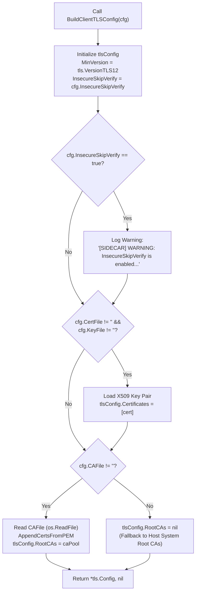
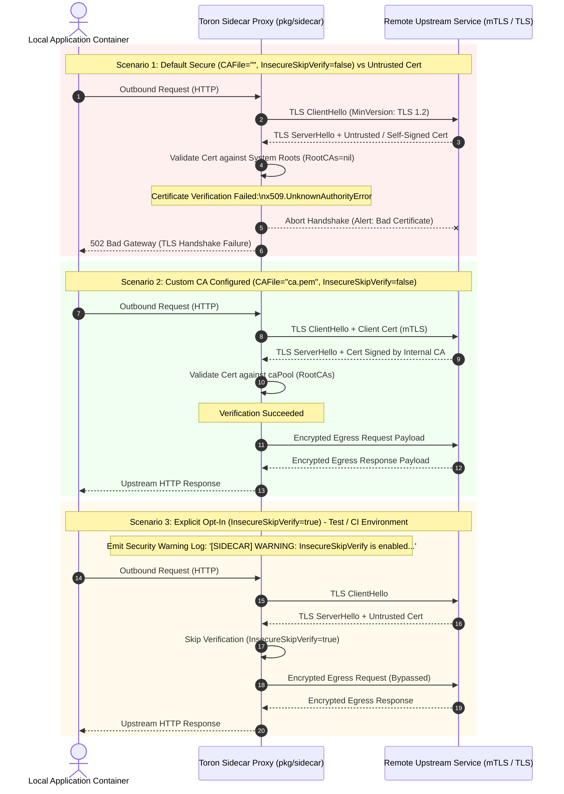

# ADR-097 - Secure Default Client TLS Validation and Explicit InsecureSkipVerify Opt-In in Sidecar Proxy

## Context & Problem Statement

Toron Edge Gateway provides a Service Mesh Sidecar Proxy ([`pkg/sidecar/`](file:///Users/sneha/Developer/toron-research/toron/pkg/sidecar/)) designed to run as an egress and ingress proxy alongside application microservices in containerized environments (Kubernetes pods, Nomad allocations, Docker networks, or bare-metal processes). The sidecar intercepts outbound egress traffic from the local application container and encapsulates it in mutual TLS (mTLS) or TLS tunnels to upstream destination microservices.

During comprehensive security audit [`SR-091 Finding 5`](file:///Users/sneha/Developer/toron-research/toron/docs/securityReview/SR-091.md#L173-L195) and vulnerability tracking [`SEC-35`](file:///Users/sneha/Developer/toron-research/toron/SECURITY_AUDIT.md#L474-L482) ([CWE-295 Improper Certificate Validation](https://cwe.mitre.org/data/definitions/295.html)), a critical security vulnerability was uncovered in the sidecar client-side TLS configuration constructor ([`pkg/sidecar/mtls.go:L46-L74`](file:///Users/sneha/Developer/toron-research/toron/pkg/sidecar/mtls.go#L46-L74)).

### Analysis of Prior Implementation & Root Cause

In [`pkg/sidecar/mtls.go:L60-L72`](file:///Users/sneha/Developer/toron-research/toron/pkg/sidecar/mtls.go#L60-L72), `BuildClientTLSConfig` constructed the `*tls.Config` used for egress proxy connections:

```go
func BuildClientTLSConfig(cfg config.SidecarConfig) (*tls.Config, error) {
    tlsConfig := &tls.Config{
        MinVersion: tls.VersionTLS12,
    }
    ...
    if cfg.CAFile != "" {
        caBytes, err := os.ReadFile(cfg.CAFile)
        if err != nil {
            return nil, fmt.Errorf("failed to read sidecar ca cert: %w", err)
        }
        caPool := x509.NewCertPool()
        caPool.AppendCertsFromPEM(caBytes)
        tlsConfig.RootCAs = caPool
    } else {
        // Default to insecure verify if custom CA is omitted in test environments
        tlsConfig.InsecureSkipVerify = true
    }

    return tlsConfig, nil
}
```

When `cfg.CAFile` was omitted (the standard deployment pattern when relying on the host operating system's public CA trust store, standard cloud provider certificates, or public certificate authorities), the function automatically entered the `else` block, setting:

```go
tlsConfig.InsecureSkipVerify = true
```

### Exploitability & Threat Analysis (CVSS:3.1 Score 8.1 - High)

1. **Man-in-the-Middle (MITM) Interception (CWE-295)**:
   Setting `InsecureSkipVerify = true` completely disables all certificate chain verification, expiration checks, and hostname validation in Go's `crypto/tls` runtime. The sidecar unconditionally accepts any certificate presented by any peer endpoint.
2. **Pod-to-Pod Egress Vulnerability on Shared Networks**:
   In shared Kubernetes clusters or container networks, an attacker on the same node, an adjacent container, or a compromised network gateway can poison ARP or DNS, redirect outbound traffic, and present an arbitrary self-signed certificate. The Toron sidecar would establish an encrypted tunnel to the attacker without warning, exposing plaintext HTTP payloads, Bearer tokens, API credentials, and sensitive tenant data.
3. **Violation of the Secure-by-Default Principle**:
   Bypassing certificate validation was hardcoded as the default behavior when no custom CA was provided. Security best practices dictate that secure verification must be enforced by default, requiring an explicit, auditable opt-in by the operator to disable security controls.

Remediating `SEC-35` through [`REQ-097`](file:///Users/sneha/Developer/toron-research/toron/docs/requirements/REQ-097.md) and [`TASK-120`](file:///Users/sneha/Developer/toron-research/toron/docs/tasks/TASK-120.md) enforces **strict certificate validation by default**, automatic fallback to host system certificate trust roots when no custom CA is specified, and an explicit `insecure_skip_verify: true` configuration flag with high-visibility security audit warnings for specialized testing environments.

---

## Architectural Decisions

### Decision 1: Configuration Schema Extension (`SidecarConfig.InsecureSkipVerify`)

To permit operators to disable certificate verification exclusively when intentionally required (e.g., in local ephemeral development or CI test harnesses), an explicit configuration field is added to [`SidecarConfig`](file:///Users/sneha/Developer/toron-research/toron/pkg/config/config.go#L102-L115).

#### 1.1 Struct Extension

In [`pkg/config/config.go`](file:///Users/sneha/Developer/toron-research/toron/pkg/config/config.go):

```go
// SidecarConfig captures Service Mesh Sidecar proxy mode settings.
type SidecarConfig struct {
    Enabled            bool                `yaml:"enabled" json:"enabled"`
    Mode               string              `yaml:"mode" json:"mode"` // "ingress", "egress", "dual"
    IngressPort        int                 `yaml:"ingress_port" json:"ingress_port"`
    EgressPort         int                 `yaml:"egress_port" json:"egress_port"`
    AppPort            int                 `yaml:"app_port" json:"app_port"`
    MaxBodyBytes       int64               `yaml:"max_body_bytes" json:"max_body_bytes"`
    StrictmTLS         bool                `yaml:"strict_mtls" json:"strict_mtls"`
    CertFile           string              `yaml:"cert_file" json:"cert_file"`
    KeyFile            string              `yaml:"key_file" json:"key_file"`
    CAFile             string              `yaml:"ca_file" json:"ca_file"`
    InsecureSkipVerify bool                `yaml:"insecure_skip_verify" json:"insecure_skip_verify"`
    TrafficSplits      []TrafficSplitRoute `yaml:"traffic_splits" json:"traffic_splits"`
}
```

#### 1.2 Default Value Guarantee

In `defaultConfig()` in [`pkg/config/config.go`](file:///Users/sneha/Developer/toron-research/toron/pkg/config/config.go):
- `InsecureSkipVerify` is explicitly initialized to `false`.
- Standard Go zero-value struct initialization (`SidecarConfig{}`) inherently sets `InsecureSkipVerify: false`.
- YAML configuration files omitting `insecure_skip_verify` will parse as `false`.

---

### Decision 2: Elimination of Hardcoded Insecure Verification in `BuildClientTLSConfig`

In [`pkg/sidecar/mtls.go`](file:///Users/sneha/Developer/toron-research/toron/pkg/sidecar/mtls.go), the hardcoded `else { tlsConfig.InsecureSkipVerify = true }` branch is completely eliminated.

#### 2.1 Refactored Implementation

```go
// BuildClientTLSConfig constructs a client-side TLS configuration for egress pod-to-pod mTLS.
func BuildClientTLSConfig(cfg config.SidecarConfig) (*tls.Config, error) {
    tlsConfig := &tls.Config{
        MinVersion:         tls.VersionTLS12,
        InsecureSkipVerify: cfg.InsecureSkipVerify,
    }

    if cfg.InsecureSkipVerify {
        log.Printf("[SIDECAR] WARNING: InsecureSkipVerify is enabled for sidecar egress TLS. Certificate verification is disabled.")
    }

    if cfg.CertFile != "" && cfg.KeyFile != "" {
        cert, err := tls.LoadX509KeyPair(cfg.CertFile, cfg.KeyFile)
        if err != nil {
            return nil, fmt.Errorf("failed to load sidecar client tls cert/key pair: %w", err)
        }
        tlsConfig.Certificates = []tls.Certificate{cert}
    }

    if cfg.CAFile != "" {
        caBytes, err := os.ReadFile(cfg.CAFile)
        if err != nil {
            return nil, fmt.Errorf("failed to read sidecar ca cert: %w", err)
        }
        caPool := x509.NewCertPool()
        caPool.AppendCertsFromPEM(caBytes)
        tlsConfig.RootCAs = caPool
    }

    return tlsConfig, nil
}
```

#### 2.2 Invariant

- `tlsConfig.InsecureSkipVerify` strictly reflects `cfg.InsecureSkipVerify`.
- Under no circumstances does omitting `cfg.CAFile` enable `InsecureSkipVerify`.

---

### Decision 3: Host System Trust Root Certificate Store Fallback

When `cfg.CAFile == ""` and `cfg.InsecureSkipVerify == false`:
1. `tlsConfig.RootCAs` is left as `nil`.
2. In Go's `crypto/tls` implementation, when `RootCAs == nil`, the runtime automatically loads and validates peer certificate chains against the host operating system's system certificate pool (e.g., `/etc/ssl/certs`, macOS System Keychain, or Windows Root Certificate Store).
3. **Outbound Egress Behavior**:
   - Connections to services presenting certificates signed by publicly trusted CAs (e.g., Let's Encrypt, DigiCert, AWS Certificate Manager) or system-installed enterprise roots succeed transparently.
   - Connections to services presenting self-signed, untrusted, expired, or hostname-mismatched certificates are aborted immediately during the TLS handshake with `x509.UnknownAuthorityError` or `x509.HostnameError`.
   - The sidecar returns HTTP 502 Bad Gateway to the calling application, completely preventing plaintext leakage to untrusted endpoints.

---

### Decision 4: Custom Certificate Authority (CA) Pool Loading

When `cfg.CAFile != ""`:
1. `BuildClientTLSConfig` reads the CA bundle from the path specified by `cfg.CAFile`.
2. If the file cannot be read, it fails fast and returns an explicit error (`failed to read sidecar ca cert: <err>`), preventing silent startup with degraded security.
3. A new `x509.CertPool` is initialized via `x509.NewCertPool()`, populated via `caPool.AppendCertsFromPEM(caBytes)`, and assigned to `tlsConfig.RootCAs`.
4. `tlsConfig.InsecureSkipVerify` remains `false` (unless explicitly configured).
5. Outbound egress connections validate against the internal mesh PKI, accepting certificates issued by the custom CA and rejecting untrusted certificates.

---

### Decision 5: Mandatory High-Visibility Security Audit Logging on Insecure Opt-In

When an operator explicitly configures `insecure_skip_verify: true`:
1. `BuildClientTLSConfig` emits a high-visibility security audit warning to standard log output:
   ```
   [SIDECAR] WARNING: InsecureSkipVerify is enabled for sidecar egress TLS. Certificate verification is disabled.
   ```
2. This ensures that security scanning tools, SIEM monitoring, and cluster operators immediately detect and flag degraded TLS security postures during container initialization.

---

### Decision 6: Client Identity & Protocol Invariants

1. **Client Identity Certificates (mTLS)**:
   - When `cfg.CertFile != ""` and `cfg.KeyFile != ""`, `tls.LoadX509KeyPair` loads the client certificate pair into `tlsConfig.Certificates`.
   - The sidecar continues to present its client identity certificate on upstream mTLS handshakes regardless of whether `InsecureSkipVerify` is enabled or disabled.
2. **Minimum Protocol Version**:
   - `tlsConfig.MinVersion = tls.VersionTLS12` is unconditionally enforced on all client TLS configurations, preventing protocol downgrade attacks to SSLv3, TLS 1.0, or TLS 1.1.

---

## Architectural Diagrams

### 1. `BuildClientTLSConfig` Decision Tree Flowchart



---

### 2. Egress TLS Handshake Verification vs Rejection Sequence Diagram



---

## Alternatives Considered & Trade-Off Analysis

### Alternative 1: Complete Removal of `InsecureSkipVerify`
- **Description**: Prohibit any option to disable TLS certificate verification entirely.
- **Evaluation & Trade-offs**:
  - *Pros*: Eliminates any risk of operators deploying insecure TLS configurations in production.
  - *Cons*: Prevents developers and automated CI/CD pipelines from running integration tests against ephemeral local mock servers (such as `httptest.NewTLSServer`) or testing staging clusters with self-signed test certificates without generating and mounting full CA infrastructures.
- **Decision**: **Rejected**. Provide an explicit, auditable opt-in (`insecure_skip_verify: true`) with mandatory warning logging.

---

### Alternative 2: Environment Variable Override (`TORON_INSECURE_SKIP_VERIFY`)
- **Description**: Control `InsecureSkipVerify` exclusively via an environment variable rather than YAML configuration.
- **Evaluation & Trade-offs**:
  - *Pros*: Out-of-band control.
  - *Cons*: Breaks Toron's unified declarative configuration design where all sidecar behaviors (`pkg/config/config.go`) are specified via `toron.yaml`. Environment variables can also be inherited unintentionally by child processes.
- **Decision**: **Rejected**. Define `InsecureSkipVerify` in `SidecarConfig` for declarative, file-based configuration.

---

### Alternative 3: Trust On First Use (TOFU) / Dynamic Certificate Pinning
- **Description**: Implement Trust On First Use (TOFU) pinning where the sidecar remembers the first certificate fingerprint it encounters.
- **Evaluation & Trade-offs**:
  - *Pros*: Detects subsequent certificate changes without static CA configuration.
  - *Cons*: Vulnerable to MITM on initial connection. Introduces dynamic persistent state management into an otherwise stateless sidecar proxy, violating Toron's zero-dependency, lightweight architectural principles.
- **Decision**: **Rejected**. Adhere to standard X.509 PKI trust verification semantics via Go's standard library `crypto/tls`.

---

## Security Invariants & Threat Modeling

| Threat Scenario | Vulnerability & CWE | Prior Behavior (Vulnerable) | Remediated Architecture (ADR-097) |
| :--- | :--- | :--- | :--- |
| **Egress MITM Interception** | [CWE-295 Improper Certificate Validation](https://cwe.mitre.org/data/definitions/295.html) | `BuildClientTLSConfig` forced `InsecureSkipVerify = true` when `CAFile == ""`. Attacker could intercept and decrypt traffic. | `InsecureSkipVerify` defaults to `false`. Peer certificates are strictly validated against host system trust roots. |
| **Credential & Token Theft** | Plaintext Interception on Shared Networks | Sidecar accepted spoofed upstream certificates, leaking Authorization tokens and credentials. | Handshake fails on untrusted certificate (`x509.UnknownAuthorityError`); connection is immediately terminated. |
| **Silent Security Degradation** | Lack of Auditability | Deployments relying on public/cloud CAs operated completely unprotected without operator awareness. | Secure by default; explicit `insecure_skip_verify: true` generates a prominent security warning in system logs. |
| **Protocol Downgrade Attack** | Protocol Insecurity | Client TLS protocol could be negotiated down to vulnerable legacy versions. | `tlsConfig.MinVersion = tls.VersionTLS12` is unconditionally enforced. |

### Architectural Security Invariants

1. **Secure-by-Default Invariant**: `InsecureSkipVerify` MUST evaluate to `false` in all standard configurations, default files, and zero-value struct initializations.
2. **Fail-Closed Security Invariant**: When peer certificate verification fails, the sidecar MUST terminate the TLS handshake immediately and return HTTP 502 Bad Gateway, never falling back to insecure transport.
3. **Mandatory Auditability**: Any runtime activation of `InsecureSkipVerify: true` MUST emit a standard log warning to ensure detection by security audit pipelines and SIEM systems.
4. **Zero Third-Party Dependencies**: All cryptographic operations and TLS configurations MUST strictly use Go standard library packages (`crypto/tls`, `crypto/x509`, `log`, `fmt`, `os`).
5. **Thread Safety & Race-Freedom**: The `*tls.Config` constructed by `BuildClientTLSConfig` MUST be safe for concurrent use across high-concurrency request dispatching without race conditions under `go test -race`.

---

## Traceability & Verification Matrix

| Requirement / Artifact | Component / File | Scope | Verification Target ([`TC-097`](file:///Users/sneha/Developer/toron-research/toron/docs/testCases/TC-097.md)) |
| :--- | :--- | :--- | :--- |
| [`REQ-097-AC-01`](file:///Users/sneha/Developer/toron-research/toron/docs/requirements/REQ-097.md#L102-L109)<br>[`TASK-120`](file:///Users/sneha/Developer/toron-research/toron/docs/tasks/TASK-120.md) | [`pkg/config/config.go`](file:///Users/sneha/Developer/toron-research/toron/pkg/config/config.go) | `SidecarConfig` includes `InsecureSkipVerify bool `yaml:"insecure_skip_verify" json:"insecure_skip_verify"``, defaulting to `false` in zero-value and `defaultConfig()`. | `TestBuildClientTLSConfig_DefaultSecure` |
| [`REQ-097-AC-02`](file:///Users/sneha/Developer/toron-research/toron/docs/requirements/REQ-097.md#L110-L117)<br>[`TASK-120`](file:///Users/sneha/Developer/toron-research/toron/docs/tasks/TASK-120.md) | [`pkg/sidecar/mtls.go`](file:///Users/sneha/Developer/toron-research/toron/pkg/sidecar/mtls.go) | `BuildClientTLSConfig` assigns `tlsConfig.InsecureSkipVerify = cfg.InsecureSkipVerify`. Default configuration strictly enforces `InsecureSkipVerify == false`. | `TestBuildClientTLSConfig_DefaultSecure` |
| [`REQ-097-AC-03`](file:///Users/sneha/Developer/toron-research/toron/docs/requirements/REQ-097.md#L118-L124)<br>[`TASK-120`](file:///Users/sneha/Developer/toron-research/toron/docs/tasks/TASK-120.md) | [`pkg/sidecar/mtls.go`](file:///Users/sneha/Developer/toron-research/toron/pkg/sidecar/mtls.go) | When `CAFile == ""` and `InsecureSkipVerify == false`, `RootCAs` remains `nil`, falling back to host system roots. Untrusted certificates fail handshake. | `TestSidecar_EgressTLS_HandshakeRejection` |
| [`REQ-097-AC-04`](file:///Users/sneha/Developer/toron-research/toron/docs/requirements/REQ-097.md#L125-L131)<br>[`TASK-120`](file:///Users/sneha/Developer/toron-research/toron/docs/tasks/TASK-120.md) | [`pkg/sidecar/mtls.go`](file:///Users/sneha/Developer/toron-research/toron/pkg/sidecar/mtls.go) | When `CAFile != ""`, CA certificates are loaded into `RootCAs`, while `InsecureSkipVerify` remains `false`. Validates against custom CA. | `TestBuildClientTLSConfig_CustomCA`<br>`TestSidecar_EgressTLS_HandshakeSuccess_WithCustomCA` |
| [`REQ-097-AC-05`](file:///Users/sneha/Developer/toron-research/toron/docs/requirements/REQ-097.md#L132-L139)<br>[`TASK-120`](file:///Users/sneha/Developer/toron-research/toron/docs/tasks/TASK-120.md) | [`pkg/sidecar/mtls.go`](file:///Users/sneha/Developer/toron-research/toron/pkg/sidecar/mtls.go) | When `InsecureSkipVerify == true`, `BuildClientTLSConfig` logs warning: `[SIDECAR] WARNING: InsecureSkipVerify is enabled for sidecar egress TLS...`. | `TestBuildClientTLSConfig_ExplicitInsecureOptIn` |
| [`REQ-097-AC-06`](file:///Users/sneha/Developer/toron-research/toron/docs/requirements/REQ-097.md#L140-L145)<br>[`TASK-120`](file:///Users/sneha/Developer/toron-research/toron/docs/tasks/TASK-120.md) | [`pkg/sidecar/mtls.go`](file:///Users/sneha/Developer/toron-research/toron/pkg/sidecar/mtls.go) | Client identity certificate pair (`CertFile`, `KeyFile`) loaded into `tlsConfig.Certificates` for mTLS upstream authentication. | `TestBuildClientTLSConfig_DefaultSecure` |
| [`REQ-097-AC-07`](file:///Users/sneha/Developer/toron-research/toron/docs/requirements/REQ-097.md#L146-L148)<br>[`TASK-120`](file:///Users/sneha/Developer/toron-research/toron/docs/tasks/TASK-120.md) | [`pkg/sidecar/mtls.go`](file:///Users/sneha/Developer/toron-research/toron/pkg/sidecar/mtls.go) | Minimum TLS version enforced at `tls.VersionTLS12` across all generated configs. | `TestBuildClientTLSConfig_DefaultSecure` |
| [`REQ-097-AC-08`](file:///Users/sneha/Developer/toron-research/toron/docs/requirements/REQ-097.md#L149-L152)<br>[`TASK-120`](file:///Users/sneha/Developer/toron-research/toron/docs/tasks/TASK-120.md) | Pure Go Standard Library | 100% data-race-free under `go test -race ./pkg/sidecar/... ./pkg/config/...`. Zero external dependencies. | `TestSidecar_EgressTLS_ConcurrentRouting_RaceClean` |
| [`REQ-097-AC-09`](file:///Users/sneha/Developer/toron-research/toron/docs/requirements/REQ-097.md#L153-L161)<br>[`TASK-120`](file:///Users/sneha/Developer/toron-research/toron/docs/tasks/TASK-120.md) | [`pkg/sidecar/sidecar_test.go`](file:///Users/sneha/Developer/toron-research/toron/pkg/sidecar/sidecar_test.go) | Comprehensive automated test suite covering all 6 unit and end-to-end handshake scenarios specified in [`TC-097`](file:///Users/sneha/Developer/toron-research/toron/docs/testCases/TC-097.md). | `pkg/sidecar/sidecar_test.go` |

---

## Status & Governance Sign-Off

> [!NOTE]
> This Architecture Decision Record is **approved** for implementation. Implementation task [`TASK-120`](file:///Users/sneha/Developer/toron-research/toron/docs/tasks/TASK-120.md) and verification test suite [`TC-097`](file:///Users/sneha/Developer/toron-research/toron/docs/testCases/TC-097.md) are authorized to commence.
