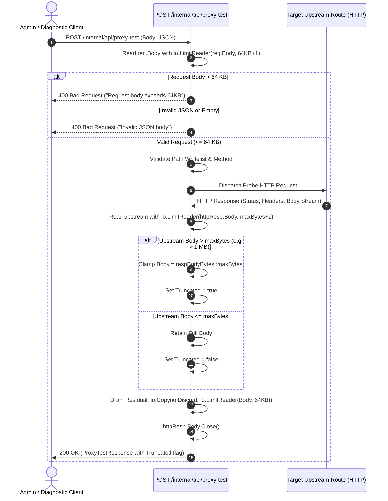
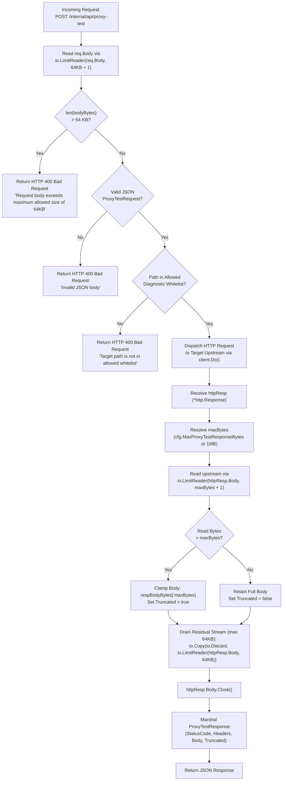

# ADR-098 - Bounded Ingestion and Upstream Response Buffering Architecture in Internal API Proxy Test Probe

## Context & Problem Statement

Toron Edge Gateway provides an administrative diagnostic and management REST API under the `/internal/api/` path prefix ([`pkg/server/internal_api.go`](file:///Users/sneha/Developer/toron-research/toron/pkg/server/internal_api.go)). This interface allows operators and automated health checking probes to inspect gateway runtime statistics, list registered prefix routes, monitor upstream cluster health, and verify upstream reverse proxy routes dynamically via `POST /internal/api/proxy-test`.

During comprehensive security audit [`SR-091 Finding 6`](file:///Users/sneha/Developer/toron-research/toron/docs/securityReview/SR-091.md#L197-L212) and vulnerability assessment [`SEC-36`](file:///Users/sneha/Developer/toron-research/toron/SECURITY_AUDIT.md#L483-L491) ([CWE-400 Uncontrolled Resource Consumption](https://cwe.mitre.org/data/definitions/400.html), [CWE-770 Allocation of Resources Without Limits or Throttling](https://cwe.mitre.org/data/definitions/770.html), [CWE-775 Missing Release of File Descriptor or Handle](https://cwe.mitre.org/data/definitions/775.html)), two critical unbounded memory ingestion flaws and a socket descriptor leak were identified in `POST /internal/api/proxy-test`.

### Analysis of Prior Implementation & Failure Modes

In [`pkg/server/internal_api.go:L516-L669`](file:///Users/sneha/Developer/toron-research/toron/pkg/server/internal_api.go#L516-L669), `POST /internal/api/proxy-test` accepted incoming diagnostic probes and executed an HTTP request against the targeted route:

```go
r.POST("/internal/api/proxy-test", wrapHandler(func(req *httpparser.Request, res *httpparser.Response) {
    ...
    bodyBytes, err := io.ReadAll(req.Body) // Failure Mode 1: Unbounded Inbound Request
    ...
    httpResp, err := client.Do(httpReq)
    ...
    defer httpResp.Body.Close()

    respBodyBytes, _ := io.ReadAll(httpResp.Body) // Failure Mode 2: Unbounded Upstream Response
    ...
}))
```

This implementation produced three severe operational and security failure modes:

1. **Unbounded Inbound Request Ingestion (CWE-400)**:
   The handler ingested the caller's request payload into memory using `io.ReadAll(req.Body)` with zero length restriction. An authenticated administrative client or compromised internal microservice sending an excessively large body (e.g. 500 MB of JSON data) forced the Go runtime to continuously allocate heap memory, triggering Garbage Collection (GC) pauses and potential Out-Of-Memory (OOM) process termination.
2. **Unbounded Upstream Response Buffering (CWE-400, CWE-770)**:
   The handler read the entire upstream response body into heap memory using `io.ReadAll(httpResp.Body)` without any upper bound. When probing an endpoint that returns a large file download (e.g. a multi-gigabyte ISO), an infinite stream (e.g. `/dev/urandom` or chunked telemetry generator), or an endless Server-Sent Events (SSE) feed, `io.ReadAll` continuously expanded internal buffers until heap memory was completely exhausted, inducing the operating system's OOM killer to abort the Toron process and cutting off traffic for all production services.
3. **Socket Descriptor Leakage & Connection Pool Degradation (CWE-775)**:
   Simply stopping a stream on truncation without properly draining pending residual bytes leaves unread data on the TCP connection. Consequently, Go's `http.Transport` cannot safely reuse the connection in its keep-alive pool, leading to connection drops, socket descriptor exhaustion (`EMFILE`), and lingering background socket readers.

Remediating `SEC-36` through [`REQ-098`](file:///Users/sneha/Developer/toron-research/toron/docs/requirements/REQ-098.md) and [`TASK-121`](file:///Users/sneha/Developer/toron-research/toron/docs/tasks/TASK-121.md) establishes **strictly bounded inbound request ingestion, configurable upstream response clamping with truncation signaling, and clean transport stream draining**.

---

## Architectural Decisions

### Decision 1: Configurable Upper Bound on Upstream Probe Response Ingestion

To support varied operational requirements while maintaining a secure-by-default posture, the maximum buffer size for upstream probe responses is made explicitly configurable in [`InternalAPIConfig`](file:///Users/sneha/Developer/toron-research/toron/pkg/server/internal_api.go#L38-L69).

#### 1.1 Configuration Schema Extension

In [`pkg/server/internal_api.go`](file:///Users/sneha/Developer/toron-research/toron/pkg/server/internal_api.go):

```go
type InternalAPIConfig struct {
    ...
    MaxProxyTestResponseBytes int64 `json:"max_proxy_test_response_bytes,omitempty"`
}
```

#### 1.2 Default Value Normalization

- If `MaxProxyTestResponseBytes` is omitted, `0`, or negative, the handler defaults to **1 MB** (`1048576` bytes = `1 * 1024 * 1024`).
- When explicitly set to a positive value (e.g. `2 * 1024 * 1024` for 2 MB or `256 * 1024` for 256 KB), that limit is strictly enforced.
- Calculation logic:
  ```go
  maxRespBytes := cfg.MaxProxyTestResponseBytes
  if maxRespBytes <= 0 {
      maxRespBytes = 1024 * 1024 // 1 MB default
  }
  ```

---

### Decision 2: Dual-Stage Bounded Streaming Ingestion

To prevent heap exhaustion from both directions (inbound client payload and outbound upstream response), the handler implements dual-stage bounded ingestion using `io.LimitReader`.

#### 2.1 Stage 1: Inbound Request Body Ingestion (64 KB Limit)

Client requests to `POST /internal/api/proxy-test` contain JSON metadata (`path`, `method`, `headers`). Diagnostic probes never require large payloads.
1. Inbound body ingestion is capped at **64 KB** (`65536` bytes = `64 * 1024`):
   ```go
   const maxInboundReqBytes = 64 * 1024 // 64 KB
   bodyBytes, err := io.ReadAll(io.LimitReader(req.Body, maxInboundReqBytes+1))
   ```
2. **Rejection Policy**:
   - If `int64(len(bodyBytes)) > maxInboundReqBytes`:
     - The handler immediately halts execution before making any upstream request.
     - Responds with HTTP `400 Bad Request`:
       ```json
       {"error":"400 Bad Request","message":"Request body exceeds maximum allowed size of 64KB"}
       ```
   - If `err != nil` or `len(bodyBytes) == 0`:
     - Responds with HTTP `400 Bad Request` (`"Missing or invalid request body"`).
   - If JSON syntax is invalid:
     - Responds with HTTP `400 Bad Request` (`"Invalid JSON body"`).

#### 2.2 Stage 2: Upstream Response Body Ingestion (`maxRespBytes + 1` Window)

To accurately detect whether an upstream response was larger than the configured limit without reading unbounded bytes:
1. The upstream response body is wrapped in `io.LimitReader` configured for `maxRespBytes + 1`:
   ```go
   limitedReader := io.LimitReader(httpResp.Body, maxRespBytes+1)
   respBodyBytes, _ := io.ReadAll(limitedReader)
   ```
2. **Overflow Detection**:
   - If `int64(len(respBodyBytes)) > maxRespBytes`, the upstream server produced more bytes than allowed.
   - If `int64(len(respBodyBytes)) <= maxRespBytes`, the entire upstream body fit within the limit.

---

### Decision 3: Truncation Signaling & Deterministic Payload Clamping

When an upstream response exceeds the configured threshold, the diagnostic probe must not fail silently or mislead operators into believing the response was complete.

#### 3.1 Response Schema Extension

In [`pkg/server/internal_api.go`](file:///Users/sneha/Developer/toron-research/toron/pkg/server/internal_api.go), `ProxyTestResponse` is extended with a boolean `Truncated` field:

```go
type ProxyTestResponse struct {
    StatusCode int               `json:"status_code"`
    StatusText string            `json:"status_text"`
    LatencyMS  float64           `json:"latency_ms"`
    Headers    map[string]string `json:"headers"`
    Body       string            `json:"body"`
    Truncated  bool              `json:"truncated,omitempty"`
}
```

#### 3.2 Deterministic Clamping Mechanics

1. If overflow is detected (`int64(len(respBodyBytes)) > maxRespBytes`):
   - The body slice is clamped to exactly `maxRespBytes`:
     ```go
     respBodyBytes = respBodyBytes[:maxRespBytes]
     truncated = true
     ```
   - The upstream HTTP status code (e.g. 200 OK, 206 Partial Content) and response headers are preserved.
   - `Truncated: true` is set on `ProxyTestResponse`.
2. If no overflow occurred:
   - The body slice is preserved in full.
   - `Truncated: false` is set (omitted from JSON output if empty via `omitempty`).

---

### Decision 4: Safe Residual Stream Draining & Socket Teardown

Simply truncating the byte slice does not close the underlying TCP stream. If residual bytes are left pending in the socket buffer, the HTTP transport cannot reuse the connection, leading to socket descriptor leaks.

#### 4.1 Bounded Discard Draining

1. To permit HTTP/1.1 connection reuse without unbounded blocking, the handler drains up to 64 KB of residual bytes from `httpResp.Body` into `io.Discard`:
   ```go
   _, _ = io.Copy(io.Discard, io.LimitReader(httpResp.Body, 64*1024))
   ```
2. If the upstream stream is infinite, `io.LimitReader` halts the discard read after 64 KB, preventing infinite hangs.
3. `httpResp.Body.Close()` is explicitly invoked:
   ```go
   _ = httpResp.Body.Close()
   ```
4. This ensures that finite connections return cleanly to the `http.Transport` keep-alive pool, while infinite or uncooperative connections are closed cleanly without `EMFILE` socket exhaustion.

---

## Architectural Diagrams

### 1. Probe Execution Lifecycle & Bounded Ingestion Sequence Diagram



---

### 2. Dual-Stage Ingestion & Clamping Flowchart



---

## Alternatives Considered & Trade-Off Analysis

### Alternative 1: Discard Entire Response on Overflow (Hard Failure)
- **Description**: If the upstream response exceeds `maxBytes`, discard the body entirely and return an error (e.g. HTTP 502 Bad Gateway with `"Response too large"`).
- **Evaluation & Trade-offs**:
  - *Pros*: Completely eliminates the risk of transmitting partial payloads.
  - *Cons*: Defeats the primary diagnostic purpose of `proxy-test`. Operators probing an endpoint that returns a 1.2 MB response often need to inspect the HTTP status code, headers, and the initial lines of the response (e.g. error traces or HTML banners) to diagnose upstream behavior.
- **Decision**: **Rejected**. Return the actual upstream status code with clamped payload and `truncated: true`.

---

### Alternative 2: Streaming Chunked SSE / WebSockets to Client
- **Description**: Stream the upstream response in chunks back to the client over Server-Sent Events or WebSockets.
- **Evaluation & Trade-offs**:
  - *Pros*: Allows clients to read large diagnostic dumps in real-time.
  - *Cons*: Adds significant complexity to the internal administrative API, requires stateful socket tracking, and violates the simple request-response contract of Toron's REST management endpoints.
- **Decision**: **Rejected**. Keep the simple REST JSON contract with strict in-memory byte limits.

---

### Alternative 3: Temporary Disk Spooling
- **Description**: Spool oversized upstream responses to temporary files on disk (e.g. `/tmp/toron-probe-*`) and serve chunks from disk.
- **Evaluation & Trade-offs**:
  - *Pros*: Memory footprint remains low regardless of response size.
  - *Cons*: Introduces disk I/O latency, requires file system cleanup routines, introduces security risks regarding temp file race conditions (CWE-377), and causes disk exhaustion (CWE-400) in containerized environments with read-only root filesystems.
- **Decision**: **Rejected**. Ingestion is clamped directly in memory without disk persistence.

---

## Security Invariants & Threat Modeling

| Threat Scenario | Vulnerability & CWE | Prior Behavior (Vulnerable) | Remediated Architecture (ADR-098) |
| :--- | :--- | :--- | :--- |
| **Upstream Heap OOM Exhaustion** | [CWE-400](https://cwe.mitre.org/data/definitions/400.html), [CWE-770](https://cwe.mitre.org/data/definitions/770.html) | `io.ReadAll(httpResp.Body)` with zero bound. Upstream infinite stream caused OOM crash. | Bounded by `io.LimitReader(maxBytes+1)`. Body clamped to `maxBytes`; `truncated: true` reported. |
| **Inbound Request Memory Exhaustion** | [CWE-400](https://cwe.mitre.org/data/definitions/400.html) | `io.ReadAll(req.Body)` with zero bound on client JSON payload. | Inbound request body capped at 64 KB. Excess bytes trigger immediate HTTP 400 rejection. |
| **Socket Descriptor Leakage** | [CWE-775](https://cwe.mitre.org/data/definitions/775.html) | Truncating stream without draining residual bytes leaked TCP sockets and degraded keep-alive pool. | Residual stream safely drained up to 64 KB and `httpResp.Body.Close()` cleanly invoked. |
| **Diagnostic Misinterpretation** | Observability Flaw | Operator unaware that diagnostic body was incomplete. | `Truncated: true` explicitly reported in response JSON schema. |

### Architectural Security Invariants

1. **Strict $O(\text{maxBytes})$ Memory Bound Invariant**: Ingesting an infinite or multi-gigabyte upstream stream MUST NOT allocate more than $O(\text{maxBytes})$ heap memory (default $\le 1\text{ MB} + \epsilon$).
2. **Inbound 64 KB Cap Invariant**: Ingestion of inbound client requests for proxy tests MUST NOT exceed 64 KB under any circumstances.
3. **Fail-Safe Socket Cleanup Invariant**: Upstream response bodies MUST be cleanly drained and closed upon reading, enabling HTTP keep-alive reuse and preventing socket leaks (`EMFILE`).
4. **Zero Third-Party Dependencies**: All bounds checking, reader limiting, buffer truncations, and JSON serialization MUST strictly use the Go standard library (`io`, `net/http`, `encoding/json`, `fmt`, `time`, `strings`).
5. **Thread Safety & Race-Freedom**: The proxy test probe handler MUST be 100% data-race-free under `go test -race ./pkg/server/...`.

---

## Traceability & Verification Matrix

| Requirement / Artifact | Component / File | Scope | Verification Target ([`TC-098`](file:///Users/sneha/Developer/toron-research/toron/docs/testCases/TC-098.md)) |
| :--- | :--- | :--- | :--- |
| [`REQ-098-AC-01`](file:///Users/sneha/Developer/toron-research/toron/docs/requirements/REQ-098.md#L85-L92)<br>[`TASK-121`](file:///Users/sneha/Developer/toron-research/toron/docs/tasks/TASK-121.md) | [`pkg/server/internal_api.go`](file:///Users/sneha/Developer/toron-research/toron/pkg/server/internal_api.go) | `InternalAPIConfig` includes `MaxProxyTestResponseBytes int64`, defaulting to 1 MB (`1048576` bytes) if omitted, 0, or negative. | `TestProxyTest_CustomConfiguredLimit` |
| [`REQ-098-AC-02`](file:///Users/sneha/Developer/toron-research/toron/docs/requirements/REQ-098.md#L93-L105)<br>[`TASK-121`](file:///Users/sneha/Developer/toron-research/toron/docs/tasks/TASK-121.md) | [`pkg/server/internal_api.go`](file:///Users/sneha/Developer/toron-research/toron/pkg/server/internal_api.go) | Upstream response read with `io.LimitReader(httpResp.Body, maxBytes+1)`. Clamped to `maxBytes` on overflow and `Truncated: true` set. | `TestProxyTest_OversizedResponse_Truncated`<br>`TestProxyTest_NormalResponse_UnderLimit` |
| [`REQ-098-AC-03`](file:///Users/sneha/Developer/toron-research/toron/docs/requirements/REQ-098.md#L106-L114)<br>[`TASK-121`](file:///Users/sneha/Developer/toron-research/toron/docs/tasks/TASK-121.md) | [`pkg/server/internal_api.go`](file:///Users/sneha/Developer/toron-research/toron/pkg/server/internal_api.go) | `ProxyTestResponse` includes `Truncated bool `json:"truncated,omitempty"``. | `TestProxyTest_OversizedResponse_Truncated` |
| [`REQ-098-AC-04`](file:///Users/sneha/Developer/toron-research/toron/docs/requirements/REQ-098.md#L115-L127)<br>[`TASK-121`](file:///Users/sneha/Developer/toron-research/toron/docs/tasks/TASK-121.md) | [`pkg/server/internal_api.go`](file:///Users/sneha/Developer/toron-research/toron/pkg/server/internal_api.go) | Inbound client request body limited to 64 KB via `io.LimitReader(req.Body, 64*1024+1)`. Overflow returns HTTP 400 Bad Request immediately. | `TestProxyTest_OversizedRequestBody_Rejection` |
| [`REQ-098-AC-05`](file:///Users/sneha/Developer/toron-research/toron/docs/requirements/REQ-098.md#L128-L136)<br>[`TASK-121`](file:///Users/sneha/Developer/toron-research/toron/docs/tasks/TASK-121.md) | [`pkg/server/internal_api.go`](file:///Users/sneha/Developer/toron-research/toron/pkg/server/internal_api.go) | Residual response stream safely drained up to 64 KB (`io.Copy(io.Discard, ...)`) and `httpResp.Body.Close()` invoked, enabling keep-alive connection reuse and avoiding `EMFILE` leaks. | `TestProxyTest_InfiniteStream_BoundedTermination` |
| [`REQ-098-AC-06`](file:///Users/sneha/Developer/toron-research/toron/docs/requirements/REQ-098.md#L137-L139)<br>[`TASK-121`](file:///Users/sneha/Developer/toron-research/toron/docs/tasks/TASK-121.md) | Pure Go Standard Library | Pure Go standard library implementation (`io`, `net/http`, `encoding/json`, `fmt`, `time`, `strings`). Zero external dependencies. | `pkg/server/internal_api.go` |
| [`REQ-098-AC-07`](file:///Users/sneha/Developer/toron-research/toron/docs/requirements/REQ-098.md#L140-L143)<br>[`TASK-121`](file:///Users/sneha/Developer/toron-research/toron/docs/tasks/TASK-121.md) | [`pkg/server/internal_api.go`](file:///Users/sneha/Developer/toron-research/toron/pkg/server/internal_api.go) | Handler is thread-safe and 100% data-race-free under `go test -race ./pkg/server/...`. | `TestProxyTest_ConcurrentProbes_RaceClean` |
| [`REQ-098-AC-08`](file:///Users/sneha/Developer/toron-research/toron/docs/requirements/REQ-098.md#L144-L152)<br>[`TASK-121`](file:///Users/sneha/Developer/toron-research/toron/docs/tasks/TASK-121.md) | [`pkg/server/internal_api_test.go`](file:///Users/sneha/Developer/toron-research/toron/pkg/server/internal_api_test.go) | Automated test suite in `pkg/server/internal_api_test.go` covering all 6 scenarios in [`TC-098`](file:///Users/sneha/Developer/toron-research/toron/docs/testCases/TC-098.md). | `TestProxyTest_*` |

---

## Status & Governance Sign-Off

> [!NOTE]
> This Architecture Decision Record is **approved** for implementation. Implementation task [`TASK-121`](file:///Users/sneha/Developer/toron-research/toron/docs/tasks/TASK-121.md) and verification test suite [`TC-098`](file:///Users/sneha/Developer/toron-research/toron/docs/testCases/TC-098.md) are authorized to commence.
