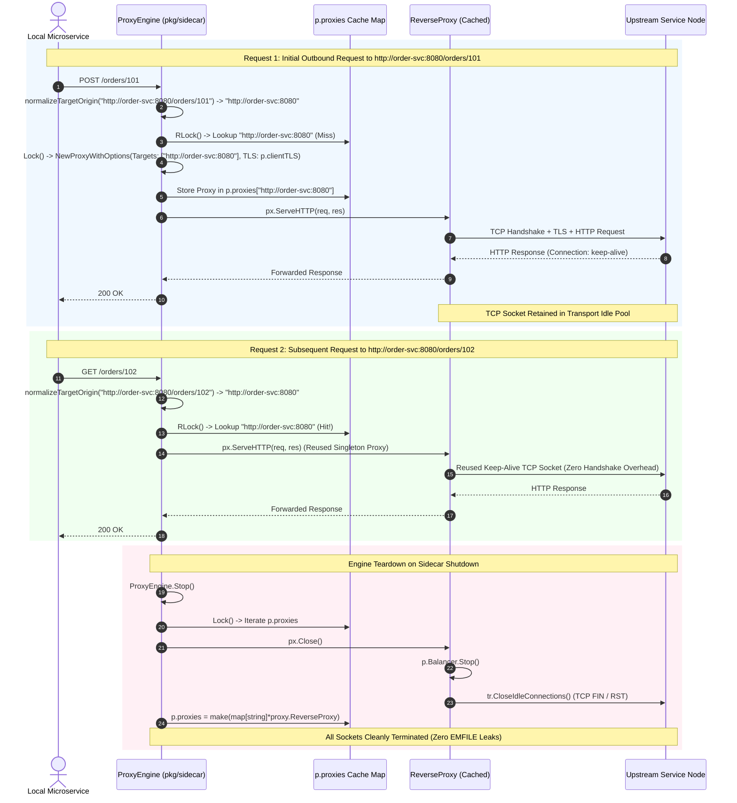
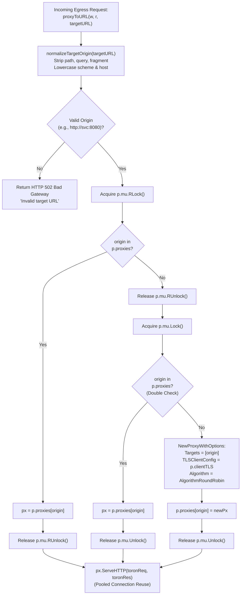

# ADR-099 - Thread-Safe ReverseProxy Caching, Transport Teardown, and Client mTLS Lifecycle Management in Service Mesh Sidecar Proxy

## Context & Problem Statement

Toron Edge Gateway provides a Service Mesh Sidecar Proxy ([`pkg/sidecar/`](file:///Users/sneha/Developer/toron-research/toron/pkg/sidecar/)) designed to execute alongside microservices in containerized environments (Kubernetes pods, Nomad allocations, Docker networks, or bare-metal host processes). The sidecar intercepts outbound egress HTTP traffic from the local application container and encapsulates it in mutual TLS (mTLS) or TLS tunnels to upstream destination microservices.

During comprehensive security audit [`SR-091 Finding 7`](file:///Users/sneha/Developer/toron-research/toron/docs/securityReview/SR-091.md) and vulnerability tracking [`SEC-37`](file:///Users/sneha/Developer/toron-research/toron/SECURITY_AUDIT.md#L492-L500) ([CWE-400 Uncontrolled Resource Consumption](https://cwe.mitre.org/data/definitions/400.html), [CWE-772 Missing Release of Resource after Effective Lifetime](https://cwe.mitre.org/data/definitions/772.html)), a critical performance and resource exhaustion flaw was uncovered in the sidecar egress proxy forwarding engine ([`pkg/sidecar/proxy.go:L192-L202`](file:///Users/sneha/Developer/toron-research/toron/pkg/sidecar/proxy.go#L192-L202)).

### Analysis of Prior Implementation & Failure Modes

In [`pkg/sidecar/proxy.go`](file:///Users/sneha/Developer/toron-research/toron/pkg/sidecar/proxy.go), every incoming HTTP request intercepted by the egress proxy listener triggered `proxyToURL`:

```go
func (p *ProxyEngine) proxyToURL(w http.ResponseWriter, r *http.Request, targetURL string) {
    opts := proxy.ProxyOptions{
        Targets: []string{targetURL},
    }

    px, err := proxy.NewProxyWithOptions(opts)
    if err != nil {
        http.Error(w, fmt.Sprintf("Sidecar proxy error: %v", err), http.StatusBadGateway)
        return
    }
    ...
    px.ServeHTTP(toronReq, toronRes)
    ...
}
```

This interaction produces four critical failure modes:

1. **Per-Request Transport & Client Allocation (CWE-400, CWE-772)**:
   For every single HTTP request forwarded by the sidecar, `proxy.NewProxyWithOptions(opts)` allocated a brand-new [`proxy.ReverseProxy`](file:///Users/sneha/Developer/toron-research/toron/pkg/proxy/proxy.go#L36), a new `*http.Client`, and a new `*http.Transport` with its own connection pool (`MaxIdleConns: 100`, `IdleConnTimeout: 90s`). Each transport maintained its own internal connection caches, TLS session state, and socket pools. Because these transports were allocated per request and never reused or closed, thousands of idle TCP sockets accumulated concurrently without connection pooling. Under standard microservice production traffic (e.g., 500–5,000 requests/sec), this induced rapid file descriptor exhaustion (`EMFILE: too many open files`), severe garbage collector thrashing, steep heap memory consumption, and catastrophic gateway failure.
2. **Missing Transport Connection Teardown in `ReverseProxy.Close()` (CWE-772)**:
   In [`pkg/proxy/proxy.go:L596-L600`](file:///Users/sneha/Developer/toron-research/toron/pkg/proxy/proxy.go#L596-L600), `ReverseProxy.Close()` only halted the active health check ticker on the load balancer (`p.Balancer.Stop()`). It completely omitted closing idle connections on the underlying `http.Transport` (`tr.CloseIdleConnections()`). When reverse proxies were discarded or replaced, their open TCP connections lingered in the operating system kernel until remote servers timed them out.
3. **Cache Key Explosion Risk via Dynamic Request Paths**:
   In `startEgressListener` ([`pkg/sidecar/proxy.go:L174-L179`](file:///Users/sneha/Developer/toron-research/toron/pkg/sidecar/proxy.go#L174-L179)), dynamic request target URLs (e.g. `http://service-b:8080/users/123` vs `http://service-b:8080/users/456`) include variable path segments and query strings. If a proxy cache keyed on raw URLs rather than normalized target origins (`scheme://host[:port]`), the cache map would grow unbounded ($O(N)$ with request volume), creating a secondary memory exhaustion vulnerability.
4. **Client mTLS Configuration Disconnect**:
   When `proxyToURL` instantiated `proxy.NewProxyWithOptions(opts)`, it passed an empty `opts.TLS` configuration. The client TLS settings configured on `SidecarConfig` (such as custom `CAFile`, client certificates `CertFile`/`KeyFile`, and the `InsecureSkipVerify` flag defined in [`REQ-097`](file:///Users/sneha/Developer/toron-research/toron/docs/requirements/REQ-097.md) / `SEC-35`) were never propagated to the reverse proxy transport, breaking egress mTLS authentication and secure certificate verification.

Remediating `SEC-37` through [`REQ-099`](file:///Users/sneha/Developer/toron-research/toron/docs/requirements/REQ-099.md) and [`TASK-122`](file:///Users/sneha/Developer/toron-research/toron/docs/tasks/TASK-122.md) establishes **thread-safe `ReverseProxy` caching keyed by normalized origin, comprehensive transport idle connection teardown, and seamless client TLS propagation**.

---

## Architectural Decisions

### Decision 1: ReverseProxy Transport Teardown (`pkg/proxy/proxy.go`)

To ensure that closing a `ReverseProxy` immediately releases all associated network resources and halts background connection pollers, `ReverseProxy.Close()` is extended to close idle TCP connections on the underlying HTTP transport.

#### 1.1 Implementation in `ReverseProxy.Close()`

In [`pkg/proxy/proxy.go`](file:///Users/sneha/Developer/toron-research/toron/pkg/proxy/proxy.go):

```go
// Close stops active background health checks and closes all idle transport connections.
func (p *ReverseProxy) Close() {
    if p.Balancer != nil {
        p.Balancer.Stop()
    }
    if p.Client != nil {
        if tr, ok := p.Client.Transport.(*http.Transport); ok {
            tr.CloseIdleConnections()
        }
    }
}
```

- When `tr.CloseIdleConnections()` is invoked, Go's standard library `net/http` transport immediately terminates all keep-alive TCP sockets in its idle pool.
- Sockets transition to `TIME_WAIT` / `CLOSED` promptly, freeing file descriptors (`EMFILE`) and kernel buffer memory.

---

### Decision 2: `ProxyOptions` Client TLS Plumbing (`pkg/proxy/proxy.go`)

To allow calling subsystems (such as `ProxyEngine`) to supply a pre-compiled, shared `*tls.Config` rather than re-reading certificates and rebuilding CA pools per proxy, `ProxyOptions` is extended with a direct client TLS configuration pointer.

#### 2.1 Struct Extension

In [`pkg/proxy/proxy.go`](file:///Users/sneha/Developer/toron-research/toron/pkg/proxy/proxy.go):

```go
type ProxyOptions struct {
    ...
    TLSClientConfig *tls.Config
}
```

#### 2.2 Transport Configuration in `NewProxyWithOptions`

In [`NewProxyWithOptions`](file:///Users/sneha/Developer/toron-research/toron/pkg/proxy/proxy.go):

```go
if opts.TLSClientConfig != nil {
    tr.TLSClientConfig = opts.TLSClientConfig
} else {
    // Preserve existing TLS config resolution (InsecureSkipVerify, TLSCACertPool)
    ...
}
```

- When `opts.TLSClientConfig` is provided, the transport directly attaches this configuration.
- Allows sharing a single immutable `*tls.Config` across all cached upstream reverse proxies, avoiding repeated disk reads and memory allocations.

---

### Decision 3: Thread-Safe ReverseProxy Caching via Double-Checked Locking (`pkg/sidecar/proxy.go`)

To eliminate per-request allocations of `ReverseProxy`, `http.Client`, and `http.Transport`, `ProxyEngine` maintains an in-memory cache of reverse proxies indexed by canonical origin.

#### 3.1 Extended `ProxyEngine` Fields

In [`pkg/sidecar/proxy.go`](file:///Users/sneha/Developer/toron-research/toron/pkg/sidecar/proxy.go):

```go
type ProxyEngine struct {
    mu              sync.RWMutex
    cfg             config.SidecarConfig
    router          *router.Router
    splitters       map[string]*WeightedSplitter
    proxies         map[string]*proxy.ReverseProxy // origin -> *proxy.ReverseProxy
    clientTLS       *tls.Config
    ingressServer   *http.Server
    egressServer    *http.Server
    ingressListener net.Listener
    egressListener  net.Listener
    cancel          context.CancelFunc
    running         bool
}
```

#### 3.2 Client TLS Initialization in `NewProxyEngine`

In [`NewProxyEngine`](file:///Users/sneha/Developer/toron-research/toron/pkg/sidecar/proxy.go):

```go
clientTLS, err := BuildClientTLSConfig(cfg)
if err != nil {
    return nil, fmt.Errorf("sidecar client tls init failed: %w", err)
}

return &ProxyEngine{
    cfg:       cfg,
    router:    r,
    splitters: splitters,
    proxies:   make(map[string]*proxy.ReverseProxy),
    clientTLS: clientTLS,
}, nil
```

- `clientTLS` is constructed once at engine initialization using `BuildClientTLSConfig(cfg)`.
- Enforces secure defaults, system root CA fallback, custom CA loading, and client identity certificate pairing in compliance with [`REQ-097`](file:///Users/sneha/Developer/toron-research/toron/docs/requirements/REQ-097.md) / [`ADR-097`](file:///Users/sneha/Developer/toron-research/toron/docs/architecture/ADR-097.md).

#### 3.3 Double-Checked Locking Helper (`getOrCreateProxy`)

```go
func (p *ProxyEngine) getOrCreateProxy(rawTargetURL string) (*proxy.ReverseProxy, error) {
    origin, err := normalizeTargetOrigin(rawTargetURL)
    if err != nil {
        return nil, err
    }

    // Fast-path: Read lock
    p.mu.RLock()
    px, found := p.proxies[origin]
    p.mu.RUnlock()
    if found {
        return px, nil
    }

    // Slow-path: Write lock
    p.mu.Lock()
    defer p.mu.Unlock()

    // Re-check after acquiring write lock
    if px, found = p.proxies[origin]; found {
        return px, nil
    }

    opts := proxy.ProxyOptions{
        Targets:         []string{origin},
        TLSClientConfig: p.clientTLS,
    }

    newPx, err := proxy.NewProxyWithOptions(opts)
    if err != nil {
        return nil, err
    }

    p.proxies[origin] = newPx
    return newPx, nil
}
```

- **Optimistic Concurrency**: Concurrent requests to established upstreams hit the lock-free read path (`RLock`), yielding sub-microsecond latency.
- **Thread Safety**: The slow path under `Lock()` guarantees that exactly one `ReverseProxy` and transport pool is instantiated per distinct origin.

---

### Decision 4: Canonical Target URL Origin Normalization (`pkg/sidecar/proxy.go`)

To eliminate cache key explosion caused by dynamic request paths (e.g. `/users/101`, `/orders/884`), the cache key is strictly normalized to its canonical origin.

$$\text{Origin} = \text{scheme} \mathbin{:} \mathbin{/} \mathbin{/} \text{host} \left[ \mathbin{:} \text{port} \right]$$

#### 4.1 Normalization Algorithm (`normalizeTargetOrigin`)

```go
func normalizeTargetOrigin(targetURL string) (string, error) {
    targetURL = strings.TrimSpace(targetURL)
    if targetURL == "" {
        return "", fmt.Errorf("empty target URL")
    }

    // Default to http:// if no scheme is present
    if !strings.HasPrefix(targetURL, "http://") && !strings.HasPrefix(targetURL, "https://") {
        targetURL = "http://" + targetURL
    }

    u, err := url.Parse(targetURL)
    if err != nil {
        return "", fmt.Errorf("invalid target URL: %w", err)
    }

    scheme := strings.ToLower(u.Scheme)
    host := strings.ToLower(u.Host)

    if host == "" {
        return "", fmt.Errorf("missing host in target URL: %s", targetURL)
    }

    return fmt.Sprintf("%s://%s", scheme, host), nil
}
```

- Strips all path segments, query strings, and fragments.
- Normalizes scheme and hostname to lowercase.
- Guarantees $O(U)$ bounded cache cardinality, where $U$ is the number of distinct upstream services contacted by the pod.

---

### Decision 5: Cached Proxy Routing in `proxyToURL` (`pkg/sidecar/proxy.go`)

In `ProxyEngine.proxyToURL`, per-request allocation is replaced with cached proxy retrieval:

```go
func (p *ProxyEngine) proxyToURL(w http.ResponseWriter, r *http.Request, targetURL string) {
    px, err := p.getOrCreateProxy(targetURL)
    if err != nil {
        http.Error(w, fmt.Sprintf("Sidecar proxy error: %v", err), http.StatusBadGateway)
        return
    }

    // Adapt stdlib http.Request to Toron Request
    toronReq := httpparser.NewRequestFromStd(r)
    ...
    px.ServeHTTP(toronReq, toronRes)
    ...
}
```

- When `px.ServeHTTP(toronReq, toronRes)` executes, the underlying `*http.Transport` manages an active TCP connection pool to the destination host.
- Sequential requests reuse existing open TCP connections via standard HTTP/1.1 keep-alive or HTTP/2 multiplexing.
- Eliminates TCP three-way handshakes, TLS negotiation overhead, and socket churn.

---

### Decision 6: Comprehensive Lifecycle Teardown in `ProxyEngine.Stop()` (`pkg/sidecar/proxy.go`)

To ensure clean sidecar termination without socket leaks, `ProxyEngine.Stop()` coordinates the shutdown of all cached proxies:

```go
func (p *ProxyEngine) Stop() {
    p.mu.Lock()
    if !p.running {
        p.mu.Unlock()
        return
    }
    p.running = false
    if p.cancel != nil {
        p.cancel()
    }

    for _, px := range p.proxies {
        if px != nil {
            px.Close()
        }
    }
    p.proxies = make(map[string]*proxy.ReverseProxy)
    p.mu.Unlock()

    ctx, cancel := context.WithTimeout(context.Background(), 2*time.Second)
    defer cancel()

    if p.ingressServer != nil {
        _ = p.ingressServer.Shutdown(ctx)
    }
    if p.egressServer != nil {
        _ = p.egressServer.Shutdown(ctx)
    }
    log.Printf("[SIDECAR] Toron Service Mesh Sidecar stopped")
}
```

- Iterates over all cached reverse proxies and invokes `px.Close()`.
- Halts health check tickers and terminates all idle transport connections via `tr.CloseIdleConnections()`.
- Reinitializes `p.proxies`, ensuring zero memory or socket descriptor retention after stop.

---

## Architectural Diagrams

### 1. Cached Proxy Lookup, Keep-Alive Reuse, and Teardown Lifecycle



---

### 2. Double-Checked Locking & Origin Normalization Flowchart



---

## Alternatives Considered & Trade-Off Analysis

### Alternative 1: Per-Request Single Transport with Explicit `.Close()`
- **Description**: Continue instantiating a new `ReverseProxy` and transport per request, but immediately call `tr.CloseIdleConnections()` after each response completes.
- **Evaluation & Trade-offs**:
  - *Pros*: Fixes socket leaks without requiring caching logic.
  - *Cons*:
    1. Completely disables HTTP keep-alive connection reuse, forcing a new TCP connection and TLS handshake for every single request.
    2. Severely degrades microservice performance, adding 5–30 ms of latency per hop and exhausting local TCP ephemeral ports (`TIME_WAIT` socket churn).
    3. Massively increases CPU utilization due to constant cryptographic handshakes.
- **Decision**: **Rejected**. Caching reverse proxies with connection pooling is essential for production service mesh performance.

---

### Alternative 2: Global Single Shared `http.Transport` for All Upstreams
- **Description**: Maintain one global `*http.Transport` instance across the entire engine and share it across all upstream URLs.
- **Evaluation & Trade-offs**:
  - *Pros*: Simple single-transport architecture.
  - *Cons*:
    1. Toron's `ReverseProxy` encapsulates upstream health checks, circuit breakers, rate limiting, and balancer algorithms per route target. Bypassing `ReverseProxy` would strip these features.
    2. A single transport cannot accommodate divergent upstream configurations (e.g. distinct timeout profiles or specialized path prefixes).
- **Decision**: **Rejected**. Maintain origin-keyed `ReverseProxy` instances, each owning an isolated `*http.Transport` dedicated to that origin.

---

### Alternative 3: Time-To-Live (TTL) LRU Proxy Cache Eviction
- **Description**: Add a background goroutine that evicts idle `ReverseProxy` instances from `p.proxies` after a defined period of inactivity (e.g. 10 minutes).
- **Evaluation & Trade-offs**:
  - *Pros*: Reclaims memory if upstreams are transient.
  - *Cons*:
    1. In typical Kubernetes service mesh pods, the number of distinct egress microservice dependencies is small ($U \le 50$), consuming only tens of kilobytes in memory.
    2. A background eviction worker requires ticker goroutines, timestamp tracking, and lock contention on the hot path.
- **Decision**: **Rejected**. Origin normalization guarantees $O(U)$ bounded memory, making static in-memory caching safe and efficient without eviction complexity.

---

## Security Invariants & Threat Modeling

| Threat Scenario | Vulnerability & CWE | Prior Behavior (Vulnerable) | Remediated Architecture (ADR-099) |
| :--- | :--- | :--- | :--- |
| **Socket Descriptor Exhaustion DoS** | [CWE-400](https://cwe.mitre.org/data/definitions/400.html) / [CWE-772](https://cwe.mitre.org/data/definitions/772.html) | `proxyToURL` allocated new transport per request; unpooled idle sockets caused `EMFILE` crash. | Proxies cached by origin. Connections pooled and reused via HTTP keep-alive; zero socket accumulation. |
| **Transport Retention Memory Leak** | [CWE-772](https://cwe.mitre.org/data/definitions/772.html) | Transport connection pools remained active after proxy replacement or engine shutdown. | `ReverseProxy.Close()` calls `tr.CloseIdleConnections()`; `engine.Stop()` cleans up all cached transports. |
| **Cache Key Explosion Memory DoS** | Uncontrolled Map Growth | Dynamic request paths as map keys allowed unbounded cache growth ($O(N)$). | Target URLs normalized to origin (`scheme://host[:port]`); cache size strictly bounded by $O(U)$ services. |
| **Broken Egress mTLS** | Transport Security Defect | Per-request proxy ignored `SidecarConfig` client TLS settings. | `p.clientTLS` compiled once and passed to cached proxies via `opts.TLSClientConfig`. |

### Architectural Security Invariants

1. **Connection Reuse Invariant**: Multiple sequential requests to the same upstream destination MUST reuse existing idle TCP connections when keep-alive is supported.
2. **Bounded Cache Size Invariant**: The memory consumption of `p.proxies` MUST be strictly $O(U)$ where $U$ is the number of distinct upstream origin hosts, independent of request volume or URI path cardinality.
3. **Zero Socket Leak Invariant**: Invoking `ReverseProxy.Close()` or `ProxyEngine.Stop()` MUST immediately terminate all idle connections, leaving zero lingering sockets.
4. **Zero Third-Party Dependencies**: Pure Go standard library packages only (`net/http`, `crypto/tls`, `sync`, `net/url`, `io`, `fmt`, `time`, `strings`).
5. **Thread Safety & Race-Freedom**: The proxy caching mechanism, double-checked locking, and request forwarding MUST be 100% data-race-free under `go test -race ./pkg/sidecar/... ./pkg/proxy/...`.

---

## Traceability & Verification Matrix

| Requirement / Artifact | Component / File | Scope | Verification Target ([`TC-099`](file:///Users/sneha/Developer/toron-research/toron/docs/testCases/TC-099.md)) |
| :--- | :--- | :--- | :--- |
| [`REQ-099-AC-01`](file:///Users/sneha/Developer/toron-research/toron/docs/requirements/REQ-099.md#L101-L112)<br>[`TASK-122`](file:///Users/sneha/Developer/toron-research/toron/docs/tasks/TASK-122.md) | [`pkg/proxy/proxy.go`](file:///Users/sneha/Developer/toron-research/toron/pkg/proxy/proxy.go) | `ReverseProxy.Close()` invokes `tr.CloseIdleConnections()` on `p.Client.Transport.(*http.Transport)`, immediately terminating idle sockets. | `TestReverseProxy_Close_ClosesIdleConnections` |
| [`REQ-099-AC-02`](file:///Users/sneha/Developer/toron-research/toron/docs/requirements/REQ-099.md#L113-L126)<br>[`TASK-122`](file:///Users/sneha/Developer/toron-research/toron/docs/tasks/TASK-122.md) | [`pkg/proxy/proxy.go`](file:///Users/sneha/Developer/toron-research/toron/pkg/proxy/proxy.go) | `ProxyOptions` extended with `TLSClientConfig *tls.Config`. `NewProxyWithOptions` attaches pre-built `TLSClientConfig` to transport. | `TestProxyEngine_ClientTLS_Propagation` |
| [`REQ-099-AC-03`](file:///Users/sneha/Developer/toron-research/toron/docs/requirements/REQ-099.md#L127-L141)<br>[`TASK-122`](file:///Users/sneha/Developer/toron-research/toron/docs/tasks/TASK-122.md) | [`pkg/sidecar/proxy.go`](file:///Users/sneha/Developer/toron-research/toron/pkg/sidecar/proxy.go) | `ProxyEngine` includes `proxies map[string]*proxy.ReverseProxy` and `clientTLS *tls.Config`. Thread-safe `getOrCreateProxy` uses double-checked locking. | `TestProxyEngine_ProxyCaching_SingletonPerOrigin` |
| [`REQ-099-AC-04`](file:///Users/sneha/Developer/toron-research/toron/docs/requirements/REQ-099.md#L142-L149)<br>[`TASK-122`](file:///Users/sneha/Developer/toron-research/toron/docs/tasks/TASK-122.md) | [`pkg/sidecar/proxy.go`](file:///Users/sneha/Developer/toron-research/toron/pkg/sidecar/proxy.go) | Target URLs normalized to canonical origin `scheme://host[:port]`. Cache map memory is $O(U)$ bounded by number of upstream services. | `TestProxyEngine_OriginNormalization` |
| [`REQ-099-AC-05`](file:///Users/sneha/Developer/toron-research/toron/docs/requirements/REQ-099.md#L150-L155)<br>[`TASK-122`](file:///Users/sneha/Developer/toron-research/toron/docs/tasks/TASK-122.md) | [`pkg/sidecar/proxy.go`](file:///Users/sneha/Developer/toron-research/toron/pkg/sidecar/proxy.go) | `proxyToURL` fetches cached proxy via `getOrCreateProxy`. Per-request `NewProxyWithOptions` allocation eliminated. HTTP keep-alive connection reuse active. | `TestProxyEngine_ProxyCaching_SingletonPerOrigin` |
| [`REQ-099-AC-06`](file:///Users/sneha/Developer/toron-research/toron/docs/requirements/REQ-099.md#L156-L161)<br>[`TASK-122`](file:///Users/sneha/Developer/toron-research/toron/docs/tasks/TASK-122.md) | [`pkg/sidecar/proxy.go`](file:///Users/sneha/Developer/toron-research/toron/pkg/sidecar/proxy.go) | `ProxyEngine.Stop()` invokes `px.Close()` on all cached proxies and resets map, preventing socket descriptor leaks on shutdown. | `TestProxyEngine_Stop_CleansUpAllProxies` |
| [`REQ-099-AC-07`](file:///Users/sneha/Developer/toron-research/toron/docs/requirements/REQ-099.md#L162-L168)<br>[`TASK-122`](file:///Users/sneha/Developer/toron-research/toron/docs/tasks/TASK-122.md) | [`pkg/sidecar/proxy.go`](file:///Users/sneha/Developer/toron-research/toron/pkg/sidecar/proxy.go) | `p.clientTLS` propagated to cached proxies via `opts.TLSClientConfig`. Egress mTLS and custom CA validation strictly enforced. | `TestProxyEngine_ClientTLS_Propagation` |
| [`REQ-099-AC-08`](file:///Users/sneha/Developer/toron-research/toron/docs/requirements/REQ-099.md#L169-L171)<br>[`TASK-122`](file:///Users/sneha/Developer/toron-research/toron/docs/tasks/TASK-122.md) | Pure Go Standard Library | Pure Go standard library packages (`net/http`, `crypto/tls`, `sync`, `net/url`, `io`, `fmt`, `time`, `strings`). Zero external dependencies. | `pkg/sidecar/proxy.go`<br>`pkg/proxy/proxy.go` |
| [`REQ-099-AC-09`](file:///Users/sneha/Developer/toron-research/toron/docs/requirements/REQ-099.md#L172-L175)<br>[`TASK-122`](file:///Users/sneha/Developer/toron-research/toron/docs/tasks/TASK-122.md) | [`pkg/sidecar/proxy.go`](file:///Users/sneha/Developer/toron-research/toron/pkg/sidecar/proxy.go) | Caching and request forwarding 100% thread-safe. Zero data races under `go test -race ./pkg/sidecar/... ./pkg/proxy/...`. | `TestProxyEngine_HighConcurrency_RaceClean` |
| [`REQ-099-AC-10`](file:///Users/sneha/Developer/toron-research/toron/docs/requirements/REQ-099.md#L176-L186)<br>[`TASK-122`](file:///Users/sneha/Developer/toron-research/toron/docs/tasks/TASK-122.md) | [`pkg/sidecar/sidecar_test.go`](file:///Users/sneha/Developer/toron-research/toron/pkg/sidecar/sidecar_test.go) | Complete automated test suite covering all 7 unit and integration scenarios in [`TC-099`](file:///Users/sneha/Developer/toron-research/toron/docs/testCases/TC-099.md). | `pkg/sidecar/sidecar_test.go` |

---

## Status & Governance Sign-Off

> [!NOTE]
> This Architecture Decision Record is **approved** for implementation. Implementation task [`TASK-122`](file:///Users/sneha/Developer/toron-research/toron/docs/tasks/TASK-122.md) and verification test suite [`TC-099`](file:///Users/sneha/Developer/toron-research/toron/docs/testCases/TC-099.md) are authorized to commence.
