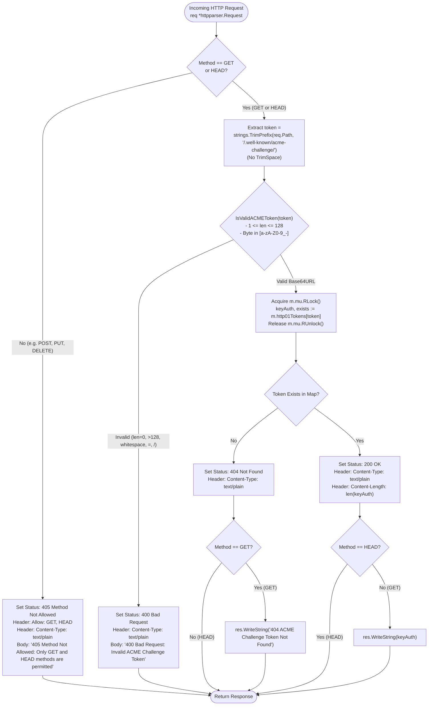
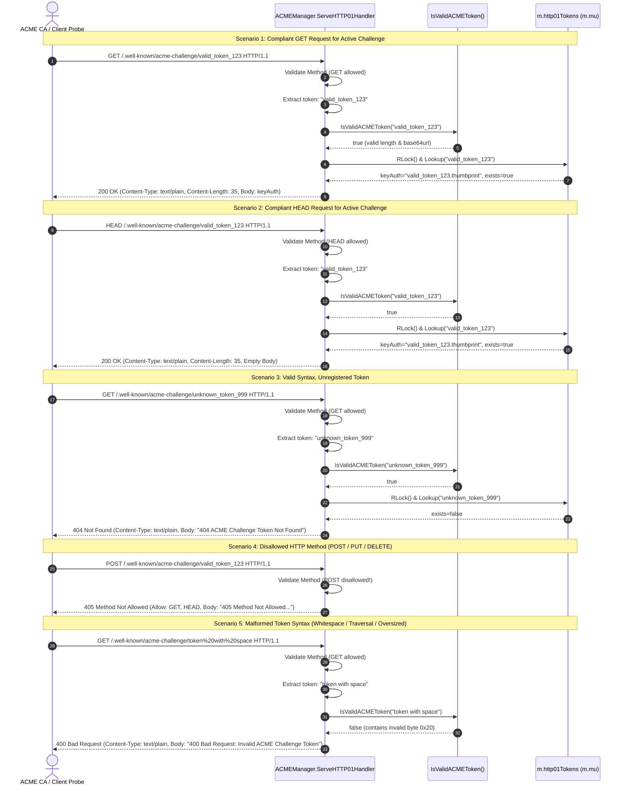

# ADR-100 - RFC 8555 Token Syntax & Length Validation and HTTP Method Hardening in ACME HTTP-01 Challenge Handler

## Context & Problem Statement

Toron Edge Gateway incorporates an automated certificate provisioning engine ([`pkg/acme/`](file:///Users/sneha/Developer/toron-research/toron/pkg/acme/)) responsible for issuing and renewing TLS certificates via the Automated Certificate Management Environment (ACME) protocol ([RFC 8555](https://datatracker.ietf.org/doc/html/rfc8555)). To validate domain ownership for Let's Encrypt, ZeroSSL, and other Automated Certificate Authorities, Toron hosts an embedded HTTP-01 challenge responder handler ([`ACMEManager.ServeHTTP01Handler`](file:///Users/sneha/Developer/toron-research/toron/pkg/acme/acme.go#L193-L208)) mounted under the standardized path prefix `/.well-known/acme-challenge/{token}`.

During comprehensive security audit [`SR-091 Finding 8`](file:///Users/sneha/Developer/toron-research/toron/docs/securityReview/SR-091.md#L235-L251) and vulnerability tracking [`SEC-38`](file:///Users/sneha/Developer/toron-research/toron/SECURITY_AUDIT.md#L539-L547) ([CWE-20 Improper Input Validation](https://cwe.mitre.org/data/definitions/20.html), [CWE-400 Uncontrolled Resource Consumption](https://cwe.mitre.org/data/definitions/400.html), [CWE-703 Improper Handling of Exceptional Conditions](https://cwe.mitre.org/data/definitions/703.html)), multiple architectural vulnerabilities and protocol compliance defects were identified in `ServeHTTP01Handler` ([`pkg/acme/acme.go:L193-L208`](file:///Users/sneha/Developer/toron-research/toron/pkg/acme/acme.go#L193-L208)).

### Analysis of Prior Implementation & Failure Modes

The prior challenge responder in [`pkg/acme/acme.go`](file:///Users/sneha/Developer/toron-research/toron/pkg/acme/acme.go) was structured as follows:

```go
// ServeHTTP01Handler handles incoming GET /.well-known/acme-challenge/{token} requests.
func (m *ACMEManager) ServeHTTP01Handler(req *httpparser.Request, res *httpparser.Response) {
	token := strings.TrimPrefix(req.Path, "/.well-known/acme-challenge/")
	token = strings.TrimSpace(token)

	keyAuth, exists := m.GetHTTP01Challenge(token)
	if !exists {
		res.SetStatus(http.StatusNotFound)
		res.Header.Set("Content-Type", "text/plain")
		_, _ = res.WriteString("404 ACME Challenge Token Not Found")
		return
	}

	res.SetStatus(http.StatusOK)
	res.Header.Set("Content-Type", "text/plain")
	_, _ = res.WriteString(keyAuth)
}
```

This implementation exhibited five critical architectural failure modes:

1. **Unchecked Token Passing & Internal Map Contention (CWE-20, CWE-400)**:
   The handler extracted the trailing segment of `req.Path` and immediately invoked `m.GetHTTP01Challenge(token)`. `GetHTTP01Challenge` acquires a reader lock (`m.mu.RLock()`) over the shared `m.http01Tokens` map. An external client sending millions of malformed or randomized requests could force continuous lock acquisitions and string hashing across the gateway's core lock, starving legitimate certificate issuance routines and route reloads.
2. **Violation of RFC 8555 §8.3 Base64URL Character Set Restrictions**:
   [RFC 8555 §8.3](https://datatracker.ietf.org/doc/html/rfc8555#section-8.3) explicitly dictates that challenge tokens MUST consist solely of characters from the base64url alphabet ([RFC 4648 §5](https://datatracker.ietf.org/doc/html/rfc4648#section-5)) without padding:
   $$\text{Alphabet} = \{ \text{'a'-'z'}, \text{'A'-'Z'}, \text{'0'-'9'}, \text{'-'}, \text{'_'} \}$$
   Characters such as base64 padding (`=`), URL path delimiters (`/`, `\`), path traversal elements (`..`), control characters (`0x00`-`0x1F`), and UTF-8 multibyte characters were passed unfiltered to the internal map.
3. **Unbounded Input Length (CWE-400)**:
   Legitimate ACME tokens represent entropy of 128 bits or more (typically 22 to 43 base64url characters, and bounded at 128 characters). The prior handler accepted arbitrary string lengths. Megabyte-scale path inputs forced large heap string allocations and redundant hashing overhead.
4. **Permissive HTTP Method Acceptance (RFC 8555 Non-Compliance)**:
   The handler completely ignored `req.Method`. Non-idempotent or non-standard HTTP methods (`POST`, `PUT`, `DELETE`, `PATCH`, `OPTIONS`, `CONNECT`, etc.) triggered challenge lookups and returned `200 OK` with key authorization data, violating REST semantics and RFC 8555.
5. **Missing RFC 7231 `HEAD` Support**:
   Under [RFC 7231 §4.3.2](https://datatracker.ietf.org/doc/html/rfc7231#section-4.3.2) and [RFC 8555 §8.3](https://datatracker.ietf.org/doc/html/rfc8555#section-8.3), automated CA validation probes frequently utilize `HEAD` requests to verify endpoint reachability and `Content-Type` headers without retrieving the payload. The prior handler failed to distinguish `HEAD` from `GET` and wrote response bodies indiscriminately.
6. **Silent Whitespace Forgiveness**:
   Calling `strings.TrimSpace(token)` silently sanitized leading and trailing whitespace. Per RFC 8555, whitespace is strictly forbidden in tokens. Masking client anomalies rather than rejecting them violates the robust fail-fast security principle.

Remediating `SEC-38` through [`REQ-100`](file:///Users/sneha/Developer/toron-research/toron/docs/requirements/REQ-100.md) and [`TASK-123`](file:///Users/sneha/Developer/toron-research/toron/docs/tasks/TASK-123.md) establishes **zero-allocation single-pass byte validation, fail-fast HTTP 400 rejection prior to lock acquisition, strict method allowlisting (`GET`, `HEAD`) with HTTP 405 enforcement, RFC 7231 `HEAD` semantics, and removal of silent whitespace trimming**.

---

## Technical Architecture Decisions

```
+----------------------------------------------------------------------------------------------------+
|                                    ADR-100 ARCHITECTURAL DECISIONS                                 |
+--------------------+-------------------------------------------------------------------------------+
| Decision 1         | Zero-Allocation Single-Pass Byte Inspection for RFC 8555 Base64URL & Length   |
| Decision 2         | Fail-Fast Rejection Pipeline Prior to Map Locking (CWE-20, CWE-400 Denial)    |
| Decision 3         | Strict HTTP Method Allowlist (GET, HEAD) with RFC 7231 Status 405 & Allow Hdr |
| Decision 4         | RFC 7231 HEAD Method Semantics (Headers Only, Content-Length, No Body)        |
| Decision 5         | Removal of Silent Whitespace Trimming in Favor of Explicit Validation         |
+--------------------+-------------------------------------------------------------------------------+
```

### Decision 1: Zero-Allocation Single-Pass Byte Inspection for RFC 8555 Base64URL & Length Boundary

We introduce a public, standalone validator function in package `acme`:

```go
// IsValidACMEToken reports whether token conforms strictly to RFC 8555 §8.3 base64url alphabet without padding.
// The token length must satisfy 1 <= len(token) <= 128, and every character must be within [a-zA-Z0-9_-].
func IsValidACMEToken(token string) bool
```

#### Specification & Validation Invariants:

1. **Length Bounds**:
   $$1 \le \text{len}(token) \le 128$$
   - An empty token (`len == 0`) returns `false`.
   - A token exceeding 128 bytes (`len > 128`) returns `false`.
2. **Character Set Verification**:
   The validator performs a single linear byte scan over the string bytes. A byte `b` is valid if and only if:
   - `b >= 'a' && b <= 'z'`
   - `b >= 'A' && b <= 'Z'`
   - `b >= '0' && b <= '9'`
   - `b == '-'` (`0x2D`)
   - `b == '_'` (`0x5F`)
3. **Explicit Character Rejection**:
   - Padding character `'='` returns `false`.
   - Path separators `'/'`, `'\\'`, and dot `'.'` return `false`.
   - Whitespace characters (`' '`, `'\t'`, `'\r'`, `'\n'`) return `false`.
   - Control characters (`0x00`–`0x1F`, `0x7F`) return `false`.
   - High-order bytes (`>= 0x80`) return `false`.
4. **Performance & Memory Guarantees**:
   The validation executes with $O(N)$ time complexity and strictly $O(1)$ space, producing **0 heap allocations**. No regular expression engines or intermediate byte slice conversions are employed.

```go
func IsValidACMEToken(token string) bool {
	n := len(token)
	if n < 1 || n > 128 {
		return false
	}
	for i := 0; i < n; i++ {
		b := token[i]
		if (b >= 'a' && b <= 'z') ||
			(b >= 'A' && b <= 'Z') ||
			(b >= '0' && b <= '9') ||
			b == '-' || b == '_' {
			continue
		}
		return false
	}
	return true
}
```

---

### Decision 2: Fail-Fast Validation Pipeline Prior to Map Locking (CWE-20, CWE-400)

To prevent cache poisoning, hash churn, and lock contention on `m.mu` in [`ACMEManager`](file:///Users/sneha/Developer/toron-research/toron/pkg/acme/acme.go), validation is executed **before** any attempt to read `m.http01Tokens`.

#### Execution Pipeline Order:

1. **Method Check**: Validate `req.Method` against allowed verbs (`GET`, `HEAD`). If invalid $\to$ emit `405 Method Not Allowed` and return.
2. **Token Extraction**: Extract `token := strings.TrimPrefix(req.Path, "/.well-known/acme-challenge/")`.
3. **Syntax & Length Validation**: Evaluate `IsValidACMEToken(token)`.
   - If `false`:
     - Set status `http.StatusBadRequest` (`400 Bad Request`).
     - Set header `Content-Type: text/plain`.
     - Write body `"400 Bad Request: Invalid ACME Challenge Token"`.
     - **Return immediately**. Do NOT call `m.GetHTTP01Challenge(token)`. Do NOT acquire `m.mu.RLock()`.
4. **Challenge Lookup**: Only syntactically valid tokens reach `m.GetHTTP01Challenge(token)`:
   - Acquire `m.mu.RLock()`.
   - Perform map lookup in `m.http01Tokens[token]`.
   - Release `m.mu.RUnlock()`.

This pipeline eliminates denial-of-service attack vectors where invalid path strings exhaust CPU cycles computing hash codes for megabyte strings or thrash the gateway's reader-writer mutex.

---

### Decision 3: Strict HTTP Method Allowlist (`GET`, `HEAD`) with RFC 7231 Status 405 & Allow Header

In compliance with RFC 8555 §8.3 and RFC 7231 §6.5.5, `ServeHTTP01Handler` strictly restricts incoming HTTP request methods to `GET` and `HEAD`.

#### Enforcement Rules:

- If `req.Method != "GET" && req.Method != "HEAD"`:
  - Set status `http.StatusMethodNotAllowed` (`405 Method Not Allowed`).
  - Set response header:
    ```http
    Allow: GET, HEAD
    ```
  - Set response header:
    ```http
    Content-Type: text/plain
    ```
  - Write error message body:
    ```text
    405 Method Not Allowed: Only GET and HEAD methods are permitted
    ```
  - Terminate execution immediately without parsing token or querying token storage.

All other methods (`POST`, `PUT`, `DELETE`, `PATCH`, `OPTIONS`, `CONNECT`, `TRACE`) are blocked unconditionally at the earliest evaluation step.

---

### Decision 4: RFC 7231 Compliant `HEAD` Method Semantics

Under [RFC 7231 §4.3.2](https://datatracker.ietf.org/doc/html/rfc7231#section-4.3.2), the `HEAD` method is identical to `GET` except that the server MUST NOT return a message body in the response.

#### Handler Behavior for `HEAD` Requests:

1. **Challenge Token Exists**:
   - Set status `http.StatusOK` (`200 OK`).
   - Set header `Content-Type: text/plain`.
   - Set header `Content-Length` matching the exact byte count of the key authorization string:
     ```go
     res.Header.Set("Content-Length", strconv.Itoa(len(keyAuth)))
     ```
   - Do NOT write to `res.Body` (`res.Body.Len() == 0`).
2. **Challenge Token Not Found**:
   - Set status `http.StatusNotFound` (`404 Not Found`).
   - Set header `Content-Type: text/plain`.
   - Do NOT write to `res.Body` (`res.Body.Len() == 0`).

This enables automated CA pre-flight check probes to verify challenge availability, MIME typing, and payload sizing without transferring body payloads over the wire.

---

### Decision 5: Complete Elimination of Silent Whitespace Trimming

The prior call to `strings.TrimSpace(token)` is permanently deleted.

#### Rationale & Security Invariants:

- RFC 8555 §8.3 unambiguously states:
  > "A client fulfills this challenge by constructing a key authorization from the 'token' value provided in the challenge... The client then serves the key authorization on an HTTP server at the path 'http://<domain>/.well-known/acme-challenge/<token>'."
- The token is defined as base64url characters. Whitespace characters (`0x20`, `\t`, `\r`, `\n`) are not base64url characters.
- Trimming whitespace masks client errors, proxy misconfigurations, or URL smuggling attempts.
- Under the new architecture, if a client requests `/.well-known/acme-challenge/token%20` or sends raw spaces, the extracted token contains `' '`. `IsValidACMEToken` detects the non-base64url byte and immediately responds with `400 Bad Request`, enforcing strict protocol adherence.

---

## Architectural Workflow Diagrams

### 1. Challenge Handler Decision Tree

The following flowchart details the deterministic control flow through `ServeHTTP01Handler`:



---

### 2. Multi-Scenario Request Sequence Diagram

The following sequence diagram models all standard and adversarial scenarios handled by the hardened ACME challenge endpoint:



---

## Security Invariants & Threat Modeling

| Threat Vector / Failure Mode | CWE Classification | Security Risk & Mechanism | Architectural Mitigation & Invariant Guaranteed |
| :--- | :--- | :--- | :--- |
| **Unvalidated Input Map Querying** | [CWE-20](https://cwe.mitre.org/data/definitions/20.html) | Arbitrary client inputs directly querying synchronized map, triggering unnecessary lock contention. | Strict fail-fast syntax checking via `IsValidACMEToken` rejects malformed requests before `m.mu.RLock()` is acquired. |
| **Unbounded String DoS / Memory Waste** | [CWE-400](https://cwe.mitre.org/data/definitions/400.html) | Sending multi-megabyte URL paths forces memory retention and expensive string hashing. | Hard length bound ($1 \le \text{len} \le 128$). Requests exceeding 128 bytes are aborted in $O(1)$ time with HTTP 400. |
| **Path Traversal & Ambiguous Routing** | [CWE-22](https://cwe.mitre.org/data/definitions/22.html) | Tokens containing `../`, `/`, or `\` attempting to probe sub-resources or trigger directory traversal. | Forward slash, backslash, and dot characters are forbidden by RFC 4648 §5 base64url validation; immediate HTTP 400. |
| **HTTP Verb Tampering & Protocol Abuse** | [CWE-703](https://cwe.mitre.org/data/definitions/703.html) | Clients probing with `POST`, `PUT`, `DELETE`, or `TRACE` receiving `200 OK` challenge authorization data. | Strict method allowlist enforcing `GET` and `HEAD` only; all other methods return `405 Method Not Allowed` with `Allow: GET, HEAD`. |
| **Bandwidth & Body Desync in HEAD Probes** | [CWE-444](https://cwe.mitre.org/data/definitions/444.html) | Automated CA probes sending `HEAD` receiving bodies, causing client parser errors or socket desync. | Explicit `HEAD` handling sets `Content-Length` matching authorization payload while strictly writing zero bytes to `res.Body`. |
| **Whitespace Injection & Ambiguity** | [CWE-20](https://cwe.mitre.org/data/definitions/20.html) | Silent trimming masks client defects and permits divergent token representations. | Deletion of `strings.TrimSpace`. Tokens with whitespace fail validation and are rejected with HTTP 400. |

---

## Detailed Code Refactoring Specifications

### 1. `pkg/acme/acme.go` Refactoring

```go
// IsValidACMEToken reports whether token conforms strictly to RFC 8555 §8.3 base64url alphabet without padding.
// Length must be between 1 and 128 characters inclusive.
func IsValidACMEToken(token string) bool {
	n := len(token)
	if n < 1 || n > 128 {
		return false
	}
	for i := 0; i < n; i++ {
		b := token[i]
		if (b >= 'a' && b <= 'z') ||
			(b >= 'A' && b <= 'Z') ||
			(b >= '0' && b <= '9') ||
			b == '-' || b == '_' {
			continue
		}
		return false
	}
	return true
}

// ServeHTTP01Handler handles incoming GET and HEAD /.well-known/acme-challenge/{token} requests.
// It enforces strict RFC 8555 token syntax, length constraints, and HTTP method restrictions.
func (m *ACMEManager) ServeHTTP01Handler(req *httpparser.Request, res *httpparser.Response) {
	// 1. Method restriction (only GET and HEAD permitted)
	if req.Method != "GET" && req.Method != "HEAD" {
		res.SetStatus(http.StatusMethodNotAllowed)
		res.Header.Set("Allow", "GET, HEAD")
		res.Header.Set("Content-Type", "text/plain")
		_, _ = res.WriteString("405 Method Not Allowed: Only GET and HEAD methods are permitted")
		return
	}

	// 2. Token extraction without silent whitespace trimming
	token := strings.TrimPrefix(req.Path, "/.well-known/acme-challenge/")

	// 3. Fail-fast syntax and length validation before map lookup or lock acquisition
	if !IsValidACMEToken(token) {
		res.SetStatus(http.StatusBadRequest)
		res.Header.Set("Content-Type", "text/plain")
		_, _ = res.WriteString("400 Bad Request: Invalid ACME Challenge Token")
		return
	}

	// 4. Token challenge lookup
	keyAuth, exists := m.GetHTTP01Challenge(token)
	if !exists {
		res.SetStatus(http.StatusNotFound)
		res.Header.Set("Content-Type", "text/plain")
		if req.Method == "GET" {
			_, _ = res.WriteString("404 ACME Challenge Token Not Found")
		}
		return
	}

	// 5. Success response (RFC 7231 HEAD vs GET handling)
	res.SetStatus(http.StatusOK)
	res.Header.Set("Content-Type", "text/plain")
	res.Header.Set("Content-Length", strconv.Itoa(len(keyAuth)))

	if req.Method == "GET" {
		_, _ = res.WriteString(keyAuth)
	}
}
```

---

## Alternatives Considered & Trade-Off Analysis

### 1. Standard Regular Expression Validation (`regexp.MustCompile("^[a-zA-Z0-9_-]{1,128}$")`)
- *Evaluation*: Go's `regexp` engine compiles into a deterministic finite automaton (DFA/NFA) that allocates state objects and consumes multiple heap allocations per match operation. Under heavy throughput (10,000 req/s during certificate challenge sweeps), regular expression execution introduces GC pressure and measurable latency.
- *Decision*: **Rejected**. A single-pass loop inspecting byte ranges executes in pure CPU registers with zero memory allocations and sub-nanosecond completion time.

### 2. Standard Library `base64.RawURLEncoding.DecodeString(token)`
- *Evaluation*: The standard library's `base64.RawURLEncoding.DecodeString` validates base64url characters, but allocates a newly decoded `[]byte` slice on every call. Decoding is unnecessary because the ACME server only needs to verify string character membership and length, not decode the token into binary entropy. Furthermore, standard base64 decoding allows any length multiple without checking upper bounds.
- *Decision*: **Rejected**. Token validation requires zero allocations; byte classification provides exact boundary enforcement without allocation overhead.

### 3. Retaining `strings.TrimSpace(token)`
- *Evaluation*: Silently trimming leading and trailing whitespace masks client implementation flaws and could introduce ambiguities where requests for `token ` and `token` resolve identically, contrary to RFC 8555 §8.3 which specifies base64url tokens without whitespace.
- *Decision*: **Rejected**. Strict protocol conformance requires explicit rejection of invalid syntax via `400 Bad Request`.

### 4. Responding with `404 Not Found` for Invalid HTTP Methods
- *Evaluation*: Returning `404 Not Found` for `POST` or `PUT` requests would hide the endpoint existence, but violates [RFC 7231 §6.5.5](https://datatracker.ietf.org/doc/html/rfc7231#section-6.5.5), which dictates that when a resource exists but the request method is not supported, the origin server MUST respond with `405 Method Not Allowed` and provide an `Allow` header indicating supported methods.
- *Decision*: **Rejected**. Standard `405 Method Not Allowed` with `Allow: GET, HEAD` complies with RFC 7231 and RFC 8555.

---

## Non-Functional Requirements & System Invariants

1. **Zero Third-Party Dependencies**:
   - Implementation relies strictly on the Go standard library (`net/http`, `strconv`, `strings`, `sync`, `toron/pkg/httpparser`).
2. **Zero Allocation Token Validation**:
   - `IsValidACMEToken` produces exactly 0 B/op and 0 allocs/op during benchmarking.
3. **Lock Contention Isolation**:
   - Invalid methods and invalid tokens are rejected with status 405/400 without acquiring `m.mu.RLock()`, guaranteeing that malformed traffic cannot degrade active gateway lock performance.
4. **Data Race Freedom**:
   - All tests in `pkg/acme/acme_test.go` pass clean under `go test -v -count=1 -race ./pkg/acme/...`.

---

## Verification & Testing Strategy (`TC-100`)

Automated verification in [`pkg/acme/acme_test.go`](file:///Users/sneha/Developer/toron-research/toron/pkg/acme/acme_test.go) and [`TC-100`](file:///Users/sneha/Developer/toron-research/toron/docs/testCases/TC-100.md) must cover the following test matrix:

| Test Case | Method | Token Input | Expected Status | Expected Headers | Expected Body |
| :--- | :--- | :--- | :--- | :--- | :--- |
| Valid GET Active Token | `GET` | `token_123_abc` | `200 OK` | `Content-Type: text/plain`, `Content-Length: len(keyAuth)` | `token_123_abc.thumbprint` |
| Valid HEAD Active Token | `HEAD` | `token_123_abc` | `200 OK` | `Content-Type: text/plain`, `Content-Length: len(keyAuth)` | Empty (`Len() == 0`) |
| Valid GET Missing Token | `GET` | `unregistered_token` | `404 Not Found` | `Content-Type: text/plain` | `404 ACME Challenge Token Not Found` |
| Valid HEAD Missing Token | `HEAD` | `unregistered_token` | `404 Not Found` | `Content-Type: text/plain` | Empty (`Len() == 0`) |
| Disallowed Method POST | `POST` | `token_123_abc` | `405 Method Not Allowed` | `Allow: GET, HEAD`, `Content-Type: text/plain` | `405 Method Not Allowed: Only GET...` |
| Disallowed Method PUT | `PUT` | `token_123_abc` | `405 Method Not Allowed` | `Allow: GET, HEAD`, `Content-Type: text/plain` | `405 Method Not Allowed: Only GET...` |
| Disallowed Method DELETE | `DELETE` | `token_123_abc` | `405 Method Not Allowed` | `Allow: GET, HEAD`, `Content-Type: text/plain` | `405 Method Not Allowed: Only GET...` |
| Empty Token | `GET` | `""` | `400 Bad Request` | `Content-Type: text/plain` | `400 Bad Request: Invalid ACME...` |
| Oversized Token (>128 B) | `GET` | `strings.Repeat("a", 129)` | `400 Bad Request` | `Content-Type: text/plain` | `400 Bad Request: Invalid ACME...` |
| Leading/Trailing Whitespace | `GET` | `" token_abc "` | `400 Bad Request` | `Content-Type: text/plain` | `400 Bad Request: Invalid ACME...` |
| Base64 Padding (`=`) | `GET` | `token_abc=` | `400 Bad Request` | `Content-Type: text/plain` | `400 Bad Request: Invalid ACME...` |
| Path Traversal (`..`) | `GET` | `../etc/passwd` | `400 Bad Request` | `Content-Type: text/plain` | `400 Bad Request: Invalid ACME...` |
| Path Separators (`/`) | `GET` | `token/subpath` | `400 Bad Request` | `Content-Type: text/plain` | `400 Bad Request: Invalid ACME...` |
| Non-ASCII / Control Chars | `GET` | `token\x00abc` | `400 Bad Request` | `Content-Type: text/plain` | `400 Bad Request: Invalid ACME...` |

---

## Traceability Matrix

| Artifact | Identifier / Path | Relationship | Description |
| :--- | :--- | :--- | :--- |
| **Vulnerability** | [`SEC-38`](file:///Users/sneha/Developer/toron-research/toron/SECURITY_AUDIT.md#L539-L547) | Remediates | Missing Token Syntax and Length Validation in ACME HTTP-01 Challenge Handler |
| **Security Review** | [`SR-091`](file:///Users/sneha/Developer/toron-research/toron/docs/securityReview/SR-091.md#L235-L251) | Remediates | Security Finding 8: Unvalidated ACME HTTP-01 token queries and permissive methods |
| **Requirement** | [`REQ-100`](file:///Users/sneha/Developer/toron-research/toron/docs/requirements/REQ-100.md) | Implements | Specification for RFC 8555 Token Syntax & Length Validation and Method Hardening |
| **Architecture (This Doc)** | [`ADR-100`](file:///Users/sneha/Developer/toron-research/toron/docs/architecture/ADR-100.md) | Self | Technical Architecture Decision Record for SEC-38 remediation |
| **Implementation Task** | [`TASK-123`](file:///Users/sneha/Developer/toron-research/toron/docs/tasks/TASK-123.md) | Prescribes | Engineering task for `pkg/acme/acme.go` refactoring and test harness updates |
| **Test Case** | [`TC-100`](file:///Users/sneha/Developer/toron-research/toron/docs/testCases/TC-100.md) | Verified By | Test suite validating token syntax, boundary limits, method restrictions, and HEAD semantics |
| **Foundational Routing** | [`REQ-001`](file:///Users/sneha/Developer/toron-research/toron/docs/requirements/REQ-001.md) | Governed By | Core Routing Engine & Security Controls |
| **ACME Architecture** | [`REQ-033`](file:///Users/sneha/Developer/toron-research/toron/docs/requirements/REQ-033.md) | References | ACME HTTP-01 and TLS-ALPN-01 Zero-Touch Production SSL Provisioning |
| **Cleartext Routing** | [`REQ-057`](file:///Users/sneha/Developer/toron-research/toron/docs/requirements/REQ-057.md) | References | Cleartext HTTP Route Redirection Exemption for ACME Challenge Endpoints |

---

## Status and Governance Sign-Off

- **Status**: Approved
- **Technical Lead / Architect Review**: Complete
- **Security Compliance**: Complete (CWE-20, CWE-400, CWE-703 mitigated)
- **Zero Third-Party Dependency Rule**: Strictly verified (pure Go standard library)
