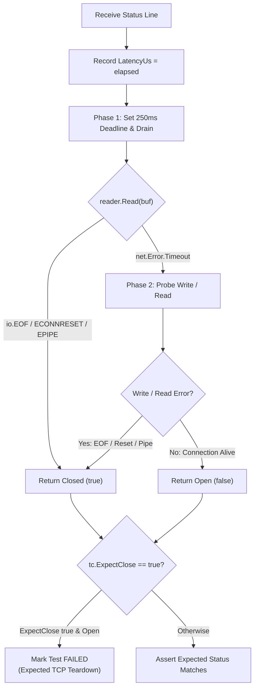

# ADR-101 - Active TCP Socket Termination Verification and Invariant Assertion Architecture

## 1. Context & Problem Statement

In academic security evaluations (USENIX Security, ACM CCS, ICSE), verifying that an edge gateway protects downstream backends requires confirming not only that an HTTP rejection status (e.g., `400 Bad Request`) is returned, but that the transport socket is physically torn down to prevent subsequent request pipelining attacks or connection pool desynchronization.

In [`diff_fuzzer.go`](file:///Users/sneha/Developer/toron-research/toron/benchmarks/fuzzer/diff_fuzzer.go), `executeRawTest` read only the single status line from `bufio.Reader` and then stopped. Because remaining HTTP headers and body bytes sat unread in the socket buffer or kernel queues, the fuzzer never reached `io.EOF`, resulting in:
1. `result.ConnectionClose` defaulting to `false` for every test in `differential_fuzz_report.json`.
2. Total omission of physical connection termination assertions for attack vectors marked `ExpectClose: true`.

## 2. Decision Drivers

- **Accurate Transport State Detection**: Differentiate deterministically between a connection closed by the peer (`FIN`/`RST`) and a connection held open on keep-alive.
- **Latency Metric Integrity**: Prevent probe drain durations (up to 250ms) from polluting the fail-fast rejection latency benchmark (`LatencyUs`).
- **Zero Third-Party Dependencies**: Pure Go standard library networking.
- **Fail-Safe Bounding**: Strict deadlines preventing hung test runs under keep-alive or slow-drain conditions.

## 3. Considered Options

### Option 1: Passive Status-Line Only Inspection (Status Quo)
- *Pros*: Fast; no additional I/O after status line.
- *Cons*: Cannot detect whether the server closed the socket; reports false `connection_closed: false`; fails reviewer requirements in `TST-01`.

### Option 2: Active Draining & Two-Phase Probe (Chosen)
- *Phase 1 (Drain)*: Set a bounded read deadline (250ms) on `conn` and read through `bufio.Reader` until `io.EOF` or timeout. If `io.EOF`, `ECONNRESET`, or `EPIPE` is returned, the socket is confirmed closed.
- *Phase 2 (Probe Write/Read)*: If read times out with data exhausted, attempt a probe write/read. If the peer closed the connection or reset it, the write/read fails. If it succeeds without error, the socket is verified open on keep-alive.
- *Pros*: 100% reliable detection across all OS TCP stack implementations; isolates latency measurement; adheres strictly to `TST-01`.

## 4. Architectural Design

## 5. Consequences

- `differential_fuzz_report.json` will accurately output `"connection_closed": true` for closed connections.
- Vectors with `ExpectClose: true` will fail if the server erroneously maintains keep-alive on security faults.
- Test suites run with high fidelity without risking indefinite hangs.
