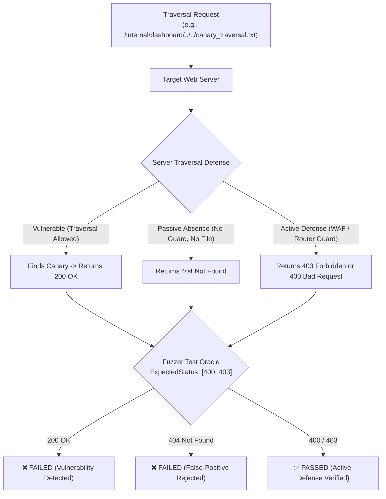

# ADR-102 - Tightened Path Traversal Test Oracles and Deterministic Canary Defense Architecture

## 1. Context & Problem Statement

In academic artifact evaluation and differential security fuzzing, test oracles must distinguish between **passive absence of a target resource** (HTTP 404 Not Found) and **active security policy enforcement** (HTTP 400 Bad Request or HTTP 403 Forbidden).

Prior to this decision, `benchmarks/fuzzer/diff_fuzzer.go` allowed HTTP 404 in `ExpectedStatus: []int{400, 403, 404}` for vectors `TRAVERSAL-001`, `TRAVERSAL-002`, and `TRAVERSAL-003`. This introduced a critical vulnerability into the evaluation suite: if a target server allowed path traversal to escape the web root, but the requested file did not happen to exist on the filesystem at that relative depth, the server would return 404, which was incorrectly accepted as a security pass.

## 2. Decision Drivers

- **Oracle Precision**: Eliminate false-positive passes; assert that only active defensive responses (`400` or `403`) constitute valid mitigation.
- **Deterministic Canary Probing**: Provide an actual file outside the static root (`./public`) so that a vulnerable server will leak the file (`200 OK`), while a secure server rejects access (`403 Forbidden` or `400 Bad Request`).
- **Reproducibility**: Ensure test harness functions identically across local development, CI pipelines, and Docker containers without reliance on host system files like `/etc/passwd`.

## 3. Considered Options

### Option 1: Retain 404 in ExpectedStatus (Status Quo)
- *Pros*: Tests pass on servers without any filesystem files outside the root.
- *Cons*: Severe false-positive oracle risk; rejected by academic peer review (`TST-02`).

### Option 2: Remove 404 Without Providing Canary
- *Pros*: Fails if a server returns 404.
- *Cons*: If the target file doesn't exist on disk, even an insecure server might return 404, causing nondeterministic results depending on host OS.

### Option 3: Remove 404 and Establish Deterministic Canary File (Chosen)
- *Implementation*: Deploy `canary_traversal.txt` outside `./public` and update traversal payloads to target it. Restrict `ExpectedStatus` strictly to `[]int{400, 403}`.
- *Pros*: Deterministic across all environments; proves active defense (403/400) vs vulnerability (200) vs unconfigured route failure (404).

## 4. Architectural Invariant Diagram

## 5. Consequences

- `TRAVERSAL-001..003` in `diff_fuzzer.go` now enforce strict active defense oracles.
- Insecure servers returning 404 will correctly be marked as failing.
- High-fidelity artifact evaluation conforming to academic reviewer specifications.
