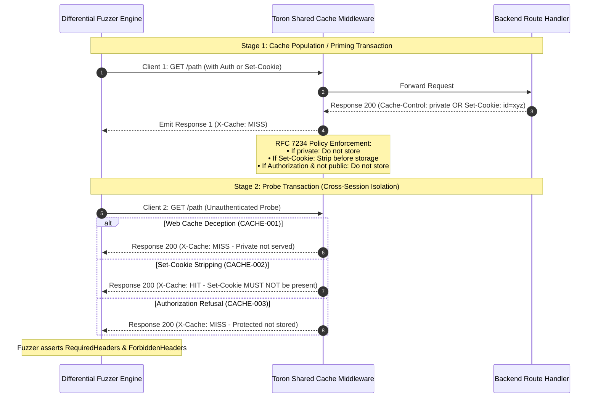

# ADR-103 - Multi-Stage Sequential Socket Execution and Cache Boundary Invariant Assertion Architecture

## 1. Context & Problem Statement

In HTTP differential protocol fuzzing, protocol security testing was previously limited to single-shot request/response pairs (`RawPayload string`). While single-shot execution is sufficient for grammar parsing and URI traversal checks, stateful session boundary attacks—such as RFC 7234 Shared Cache Poisoning, Web Cache Deception (CWE-524), and Session Hijacking via `Set-Cookie` leakage (CWE-384)—fundamentally require multiple interacting transactions:
1. An initial transaction that attempts to store or alter cache state (e.g. an authenticated request or a response setting session cookies).
2. A subsequent unauthenticated probe transaction that inspects whether the shared cache erroneously reused private data or leaked session identifiers.

Furthermore, cache boundary assertions require inspecting HTTP response headers (e.g. `X-Cache: HIT|MISS`, `Set-Cookie`, `Age`), whereas `diff_fuzzer.go` previously only parsed the status line (`statusLine, _ := reader.ReadString('\n')`).

## 2. Decision Drivers

- **Stateful Multi-Stage Execution**: Enable differential fuzzer test cases to execute sequential TCP transactions deterministically without third-party dependencies.
- **Header Invariant Verification**: Provide fine-grained assertions over emitted HTTP response headers (`RequiredResponseHeaders`, `ForbiddenResponseHeaders`).
- **Standardized RFC 7234 Compliance**: Test vectors must verify Web Cache Deception prevention (`CACHE-001`), `Set-Cookie`/`Set-Cookie2` stripping (`CACHE-002`), and unauthenticated access refusal to authenticated cached objects (`CACHE-003`).
- **Zero Third-Party Dependencies & Concurrency Safety**: Pure Go standard library networking, deterministic socket lifecycle handling, and race-free execution under `go test -race`.

## 3. Considered Options

### Option 1: Integrate an External HTTP Client Library (e.g. fasthttp, resty)
- *Pros*: Built-in cookie and header handling.
- *Cons*: Violates Toron's strict zero-external-dependency rule and obscures raw wire-level byte desynchronization and connection boundaries.

### Option 2: Retain Single-Shot Socket Execution
- *Pros*: Minimal code churn.
- *Cons*: Incapable of verifying multi-step cache deception or session leakage; rejected by academic peer review (`TST-03`).

### Option 3: Extend `diff_fuzzer.go` with Sequential Payloads & Header Parser (Chosen)
- *Implementation*:
  - Add `SequentialPayloads []string`, `ForbiddenResponseHeaders []string`, and `RequiredResponseHeaders map[string]string` to `TestCase`.
  - In `executeRawTest`, if `len(tc.SequentialPayloads) > 0`, sequentially dial and execute each preparatory request, draining responses. Execute the final payload as the probe request, measuring latency, parsing status line and headers, and verifying assertions.
  - Parse response headers into an `http.Header` structure using a standard `bufio.Reader` loop.
- *Pros*: Zero external dependencies, precise wire-level control, complete coverage of RFC 7234 caching boundary invariants.

## 4. Architectural Invariant Diagram

## 5. Consequences

- `diff_fuzzer.go` natively supports multi-stage protocol interaction testing.
- Cross-tenant data leaks and session boundary breaches are deterministically caught during CI and differential benchmarking.
- Retains backwards compatibility with all existing single-stage test vectors.
