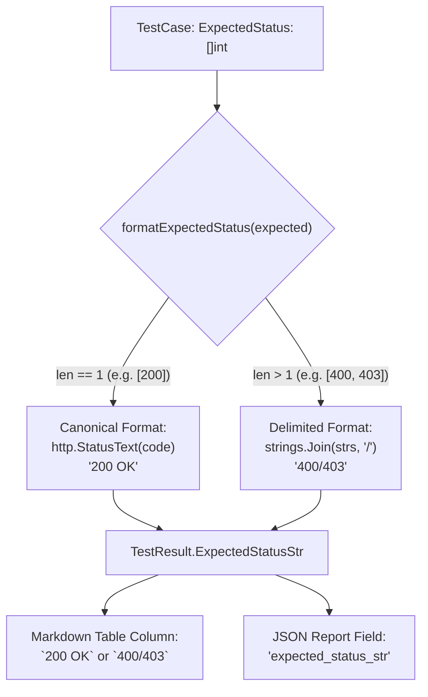

# ADR-104 - Canonical RFC HTTP Status Code and Text Formatting in Differential Fuzzer Reporting

## 1. Context & Problem Statement

The differential fuzzer (`benchmarks/fuzzer/diff_fuzzer.go`) outputs two reporting artifacts: `benchmarks/results/differential_fuzz_report.json` and `benchmarks/results/differential_fuzz_report.md`.
In the Markdown report generation, the `Expected Status` column was populated using a hardcoded string fallback (`expectedStr := "400/501"`), with a rudimentary conditional check for `BASELINE-001` that mapped it to `"200"` instead of canonical RFC format (`200 OK`). Furthermore, `TestResult` omitted the expected status slice, preventing consumers of the JSON report from inspecting the test specification expectations alongside actual execution outcomes.

This created reporting ambiguity during peer review (`TST-04`), as baseline requests appeared either misconfigured or incompletely labeled in the published artifact reports.

## 2. Decision Drivers

- **Dynamic Resolution**: Expected status codes must be computed dynamically directly from the `TestCase.ExpectedStatus` definition rather than hardcoded string branches.
- **Canonical RFC Status Text**: Single expected status codes must include their canonical RFC status phrase (e.g. `200 OK`, `400 Bad Request`) via `http.StatusText(code)`.
- **Multi-Code Delimitation**: When multiple status codes are acceptable (e.g. `[400, 501]` or `[400, 403]`), they must be rendered cleanly as a slash-delimited list (`400/501`, `400/403`).
- **Reporting Consistency**: Both JSON (`differential_fuzz_report.json`) and Markdown (`differential_fuzz_report.md`) must preserve expected status information identically.

## 3. Considered Options

### Option 1: Hardcode an If-Else Map in Report Generation
- *Pros*: Quick patch.
- *Cons*: Fragile; any new test case with non-default expected codes will render incorrectly. Rejected.

### Option 2: Centralized Canonical Formatting Helper (Chosen)
- *Implementation*:
  - Define `formatExpectedStatus(expected []int) string`:
    ```go
    func formatExpectedStatus(expected []int) string {
        if len(expected) == 0 {
            return "N/A"
        }
        if len(expected) == 1 {
            text := http.StatusText(expected[0])
            if text != "" {
                return fmt.Sprintf("%d %s", expected[0], text)
            }
            return strconv.Itoa(expected[0])
        }
        strs := make([]string, len(expected))
        for i, code := range expected {
            strs[i] = strconv.Itoa(code)
        }
        return strings.Join(strs, "/")
    }
    ```
  - Store `ExpectedStatus []int` and `ExpectedStatusStr string` in `TestResult`.
  - Use `r.ExpectedStatusStr` in Markdown table rendering.
- *Pros*: Completely generic, zero maintenance overhead for future test additions, guarantees `BASELINE-001` renders as `200 OK`.

## 4. Architectural Invariant Diagram



## 5. Consequences

- `BASELINE-001` unambiguously displays `200 OK` across all report formats.
- All existing and future test cases dynamically format their expected statuses without ad-hoc conditional logic.
- Eliminates reviewer concerns regarding report formatting accuracy.
