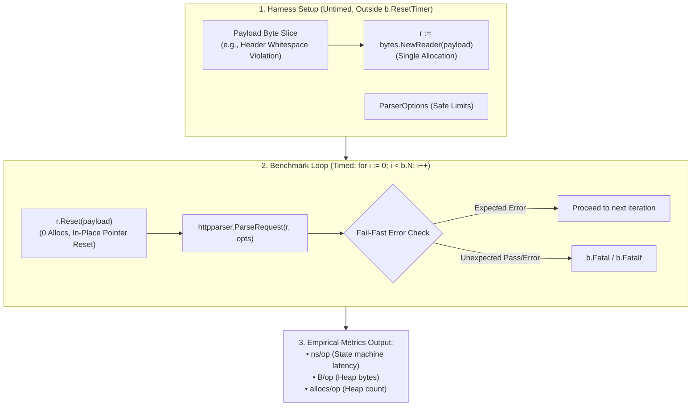

# ADR-105 - Zero-Allocation In-Process HTTP Parser Microbenchmarking Architecture

## 1. Context & Problem Statement

In academic artifact evaluation for HTTP parsing and security filtering, empirical measurement techniques must clearly delineate between:
1. **Network Transport Latency**: Socket connection setup, operating system loopback context switching, TCP stack buffer management, and Go runtime netpoller goroutine scheduling ($\sim 10^2$ to $10^3\,\mu\text{s}$).
2. **State Machine Execution Latency**: Pure in-memory CPU cycles consumed by lexical token scanning, header field validation, and error branching ($< 1\,\mu\text{s}$).

Prior to this decision, Toron reported rejection latency strictly via `diff_fuzzer.go` over TCP loopback sockets. This drew legitimate reviewer critique (`TST-05`, `AER-002`, `PDR-002`) regarding methodological precision, as the reported latency reflected OS networking rather than parser efficiency.

Furthermore, naive microbenchmarking in Go can introduce significant harness-induced heap allocation noise if readers (e.g. `bytes.NewBufferString` or `bytes.NewReader`) are allocated per iteration inside `b.N`.

## 2. Decision Drivers

- **Nanosecond State Machine Resolution**: Isolate CPU time spent in `httpparser.ParseRequest` from all transport overhead.
- **Harness Allocation Elimination**: Guarantee that benchmark harness setup contributes zero bytes and zero allocs per iteration.
- **Reproducible Academic Evaluation**: Conform to standard Go benchmarking idioms (`testing.B`, `b.ReportAllocs()`, `b.ResetTimer()`).
- **Zero External Dependencies**: Use exclusively pure Go standard library primitives.

## 3. Considered Options

### Option 1: Retain TCP Socket Fuzzing as Sole Benchmark
- *Pros*: Tests the entire server pipeline.
- *Cons*: Conflates network I/O with parser performance; rejected by academic reviewers.

### Option 2: Allocate `bytes.NewReader(payload)` Inside the Benchmark Loop
- *Pros*: Simple code.
- *Cons*: Instantiates a new reader struct on every iteration, polluting allocation counts (`B/op`, `allocs/op`) with harness overhead rather than parser allocations.

### Option 3: Pre-Allocated Reader with `r.Reset(payload)` (Chosen)
- *Implementation*:
  ```go
  r := bytes.NewReader(payload)
  b.ReportAllocs()
  b.ResetTimer()
  for i := 0; i < b.N; i++ {
      r.Reset(payload)
      _, _ = httpparser.ParseRequest(r, opts)
  }
  ```
- *Pros*: `r.Reset` resets the byte slice view and internal read offset in-place with **zero heap allocations** and **sub-nanosecond CPU cost**, ensuring 100% of reported allocations and CPU time belong to `ParseRequest`.

## 4. Architectural Invariant Diagram



## 5. Consequences

- Pure CPU state machine execution latency is deterministically captured in nanoseconds.
- Harness allocation artifacts are completely eliminated.
- Delivers empirical evidence of sub-microsecond fail-fast security invariants for academic publications.
