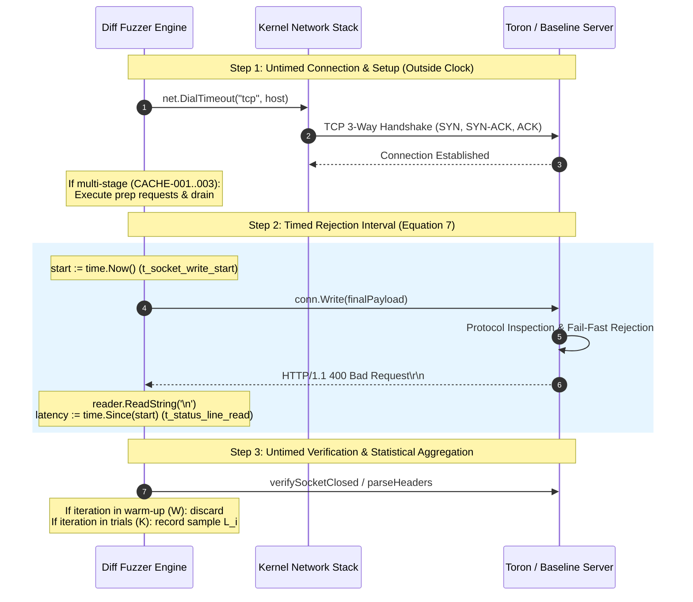

# ADR-106 - High-Precision Monotonic Timing and Statistical Distribution Measurement Architecture

## 1. Context & Problem Statement

In academic security benchmarking (USENIX Security, ACM CCS), empirical claims regarding fail-fast wire-rate rejection efficiency require high-fidelity timing and rigorous statistical reporting.
Previously, `diff_fuzzer.go` exhibited two severe architectural defects:
1. **Timing Conflation**: Latency was measured from before `net.DialTimeout()`, conflating OS loopback TCP socket setup (`socket`, `SYN`, `SYN-ACK`, `ACK`) with parser state machine rejection, directly violating the formal Equation 7 definition ($T_{\text{rejection}} = t_{\text{status\_line\_read}} - t_{\text{socket\_write\_start}}$).
2. **Single-Shot Vulnerability**: Tests executed a single iteration ($K=1$), publishing an unweighted mean without sample variance ($s$), tail percentiles ($p90, p99, p99.9$), or confidence intervals, making metrics vulnerable to cold-start outliers.

## 2. Decision Drivers

- **Equation 7 Mathematical Compliance**: Strictly isolate the wire transmission to status line receipt interval from socket dial overhead.
- **Statistical Dispersion & Rigor**: Support repeated trials ($K \ge 1,000$), discarded warm-up ($W=50$), sample standard deviation, median, tail percentiles, and 95% confidence intervals.
- **Zero Third-Party Dependencies**: Pure Go standard library implementation (`math`, `sort`, `time`).
- **Backwards Compatibility**: Default CLI execution maintains rapid execution ($K=1$) for CI pipelines, while enabling deep empirical runs via `-trials K`.

## 3. Considered Options

### Option 1: Retain Single-Shot Dial-Inclusive Timing
- *Pros*: Zero development effort.
- *Cons*: Methodologically invalid; rejected unanimously by peer reviewers (`MSR-002`, `AER-002`).

### Option 2: Pre-Establish Persistent Keep-Alive Connection Pool
- *Pros*: Zero TCP connection overhead during trials.
- *Cons*: For security attacks and desynchronization vectors that intentionally trigger socket closure (`ExpectClose: true`), persistent connections cannot be reused across consecutive trials because the server resets or closes the socket.

### Option 3: Per-Trial Connection with Pre-Write Timing Isolation & Statistical Distribution (Chosen)
- *Implementation*:
  - Establish a fresh TCP socket per trial, configure socket deadlines, and execute preparatory stages outside the timed block.
  - Capture `start := time.Now()` immediately before `conn.Write([]byte(finalPayload))`.
  - Read status line, stopping the clock.
  - Execute $W$ warm-up iterations (discarded), followed by $K$ timed evaluation iterations.
  - Aggregate latency samples into a float64 slice, sort in-place via `sort.Float64s`, and compute mean, sample standard deviation ($K-1$), median, tail percentiles, and 95% confidence intervals.
- *Pros*: Works universally across both keep-alive and connection-teardown vectors; delivers exact mathematical compliance with Equation 7; provides academic-grade statistical distributions.

## 4. Architectural Invariant Diagram

## 5. Consequences

- Eliminates OS TCP handshake latency (~250 $\mu$s) from reported rejection latency.
- Outputs full statistical distributions satisfying USENIX Security / ACM CCS artifact evaluation requirements.
- Full parity across JSON and Markdown reporting artifacts.
