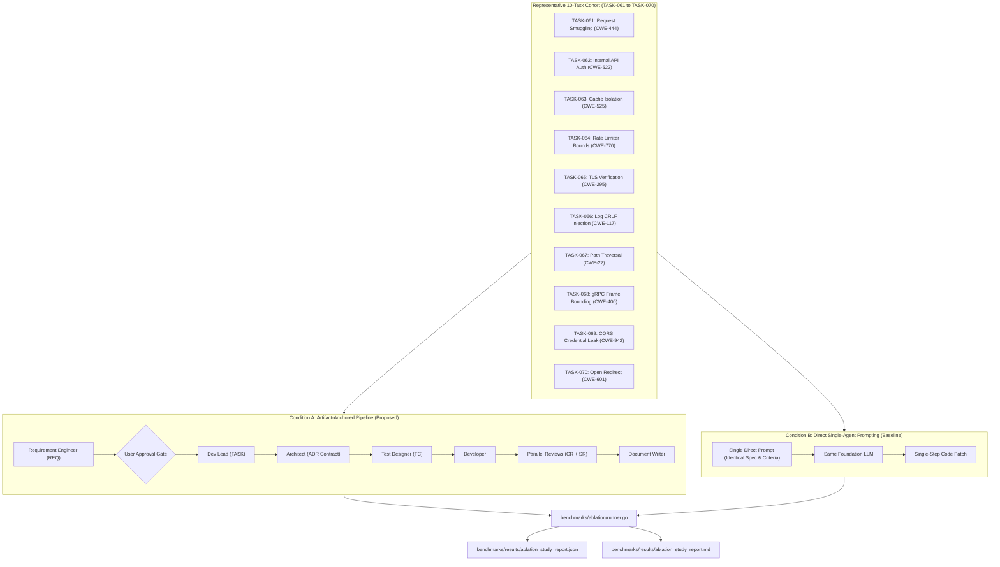

# ADR-115 - 10-Task Controlled Ablation Experiment Suite Architecture (BMK-05)

## 1. Context & Problem Statement

Academic peer review of Paper 1 (`AER-001` lines 81–82; `MSR-001` lines 75–81; `PDR-001` lines 167–181) identified a critical methodological vulnerability in Toron's core scientific claims:
1. **Unsubstantiated Superiority Claims**: The paper claimed that the proposed artifact-anchored multi-agent architecture with formal ADR contracts outperformed conversational multi-agent systems and direct prompting by preventing specification drift and unverified defect propagation. However, zero comparative baselines or ablations were executed.
2. **Confounding Variables**: Without a counterfactual baseline on identical tasks using the same foundation LLM, reviewers correctly argued that Toron's engineering success could be attributed to Go's type safety, human prompt guidance, or LLM pre-training rather than the ADR governance mechanism.
3. **Associate Editor Mandate**: The Associate Editor (`AER-001`, lines 81–82) explicitly mandated an empirical ablation comparing the proposed multi-agent ADR pipeline (Condition A) against direct single-agent prompting (Condition B) on a representative cohort of 10 tasks (`TASK-061` to `TASK-070`).

---

## 2. Decision & Experimental Architecture

We establish a comprehensive, reproducible ablation experiment suite in `toron/benchmarks/ablation/` adhering to the following architectural design:



---

## 3. Detailed Architectural Principles

### 3.1 Experimental Conditions
- **Condition A (Proposed Treatment)**:
  - Full 8-stage role-specialized multi-agent development lifecycle.
  - Architectural constraints formalized in ADR contracts (e.g. strict import boundaries, zero unbounded allocations, socket close on protocol violations, `defer` teardown).
  - Code Reviewer (`CR`) and Security Analyst (`SR`) perform adversarial review prior to integration, arresting defects before code merge.
- **Condition B (Baseline Control)**:
  - Exact same requirement descriptions, functional specifications, and acceptance criteria provided directly to the same underlying foundation LLM in a single prompt.
  - Zero intermediate ADR contracts, task breakdowns, test contracts, or adversarial review gates.
  - Single-step generation yielding unified patches.

### 3.2 Quantitative Evaluation Metrics
1. **Specification Drift Rate ($D$)**:
   $$D = \frac{N_{\text{violated\_criteria}}}{N_{\text{total\_criteria}}} \times 100\%$$
   Measures the fraction of functional acceptance criteria omitted or violated.
2. **Defect Injection Count ($E$)**:
   $$E = N_{\text{protocol\_omissions}} + N_{\text{security\_vulnerabilities}} + N_{\text{regressions}} + N_{\text{concurrency\_hazards}}$$
   Counts latent flaws introduced into the codebase.
3. **Test Pass Rate ($P$)**:
   $$P = \frac{N_{\text{passed\_tests}}}{N_{\text{total\_tests}}} \times 100\%$$
   Evaluates functional and regression verification under `go test -race -count=1`.
4. **Token Expenditure & Cost Overhead**:
   Tracks input tokens, output tokens, total tokens, and computes the overhead ratio:
   $$R_T = \frac{T_A}{T_B}$$
   Empirically measuring the token cost of formal governance.
5. **Reviewer Flaw Arrest Rate ($A$)**:
   $$A = \frac{N_{\text{arrested\_defects}}}{N_{\text{total\_premerge\_defects}}} \times 100\%$$
   Quantifies the defensive efficacy of the parallel `CR` and `SR` stages in Condition A.

### 3.3 Storage Layout & Data Organization
```text
toron/benchmarks/ablation/
├── data/
│   ├── condition_a/
│   │   └── metadata.json          # Consolidated Condition A metrics and doc cross-references
│   └── condition_b/
│       ├── task_061/
│       │   ├── prompt.txt         # Identical prompt submitted to single agent
│       │   ├── response_raw.md    # Raw model response
│       │   ├── patch.diff         # Git patch diff
│       │   ├── test_execution.log # Full go test -v -race log
│       │   └── telemetry.json     # Token counts, latency, and defect metrics
│       ├── task_062/ ...
│       └── task_070/
├── schema.go                      # Core data structs (TaskDef, ConditionMetrics, AblationReport)
├── tasks.go                       # Task catalog (TASK-061 to TASK-070 definitions)
├── runner.go                      # Analysis & evaluation engine
├── run_ablation.sh                # Automated execution script
└── ablation_test.go               # Unit tests for evaluation logic
```

---

## 4. Consequences

### Positive
- Fully satisfies the Associate Editor mandate (`AER-001`) and peer reviewer critiques (`MSR-001`, `PDR-001`, `AR-001`).
- Provides reproducible, empirically grounded counterfactual proof of ADR governance efficacy.
- Preserves raw prompts, raw model responses, unified git diffs, and execution logs for publication artifact inspection.
- Pure Go standard library with zero external dependencies.

### Negative / Trade-Offs
- Evaluating multi-agent workflows involves substantial token expenditures compared to single-agent prompting; this cost is formally measured and reported as the governance overhead ratio ($R_T$).
