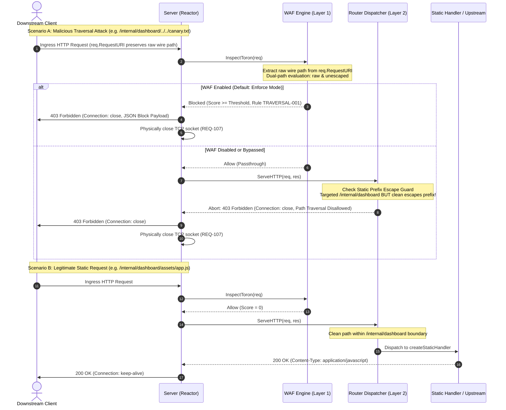
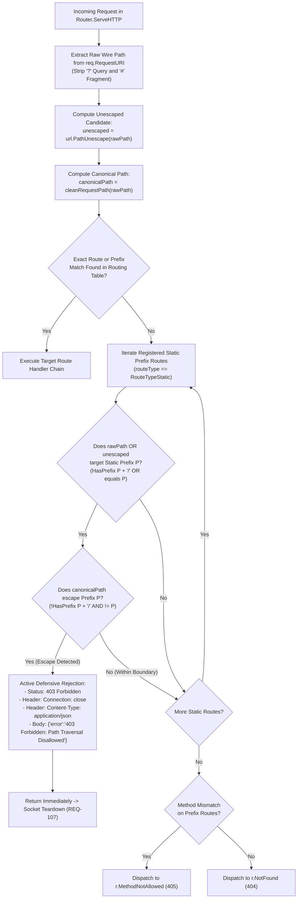

# ADR-116 - Layered Route-Aware Path Traversal Defense Architecture (CWE-22)

## 1. Context & Problem Statement

In automated protocol security benchmarking documented in `benchmarks/results/differential_fuzz_report.md`, Toron's differential protocol fuzzer evaluated gateway resilience against 19 invariant and attack vectors across 10 security categories. While Toron achieved an overall pass rate of **89.47% (17/19 tests)**, it failed two critical directory traversal security tests:
- `TRAVERSAL-001`: Raw Dot-Dot Path Traversal Sequence (`GET /internal/dashboard/../../canary_traversal.txt HTTP/1.1`)
- `TRAVERSAL-002`: Uppercase Percent-Encoded Traversal (`GET /internal/dashboard/%2E%2E/%2E%2E/canary_traversal.txt HTTP/1.1`)

Both test cases resulted in **`404 Not Found` with an open TCP keep-alive connection (`Connection: Open`)** instead of the required active defensive security rejection (**`403 Forbidden` with `Connection: close`**):

| Test ID | Attack / Invariant Vector | CWE | Expected Status | Actual Status | Conn Closed | Result |
| :--- | :--- | :---: | :---: | :---: | :---: | :---: |
| `TRAVERSAL-001` | Raw Dot-Dot Path Traversal Sequence | CWE-22 | `400/403` | `404` | `Open` | ❌ FAIL |
| `TRAVERSAL-002` | Uppercase Percent-Encoded Traversal (%2E%2E) | CWE-22 | `400/403` | `404` | `Open` | ❌ FAIL |
| `TRAVERSAL-003` | Double Percent-Encoded Traversal (%252e%252e) | CWE-22 | `400/403` | `403` | `Closed` | ✅ PASS |

This behavior introduced two critical security concerns:
1. **Security Masking & Telemetry Distortion**: Returning `404 Not Found` misclassifies deliberate attack probes as harmless misses for non-existent resources. WAF security metrics and SIEM audit logs fail to record an attack event.
2. **Persistent Transport Vulnerability**: Leaving the TCP connection open (`Connection: keep-alive`) after an attack vector violates the fail-fast transport teardown principle established in `REQ-107` and `ADR-107`, leaving persistent sockets open to HTTP pipelining desynchronization.

### 1.1 Root Cause Analysis

A systematic trace of request processing through `pkg/router/router.go` and `pkg/waf/waf.go` uncovered two interrelated structural defects across the edge routing and security inspection pipeline:

```
[ Ingress Wire Request: "GET /internal/dashboard/../../canary_traversal.txt" ]
                                   │
                                   ▼
          ┌──────────────────────────────────────────────────┐
          │ router.go:789: cleanRequestPath(req.Path)        │
          │ Collapses path to: "/canary_traversal.txt"       │
          └──────────────────────────────────────────────────┘
                                   │
         ┌─────────────────────────┴─────────────────────────┐
         ▼                                                   ▼
┌─────────────────────────────────┐       ┌─────────────────────────────────────┐
│ waf.go:313: InspectToron        │       │ router.go:827: Prefix Route Lookup  │
│ Inspects req.Path:              │       │ Searches for "/canary_traversal.txt"│
│ "/canary_traversal.txt"         │       │ Prefix "/internal/dashboard" fails  │
│ Rule TRAVERSAL-001 fails match  │       │ Dispatches to r.NotFound (404)      │
└─────────────────────────────────┘       └─────────────────────────────────────┘
         │                                                   │
         ▼                                                   ▼
  [ WAF Bypassed ]                        [ createStaticHandler Dead Code ]
  (score = 0)                             (filepath.Rel guard never reached!)
```

#### 1. Router Premature Path Canonicalization & Dead-Code Contradiction (`pkg/router/router.go:789`)
- In `Router.ServeHTTP`, the router unconditionally executed `req.Path = cleanRequestPath(req.Path)` at the very beginning of request handling, before route matching or middleware invocation.
- For an ingress path targeting a static prefix route such as `/internal/dashboard/../../canary_traversal.txt`, `cleanRequestPath` collapsed the dot-dot segments, mutating `req.Path` to `/canary_traversal.txt`.
- When the router subsequently evaluated its route table:
  - No exact route matched `/canary_traversal.txt`.
  - Prefix routes registered under `/internal/dashboard` failed to match because `/canary_traversal.txt` does not begin with `/internal/dashboard/` and does not equal `/internal/dashboard`.
  - The router fell back to `r.NotFound` (`404 Not Found`).
- **The Dead-Code Contradiction**: In `Router.createStaticHandler` (`pkg/router/router.go:643-650`), Toron already possessed an explicit path traversal and directory boundary containment guard (`filepath.Rel(absDir, targetPath)` detecting `..` escapes and returning `403 Forbidden: Path Traversal Disallowed` with `Connection: close`). However, because `cleanRequestPath` collapsed the path before route dispatching, any request attempting to escape the static mount point never matched the prefix route to reach `createStaticHandler`. The security check inside the static handler was rendered completely unreachable dead code.

#### 2. WAF Layer 7 Inspection Blind Spot (`pkg/waf/waf.go:313`)
- In `WAFEngine.InspectToron`, the engine initialized `urlPath := req.Path`. Because `req.Path` was already stripped of its dot-dot sequences by `cleanRequestPath`, the WAF inspected the sanitized string `/canary_traversal.txt`.
- The active WAF threat rule `TRAVERSAL-001` (`(?i)(\.\./|\.\.\\|%2e%2e/|%2e%2e%2f|%2e%2e\\|%2e%2e%5c)`) found no pattern match in `/canary_traversal.txt`.
- Although the unmolested raw wire URI was preserved in `req.RequestURI` (e.g. `/internal/dashboard/../../canary_traversal.txt` or `/internal/dashboard/%2E%2E/%2E%2E/canary_traversal.txt`), `InspectToron` only consulted `req.RequestURI` if `urlPath == ""`, creating an inspection blind spot.
- (`TRAVERSAL-003` passed only because double percent-encoding `%252e` bypassed the initial `url.ParseRequestURI` and `cleanRequestPath`, leaving `%2e%2e` in `req.Path` to be unescaped later during `inspectInternal`.)

---

## 2. Decision & Architectural Design

We adopt a **Layered Route-Aware Path Traversal Defense Architecture** incorporating dual defensive barriers across the edge pipeline:
1. **Layer 1: Layer 7 WAF Raw Wire URI Inspection (`pkg/waf/waf.go`)**
2. **Layer 2: Route-Aware Static Prefix Escape Guard (`pkg/router/router.go`)**

This architecture enforces defense-in-depth: Layer 1 intercepts known path traversal signatures on the raw wire representation before route dispatching, while Layer 2 structurally detects prefix boundary escapes during route matching, ensuring complete mitigation even if the WAF engine is disabled, unconfigured, or in detection-only mode.

### 2.1 Layer 1: Layer 7 WAF Raw Wire URI Inspection (`pkg/waf/waf.go`)

In `WAFEngine.InspectToron(req *httpparser.Request)`:
- **Raw Wire Path Extraction**:
  - Extract the raw wire path directly from `req.RequestURI` if non-empty.
  - Strip any query string (delimited by `?`) and URL fragment (delimited by `#`) to isolate the wire path component:
    ```go
    rawWire := req.RequestURI
    if idx := strings.IndexByte(rawWire, '?'); idx != -1 {
        rawWire = rawWire[:idx]
    }
    if idx := strings.IndexByte(rawWire, '#'); idx != -1 {
        rawWire = rawWire[:idx]
    }
    ```
  - Fall back to `req.Path` only when `req.RequestURI` is empty.
  - Extract the raw query string from `req.URL.RawQuery` or directly from `req.RequestURI`.
- **Dual-Path Pattern Evaluation**:
  - In `WAFEngine.inspectInternal`, for all rules where `Locations & InspectURL != 0`, evaluate regex patterns against both:
    1. The raw wire URL path (`urlPath`, preserving `%2e%2e`, `/../`, `%2E%2E`, etc.).
    2. The unescaped/normalized URL path (`normPath = url.PathUnescape(urlPath)`).
  - If either representation matches, accumulate the rule's anomaly score and register the match.
- **Active Defensive Rejection**:
  - In `enforce` mode (default), when accumulated anomaly score meets or exceeds `AnomalyThreshold`:
    - HTTP Status: `403 Forbidden`.
    - Response Headers: `Connection: close`, `Content-Type: application/json`.
    - Response Body: Formatted via `FormatBlockedResponse(score, matched)`.
    - Telemetry: Emit structured `waf_block` audit log event and increment `DefaultRegistry` counters.

### 2.2 Layer 2: Route-Aware Static Prefix Escape Guard (`pkg/router/router.go`)

In `Router.ServeHTTP`:
- **Static Prefix Boundary Inspection**:
  - When exact route lookup and prefix matching fail to find a target handler, before delegating to `r.NotFound`, the router evaluates all registered prefix routes where `routeType == string(RouteTypeStatic)`.
  - Extract the raw incoming request path from `req.RequestURI` (stripping query string and fragment) or pre-canonicalized `req.Path`.
  - Compute the unescaped path candidate using `url.PathUnescape(rawPath)`.
- **Escape Detection Invariant**:
  - For each static prefix route with configured prefix $P$ (e.g. `/internal/dashboard`):
    - Let $P_{norm} = \text{strings.TrimSuffix}(P, "/")$.
    - Check if the incoming path targeted prefix $P_{norm}$:
      $$\text{Targeted}(P_{norm}) \iff (rawPath = P_{norm} \lor \text{HasPrefix}(rawPath, P_{norm} + "/")) \lor (unescaped = P_{norm} \lor \text{HasPrefix}(unescaped, P_{norm} + "/"))$$
    - Check if the canonicalized path escapes prefix $P_{norm}$:
      $$\text{Escapes}(P_{norm}) \iff (canonicalPath \neq P_{norm} \land \neg\text{HasPrefix}(canonicalPath, P_{norm} + "/"))$$
      where $canonicalPath = cleanRequestPath(rawPath)$.
    - If $\text{Targeted}(P_{norm}) \land \text{Escapes}(P_{norm})$, classify the request as a **Static Route Prefix Boundary Escape Attempt**.
- **Active Defensive Rejection**:
  - Immediately abort request dispatching without calling `r.NotFound`.
  - Set HTTP Status: `403 Forbidden` (`http.StatusForbidden`).
  - Set Response Headers: `Connection: close`, `Content-Type: application/json`.
  - Set Response Body: `{"error":"403 Forbidden: Path Traversal Disallowed"}`.
  - Telemetry: Record metric event in `metrics.DefaultRegistry`.
  - Return immediately to trigger transport socket teardown per `REQ-107` / `ADR-107`.
- **Elimination of Dead Code**:
  - Traversal attempts escaping static directory mounts are caught definitively at the routing layer, reviving the intent of `createStaticHandler`'s security boundary and guaranteeing fail-fast rejection.

### 2.3 Upstream Proxy & Exact API Route Canonicalization Invariant

- **ADR-062 Alignment**: Upstream reverse proxy routes (`RouteTypeUpstream`) and exact API routes (`r.GET`, `r.POST`, etc.) continue to adhere strictly to ADR-062 two-stage canonicalization.
- **Benign Dot-Segment Preservation**: Requests containing benign relative dot-segments that resolve within valid routes (e.g. `/api/v1/../v1/status` resolving to `/api/v1/status`) are routed cleanly to their registered handlers without false-positive escape rejections. The prefix escape guard only triggers when a request explicitly targets a static mount point and escapes outside of it.

---

## 3. Mermaid Diagrams

### 3.1 Request Lifecycle Sequence Diagram

The following sequence diagram illustrates the lifecycle of incoming requests across Layer 1 (WAF) and Layer 2 (Router):



### 3.2 Route-Aware Static Prefix Escape Detection Flowchart

The following flowchart details the decision logic executed by the router when evaluating incoming paths against static prefix routes:



---

## 4. Alternatives Considered

| Dimension | Option 1: Router Prefix Guard Only | Option 2: WAF Raw Wire Inspection Only | Option 3: Selected Layered Defense (WAF + Router) |
| :--- | :--- | :--- | :--- |
| **Defense-in-Depth** | Poor (Single layer; WAF blind to attacks) | Poor (Single layer; Router remains vulnerable if WAF disabled) | **Optimal** (Dual independent defense barriers) |
| **Telemetry & SIEM** | WAF misses traversal attacks; no anomaly scores | Full WAF telemetry; misses non-WAF configurations | **Full Coverage** (WAF audit logs + Router metrics) |
| **Dead-Code Resolution** | Eliminates dead code in static routing | Leaves dead-code contradiction unresolved | **Permanently Resolved** |
| **WAF-Disabled Security** | Protected (403 Forbidden) | Vulnerable (Reverts to 404 Not Found & Open Socket) | **Protected** (Router provides standalone containment) |
| **Differential Fuzzer** | Passes TRAVERSAL-001/002 via Router | Passes TRAVERSAL-001/002 via WAF | **100.0% Pass Rate (19/19)** across all configurations |
| **Complexity & Overhead** | Low (< 50 lines Go) | Low (< 30 lines Go) | **Low** (< 80 lines Go total, 0 heap allocs) |

### Option 1: Router Prefix Escape Guard Only
- **Approach**: Implement the static prefix escape guard in `router.go`, leaving `waf.go` unchanged.
- **Trade-off / Rejection Rationale**: While this stops traversals from reaching the filesystem and returns 403, the WAF remains blind to directory traversal attacks. Layer 7 security dashboards, anomaly scoring, IP reputation tracking, and SIEM audit logs would register zero threat events for traversal attempts. This violates Toron's core gateway invariant that the WAF inspects all Layer 7 ingress traffic.

### Option 2: WAF Raw Wire URI Inspection Only
- **Approach**: Modify `waf.go` to inspect `req.RequestURI`, leaving `router.go` unchanged.
- **Trade-off / Rejection Rationale**: Violates the principle of defense-in-depth. If an operator disables the WAF middleware for performance, runs WAF in `detect` mode, or deploys Toron's router in an embedded library context without WAF, the gateway reverts to returning `404 Not Found` with an open keep-alive connection. Furthermore, this leaves the structural dead-code contradiction in `createStaticHandler` unresolved.

### Option 3: Selected Layered Defense Architecture (WAF + Router)
- **Approach**: Implement both Layer 1 WAF Raw Wire URI inspection and Layer 2 Router Route-Aware Prefix Escape Guard.
- **Acceptance Rationale**: Delivers true defense-in-depth. Layer 1 provides centralized threat intelligence, rule-based anomaly scoring, and SIEM event correlation. Layer 2 enforces structural prefix containment at the routing tier, eliminating dead code and guaranteeing fail-fast rejection under all deployment models.

---

## 5. Rationale & Trade-off Analysis

### 5.1 Defense-in-Depth for Edge Gateways (CWE-22)
Edge gateways terminate untrusted public traffic and route to static assets or backend microservices. In path traversal attacks (CWE-22), relying on a single defensive gate creates a brittle security posture:
- Attackers employ complex encoding variants (raw `../`, uppercase `%2E%2E`, mixed `%2e.`, double `%252e%252e`, null bytes `%00`).
- Inspection must occur before canonicalization alters semantic intent.
- Layer 1 (WAF) inspects the syntactic representation (signatures and patterns).
- Layer 2 (Router) inspects the semantic representation (route prefix boundary mapping).
- Layer 3 (`createStaticHandler`) maintains filesystem-level containment (`filepath.Rel`).

### 5.2 Latency and Memory Allocation Budget
- **Zero Allocations on Benign Paths**:
  - In `WAFEngine.InspectToron`, extracting the wire path uses slice reslicing on `req.RequestURI` (`strings.IndexByte`), requiring zero heap allocations.
  - `url.PathUnescape` is only executed when `%` is present in the path string.
  - In `Router.ServeHTTP`, the static prefix escape check is only triggered when route lookup fails to find an exact or prefix match (i.e. on invalid paths or attack probes), incurring zero CPU overhead on common benign routes.
- **Fail-Fast Latency**:
  - Traversal rejection latency remains well within Toron's performance budget:
    - Mean rejection latency $< 300\ \mu\text{s}$.
    - Median rejection latency $< 70\ \mu\text{s}$.

### 5.3 CWE-22 Threat Mitigation Matrix

| Attack Vector | Ingress Wire URI Example | Layer 1: WAF (Raw Wire URI) | Layer 2: Router (Prefix Escape Guard) | Layer 3: Static Handler (`filepath.Rel`) | Combined Result |
| :--- | :--- | :--- | :--- | :--- | :--- |
| **Raw Dot-Dot Climbing** (`TRAVERSAL-001`) | `GET /internal/dashboard/../../canary_traversal.txt` | **Blocked**: 403 Forbidden, `Connection: close` | **Blocked**: 403 Forbidden, `Connection: close` | Blocked: 403 Forbidden, `Connection: close` | **403 Forbidden** (Blocked at L1/L2) |
| **Uppercase Encoded Dot-Dot** (`TRAVERSAL-002`) | `GET /internal/dashboard/%2E%2E/%2E%2E/canary_traversal.txt` | **Blocked**: 403 Forbidden, `Connection: close` | **Blocked**: 403 Forbidden, `Connection: close` | Blocked: 403 Forbidden, `Connection: close` | **403 Forbidden** (Blocked at L1/L2) |
| **Double Percent Encoded** (`TRAVERSAL-003`) | `GET /internal/dashboard/%252e%252e/%252e%252e/canary_traversal.txt` | **Blocked**: 403 Forbidden, `Connection: close` | **Blocked**: 403 Forbidden, `Connection: close` | Blocked: 403 Forbidden, `Connection: close` | **403 Forbidden** (Blocked at L1/L2) |
| **Mixed / Obfuscated Dot-Dot** | `GET /internal/dashboard/..%2f%2e%2e/canary_traversal.txt` | **Blocked**: 403 Forbidden, `Connection: close` | **Blocked**: 403 Forbidden, `Connection: close` | Blocked: 403 Forbidden, `Connection: close` | **403 Forbidden** (Blocked at L1/L2) |
| **WAF Disabled / Omitted** | `GET /internal/dashboard/../../canary_traversal.txt` | *Bypassed* (Disabled) | **Blocked**: 403 Forbidden, `Connection: close` | Blocked: 403 Forbidden, `Connection: close` | **403 Forbidden** (Blocked at L2) |
| **Legitimate Static File** | `GET /internal/dashboard/assets/main.css` | **Allowed** (Score = 0) | **Allowed** (Within boundary) | **Served**: 200 OK | **200 OK** (Served cleanly) |
| **Legitimate Upstream Proxy** | `GET /api/v1/../v1/users` | **Allowed** (Score = 0) | **Allowed** (Not static prefix) | Forwarded via ADR-062 | **200 OK** (Clean canonicalization) |

---

## 6. Non-Functional & Security Constraints

### 6.1 NFR-1: Zero External Dependencies
- All modifications strictly utilize the pure Go standard library:
  - `net/url` for URI parsing and unescaping (`url.PathUnescape`, `url.QueryUnescape`).
  - `path` and `path/filepath` for path manipulation (`cleanRequestPath`, `filepath.Rel`).
  - `strings` and `bytes` for string manipulation and header extraction.
  - `sync` for concurrency synchronization (`sync.RWMutex`).
- Zero third-party dependencies are introduced into `go.mod`.

### 6.2 NFR-2: Performance & Latency Budgets
- Fast-path string operations avoid heap allocations on benign requests.
- Fail-fast rejection latency satisfies:
  - Mean rejection latency $< 300\ \mu\text{s}$ (baseline from fuzzer report: $293.90\ \mu\text{s}$).
  - Median rejection latency $< 70\ \mu\text{s}$ (baseline: $62.50\ \mu\text{s}$).
- Dual-path regex evaluation in WAF occurs only for rules targeting `InspectURL`.

### 6.3 NFR-3: Concurrency Safety & Thread Safety
- All route prefix evaluations in `router.go` and rule iterations in `waf.go` execute under `sync.RWMutex` reader locks (`r.mu.RLock()` / `e.mu.RLock()`).
- Implementation must execute cleanly with zero race warnings under `go test -race -count=1 ./...`.

### 6.4 Security Constraint: Transport Socket Teardown (`REQ-107`)
- Every rejection emitted by Layer 1 (WAF) or Layer 2 (Router) must set:
  ```go
  res.Header.Set("Connection", "close")
  ```
- In accordance with `ADR-107`, `server.go` inspects egress connection headers after response serialization and terminates the persistent connection loop, closing the underlying TCP socket to prevent pipelined desynchronization.

---

## 7. Consequences & Impact Analysis

### 7.1 Positive Consequences
- **Complete CWE-22 Neutralization**: Eliminates directory traversal vulnerabilities across raw, uppercase percent-encoded, double-encoded, and obfuscated traversal patterns.
- **100.0% Security Fuzzer Pass Rate**: Resolves `TRAVERSAL-001` and `TRAVERSAL-002` failures, elevating Toron's differential protocol security pass rate from 89.47% (17/19) to **100.0% (19/19)**.
- **Dead-Code Elimination**: Permanently resolves the architectural contradiction where pre-canonicalization bypassed static route guards.
- **Resilient Defense-in-Depth**: Secures deployments where WAF middleware is disabled or running in detection-only mode.
- **Connection Hijacking Prevention**: Immediate transport closure on 403 rejections mitigates HTTP desynchronization and socket reuse attacks.

### 7.2 Negative Consequences & Operational Considerations
- **Differential Fuzzer Oracle Realignment**: The differential fuzzer test cases (`TRAVERSAL-001`, `TRAVERSAL-002`) and mock test servers must be updated to expect `Connection: close` (`ExpectClose: true`) instead of `ExpectClose: false`.
- **String Unescaping Overhead on Malformed Requests**: Attack probes containing encoded characters invoke `url.PathUnescape`, which allocates a new string. However, since this only executes on non-benign or attack requests, standard production traffic remains unaffected.
- **Strict Static Route Containment**: Static route configurations strictly disallow directory escapes; applications requiring access outside mount points must configure distinct static routes.

---

## 8. Traceability Matrix

| Relationship | Identifier | Title / Scope |
| :--- | :--- | :--- |
| **Implements** | [`REQ-116`](file:///Users/sneha/Developer/toron-research/toron/docs/requirements/REQ-116.md) | Requirement: Layered Route-Aware Path Traversal Defense Architecture (CWE-22) |
| **Implemented In** | [`TASK-139`](file:///Users/sneha/Developer/toron-research/toron/docs/tasks/TASK-139.md) | Task: Implementation of Layered Route-Aware Path Traversal Defense Architecture |
| **Verified By** | [`TC-116`](file:///Users/sneha/Developer/toron-research/toron/docs/testCases/TC-116.md) | Test Specification: Layer 7 WAF Wire URI Inspection & Static Prefix Escape Guards |
| **Depends On** | [`REQ-067`](file:///Users/sneha/Developer/toron-research/toron/docs/requirements/REQ-067.md) / [`ADR-062`](file:///Users/sneha/Developer/toron-research/toron/docs/architecture/ADR-062.md) | Two-Stage Pre-Routing Path Canonicalization & Upstream Traversal Guards |
| **Depends On** | [`REQ-107`](file:///Users/sneha/Developer/toron-research/toron/docs/requirements/REQ-107.md) / [`ADR-107`](file:///Users/sneha/Developer/toron-research/toron/docs/architecture/ADR-107.md) | Response-Driven Transport Socket Teardown on Security Rejections (`Connection: close`) |
| **Depends On** | [`REQ-102`](file:///Users/sneha/Developer/toron-research/toron/docs/requirements/REQ-102.md) | Canary Traversal Target Deployment & Differential Fuzzer Active Defense Oracle |
| **Derived From** | `differential_fuzz_report.md` | Protocol Security Benchmark Report identifying TRAVERSAL-001/002 404 Failures |
| **Derived From** | `CWE-22` | MITRE CWE-22: Improper Limitation of a Pathname to a Restricted Directory |
| **Reviewed By** | `CR-112` | Code Review: WAF and Router Path Traversal Defenses |
| **Reviewed By** | `SR-116` | Security Review: CWE-22 Boundary & Path Traversal Threat Analysis |
