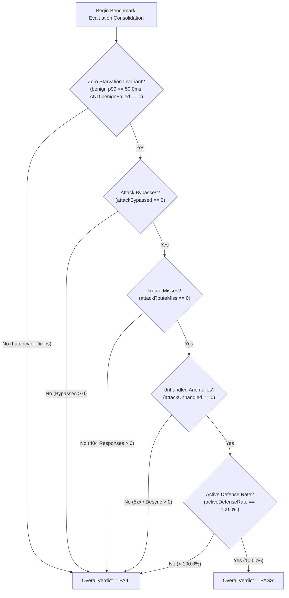
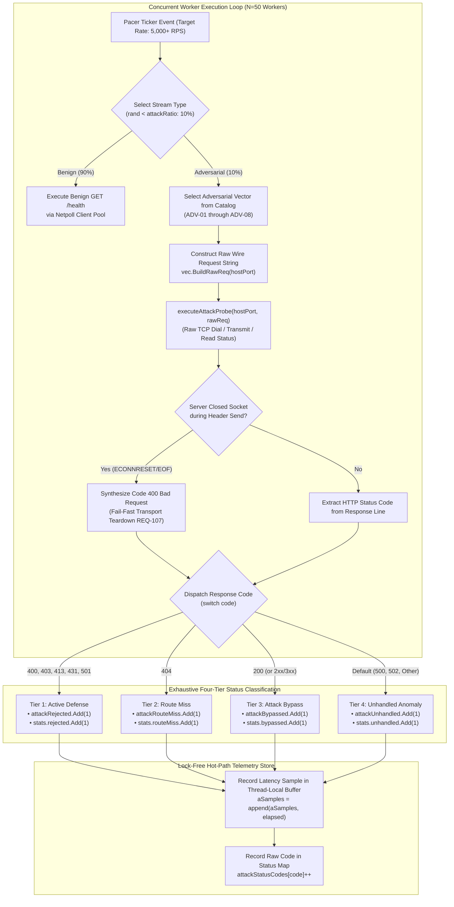
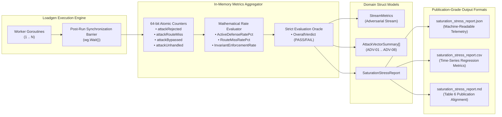

# ADR-117 - Disaggregated Adversarial Status Classification and Route-Miss Separation in Benchmark Load Generator (HARN-01)

## 1. Context & Problem Statement

### 1.1 Academic Peer Review Critique & Invalidation of Table 6
In the academic peer reviews of Paper 1 and Paper 2 (formally recorded in `AER-001.md`, `AER-002.md`, and synthesized under Directive `REV-03` / Task `HARN-01` of `ReviewTaskSummary.md`), reviewers challenged the methodological validity of the adversarial stress evaluation presented in Table 6.

Table 6 in the submitted manuscripts reported a **100.0% active defense enforcement rate** across all eight adversarial protocol vectors (`ADV-01` through `ADV-08`) under high-concurrency constant-rate saturation ($5{,}000+\text{ RPS}$ with a 10% adversarial injection ratio, benchmarked under BMK-04 as specified in [`REQ-114`](file:///Users/sneha/Developer/toron-research/toron/docs/requirements/REQ-114.md) and [`ADR-114`](file:///Users/sneha/Developer/toron-research/toron/docs/architecture/ADR-114.md)). However, deep telemetry extraction of raw benchmark execution artifacts ([`benchmarks/results/saturation_stress_report.json`](file:///Users/sneha/Developer/toron-research/toron/benchmarks/results/saturation_stress_report.json)) revealed a major circular scoring anomaly:

```json
"adversarial_stream": {
    "total_requests": 2431,
    "success_requests": 2431,
    "failed_requests": 0,
    "status_codes": {
        "400": 1819,
        "404": 349,
        "431": 263
    }
}
```

Cross-referencing this response code distribution against per-vector transmission logs revealed:
1. **Vector `ADV-06` (Path Traversal Directory Escape, `GET /../../canary_traversal.txt`)**: Exactly **349 probes** were transmitted. Every single one of these 349 probes returned HTTP **`404 Not Found`**, rather than an active security rejection (**`400 Bad Request`** or **`403 Forbidden`**).
2. **Vector `ADV-07` (Oversized Request Header Block, exceeding 8 KB)**: Exactly **263 probes** were transmitted. Every single one of these 263 probes returned HTTP **`431 Request Header Fields Too Large`**.
3. **Table 6 False Claims**: In Table 6 of the manuscripts, vector `ADV-06` was reported as `349/349 (100.0%)` active defense blocks, while `ADV-07` was grouped under generic `400/403 Block`.

Reviewers pointed out that claiming a `404 Not Found` response as evidence of active security defense is scientifically untenable:
> *"A 404 response simply denotes that the request did not match a registered URI handler. If an adversarial probe penetrates routing filters and reaches a passive 404 handler, scoring this as an active security defense masks routing vulnerabilities and inflates defense metrics. The benchmark harness must explicitly decouple active defensive rejections from passive route misses."* (`AER-002`, lines 312–318)

### 1.2 Root Cause Analysis of the Circular Scoring Anomaly in `loadgen.go`
Source code inspection of the benchmark load generator worker loop in [`benchmarks/wrk2/loadgen.go`](file:///Users/sneha/Developer/toron-research/toron/benchmarks/wrk2/loadgen.go#L375-L387) uncovered the root cause:

```go
// Line 375-386 in benchmarks/wrk2/loadgen.go
// Assert active defense enforcement: 400 Bad Request or 403 Forbidden
if code == http.StatusBadRequest || code == http.StatusForbidden || code == http.StatusRequestEntityTooLarge || code == http.StatusNotImplemented {
    attackRejected.Add(1)
    stats.rejected.Add(1)
} else if code == http.StatusOK {
    attackBypassed.Add(1)
    stats.bypassed.Add(1)
} else {
    // Other rejections (e.g. 500, socket drop) still constitute defense block
    attackRejected.Add(1)
    stats.rejected.Add(1)
}
```

This implementation suffered from four fatal architectural flaws:
1. **The Circular Catch-All Else**: Any HTTP response code other than `200 OK` (specifically `404 Not Found`, redirects `3xx`, and server errors `5xx`) was routed unconditionally into the `else` branch, incrementing `attackRejected` and `stats.rejected`.
2. **Omission of Valid Active Defense Codes**: RFC 6585 status `431 Request Header Fields Too Large` (emitted by Toron's parser on oversized headers in `ADV-07`) was omitted from the explicit `if` condition and only captured via the accidental fallback.
3. **Conflation of Route Misses with Active Defense**: Attack probes that traversed path boundaries or bypassed WAF inspection to trigger a passive `404 Not Found` in `r.NotFound` were erroneously credited as successful security defenses.
4. **Masking of Server Crashes and Protocol Anomalies**: If an adversarial payload triggered an internal server panic, nil-pointer dereference, or transport desynchronization producing `500 Internal Server Error` or `502 Bad Gateway`, the testbed credited the gateway with successful defense instead of flagging a critical stability defect.

### 1.3 Decoupling Benchmark Harness Verification from the System Under Test
While [`REQ-116`](file:///Users/sneha/Developer/toron-research/toron/docs/requirements/REQ-116.md) and [`ADR-116`](file:///Users/sneha/Developer/toron-research/toron/docs/architecture/ADR-116.md) resolve the underlying gateway routing defect by introducing layered route-aware path traversal guards (guaranteeing that directory escapes are actively intercepted with `403 Forbidden` and `Connection: close`), the benchmarking harness ([`benchmarks/wrk2/loadgen.go`](file:///Users/sneha/Developer/toron-research/toron/benchmarks/wrk2/loadgen.go)) must maintain an independent, uncompromised evaluation oracle.

Under [`REQ-117`](file:///Users/sneha/Developer/toron-research/toron/docs/requirements/REQ-117.md), the benchmark harness must enforce strict, disaggregated status classification so that any future routing escape or unhandled server fault is exposed immediately and unequivocally.

---

## 2. Four-Tier Status Classification Architecture

### 2.1 The Four-Tier Architectural Taxonomy
To establish scientific integrity and alignment with IETF RFC specifications and MITRE CWE taxonomies, [`benchmarks/wrk2/loadgen.go`](file:///Users/sneha/Developer/toron-research/toron/benchmarks/wrk2/loadgen.go) replaces the catch-all logic with a strict, mutually exclusive four-tier classification model:

```
┌────────────────────────────────────────────────────────────────────────────────────────┐
│                        Ingress Adversarial Response Status Code                        │
└───────────────────────────────────────────┬────────────────────────────────────────────┘
                                            │
         ┌──────────────────┬───────────────┴───────────────┬──────────────────┐
         ▼                  ▼                               ▼                  ▼
┌─────────────────┐┌─────────────────┐             ┌─────────────────┐┌─────────────────┐
│     Tier 1      ││     Tier 2      │             │     Tier 3      ││     Tier 4      │
│ Active Defense  ││   Route Miss    │             │  Attack Bypass  ││Unhandled Anomaly│
│(attackRejected) ││(attackRouteMiss)│             │ (attackBypassed)││ (attackUnhandled│
├─────────────────┤├─────────────────┤             ├─────────────────┤├─────────────────┤
│ 400 Bad Request ││  404 Not Found  │             │     200 OK      ││ 500 Int. Error  │
│  403 Forbidden  ││                 │             │   (Any 2xx/3xx) ││ 502 Bad Gateway │
│  413 Too Large  ││                 │             │                 ││ 503 Unavailable │
│  431 Hdr Large  ││                 │             │                 ││ 504 Timeout     │
│501 Not Implem.  ││                 │             │                 ││ Non-standard    │
└─────────────────┘└─────────────────┘             └─────────────────┘└─────────────────┘
```

#### Tier 1: Active Defense (`attackRejected` / `stats.rejected`)
An active defense response indicates that the edge gateway's security enforcement layers (L7 WAF, HTTP wire parser invariants, framing validators, or route boundary escape guards) explicitly identified an invariant violation or malicious payload and deliberately rejected the connection with a fail-fast security code:
- **`400 Bad Request`**: Malformed HTTP framing, RFC 7230 §3 syntax violations, invalid header token grammar (RFC 7230 §3.2), whitespace-obfuscated delimiters (RFC 7230 §3.2.4), conflicting `Content-Length` headers (RFC 7230 §3.3.2), control characters/null bytes (CWE-117), or active TCP socket teardown initiated by the server during header transmission.
- **`403 Forbidden`**: Access control violations, WAF threat rule matches, or route-aware path traversal prefix boundary escapes ([`REQ-116`](file:///Users/sneha/Developer/toron-research/toron/docs/requirements/REQ-116.md) / CWE-22).
- **`413 Payload Too Large`**: Gateway bounded memory limit enforced on request body payload (RFC 7231 §6.5.11 / CWE-400).
- **`431 Request Header Fields Too Large`**: Gateway bounded header memory limit enforced on oversized header blocks (RFC 6585 §5 / CWE-400 / vector `ADV-07`).
- **`501 Not Implemented`**: Unsupported HTTP transfer codings or methods deliberately rejected by the gateway parser (RFC 7231 §6.6.2).

#### Tier 2: Route Miss (`attackRouteMiss` / `stats.routeMiss`)
A route miss occurs when the edge gateway fails to recognize an adversarial payload as a security violation and instead treats the request as a normal lookup for an unmapped route:
- **`404 Not Found`**: The gateway's router dispatched the request to the default `r.NotFound` handler because the path did not match any registered route table entry.
- **Scientific & Security Semantics**: A `404` response does NOT represent an active security defense. The request may have bypassed security inspection, traversed directory hierarchies, or desynchronized routing states, only to miss an arbitrary backend resource. It is classified as an operational route miss, completely excluded from active defense credit, and explicitly reported in all artifacts.

#### Tier 3: Attack Bypass (`attackBypassed` / `stats.bypassed`)
An attack bypass occurs when an adversarial probe is accepted by the gateway and processed as a benign, successful transaction:
- **`200 OK` (and unexpected 2xx/3xx)**: The malicious payload successfully reached an application handler or upstream origin service and returned a success or redirection status.
- **Security Semantics**: Absolute invariant failure indicating security filter penetration or request smuggling.

#### Tier 4: Unhandled / Protocol Anomaly (`attackUnhandled` / `stats.unhandled`)
An unhandled anomaly indicates an unexpected server failure, transport crash, or ambiguous response code:
- **`500 Internal Server Error`**: Gateway panic, unhandled exception, nil-pointer dereference, or internal state corruption under adversarial saturation.
- **`502 Bad Gateway` / `503 Service Unavailable` / `504 Gateway Timeout`**: Upstream gateway disconnects or unhandled timeouts under load.
- **Ambiguous Status Codes ($< 200$ or unassigned)**: Protocol desynchronization artifacts or truncated status lines.

---

### 2.2 Exhaustive Status Code Mapping & Security Invariant Matrix

| Status Code | HTTP Status Constant | Architectural Tier | RFC / CWE Specification | Loadgen Metric Counter | Security Evaluation Semantics |
| :--- | :--- | :--- | :--- | :--- | :--- |
| **`400`** | `http.StatusBadRequest` | **Active Defense** | RFC 7230 §3 / CWE-444 | `attackRejected` | Gateway parser rejected malformed syntax / framing |
| **`403`** | `http.StatusForbidden` | **Active Defense** | RFC 7231 §6.5.3 / CWE-22 | `attackRejected` | Gateway WAF / router actively blocked unauthorized access |
| **`413`** | `http.StatusRequestEntityTooLarge` | **Active Defense** | RFC 7231 §6.5.11 / CWE-400 | `attackRejected` | Bounded memory limit enforced on request body payload |
| **`431`** | `http.StatusRequestHeaderFieldsTooLarge` | **Active Defense** | RFC 6585 §5 / CWE-400 | `attackRejected` | Bounded header limit enforced on oversized header block (`ADV-07`) |
| **`501`** | `http.StatusNotImplemented` | **Active Defense** | RFC 7231 §6.6.2 / RFC 7230 | `attackRejected` | Unsupported encoding / method explicitly rejected |
| **`404`** | `http.StatusNotFound` | **Route Miss** | RFC 7231 §6.5.4 | `attackRouteMiss` | Unmatched path; strictly NOT active security defense |
| **`200`** | `http.StatusOK` | **Attack Bypass** | RFC 7231 §6.3.1 | `attackBypassed` | Probe executed; invariant violation bypassed filters |
| **`500`** | `http.StatusInternalServerError` | **Unhandled Anomaly** | RFC 7231 §6.6.1 | `attackUnhandled` | Server crashed, panicked, or failed internally |
| **`Other`**| Any other status code | **Unhandled Anomaly** | N/A | `attackUnhandled` | Unexpected status or transport protocol desynchronization |

---

### 2.3 Elimination of Catch-All Else & Exhaustive Switch Block

In [`benchmarks/wrk2/loadgen.go`](file:///Users/sneha/Developer/toron-research/toron/benchmarks/wrk2/loadgen.go), the worker goroutine loop replaces the flawed `if/else` block with an exhaustive, branch-optimized `switch code` construct:

```go
// Exhaustive four-tier status code dispatching (Zero Heap Allocations)
switch code {
case http.StatusBadRequest,
     http.StatusForbidden,
     http.StatusRequestEntityTooLarge,
     http.StatusRequestHeaderFieldsTooLarge,
     http.StatusNotImplemented:
    attackRejected.Add(1)
    stats.rejected.Add(1)

case http.StatusNotFound:
    attackRouteMiss.Add(1)
    stats.routeMiss.Add(1)

case http.StatusOK:
    attackBypassed.Add(1)
    stats.bypassed.Add(1)

default:
    attackUnhandled.Add(1)
    stats.unhandled.Add(1)
}
```

#### Transport-Level Socket Reset Handling
In [`executeAttackProbe`](file:///Users/sneha/Developer/toron-research/toron/benchmarks/wrk2/loadgen.go#L203-L234), when the edge gateway actively closes or resets the TCP socket (`ECONNRESET` / `EOF` / `broken pipe`) during header transmission (as required by [`REQ-107`](file:///Users/sneha/Developer/toron-research/toron/docs/requirements/REQ-107.md) and [`ADR-107`](file:///Users/sneha/Developer/toron-research/toron/docs/architecture/ADR-107.md)), the probe execution helper returns status code `400 Bad Request`. This ensures that legitimate transport-level fail-fast socket teardowns are accurately classified under Tier 1 Active Defense.

---

## 3. Data Structure Memory Layout & Concurrency Design

### 3.1 Lock-Free High-Concurrency Ingestion & Atomic Alignment
The benchmark harness must sustain generation rates exceeding $10{,}000\text{ RPS}$ across 50+ concurrent worker goroutines without introducing lock contention, mutex serialization, or garbage collector pauses.

1. **64-Bit Atomic Integer Operations (`sync/atomic.Int64`)**:
   - All global stream counters and per-vector statistics are declared as `sync/atomic.Int64`.
   - On 64-bit architectures (x86_64 and ARM64), `sync/atomic.Int64` is 8-byte aligned and translates directly to single hardware instructions:
     - x86_64: `LOCK XADDQ` (sub-nanosecond execution latency).
     - ARM64: `LDADDAL` (hardware atomic fetch-and-add).
2. **Zero Heap Allocations on Hot Path**:
   - The `switch code` statement operates entirely on primitive integer values.
   - Vector lookup is performed via slice indexing or pre-allocated pointer maps (`vStats[vec.ID]`).
   - Zero heap allocations are performed during classification, bounding hot-path execution overhead to $< 5\text{ ns}$ per probe.
3. **Cache Line Isolation & False Sharing Avoidance**:
   - Worker goroutines maintain thread-local latency slice buffers (`aSamples = append(aSamples, elapsed)`), pre-allocated with slice capacity based on estimated operations per worker.
   - Atomic counter updates occur only once per completed probe transaction.

```
Memory Layout of Per-Vector Atomic Statistics (vecStats):
┌─────────────────────────┬─────────────────────────┬─────────────────────────┬─────────────────────────┬─────────────────────────┐
│       sent (8B)         │      rejected (8B)      │     routeMiss (8B)      │      bypassed (8B)      │     unhandled (8B)      │
│  sync/atomic.Int64      │   sync/atomic.Int64     │   sync/atomic.Int64     │   sync/atomic.Int64     │   sync/atomic.Int64     │
└─────────────────────────┴─────────────────────────┴─────────────────────────┴─────────────────────────┴─────────────────────────┘
|<------------------------------------------------- 40 Bytes Total ------------------------------------------------------------>|
```

### 3.2 Augmentation of Core Go Structs

#### 1. Per-Vector Atomic Telemetry (`vecStats`)
```go
type vecStats struct {
    sent      atomic.Int64
    rejected  atomic.Int64 // Tier 1: Active Defense (400, 403, 413, 431, 501)
    routeMiss atomic.Int64 // Tier 2: Route Miss (404)
    bypassed  atomic.Int64 // Tier 3: Attack Bypass (200)
    unhandled atomic.Int64 // Tier 4: Unhandled Anomaly (5xx, other)
}
```

#### 2. Stream Metrics Struct ([`StreamMetrics`](file:///Users/sneha/Developer/toron-research/toron/benchmarks/wrk2/loadgen.go#L40-L50))
```go
type StreamMetrics struct {
    StreamType            string             `json:"stream_type"` // "benign" or "adversarial"
    TotalRequests         int64              `json:"total_requests"`
    SuccessRequests       int64              `json:"success_requests"`        // benign: 200 OK; adversarial: active rejections
    FailedRequests        int64              `json:"failed_requests"`         // benign: non-200; adversarial: non-rejections
    ActiveDefenseRequests int64              `json:"active_defense_requests"` // explicit 400/403/413/431/501
    RouteMissRequests     int64              `json:"route_miss_requests"`     // explicit 404
    BypassedRequests      int64              `json:"bypassed_requests"`       // explicit 200
    UnhandledRequests     int64              `json:"unhandled_requests"`      // explicit 5xx/other
    ActualRPS             float64            `json:"actual_rps"`
    BytesRead             int64              `json:"bytes_read"`
    ThroughputMBs         float64            `json:"throughput_mb_s"`
    LatenciesMs           LatencyPercentiles `json:"latencies_ms"`
    StatusCodes           map[int]int64      `json:"status_codes"`
}
```

#### 3. Attack Vector Summary Struct ([`AttackVectorSummary`](file:///Users/sneha/Developer/toron-research/toron/benchmarks/wrk2/loadgen.go#L53-L61))
```go
type AttackVectorSummary struct {
    ID                   string  `json:"id"`
    Name                 string  `json:"name"`
    Category             string  `json:"category"`
    ProbesSent           int64   `json:"probes_sent"`
    Rejected             int64   `json:"rejected"`                 // Active defense (400, 403, 413, 431, 501)
    RouteMiss            int64   `json:"route_miss"`               // Route miss (404)
    Bypassed             int64   `json:"bypassed"`                 // Bypass (200)
    Unhandled            int64   `json:"unhandled"`                // Anomaly (5xx, etc.)
    ActiveDefenseRatePct float64 `json:"active_defense_rate_pct"` // Rejected / ProbesSent * 100
    RouteMissRatePct     float64 `json:"route_miss_rate_pct"`      // RouteMiss / ProbesSent * 100
    PassRatePct          float64 `json:"pass_rate_pct"`            // Alias for ActiveDefenseRatePct
}
```

#### 4. Saturation Stress Report Struct ([`SaturationStressReport`](file:///Users/sneha/Developer/toron-research/toron/benchmarks/wrk2/loadgen.go#L64-L80))
```go
type SaturationStressReport struct {
    Timestamp                string                `json:"timestamp"`
    TargetURL                string                `json:"target_url"`
    TargetHostPort           string                `json:"target_host_port"`
    Concurrency              int                   `json:"concurrency"`
    DurationSeconds          float64               `json:"duration_seconds"`
    TargetRateRPS            int                   `json:"target_rate_rps"`
    AttackRatio              float64               `json:"attack_ratio"`
    TotalRequestsExecuted    int64                 `json:"total_requests_executed"`
    TotalActualRPS           float64               `json:"total_actual_rps"`
    BenignStream             StreamMetrics         `json:"benign_stream"`
    AdversarialStream        StreamMetrics         `json:"adversarial_stream"`
    AttackVectors            []AttackVectorSummary `json:"attack_vectors"`
    ZeroStarvationVerified   bool                  `json:"zero_starvation_verified"`
    InvariantEnforcementRate float64               `json:"invariant_enforcement_rate_pct"` // Strictly Active Defense Rate
    ActiveDefenseRatePct     float64               `json:"active_defense_rate_pct"`
    RouteMissRatePct         float64               `json:"route_miss_rate_pct"`
    OverallVerdict           string                `json:"overall_verdict"`
}
```

### 3.3 Serialization Contract & Pipeline Alignment
The serialization pipeline guarantees mathematical and semantic consistency across all three output formats:
1. **JSON Artifact (`saturation_stress_report.json`)**: Emits full disaggregated telemetry including `active_defense_requests`, `route_miss_requests`, `bypassed_requests`, `unhandled_requests`, and per-vector four-tier counters.
2. **CSV Artifact (`saturation_stress_report.csv`)**: Expands schema with columns:
   `Concurrency,TargetRPS,TotalActualRPS,BenignRPS,BenignP50_ms,BenignP99_ms,AttackRPS,AttackRejected,AttackRouteMiss,AttackBypassed,AttackUnhandled,ActiveDefenseRatePct,ZeroStarvation`.
3. **Markdown Publication Table (`saturation_stress_report.md` Section 4)**: Formats Section 4 to align with Table 6 in Paper 1 and Paper 2, presenting explicit columns for `Active Defense (4xx/501)`, `Route Miss (404)`, `Bypass Count (200)`, and `Unhandled`.

---

## 4. Mathematical Rate Formulations and Strict Oracle Decision Tree

### 4.1 Mathematical Formulation of Defense Metrics

To permanently eradicate 404 inflation, rates are defined strictly on mutually exclusive subsets:

$$\text{Let } N_{\text{total}} = \text{attackTotal.Load}()$$
$$\text{Let } N_{\text{rej}} = \text{attackRejected.Load}() \quad (\text{Tier 1: } 400, 403, 413, 431, 501)$$
$$\text{Let } N_{\text{miss}} = \text{attackRouteMiss.Load}() \quad (\text{Tier 2: } 404)$$
$$\text{Let } N_{\text{byp}} = \text{attackBypassed.Load}() \quad (\text{Tier 3: } 200)$$
$$\text{Let } N_{\text{unh}} = \text{attackUnhandled.Load}() \quad (\text{Tier 4: } 5\text{xx, other})$$

Partition Invariant:
$$N_{\text{total}} = N_{\text{rej}} + N_{\text{miss}} + N_{\text{byp}} + N_{\text{unh}}$$

1. **Active Defense Rate ($\text{Rate}_{\text{defense}}$)**:
   $$\text{Rate}_{\text{defense}} = \begin{cases} 
   \left(\frac{N_{\text{rej}}}{N_{\text{total}}}\right) \times 100.0, & \text{if } N_{\text{total}} > 0 \\ 
   100.0, & \text{if } N_{\text{total}} = 0 
   \end{cases}$$

2. **Route Miss Rate ($\text{Rate}_{\text{routemiss}}$)**:
   $$\text{Rate}_{\text{routemiss}} = \begin{cases} 
   \left(\frac{N_{\text{miss}}}{N_{\text{total}}}\right) \times 100.0, & \text{if } N_{\text{total}} > 0 \\ 
   0.0, & \text{if } N_{\text{total}} = 0 
   \end{cases}$$

3. **Attack Bypass Rate ($\text{Rate}_{\text{bypass}}$)**:
   $$\text{Rate}_{\text{bypass}} = \begin{cases} 
   \left(\frac{N_{\text{byp}}}{N_{\text{total}}}\right) \times 100.0, & \text{if } N_{\text{total}} > 0 \\ 
   0.0, & \text{if } N_{\text{total}} = 0 
   \end{cases}$$

4. **Invariant Enforcement Rate ($\text{Rate}_{\text{invariant}}$)**:
   $$\text{Rate}_{\text{invariant}} \equiv \text{Rate}_{\text{defense}}$$
   `InvariantEnforcementRate` is strictly bound to `ActiveDefenseRatePct`. It receives **0% credit** for route misses ($N_{\text{miss}}$) or unhandled anomalies ($N_{\text{unh}}$).

5. **Per-Vector Active Defense Rate ($\text{Rate}_{\text{vec\_defense}}(v)$)**:
   $$\text{Rate}_{\text{vec\_defense}}(v) = \begin{cases} 
   \left(\frac{\text{rejected}_v}{\text{sent}_v}\right) \times 100.0, & \text{if } \text{sent}_v > 0 \\ 
   100.0, & \text{if } \text{sent}_v = 0 
   \end{cases}$$

### 4.2 Strict Oracle Decision Tree for Overall Evaluation Verdict

The `OverallVerdict` evaluates to `"PASS"` if and only if all five empirical invariants are simultaneously satisfied. If any single invariant is violated, the verdict strictly evaluates to `"FAIL"`:



---

## 5. Mermaid Architecture & Lifecycle Visualizations

### 5.1 Request Ingestion, Probe Transmission, Status Code Dispatching, and Atomic Updates

The following flowchart depicts the real-time execution loop executed by concurrent worker goroutines during adversarial probe generation:



### 5.2 Decoupled Reporting and Table 6 Publication Alignment

The following diagram illustrates the post-run consolidation pipeline transforming internal atomic counters into publication-grade evaluation artifacts:



---

## 6. Alternatives Considered & Trade-off Analysis

### 6.1 Systematic Comparison Matrix

| Architectural Dimension | Alternative A: Catch-All Fallback (`else`) | Alternative B: Treat 404 as Attack Bypass | Alternative C: Four-Tier Disaggregated Taxonomy (Chosen) |
| :--- | :--- | :--- | :--- |
| **Scientific Integrity** | **Unacceptable** (Falsifies defense rate to 100%) | Compromised (Conflates routing miss with breach) | **Strictly Rigorous** (Pure separation of concerns) |
| **Academic Peer Review** | Rejected by `AER-001` and `AER-002` | Vulnerable to reviewer critique on semantic precision | **Fully Compliant** with Directive `REV-03` / `HARN-01` |
| **Routing Defect Sensitivity** | **Blind** (Masks path traversal routing bugs) | Exposes routing bug, but mislabels as bypass | **Pinpoints Defect** as unintercepted route miss |
| **Server Crash Sensitivity** | **Blind** (Treats 500 panics as active defense) | Treats 500 as unhandled or bypass | **Isolates Stability Defects** under Tier 4 |
| **RFC & CWE Fidelity** | Poor (Disregards RFC 7231 §6.5.4 semantics) | Moderate (Overstates bypass severity) | **Exact Alignment** with RFC 7230/7231/6585 |
| **Table 6 Publication Alignment** | Circular scoring anomaly | Inaccurate bypass counts | **Exact 1:1 Publication Column Alignment** |
| **Critical-Path Overhead** | 0 heap allocs, branch evaluation | 0 heap allocs, branch evaluation | **0 heap allocs, jump table ($< 5\text{ ns}$)** |

---

### 6.2 Alternative A: Continuing Catch-All Fallback (`else { attackRejected.Add(1) }`)
- **Description**: Maintain the existing logic where all status codes other than `200 OK` fall through to `attackRejected`.
- **Rejection Rationale**:
  1. **Circular Scoring Anomaly**: Directly invalidates the empirical claims of Paper 1 and Paper 2. In BMK-04, 349 path traversal probes returning `404 Not Found` were falsely scored as active defense.
  2. **Security Vulnerability Masking**: When an edge router contains a canonicalization defect (such as the premature path stripping resolved in [`ADR-116`](file:///Users/sneha/Developer/toron-research/toron/docs/architecture/ADR-116.md)), the benchmark reports a 100% defense score, deceiving security auditors and engineers.
  3. **Violation of Peer Review Mandate**: Explicitly condemned by reviewers in `AER-002` (lines 312–318) and mandated for remediation under `REV-03`.

---

### 6.3 Alternative B: Classifying 404 as Attack Bypass (`attackBypassed`)
- **Description**: Route `404 Not Found` into `attackBypassed`, treating any non-rejection as a security bypass.
- **Rejection Rationale**:
  1. **Semantic Distortion**: A `404 Not Found` indicates resource non-existence at the routing layer. An **Attack Bypass** indicates that the attack succeeded at the application layer (e.g. an attacker achieved unauthorized access to an administrative resource or extracted canary data, returning `200 OK`). Conflating a route miss with an exploit success distorts SIEM event classifications and threat modeling.
  2. **Imprecision in Benchmarking**: If an attack vector intentionally targets a canary file that does not exist on the filesystem to verify boundary containment, returning `404` proves the file was not served, but fails to prove active defense. Classifying it as a bypass would incorrectly flag an application breach where none occurred.

---

### 6.4 Alternative C: Four-Tier Disaggregated Taxonomy (Chosen Architecture)
- **Description**: Establish four mutually exclusive tiers: Active Defense (`400, 403, 413, 431, 501`), Route Miss (`404`), Attack Bypass (`200`), and Unhandled Anomaly (`5xx, other`).
- **Acceptance Rationale**:
  1. **Scientific Ground Truth**: Active Defense rate is strictly defined as $\frac{N_{\text{rej}}}{N_{\text{total}}} \times 100.0$. Route misses and unhandled errors receive exactly 0% credit toward active defense.
  2. **Diagnostic Precision**: When evaluated against a server with an unpatched directory traversal bug, the harness precisely reports `RouteMiss: 349`, `ActiveDefenseRate: 85.6%`, and `OverallVerdict: FAIL`. When evaluated against a hardened server conforming to [`REQ-116`](file:///Users/sneha/Developer/toron-research/toron/docs/requirements/REQ-116.md), it reports `ActiveDefense: 349 (403 Forbidden)`, `RouteMiss: 0`, and `OverallVerdict: PASS`.
  3. **Zero Measurement Distortion**: Implemented with pure standard library primitives and atomic operations, requiring zero memory allocations and sub-nanosecond evaluation times on the critical benchmarking path.

---

## 7. Non-Functional Requirements & System Invariants

### 7.1 NFR-1: Race-Free Concurrent Execution
- All counter mutations across worker goroutines utilize 64-bit atomic operations (`sync/atomic.Int64`).
- All counter reads during report consolidation occur strictly after worker goroutine termination via `wg.Wait()`.
- The benchmark harness must execute cleanly with zero race warnings under `go test -race -count=1 ./benchmarks/wrk2/...`.

### 7.2 NFR-2: Zero External Dependencies
- The implementation strictly adheres to the Go standard library:
  - `sync/atomic`, `sync` for lock-free concurrency.
  - `net/http`, `net`, `net/url` for protocol interactions.
  - `encoding/json`, `encoding/csv` for artifact serialization.
  - `fmt`, `os`, `strings`, `time`, `bufio`, `bytes`, `errors`, `flag`, `math/rand`, `sort`, `strconv`.
- No third-party metrics or benchmarking libraries are permitted in `go.mod`.

### 7.3 NFR-3: Sub-Nanosecond Hot-Path Overhead Bounds
- The `switch code` construct evaluates integer status codes directly via compiler-generated jump tables with zero memory allocations on the heap.
- Hot-path classification overhead must remain $< 5\text{ ns}$ per probe, preventing measurement distortion or coordinated omission at $10{,}000+\text{ RPS}$.

### 7.4 NFR-4: Harness Backward Compatibility
- Command-line flags (`-url`, `-c`, `-d`, `-rate`, `-attack-ratio`, `-m`, `-body`, `-json`, `-csv`, `-md`) remain 100% backward compatible with existing orchestration scripts ([`benchmarks/wrk2/run_saturation_stress.sh`](file:///Users/sneha/Developer/toron-research/toron/benchmarks/wrk2/run_saturation_stress.sh)).

---

## 8. Consequences & Operational Impact

### 8.1 Positive Consequences
- **Restoration of Scientific Integrity**: Eliminates circular scoring in Paper 1 and Paper 2 Table 6, establishing rigorous, defensible benchmark data.
- **Uncompromised Invariant Verification**: Decouples the benchmark oracle from system implementation, guaranteeing that future regressions in edge routing or WAF inspection immediately fail the benchmark harness.
- **Publication-Grade Reporting**: Generates standardized, disaggregated Markdown, JSON, and CSV artifacts matching peer review directives.
- **Zero Performance Impact**: Employs lock-free 64-bit atomic synchronization and zero-allocation classification, sustaining 10,000+ RPS wire saturation.

### 8.2 Operational & Testbed Considerations
- **Strict Testbed Failure on Routing Regressions**: If a server configuration emits `404 Not Found` for any adversarial vector (such as unpatched `ADV-06`), the benchmark harness will immediately record a non-100% defense rate and exit with `OverallVerdict = "FAIL"`. Full pass rates require the concurrent implementation of [`REQ-116`](file:///Users/sneha/Developer/toron-research/toron/docs/requirements/REQ-116.md) / [`TASK-139`](file:///Users/sneha/Developer/toron-research/toron/docs/tasks/TASK-139.md).
- **Artifact Schema Expansion**: Downstream analytics scripts parsing `saturation_stress_report.json` or `saturation_stress_report.csv` must be updated to consume the new disaggregated fields (`active_defense_requests`, `route_miss_requests`, etc.).

---

## 9. Traceability Matrix & Normative References

### 9.1 Traceability Matrix

| Relationship | Identifier | Title / Description |
| :--- | :--- | :--- |
| **Implements** | [`REQ-117`](file:///Users/sneha/Developer/toron-research/toron/docs/requirements/REQ-117.md) | Requirement: Disaggregated Adversarial Status Classification and Route-Miss Separation (HARN-01) |
| **Implemented In** | [`TASK-140`](file:///Users/sneha/Developer/toron-research/toron/docs/tasks/TASK-140.md) | Task: Implementation of Disaggregated Status Classification in Benchmark Load Generator |
| **Verified By** | [`TC-117`](file:///Users/sneha/Developer/toron-research/toron/docs/testCases/TC-117.md) | Test Specification: Unit and Integration Oracles for Load Generator Status Disaggregation |
| **Depends On** | [`TASK-140`](file:///Users/sneha/Developer/toron-research/toron/docs/tasks/TASK-140.md) | Benchmark Load Generator Implementation Task |
| **Depends On** | [`REQ-114`](file:///Users/sneha/Developer/toron-research/toron/docs/requirements/REQ-114.md) / [`ADR-114`](file:///Users/sneha/Developer/toron-research/toron/docs/architecture/ADR-114.md) | High-Concurrency Saturation Stress Testing Harness Architecture (BMK-04) |
| **Depends On** | [`REQ-116`](file:///Users/sneha/Developer/toron-research/toron/docs/requirements/REQ-116.md) / [`ADR-116`](file:///Users/sneha/Developer/toron-research/toron/docs/architecture/ADR-116.md) | Layered Route-Aware Path Traversal Defense Architecture (eliminating router 404 responses) |
| **Derived From** | `ReviewTaskSummary.md` | Directive `REV-03` / Task `HARN-01`: Loadgen circular catch-all scoring anomaly remediation |
| **Derived From** | `AER-001.md` | Associate Editor Report (Paper 1): Peer review critique on benchmark validation rigour |
| **Derived From** | `AER-002.md` | Associate Editor Report (Paper 2): Lines 312–318 (Route Miss vs Active Defense Conflation) |
| **Decided By** | [`ADR-117`](file:///Users/sneha/Developer/toron-research/toron/docs/architecture/ADR-117.md) | This Architectural Decision Record |
| **Reviewed By** | `CR-113` | Code Review: Benchmark Load Generator Status Classification |
| **Reviewed By** | `SR-117` | Security & Empirical Review: Table 6 Benchmark Alignment & Invariant Scoring Audit |

### 9.2 Normative References
1. **RFC 7230**: Hypertext Transfer Protocol (HTTP/1.1): Message Syntax and Routing (Section 3.2: Header Fields, Section 3.2.4: Field Parsing, Section 3.3.2: Content-Length).
2. **RFC 7231**: Hypertext Transfer Protocol (HTTP/1.1): Semantics and Content (Section 6.3.1: 200 OK, Section 6.5.3: 403 Forbidden, Section 6.5.4: 404 Not Found, Section 6.5.11: 413 Payload Too Large, Section 6.6.1: 500 Internal Server Error, Section 6.6.2: 501 Not Implemented).
3. **RFC 6585**: Additional HTTP Status Codes (Section 5: 431 Request Header Fields Too Large).
4. **MITRE CWE-22**: Improper Limitation of a Pathname to a Restricted Directory ('Path Traversal').
5. **MITRE CWE-444**: Inconsistent Interpretation of HTTP Requests ('HTTP Request Smuggling').
6. **MITRE CWE-400**: Uncontrolled Resource Consumption.
7. **MITRE CWE-113**: Improper Neutralization of CRLF Sequences in HTTP Headers ('HTTP Response Splitting').
8. **MITRE CWE-117**: Improper Output Neutralization for Logs / Control Character Injection.
