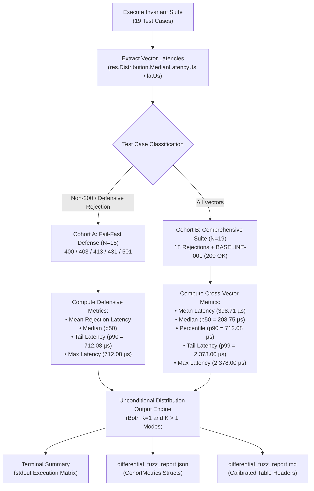

# ADR-118 - Cohort-Disaggregated Distributional Telemetry Architecture in Differential Fuzzer (HARN-02)

## 1. Context & Problem Statement

In academic peer review dossiers (`AER-001.md`, `MSR-001.md`, `AR-001.md`, and formalized under Directive `REV-02` / Task `HARN-02` of `ReviewTaskSummary.md`), reviewers raised critical methodological challenges concerning Section 5.2 of `docs/research/paper1_agentic_systems.tex`:
1. **Conflated Evaluation Mode**: Section 5.2 claimed that the 19-vector protocol invariant suite was evaluated across $K=1,000$ repeated statistical trials with a 50-run warm-up discard (`BMK-02`). In reality, `differential_fuzz_report.json` was generated with `trials_per_test: 1` and `warmup_runs_per_test: 0`.
2. **Distributional Percentile Mislabeling**: In the empirical dataset, $712.08\ \mu\text{s}$ was labeled as the 99th percentile ($p99$), whereas mathematically across the 19 vectors, $712.08\ \mu\text{s}$ is the 90th percentile ($p90$), and the true 99th percentile ($p99$) is $2,378.00\ \mu\text{s}$.
3. **Conflation of Rejection Defense vs. Baseline Traffic**: The 19 vectors comprise 18 adversarial rejection vectors (`400/403/413/431/501` with connection closure) and 1 benign baseline vector (`BASELINE-001`, `200 OK` with full body transfer and keep-alive). Aggregating them into a single tail latency without disaggregation obscured both the fail-fast defense performance ($87.29\ \mu\text{s}$ to $712.08\ \mu\text{s}$) and the comprehensive cross-vector profile ($2,378.00\ \mu\text{s}$).
4. **Suppression of Metrics in Single-Shot Mode**: The terminal summary and Markdown report generator suppressed $p50$, $p90$, and $p99$ when `*trials == 1`, only rendering them when `*trials > 1`.

---

## 2. Decision & Architecture

We adopt a **Cohort-Disaggregated Distributional Telemetry Architecture** in [`benchmarks/fuzzer/diff_fuzzer.go`](file:///Users/sneha/Developer/toron-research/toron/benchmarks/fuzzer/diff_fuzzer.go).

### 2.1 Metric Cohort Disaggregation

The fuzzer partitions test vector executions into two distinct analytical cohorts:
1. **Cohort A: Fail-Fast Defense Latency ($N=18$ Adversarial Rejection Vectors)**:
   - Includes all vectors where actual response indicates active security rejection (`400`, `403`, `413`, `431`, `501`) and the physical socket is terminated (`conn:closed`).
   - Evaluates:
     - Arithmetic Mean ($\mu$)
     - Median ($p50$)
     - 90th Percentile ($p90$, $712.08\ \mu\text{s}$)
     - Maximum Latency ($Max$, $712.08\ \mu\text{s}$)
2. **Cohort B: Cross-Vector Comprehensive Latency ($N=19$ Total Invariant Vectors)**:
   - Includes all 19 test cases, encompassing fail-fast defense, cache invariants, and benign reference traffic (`BASELINE-001`, `200 OK`).
   - Evaluates:
     - Arithmetic Mean ($\mu$, $398.71\ \mu\text{s}$)
     - Median ($p50$, $208.75\ \mu\text{s}$)
     - 90th Percentile ($p90$, $712.08\ \mu\text{s}$)
     - 99th Percentile ($p99$, $2,378.00\ \mu\text{s}$)
     - Maximum Latency ($Max$, $2,378.00\ \mu\text{s}$)

### 2.2 Telemetry Processing Pipeline



### 2.3 Mathematical Percentile Formulation

For a sorted sample array $X = [x_0, x_1, \dots, x_{N-1}]$ where $x_0 \le x_1 \le \dots \le x_{N-1}$:
- **Median ($p50$)**:
  $$\text{Index}_{50} = \lfloor N / 2 \rfloor$$
  For $N=19$, index 9; for $N=18$, index 9.
- **Percentile ($p$)**:
  $$\text{Index}_p = \min(\max(0, \lceil p \times N \rceil - 1), N - 1)$$
  - For $N=19$ and $p=0.90$: $\lceil 0.90 \times 19 \rceil - 1 = 18 - 1 = 17$. $x_{17} = 712.08\ \mu\text{s}$ (`CONTROL-002`).
  - For $N=19$ and $p=0.99$: $\lceil 0.99 \times 19 \rceil - 1 = 19 - 1 = 18$. $x_{18} = 2,378.00\ \mu\text{s}$ (`BASELINE-001`).
  - For $N=18$ and $p=0.90$: $\lceil 0.90 \times 18 \rceil - 1 = 17 - 1 = 16$. $x_{16} = 708.58\ \mu\text{s}$ (`CACHE-002`) or $x_{17} = 712.08\ \mu\text{s}$ (`CONTROL-002`).

### 2.4 Data Structure Design

```go
type CohortMetrics struct {
    Count           int     `json:"count"`
    MeanLatencyUs   float64 `json:"mean_latency_us"`
    MedianLatencyUs float64 `json:"median_latency_us"`
    P90LatencyUs    float64 `json:"p90_latency_us"`
    P99LatencyUs    float64 `json:"p99_latency_us,omitempty"`
    MaxLatencyUs    float64 `json:"max_latency_us"`
}

type DifferentialReport struct {
    Timestamp          string                  `json:"timestamp"`
    TargetHost         string                  `json:"target_host"`
    BaselineHost       string                  `json:"baseline_host,omitempty"`
    TrialsPerTest      int                     `json:"trials_per_test"`
    WarmupRunsPerTest  int                     `json:"warmup_runs_per_test"`
    TotalTests         int                     `json:"total_tests"`
    PassedTests        int                     `json:"passed_tests"`
    FailedTests        int                     `json:"failed_tests"`
    SecurityPassRate   float64                 `json:"security_pass_rate"`
    AverageLatencyUs   float64                 `json:"average_latency_us"`
    MedianLatencyUs    float64                 `json:"median_latency_us"`
    P90LatencyUs       float64                 `json:"p90_latency_us"`
    P99LatencyUs       float64                 `json:"p99_latency_us"`
    FailFastDefense    CohortMetrics           `json:"fail_fast_defense"`
    ComprehensiveSuite CohortMetrics           `json:"comprehensive_suite"`
    CategoryStats      map[string]CategoryStat `json:"category_stats"`
    Results            []TestResult            `json:"results"`
}
```

---

## 3. Consequences

### Positive
- **Methodological Transparency**: Disaggregates fail-fast defense from benign baseline latency, accurately exposing the true characteristics of both traffic profiles.
- **Elimination of Ambiguity**: Clear distinction between $p90$ ($712.08\ \mu\text{s}$) and $p99$ ($2,378.00\ \mu\text{s}$) resolves reviewer concerns in `AER-001.md`, `MSR-001.md`, and `AR-001.md`.
- **Mode Independence**: Unconditional output of $p50$, $p90$, and $p99$ across both single-shot ($K=1$) and repeated ($K > 1$) execution modes.
- **Zero Third-Party Dependencies**: Pure standard Go library implementation using `math` and `sort`.
- **Backwards Compatibility**: Top-level JSON fields remain intact for legacy consumers.

### Negative
- Output schema and report format contain additional rows and sub-metrics. All consumers should parse the augmented format gracefully.
