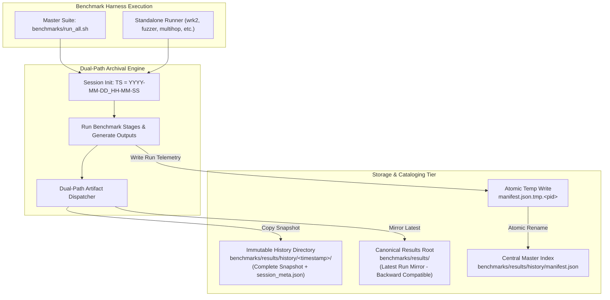

# ADR-119 - Dual-Path Benchmark Result Retention and Atomic Manifest Architecture (REQ-119)

## 1. Context & Problem Statement
Toron benchmark execution generated results directly into [`benchmarks/results/`](file:///Users/sneha/Developer/toron-research/toron/benchmarks/results/), overwriting previously generated JSON, Markdown, CSV, and raw telemetry files. This caused empirical loss across repeated runs, blocked longitudinal performance tracking, and lacked a centralized machine-readable index.

The requirement ([`REQ-119`](file:///Users/sneha/Developer/toron-research/toron/docs/requirements/REQ-119.md)) mandates retaining all benchmark outputs without breaking existing links or tools expecting canonical paths in `benchmarks/results/`.

---

## 2. Decision & Architecture

We adopt a **Dual-Path Benchmark Result Retention and Atomic Manifest Architecture**.

### 2.1 Key Architectural Principles

1. **Dual-Path Replication**:
   - **Historical Snapshot Path**: `benchmarks/results/history/<timestamp>/` retains an immutable, timestamped copy of all artifacts (`.json`, `.md`, `.csv`, `.raw.txt`, logs) and a `session_meta.json` file.
   - **Canonical Path**: `benchmarks/results/` is refreshed with the exact same files to ensure 100% backward compatibility for LaTeX citations, CI pipelines, and docs.

2. **Unified Session vs Standalone Execution**:
   - When executed via `run_all.sh`, a unified `TORON_BENCHMARK_SESSION_DIR` environment variable is exported so all 6 sub-benchmarks aggregate their outputs into the single shared historical directory for that session.
   - When any individual runner (`run_wrk2.sh`, `run_saturation_stress.sh`, `run_fuzzer.sh`, `run_multihop.sh`, `run_ablation.sh`) is executed standalone, it dynamically provisions its own timestamped directory and registers its run in `manifest.json`.

3. **Atomic Manifest Updates**:
   - The central manifest `benchmarks/results/history/manifest.json` tracks chronological runs.
   - To guarantee concurrency and crash safety, updates write to a temporary file (`manifest.json.tmp.<pid>`) and use atomic POSIX file replacement (`mv` / `os.Rename`).

4. **Zero Third-Party Dependency Invariant**:
   - All scripting uses POSIX shell conventions and Go standard library packages (`os`, `path/filepath`, `encoding/json`, `time`). No external CLI dependencies (like jq) are strictly required.

---

## 3. Consequences

### Positive
- Complete retention of historical benchmark telemetry across commits.
- Full backward compatibility: existing paths (`benchmarks/results/*.json`) remain intact.
- High resilience: atomic manifest operations prevent JSON corruption.
- Traceability: every run links git commit, Go version, parameters, and outputs.

### Negative / Trade-offs
- Increased disk space utilization over time; mitigated by lightweight text/JSON files and optional `--no-history` flag.
