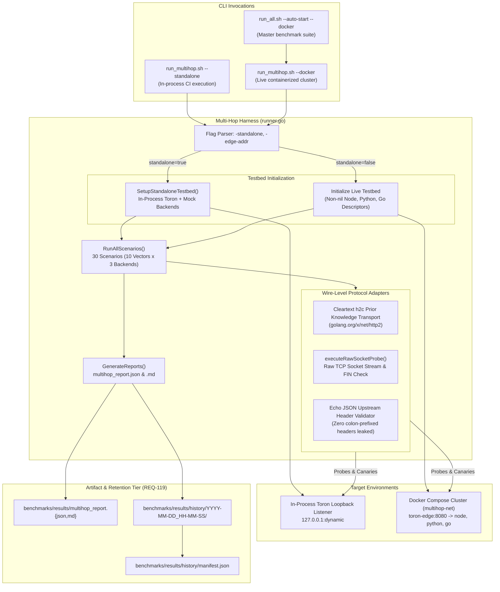
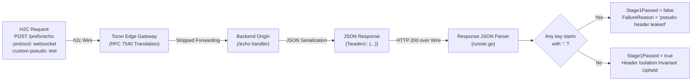

# ADR-120 - Heterogeneous Multi-Hop Live Docker Harness Network Execution Architecture

## 1. Context & Problem Statement

### 1.1 Academic & Operational Context
The Heterogeneous Multi-Hop Backend Origin Testbed ([`ADR-113`](file:///Users/sneha/Developer/toron-research/toron/docs/architecture/ADR-113.md), [`REQ-113`](file:///Users/sneha/Developer/toron-research/toron/docs/requirements/REQ-113.md), `BMK-03`) was designed to evaluate Toron fronting three live, heterogeneous HTTP parser implementations across persistent connection pools:
1. **Node.js 20 LTS**: C-based `llhttp` parser engine.
2. **Python 3.11**: ASGI `uvicorn` / `h11` parser engine.
3. **Go 1.24**: Standard library `net/http` parser engine.

The benchmark executes a two-stage desynchronization evaluation protocol ($r_{\text{poison}} \,\|\, r_{\text{benign}}$) across 10 attack and baseline vectors (`VECTOR-01` through `VECTOR-10`), verifying that edge rejections prevent upstream connection pool poisoning and backend desynchronization.

### 1.2 The Production Benchmark Crash Incident
During master end-to-end benchmark validation:
```bash
./benchmarks/run_all.sh --auto-start --docker
```
(which calls [`benchmarks/multihop/run_multihop.sh --docker`](file:///Users/sneha/Developer/toron-research/toron/benchmarks/multihop/run_multihop.sh)), the multi-hop testbed abruptly crashed with a fatal panic:
```text
panic: runtime error: invalid memory address or nil pointer dereference at benchmarks/multihop/runner.go:687
```

### 1.3 Root Cause Analysis & Architectural Flaws
Static and dynamic analysis of [`benchmarks/multihop/runner.go`](file:///Users/sneha/Developer/toron-research/toron/benchmarks/multihop/runner.go) identified four fundamental architectural flaws in the harness design:

1. **Uninstantiated Backend Descriptors in Live Mode (`runner.go:687`)**:
   When executed in live mode (`-standalone=false -edge-addr <host:port>`), `main()` constructed [`TestbedEnvironment`](file:///Users/sneha/Developer/toron-research/toron/benchmarks/multihop/runner.go#L332-L340) with only `EdgeAddr` and `IsLive: true`. The backend descriptor pointers `NodeBackend`, `PyBackend`, and `GoBackend` remained `nil`. When [`RunAllScenarios`](file:///Users/sneha/Developer/toron-research/toron/benchmarks/multihop/runner.go#L659-L731) iterated over `backends := []*SimulatedBackend{env.NodeBackend, env.PyBackend, env.GoBackend}`, dereferencing `b.Runtime` on line 687 triggered an immediate nil pointer panic.

2. **In-Memory Server Invocation on Non-Existent In-Process Server**:
   In `ExecuteScenario`, five HTTP/2 vectors (`VECTOR-01` [H2.TE], `VECTOR-02` [H2.CL-Duplicate], `VECTOR-03` [H2.CL-Mismatch], `VECTOR-07` [CRLF-Header-Injection], and `VECTOR-08` [Pseudo-Header-Isolation]) bypassed physical networking entirely by invoking:
   ```go
   env.EdgeServer.HTTP2AdapterHandler().ServeHTTP(rec, req)
   ```
   In live Docker mode, Toron runs inside a dedicated container (`toron-edge-multihop`) exposed on host port `8080`. `env.EdgeServer` is `nil`, dereferencing which causes a fatal crash. Furthermore, direct handler calls completely bypass the TCP network stack, failing to validate real TCP socket framing, cleartext h2c Prior Knowledge negotiation, and socket lifecycle events.

3. **In-Memory Upstream Header Leakage Verification**:
   For `VECTOR-08` (Pseudo-Header Upstream Isolation), the harness inspected pseudo-header stripping by acquiring a mutex on `targetBackend.Mu` and reading `targetBackend.LastHeaders` from the in-process mock server struct. In live Docker mode, backend origins run inside isolated containers (`toron-node-origin`, `toron-python-origin`, `toron-go-origin`). In-process struct inspection is impossible. The backend origins already echo received headers under the `"headers"` key in their `/echo` JSON response, but the harness never parsed this response payload over the wire.

4. **Divergent Execution Semantics Between Standalone and Live Modes**:
   The standalone mode relied on in-process Go memory constructs (`httptest.ResponseRecorder`, direct handler dispatch), while live mode requires real network operations over TCP/h2c. The testbed lacked a unified wire-level abstraction capable of evaluating both environments against identical scenarios with uniform telemetry and reporting.

---

## 2. Architectural Decisions

To resolve these defects and guarantee continuous, reproducible multi-hop benchmark execution in both standalone CI and live Docker environments, we establish the following decisions:

```
+-----------------------------------------------------------------------------------------+
|                                    Toron Multi-Hop Harness                              |
|                              (benchmarks/multihop/runner.go)                            |
+-----------------------------------------------------------------------------------------+
       |                                                                   |
       | Standalone In-Process Mode                                        | Live Docker Mode
       | (--standalone)                                                    | (--docker / -standalone=false)
       v                                                                   v
+-----------------------------+                           +-------------------------------+
| In-Process Simulated Origins|                           | Docker Compose Bridge Network |
| - Node.js mock (llhttp)     |                           | (docker-compose.multihop.yml) |
| - Python mock (uvicorn/h11) |                           |                               |
| - Go mock (net/http)        |                           |  +-------------------------+  |
+-----------------------------+                           |  | toron-edge-multihop     |  |
               ^                                          |  | (Port 8080, h2c / HTTP) |  |
               |                                          |  +-------------------------+  |
+-----------------------------+                           |         |      |      |       |
| In-Process Toron Gateway    |                           |         v      v      v       |
| (Dynamic Loopback Listener) |                           |      +------+ +----+ +----+   |
+-----------------------------+                           |      | Node | | Py | | Go |   |
               ^                                          |      +------+ +----+ +----+   |
               |                                          +-------------------------------+
               +-----------------------+                                  ^
                                       |                                  |
                                       v                                  v
                        +----------------------------------------------------+
                        |       Wire-Level Protocol Execution Engine         |
                        |   - HTTP/1.1 TCP Raw Socket Stream & FIN Check     |
                        |   - HTTP/2 Cleartext (h2c) Prior Knowledge Client  |
                        |   - Response Body & Upstream Echo JSON Parser      |
                        +----------------------------------------------------+
                                                 |
                                                 v
                        +----------------------------------------------------+
                        |         Empirical Telemetry & Report Engine        |
                        |   - benchmarks/results/multihop_report.json        |
                        |   - benchmarks/results/multihop_report.md          |
                        |   - benchmarks/results/history/<timestamp>/        |
                        |   - manifest.json (REQ-119 Retention Tracking)     |
                        +----------------------------------------------------+
```

### 2.1 Decision 1: Unified Dual-Mode Harness Architecture

[`TestbedEnvironment`](file:///Users/sneha/Developer/toron-research/toron/benchmarks/multihop/runner.go#L332-L340) provides a unified execution interface for both standalone in-process mode and live containerized cluster mode.

1. **Explicit Live Backend Descriptors**:
   In live mode (`-standalone=false`), `runner.go` must explicitly instantiate non-nil [`SimulatedBackend`](file:///Users/sneha/Developer/toron-research/toron/benchmarks/multihop/runner.go#L89-L98) descriptors for all three runtime targets before scenario execution:
   - **Node.js**: `Runtime: "Node.js 20 LTS"`, `ParserEngine: "llhttp (C-based)"`, `Prefix: "node"`, `Server: nil`
   - **Python**: `Runtime: "Python 3.11"`, `ParserEngine: "uvicorn / h11"`, `Prefix: "python"`, `Server: nil`
   - **Go**: `Runtime: "Go 1.24"`, `ParserEngine: "net/http"`, `Prefix: "go"`, `Server: nil`
   This guarantees that `RunAllScenarios` iterates over `backends := []*SimulatedBackend{env.NodeBackend, env.PyBackend, env.GoBackend}` without encountering nil pointer dereferences.

2. **Prefix Routing Alignment**:
   In both modes, routing prefixes correspond directly to Edge Gateway upstream routes:
   - `/node/*` $\rightarrow$ Node.js origin (llhttp, port 9101)
   - `/python/*` $\rightarrow$ Python origin (uvicorn/h11, port 9102)
   - `/go/*` $\rightarrow$ Go origin (net/http, port 9103)

3. **Safe Teardown Guard**:
   In live mode, `sb.Server` is `nil` because backend lifecycles are managed by Docker Compose. The teardown methods [`sb.Close()`](file:///Users/sneha/Developer/toron-research/toron/benchmarks/multihop/runner.go#L101-L105) and [`env.Teardown()`](file:///Users/sneha/Developer/toron-research/toron/benchmarks/multihop/runner.go#L403-L421) must guard `sb.Server != nil` before closing.

### 2.2 Decision 2: Wire-Level Protocol Execution Architecture

All direct in-memory invocations of `env.EdgeServer.HTTP2AdapterHandler().ServeHTTP(...)` are eliminated from [`ExecuteScenario`](file:///Users/sneha/Developer/toron-research/toron/benchmarks/multihop/runner.go#L424-L590). Every scenario executes via physical network connections to `env.EdgeAddr`:

1. **Cleartext HTTP/2 (h2c) Prior Knowledge Transport**:
   Toron natively implements cleartext HTTP/2 prior knowledge support over TCP: when a connection begins with the HTTP/2 client preface (`PRI * HTTP/2.0\r\n\r\nSM\r\n\r\n`), Toron automatically engages its HTTP/2 connection server (`http2.Server.ServeConn`).
   - For HTTP/2 scenarios, the harness establishes an h2c transport utilizing `golang.org/x/net/http2.Transport`:
     ```go
     h2Transport := &http2.Transport{
         AllowHTTP: true,
         DialTLSContext: func(ctx context.Context, network, addr string, cfg *tls.Config) (net.Conn, error) {
             var d net.Dialer
             d.Timeout = 2 * time.Second
             return d.DialContext(ctx, network, addr)
         },
     }
     ```
   - Request transmission enforces strict bounded deadlines ($\le 3\text{ seconds}$).

2. **Wire Framing for Malformed HTTP/2 Vectors**:
   For vectors evaluating malformed HTTP/2 protocol frames (`VECTOR-01` [H2.TE], `VECTOR-02` [H2.CL-Duplicate], `VECTOR-03` [H2.CL-Mismatch], `VECTOR-07` [CRLF-Header-Injection]):
   - The harness transmits the request over the wire to `env.EdgeAddr`.
   - Where standard library client transports refuse to serialize malformed headers locally, the harness delivers raw HTTP/2 frames directly over a raw TCP connection:
     1. Send 24-byte HTTP/2 client connection preface: `PRI * HTTP/2.0\r\n\r\nSM\r\n\r\n`.
     2. Send initial HTTP/2 `SETTINGS` frame.
     3. Send `HEADERS` frame containing the targeted malformed header block (e.g. `Transfer-Encoding: chunked`, duplicate `Content-Length`, or CRLF injection) encoded via `golang.org/x/net/http2/hpack`.
   - Assert that the Edge Gateway returns an HTTP status code $400\text{ Bad Request}$ or issues an HTTP/2 `RST_STREAM` / `GOAWAY` stream termination.

3. **Raw TCP Socket Probing for HTTP/1.1 Vectors**:
   HTTP/1.1 desynchronization vectors (`VECTOR-04` [H1-CL.TE], `VECTOR-05` [H1-TE.CL-Obfuscated], `VECTOR-06` [H1-Pipelined-Smuggle]) continue using [`executeRawSocketProbe`](file:///Users/sneha/Developer/toron-research/toron/benchmarks/multihop/runner.go#L593-L625) over raw TCP connections, validating fail-fast socket teardown (`FIN`/`RST`) and status line response codes.

4. **Bounded Deadlines**:
   To prevent deadlocks and hangs during test runs:
   - TCP Dial Timeout: $\le 2\text{ seconds}$
   - Socket Read Deadline: $\le 2\text{ seconds}$
   - Total Scenario Deadline: $\le 3\text{ seconds}$

### 2.3 Decision 3: Wire-Based Upstream Header Leakage Verification

In `VECTOR-08` (Pseudo-Header Upstream Isolation), reliance on in-memory inspection of `targetBackend.LastHeaders` is replaced with end-to-end response payload verification over the wire:

1. **Origin Echo Contract**:
   All three backend origin implementations ([`node/server.js`](file:///Users/sneha/Developer/toron-research/toron/benchmarks/multihop/backends/node/server.js#L42-L54), [`python/server.py`](file:///Users/sneha/Developer/toron-research/toron/benchmarks/multihop/backends/python/server.py#L38-L50), [`go/main.go`](file:///Users/sneha/Developer/toron-research/toron/benchmarks/multihop/backends/go/main.go#L44-L56)) and the in-process mock server implement the `POST /echo` contract. Upon receipt of a request, they serialize all received upstream headers into a JSON object under the `"headers"` key and return HTTP 200.

2. **Verification Protocol**:
   - Transmit an h2c request to `POST /<prefix>/echo` containing pseudo-headers (e.g., `:protocol: websocket`, `:custom-pseudo: invisible`).
   - Ingest the HTTP 200 response body returned through Toron.
   - Parse the JSON payload and unmarshal the `"headers"` field into a dictionary (`map[string]any`).
   - Verify that **zero** keys in the echoed dictionary begin with a colon (`:`).
   - If any colon-prefixed header is present, mark `Stage1Passed = false` with failure reason:
     ```text
     pseudo-header leaked to upstream: <key>
     ```

### 2.4 Decision 4: Safe Teardown & Lifecycle Invariants

1. **Safe Teardown Implementation**:
   - Standalone mode: cleans up loopback listeners, in-process Toron server, and mock backend servers.
   - Live mode: skips server teardown since containers are managed externally by `docker compose`. `sb.Close()` is a no-op when `sb.Server == nil`.

2. **Historical Retention & Reporting Parity (REQ-119)**:
   - In both execution modes, the runner emits identical report artifacts:
     - Machine-readable JSON: `benchmarks/results/multihop_report.json`
     - Human-readable Markdown: `benchmarks/results/multihop_report.md`
   - Both modes archive outputs into `benchmarks/results/history/<timestamp>/` and update `benchmarks/results/history/manifest.json` via [`benchmarks/archive_run.sh`](file:///Users/sneha/Developer/toron-research/toron/benchmarks/archive_run.sh).

---

## 3. Architecture Diagrams

### 3.1 Dual-Mode Harness Component & Topology



### 3.2 Two-Stage Wire-Level Protocol Execution Sequence

```mermaid
sequenceDiagram
    autonumber
    actor Runner as Testbed Runner (runner.go)
    participant Edge as Toron Edge Gateway (Port 8080 / Loopback)
    participant Origin as Backend Origin (Node / Python / Go)

    Note over Runner,Edge: STAGE 1: Attack or Baseline Vector Execution (r_poison)
    alt HTTP/2 Vector (VECTOR-01, 02, 03, 07, 08)
        Runner->>Edge: Cleartext h2c Frame Stream (PRI * HTTP/2.0... + HEADERS)
        alt Malformed Attack Vector (e.g. H2.TE / H2.CL-Duplicate)
            Edge-->>Runner: 400 Bad Request / RST_STREAM (Stream Terminated)
            Note over Runner: Assert Stage1EdgeStatus == 400 (Pass)
        else Pseudo-Header Isolation Vector (VECTOR-08)
            Edge->>Edge: Validate & Strip Pseudo-Headers (:protocol, :custom-*)
            Edge->>Origin: Forward HTTP/1.1 POST /echo (Clean Headers Only)
            Origin-->>Edge: 200 OK {"headers": {...}, "body": "valid-body"}
            Edge-->>Runner: 200 OK {"headers": {...}}
            Runner->>Runner: Ingest JSON body; Assert zero ':' headers present
        end
    else HTTP/1.1 Vector (VECTOR-04, 05, 06)
        Runner->>Edge: Raw TCP Bytes (Ambiguous CL / TE Smuggling Probes)
        Edge-->>Runner: 400 Bad Request + TCP FIN / RST
        Runner->>Runner: verifySocketClosed(conn) == true
    else Baseline Vector (VECTOR-09, 10)
        Runner->>Edge: Standard HTTP GET /health or POST /echo
        Edge->>Origin: Proxy to Backend Origin
        Origin-->>Edge: 200 OK
        Edge-->>Runner: 200 OK
    end

    Note over Runner,Origin: STAGE 2: Benign Canary Verification (r_benign)
    Runner->>Edge: HTTP/1.1 GET /<prefix>/canary
    Edge->>Origin: Forward GET /canary (Over Persistent Connection Pool)
    Origin-->>Edge: 200 OK {"status": "canary_ok", "sequence": N}
    Edge-->>Runner: 200 OK {"status": "canary_ok"}
    Runner->>Runner: Assert Canary Passed; Desynchronization == false; PoolIntegrity == true
```

### 3.3 Echo Response Upstream Header Leakage Verification



---

## 4. Alternatives Considered

| Alternative | Description | Pros | Cons | Verdict |
| :--- | :--- | :--- | :--- | :--- |
| **Alternative 1: Purely In-Process Simulation** | Eliminate live containerized execution; simulate all backends and gateways via in-process Go goroutines and `httptest.Server`. | - Fast CI execution<br/>- Zero Docker dependency | - Reintroduces the multi-hop relational blindspot (`AER-002`)<br/>- Cannot validate production C `llhttp` or Python `uvicorn`<br/>- Breaks `./benchmarks/run_all.sh --docker` | **Rejected**: Fails academic and empirical validation criteria. |
| **Alternative 2: Separate CLI Binaries for Standalone vs. Live** | Implement two distinct runner binaries: `multihop_inproc` for standalone tests and `multihop_docker` for container testing. | - Isolates mock vs real networking code | - Massive code duplication (vector definitions, canary protocols, reporting)<br/>- High risk of semantic drift between standalone and live modes | **Rejected**: Violates single-source-of-truth; unified runner guarantees parity. |
| **Alternative 3: Direct Raw HTTP/2 Frame Injection for All Vectors** | Construct custom raw byte sequences for every HTTP/2 vector without using `http2.Transport`. | - Complete control over byte framing | - High implementation complexity (manual HPACK dynamic table maintenance, SETTINGS handshakes)<br/>- Unnecessary for standard and baseline vectors | **Rejected**: Unnecessary complexity. Hybrid model (Prior Knowledge h2c transport + targeted raw wire frames) chosen. |
| **Alternative 4: Dedicated Live Origin Introspection API** | Introduce custom debug endpoints (e.g. `GET /debug/last-headers`) on backend origins. | - Direct access to backend state | - Pollutes backend origin stubs with artificial non-standard debug interfaces<br/>- Unnecessary since `POST /echo` already returns all headers | **Rejected**: `POST /echo` contract already provides full header visibility over standard HTTP. |

---

## 5. Rationale & Trade-offs

### 5.1 Why Prior Knowledge h2c Client + Wire Probing
Toron is designed to operate as a high-performance reverse proxy supporting both HTTP/1.1 and cleartext HTTP/2 (`h2c`). By using `golang.org/x/net/http2.Transport` configured with `AllowHTTP: true` and a custom cleartext dialer:
- The harness communicates over actual TCP sockets, exercising Toron's TCP connection accept loop, HTTP/2 preface detection (`PRI * HTTP/2.0\r\n\r\nSM\r\n\r\n`), stream multiplexer, and connection worker pool.
- Gateway rejections return real HTTP/2 stream errors (`RST_STREAM`) or HTTP 400 frames over the wire, validating client-visible behavior.
- For malformed headers that Go's client library rejects before transmission, sending raw byte frames over TCP verifies that Toron's edge parser correctly rejects malformed wire framing rather than relying on Go client validation.

### 5.2 Why Wire-Based Header Echo Parsing
Relying on in-memory struct fields (`targetBackend.LastHeaders`) created an unbridgeable divide between standalone mode (where memory is local) and live mode (where origins run in Docker containers). By shifting verification to the HTTP response payload returned by `/echo`:
- Standalone and live Docker modes use identical validation logic.
- Zero extra container instrumentation or sidecar monitoring is needed.
- Upstream header stripping is tested from the exact vantage point that matters: what the upstream server actually received.

### 5.3 Performance & Safety Trade-offs
- Setting bounded timeouts ($\le 2\text{s}$ dial, $\le 3\text{s}$ total probe) ensures that dropped frames, malformed sockets, or unacknowledged streams fail fast without deadlocking CI pipelines or benchmark orchestrators.
- All 30 scenarios complete within approximately 1-2 seconds in standalone mode and 3-5 seconds in live container mode.

---

## 6. Invariants & Constraints

1. **Zero Nil Dereferences**:
   - `env.NodeBackend`, `env.PyBackend`, and `env.GoBackend` must never be `nil` regardless of `-standalone` flag.
   - Teardown handlers must guard against `nil` `Server` and `EdgeServer` instances.
2. **Wire-Level Protocol Execution**:
   - Zero invocations of `env.EdgeServer.HTTP2AdapterHandler().ServeHTTP(...)` during vector execution.
   - All scenario traffic must traverse the loopback or Docker bridge network interface to `env.EdgeAddr`.
3. **Zero Leaked Pseudo-Headers**:
   - For `VECTOR-08`, no HTTP/2 pseudo-header (prefixed with `:`) may appear in the echoed upstream headers.
4. **Zero Desynchronization & Pool Poisoning**:
   - Desynchronization count must be strictly `0`.
   - Pool poisoning count must be strictly `0`.
5. **Zero External Go Dependencies (NFR-1)**:
   - Runner implementation strictly confined to Go standard library and `golang.org/x/net/http2`.
6. **Bounded Deadlines (NFR-2)**:
   - Dial deadline $\le 2\text{s}$; scenario read deadline $\le 3\text{s}$.
7. **Retention Conformance (NFR-3 / REQ-119)**:
   - Output files written to `benchmarks/results/` and archived in `benchmarks/results/history/<timestamp>/` with atomic `manifest.json` updates.

---

## 7. Consequences

### 7.1 Positive
- **Resolves Runtime Panic**: Completely eliminates the nil pointer dereference on `runner.go:687` in live Docker mode.
- **End-to-End Suite Stability**: Enables `./benchmarks/run_all.sh --auto-start --docker` to run the multi-hop benchmark stage to completion without crashing.
- **True Network Validation**: Exercises real cleartext h2c and HTTP/1.1 wire framing over TCP sockets instead of artificial in-memory handler dispatch.
- **Unified Codebase**: Both standalone CI tests (`go test ./benchmarks/multihop/...`) and live container runs (`run_multihop.sh --docker`) execute the exact same scenario logic.
- **Academic Defensibility**: Provides empirical proof of HTTP/2 to HTTP/1.1 translation security across three real production parser engines (Node.js llhttp, Python uvicorn/h11, Go net/http).

### 7.2 Negative & Operational Considerations
- Running in live mode requires a running Docker daemon and Compose plugin.
- Container build and startup introduce a 5-10 second cold-start overhead prior to scenario execution.
- If port `8080` is in use by another host process, live mode will fail during container bind; resolved by making the port configurable or ensuring port availability.

---

## 8. Open Questions & Future Considerations

1. **Automated Gateway Readiness Polling**:
   - In [`benchmarks/multihop/run_multihop.sh`](file:///Users/sneha/Developer/toron-research/toron/benchmarks/multihop/run_multihop.sh), replace static `sleep 5` with an active readiness probe loop polling `http://127.0.0.1:8080/node/health` up to 30 seconds before launching `runner.go`.
2. **TLS / ALPN Verification in Live Cluster**:
   - Future extensions may evaluate HTTP/2 over TLS (ALPN `h2`) in container mode by provisioning ephemeral self-signed certificates for Toron Edge.

---

## 9. Traceability Matrix

| Artifact ID | Artifact Type | Relationship | Role in Architecture |
| :--- | :--- | :--- | :--- |
| [`REQ-113`](file:///Users/sneha/Developer/toron-research/toron/docs/requirements/REQ-113.md) | Requirement | Upstream | Original multi-hop origin testbed requirement (`BMK-03`) |
| [`ADR-113`](file:///Users/sneha/Developer/toron-research/toron/docs/architecture/ADR-113.md) | Architecture | Upstream | Base multi-hop architectural decision record |
| [`REQ-119`](file:///Users/sneha/Developer/toron-research/toron/docs/requirements/REQ-119.md) | Requirement | Upstream | Benchmark result retention and atomic manifest requirement |
| [`ADR-119`](file:///Users/sneha/Developer/toron-research/toron/docs/architecture/ADR-119.md) | Architecture | Upstream | Benchmark retention and atomic manifest architecture |
| [`REQ-120`](file:///Users/sneha/Developer/toron-research/toron/docs/requirements/REQ-120.md) | Requirement | Source | Live Docker harness network execution requirement |
| `ADR-120` | Architecture | Self | This architecture decision record |
| [`TASK-143`](file:///Users/sneha/Developer/toron-research/toron/docs/tasks/TASK-143.md) | Task | Downstream | Implementation work packages (`TASK-143.1` to `TASK-143.5`) |
| `TC-120` | Test Specification | Downstream | Test cases verifying live mode descriptors, h2c wire probes, and echo parsing |
| `CR-116` | Code Review | Quality Gate | Code review for multi-hop live harness implementation |
| `SR-120` | Security Review | Security Gate | Security validation for pseudo-header stripping and smuggling resistance |
