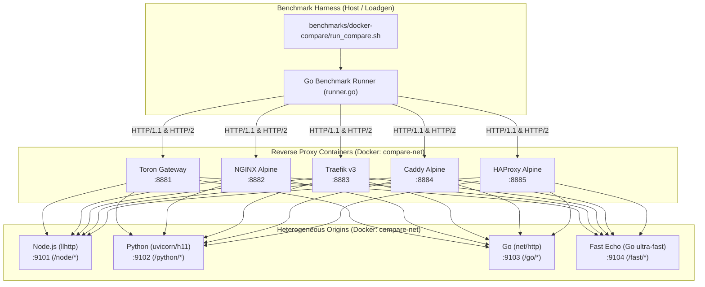

# ADR-121 - Multi-Proxy Differential Docker Benchmark Architecture with Heterogeneous Upstream Origins

## 1. Description & Context

To empirically benchmark Toron against established reverse proxies (**NGINX**, **Traefik**, **Caddy**, and **HAProxy**), the architecture must ensure identical execution conditions, identical network hops, identical upstream origin semantics, and strictly comparable resource limits.

---

## 2. Decision & Architecture Overview

The system will instantiate an isolated Docker Compose bridge network (`compare-net`) housing:
1. Four **Upstream Origin Containers**:
   - `toron-cmp-node` (Node.js 20, `llhttp`, port 9101)
   - `toron-cmp-python` (Python 3.11, `uvicorn/h11`, port 9102)
   - `toron-cmp-go` (Go 1.24, `net/http`, port 9103)
   - `toron-cmp-fast` (Go 1.24 zero-overhead HTTP echo, port 9104)
2. Five **Reverse Proxy Containers**:
   - `toron-cmp-toron` (Port `8881` $\rightarrow$ container `8080`)
   - `toron-cmp-nginx` (Port `8882` $\rightarrow$ container `80`)
   - `toron-cmp-traefik` (Port `8883` $\rightarrow$ container `80`)
   - `toron-cmp-caddy` (Port `8884` $\rightarrow$ container `80`)
   - `toron-cmp-haproxy` (Port `8885` $\rightarrow$ container `80`)
3. A **Differential Benchmark Orchestrator**:
   - Executes pre-flight functional parity probes against each proxy and endpoint.
   - Performs warm-up cycles and multi-concurrency load generation.
   - Samples Docker stats for CPU and Memory RSS telemetry.
   - Generates structured Markdown and JSON reports and registers with `benchmarks/archive_run.sh`.

---

## 3. Detailed Component Decisions

### 3.1 Upstream Origin Design
- Node.js, Python, and Go backends match the existing verified implementations from `benchmarks/multihop/backends/` to guarantee behavioral consistency with prior research evaluations.
- `fast-origin` is an ultra-lean Go HTTP server responding with `{"status":"ok"}` in $<100\,\mu\text{s}$, preventing upstream server thread starvation from masking proxy proxying bottlenecks.

### 3.2 Proxy Configuration Parity
- **Connection Keepalives**: Each proxy maintains a persistent upstream connection pool of at least 64-128 idle connections to prevent TCP handshakes on every upstream hop.
- **Access Logging**: Access logging is directed to `/dev/null` or minimized across all proxies during raw throughput tests to eliminate disk write bottlenecks.
- **Resource Constraints**: Optional Docker resource flags (`--cpus` and `--memory`) ensure that multi-process proxies (like NGINX) and multi-threaded runtimes (Go in Toron/Traefik/Caddy) are measured on a level playing field.

### 3.3 Port Allocation Strategy
- To avoid collision with existing developer daemon containers on ports 8081, 8082, 8084, 8085, proxy host ports are standardized in the `888x` block:
  - `8881`: Toron
  - `8882`: NGINX
  - `8883`: Traefik HTTP (`8880`: Dashboard/API)
  - `8884`: Caddy
  - `8885`: HAProxy (`8886`: HAProxy Stats)

---

## 4. Alternatives Considered

1. **Host-networked vs. Containerized Proxies**:
   - *Option 1*: Install NGINX, Traefik, Caddy, HAProxy on macOS host via Homebrew.
   - *Option 2 (Chosen)*: Containerize all proxies and backends in Docker.
   - *Rationale*: Containerization eliminates host OS environment differences, ensures cross-platform reproducibility in CI/CD, and enables precise CPU/memory isolation and telemetry via Docker cgroups.

2. **Benchmarking Tool Selection**:
   - *Option 1*: External dependency only (`wrk` or `wrk2`).
   - *Option 2 (Chosen)*: Tri-engine fallback (`wrk2` $\rightarrow$ `wrk` $\rightarrow$ native Go `loadgen.go`).
   - *Rationale*: Ensures zero-dependency execution out-of-the-box on any machine with Docker and Go installed, with HDR histogram accuracy and coordinated omission handling.

---

## 5. Consequences & Trade-offs

- **Positive**: Direct, verifiable, head-to-head performance and memory comparison across 5 major reverse proxies under identical workload vectors.
- **Trade-off**: Docker bridge networking on macOS operates through a VM abstraction layer (OrbStack/Docker Desktop), which adds small uniform virtualization overhead compared to native Linux sockets. Since all proxies share the identical network bridge, the comparative delta remains scientifically rigorous.
