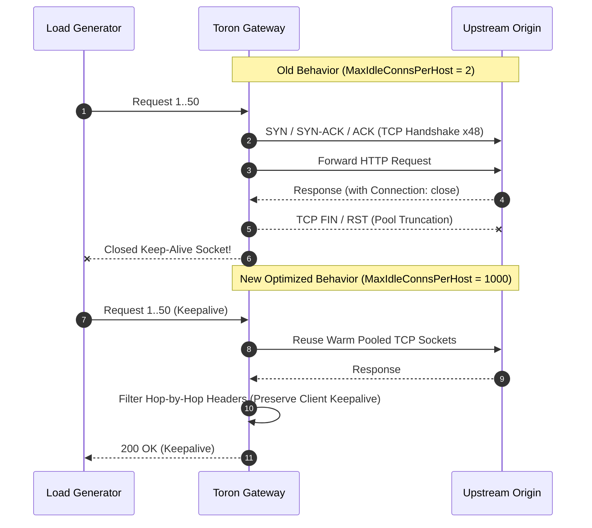

# ADR-122 - High-Performance Reverse Proxy Transport Architecture and Persistent Upstream Connection Lifecycle

## 1. Description & Problem Statement
In high-throughput reverse proxy workloads, creating new TCP sockets per request introduces intolerable TCP 3-way handshake latencies and socket starvation. Toron's default transport configuration omitted `MaxIdleConnsPerHost`, causing Go's standard library to truncate the idle connection pool to 2 connections per upstream origin.

---

## 2. Decision & Technical Specifications

1. **Persistent Upstream Pools**:
   Configure `http.Transport` in `pkg/proxy/proxy.go` with:
   - `MaxIdleConns: 10000`
   - `MaxIdleConnsPerHost: 1000`
   - `MaxConnsPerHost: 0`
   - `IdleConnTimeout: 90 * time.Second`
2. **Direct Transport Dialing**:
   - `Proxy: nil` bypasses `ProxyFromEnvironment` mutex locks and environment parsing on every request.
   - `DisableCompression: true` disables automatic client-side gzip decompressing, enabling direct zero-copy byte streaming from origin.
3. **Hop-by-Hop Response Header Sanitization**:
   - Upstream response headers matching RFC 7230 §6.1 are stripped when populating `res.Header`, decoupling upstream origin connection behavior from client connection lifecycles.
4. **Zero-Allocation String Formatting**:
   - Direct byte buffer writing replaces `fmt.Fprintf` in `Response.Serialize`.
   - `sanitizeHeader` performs fast-path byte checks (`strings.IndexByte`) before executing replacer operations.
