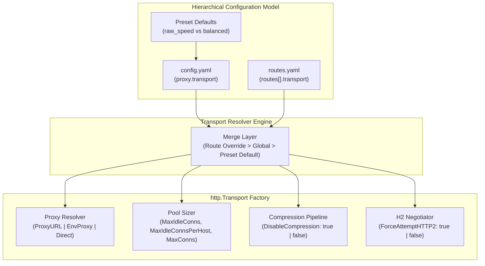

# ADR-123 - Configurable Hierarchical Reverse Proxy Upstream Transport Architecture

## 1. Description & Problem Statement
In [`REQ-122`](file:///Users/sneha/Developer/toron-research/toron/docs/requirements/REQ-122.md), Toron achieved maximum raw transit speed through static upstream transport properties. However, real-world edge proxy deployments face diverse network topologies:
1. Some upstream routes must transit corporate/cloud forward proxies (`HTTP_PROXY`, `HTTPS_PROXY`).
2. Fragile or single-threaded upstream runtimes require explicit connection limits (`MaxConnsPerHost > 0`) to prevent socket starvation or server crashes.
3. Multi-host deployments require tuned idle connection pools (`MaxIdleConnsPerHost`, `IdleConnTimeout`) to prevent file descriptor exhaustion.
4. Intermediate security or inspection pipelines may require decompressed payloads.
5. HTTPS upstreams may benefit from upstream HTTP/2 stream multiplexing.

Toron requires a declarative, two-tiered configuration model allowing both global defaults and granular per-route transport tuning without regressing raw-speed throughput.



---

## 2. Decision & Technical Specifications

### 2.1 Schema Definition: `ProxyTransportConfig`
Add `ProxyTransportConfig` in `pkg/config/config.go` with explicit pointer booleans to enable distinguishing between "explicitly set to false" vs "unset":

```go
type ProxyTransportConfig struct {
    Profile               string        `yaml:"profile,omitempty" json:"profile,omitempty"`
    MaxIdleConns          int           `yaml:"max_idle_conns,omitempty" json:"max_idle_conns,omitempty"`
    MaxIdleConnsPerHost   int           `yaml:"max_idle_conns_per_host,omitempty" json:"max_idle_conns_per_host,omitempty"`
    MaxConnsPerHost       int           `yaml:"max_conns_per_host,omitempty" json:"max_conns_per_host,omitempty"`
    IdleConnTimeout       time.Duration `yaml:"idle_conn_timeout,omitempty" json:"idle_conn_timeout,omitempty"`
    DisableCompression    *bool         `yaml:"disable_compression,omitempty" json:"disable_compression,omitempty"`
    UseEnvProxy           *bool         `yaml:"use_env_proxy,omitempty" json:"use_env_proxy,omitempty"`
    ProxyURL              string        `yaml:"proxy_url,omitempty" json:"proxy_url,omitempty"`
    PropagateUpstreamClose *bool        `yaml:"propagate_upstream_close,omitempty" json:"propagate_upstream_close,omitempty"`
    ForceAttemptHTTP2     *bool         `yaml:"force_attempt_http2,omitempty" json:"force_attempt_http2,omitempty"`
}
```

### 2.2 Hierarchical Resolution Algorithm
1. **Base Defaults**: If `profile` is `"balanced"` or `"standard"`, initialize safe enterprise defaults (`MaxIdleConnsPerHost: 100`, `MaxConnsPerHost: 200`, `IdleConnTimeout: 30s`, `UseEnvProxy: true`, `DisableCompression: false`, `ForceAttemptHTTP2: true`). Otherwise, default to `"raw_speed"` (`MaxIdleConns: 10000`, `MaxIdleConnsPerHost: 1000`, `MaxConnsPerHost: 0`, `IdleConnTimeout: 90s`, `DisableCompression: true`, `UseEnvProxy: false`, `ForceAttemptHTTP2: false`).
2. **Global Override**: Explicit fields in `config.yaml` `proxy.transport` override base defaults.
3. **Route Override**: Explicit fields in `routes.yaml` `routes[].transport` override global settings for that specific route prefix.

### 2.3 Security & RFC 7230 Invariant
Hop-by-hop header stripping is **mandatory and immutable** per RFC 7230 §6.1 and [`REQ-071 §3`](file:///Users/sneha/Developer/toron-research/toron/docs/requirements/REQ-071.md). When `PropagateUpstreamClose: true`, Toron cleanly signals connection closure to the client loop, while still stripping raw hop-by-hop headers (`Connection`, `Keep-Alive`, `Transfer-Encoding`) to completely prevent HTTP Request Smuggling (CWE-444).
