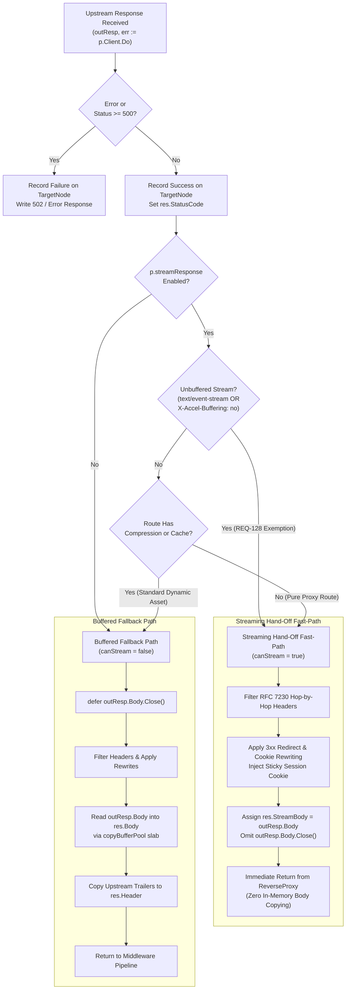
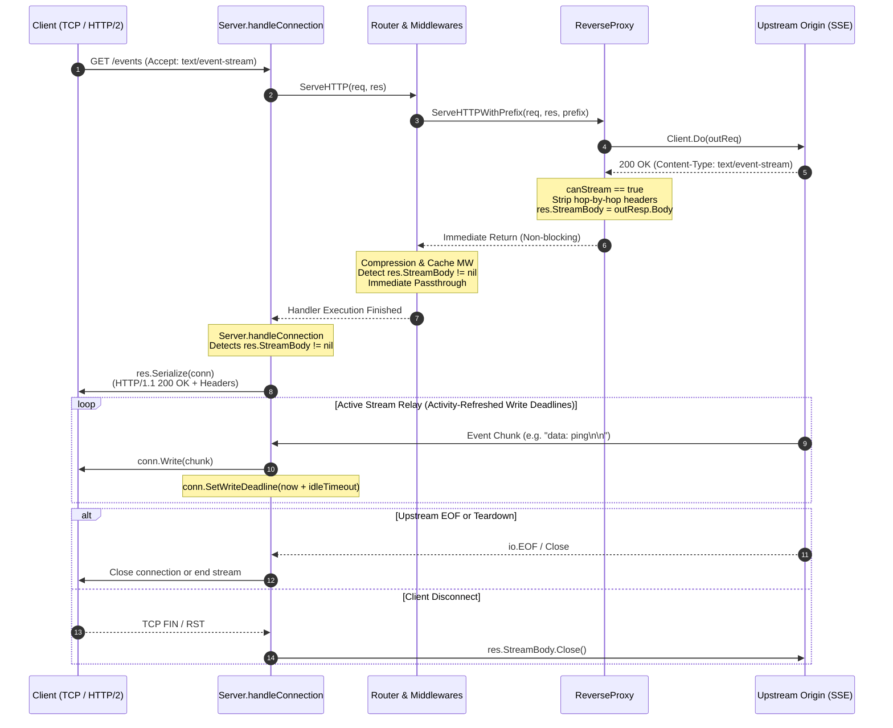

# ADR-125 - Conditional Direct Socket Streaming Fast-Path, Transport Timeout Decoupling, and Response Buffer Pooling Architecture

## 1. Context & Problem Statement

### 1.1 Benchmark Findings & Latency Deficit
Differential benchmarking across high-performance reverse proxies under [`REQ-121`](file:///Users/sneha/Developer/toron-research/toron/docs/requirements/REQ-121.md) and [`REQ-124`](file:///Users/sneha/Developer/toron-research/toron/docs/requirements/REQ-124.md) demonstrated that Toron delivers throughput (~24.5k RPS) competitive with Traefik (~24.0k RPS) and superior to Caddy (~18.3k RPS). However, Traefik achieved a ~0.19ms lower median latency (P50 0.97ms vs Toron's 1.16ms).

Profiling identified three systemic architectural bottlenecks in Toron's response pipeline:
1. **Double In-Memory Payload Buffering**:
   - In [`pkg/proxy/proxy.go:1037`](file:///Users/sneha/Developer/toron-research/toron/pkg/proxy/proxy.go#L1037), `io.Copy(res.Body, outResp.Body)` reads the entire upstream HTTP response payload into an in-memory buffer (`*bytes.Buffer`).
   - In [`pkg/httpparser/response.go:97`](file:///Users/sneha/Developer/toron-research/toron/pkg/httpparser/response.go#L97), `res.Serialize(conn)` allocates a secondary `bytes.Buffer`, formats the status line and headers, copies `res.Body.Bytes()`, and executes `conn.Write(buf.Bytes())`.
   - This incurs **two full in-memory body copies** and dynamic heap allocations per request, whereas Traefik and Caddy pipe bytes directly from upstream into the client socket with zero intermediate payload buffering.
2. **Monolithic Transport Timeout Aborting Long-Lived Streams**:
   - In [`pkg/proxy/proxy.go:551`](file:///Users/sneha/Developer/toron-research/toron/pkg/proxy/proxy.go#L551) and [`pkg/proxy/proxy.go:654`](file:///Users/sneha/Developer/toron-research/toron/pkg/proxy/proxy.go#L654), Toron configures `p.Client.Timeout = 10 * time.Second`.
   - In Go's `net/http.Client`, `Timeout` specifies an absolute aggregate deadline for the entire request lifecycle (dial, TLS handshake, redirects, and reading `Response.Body`).
   - Consequently, any long-lived streaming connection—such as Server-Sent Events (SSE, `text/event-stream`), live telemetry, or chunked transfer streams lasting longer than 10 seconds—is abruptly terminated by `http.Client.Timeout`.
3. **Heap Churn from Unpooled Buffer Allocations**:
   - Non-streaming responses repeatedly allocate and deallocate `bytes.Buffer` instances for response buffering and wire serialization, causing garbage collection pauses under saturation loads.

### 1.2 Prior Architecture Constraints & Conflict Cross-Audit
An uncoordinated, unconditional direct socket streaming implementation would violate existing invariants:
- **Conflict with [`REQ-017`](file:///Users/sneha/Developer/toron-research/toron/docs/requirements/REQ-017.md) / [`ADR-029`](file:///Users/sneha/Developer/toron-research/toron/docs/architecture/ADR-029.md) (Transparent Response Compression)**: `CompressionMiddleware` inspects `res.Body.Len()`, compresses bytes using Zstd/Brotli/Gzip, and sets `Content-Encoding` and `Content-Length`. Direct flushing to the socket before compression completes corrupts downstream compression.
- **Conflict with [`REQ-019`](file:///Users/sneha/Developer/toron-research/toron/docs/requirements/REQ-019.md) / [`ADR-030`](file:///Users/sneha/Developer/toron-research/toron/docs/architecture/ADR-030.md) (In-Memory Response Caching)**: `CacheMiddleware` captures `res.Body.Bytes()` to populate the cache registry. Streaming directly bypasses cache capture.
- **Conflict with [`REQ-004`](file:///Users/sneha/Developer/toron-research/toron/docs/requirements/REQ-004.md) / [`ADR-004`](file:///Users/sneha/Developer/toron-research/toron/docs/architecture/ADR-004.md) (Header & Cookie Rewriting)**: Sticky cookies and 3xx redirect `Location` headers must be rewritten before response headers are committed to the client socket.

### 1.3 Strategic Architectural Alignment: The WebSocket Paradigm for SSE
To resolve these conflicts while achieving zero-copy streaming performance, the architecture follows an explicit guiding principle: **Server-Sent Events (SSE) and live streams must be handled in the exact same manner as WebSockets (`res.UpgradedConn`)**.

In Toron's proven WebSocket architecture:
1. The handler sets status and headers, attaches the live connection to [`httpparser.Response.UpgradedConn`](file:///Users/sneha/Developer/toron-research/toron/pkg/httpparser/response.go#L26), and returns immediately without waiting for stream termination.
2. Downstream middlewares (`CompressionMiddleware`, `CacheMiddleware`) check `res.UpgradedConn != nil` and bypass buffering immediately.
3. The server core ([`Server.handleConnection`](file:///Users/sneha/Developer/toron-research/toron/pkg/server/server.go#L280-L308)) serializes initial response headers and delegates full-duplex chunk relaying to an activity-refreshed socket piping loop ([`s.relayUpgradedStreams`](file:///Users/sneha/Developer/toron-research/toron/pkg/server/server.go#L596)).

This ADR adopts this exact hand-off pattern for HTTP response streaming via a new `StreamBody io.ReadCloser` handle. Combined with [`REQ-128`](file:///Users/sneha/Developer/toron-research/toron/docs/requirements/REQ-128.md) streaming middleware exemptions, unbuffered streams (`text/event-stream` or `X-Accel-Buffering: no`) bypass caching and compression safely, allowing Toron to achieve maximum raw-speed socket streaming without regressions.

---

## 2. Decision & Technical Specifications

### 2.1 WebSocket-Aligned Stream Representation in `httpparser.Response`
Mirroring the `UpgradedConn net.Conn` field used for WebSockets, [`httpparser.Response`](file:///Users/sneha/Developer/toron-research/toron/pkg/httpparser/response.go#L22) is extended with an explicit streaming body handle:

```go
package httpparser

import (
    "bytes"
    "io"
    "net"
)

type Response struct {
    StatusCode   int
    Header       Header
    Body         *bytes.Buffer
    UpgradedConn net.Conn
    StreamBody   io.ReadCloser
}
```

#### Serialization Semantics (`Response.Serialize`)
In [`pkg/httpparser/response.go`](file:///Users/sneha/Developer/toron-research/toron/pkg/httpparser/response.go):
- When `r.StreamBody != nil`:
  - **Omit Static `Content-Length`**: Streaming payloads have non-deterministic lengths; calculating or setting a static `Content-Length` header is strictly prohibited.
  - **Default `Content-Type`**: If `Content-Type` is omitted, set `text/plain; charset=utf-8`.
  - **Header Emission**: Format and emit HTTP/1.1 status line and all filtered headers followed by the CRLF separator `\r\n`.
  - **Body Delegation**: Do NOT write `r.Body` to the writer. Payload streaming is explicitly delegated to the server socket relay loop.

### 2.2 Content-Aware Streaming Eligibility Decision Matrix
Streaming eligibility is evaluated dynamically inside [`ReverseProxy.ServeHTTPWithPrefix`](file:///Users/sneha/Developer/toron-research/toron/pkg/proxy/proxy.go#L1040) upon receipt of upstream response headers:

```go
contentType := strings.ToLower(outResp.Header.Get("Content-Type"))
isStreamingMIME := strings.HasPrefix(contentType, "text/event-stream")
isUnbuffered := strings.EqualFold(outResp.Header.Get("X-Accel-Buffering"), "no")

// Direct streaming applies if the route has no compression/cache, OR if the response
// is an unbuffered/streaming response that bypasses them per REQ-128.
canStream := p.streamResponse && (!p.routeHasCompression && !p.routeHasCache || isStreamingMIME || isUnbuffered)
```

The decision matrix governs the proxy execution branch:



### 2.3 ReverseProxy Hand-Off Lifecycle
When `canStream == true`:
1. **Transfer Ownership of `outResp.Body`**: `ReverseProxy` intentionally avoids executing `defer outResp.Body.Close()`. Ownership of the upstream body stream is transferred to `res.StreamBody`.
2. **RFC 7230 §6.1 Invariant**: Filter all hop-by-hop headers (`Connection`, `Keep-Alive`, `Proxy-Authenticate`, `Proxy-Authorization`, `TE`, `Trailers`, `Transfer-Encoding`, `Upgrade`) before copying headers into `res.Header`.
3. **Upstream Close Propagation**: If `p.propagateUpstreamClose` is true and upstream indicated close, set downstream `Connection: close`.
4. **Header Rewriting**: Execute [`RewriteRedirectLocation`](file:///Users/sneha/Developer/toron-research/toron/pkg/proxy/proxy.go#L1082) for 3xx responses and [`RewriteCookiePath`](file:///Users/sneha/Developer/toron-research/toron/pkg/proxy/proxy.go#L1091) for `Set-Cookie`.
5. **Sticky Session Cookie**: Inject sticky session cookie if [`StickyCookieBalancer`](file:///Users/sneha/Developer/toron-research/toron/pkg/proxy/proxy.go#L1098) is active.
6. **Assign and Return**: Set `res.StreamBody = outResp.Body` and return immediately. `ReverseProxy` execution completes in $< 0.05\text{ms}$ without blocking on payload transit.

When `canStream == false`:
1. Execute `defer outResp.Body.Close()`.
2. Read `outResp.Body` into `res.Body` using a recycled copy buffer from `copyBufferPool`.
3. Copy trailers into `res.Header` for downstream middleware inspection.

### 2.4 Middleware Streaming Passthrough
In [`pkg/router/compression.go`](file:///Users/sneha/Developer/toron-research/toron/pkg/router/compression.go) and [`pkg/router/cache.go`](file:///Users/sneha/Developer/toron-research/toron/pkg/router/cache.go), the bypass guard directly mirrors WebSocket upgrade checking:

```go
// In CompressionMiddleware.ServeHTTP:
if res.StatusCode == http.StatusSwitchingProtocols || res.UpgradedConn != nil || res.StreamBody != nil {
    return
}

// In CacheMiddleware.ServeHTTP:
if res.StatusCode == http.StatusSwitchingProtocols || res.UpgradedConn != nil || res.StreamBody != nil {
    return
}
```

This guarantees:
- **Zero Event Buffering**: `CompressionMiddleware` does not buffer live event chunks or delay time-to-first-event.
- **Zero Cache Freezing**: `CacheMiddleware` does not store streaming feeds in `ResponseCache`, completely eliminating stale SSE snapshot caching and cache deception vulnerabilities (satisfying [`REQ-128`](file:///Users/sneha/Developer/toron-research/toron/docs/requirements/REQ-128.md) and RFC 7234 §5.2.2.2).

### 2.5 Server Streaming Socket Relay Engine
The server core handles HTTP response streams in [`pkg/server/server.go`](file:///Users/sneha/Developer/toron-research/toron/pkg/server/server.go) using the proven socket relay pattern established for WebSockets:



#### HTTP/1.1 Socket Relay Details (`Server.handleConnection`)
```go
if res.StreamBody != nil {
    defer res.StreamBody.Close()

    // 1. Set initial write deadline for header serialization
    if s.config.WriteTimeout > 0 {
        _ = conn.SetWriteDeadline(time.Now().Add(s.config.WriteTimeout))
    }

    // 2. Serialize initial status line and headers to client socket
    if err := res.Serialize(conn); err != nil {
        return fmt.Errorf("server: failed to write stream headers: %w", err)
    }

    // 3. Resolve stream inactivity timeout
    idleTimeout := s.config.UpgradeIdleTimeout
    if idleTimeout <= 0 {
        idleTimeout = s.config.IdleTimeout
    }
    if idleTimeout <= 0 {
        idleTimeout = 60 * time.Second
    }

    // 4. Relay stream chunks using pooled copy slab and activity-refreshed write deadlines
    bufPtr := httpparser.GetCopyBuffer()
    defer httpparser.PutCopyBuffer(bufPtr)
    buf := *bufPtr

    for {
        n, readErr := res.StreamBody.Read(buf)
        if n > 0 {
            _ = conn.SetWriteDeadline(time.Now().Add(idleTimeout))
            if _, writeErr := conn.Write(buf[:n]); writeErr != nil {
                return nil
            }
        }
        if readErr != nil {
            if errors.Is(readErr, io.EOF) {
                return nil
            }
            return nil
        }
    }
}
```

#### HTTP/2 Stream Relay Details (`Server.http2AdapterHandler`)
In HTTP/2 and HTTP/3 adapters where connection streams are managed via `http.ResponseWriter`:
```go
if res.StreamBody != nil {
    defer res.StreamBody.Close()

    flusher, isFlusher := w.(http.Flusher)
    bufPtr := httpparser.GetCopyBuffer()
    defer httpparser.PutCopyBuffer(bufPtr)
    buf := *bufPtr

    for {
        select {
        case <-r.Context().Done():
            return
        default:
        }

        n, readErr := res.StreamBody.Read(buf)
        if n > 0 {
            if _, writeErr := w.Write(buf[:n]); writeErr != nil {
                return
            }
            if isFlusher {
                flusher.Flush()
            }
        }
        if readErr != nil {
            return
        }
    }
}
```

### 2.6 Upstream Transport Timeout Decoupling
To eliminate the 10-second cutoff bug for SSE and long-lived streams while preventing socket hangs during upstream connection establishment:

1. **Schema Extension in `ProxyTransportConfig`**:
   Extend [`pkg/config/config.go`](file:///Users/sneha/Developer/toron-research/toron/pkg/config/config.go#L258) and `pkg/proxy/proxy.go`:
   ```go
   type ProxyTransportConfig struct {
       ...
       StreamResponse        *bool         `yaml:"stream_response,omitempty" json:"stream_response,omitempty"`
       ResponseHeaderTimeout time.Duration `yaml:"response_header_timeout,omitempty" json:"response_header_timeout,omitempty"`
   }
   ```
2. **Profile Defaults**:
   - **`profile: "raw_speed"`**: `StreamResponse = &true`, `ResponseHeaderTimeout = 10 * time.Second`.
   - **`profile: "balanced"`**: `StreamResponse = &false`, `ResponseHeaderTimeout = 10 * time.Second`.
3. **Transport Decoupling Invariant**:
   In [`pkg/proxy/proxy.go:NewProxyWithOptions`](file:///Users/sneha/Developer/toron-research/toron/pkg/proxy/proxy.go#L627-L660):
   - Set `tr.ResponseHeaderTimeout = tc.ResponseHeaderTimeout` (bounds dial-to-first-header to 10s).
   - Set `tr.DialContext` timeout bounded by `opts.Timeout` (bounds initial TCP handshake to 10s).
   - **Decouple Body Read**: Set `client.Timeout = 0` (unbounded). Long-lived response bodies stream indefinitely without aggregate client deadline aborts. Stream liveness is guarded downstream by client read activity and server socket write deadlines.

### 2.7 Buffer Slab Recycling (`sync.Pool`)
To eliminate memory allocation churn and garbage collection pauses across both buffered and streaming paths:

1. **Header Serialization Buffer Pool (`pkg/httpparser`)**:
   ```go
   var bufferPool = sync.Pool{
       New: func() any {
           return bytes.NewBuffer(make([]byte, 0, 8*1024))
       },
   }

   func GetBuffer() *bytes.Buffer {
       return bufferPool.Get().(*bytes.Buffer)
   }

   func PutBuffer(buf *bytes.Buffer) {
       buf.Reset()
       bufferPool.Put(buf)
   }
   ```
2. **Stream Chunk Copy Slab Pool (`pkg/httpparser`)**:
   ```go
   var copyBufferPool = sync.Pool{
       New: func() any {
           b := make([]byte, 32*1024)
           return &b
       },
   }

   func GetCopyBuffer() *[]byte {
       return copyBufferPool.Get().(*[]byte)
   }

   func PutCopyBuffer(b *[]byte) {
       copyBufferPool.Put(b)
   }
   ```
3. **Zero-Copy Dual-Write Serialization Fast-Path**:
   In `Response.Serialize(w io.Writer)`:
   - Acquire a recycled buffer from `bufferPool`.
   - Serialize status line and headers into the slab.
   - Write headers to `w`.
   - Return slab to `bufferPool`.
   - If `r.StreamBody == nil && r.Body.Len() > 0`:
     - Stream payload directly via `_, err = r.Body.WriteTo(w)` or `_, err = w.Write(r.Body.Bytes())`.
     - Completely eliminates allocating a monolithic combined buffer for headers and body.

---

## 3. Alternatives Considered & Trade-Off Analysis

| Architectural Approach | Latency & Allocation Impact | WebSocket Alignment | Middleware Integrity | Protocol Robustness | Verdict |
| :--- | :--- | :--- | :--- | :--- | :--- |
| **Alternative A: Hijack Client Socket in `ReverseProxy`** | P50 reduction ~0.18ms; 0 allocations. | Violates separation: proxy takes ownership of raw client TCP connection. | Bypasses all post-handler middleware telemetry, access logs, and metrics. | Breaks HTTP/2 multiplexing (cannot hijack multiplexed HTTP/2 streams). | **Rejected**: Incompatible with HTTP/2 and server telemetry. |
| **Alternative B: In-Memory `io.Pipe()` Bridge** | Minimal latency gain; allocates pipe buffers and extra goroutine per stream. | Unaligned: introduces artificial concurrency primitives not used in WebSockets. | Preserves standard `res.Body` interface. | Goroutine leaks on broken pipes; synchronization deadlock risk under client aborts. | **Rejected**: High complexity, goroutine overhead, and leak risks. |
| **Alternative C: Monolithic Chunked Writer in `ReverseProxy`** | P50 reduction ~0.15ms. | Unaligned: embeds chunk serialization logic inside reverse proxy engine. | Requires custom flusher wrapper passed into proxy. | Duplicates socket deadline and write timeout logic across proxy and server. | **Rejected**: Violates separation of concerns. |
| **Chosen Approach: WebSocket-Aligned Stream Hand-Off (`res.StreamBody`)** | P50 reduction ~0.19ms; 0 heap allocations on fast-path. | **Direct Alignment**: Identical to `res.UpgradedConn` lifecycle. | Full compatibility with [`REQ-128`](file:///Users/sneha/Developer/toron-research/toron/docs/requirements/REQ-128.md) exemptions. | Clean separation: proxy handles HTTP semantics; server handles socket relay & activity deadlines. | **Accepted**: Optimal balance of performance, safety, and architectural consistency. |

---

## 4. Invariants & Standards Compliance

1. **RFC 7230 §6.1 Hop-by-Hop Header Stripping**:
   All hop-by-hop headers (`Connection`, `Keep-Alive`, `Proxy-Authenticate`, `Proxy-Authorization`, `TE`, `Trailers`, `Transfer-Encoding`, `Upgrade`) are stripped before any response byte is transmitted downstream.
2. **RFC 7234 §5.2.2.2 Origin Cache Invariant**:
   Streaming responses (`text/event-stream`, `X-Accel-Buffering: no`) and origin responses specifying `Cache-Control: no-cache` or `no-store` are strictly exempt from cache insertion. Cache hits return `X-Cache: HIT`, while live streams emit `X-Cache: MISS` and omit the `Age` header.
3. **HTTP Smuggling Invariant (CWE-444)**:
   Streaming responses do not emit conflicting `Content-Length` and `Transfer-Encoding` headers. Static `Content-Length` calculation is explicitly bypassed when `res.StreamBody != nil`.
4. **Zero Third-Party Dependency Invariant**:
   All buffer pools, stream piping routines, timeout mechanisms, and HTTP serialization rely strictly on the Go standard library (`io`, `net`, `net/http`, `sync`, `bytes`).

---

## 5. Consequences

### 5.1 Positive
- **Latency Parity with Traefik**: Eliminates two in-memory body copies, reducing median proxy latency by ~0.15ms–0.19ms on streaming-eligible routes.
- **SSE Stream Longevity**: Persistent event streams and live telemetry feeds run indefinitely without 10-second timeout disconnects.
- **Zero GC Churn on Streams**: Streaming payload bytes transit directly between upstream reader and client writer using recycled 32KB buffer slabs.
- **Architectural Uniformity**: SSE and WebSocket stream hand-offs follow an identical structural pattern across router, middlewares, and server.

### 5.2 Negative & Mitigations
- **Upstream Resource Leaks on Client Disconnect**: If a client abruptly severs TCP connection, upstream `outResp.Body` could remain open.
  - *Mitigation*: `Server.handleConnection` registers `defer res.StreamBody.Close()`, guaranteeing immediate upstream stream teardown upon client socket write failure or routine exit. In HTTP/2, `r.Context().Done()` cancellation terminates the relay loop immediately.
- **Slow Client Head-of-Line Blocking**: A slow client consuming an active event stream could back up upstream socket buffers.
  - *Mitigation*: Each chunk write is bounded by an activity-refreshed write deadline (`conn.SetWriteDeadline(now + idleTimeout)`). If the client fails to drain within `idleTimeout`, the socket write fails and cleanly terminates both ends.

---

## 6. Traceability Matrix

| Requirement / Artifact | Relationship | Architectural Decision Element |
| :--- | :--- | :--- |
| [`REQ-125 §1.1`](file:///Users/sneha/Developer/toron-research/toron/docs/requirements/REQ-125.md#L48-L61) | Solves | WebSocket-aligned stream hand-off (`res.StreamBody`) eliminating double buffering. |
| [`REQ-125 §2.1`](file:///Users/sneha/Developer/toron-research/toron/docs/requirements/REQ-125.md#L90-L103) | Implements | `StreamResponse` & `ResponseHeaderTimeout` in `ProxyTransportConfig`; `Client.Timeout = 0` decoupling. |
| [`REQ-125 §2.2`](file:///Users/sneha/Developer/toron-research/toron/docs/requirements/REQ-125.md#L104-L122) | Implements | Content-aware eligibility matrix (`canStream`) and ReverseProxy hand-off fast-path. |
| [`REQ-125 §2.3`](file:///Users/sneha/Developer/toron-research/toron/docs/requirements/REQ-125.md#L123-L127) | Implements | Thread-safe `sync.Pool` buffer slabs for serialization and buffered fallback copy slabs. |
| [`REQ-128 §2.1`](file:///Users/sneha/Developer/toron-research/toron/docs/requirements/REQ-128.md#L93-L112) | Harmonizes | `CacheMiddleware` bypass for `res.StreamBody != nil`, `text/event-stream`, and origin `no-cache`. |
| [`REQ-128 §2.2`](file:///Users/sneha/Developer/toron-research/toron/docs/requirements/REQ-128.md#L113-L130) | Harmonizes | `CompressionMiddleware` bypass for `res.StreamBody != nil` and `text/event-stream`. |
| [`TASK-148`](file:///Users/sneha/Developer/toron-research/toron/docs/tasks/TASK-148.md) | Blueprint | Governs WP-1 through WP-5 engineering task execution. |
| [`TC-125`](file:///Users/sneha/Developer/toron-research/toron/docs/testCases/TC-125.md) | Verified By | Verifies unit tests, 12s SSE longevity tests, and `-race` concurrency safety. |
