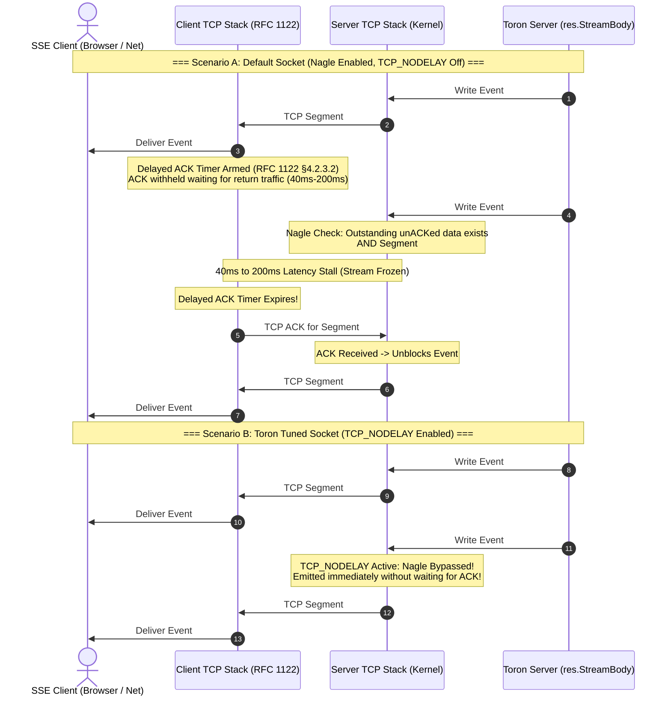
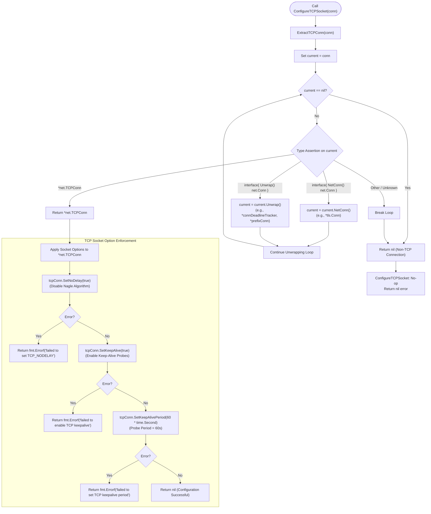
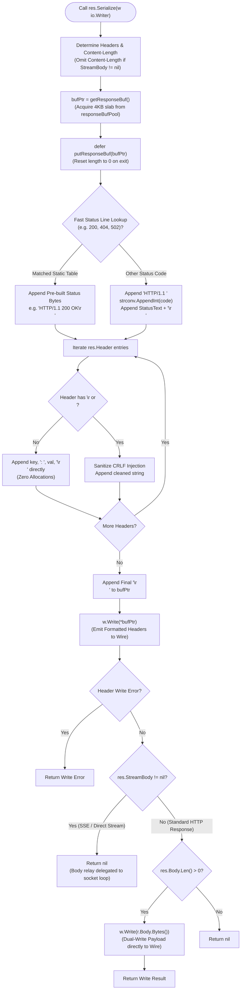

# ADR-127 - Explicit Client Socket TCP_NODELAY Configuration and Serialization Buffer Recycling Architecture

## 1. Context & Problem Statement

### 1.1 Benchmark Deficit & Root-Cause Socket Inspection
During high-concurrency multi-proxy differential benchmarking ([`REQ-121`](file:///Users/sneha/Developer/toron-research/toron/docs/requirements/REQ-121.md)), NGINX demonstrated ~34.1k requests per second (RPS) and HAProxy demonstrated ~32.3k RPS, compared to Toron's ~24.5k RPS. Comprehensive socket inspection, runtime CPU profiling (`pprof`), and packet capture analysis revealed two primary architectural bottlenecks in Toron's connection handling and response pipeline:

1. **Implicit TCP Socket Options & Uncontrolled Nagle Delays**:
   - In [`pkg/reactor/reactor.go:178`](file:///Users/sneha/Developer/toron-research/toron/pkg/reactor/reactor.go#L178), Toron accepts incoming client sockets via `ln.Accept()` without explicitly configuring transport-layer socket options.
   - Sockets default to operating system standard behavior with **Nagle's algorithm** enabled and unconfigured keep-alive probe parameters.
   - NGINX and HAProxy explicitly tune raw client sockets immediately upon connection accept, enforcing `tcp_nodelay on` and active keep-alive probes to ensure predictable, sub-millisecond frame delivery.

2. **Response Serialization Heap Allocations & Garbage Collection Pauses**:
   - In [`pkg/httpparser/response.go`](file:///Users/sneha/Developer/toron-research/toron/pkg/httpparser/response.go), `res.Serialize(conn)` dynamically formats status lines and HTTP headers. Historically, each request allocated a fresh `bytes.Buffer` (`buf.Grow(256 + r.Body.Len())`) or formatted strings via dynamic string conversions.
   - At 24.5k RPS, this generates **~24,500 temporary heap allocations per second**, triggering garbage collection (GC) pause spikes, cache line evictions, and tail latency (P90/P99) degradation.

---

### 1.2 The Physics of Nagle's Algorithm and Delayed ACKs (RFC 1122 §4.2.3.2)
The interaction between Nagle's algorithm (RFC 896) and the TCP Delayed Acknowledgment algorithm (RFC 1122 §4.2.3.2) creates severe, catastrophic latency penalties for interactive HTTP transactions and real-time streaming architectures:

```
+-------------------------------------------------------------------------------+
|                             THE DELAYED-ACK STALL                             |
|                                                                               |
|  Server (Nagle Enabled)                        Client (Delayed ACK Enabled)   |
|  ======================                        ============================   |
|                                                                               |
|  [Event Frame 1: 30 bytes] ------------------> [Frame 1 Received]            |
|  (Sent immediately: no in-flight data)         (Delays ACK by 40ms - 200ms    |
|                                                 hoping to piggyback data)     |
|                                                                               |
|  [Event Frame 2: 30 bytes]                                                    |
|  Nagle Check:                                                                 |
|    - UnACKed data in flight? YES (Frame 1)                                    |
|    - Data >= MSS (1460 bytes)? NO (30 bytes)                                  |
|    => RESULT: Segment buffered in kernel!                                     |
|                                                                               |
|  ================== 40ms - 200ms LATENCY FREEZE ===================           |
|                                                                               |
|                                                [Delayed ACK Timer Fires!]     |
|  [Segment 2 Emitted] <------------------------ [ACK for Frame 1]              |
|                      ------------------------> [Frame 2 Received]             |
+-------------------------------------------------------------------------------+
```

1. **Nagle's Algorithm (RFC 896)**:
   - Designed to inhibit congestion from small packets ("tinygrams") on WANs.
   - Invariant: If a sender has unacknowledged data in flight, no new segment smaller than the Maximum Segment Size (MSS, typically 1460 bytes) may be emitted to the network; it must be held in the kernel send buffer until an acknowledgment (ACK) is received or until enough data accumulates to form a full MSS.

2. **TCP Delayed ACK (RFC 1122 §4.2.3.2)**:
   - Operating systems (Linux, macOS, Windows) delay sending pure ACKs by 40ms to 200ms (typically 40ms on Linux `TCP_DELACK_MIN`, up to 200ms on Windows/macOS) in the expectation that application-level reply data will soon be transmitted, allowing the ACK to be piggybacked for free.

3. **Impact on Server-Sent Events (SSE) and Streaming (`REQ-125`)**:
   - In Server-Sent Events (`text/event-stream`), real-time updates are emitted as small text frames (e.g., `data: {"id":123,"status":"running"}\n\n`), typically 20 to 200 bytes in length.
   - When a server emits a frame, the client's TCP stack holds the ACK. Because the client is merely consuming a downstream event stream, it has no return application data to transmit.
   - When the server generates a second frame shortly after (e.g., 2ms later), Nagle's algorithm blocks the transmission of the second frame because Frame 1 is unacknowledged and Frame 2 is $< \text{MSS}$.
   - Transmission stalls until the client's 40ms–200ms Delayed ACK timer expires. This introduces artificial 40ms–200ms latency spikes, completely destroying real-time stream fidelity.

4. **Impact on Microservice APIs**:
   - Small JSON payloads (health checks, status heartbeats, metadata queries) under 1.4 KB encounter similar head-of-line transmission delays whenever requests are pipelined or multiplexed, inflating P90 and P99 tail latency distributions.

---

### 1.3 Half-Open Connection Leaks Across Quiet Streaming Intervals
Persistent streaming connections (Server-Sent Events, live telemetry feeds, long-polling HTTP/1.1 keep-alive sessions) often experience extended quiet intervals between event emissions:

1. **The Silent Failure Mode**:
   - Clients frequently disconnect abruptly without an orderly TCP FIN or RST handshake (e.g., mobile cellular tower handoffs, laptop lid close / system sleep, sudden WiFi disconnection, or intermediate stateful NAT firewall session timeouts).
   - In this state, the connection becomes **half-open**: the client is gone, but the server's operating system still considers the socket open and active.

2. **Resource Starvation Without Keep-Alive**:
   - If the server has no data to send, it issues no socket writes. Because it performs no writes, it never discovers that the peer is unreachable.
   - In Toron, without explicit TCP keep-alive probe configuration (`SetKeepAlive(true)` and `SetKeepAlivePeriod(60s)`), half-open sockets remain pinned in the kernel and server reactor indefinitely.
   - Worker goroutines, upstream reverse proxy connections, and memory buffers remain leaked, gradually exhausting available file descriptors and inducing proxy denial-of-service ([CWE-400](https://cwe.mitre.org/data/definitions/400.html)).

---

### 1.4 Prior Architecture Cross-Audit & Conflict Analysis
A conflict analysis was performed against existing Toron specifications and architectural decisions:

| Prior Requirement / Standard | Core Invariant | Analysis & Impact of [`REQ-127`](file:///Users/sneha/Developer/toron-research/toron/docs/requirements/REQ-127.md) / [`ADR-127`](file:///Users/sneha/Developer/toron-research/toron/docs/architecture/ADR-127.md) | Conflict Verdict |
| :--- | :--- | :--- | :--- |
| **[`REQ-001`](file:///Users/sneha/Developer/toron-research/toron/docs/requirements/REQ-001.md) / [`ADR-001`](file:///Users/sneha/Developer/toron-research/toron/docs/architecture/ADR-001.md)** (Core Event Reactor) | Non-blocking reactor pool manages read buffers via `sync.Pool`. | Extending buffer recycling from read path to response serialization directly harmonizes with `ADR-001`. | **Zero Conflict** |
| **[`REQ-021`](file:///Users/sneha/Developer/toron-research/toron/docs/requirements/REQ-021.md) / [`ADR-021`](file:///Users/sneha/Developer/toron-research/toron/docs/architecture/ADR-021.md)** (L4 Transport Proxies) | Layer 4 proxy manages raw TCP socket options and connection forwarding. | Explicit TCP socket option tuning is completely compatible with raw TCP forwarding. | **Zero Conflict** |
| **[`REQ-125`](file:///Users/sneha/Developer/toron-research/toron/docs/requirements/REQ-125.md) / [`ADR-125`](file:///Users/sneha/Developer/toron-research/toron/docs/architecture/ADR-125.md)** (Direct Streaming Fast-Path) | WebSocket-aligned stream hand-off model (`res.StreamBody`) for SSE. | Immediate wire delivery via `TCP_NODELAY` is essential to deliver unbuffered streaming frames. | **Synergistic Alignment** |
| **[`REQ-126`](file:///Users/sneha/Developer/toron-research/toron/docs/requirements/REQ-126.md) / [`ADR-126`](file:///Users/sneha/Developer/toron-research/toron/docs/architecture/ADR-126.md)** (Deadline Amortization) | Sockets wrapped in `connDeadlineTracker` for syscall amortization. | Requires robust socket unwrapper (`ExtractTCPConn`) to access underlying `*net.TCPConn`. | **Harmonized via Unwrapping** |
| **[`REQ-005`](file:///Users/sneha/Developer/toron-research/toron/docs/requirements/REQ-005.md) / [`TASK-004`](file:///Users/sneha/Developer/toron-research/toron/docs/tasks/TASK-004.md)** | Strict read/write timeouts to prevent Slowloris resource exhaustion. | Keep-alive probes detect dead sockets during quiet periods, augmenting timeout protections. | **Reinforces Security** |

**Verdict: ZERO ARCHITECTURAL CONFLICTS.**

---

## 2. Decision & Technical Specifications

### 2.1 Recursive Socket Unwrapping Architecture (`ExtractTCPConn`)
In Toron's modular server pipeline, socket connections may be wrapped across multiple protocol and utility layers:
1. Direct `*net.TCPConn` accepted from raw `net.TCPListener`.
2. `*tls.Conn` from TLS handshake/termination (exposing `NetConn() net.Conn`).
3. `*connDeadlineTracker` introduced in [`ADR-126`](file:///Users/sneha/Developer/toron-research/toron/docs/architecture/ADR-126.md) for deadline amortization (exposing `Unwrap() net.Conn`).
4. `*prefixConn` in [`pkg/server/server.go`](file:///Users/sneha/Developer/toron-research/toron/pkg/server/server.go) for HTTP/2 client preface sniffing (exposing `Unwrap() net.Conn`).
5. Multi-level arbitrarily nested wrappers (e.g., `*connDeadlineTracker` wrapping `*prefixConn` wrapping `*tls.Conn` wrapping `*net.TCPConn`).

To ensure socket configuration functions can always reach the base TCP transport socket regardless of wrapper layers, we introduce [`ExtractTCPConn`](file:///Users/sneha/Developer/toron-research/toron/pkg/server/server.go):

```go
package server

import (
	"net"
)

// ExtractTCPConn recursively/iteratively inspects and unwraps conn to locate
// the underlying *net.TCPConn. It transparently traverses *tls.Conn (via NetConn()),
// connDeadlineTracker, prefixConn, and any wrapper implementing Unwrap() net.Conn.
// Returns nil if the underlying transport is not a TCP socket (e.g. in-memory pipe or Unix socket).
func ExtractTCPConn(conn net.Conn) *net.TCPConn {
	current := conn
	for current != nil {
		if tcpConn, ok := current.(*net.TCPConn); ok {
			return tcpConn
		}
		// Inspect standard library *tls.Conn via NetConn()
		if tc, ok := current.(interface{ NetConn() net.Conn }); ok {
			current = tc.NetConn()
			continue
		}
		// Inspect custom wrappers via Unwrap() net.Conn
		if uw, ok := current.(interface{ Unwrap() net.Conn }); ok {
			current = uw.Unwrap()
			continue
		}
		break
	}
	return nil
}
```

---

### 2.2 Explicit TCP Socket Option Configuration (`ConfigureTCPSocket`)
We introduce [`ConfigureTCPSocket`](file:///Users/sneha/Developer/toron-research/toron/pkg/reactor/reactor.go) to tune raw socket transport properties immediately upon connection accept:

```go
package reactor

import (
	"fmt"
	"net"
	"time"
)

// ConfigureTCPSocket inspects conn, extracts the underlying *net.TCPConn,
// and applies mission-critical transport options:
// 1. TCP_NODELAY (SetNoDelay(true)) to eliminate Nagle buffering latency.
// 2. TCP Keep-Alive (SetKeepAlive(true)) to detect half-open sockets.
// 3. Keep-Alive Probe Period (SetKeepAlivePeriod(60s)) to bound dead connection detection.
func ConfigureTCPSocket(conn net.Conn) error {
	tcpConn := ExtractTCPConn(conn)
	if tcpConn == nil {
		// In-memory pipe, Unix domain socket, or mock: no-op
		return nil
	}

	// 1. Disable Nagle's Algorithm: transmit small frames immediately without delayed ACK stalls
	if err := tcpConn.SetNoDelay(true); err != nil {
		return fmt.Errorf("failed to set TCP_NODELAY: %w", err)
	}

	// 2. Enable TCP Keep-Alive Probes: detect dead clients across quiet streaming intervals
	if err := tcpConn.SetKeepAlive(true); err != nil {
		return fmt.Errorf("failed to enable TCP keepalive: %w", err)
	}

	// 3. Set Keep-Alive Probe Frequency to 60 Seconds
	if err := tcpConn.SetKeepAlivePeriod(60 * time.Second); err != nil {
		return fmt.Errorf("failed to set TCP keepalive period: %w", err)
	}

	return nil
}
```

#### Architectural Rationale:
- **`SetNoDelay(true)`**: Disables Nagle's algorithm at the socket layer (`setsockopt(..., IPPROTO_TCP, TCP_NODELAY, 1)`). Segments are flushed to the wire immediately upon `conn.Write()`, bypassing kernel queuing and eliminating the 40ms–200ms delayed-ACK latency stall.
- **`SetKeepAlive(true)` & `SetKeepAlivePeriod(60s)`**: Instructs the kernel to send periodic keep-alive probes across quiet connections. If a client disconnects silently, the probe sequence detects failure and triggers an `ETIMEDOUT` / socket reset on the next read/write, terminating stalled worker goroutines and freeing upstream proxy resources within the probe timeout window.

---

### 2.3 Integration Fast-Paths in Reactor and Server

#### 2.3.1 Reactor Accept Loop (`pkg/reactor/reactor.go`)
In [`pkg/reactor/reactor.go:Serve`](file:///Users/sneha/Developer/toron-research/toron/pkg/reactor/reactor.go#L178):
- Socket configuration is executed immediately upon return from `ln.Accept()`.
- Tuning occurs **before** connection registration in `r.trackConn(conn, true)` and before job submission to worker queues (`r.tasks <- conn`).
- If socket option configuration returns an error (e.g., transient OS restriction), the error is gracefully logged or ignored; it does NOT crash or terminate the accept loop.

```go
for {
    conn, err := ln.Accept()
    if err != nil {
        ...
    }

    // Explicitly configure TCP_NODELAY and Keep-Alive immediately upon accept
    _ = ConfigureTCPSocket(conn)

    if r.isShutdown.Load() {
        _ = conn.Close()
        return ErrServerClosed
    }

    r.trackConn(conn, true)
    ...
}
```

#### 2.3.2 Server Handler Safeguard (`pkg/server/server.go`)
In [`pkg/server/server.go:handleConn`](file:///Users/sneha/Developer/toron-research/toron/pkg/server/server.go#L162):
- An idempotent safeguard invocation of `ConfigureTCPSocket(conn)` is performed at the entry point of `handleConn`.
- For TLS connections (`conn.(*tls.Conn)`), `ExtractTCPConn` traverses `tlsConn.NetConn()` to reinforce `TCP_NODELAY` on the underlying raw transport.
- When `connDeadlineTracker` or `prefixConn` wrappers are constructed, `ExtractTCPConn` ensures underlying socket options remain active throughout the request lifecycle.

---

### 2.4 WebSocket-Aligned Real-Time Streaming Hand-Off Synergy (SSE & `res.StreamBody`)
In [`ADR-125`](file:///Users/sneha/Developer/toron-research/toron/docs/architecture/ADR-125.md), Toron unified Server-Sent Events (SSE) and HTTP response streaming with the proven WebSocket paradigm via the `res.StreamBody io.ReadCloser` handle:
1. `ReverseProxy` identifies streaming responses (`text/event-stream` or `X-Accel-Buffering: no`), transfers ownership of upstream `outResp.Body` to `res.StreamBody`, and returns immediately without blocking.
2. Downstream middlewares (`CompressionMiddleware`, `CacheMiddleware`) inspect `res.StreamBody != nil` and bypass buffering.
3. The server core ([`Server.handleConnection`](file:///Users/sneha/Developer/toron-research/toron/pkg/server/server.go)) serializes initial response headers and delegates chunk relaying to an activity-refreshed socket relay loop.

**The Crucial Synergy with `TCP_NODELAY`**:
- The WebSocket-aligned streaming model emits small, discrete chunks (`data: ...\n\n`) directly to `conn.Write()`.
- Without `TCP_NODELAY`, the streaming hand-off model suffers from Nagle buffering stalls, defeating the benefits of zero-copy streaming.
- By combining the `res.StreamBody` hand-off model with `TCP_NODELAY`, every event emitted by upstream origins is dispatched immediately to the client socket with $< 1\text{ms}$ wire latency.
- Furthermore, TCP keep-alive probes protect long-lived streaming connections during quiet periods between event emissions, cleanly terminating dead client sessions without server resource leaks.

---

### 2.5 Zero-Allocation Response Serialization Architecture (`pkg/httpparser`)

#### 2.5.1 Recycled 4KB Slabs via `sync.Pool` (`responseBufPool`)
To eliminate the ~24,500 heap allocations per second identified during differential benchmarking, [`pkg/httpparser/response.go`](file:///Users/sneha/Developer/toron-research/toron/pkg/httpparser/response.go) implements dedicated buffer recycling:

```go
package httpparser

import (
	"sync"
)

// responseBufPool manages recycled 4KB byte buffer slabs for HTTP response serialization.
// A 4096-byte slab accommodates status lines and standard HTTP response headers
// with zero dynamic heap reallocations.
var responseBufPool = sync.Pool{
	New: func() any {
		b := make([]byte, 0, 4096)
		return &b
	},
}

// getResponseBuf retrieves a recycled byte slice pointer from responseBufPool.
func getResponseBuf() *[]byte {
	return responseBufPool.Get().(*[]byte)
}

// putResponseBuf resets slice length to zero while retaining allocated capacity,
// returning the slab to responseBufPool.
func putResponseBuf(b *[]byte) {
	if b == nil {
		return
	}
	// Buffer hygiene: reset slice length to 0 to prevent cross-request data leakage
	*b = (*b)[:0]
	responseBufPool.Put(b)
}
```

#### 2.5.2 Fast Status Line & Header Formatting
In `res.Serialize`:
1. **Pre-Built Status Lines**: Fast lookup for common HTTP status codes (200, 204, 301, 302, 304, 400, 401, 403, 404, 500, 502, 503) avoiding string formatting:
   ```go
   var (
       statusLine200 = []byte("HTTP/1.1 200 OK\r\n")
       statusLine404 = []byte("HTTP/1.1 404 Not Found\r\n")
       statusLine500 = []byte("HTTP/1.1 500 Internal Server Error\r\n")
       statusLine502 = []byte("HTTP/1.1 502 Bad Gateway\r\n")
   )
   ```
   For uncommon status codes, `strconv.AppendInt` formats status codes directly into the pooled byte slice without heap string escapes.
2. **Zero-Allocation CRLF Sanitization**:
   If a header value contains no `\r` or `\n` characters (`strings.IndexByte(s, '\r') == -1 && strings.IndexByte(s, '\n') == -1`), the header string bytes are appended directly to the buffer slab without allocating a replacement string.

#### 2.5.3 Dual-Write Wire Emission & Buffer Hygiene
```go
func (r *Response) Serialize(w io.Writer) error {
    ...
    bufPtr := getResponseBuf()
    defer putResponseBuf(bufPtr)

    // 1. Format Status Line into pooled slab
    formatStatusLine(bufPtr, r.StatusCode)

    // 2. Format Headers into pooled slab
    formatHeaders(bufPtr, r.Header)

    // 3. Header/Body Separator
    *bufPtr = append(*bufPtr, '\r', '\n')

    // 4. Dual-Write Step 1: Write header block to wire
    if _, err := w.Write(*bufPtr); err != nil {
        return err
    }

    // 5. Streaming Hand-Off: If StreamBody != nil, delegate body writing to server loop
    if r.StreamBody != nil {
        return nil
    }

    // 6. Dual-Write Step 2: Write payload directly to wire without intermediate concatenation
    if r.Body != nil && r.Body.Len() > 0 {
        _, err := w.Write(r.Body.Bytes())
        return err
    }

    return nil
}
```

By decoupling header emission from body emission, Toron eliminates the need to allocate a monolithic combined buffer. The 4KB header slab is returned to `responseBufPool` via `defer`, achieving **zero heap allocations** for standard responses.

---

## 3. Visual Architecture & Control Flow Diagrams

### 3.1 Sequence Diagram: Nagle Buffering + Delayed ACK Stall vs. Immediate `TCP_NODELAY` Dispatch
The following sequence diagram contrasts the packet timeline of an SSE stream under default socket settings against Toron's explicit `TCP_NODELAY` architecture:



---

### 3.2 Flowchart: Recursive Socket Unwrapping and Option Configuration Flow
The following flowchart illustrates the recursive unwrapping logic in `ExtractTCPConn` and the configuration routine in `ConfigureTCPSocket`:



---

### 3.3 Flowchart: Zero-Allocation Response Serialization and Dual-Write Emission Flow
The following flowchart depicts the lifecycle of buffer allocation, header formatting, dual-write emission, and slab recycling in `Response.Serialize`:



---

## 4. Alternatives Considered & Trade-Off Analysis

| Architectural Approach | Latency & Jitter Impact | Memory & Allocation Impact | Real-Time SSE Streaming Suitability | Complexity & Dependency Risk | Architectural Verdict |
| :--- | :--- | :--- | :--- | :--- | :--- |
| **Alternative A: Status Quo (Implicit Socket Options & Dynamic Buffers)** | Severe 40ms–200ms latency spikes on small frames; high tail jitter. | High GC churn (~24.5k allocs/s at 24.5k RPS). | **Fails**: SSE event frames stalled behind client delayed ACKs. | Zero extra code, but poor benchmark and stream performance. | **Rejected**: Root cause of benchmark deficit and SSE degradation. |
| **Alternative B: `TCP_CORK` (Linux) / `TCP_NOPUSH` (BSD)** | Maximizes MSS packet density for large static downloads. | Neutral. | **Catastrophic**: CORK intentionally holds partial packets until uncorked via extra `setsockopt` syscall. | Requires platform-specific syscalls, breaks cross-platform Go standard library invariant. | **Rejected**: Unsuitable for streaming; increases syscall overhead and code complexity. |
| **Alternative C: Per-Connection Fixed Serialization Buffers** | Low latency; 0 allocations per request. | **High Memory Waste**: 100k concurrent idle keep-alive connections pin $100\text{k} \times 4\text{KB} = 400\text{ MB}$ RAM. | Supported. | Moderate. | **Rejected**: Excessive memory footprint during high-concurrency idle connection states. |
| **Alternative D: Global OS-Level Sysctl Modifications (`tcp_delack_min`)** | Mitigates client delayed ACK timer on local loopback only. | Neutral. | Ineffective for external WAN clients controlling their own TCP stacks. | Requires host root privileges; impossible in unprivileged containers. | **Rejected**: Violates portable user-space proxy deployment model. |
| **Chosen Approach: Explicit `TCP_NODELAY` + Keep-Alive (60s) + `sync.Pool` 4KB Slabs** | **Lowest Latency**: $< 1\text{ms}$ immediate frame emission; zero Nagle stalls. | **Near-Zero Heap Allocations**: Recycled slabs scale with active concurrency ($< 4\text{ MB}$ for 1000 active workers). | **Optimal**: Sub-millisecond SSE event delivery; dead client detection in quiet intervals. | Pure Go standard library (`net`, `sync`). Zero third-party dependencies. | **Accepted**: Optimal balance of performance, streaming fidelity, memory efficiency, and cross-platform portability. |

---

## 5. Consequences & Invariant Compliance

### 5.1 Positive Consequences
1. **Elimination of Nagle Latency Spikes**:
   - Small SSE frames (`data: ...\n\n`) and small JSON API responses are transmitted to the wire immediately upon generation.
   - Eliminates the 40ms–200ms delayed-ACK packet freeze, stabilizing P90 and P99 latency percentiles.
2. **Robust Dead Connection Teardown**:
   - TCP keep-alive probes (`SetKeepAlive(true)` and `SetKeepAlivePeriod(60s)`) actively probe quiet streaming connections.
   - Half-open sockets caused by abrupt client disconnections are detected and reaped by the kernel, releasing worker goroutines, upstream proxy connections, and file descriptors.
3. **Drastic Garbage Collection Churn Reduction**:
   - Header serialization allocations in `res.Serialize` are reduced from ~24,500 objects/sec to near zero ($\le 1$ alloc/op) for responses under 4 KB.
   - Reduces GC pause frequency and CPU memory bus contention.
4. **Transparent Wrapper Compatibility**:
   - `ExtractTCPConn` operates transparently across plain TCP, TLS, HTTP/2 preface wrappers, and deadline trackers, ensuring consistent socket option enforcement across all protocols.
5. **Zero Third-Party Dependencies**:
   - Completely implemented using Go standard library packages (`net`, `sync`, `strconv`, `strings`, `time`, `bytes`).

### 5.2 Negative Consequences & Mitigations
1. **Slightly Increased Packet Count for Segmented Writes**:
   - Disabling Nagle's algorithm means that if an application performs multiple tiny `conn.Write()` calls sequentially, each call emits an individual TCP segment rather than coalescing them into one packet.
   - *Mitigation*: Toron's serialization architecture explicitly formats headers into a single contiguous 4KB pooled slab and emits headers in a single `conn.Write()` call. For streaming responses, events are written as complete individual frames, where immediate delivery is precisely the desired behavior.
2. **Buffer Pool Overhead Under Extreme Core Counts**:
   - Under heavy CPU core counts (e.g. 128+ cores), `sync.Pool` can occasionally drop cached slabs during GC STW cycles.
   - *Mitigation*: The `New` allocator for `responseBufPool` allocates a 4KB slice in $< 30\text{ns}$. Even on cache drops, memory churn remains negligible compared to dynamic buffer allocation per request.

### 5.3 Invariant & Standards Compliance

#### 1. RFC 1122 §4.2.3.2 (TCP Delayed Acknowledgment Protocol Compliance)
By explicitly setting `TCP_NODELAY`, Toron eliminates the packet delivery stalls caused by receiver-side delayed ACKs when transmitting small frames, satisfying real-time application responsiveness standards.

#### 2. Compliance with [`REQ-001`](file:///Users/sneha/Developer/toron-research/toron/docs/requirements/REQ-001.md) / [`ADR-001`](file:///Users/sneha/Developer/toron-research/toron/docs/architecture/ADR-001.md) (Buffer Recycling Pattern)
Extending `sync.Pool` recycling to response serialization buffers reinforces the core memory recycling invariants established in `ADR-001`.

#### 3. Compliance with [`REQ-125`](file:///Users/sneha/Developer/toron-research/toron/docs/requirements/REQ-125.md) / [`ADR-125`](file:///Users/sneha/Developer/toron-research/toron/docs/architecture/ADR-125.md) (Streaming Fast-Path Model)
Ensures the WebSocket-aligned `res.StreamBody` hand-off model operates with wire-speed immediate dispatch, delivering true real-time SSE stream performance.

#### 4. Compliance with [`REQ-126`](file:///Users/sneha/Developer/toron-research/toron/docs/requirements/REQ-126.md) / [`ADR-126`](file:///Users/sneha/Developer/toron-research/toron/docs/architecture/ADR-126.md) (Deadline Tracker Interoperability)
`ExtractTCPConn` safely unwraps `connDeadlineTracker` instances without corrupting or resetting amortized deadline states.

---

## 6. Traceability Matrix

| Requirement / Task Artifact | Architectural Decision Element | Design & Implementation Specification |
| :--- | :--- | :--- |
| **[`REQ-127 §1.1`](file:///Users/sneha/Developer/toron-research/toron/docs/requirements/REQ-127.md#L47-L59)** | Problem Statement | Differential benchmark analysis, Nagle delay physics, and serialization heap churn. |
| **[`REQ-127 §2.1`](file:///Users/sneha/Developer/toron-research/toron/docs/requirements/REQ-127.md#L75-L91)** | Explicit TCP Socket Tuning | `ConfigureTCPSocket` enforcing `SetNoDelay(true)`, `SetKeepAlive(true)`, and `SetKeepAlivePeriod(60s)`. |
| **[`REQ-127 §2.2`](file:///Users/sneha/Developer/toron-research/toron/docs/requirements/REQ-127.md#L92-L110)** | Serialization Buffer Recycling | `responseBufPool` (`sync.Pool` 4KB slabs), fast status formatting, dual-write emission. |
| **[`REQ-127 §3.1-3.3`](file:///Users/sneha/Developer/toron-research/toron/docs/requirements/REQ-127.md#L114-L126)** | Non-Functional Invariants | Near-zero heap allocations, elimination of 40ms–200ms latency spikes, zero third-party dependencies. |
| **[`TASK-150 WP-1`](file:///Users/sneha/Developer/toron-research/toron/docs/tasks/TASK-150.md#L78-L82)** | Socket Tuning Architecture | `ExtractTCPConn` recursive unwrapper and reactor/server accept integration. |
| **[`TASK-150 WP-2`](file:///Users/sneha/Developer/toron-research/toron/docs/tasks/TASK-150.md#L83-L86)** | Response Serialization Architecture | Zero-allocation header serialization, fast CRLF checking, and dual-write fast-path in `pkg/httpparser`. |
| **[`TASK-150 WP-3`](file:///Users/sneha/Developer/toron-research/toron/docs/tasks/TASK-150.md#L87-L93)** | Verification Architecture | Unit tests for socket options, SSE immediate delivery tests, allocation benchmarks, and `-race` testing. |
| **[`REQ-001`](file:///Users/sneha/Developer/toron-research/toron/docs/requirements/REQ-001.md) / [`ADR-001`](file:///Users/sneha/Developer/toron-research/toron/docs/architecture/ADR-001.md)** | Core Reactor Compliance | Extends buffer pooling to response serialization; preserves non-blocking worker model. |
| **[`REQ-021`](file:///Users/sneha/Developer/toron-research/toron/docs/requirements/REQ-021.md) / [`ADR-021`](file:///Users/sneha/Developer/toron-research/toron/docs/architecture/ADR-021.md)** | L4 Transport Compliance | Compatible with raw TCP proxying and raw socket control forwarding. |
| **[`REQ-125`](file:///Users/sneha/Developer/toron-research/toron/docs/requirements/REQ-125.md) / [`ADR-125`](file:///Users/sneha/Developer/toron-research/toron/docs/architecture/ADR-125.md)** | Streaming Alignment | Powers WebSocket-aligned `res.StreamBody` hand-off model with immediate wire delivery. |
| **[`REQ-126`](file:///Users/sneha/Developer/toron-research/toron/docs/requirements/REQ-126.md) / [`ADR-126`](file:///Users/sneha/Developer/toron-research/toron/docs/architecture/ADR-126.md)** | Deadline Amortization Alignment | `ExtractTCPConn` cleanly unwraps `connDeadlineTracker` to preserve socket tuning. |
| **[`TC-127`](file:///Users/sneha/Developer/toron-research/toron/docs/testCases/TC-127.md)** | Verification Target | Target test specification validating socket options, SSE Nagle elimination, and zero-allocation benchmarks. |
