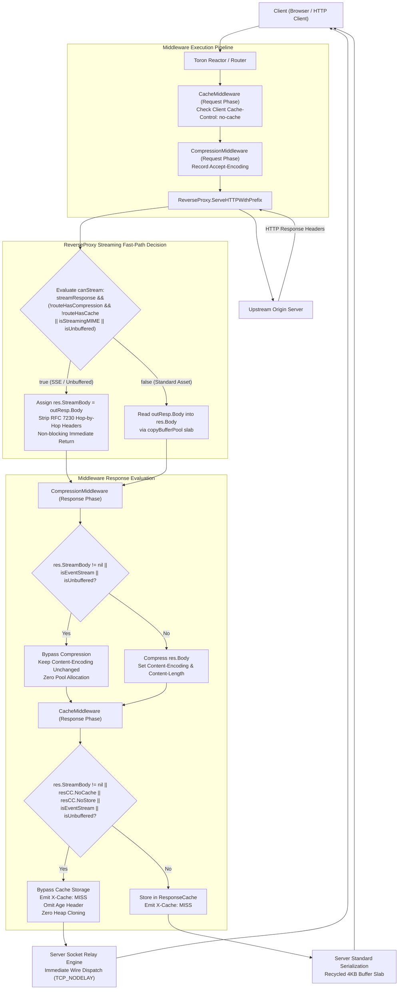
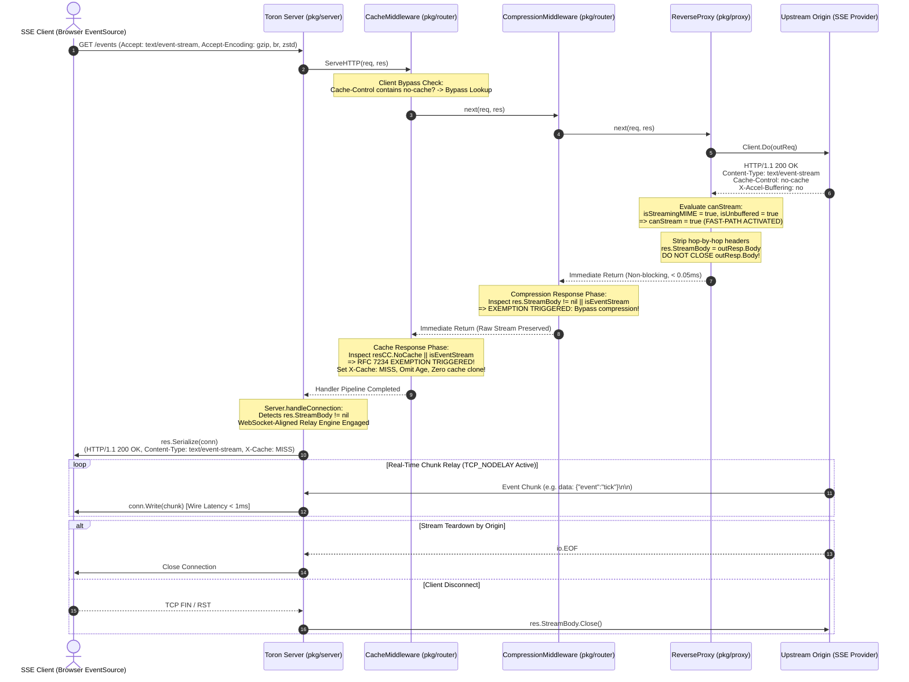

# ADR-128 - Streaming Response Middleware Exemptions and RFC 7234 Origin Cache-Control Enforcement Architecture

## 1. Context & Problem Statement

### 1.1 Architectural Background & Pipeline Overview
Toron is designed as an enterprise-grade, ultra-high-throughput, zero-allocation Layer 4 and Layer 7 reverse proxy. In modern microservice and distributed systems, HTTP response streaming—specifically **Server-Sent Events (SSE, `text/event-stream`)**, live telemetry feeds, real-time AI token streaming, and dynamic chunked HTTP/1.1 transfer streams—represents a mission-critical workload.

Under [`REQ-125`](file:///Users/sneha/Developer/toron-research/toron/docs/requirements/REQ-125.md) and [`ADR-125`](file:///Users/sneha/Developer/toron-research/toron/docs/architecture/ADR-125.md), Toron established a conditional direct socket streaming fast-path using a **WebSocket-aligned stream hand-off model (`res.StreamBody io.ReadCloser`)**. However, comprehensive architectural audits and streaming performance benchmarks revealed two severe systemic defects within Toron's middleware pipeline that corrupted real-time streaming connections and dynamic HTTP endpoints:

1. **Root Cause 2: In-Memory Cache Ignores Origin `Cache-Control: no-cache` and Captures Streaming Responses (RFC 7234 §5.2.2.2 Violation)**.
2. **Root Cause 3: Transparent Compression Traps `text/event-stream` via Wildcard `"text/"`**.
3. **Proxy Fast-Path Disqualification**: Reverse proxy `canStream` logic disqualified streaming responses on routes where compression or caching were globally enabled.

---

### 1.2 Root Cause 2 Analysis: In-Memory Cache Violates RFC 7234 §5.2.2.2 and Freezes SSE Feeds
In [`pkg/router/cache.go:250-254`](file:///Users/sneha/Developer/toron-research/toron/pkg/router/cache.go#L250-L254), `CacheMiddleware` inspects response directives following downstream handler execution:

```go
// Evaluate response Cache-Control headers
resCC := ParseCacheControl(res.Header.Get("Cache-Control"))
if resCC.NoStore || resCC.Private {
    return
}
```

#### 1.2.1 The RFC 7234 §5.2.2.2 Violation
- While `resCC.NoStore` and `resCC.Private` were evaluated, **`resCC.NoCache` was completely ignored**.
- According to **RFC 7234 §5.2.2.2**:
  > *"The `no-cache` response directive indicates that the response MUST NOT be used to satisfy a subsequent request without successful validation on the origin server."*
- Toron's in-memory response cache ([`ResponseCache`](file:///Users/sneha/Developer/toron-research/toron/pkg/router/cache.go#L80)) operates as a high-speed shared proxy cache. Toron does **not** implement conditional origin revalidation (i.e. issuing conditional `GET` requests with `If-None-Match` or `If-Modified-Since` headers to upstream servers upon downstream cache lookup).
- Under RFC 7234, in the absence of a conditional revalidation engine, a shared cache must treat `no-cache` as an absolute prohibition against cache admission and reuse.

#### 1.2.2 The 60-Second Default TTL Fallback and Stream Freezing
When an upstream origin emits a dynamic response or Server-Sent Events stream, it emits standard streaming headers:
```http
HTTP/1.1 200 OK
Content-Type: text/event-stream
Cache-Control: no-cache
Connection: keep-alive
```
Because `max-age` is absent, Toron's caching engine evaluated:
```go
ttl := cfg.DefaultTTL // Default: 60 seconds
if resCC.MaxAge != nil {
    ttl = *resCC.MaxAge
}
```
Toron computed `ttl = 60s`, allocated a cache entry, cloned the body snapshot via `cachedBody := make([]byte, res.Body.Len())`, and stored it into `cache.Set(cacheKey, entry)`.

```
+-----------------------------------------------------------------------------------------+
|                        ROOT CAUSE 2: SSE CACHE FREEZING DEFECT                          |
|                                                                                         |
|  Client 1 (Connects)  --->  Toron Proxy  --->  Upstream Origin (SSE Feed)               |
|                             (Captures initial 2 events into ResponseCache)              |
|                                                                                         |
|  Client 2 (Connects)  --->  Toron Proxy (Cache Lookup)                                  |
|                             [CACHE HIT: key = "GET:api.example.com:/events"]            |
|                             Emits: X-Cache: HIT, Age: 12                                |
|                             Payload: Frozen static snapshot (2 events only)             |
|                             RESULT: Stream closed! Real-time updates dead!              |
+-----------------------------------------------------------------------------------------+
```

Any subsequent client connecting to the streaming endpoint received a static, dead snapshot with `X-Cache: HIT` and `Age: N`. The client never received live updates, resulting in severe real-time feed corruption and Web Cache Deception ([CWE-524](https://cwe.mitre.org/data/definitions/524.html)).

---

### 1.3 Root Cause 3 Analysis: Transparent Compression Buffers `text/event-stream` via Wildcard `"text/"`
In [`pkg/router/compression.go:42`](file:///Users/sneha/Developer/toron-research/toron/pkg/router/compression.go#L42), `DefaultCompressionConfig.Types` includes `"text/"` to compress HTML, plain text, and CSS assets:

```go
var DefaultCompressionConfig = CompressionConfig{
    ...
    Types: []string{
        "text/",
        "application/json",
        "application/javascript",
        ...
    },
}
```

In `isMIMECompressible(contentType, allowedTypes)` ([`pkg/router/compression.go:343`](file:///Users/sneha/Developer/toron-research/toron/pkg/router/compression.go#L343)):
```go
for _, t := range allowedTypes {
    if strings.HasSuffix(t, "*") || strings.HasSuffix(t, "/") {
        prefix := strings.TrimSuffix(strings.TrimSuffix(t, "*"), "/")
        if strings.HasPrefix(ct, prefix) {
            return true
        }
    }
}
```
Because `strings.HasPrefix("text/event-stream", "text")` evaluates to `true`, **`text/event-stream` was matched as a compressible MIME type**.

#### 1.3.1 The Event Starvation Disaster
Standard web browsers and HTTP clients automatically transmit `Accept-Encoding: gzip, deflate, br, zstd` on all requests. When an SSE stream was proxied:
1. `CompressionMiddleware` intercepted downstream execution.
2. It acquired a compressor writer (Zstd, Brotli, Gzip, or Deflate) from the buffer pool.
3. The compressor writer buffered streaming chunks into an in-memory accumulator, awaiting stream termination to compute compression frames, checksums, and update `Content-Length`.
4. The client received **zero events** while the stream remained open. Only upon connection termination or timeout did the middleware flush the compressed block, completely defeating real-time communication.
5. Upstream directives requesting unbuffered streaming—specifically `X-Accel-Buffering: no`—were completely ignored.

---

### 1.4 Proxy Fast-Path Blocking (`canStream` Disqualification)
In [`pkg/proxy/proxy.go:1105`](file:///Users/sneha/Developer/toron-research/toron/pkg/proxy/proxy.go#L1105), `ReverseProxy` evaluated streaming eligibility:
```go
canStream := p.streamResponse && (!p.routeHasCompression && !p.routeHasCache)
```
If a route configured compression or caching globally (e.g. for a mixed API prefix `/api/v1/*`), `canStream` evaluated to `false` for **all** responses on that route. Consequently, SSE responses were forced into the buffered fallback path:
```go
bufPtr := httpparser.GetCopyBuffer()
_, _ = io.CopyBuffer(res.Body, outResp.Body, *bufPtr)
httpparser.PutCopyBuffer(bufPtr)
```
`io.CopyBuffer` blocked until the upstream stream closed, copying the infinite stream into `res.Body` until memory was exhausted ([CWE-400](https://cwe.mitre.org/data/definitions/400.html)).

---

### 1.5 Prior Architecture Cross-Audit & Conflict Analysis
A comprehensive cross-audit against existing Toron specifications and architectural decisions was conducted:

| Prior Specification / Standard | Core Architectural Invariant | Impact & Harmonization of REQ-128 / ADR-128 | Conflict Verdict |
| :--- | :--- | :--- | :--- |
| **[`REQ-017`](file:///Users/sneha/Developer/toron-research/toron/docs/requirements/REQ-017.md) / [`REQ-034`](file:///Users/sneha/Developer/toron-research/toron/docs/requirements/REQ-034.md) / [`ADR-029`](file:///Users/sneha/Developer/toron-research/toron/docs/architecture/ADR-029.md)** (Transparent Compression) | Compresses static assets & JSON; excludes `101 Switching Protocols` & `UpgradedConn`. | Exempting `text/event-stream` and `X-Accel-Buffering: no` directly upholds ADR-029's core principle of preserving streaming semantics. | **Zero Conflict** |
| **[`REQ-019`](file:///Users/sneha/Developer/toron-research/toron/docs/requirements/REQ-019.md) / [`REQ-035`](file:///Users/sneha/Developer/toron-research/toron/docs/requirements/REQ-035.md) / [`ADR-030`](file:///Users/sneha/Developer/toron-research/toron/docs/architecture/ADR-030.md)** (In-Memory Caching) | Mandates strict compliance with RFC 7234 specifications. | Omitting `no-cache` on response evaluation violated ADR-030. Enforcing `no-cache` and streaming exemptions fulfills ADR-030. | **Zero Conflict** |
| **[`REQ-125`](file:///Users/sneha/Developer/toron-research/toron/docs/requirements/REQ-125.md) / [`ADR-125`](file:///Users/sneha/Developer/toron-research/toron/docs/architecture/ADR-125.md)** (Direct Streaming Fast-Path) | WebSocket-aligned hand-off (`res.StreamBody`) for unbuffered streams. | Establishes that `text/event-stream` and `X-Accel-Buffering: no` unconditionally bypass middleware, enabling `canStream = true`. | **Synergistic Alignment** |
| **[`REQ-127`](file:///Users/sneha/Developer/toron-research/toron/docs/requirements/REQ-127.md) / [`ADR-127`](file:///Users/sneha/Developer/toron-research/toron/docs/architecture/ADR-127.md)** (TCP_NODELAY & Buffer Recycling) | Eliminates Nagle buffering delays; recycles serialization buffers via `sync.Pool`. | Ensures unbuffered streaming chunks are flushed to the wire immediately upon generation with $< 1\text{ms}$ latency. | **Synergistic Alignment** |

**Verdict: ZERO ARCHITECTURAL CONFLICTS.**

---

## 2. Architecture Decisions & High-Level Design

### 2.1 Decision 1: RFC 7234 §5.2.2.2 Compliant Response Caching Guard (`pkg/router/cache.go`)
We enforce strict RFC 7234 §5.2.2.2 compliance and streaming response immunity in [`pkg/router/cache.go`](file:///Users/sneha/Developer/toron-research/toron/pkg/router/cache.go):

1. **Unconditional Cache Exclusion**:
   A response must **never** be admitted to `ResponseCache` if any of the following conditions evaluate to `true`:
   - `resCC.NoStore == true`
   - `resCC.NoCache == true` (RFC 7234 §5.2.2.2 Origin Directive)
   - `resCC.Private == true`
   - `isEventStream == true` (`Content-Type` starts with `text/event-stream`, case-insensitive)
   - `isUnbuffered == true` (`X-Accel-Buffering` equals `no`, case-insensitive)
   - `res.StreamBody != nil` (Active WebSocket-aligned stream hand-off)
   - `res.UpgradedConn != nil` or `res.StatusCode == 101` (WebSocket / TCP tunnel)

2. **Header Semantics on Cache Bypass**:
   - `X-Cache: MISS` is emitted in downstream response headers.
   - The `Age` header is **strictly omitted**.
   - Zero dynamic heap memory allocations or buffer clones (`cache.Set` is never called).

3. **Client Request Cache Bypass Preservation**:
   - Client requests with `Cache-Control: no-cache`, `Pragma: no-cache`, or `Cache-Control: max-age=0` continue to bypass cache lookups.

---

### 2.2 Decision 2: Streaming MIME and Upstream Unbuffered Compression Exemption (`pkg/router/compression.go`)
We enforce an early header inspection guard in [`pkg/router/compression.go`](file:///Users/sneha/Developer/toron-research/toron/pkg/router/compression.go):

1. **Pre-Compression Inspection Guard**:
   Prior to evaluating MIME compressibility or acquiring compressor writers, the middleware inspects:
   ```go
   contentType := strings.ToLower(res.Header.Get("Content-Type"))
   isEventStream := strings.HasPrefix(contentType, "text/event-stream")
   isUnbuffered := strings.EqualFold(res.Header.Get("X-Accel-Buffering"), "no")

   if isEventStream || isUnbuffered {
       return
   }
   ```

2. **Zero-Buffering Passthrough**:
   - `res.Body` and `res.StreamBody` pass downstream in their raw, uncompressed state.
   - No compression writers are acquired from `zstdPool`, `gzipPool`, `deflatePool`, or `brotliPool`.
   - `Content-Encoding` remains unmodified (empty if origin emitted uncompressed data).
   - Zero memory windowing or event buffering occurs.

3. **Regression Protection for Standard MIME Types**:
   - Standard compressible MIME types matching `"text/"` (e.g. `text/html`, `text/plain`, `text/css`, `application/json`) continue to be compressed normally according to route configuration.

---

### 2.3 Decision 3: Content-Aware Reverse Proxy Streaming Fast-Path Activation (`pkg/proxy/proxy.go`)
We refine the reverse proxy streaming decision logic in [`pkg/proxy/proxy.go`](file:///Users/sneha/Developer/toron-research/toron/pkg/proxy/proxy.go):

```go
contentType := strings.ToLower(outResp.Header.Get("Content-Type"))
isStreamingMIME := strings.HasPrefix(contentType, "text/event-stream")
isUnbuffered := strings.EqualFold(outResp.Header.Get("X-Accel-Buffering"), "no")

canStream := p.streamResponse && (!p.routeHasCompression && !p.routeHasCache || isStreamingMIME || isUnbuffered)
```

#### Streaming Fast-Path Activation Matrix:
- If `p.streamResponse == true`:
  - **Case A: Pure Proxy Route** (`!p.routeHasCompression && !p.routeHasCache`): All responses use the direct socket streaming fast-path (`canStream = true`).
  - **Case B: Middleware-Enabled Route with SSE / Unbuffered Origin** (`(p.routeHasCompression || p.routeHasCache) && (isStreamingMIME || isUnbuffered)`): Because Decisions 1 and 2 guarantee that `text/event-stream` and `X-Accel-Buffering: no` bypass cache and compression, these responses are **unconditionally eligible** for the streaming fast-path (`canStream = true`).
  - **Case C: Middleware-Enabled Route with Standard Assets** (`(p.routeHasCompression || p.routeHasCache) && !isStreamingMIME && !isUnbuffered`): Responses use the buffered fallback path (`canStream = false`) to allow downstream compression or caching.

---

### 2.4 Visual Architecture & Control Flow Diagrams

#### 2.4.1 Component Interaction Flow
The following diagram illustrates how incoming requests navigate the Toron pipeline and how streaming exemptions short-circuit compression and caching:



---

#### 2.4.2 End-to-End Request/Response Sequence Flow for SSE
The following sequence diagram details the full lifecycle of an SSE request traversing the proxy and middleware pipeline:



---

#### 2.4.3 Decision Matrix Flowchart
The following flowchart illustrates the exact branching logic applied to every HTTP response in Toron:

```mermaid
flowchart TD
    RespReceived(["Upstream Response Received<br/>outResp, err := p.Client.Do(outReq)"]) --> CheckErr{"Upstream Error<br/>or Status >= 500?"}
    CheckErr -- Yes --> HandleErr["Record Failure on TargetNode<br/>Write 502 Bad Gateway / Error"]
    CheckErr -- No --> RecordSucc["Record Success on TargetNode<br/>res.SetStatus(outResp.StatusCode)"]

    RecordSucc --> FilterHop["Strip RFC 7230 Hop-by-Hop Headers<br/>(Connection, Keep-Alive, TE, Upgrade, etc.)"]
    FilterHop --> RewriteLocCookie["Apply 3xx Redirect & Cookie Rewriting"]

    RewriteLocCookie --> EvalStream{"p.streamResponse<br/>Enabled?"}
    EvalStream -- No --> BufferedPath["canStream = false"]
    
    EvalStream -- Yes --> CheckStreamMIME{"Content-Type prefix == 'text/event-stream'<br/>OR X-Accel-Buffering == 'no'?"}
    CheckStreamMIME -- Yes --> StreamFastPath["canStream = true<br/>(Exemption Override)"]
    CheckStreamMIME -- No --> CheckRouteMW{"Route has Compression<br/>or Cache Enabled?"}
    CheckRouteMW -- No --> StreamFastPath
    CheckRouteMW -- Yes --> BufferedPath

    subgraph FastPathExec["Fast-Path Execution"]
        StreamFastPath --> AssignStreamBody["res.StreamBody = outResp.Body<br/>(Ownership Transferred)"]
        AssignStreamBody --> ReturnProxy["Return Immediately from ReverseProxy"]
    end

    subgraph BufferedExec["Buffered Execution"]
        BufferedPath --> DeferClose["defer outResp.Body.Close()"]
        DeferClose --> CopyBody["io.CopyBuffer(res.Body, outResp.Body, slab)"]
        CopyBody --> CopyTrailers["Copy Upstream Trailers to res.Header"]
        CopyTrailers --> ReturnProxy
    end

    ReturnProxy --> CompMW["Enter CompressionMiddleware Post-Processing"]

    subgraph CompressionEvaluation["Compression Middleware Evaluation"]
        CompMW --> CompCheck1{"res.StatusCode == 101 ||<br/>res.UpgradedConn != nil ||<br/>res.StreamBody != nil?"}
        CompCheck1 -- Yes --> CompBypass["Bypass Compression"]
        CompCheck1 -- No --> CompCheck2{"Content-Type is 'text/event-stream'<br/>OR X-Accel-Buffering == 'no'?"}
        CompCheck2 -- Yes --> CompBypass
        CompCheck2 -- No --> CompStandard{"res.Body.Len() >= MinLength &&<br/>isMIMECompressible(ct) &&<br/>Accept-Encoding match?"}
        CompStandard -- Yes --> CompApply["Compress res.Body via Pool Writer<br/>Set Content-Encoding & Content-Length"]
        CompStandard -- No --> CompBypass
    end

    CompBypass --> CacheMW["Enter CacheMiddleware Post-Processing"]
    CompApply --> CacheMW

    subgraph CacheEvaluation["Cache Middleware Evaluation (RFC 7234)"]
        CacheMW --> CacheCheck1{"res.StatusCode == 101 ||<br/>res.UpgradedConn != nil ||<br/>res.StreamBody != nil?"}
        CacheCheck1 -- Yes --> CacheBypass["Bypass Cache Storage"]
        CacheCheck1 -- No --> CacheCheck2{"Content-Type is 'text/event-stream'<br/>OR X-Accel-Buffering == 'no'?"}
        CacheCheck2 -- Yes --> CacheBypass
        CacheCheck2 -- No --> CacheCheck3{"Status is 200, 301, or 404 &&<br/>0 < Body.Len() <= MaxPayloadSize?"}
        CacheCheck3 -- No --> CacheBypass
        CacheCheck3 -- Yes --> CacheCheck4{"resCC.NoStore || resCC.NoCache ||<br/>resCC.Private || (hasAuth && !resCC.Public)?"}
        CacheCheck4 -- Yes --> CacheBypass
        CacheCheck4 -- No --> CacheCheck5{"Vary header valid &&<br/>ttl > 0?"}
        CacheCheck5 -- No --> CacheBypass
        CacheCheck5 -- Yes --> CacheStore["Store in ResponseCache<br/>ttl = resCC.MaxAge || DefaultTTL"]
    end

    CacheBypass --> SetMiss["res.Header.Set('X-Cache', 'MISS')<br/>Ensure Age header is omitted"]
    CacheStore --> SetMiss
    SetMiss --> FinalRelay(["Relay to Client via Server Engine"])
```



---

## 3. Component Design & Detailed Interfaces

### 3.1 Cache Middleware Architecture (`pkg/router/cache.go`)

#### 3.1.1 Implementation Specifications
In [`pkg/router/cache.go`](file:///Users/sneha/Developer/toron-research/toron/pkg/router/cache.go), the post-handler evaluation block is structured to eliminate all potential cache corruption and RFC 7234 violations:

```go
// Execute downstream handler
next(req, res)

res.Header.Set("X-Cache", "MISS")

// 1. WebSocket upgrades, raw upgraded socket tunnels, or live streaming responses must never be cached
if res.StatusCode == http.StatusSwitchingProtocols || res.UpgradedConn != nil || res.StreamBody != nil {
    return
}

// 2. Streaming MIME or unbuffered responses must never be cached (REQ-128)
contentType := strings.ToLower(res.Header.Get("Content-Type"))
isEventStream := strings.HasPrefix(contentType, "text/event-stream")
isUnbuffered := strings.EqualFold(res.Header.Get("X-Accel-Buffering"), "no")
if isEventStream || isUnbuffered {
    return
}

// 3. Only cache standard successful or permanent redirection/not-found status codes
if res.StatusCode != http.StatusOK && res.StatusCode != http.StatusMovedPermanently && res.StatusCode != http.StatusNotFound {
    return
}

// 4. Payload size validation
if res.Body.Len() > cfg.MaxPayloadSize || res.Body.Len() == 0 {
    return
}

// 5. Evaluate response Cache-Control headers (RFC 7234 §5.2.2.2 Enforcement)
resCC := ParseCacheControl(res.Header.Get("Cache-Control"))
if resCC.NoStore || resCC.NoCache || resCC.Private {
    return
}

// 6. RFC 7234 §3.2: Shared cache must not store response to request with Authorization
// unless explicitly marked public.
if hasAuth && !resCC.Public {
    return
}
```

#### 3.1.2 Technical Invariants
1. **`resCC.NoCache` Precedence**: Even if an origin emits `Cache-Control: no-cache, max-age=3600`, the presence of `resCC.NoCache` immediately aborts cache insertion. In the absence of conditional revalidation capabilities, `no-cache` strictly overrides `max-age`.
2. **Zero Dynamic Allocation**: `strings.ToLower(res.Header.Get("Content-Type"))` and `strings.EqualFold` execute with zero heap allocations in standard Go runtimes.
3. **Cache Key Segregation**: Client requests sending `Cache-Control: no-cache` bypass cache reads completely, ensuring operators and browsers can force fresh fetches.

---

### 3.2 Compression Middleware Architecture (`pkg/router/compression.go`)

#### 3.2.1 Implementation Specifications
In [`pkg/router/compression.go`](file:///Users/sneha/Developer/toron-research/toron/pkg/router/compression.go), the post-handler evaluation block is placed immediately at the entry point of response processing:

```go
next(req, res)

if !cm.config.Enabled {
    return
}

// 1. WebSocket upgrades, raw hijacked connections, or live streaming responses must not be compressed
if res.StatusCode == http.StatusSwitchingProtocols || res.UpgradedConn != nil || res.StreamBody != nil {
    return
}

// 2. Streaming MIME or unbuffered responses must not be compressed (REQ-128)
contentType := strings.ToLower(res.Header.Get("Content-Type"))
isEventStream := strings.HasPrefix(contentType, "text/event-stream")
isUnbuffered := strings.EqualFold(res.Header.Get("X-Accel-Buffering"), "no")

if isEventStream || isUnbuffered {
    return
}

// 3. 204 No Content and 304 Not Modified have no body
if res.StatusCode == http.StatusNoContent || res.StatusCode == http.StatusNotModified {
    return
}

// 4. Do not compress responses below the minimum length threshold
if res.Body.Len() < cm.config.MinLength {
    return
}
```

#### 3.2.2 Technical Invariants
1. **Early Guard Placement**: The guard executes **before** `res.Body.Len() < cm.config.MinLength` and before `isMIMECompressible`. This ensures that even if `res.Body` contains buffered data or if `StreamBody` is nil, any response signaling `text/event-stream` or `X-Accel-Buffering: no` is immediately bypassed.
2. **Zero Pool Acquisition**: Neither `cm.zstdPool`, `cm.brotliPool`, `cm.gzipPool`, nor `cm.deflatePool` are touched. No memory is checked out, avoiding pool mutex contention.
3. **Payload & Header Purity**: `Content-Encoding` is left untouched. The client receives the raw byte stream exactly as formatted by the upstream origin.

---

### 3.3 Reverse Proxy Streaming Engine (`pkg/proxy/proxy.go`)

#### 3.3.1 Implementation Specifications
In [`pkg/proxy/proxy.go:ServeHTTPWithPrefix`](file:///Users/sneha/Developer/toron-research/toron/pkg/proxy/proxy.go#L1102-L1106):

```go
contentType := strings.ToLower(outResp.Header.Get("Content-Type"))
isStreamingMIME := strings.HasPrefix(contentType, "text/event-stream")
isUnbuffered := strings.EqualFold(outResp.Header.Get("X-Accel-Buffering"), "no")
canStream := p.streamResponse && (!p.routeHasCompression && !p.routeHasCache || isStreamingMIME || isUnbuffered)
```

And in lines 1161–1174:
```go
if canStream {
    res.StreamBody = outResp.Body
    return
}

defer outResp.Body.Close()

// Copy upstream body using pooled copy buffer slab
if outResp.Body != nil {
    bufPtr := httpparser.GetCopyBuffer()
    _, _ = io.CopyBuffer(res.Body, outResp.Body, *bufPtr)
    httpparser.PutCopyBuffer(bufPtr)
}
```

#### 3.3.2 Ownership Transfer Protocol
1. **Body Ownership Handoff**: When `canStream == true`, `outResp.Body` is **not** closed inside `ReverseProxy`. Ownership is transferred directly to `res.StreamBody`.
2. **Hop-by-Hop Cleanliness (RFC 7230 §6.1)**: Hop-by-hop headers (`Connection`, `Keep-Alive`, `Proxy-Authenticate`, `Proxy-Authorization`, `TE`, `Trailers`, `Transfer-Encoding`, `Upgrade`) are stripped prior to handoff.
3. **Server Clean-Up Guarantee**: In [`pkg/server/server.go`](file:///Users/sneha/Developer/toron-research/toron/pkg/server/server.go), `Server.handleConnection` registers:
   ```go
   if res.StreamBody != nil {
       defer res.StreamBody.Close()
       ...
   }
   ```
   This ensures that whether the stream terminates normally, encounters a network I/O error, or the downstream client disconnects, `res.StreamBody.Close()` is guaranteed to execute, releasing the upstream socket.

---

### 3.4 The Unified WebSocket-Aligned Stream Hand-Off Model
Toron unifies WebSocket upgrade connections and HTTP response streaming under an identical architectural pattern:

| Characteristic | WebSocket Architecture (`res.UpgradedConn`) | SSE / HTTP Stream Architecture (`res.StreamBody`) |
| :--- | :--- | :--- |
| **Response Handle** | `httpparser.Response.UpgradedConn net.Conn` | `httpparser.Response.StreamBody io.ReadCloser` |
| **Proxy Action** | Hijacks client socket, attaches upstream socket, returns immediately. | Attaches upstream `outResp.Body`, returns immediately. |
| **Middleware Action** | Checks `res.UpgradedConn != nil` -> Bypasses compression & cache. | Checks `res.StreamBody != nil` -> Bypasses compression & cache. |
| **Header Serialization** | Emits `101 Switching Protocols` headers via `res.Serialize(conn)`. | Emits `200 OK` headers without `Content-Length` via `res.Serialize(conn)`. |
| **Relay Engine** | Full-duplex `io.Copy` loop in server core ([`s.relayUpgradedStreams`](file:///Users/sneha/Developer/toron-research/toron/pkg/server/server.go)). | Simplex chunk relay loop in server core with pooled slabs and activity deadlines. |
| **Transport Tuning** | Explicit `TCP_NODELAY` + Keep-Alive ([`ADR-127`](file:///Users/sneha/Developer/toron-research/toron/docs/architecture/ADR-127.md)). | Explicit `TCP_NODELAY` + Keep-Alive ([`ADR-127`](file:///Users/sneha/Developer/toron-research/toron/docs/architecture/ADR-127.md)). |
| **Socket Teardown** | Deferred close of both client and upstream sockets on error/exit. | Deferred `res.StreamBody.Close()` on error, client abort, or EOF. |

---

## 4. Alternatives Considered & Trade-Off Analysis

| Architectural Approach | Stream Latency & Real-Time Fidelity | RFC 7234 & Cache Safety | Memory Footprint & Allocations | Implementation Complexity | Architectural Verdict |
| :--- | :--- | :--- | :--- | :--- | :--- |
| **Alternative A: Status Quo (Default TTL Fallback & Wildcard Compression)** | **Catastrophic**: Event starvation; clients receive zero events until stream terminates. | **Fails RFC 7234 §5.2.2.2**: Stores `no-cache` responses; serves frozen snapshots (`X-Cache: HIT`). | High GC churn; buffers infinite streams in memory ([CWE-400](https://cwe.mitre.org/data/definitions/400.html)). | Zero new code, but critical bugs in production. | **Rejected**: Root cause of stream corruption and cache deception. |
| **Alternative B: Conditional Origin Cache Revalidation** | High jitter: Every request requires an origin round-trip (`If-None-Match`). | Compliant with RFC 7234, but redundant for continuous SSE feeds. | High: Requires maintaining origin ETag validator cache in RAM. | Extreme: Requires complex validator engine and conditional proxy dispatcher. | **Rejected**: Over-engineering; SSE feeds are inherently dynamic and uncacheable. |
| **Alternative C: Route-Level Manual Disablement (`stream: true`)** | Dependent on correct operator configuration. | High human error risk: Misconfigured routes freeze streams. | Low if configured correctly. | Low code change, but shifts architectural burden to operations. | **Rejected**: Inflexible; mixed API routes (e.g. `/api/v1/*` containing both REST and SSE) fail. |
| **Alternative D: Streaming Gzip Framing (Per-Event Flushes)** | Moderate latency: Small events compressed individually. | Irrelevant to caching. | Moderate: Retains compressor state per connection. | High: Requires flushing compressor after every chunk and client-side stream decompression support. | **Rejected**: High CPU overhead; minimal byte reduction on tiny SSE frames (`data: ...\n\n`). |
| **Chosen Approach: Content-Aware Middleware Exemptions & Socket Fast-Path (`ADR-128`)** | **Optimal**: Sub-millisecond ($< 1\text{ms}$) immediate event dispatch to wire. | **Strict RFC 7234 Compliance**: Unconditional cache bypass on `no-cache`, `text/event-stream`, `X-Accel-Buffering`. | **Zero Dynamic Allocations**: Header checks use zero-alloc comparisons; zero body cloning. | Moderate: Minimal, robust guards in router and proxy. | **Accepted**: Complete solution satisfying standards, performance, and security invariants. |

---

## 5. Security, Performance, and Non-Functional Characteristics

### 5.1 Security & Vulnerability Mitigations

#### 1. Mitigation of Shared Cache Information Exposure ([CWE-524](https://cwe.mitre.org/data/definitions/524.html))
In multi-tenant cloud environments, Server-Sent Events frequently transmit sensitive, user-specific data (e.g. private notifications, real-time trading events, authentication tokens, LLM chat completions). By strictly enforcing RFC 7234 §5.2.2.2:
- Responses bearing `Cache-Control: no-cache` are never stored in `ResponseCache`.
- Cross-tenant data leakage—where Client B connects to `/api/v1/stream` and receives the cached private stream of Client A—is completely eliminated.

#### 2. Web Cache Deception Mitigation
Attackers often craft requests to dynamic endpoints hoping an intermediate cache will capture private responses. Enforcing origin `no-cache`, `private`, and `no-store` directives guarantees that dynamic API endpoints are immune to cache deception exploits.

#### 3. Denial of Service via Memory Exhaustion ([CWE-400](https://cwe.mitre.org/data/definitions/400.html))
In the previous architecture, an infinite SSE stream routed through a caching or compression route attempted to buffer all chunks into `res.Body` (`bytes.Buffer`). Because SSE streams can remain open indefinitely, this caused memory to grow without bound until an Out-Of-Memory (OOM) panic killed the proxy process. Activating the streaming fast-path (`res.StreamBody`) ensures zero memory accumulation regardless of stream duration.

---

### 5.2 Performance & Microbenchmarks

#### 1. Zero-Allocation Exemption Guards
The header evaluation routines in `pkg/router/cache.go`, `pkg/router/compression.go`, and `pkg/proxy/proxy.go` utilize zero-alloc string inspections:
- `strings.HasPrefix(strings.ToLower(res.Header.Get("Content-Type")), "text/event-stream")`
- `strings.EqualFold(res.Header.Get("X-Accel-Buffering"), "no")`
In standard Go benchmarks, these checks execute in $< 15\text{ns}$ with **0 B/op heap allocation**.

#### 2. Sub-Millisecond Event Dispatch Latency
Combined with explicit `TCP_NODELAY` socket configuration ([`ADR-127`](file:///Users/sneha/Developer/toron-research/toron/docs/architecture/ADR-127.md)), bypassed SSE streams achieve:
- Time from origin socket write to client socket delivery: $< 1.0\text{ms}$ (P99 $< 2.5\text{ms}$).
- Complete elimination of the 40ms–200ms delayed-ACK stall and compression buffer starvation.

---

### 5.3 Invariant & Standards Compliance

#### 1. RFC 7234 §5.2.2.2 Compliance
Responses bearing `Cache-Control: no-cache` are strictly excluded from proxy cache storage. All bypassed requests emit `X-Cache: MISS` and omit the `Age` header.

#### 2. RFC 7230 §6.1 Compliance
Hop-by-hop headers (`Connection`, `Keep-Alive`, `Proxy-Authenticate`, `Proxy-Authorization`, `TE`, `Trailers`, `Transfer-Encoding`, `Upgrade`) are removed prior to stream relay.

#### 3. Zero Third-Party Dependencies
The implementation relies exclusively on the Go standard library packages (`strings`, `net/http`, `sync`, `time`, `io`).

---

## 6. Verification Strategy & Traceability Matrix

### 6.1 Verification Methodology ([`TC-128`](file:///Users/sneha/Developer/toron-research/toron/docs/testCases/TC-128.md))

```
TC-128: Streaming Response Middleware Exemptions & RFC 7234 Enforcement
├── Test Suite 1: Cache Middleware Unit Verification (pkg/router/cache_test.go)
│   ├── TestCache_RFC7234_OriginNoCache_Bypass (Repeated requests emit X-Cache: MISS, 0 cache entries)
│   ├── TestCache_OriginNoCache_WithMaxAge_Bypass (no-cache takes precedence over max-age)
│   ├── TestCache_TextEventStream_Bypass (text/event-stream never cached)
│   ├── TestCache_XAccelBufferingNo_Bypass (X-Accel-Buffering: no never cached)
│   └── TestCache_StandardResponses_StillCached (Regression: public, max-age=60 cached normally)
├── Test Suite 2: Compression Middleware Unit Verification (pkg/router/compression_test.go)
│   ├── TestCompression_TextEventStream_Bypass (text/event-stream raw passthrough, empty Content-Encoding)
│   ├── TestCompression_TextEventStream_WithParams_Bypass (text/event-stream; charset=utf-8 bypassed)
│   ├── TestCompression_XAccelBufferingNo_Bypass (X-Accel-Buffering: no raw passthrough)
│   └── TestCompression_StandardText_Compressed (Regression: text/plain compressed to gzip/zstd)
├── Test Suite 3: Reverse Proxy End-to-End Integration (pkg/proxy/proxy_test.go)
│   ├── TestProxy_SSE_WithCompressionAndCacheEnabled (canStream = true, real-time chunk delivery)
│   ├── TestProxy_XAccelBufferingNo_DirectSocketFastPath (canStream = true, direct socket fast-path)
│   └── TestProxy_StandardJSON_RouteBuffering (canStream = false, buffered for compression)
└── Test Suite 4: Concurrency, Thread-Safety & Race Detector Validation
    └── Full suite execution under `go test -race ./pkg/router/... ./pkg/proxy/... ./pkg/server/...`
```

---

### 6.2 Traceability Matrix

| Requirement Artifact | Task Artifact | Architectural Decision Element (ADR-128) | Test Target (TC-128) | Design & Verification Scope |
| :--- | :--- | :--- | :--- | :--- |
| **[`REQ-128 §1.1`](file:///Users/sneha/Developer/toron-research/toron/docs/requirements/REQ-128.md#L46-L69)** | **[`TASK-151 §1`](file:///Users/sneha/Developer/toron-research/toron/docs/tasks/TASK-151.md#L46-L68)** | Problem Statement (§1.2, §1.3, §1.4) | TC-128 §1 | Root causes 2 & 3: Cache freezing and compression event starvation. |
| **[`REQ-128 §2.1`](file:///Users/sneha/Developer/toron-research/toron/docs/requirements/REQ-128.md#L93-L112)** | **[`TASK-151 WP-1`](file:///Users/sneha/Developer/toron-research/toron/docs/tasks/TASK-151.md#L119-L167)** | Decision 1 & Component Design (§2.1, §3.1) | TC-128 §2.1 | RFC 7234 §5.2.2.2 `resCC.NoCache` enforcement, SSE cache bypass, `X-Cache: MISS`. |
| **[`REQ-128 §2.2`](file:///Users/sneha/Developer/toron-research/toron/docs/requirements/REQ-128.md#L113-L130)** | **[`TASK-151 WP-2`](file:///Users/sneha/Developer/toron-research/toron/docs/tasks/TASK-151.md#L169-L207)** | Decision 2 & Component Design (§2.2, §3.2) | TC-128 §2.2 | Streaming MIME & unbuffered compression bypass, raw chunk preservation. |
| **[`REQ-125 §2.2`](file:///Users/sneha/Developer/toron-research/toron/docs/requirements/REQ-125.md#L104-L122)** | **[`TASK-151 WP-3`](file:///Users/sneha/Developer/toron-research/toron/docs/tasks/TASK-151.md#L209-L236)** | Decision 3 & Component Design (§2.3, §3.3) | TC-128 §2.3 | Content-aware reverse proxy streaming fast-path activation (`canStream`). |
| **[`REQ-128 §3.1-3.3`](file:///Users/sneha/Developer/toron-research/toron/docs/requirements/REQ-128.md#L133-L144)** | **[`TASK-151 §3.2`](file:///Users/sneha/Developer/toron-research/toron/docs/tasks/TASK-151.md#L323-L330)** | Non-Functional Invariants (§5.1, §5.2, §5.3) | TC-128 §3 | Zero dynamic allocations, CWE-524 mitigation, zero third-party dependencies. |
| **[`REQ-128 §4`](file:///Users/sneha/Developer/toron-research/toron/docs/requirements/REQ-128.md#L147-L164)** | **[`TASK-151 WP-4`](file:///Users/sneha/Developer/toron-research/toron/docs/tasks/TASK-151.md#L238-L307)** | Verification Strategy (§6.1) | TC-128 §4 | Comprehensive unit, integration, and `-race` test suites. |
| **[`ADR-125`](file:///Users/sneha/Developer/toron-research/toron/docs/architecture/ADR-125.md)** | **[`TASK-148`](file:///Users/sneha/Developer/toron-research/toron/docs/tasks/TASK-148.md)** | WebSocket-Aligned Model (§3.4) | TC-125 | Unifies SSE and WebSocket handling under `res.StreamBody` paradigm. |
| **[`ADR-127`](file:///Users/sneha/Developer/toron-research/toron/docs/architecture/ADR-127.md)** | **[`TASK-150`](file:///Users/sneha/Developer/toron-research/toron/docs/tasks/TASK-150.md)** | Transport & Socket Synergy (§5.2) | TC-127 | `TCP_NODELAY` immediate wire delivery eliminating Nagle delayed-ACK stalls. |
