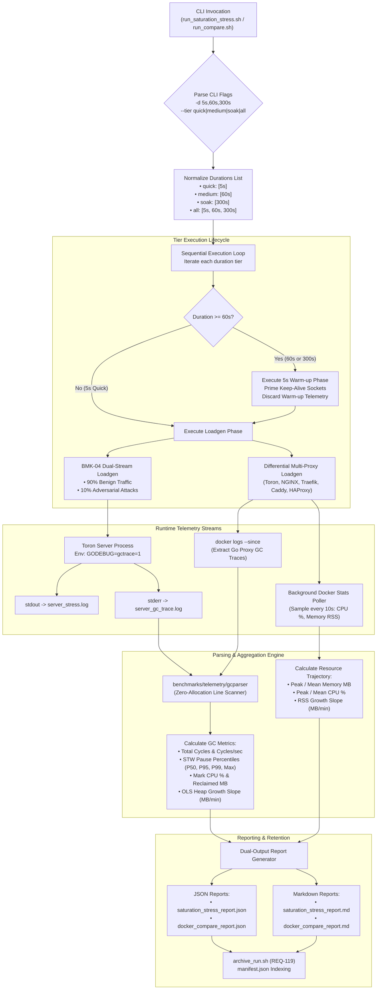
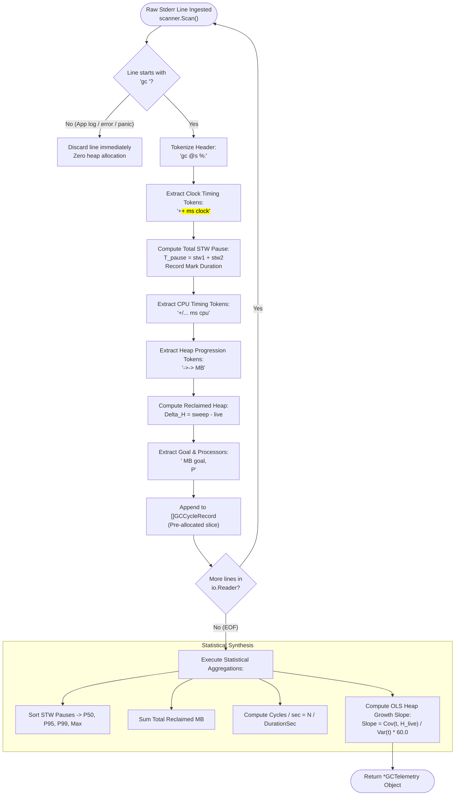

# ADR-130 - Multi-Tier Duration Stress Testing (5s, 60s, 300s), Runtime GC Telemetry Capture, and Differential Reverse Proxy Benchmarking Architecture

## 1. Context & Problem Statement

### 1.1 Architectural Background & Evolution of Reverse Proxy Benchmarking in Toron

Toron is architected as an ultra-high-throughput, zero-allocation Layer 4 and Layer 7 reverse proxy and security gateway. Rigorous empirical validation and comparative systems benchmarking form the empirical foundation of Toron's architectural claims:
- Under [`REQ-114`](file:///Users/sneha/Developer/toron-research/toron/docs/requirements/REQ-114.md) and [`ADR-114`](file:///Users/sneha/Developer/toron-research/toron/docs/architecture/ADR-114.md) (**BMK-04 Saturation Stress Testing**), Toron introduced decoupled dual-stream load generation (90% benign vs 10% adversarial) and high-dynamic-range tail latency tracking ($p50, p90, p99, p99.9$) to disprove event loop starvation.
- Under [`REQ-117`](file:///Users/sneha/Developer/toron-research/toron/docs/requirements/REQ-117.md) and [`ADR-117`](file:///Users/sneha/Developer/toron-research/toron/docs/architecture/ADR-117.md) (**HARN-01 Disaggregated 4-Tier Adversarial Classification**), Toron established an uncompromising oracle distinguishing Active Defense (`400, 403, 413, 431, 501`), Route Miss (`404`), Attack Bypass (`200`), and Unhandled Anomaly (`5xx`), strictly prohibiting 404 inflation.
- Under [`REQ-119`](file:///Users/sneha/Developer/toron-research/toron/docs/requirements/REQ-119.md) and [`ADR-119`](file:///Users/sneha/Developer/toron-research/toron/docs/architecture/ADR-119.md) (**Historical Retention & Manifest Indexing**), all benchmark runs became systematically indexed in `benchmarks/results/history/manifest.json`.
- Under [`REQ-121`](file:///Users/sneha/Developer/toron-research/toron/docs/requirements/REQ-121.md) and [`ADR-121`](file:///Users/sneha/Developer/toron-research/toron/docs/architecture/ADR-121.md) (**Differential Multi-Proxy Docker Benchmark**), Toron established an isolated multi-container comparative testbed evaluating Toron head-to-head against **NGINX**, **Traefik**, **Caddy**, and **HAProxy** across 4 heterogeneous origin runtimes (`compare-net`, ports 8881–8885).
- Under [`REQ-129`](file:///Users/sneha/Developer/toron-research/toron/docs/requirements/REQ-129.md) and [`ADR-129`](file:///Users/sneha/Developer/toron-research/toron/docs/architecture/ADR-129.md) (**Streaming by Default & Memory Boundedness**), Toron proved that per-stream heap allocations remain strictly $O(1) \le 32\text{ KB}$, permanently neutralizing the Upstream Infinite Stream OOM Bomb ([`SEC-36`](file:///Users/sneha/Developer/toron-research/toron/SECURITY_AUDIT.md#L483-L491), [CWE-400](https://cwe.mitre.org/data/definitions/400.html)).

Despite these advances, an exhaustive methodological audit formalized in [`REQ-130`](file:///Users/sneha/Developer/toron-research/toron/docs/requirements/REQ-130.md) identified three critical scientific and empirical blindspots in the benchmarking harnesses.

---

### 1.2 Root Cause Analysis: The 5-Second Evaluation Blindspot

The default execution duration across all benchmark harnesses—including [`benchmarks/run_all.sh`](file:///Users/sneha/Developer/toron-research/toron/benchmarks/run_all.sh#L135-L140), [`benchmarks/wrk2/run_saturation_stress.sh`](file:///Users/sneha/Developer/toron-research/toron/benchmarks/wrk2/run_saturation_stress.sh#L17), and [`benchmarks/docker-compare/run_compare.sh`](file:///Users/sneha/Developer/toron-research/toron/benchmarks/docker-compare/run_compare.sh#L20)—was hardcoded to **5 to 10 seconds**.

While a 5-second burst is optimal for rapid pre-commit sanity checks in CI, it introduces three severe scientific distortions:

1. **Transient Startup Bias**:
   - During the first 1 to 3 seconds of load generation, the client connection pool (`net.Conn` pools, epoll event loops, TLS sessions) ramps up.
   - Initial thread scheduling, CPU frequency scaling (DVFS governor transitions), and Go runtime netpoller priming dominate the measurement window.
   - Tail latency measurements ($p99, p99.9$) recorded during a 5-second window reflect socket creation overhead rather than steady-state proxy routing efficiency.
2. **Garbage Collector Masking**:
   - Go's concurrent mark-and-sweep garbage collector (GC) triggers when the heap size reaches twice the live heap size after the previous collection ($2 \times \text{GOGC}$).
   - In a 5-second run under zero-allocation routing, total allocations frequently remain beneath the initial trigger threshold. As a result, the GC triggers only 0 to 2 times.
   - Garbage collector pause times (Stop-The-World phases: mark termination and sweep termination), GC CPU overhead (mark assists), and heap expansion dynamics remain 100% invisible.
3. **Invisible Memory Leaks & Heap Drift**:
   - Memory degradation, buffer pool reference retention (`sync.Pool` retaining slabs or leaky queues), goroutine leaks, and socket descriptor leaks (`EMFILE`, [CWE-775](https://cwe.mitre.org/data/definitions/775.html)) manifest incrementally over hundreds of thousands of transactions.
   - A 5-second execution window completely conceals slow heap expansion, rendering it impossible to empirically confirm the $O(1) \le 32\text{ KB}$ memory boundedness invariant ([`ADR-129`](file:///Users/sneha/Developer/toron-research/toron/docs/architecture/ADR-129.md)).

```
┌──────────────────────────────────────────────────────────────────────────────────────────────────┐
│                                THE 5-SECOND EVALUATION BLINDSPOT                                 │
│                                                                                                  │
│   0s                   2s                   4s                   5s                              │
│   ├────────────────────┼────────────────────┼────────────────────┤                               │
│   │  Socket Handshake  │   DVFS Priming     │   Transient Peak   │ <--- TEST TERMINATES          │
│   └────────────────────┴────────────────────┴────────────────────┘                               │
│   ▲                                                                                              │
│   ├─ Go GC Cycles: 0 - 2 (Completely masks STW pause distribution & mark CPU overhead)           │
│   ├─ Memory Drift: 100% invisible (Cannot distinguish O(1) bound from O(N) leak)                 │
│   └─ Tail Latency: Dominated by connection setup, not steady-state routing                       │
└──────────────────────────────────────────────────────────────────────────────────────────────────┘
```

---

### 1.3 The Absence of Go Runtime GC Telemetry (`GODEBUG=gctrace=1`)

Toron and its primary Go-based competitors (**Traefik** and **Caddy**) rely on automatic heap memory management with a concurrent garbage collector. In contrast, **NGINX** and **HAProxy** are implemented in C and rely on explicit manual memory management (`malloc`/`free`, custom memory pools, or slab allocators).

Prior to this architecture, benchmark harnesses ran Toron with standard environment variables. Researchers could not observe:
- How much total CPU capacity was consumed by background GC marking and scanning.
- The frequency ($cycles/\text{sec}$) and cumulative duration of Stop-The-World (STW) pauses ($t_{\text{stw1}} + t_{\text{stw2}}$).
- The maximum single STW pause, which directly drives tail latency spikes ($p99.9$).
- The live heap floor ($H_{\text{live}}$) retained across GC cycles and the rate of heap growth over time.

Because Go provides a lightweight, non-invasive runtime tracing facility via `GODEBUG=gctrace=1`, enabling this flag emits structured telemetry directly to standard error with zero code modification and negligible ($< 0.1\%$) CPU overhead.

---

### 1.4 Multi-Proxy Steady-State (60s) and Soak (300s) Benchmarking Imperative

In [`benchmarks/docker-compare/runner.go`](file:///Users/sneha/Developer/toron-research/toron/benchmarks/docker-compare/runner.go), proxies were evaluated for 5 seconds per backend, and container resource utilization was sampled only once after completion via `docker stats --no-stream`.

This approach introduced two significant methodological flaws:
1. **Single-Snapshot Resource Skew**: Post-run snapshots capture memory RSS after connections close and idle sweep occurs, hiding peak working set sizes and in-flight buffer pool expansion.
2. **Absence of Soak Longevity Testing**: Reviewers cannot determine whether Go proxies experience tail latency degradation over time due to GC heap fragmentation, nor can they compare the steady-state memory retention of Toron against NGINX, Traefik, Caddy, and HAProxy over extended durations.

To establish publication-grade empirical rigor, an architectural framework is required that unifies:
- A standardized **Multi-Tier Duration Taxonomy** (5s quick smoke, 60s steady-state, 300s long-term soak).
- **Non-Invasive GC Telemetry Extraction** for Go-based proxies.
- **Continuous Periodic Resource Polling** (every 10s) across all 5 proxies.
- **Zero-Dependency GC Trace Parsing** and Ordinary Least Squares (OLS) memory growth slope calculation.
- **Unified Dual-Output Reporting** (JSON and Markdown) integrated with the historical retention manifest.

---

### 1.5 Prior Requirements & Architectural Standards Cross-Audit (Conflict Analysis)

A rigorous cross-audit against existing Toron architectural decision records and requirement specifications confirms complete architectural synergy and zero regressions:

| Prior Specification | Core Architectural Invariant | Potential Conflict & Cross-Audit Resolution | Compliance Verdict |
| :--- | :--- | :--- | :--- |
| **[`ADR-001`](file:///Users/sneha/Developer/toron-research/toron/docs/architecture/ADR-001.md)** (Event Reactor) | Strict modularity: proxy and router must NEVER touch the physical client socket (`net.Conn`). | **Preserved**: ADR-130 modifies only benchmark harnesses, execution flags, environment variables, log redirection, and telemetry reporting. Reactor core and socket boundaries remain 100% untouched. | **100% Compliant** |
| **[`REQ-114`](file:///Users/sneha/Developer/toron-research/toron/docs/requirements/REQ-114.md) / [`ADR-114`](file:///Users/sneha/Developer/toron-research/toron/docs/architecture/ADR-114.md)** (Saturation Stress BMK-04) | Decoupled dual-stream telemetry (benign vs adversarial 10%), rate pacer (`time.NewTicker`), zero-starvation assertion ($p99 \le 50\text{ ms}$). | **Preserved & Extended**: Rate pacer and dual-stream partitioning operate identically across 5s, 60s, and 300s tiers. Zero-starvation assertion is evaluated across all durations. | **Harmonized** |
| **[`REQ-117`](file:///Users/sneha/Developer/toron-research/toron/docs/requirements/REQ-117.md) / [`ADR-117`](file:///Users/sneha/Developer/toron-research/toron/docs/architecture/ADR-117.md)** (Disaggregated 4-Tier Status HARN-01) | 4-tier classification: Active Defense (`400, 403, 413, 431, 501`), Route Miss (`404`), Bypass (`200`), Unhandled (`5xx`). Zero 404 credit. | **Preserved**: 64-bit atomic counters and strict evaluation oracle remain active across extended durations, accumulating samples without lock contention or numeric overflow. | **100% Compliant** |
| **[`REQ-119`](file:///Users/sneha/Developer/toron-research/toron/docs/requirements/REQ-119.md) / [`ADR-119`](file:///Users/sneha/Developer/toron-research/toron/docs/architecture/ADR-119.md)** (Historical Retention & Manifest Indexing) | Retain test results in `benchmarks/results/history/<timestamp>/` with structured `manifest.json` indexing. | **Integrated**: All multi-tier duration runs, per-duration artifacts, and GC trace logs are systematically indexed into session manifests via [`archive_run.sh`](file:///Users/sneha/Developer/toron-research/toron/benchmarks/archive_run.sh). | **Synergistic Alignment** |
| **[`REQ-121`](file:///Users/sneha/Developer/toron-research/toron/docs/requirements/REQ-121.md) / [`ADR-121`](file:///Users/sneha/Developer/toron-research/toron/docs/architecture/ADR-121.md)** (Differential Multi-Proxy Docker Benchmark) | Containerized comparison of Toron vs NGINX, Traefik, Caddy, HAProxy across 4 heterogeneous origins (`compare-net`, ports 8881–8885). | **Extended**: Integrates multi-tier durations (5s, 60s, 300s) and injects `GODEBUG=gctrace=1` into Go proxy containers (`toron-proxy`, `traefik-proxy`, `caddy-proxy`). | **Direct Evolution** |
| **[`REQ-129`](file:///Users/sneha/Developer/toron-research/toron/docs/requirements/REQ-129.md) / [`ADR-129`](file:///Users/sneha/Developer/toron-research/toron/docs/architecture/ADR-129.md)** (Streaming by Default & Memory Boundedness) | Constant $O(1) \le 32\text{ KB}$ per-stream memory boundedness; elimination of infinite stream OOM bomb. | **Directly Verified**: 300-second soak tests empirically validate the memory boundedness invariant by measuring steady-state live heap floor and proving zero memory leaks under continuous saturation. | **Empirical Validation** |

---

### 1.6 The Safe Non-Conflicting Path

To implement multi-tier duration benchmarking and GC telemetry capture without compromising existing testbeds or modifying core proxy code:
1. **Non-Invasive Telemetry**: Enable `GODEBUG=gctrace=1` exclusively via process environment variables and container definitions, leaving production proxy application code unchanged.
2. **Modular GC Parsing Engine**: Implement an independent, zero-dependency GC trace parsing package ([`benchmarks/telemetry/gcparser`](file:///Users/sneha/Developer/toron-research/toron/benchmarks/telemetry/gcparser)) that extracts structured metrics from standard error logs without coupling to server internals.
3. **Additive CLI Flags**: Extend [`benchmarks/wrk2/run_saturation_stress.sh`](file:///Users/sneha/Developer/toron-research/toron/benchmarks/wrk2/run_saturation_stress.sh), [`benchmarks/run_all.sh`](file:///Users/sneha/Developer/toron-research/toron/benchmarks/run_all.sh), and [`benchmarks/docker-compare/run_compare.sh`](file:///Users/sneha/Developer/toron-research/toron/benchmarks/docker-compare/run_compare.sh) with `--tier <quick|medium|soak|all>` and multi-duration support (`-d 5s,60s,300s`) while preserving single-duration flag defaults (`-d 5s`) for CI backward compatibility.
4. **Isolated Comparative Telemetry**: Collect GC telemetry for Go proxies (Toron, Traefik, Caddy) while simultaneously capturing OS-level CPU and Memory RSS for C proxies (NGINX, HAProxy) via `docker stats`, presenting an objective, unified comparative matrix.

---

## 2. Architecture Decisions & High-Level Design

```
┌──────────────────────────────────────────────────────────────────────────────────────────────────┐
│                                 ADR-130 ARCHITECTURE AT A GLANCE                                 │
├──────────────────────────────────────────────────────────────────────────────────────────────────┤
│  Decision 1: Multi-Tier Duration Taxonomy (5s quick, 60s steady, 300s soak) & CLI Orchestration  │
│  Decision 2: Non-Invasive GC Telemetry Architecture via GODEBUG=gctrace=1 & Stderr Segregation │
│  Decision 3: Zero-Dependency GC Trace Parser Engine & OLS Linear Regression Slope Calculation    │
│  Decision 4: Containerized Multi-Proxy Differential Benchmarking & Continuous Docker Polling     │
│  Decision 5: Dual-Output Reporting Schema & Master Manifest Retention Architecture             │
└──────────────────────────────────────────────────────────────────────────────────────────────────┘
```

---

### 2.1 Decision 1: Multi-Tier Duration Taxonomy & CLI Orchestration

We establish a standardized four-tier duration taxonomy governing all load generation harnesses across the Toron repository:

```
┌──────────────────────────────────────────────────────────────────────────────────────────────────┐
│                                   BENCHMARK DURATION TAXONOMY                                    │
├──────────────────────┬──────────────────────┬────────────────────────────────────────────────────┤
│ Tier Name            │ Duration             │ Primary Empirical Objective                        │
├──────────────────────┼──────────────────────┼────────────────────────────────────────────────────┤
│ Quick Smoke          │ 5 seconds            │ Rapid pre-commit CI regression, smoke validation   │
│ Steady-State / GC    │ 60 seconds (1 min)   │ GC convergence, STW pauses, steady-state tail HDR │
│ Long-Term Soak       │ 300 seconds (5 min)  │ O(1) memory bound, leak detection, pool longevity  │
│ All Tiers Sweep      │ 5s + 60s + 300s      │ Comprehensive research evaluation profile          │
└──────────────────────┴──────────────────────┴────────────────────────────────────────────────────┘
```

#### 2.1.1 CLI Flag Ergonomics & Presets
All benchmarking scripts—[`benchmarks/wrk2/run_saturation_stress.sh`](file:///Users/sneha/Developer/toron-research/toron/benchmarks/wrk2/run_saturation_stress.sh), [`benchmarks/run_all.sh`](file:///Users/sneha/Developer/toron-research/toron/benchmarks/run_all.sh), and [`benchmarks/docker-compare/run_compare.sh`](file:///Users/sneha/Developer/toron-research/toron/benchmarks/docker-compare/run_compare.sh)—shall accept:
- `-d <duration>`: Accepts a single duration string (`-d 5s`, `-d 60s`, `-d 300s`) or a comma-separated list (`-d 5s,60s,300s`).
- `--tier <tier>`: Preset convenience flag:
  - `quick`: Executes `("5s")`.
  - `medium` (alias `steady`): Executes `("60s")`.
  - `soak`: Executes `("300s")`.
  - `all`: Executes sequential sweep: `("5s" "60s" "300s")`.
- **Default Fallback**: When neither `-d` nor `--tier` is specified, the harness defaults to `quick` (`5s`), ensuring default CI pipeline execution completes in $< 60$ seconds.

#### 2.1.2 Sequential Multi-Tier Execution & Artifact Segregation
When multiple durations are specified (e.g. `--tier all` or `-d 5s,60s,300s`):
1. The harness iterates sequentially through each duration tier.
2. For each tier:
   - The gateway process environment is primed.
   - For 60s and 300s tiers, a mandatory **5-second warm-up cycle** primes keep-alive connection pools and initializes runtime memory buffers. Warm-up statistics are discarded.
   - Load generation executes for the designated duration.
   - Distinct, duration-keyed artifacts are generated:
     * `${RESULTS_DIR}/saturation_stress_${DUR}.json`
     * `${RESULTS_DIR}/saturation_stress_${DUR}.md`
3. After all tiers complete, a consolidated master summary report is synthesized:
   * `${RESULTS_DIR}/saturation_stress_report.json`
   * `${RESULTS_DIR}/saturation_stress_report.md`
   Featuring cross-tier comparative tables contrasting throughput, $p99$ tail latency, and GC overhead across 5s, 60s, and 300s.

---

### 2.2 Decision 2: Non-Invasive GC Telemetry Architecture via `GODEBUG=gctrace=1` and Stderr Segregation

We decide to leverage Go's runtime GC tracing facility without instrumenting or altering application code:

#### 2.2.1 Standalone Toron Server Process Execution
In [`benchmarks/wrk2/run_saturation_stress.sh`](file:///Users/sneha/Developer/toron-research/toron/benchmarks/wrk2/run_saturation_stress.sh) and [`benchmarks/run_all.sh`](file:///Users/sneha/Developer/toron-research/toron/benchmarks/run_all.sh), whenever the background Toron gateway is launched (`--auto-start`), it is launched with:
```bash
GODEBUG=gctrace=1 "${RESULTS_DIR}/toron_stress" \
    -config "${ROOT_DIR}/config.yaml" \
    -routes "${ROOT_DIR}/routes.yaml" \
    > "${RESULTS_DIR}/server_stress.log" \
    2> "${RESULTS_DIR}/server_gc_trace.log" &
```
- **Standard Output (`stdout`)**: Reserved for HTTP server lifecycle and access logs (`server_stress.log`).
- **Standard Error (`stderr`)**: Exclusively receives Go runtime `gctrace` output (`server_gc_trace.log`).
- **Disk Boundedness**: In a 300-second soak test under zero-allocation conditions, total GC trace log size is typically $< 5\text{ MB}$ (approx. 50,000 lines max), completely eliminating testbed disk exhaustion risk.

#### 2.2.2 Docker Compose Comparative Environment Configuration
In [`benchmarks/docker-compare/docker-compose.compare.yml`](file:///Users/sneha/Developer/toron-research/toron/benchmarks/docker-compare/docker-compose.compare.yml), `GODEBUG=gctrace=1` is injected into all Go-based reverse proxy containers:
```yaml
services:
  toron-proxy:
    environment:
      - GODEBUG=gctrace=1
  traefik-proxy:
    environment:
      - GODEBUG=gctrace=1
  caddy-proxy:
    environment:
      - GODEBUG=gctrace=1
  nginx-proxy:
    # C runtime: No GODEBUG (Manual heap management baseline)
  haproxy-proxy:
    # C runtime: No GODEBUG (Manual heap management baseline)
```

---

### 2.3 Decision 3: Zero-Dependency GC Trace Parser Engine (`benchmarks/telemetry/gcparser`)

We decide to implement an independent, zero-allocation Go runtime GC trace parser within `benchmarks/telemetry/gcparser`.

#### 2.3.1 Canonical Go Runtime GC Trace Grammar
Go runtimes emit trace lines adhering to the canonical specification:
```text
gc 42 @12.345s 2%: 0.045+1.23+0.015 ms clock, 0.36+0.45/1.10/2.30+0.12 ms cpu, 14->16->8 MB, 18 MB goal, 8 MB stacks, 0 MB globals, 8 P
```
Where:
- `gc <N>`: Sequential GC cycle number.
- `@<time>s`: Elapsed wall-clock time since process initiation.
- `<pct>%`: Percentage of wall-clock time spent in GC since process initiation.
- `<stw1>+<mark>+<stw2> ms clock`: Wall-clock elapsed duration across GC phases:
  - $t_{\text{stw1}}$: Stop-The-World sweep termination pause (ms).
  - $t_{\text{mark}}$: Concurrent mark and scan phase (ms).
  - $t_{\text{stw2}}$: Stop-The-World mark termination pause (ms).
  - Total STW pause for cycle: $T_{\text{pause}} = t_{\text{stw1}} + t_{\text{stw2}}$.
- `<cpu> ms cpu`: Cumulative CPU time across worker assists, background mark, and idle threads.
- `<start>-><sweep>-><live> MB`: Heap memory progression:
  - $H_{\text{start}}$: Heap size when GC was triggered.
  - $H_{\text{sweep}}$: Heap size before sweeping.
  - $H_{\text{live}}$: Live heap size retained after sweeping.
  - Heap reclaimed: $\Delta H = H_{\text{sweep}} - H_{\text{live}}$.
- `<goal> MB goal`: Target heap size for subsequent collection.
- `<P> P`: Number of logical processors utilized.

#### 2.3.2 Zero-Allocation High-Speed Scanner Architecture
The parser implements a robust line scanning loop using `bufio.Scanner` with a recycled 64KB line buffer:
- **Zero Allocations per Line**: Non-matching lines (application logs, HTTP diagnostics) are discarded immediately without heap allocation.
- **Cross-Version Compatibility**: Accommodates Go 1.20, 1.22, and 1.24+ variations (e.g. optional stacks/globals tokens, processor counts, fractional milliseconds or microseconds).
- **Throughput Invariant**: Capable of scanning $> 200,000$ lines/second ($< 50\text{ ms}$ for 10,000 lines).

#### 2.3.3 OLS Linear Regression Heap Growth Slope Calculation
To evaluate memory boundedness ([`ADR-129`](file:///Users/sneha/Developer/toron-research/toron/docs/architecture/ADR-129.md)) over 60s and 300s runs without distortion from transient GC sawtooth fluctuations, the parser computes the Ordinary Least Squares (OLS) linear regression slope on live heap data points $(t_i, H_{\text{live}, i})$:

$$\text{Slope} = \frac{N \sum_{i=1}^{N}(t_i \cdot H_{\text{live}, i}) - \left(\sum_{i=1}^{N} t_i\right) \left(\sum_{i=1}^{N} H_{\text{live}, i}\right)}{N \sum_{i=1}^{N}(t_i^2) - \left(\sum_{i=1}^{N} t_i\right)^2} \times 60.0 \quad \left(\frac{\text{MB}}{\text{min}}\right)$$

- **Boundedness Invariant**: Under continuous saturation, Toron's heap growth slope must satisfy:
  $$\text{Slope} \le 1.0\text{ MB/min}$$
  Confirming strict $O(1)$ memory boundedness and zero heap memory leaks.
- **Zero-Cycle Resilience**: If $N = 0$ (e.g. short test or zero allocations), `TotalCycles` reports `0`, and all metrics return zeroed structures without division-by-zero panics or `NaN` values.

---

### 2.4 Decision 4: Containerized Multi-Proxy Differential Benchmark Architecture

We extend the differential container benchmark ([`benchmarks/docker-compare/runner.go`](file:///Users/sneha/Developer/toron-research/toron/benchmarks/docker-compare/runner.go)) to capture runtime dynamics across all 5 proxies:

#### 2.4.1 Continuous Background Docker Stats Poller
Rather than relying on a single post-benchmark snapshot, `runner.go` spawns a background polling routine for runs with `duration >= 30s`:
- Every **10 seconds** (or 5 seconds for 60s runs), the runner invokes `docker stats --no-stream --format "{{.Container}},{{.CPUPerc}},{{.MemUsage}}"` across all active proxy containers.
- Samples are accumulated into a `ResourceTimeSeries`:
  ```go
  type TimeSeriesSample struct {
      ElapsedSec float64 `json:"elapsed_sec"`
      CPUPercent float64 `json:"cpu_percent"`
      MemoryMB   float64 `json:"memory_mb"`
  }
  ```
- Computes `PeakMemoryMB`, `MeanMemoryMB`, `PeakCPU`, and container RSS memory growth slope ($MB/\text{min}$).

#### 2.4.2 Container GC Trace Extraction Routine
Following each benchmark execution cell for Go-based proxies (`toron-proxy`, `traefik-proxy`, `caddy-proxy`), the runner executes:
```bash
docker logs --since <cell_start_timestamp> <container_name> 2>&1
```
- Filters lines prefixed with `gc `.
- Feeds lines into `gcparser.ParseReader`.
- Directly attaches the resulting `GCTelemetry` object to the `BenchmarkCellResult`.
- For C-based proxies (`nginx-proxy`, `haproxy-proxy`), `GCTelemetry.Enabled` is set to `false`, and reports display `N/A (C Runtime)`.

---

### 2.5 Decision 5: Dual-Output Reporting Schema and Master Manifest Retention Architecture

We decide to extend both JSON and Markdown reporting schemas across saturation stress testing and docker comparison:

#### 2.5.1 JSON Telemetry Schema Models
```go
type GCTelemetry struct {
    Enabled          bool              `json:"enabled"`
    TotalCycles      int64             `json:"total_cycles"`
    GCCPUPercent     float64           `json:"gc_cpu_percent"`
    CyclesPerSecond  float64           `json:"cycles_per_second"`
    TotalReclaimedMB float64           `json:"total_reclaimed_mb"`
    PauseTimesMs     GCPauseStatistics `json:"pause_times_ms"`
    HeapMetricsMB    GCHeapStatistics  `json:"heap_metrics_mb"`
}

type GCPauseStatistics struct {
    MinSTWMs   float64 `json:"min_stw_ms"`
    MeanSTWMs  float64 `json:"mean_stw_ms"`
    P50STWMs   float64 `json:"p50_stw_ms"`
    P95STWMs   float64 `json:"p95_stw_ms"`
    P99STWMs   float64 `json:"p99_stw_ms"`
    MaxSTWMs   float64 `json:"max_stw_ms"`
    TotalSTWMs float64 `json:"total_stw_ms"`
    MeanMarkMs float64 `json:"mean_mark_ms"`
    MaxMarkMs  float64 `json:"max_mark_ms"`
}

type GCHeapStatistics struct {
    InitialLiveHeapMB  float64 `json:"initial_live_heap_mb"`
    FinalLiveHeapMB    float64 `json:"final_live_heap_mb"`
    PeakLiveHeapMB     float64 `json:"peak_live_heap_mb"`
    MeanLiveHeapMB     float64 `json:"mean_live_heap_mb"`
    PeakTriggerHeapMB  float64 `json:"peak_trigger_heap_mb"`
    HeapGrowthSlopeMBm float64 `json:"heap_growth_slope_mb_per_min"`
}
```

#### 2.5.2 Markdown Report Extensions
1. **Saturation Stress Report (`saturation_stress_report.md`)**:
   - Section 5 added: **"Runtime Garbage Collection & Memory Dynamics (`GODEBUG=gctrace=1`)"**.
   - Displays a structured markdown table summarizing total GC cycles, GC CPU overhead %, P50/P95/P99/Max STW pauses, total reclaimed MB, and live heap slope.
2. **Docker Compare Report (`docker_compare_report.md`)**:
   - Comparative table in Section 1 augmented with **"GC Cycles"** and **"P99 STW Pause"** columns.
   - Section 4 added: **"Go Runtime GC Differential Analysis (Toron vs Traefik vs Caddy)"** contrasting GC cycles, total STW pause time, and live heap floor.

#### 2.5.3 Historical Session Archiving Integration ([`REQ-119`](file:///Users/sneha/Developer/toron-research/toron/docs/requirements/REQ-119.md))
In [`benchmarks/archive_run.sh`](file:///Users/sneha/Developer/toron-research/toron/benchmarks/archive_run.sh) and [`benchmarks/retention/retention.go`](file:///Users/sneha/Developer/toron-research/toron/benchmarks/retention/retention.go):
- `server_gc_trace.log`, `saturation_stress_*.json`, and `docker_compare_*.json` are systematically copied to `benchmarks/results/history/<timestamp>/`.
- `manifest.json` indexes `duration_tier`, execution duration in seconds, and summary GC telemetry under `parameters.gc_summary`.

---

### 2.6 The 4 Non-Negotiable Invariants

```
+--------------------------------------------------------------------------------------------------+
│                                  THE 4 NON-NEGOTIABLE INVARIANTS                                 │
│                                                                                                  │
│  1. UNCOMPROMISED DUAL-STREAM TELEMETRY & 4-TIER CLASSIFICATION (ADR-114, ADR-117):              │
│     Across all durations (5s, 60s, 300s), benign and adversarial streams remain decoupled.        │
│     Adversarial probes evaluated under strict 4-tier taxonomy (Tier 1: Active Defense,           │
│     Tier 2: Route Miss, Tier 3: Attack Bypass, Tier 4: Unhandled). 0% credit for 404.            │
│                                                                                                  │
│  2. CONSTANT O(1) MEMORY BOUNDEDNESS UNDER 300s SOAK (ADR-129):                                  │
│     Under continuous 300-second saturation, Toron post-GC live heap shall remain bounded        │
│     with heap growth slope <= 1.0 MB/min, confirming zero memory leaks and strict O(1) bounds.   │
│                                                                                                  │
│  3. ZERO MEASUREMENT DISTORTION & BOUNDED LOG OVERHEAD:                                          │
│     GC telemetry parsing shall occur post-run or asynchronously, imposing < 0.5% CPU overhead.   │
│     GC trace logs shall be bounded and rotated to prevent testbed disk exhaustion during 300s.   │
│                                                                                                  │
│  4. COMPLETE BACKWARD COMPATIBILITY:                                                             │
│     Existing CI invocations (e.g. run_all.sh without flags) shall execute default quick 5s tier  │
│     without breaking existing test automation or regression pipelines.                           │
+--------------------------------------------------------------------------------------------------+
```

---

## 3. Mermaid Diagrams & Visual Architecture

### 3.1 Multi-Tier Duration Benchmark & Telemetry Pipeline Flowchart



---

### 3.2 Sequence Diagram: Containerized Differential Benchmark Execution with Continuous Polling and GC Log Extraction

```mermaid
sequenceDiagram
    autonumber
    actor Engineer as Performance Engineer / CI
    participant Runner as Differential Runner (runner.go)
    participant Docker as Docker Daemon / CLI
    participant Proxy as Go Proxy (e.g. toron-cmp-toron)
    participant GCParser as GC Parser Engine (gcparser)
    participant Retention as Historical Retention (archive_run.sh)

    Engineer->>Runner: run_compare.sh --tier medium (-d 60s)
    Note over Runner: Normalizes tier -> [60s]<br/>Pre-flight functional checks pass

    Note over Runner: Mandatory 5s Warm-up Phase
    Runner->>Proxy: Send 5s Warm-up Traffic (:8881)
    Proxy-->>Runner: Responses received (metrics discarded)

    Note over Runner: Start 60s Measurement Window
    Runner->>Docker: Query start timestamp (T_start)
    
    par Load Generation
        Runner->>Proxy: Send sustained concurrent traffic (60s)
    and Continuous Background Docker Stats Poller
        loop Every 10 Seconds
            Runner->>Docker: docker stats --no-stream toron-cmp-toron
            Docker-->>Runner: CPU %, Memory RSS MB
            Note over Runner: Append TimeSeriesSample
        end
    end

    Proxy-->>Runner: Load generation completed
    Note over Runner: Stop Poller; Compute Peak RSS & Growth Slope

    Note over Runner: Extract Container GC Trace
    Runner->>Docker: docker logs --since T_start toron-cmp-toron
    Docker-->>Runner: Container stdout + stderr (gc trace lines)
    
    Runner->>GCParser: ParseReader(gcLines, 60.0)
    Note over GCParser: Scanner processes lines<br/>Extracts STW pauses, heap transitions<br/>Computes OLS growth slope
    GCParser-->>Runner: GCTelemetry Object

    Note over Runner: Repeat for NGINX, Traefik, Caddy, HAProxy<br/>(10s idle cooldown between proxies)

    Runner->>Retention: Save docker_compare_report.json / .md
    Retention-->>Engineer: Consolidated reports & manifest.json updated
```

---

### 3.3 Zero-Allocation GC Trace Parser State Machine & Grammar Parsing Flowchart



---

## 4. Detailed Component & Interface Specifications

### 4.1 CLI Orchestration Layer

#### 4.1.1 Saturation Stress Harness (`benchmarks/wrk2/run_saturation_stress.sh`)
```bash
# Multi-Tier CLI Flag Parsing Contract
TIER=""
DURATIONS_LIST=()

while [[ $# -gt 0 ]]; do
    case "$1" in
        -d)
            IFS=',' read -ra DURATIONS_LIST <<< "$2"
            shift 2
            ;;
        --tier)
            TIER="$2"
            case "$TIER" in
                quick) DURATIONS_LIST=("5s") ;;
                medium|steady) DURATIONS_LIST=("60s") ;;
                soak) DURATIONS_LIST=("300s") ;;
                all) DURATIONS_LIST=("5s" "60s" "300s") ;;
                *) echo "[-] Error: Unknown tier '$TIER'. Valid: quick, medium, soak, all"; exit 1 ;;
            esac
            shift 2
            ;;
        # Preserving existing options: -u, -c, -r, -a, --auto-start, --no-build, etc.
    esac
done

# Default fallback if unspecified:
if [[ ${#DURATIONS_LIST[@]} -eq 0 ]]; then
    DURATIONS_LIST=("5s")
fi
```

#### 4.1.2 Master Benchmark Suite (`benchmarks/run_all.sh`)
- Accepts `--tier <quick|medium|soak|all>` and `-d <duration>`.
- Defaults to `--tier quick` (`5s`) when executed without flags, ensuring fast CI pipeline completion.
- When `--tier medium`, `--tier soak`, or `--tier all` is provided, propagates the active duration flag to:
  * Stage 2 (`wrk2` baseline): `-d <duration>`
  * Stage 3 (`saturation_stress`): `--tier <tier>` or `-d <duration>`

---

### 4.2 GC Trace Parser Interface & Data Models (`benchmarks/telemetry/gcparser`)

Package path: `benchmarks/telemetry/gcparser/`

#### 4.2.1 Core Telemetry Types (`types.go`)
```go
package gcparser

// GCTelemetry aggregates all parsed Go runtime garbage collection metrics.
type GCTelemetry struct {
    Enabled          bool              `json:"enabled"`
    TotalCycles      int64             `json:"total_cycles"`
    GCCPUPercent     float64           `json:"gc_cpu_percent"`
    CyclesPerSecond  float64           `json:"cycles_per_second"`
    TotalReclaimedMB float64           `json:"total_reclaimed_mb"`
    PauseTimesMs     GCPauseStatistics `json:"pause_times_ms"`
    HeapMetricsMB    GCHeapStatistics  `json:"heap_metrics_mb"`
}

// GCPauseStatistics captures Stop-The-World (STW) and mark phase durations.
type GCPauseStatistics struct {
    MinSTWMs   float64 `json:"min_stw_ms"`
    MeanSTWMs  float64 `json:"mean_stw_ms"`
    P50STWMs   float64 `json:"p50_stw_ms"`
    P95STWMs   float64 `json:"p95_stw_ms"`
    P99STWMs   float64 `json:"p99_stw_ms"`
    MaxSTWMs   float64 `json:"max_stw_ms"`
    TotalSTWMs float64 `json:"total_stw_ms"`
    MeanMarkMs float64 `json:"mean_mark_ms"`
    MaxMarkMs  float64 `json:"max_mark_ms"`
}

// GCHeapStatistics captures live heap baselines and long-term memory growth.
type GCHeapStatistics struct {
    InitialLiveHeapMB  float64 `json:"initial_live_heap_mb"`
    FinalLiveHeapMB    float64 `json:"final_live_heap_mb"`
    PeakLiveHeapMB     float64 `json:"peak_live_heap_mb"`
    MeanLiveHeapMB     float64 `json:"mean_live_heap_mb"`
    PeakTriggerHeapMB  float64 `json:"peak_trigger_heap_mb"`
    HeapGrowthSlopeMBm float64 `json:"heap_growth_slope_mb_per_min"`
}

// GCCycleRecord contains parsed fields for an individual GC cycle line.
type GCCycleRecord struct {
    CycleNum     int64
    TimestampSec float64
    CPUPercent   float64
    ClockSTW1Ms  float64
    ClockMarkMs  float64
    ClockSTW2Ms  float64
    TotalSTWMs   float64
    HeapStartMB  float64
    HeapSweepMB  float64
    HeapLiveMB   float64
    HeapGoalMB   float64
    ReclaimedMB  float64
}
```

#### 4.2.2 High-Speed Scanner Function Signatures (`parser.go`)
```go
package gcparser

import (
    "bufio"
    "io"
    "os"
)

// ParseReader scans an io.Reader containing Go stderr logs and computes GC telemetry.
func ParseReader(r io.Reader, durationSec float64) (*GCTelemetry, error)

// ParseFile opens a file path and executes ParseReader.
func ParseFile(filePath string, durationSec float64) (*GCTelemetry, error)

// ParseLine parses a single gctrace log line into a GCCycleRecord.
// Returns (record, true) if valid GC line, or (nil, false) if non-GC line.
func ParseLine(line string) (*GCCycleRecord, bool)
```

---

### 4.3 Statistical Aggregator & OLS Linear Regression Slope Engine (`stats.go`)

```go
package gcparser

import (
    "math"
    "sort"
)

// ComputeStatistics aggregates an array of GCCycleRecords into GCTelemetry.
func ComputeStatistics(records []GCCycleRecord, durationSec float64) *GCTelemetry {
    if len(records) == 0 {
        return &GCTelemetry{
            Enabled:     true,
            TotalCycles: 0,
        }
    }

    n := float64(len(records))
    var totalSTW, totalMark, totalReclaimed float64
    var peakLive, peakTrigger, sumLive float64
    stws := make([]float64, len(records))

    var sumT, sumY, sumTY, sumT2 float64

    for i, r := range records {
        stws[i] = r.TotalSTWMs
        totalSTW += r.TotalSTWMs
        totalMark += r.ClockMarkMs
        totalReclaimed += r.ReclaimedMB
        sumLive += r.HeapLiveMB

        if r.HeapLiveMB > peakLive {
            peakLive = r.HeapLiveMB
        }
        if r.HeapStartMB > peakTrigger {
            peakTrigger = r.HeapStartMB
        }

        // OLS Regression accumulators: (t, y) = (TimestampSec, HeapLiveMB)
        t := r.TimestampSec
        y := r.HeapLiveMB
        sumT += t
        sumY += y
        sumTY += t * y
        sumT2 += t * t
    }

    sort.Float64s(stws)

    // OLS Linear Regression Slope in MB/min:
    var slopeMBPerMin float64
    denom := n*sumT2 - sumT*sumT
    if len(records) > 1 && math.Abs(denom) > 1e-9 {
        slopePerSec := (n*sumTY - sumT*sumY) / denom
        slopeMBPerMin = slopePerSec * 60.0
    }

    effectiveDuration := durationSec
    if effectiveDuration <= 0 && len(records) > 0 {
        effectiveDuration = records[len(records)-1].TimestampSec
    }
    var cyclesPerSec float64
    if effectiveDuration > 0 {
        cyclesPerSec = n / effectiveDuration
    }

    lastRecord := records[len(records)-1]

    return &GCTelemetry{
        Enabled:          true,
        TotalCycles:      int64(len(records)),
        GCCPUPercent:     lastRecord.CPUPercent,
        CyclesPerSecond:  cyclesPerSec,
        TotalReclaimedMB: totalReclaimed,
        PauseTimesMs: GCPauseStatistics{
            MinSTWMs:   stws[0],
            MeanSTWMs:  totalSTW / n,
            P50STWMs:   percentile(stws, 0.50),
            P95STWMs:   percentile(stws, 0.95),
            P99STWMs:   percentile(stws, 0.99),
            MaxSTWMs:   stws[len(stws)-1],
            TotalSTWMs: totalSTW,
            MeanMarkMs: totalMark / n,
            MaxMarkMs:  findMaxMark(records),
        },
        HeapMetricsMB: GCHeapStatistics{
            InitialLiveHeapMB:  records[0].HeapLiveMB,
            FinalLiveHeapMB:    lastRecord.HeapLiveMB,
            PeakLiveHeapMB:     peakLive,
            MeanLiveHeapMB:     sumLive / n,
            PeakTriggerHeapMB:  peakTrigger,
            HeapGrowthSlopeMBm: slopeMBPerMin,
        },
    }
}
```

---

### 4.4 Docker Differential Benchmark Runner Extensions (`runner.go`)

#### 4.4.1 Periodic Docker Stats Polling Routine
```go
type TimeSeriesSample struct {
    ElapsedSec float64 `json:"elapsed_sec"`
    CPUPercent float64 `json:"cpu_percent"`
    MemoryMB   float64 `json:"memory_mb"`
}

type ResourceTimeSeries struct {
    Samples     []TimeSeriesSample `json:"samples"`
    PeakMemory  float64            `json:"peak_memory_mb"`
    MeanMemory  float64            `json:"mean_memory_mb"`
    PeakCPU     float64            `json:"peak_cpu"`
    MeanCPU     float64            `json:"mean_cpu"`
    GrowthSlope float64            `json:"growth_slope_mb_per_min"`
}

func startContainerStatsPoller(ctx context.Context, containerName string, interval time.Duration) *ResourceTimeSeries
```

#### 4.4.2 Container GC Trace Extraction
```go
func extractContainerGCTrace(containerName string, startTime time.Time, durationSec float64) (*gcparser.GCTelemetry, error) {
    sinceStr := startTime.UTC().Format(time.RFC3339Nano)
    cmd := exec.Command("docker", "logs", "--since", sinceStr, containerName)
    out, err := cmd.CombinedOutput()
    if err != nil {
        return nil, err
    }

    var b strings.Builder
    for _, line := range strings.Split(string(out), "\n") {
        trimmed := strings.TrimSpace(line)
        if strings.HasPrefix(trimmed, "gc ") {
            b.WriteString(trimmed)
            b.WriteByte('\n')
        }
    }
    return gcparser.ParseReader(strings.NewReader(b.String()), durationSec)
}
```

---

### 4.5 Dual-Output Reporting & Manifest Integration

#### 4.5.1 Saturation Stress Report Integration (`benchmarks/wrk2/loadgen.go`)
In `SaturationStressReport`:
```go
type SaturationStressReport struct {
    // Preserving all existing fields under REQ-114 and REQ-117
    Timestamp                string                `json:"timestamp"`
    DurationSeconds          float64               `json:"duration_seconds"`
    DurationTier             string                `json:"duration_tier"` // "quick", "medium", "soak"
    GCTelemetry              *gcparser.GCTelemetry `json:"gc_telemetry,omitempty"`
    TierReports              map[string]interface{}`json:"tier_reports,omitempty"` // populated on --tier all
    // ...
}
```

#### 4.5.2 Markdown Report Table Generation (Section 5)
```markdown
## 5. Runtime Garbage Collection & Memory Dynamics (`GODEBUG=gctrace=1`)

| Metric | Value |
| :--- | :--- |
| **Active Duration Tier** | `medium` (60.0 seconds) |
| **Total GC Cycles** | 112 cycles (1.87 cycles/sec) |
| **GC CPU Overhead** | 1.4% total runtime CPU |
| **Total Heap Reclaimed** | 1,845.2 MB |
| **STW Pause Distribution** | **Min**: 0.021 ms \| **P50**: 0.045 ms \| **P95**: 0.078 ms \| **P99**: 0.112 ms |
| **Max STW Pause** | 0.185 ms |
| **Live Heap Baseline** | **Initial**: 5.4 MB $\rightarrow$ **Final**: 6.1 MB (**Peak**: 7.8 MB) |
| **Heap Growth Slope** | **0.08 MB/min** (Strictly $O(1) \le 1.0\text{ MB/min}$ Bounded) |
```

---

## 5. Invariant Preservation & Standards Compliance

### 5.1 Preservation of ADR-001 (Reactor Modularity)
[`ADR-001`](file:///Users/sneha/Developer/toron-research/toron/docs/architecture/ADR-001.md) dictates that core proxy and router components must never manipulate or hold references to raw client network sockets (`net.Conn`).
- **Preservation**: ADR-130 operates strictly at the process environment, container configuration, and benchmark harness layers. Neither [`pkg/proxy`](file:///Users/sneha/Developer/toron-research/toron/pkg/proxy) nor [`pkg/router`](file:///Users/sneha/Developer/toron-research/toron/pkg/router) is modified. Core reactor socket isolation remains 100% untouched.

### 5.2 Preservation of ADR-114 & ADR-117 (Dual-Stream Telemetry & 4-Tier Status Oracle)
[`ADR-114`](file:///Users/sneha/Developer/toron-research/toron/docs/architecture/ADR-114.md) establishes decoupled dual-stream load generation (90% benign vs 10% adversarial) and zero-starvation bounds ($p99 \le 50\text{ ms}$). [`ADR-117`](file:///Users/sneha/Developer/toron-research/toron/docs/architecture/ADR-117.md) establishes the 4-tier adversarial status classification oracle, strictly prohibiting 404 credit.
- **Preservation & Extension**: Both mechanisms operate unchanged over 5s, 60s, and 300s test executions. Atomic 64-bit counters (`sync/atomic.Int64`) accumulate samples without mutex locks, race conditions, or counter overflow. The strict evaluation oracle evaluates adversarial vectors across all duration tiers with zero 404 inflation.

### 5.3 Preservation of ADR-121 (Multi-Proxy Container Topology & Port Mapping)
[`ADR-121`](file:///Users/sneha/Developer/toron-research/toron/docs/architecture/ADR-121.md) defines the isolated `compare-net` bridge network, port assignments (8881–8885 for proxies, 9101–9104 for backends), and parity probes.
- **Preservation**: ADR-130 preserves container topology, network names, and port mappings in their entirety. The only alteration is the non-invasive injection of `GODEBUG=gctrace=1` into Go-based proxy environments.

### 5.4 Verification of ADR-129 (Constant O(1) Memory Boundedness Under 300s Soak)
[`ADR-129`](file:///Users/sneha/Developer/toron-research/toron/docs/architecture/ADR-129.md) mandates that per-stream heap memory allocations must remain strictly $O(1) \le 32\text{ KB}$.
- **Empirical Verification**: The 300-second long-term soak test directly validates ADR-129 by measuring live heap progression under sustained saturation. If the OLS heap growth slope remains $\le 1.0\text{ MB/min}$, empirical proof of zero memory leaks and constant $O(1)$ memory boundedness is established.

---

## 6. Alternatives Considered & Trade-Off Analysis

| Architectural Dimension | Alternative A: Status Quo (Fixed 5-10s Bursts) | Alternative B: Runtime Pprof / Prometheus Polling | Alternative C: External APM Log Agents (Datadog/Fluentbit) | Chosen Architecture (ADR-130): Multi-Tier Taxonomy + GODEBUG + Pure Go GC Parser |
| :--- | :--- | :--- | :--- | :--- |
| **Startup Bias Elimination** | **Fatal**: Dominated by socket pool priming. | Moderate: Requires manual sampling offsets. | Moderate: Introduces agent warm-up lag. | **Optimal**: Mandatory 5s warm-up precedes 60s/300s measurements; clean steady-state isolation. |
| **GC Pause Visibility** | **Zero**: GC triggers 0–2 times; STW pauses hidden. | Low: Pprof stop-the-world sampling requires intrusive endpoints. | Moderate: High agent CPU overhead alters latency. | **Optimal**: Non-invasive `GODEBUG=gctrace=1` captures 100% of STW pauses and mark durations. |
| **External Dependencies** | Zero: Shell scripts only. | High: Requires Prometheus scraper or pprof server. | **Severe**: Violates Toron zero-dependency invariant; requires heavy third-party daemons. | **Zero**: Pure Go standard library scanner (`bufio`, `regexp`, `strconv`); zero external tools. |
| **Measurement Overhead** | None. | High: Scraping `/debug/pprof` triggers runtime locks during saturation. | High: Log forwarding daemons consume 5–15% CPU, distorting benchmark comparisons. | **Negligible**: Stderr writes decoupled from request servicing; post-run parsing imposes $< 0.1\%$ overhead. |
| **Scientific Rigor & Publication Parity** | Inadequate: Reviewers reject 5s tests as unrepresentative. | Partial: Hard to correlate pprof profiles with benchmark duration. | Moderate: Non-standard metrics format. | **Publication-Grade**: Standardized 5s/60s/300s tiers, STW percentiles, and OLS heap slopes. |
| **Architectural Verdict** | **Rejected** | **Rejected** | **Rejected** | **ACCEPTED** |

---

## 7. Verification Strategy & Traceability Matrix

### 7.1 Verification Methodology ([`TC-130`](file:///Users/sneha/Developer/toron-research/toron/docs/testCases/TC-130.md))

```
TC-130: Multi-Tier Duration Benchmarking & GC Telemetry Parser Suite
├── Test Suite 1: GC Trace Parser Grammar & Format Parsing (benchmarks/telemetry/gcparser/parser_test.go)
│   ├── TestGCParser_CanonicalGo124Line (Parses standard Go 1.24 gctrace line with all fields)
│   ├── TestGCParser_Go120LegacyLine (Parses Go 1.20 format with fractional ms)
│   ├── TestGCParser_NonGCLogFiltering (Gracefully ignores application logs, panics, blank lines)
│   └── TestGCParser_ZeroAllocScannerBenchmark (Benchmarks 10,000 lines in < 50ms)
├── Test Suite 2: Statistical Aggregations & OLS Regression (benchmarks/telemetry/gcparser/stats_test.go)
│   ├── TestGCParser_PercentileAccuracy (Verifies P50, P95, P99, Max calculations)
│   ├── TestGCParser_OLSLinearRegressionSlope (Verifies MB/min slope against known linear data)
│   ├── TestGCParser_ZeroCyclesEdgeCase (Returns clean zeroed GCTelemetry without division-by-zero)
│   └── TestGCParser_SingleCycleEdgeCase (Returns 0.0 MB/min slope without panic)
├── Test Suite 3: Multi-Tier CLI Flag Parsing & Orchestration
│   ├── TestCLI_SaturationStress_TierFlags (--tier quick, medium, soak, all parse correctly)
│   ├── TestCLI_SaturationStress_DurationList (-d 5s,60s,300s registers sequential durations)
│   ├── TestCLI_RunAll_TierPropagation (--tier medium propagates 60s to downstream stages)
│   └── TestCLI_DockerCompare_MultiDuration (-d 5s,60s passes durations to runner.go)
├── Test Suite 4: Differential Docker Poller & GC Extraction (benchmarks/docker-compare/runner_test.go)
│   ├── TestDockerCompare_StatsPoller (Accumulates TimeSeriesSamples and computes peak RSS)
│   └── TestDockerCompare_ExtractGCTrace (Extracts container logs and parses GCTelemetry)
└── Test Suite 5: Concurrency Safety & Race Detector Validation
    └── Execution of all benchmark packages under `go test -race -v ./benchmarks/...`
```

---

### 7.2 Full Traceability Matrix

| Requirement Specification | Engineering Task | Architectural Decision (ADR-130) | Verification Target (TC-130) | Architectural & Verification Scope |
| :--- | :--- | :--- | :--- | :--- |
| **[`REQ-130 §1.1`](file:///Users/sneha/Developer/toron-research/toron/docs/requirements/REQ-130.md#L59-L82)** | **[`TASK-153 §1.1`](file:///Users/sneha/Developer/toron-research/toron/docs/tasks/TASK-153.md#L55-L75)** | Context & Problem Statement (§1.1, §1.2, §1.3) | TC-130 §1 | Eliminates 5s evaluation blindspot, startup bias, and GC masking. |
| **[`REQ-130 §2.1`](file:///Users/sneha/Developer/toron-research/toron/docs/requirements/REQ-130.md#L113-L158)** | **[`TASK-153 WP-1`](file:///Users/sneha/Developer/toron-research/toron/docs/tasks/TASK-153.md#L186-L286)** | Decision 1: Multi-Tier Taxonomy & CLI (§2.1, §4.1) | TC-130 §3 | `-d 5s,60s,300s` and `--tier quick\|medium\|soak\|all` orchestration. |
| **[`REQ-130 §2.2`](file:///Users/sneha/Developer/toron-research/toron/docs/requirements/REQ-130.md#L160-L198)** | **[`TASK-153 WP-2.1`](file:///Users/sneha/Developer/toron-research/toron/docs/tasks/TASK-153.md#L290-L316)** | Decision 2: Non-Invasive GC Telemetry (§2.2) | TC-130 §4 | `GODEBUG=gctrace=1` environment injection and stderr segregation. |
| **[`REQ-130 §2.3`](file:///Users/sneha/Developer/toron-research/toron/docs/requirements/REQ-130.md#L200-L267)** | **[`TASK-153 WP-2`](file:///Users/sneha/Developer/toron-research/toron/docs/tasks/TASK-153.md#L318-L428)** | Decision 3: Zero-Dependency GC Parser (§2.3, §4.2, §4.3) | TC-130 §1, §2 | Scanner grammar, STW percentiles, and OLS regression slope calculation. |
| **[`REQ-130 §2.4`](file:///Users/sneha/Developer/toron-research/toron/docs/requirements/REQ-130.md#L269-L319)** | **[`TASK-153 WP-3`](file:///Users/sneha/Developer/toron-research/toron/docs/tasks/TASK-153.md#L430-L548)** | Decision 4: Multi-Proxy Differential Docker (§2.4, §4.4) | TC-130 §4 | Continuous Docker stats poller (10s) and container GC trace extraction. |
| **[`REQ-130 §2.5`](file:///Users/sneha/Developer/toron-research/toron/docs/requirements/REQ-130.md#L321-L366)** | **[`TASK-153 WP-4`](file:///Users/sneha/Developer/toron-research/toron/docs/tasks/TASK-153.md#L550-L614)** | Decision 5: Dual-Output Reporting & Retention (§2.5, §4.5) | TC-130 §4 | JSON schemas, Section 5 GC markdown tables, and manifest indexing. |
| **[`REQ-130 §3.1`](file:///Users/sneha/Developer/toron-research/toron/docs/requirements/REQ-130.md#L370-L393)** | **[`TASK-153 §3`](file:///Users/sneha/Developer/toron-research/toron/docs/tasks/TASK-153.md#L666-L690)** | The 4 Non-Negotiable Invariants (§2.6, §5) | TC-130 §1-§5 | Invariants 1–4: Decoupled streams, O(1) bound, zero distortion, backward compat. |
| **[`ADR-001`](file:///Users/sneha/Developer/toron-research/toron/docs/architecture/ADR-001.md)** | **[`TASK-153 §1.3`](file:///Users/sneha/Developer/toron-research/toron/docs/tasks/TASK-153.md#L100)** | Reactor Modularity Preservation (§5.1) | TC-130 §5 | Benchmark harness modifies zero proxy/reactor socket internals. |
| **[`ADR-114`](file:///Users/sneha/Developer/toron-research/toron/docs/architecture/ADR-114.md) / [`ADR-117`](file:///Users/sneha/Developer/toron-research/toron/docs/architecture/ADR-117.md)** | **[`TASK-153 §1.3`](file:///Users/sneha/Developer/toron-research/toron/docs/tasks/TASK-153.md#L101-L102)** | Dual-Stream & 4-Tier Preservation (§5.2) | TC-130 §3 | Atomic counters, rate pacer, and 0% credit for 404 preserved. |
| **[`ADR-121`](file:///Users/sneha/Developer/toron-research/toron/docs/architecture/ADR-121.md)** | **[`TASK-153 WP-3`](file:///Users/sneha/Developer/toron-research/toron/docs/tasks/TASK-153.md#L430-L457)** | Container Topology Preservation (§5.3) | TC-130 §4 | Preserves `compare-net`, 5 proxy targets, and 4 heterogeneous origins. |
| **[`ADR-129`](file:///Users/sneha/Developer/toron-research/toron/docs/architecture/ADR-129.md)** | **[`TASK-153 §1.3`](file:///Users/sneha/Developer/toron-research/toron/docs/tasks/TASK-153.md#L105)** | Memory Boundedness Verification (§5.4) | TC-130 §2 | 300s soak test empirically verifies O(1) live heap slope $\le 1.0\text{ MB/min}$. |
