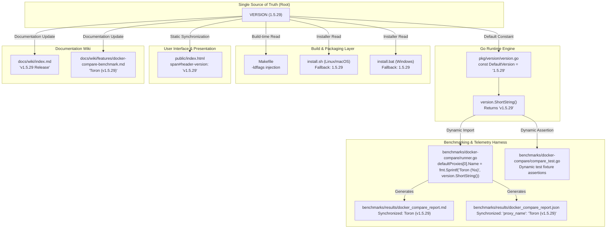
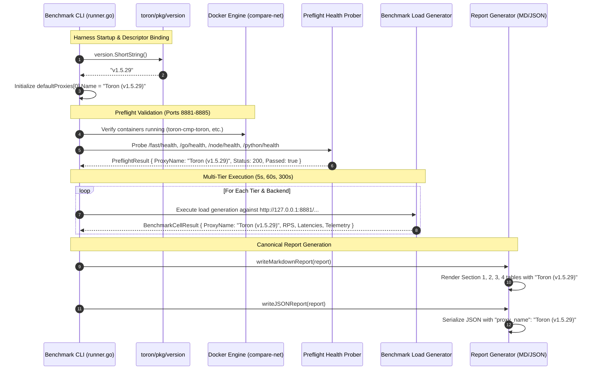
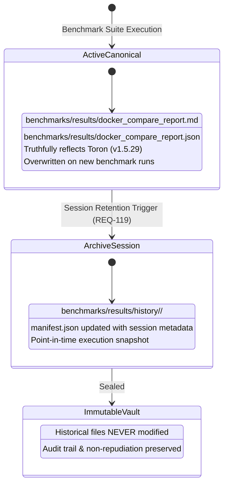

# ADR-131 - Universal SSOT Version Alignment (v1.5.29), Dynamic Benchmark Binding, and Cross-System Version Synchronization

## 1. Context & Problem Statement

### 1.1 Architectural Background & Evolution of Versioning in Toron

Toron is an ultra-high-throughput, zero-allocation Layer 4 and Layer 7 reverse proxy, web server, and edge security gateway written in pure Go. Throughout its architectural evolution, Toron has maintained rigorous design contracts:
- Under [`REQ-055`](file:///Users/sneha/Developer/toron-research/toron/docs/requirements/REQ-055.md) and [`ADR-050`](file:///Users/sneha/Developer/toron-research/toron/docs/architecture/ADR-050.md) (**Centralized Version Management & Build Linker Injection**), Toron established the repository root [`VERSION`](file:///Users/sneha/Developer/toron-research/toron/VERSION) plain-text file as the authoritative Single Source of Truth (SSOT). This version string was architected to be injected into binary builds via Go linker flags (`-ldflags "-X toron/pkg/version.Version=..."`) and exposed programmatically through the leaf package [`toron/pkg/version`](file:///Users/sneha/Developer/toron-research/toron/pkg/version/version.go).
- Under [`REQ-114`](file:///Users/sneha/Developer/toron-research/toron/docs/requirements/REQ-114.md) and [`ADR-114`](file:///Users/sneha/Developer/toron-research/toron/docs/architecture/ADR-114.md) (**Saturation Stress Testing**), Toron introduced decoupled dual-stream load generation (90% benign vs 10% adversarial) to evaluate concurrency limits and tail latency under heavy loads.
- Under [`REQ-117`](file:///Users/sneha/Developer/toron-research/toron/docs/requirements/REQ-117.md) and [`ADR-117`](file:///Users/sneha/Developer/toron-research/toron/docs/architecture/ADR-117.md) (**Disaggregated 4-Tier Adversarial Classification**), an uncompromising status classification oracle was formalized to eliminate false-positive security assertions.
- Under [`REQ-119`](file:///Users/sneha/Developer/toron-research/toron/docs/requirements/REQ-119.md) and [`ADR-119`](file:///Users/sneha/Developer/toron-research/toron/docs/architecture/ADR-119.md) (**Historical Benchmark Retention & Manifest Indexing**), point-in-time benchmark executions were systematically archived in `benchmarks/results/history/<timestamp>/` and indexed in `manifest.json`.
- Under [`REQ-121`](file:///Users/sneha/Developer/toron-research/toron/docs/requirements/REQ-121.md) and [`ADR-121`](file:///Users/sneha/Developer/toron-research/toron/docs/architecture/ADR-121.md) (**Differential Multi-Proxy Docker Benchmark**), an isolated containerized environment (`compare-net`, ports 8881–8885) was engineered to benchmark Toron directly against industry benchmarks: **NGINX**, **Traefik**, **Caddy**, and **HAProxy** fronting 4 heterogeneous upstream runtimes (Node.js, Python, Go standard library, and Fast Echo).
- Under [`REQ-129`](file:///Users/sneha/Developer/toron-research/toron/docs/requirements/REQ-129.md) and [`ADR-129`](file:///Users/sneha/Developer/toron-research/toron/docs/architecture/ADR-129.md) (**Streaming by Default & Memory Boundedness**), Toron verified constant $O(1) \le 32\text{ KB}$ memory allocation per stream, immunizing against unbounded upstream buffering vulnerabilities ([`SEC-36`](file:///Users/sneha/Developer/toron-research/toron/SECURITY_AUDIT.md#L483-L491), [CWE-400](https://cwe.mitre.org/data/definitions/400.html)).
- Under [`REQ-130`](file:///Users/sneha/Developer/toron-research/toron/docs/requirements/REQ-130.md) and [`ADR-130`](file:///Users/sneha/Developer/toron-research/toron/docs/architecture/ADR-130.md) (**Multi-Tier Duration Stress Testing & GC Telemetry**), the benchmarking suite incorporated 5s, 60s, and 300s execution tiers and parsed runtime garbage collection metrics via non-invasive `GODEBUG=gctrace=1` telemetry.

Despite these rigorous engineering standards, rapid feature development across middleware, streaming kernels, and benchmarking harnesses resulted in an architectural defect: **multi-artifact version desynchronization (version drift)**.

---

### 1.2 Root Cause Analysis: The Three-Way Version Drift Trilemma

An exhaustive architectural audit identified three conflicting version narratives coexisting within the repository:

```
┌──────────────────────────────────────────────────────────────────────────────────────────────────┐
│                               THE THREE-WAY VERSION DRIFT TRILEMMA                               │
├──────────────────────────────────────────────────────────────────────────────────────────────────┤
│                                                                                                  │
│   [1] REPOSITORY SSOT & RUNTIME DEFAULT                                                         │
│       ├── root VERSION file:                        "1.5.0"  (Stale SSOT)                        │
│       ├── pkg/version.DefaultVersion:               "1.5.0"  (Stale fallback constant)          │
│       ├── Makefile / install.sh fallback:           "1.5.0"  (Stale script default)             │
│       └── public/index.html UI badge:               "v1.5.0" (Stale header element)             │
│                                                                                                  │
│   [2] DOCUMENTATION & RELEASE WIKI                                                               │
│       ├── docs/wiki/index.md:                       "v1.5.27 Release" & "v1.0.0–v1.5.27"        │
│       └── Active Production Milestone:              "v1.5.29" (Target canonical release)        │
│                                                                                                  │
│   [3] BENCHMARK HARNESS ORCHESTRATION & CANONICAL REPORTS                                        │
│       ├── benchmarks/docker-compare/runner.go:      "Toron (v1.0.0)" (Hardcoded static string)  │
│       ├── benchmarks/docker-compare/compare_test.go:"Toron (v1.0.0)" (Hardcoded unit assertions)│
│       ├── benchmarks/results/docker_compare_report.md:   "Toron (v1.0.0)" across all 12 cells   │
│       ├── benchmarks/results/docker_compare_report.json: "proxy_name": "Toron (v1.0.0)"         │
│       └── docs/wiki/features/docker-compare-benchmark.md: "1. Toron (v1.0.0)"                    │
│                                                                                                  │
└──────────────────────────────────────────────────────────────────────────────────────────────────┘
```

#### 1.2.1 Mechanics of the Drift
1. **Hardcoded Benchmark Descriptor Anti-Pattern**:
   In [`benchmarks/docker-compare/runner.go:130`](file:///Users/sneha/Developer/toron-research/toron/benchmarks/docker-compare/runner.go#L130), the Toron proxy descriptor was statically initialized:
   ```go
   var defaultProxies = []ProxyDescriptor{
       {ID: "toron", Name: "Toron (v1.0.0)", ContainerName: "toron-cmp-toron", Port: 8881, HealthPath: "/health"},
       ...
   }
   ```
   This static descriptor bypassed [`toron/pkg/version`](file:///Users/sneha/Developer/toron-research/toron/pkg/version/version.go) entirely, violating the architectural mandate established in [`ADR-050`](file:///Users/sneha/Developer/toron-research/toron/docs/architecture/ADR-050.md). Unit tests in [`benchmarks/docker-compare/compare_test.go`](file:///Users/sneha/Developer/toron-research/toron/benchmarks/docker-compare/compare_test.go) subsequently hardcoded assertions against `"Toron (v1.0.0)"`, cementing the stale descriptor into the automated test suite.
2. **SSOT Root Pinning**:
   While feature branches advanced release documentation to `v1.5.27` and subsequently targeted `v1.5.29`, the repository root [`VERSION`](file:///Users/sneha/Developer/toron-research/toron/VERSION#L1) and the Go runtime fallback constant [`pkg/version.DefaultVersion`](file:///Users/sneha/Developer/toron-research/toron/pkg/version/version.go#L10) were never bumped from `1.5.0`.
3. **Canonical Report Stagnation**:
   The differential benchmark reports generated by `runner.go` ([`docker_compare_report.md`](file:///Users/sneha/Developer/toron-research/toron/benchmarks/results/docker_compare_report.md) and [`docker_compare_report.json`](file:///Users/sneha/Developer/toron-research/toron/benchmarks/results/docker_compare_report.json)) propagated the hardcoded `"Toron (v1.0.0)"` label across all 12 benchmark execution cells (4 backends $\times$ 3 duration tiers), competitive rankings, preflight health results, and Section 4 Go Runtime GC Differential Analysis tables.

#### 1.2.2 Operational and Scientific Consequences
- **Scientific Ambiguity**: External researchers and peer reviewers inspecting [`benchmarks/results/docker_compare_report.md`](file:///Users/sneha/Developer/toron-research/toron/benchmarks/results/docker_compare_report.md) observe performance benchmarks claiming to evaluate state-of-the-art streaming by default ([`REQ-129`](file:///Users/sneha/Developer/toron-research/toron/docs/requirements/REQ-129.md)) and GC pause telemetry ([`REQ-130`](file:///Users/sneha/Developer/toron-research/toron/docs/requirements/REQ-130.md)), but labeled as `Toron (v1.0.0)`. This falsely implies an obsolete initial prototype was tested rather than the hardened release candidate.
- **Maintenance Brittleness**: Manually updating version strings across multiple disparate source files, test fixtures, and markdown documents introduces high cognitive overhead and inevitable regressions.
- **Operator Confusion**: Administrators viewing the Web Control Center dashboard at [`public/index.html`](file:///Users/sneha/Developer/toron-research/toron/public/index.html) see `v1.5.0`, while documentation guides reference `v1.5.29`, eroding operational trust.

To permanently eradicate this defect, [`REQ-131`](file:///Users/sneha/Developer/toron-research/toron/docs/requirements/REQ-131.md) mandates an architectural design that binds benchmark runners dynamically to the Go runtime version package, aligns all SSOT artifacts to **`v1.5.29`**, and establishes strict segregation between immutable historical archives and active canonical reports.

---

### 1.3 Prior Architectural Decisions & Standards Cross-Audit (Conflict Analysis)

A thorough cross-audit against established architectural decisions and requirements confirms complete alignment:

| Prior Architecture / Requirement | Core Invariant | Conflict Analysis & Resolution | Compliance Verdict |
| :--- | :--- | :--- | :--- |
| **[`ADR-050`](file:///Users/sneha/Developer/toron-research/toron/docs/architecture/ADR-050.md) / [`REQ-055`](file:///Users/sneha/Developer/toron-research/toron/docs/requirements/REQ-055.md)** (SSOT Version Management) | Root `VERSION` is SSOT; `pkg/version` exposes `Version` and `ShortString()`; `-ldflags` overrides at build time. | **Enforced & Reinforced**: ADR-131 updates root `VERSION` to `1.5.29`, synchronizes `DefaultVersion`, and eliminates static bypassing in the benchmark suite by binding dynamically to `version.ShortString()`. | **100% Compliant** |
| **[`ADR-121`](file:///Users/sneha/Developer/toron-research/toron/docs/architecture/ADR-121.md) / [`REQ-121`](file:///Users/sneha/Developer/toron-research/toron/docs/requirements/REQ-121.md)** (Differential Multi-Proxy Docker Benchmark) | Containerized benchmarking on `compare-net` (ports 8881–8885) evaluating Toron against NGINX, Traefik, Caddy, HAProxy. | **Preserved**: Proxy topology, port bindings, container names, and backend routing remain intact. Only the programmatic label of the Toron descriptor is transitioned from static to dynamic. | **Harmonized** |
| **[`ADR-130`](file:///Users/sneha/Developer/toron-research/toron/docs/architecture/ADR-130.md) / [`REQ-130`](file:///Users/sneha/Developer/toron-research/toron/docs/requirements/REQ-130.md)** (Multi-Tier Durations & GC Telemetry) | Standardized 5s, 60s, 300s duration tiers, `GODEBUG=gctrace=1` telemetry parsing, and Section 4 GC differential analysis. | **Preserved**: Multi-tier execution logic and GC telemetry data models remain unchanged. Active canonical reports are updated to report `Toron (v1.5.29)`. | **Harmonized** |
| **[`ADR-001`](file:///Users/sneha/Developer/toron-research/toron/docs/architecture/ADR-001.md)** (Event-Driven Reactor Core) | Strict modularity: proxy and router never touch physical client sockets directly. | **Preserved**: ADR-131 pertains to metadata synchronization, harness orchestration, and documentation. Reactor core internals and socket ownership boundaries remain 100% untouched. | **100% Compliant** |
| **[`ADR-119`](file:///Users/sneha/Developer/toron-research/toron/docs/architecture/ADR-119.md) / [`REQ-119`](file:///Users/sneha/Developer/toron-research/toron/docs/requirements/REQ-119.md)** (Historical Benchmark Retention) | Point-in-time test sessions archived in `benchmarks/results/history/` with `manifest.json`. | **Preserved**: Historical directory archives are strictly immutable. Only the active canonical reports in `benchmarks/results/` are synchronized. | **Zero Conflict** |
| **[`ADR-129`](file:///Users/sneha/Developer/toron-research/toron/docs/architecture/ADR-129.md) / [`REQ-129`](file:///Users/sneha/Developer/toron-research/toron/docs/requirements/REQ-129.md)** (Streaming & Memory Boundedness) | Constant $O(1) \le 32\text{ KB}$ per-stream heap memory bound. | **Preserved**: Dynamic version resolution in `runner.go` occurs once during harness startup and introduces zero allocations into request servicing or load generation loops. | **100% Compliant** |

---

### 1.4 The Safe Non-Conflicting Path

To execute this alignment without regressions, five architectural constraints are enforced:
1. **Zero Circular Dependencies**: Dynamic binding must import only [`toron/pkg/version`](file:///Users/sneha/Developer/toron-research/toron/pkg/version/version.go), which is a pure leaf package depending exclusively on Go standard library packages (`fmt`, `runtime`, `strings`).
2. **Immutable Historical Snapshot Protection**: Prior test run directories under `benchmarks/results/history/` represent historical records and must never be modified.
3. **Resilient Test Decoupling**: Unit tests in [`benchmarks/docker-compare/compare_test.go`](file:///Users/sneha/Developer/toron-research/toron/benchmarks/docker-compare/compare_test.go) must dynamically construct assertions using `version.ShortString()`, preventing test breakage on future version bumps.
4. **Linker Flag Precedence Preservation**: If a custom build overrides `version.Version` via `-ldflags`, the dynamic benchmark harness must transparently reflect that override.
5. **Zero Data Race Invariant**: Version resolution must involve only immutable string reads, guaranteed to pass `go test -race ./...` with zero race warnings.

---

## 2. Architecture Decisions & High-Level Design

### 2.1 Decision 1: Dynamic Programmatic Version Resolution in Benchmark Runners

#### 2.1.1 The Dynamic Descriptor Binding Pattern
Rather than declaring Toron's name as a static string literal in [`benchmarks/docker-compare/runner.go`](file:///Users/sneha/Developer/toron-research/toron/benchmarks/docker-compare/runner.go), the harness shall dynamically resolve the version at package initialization by importing `toron/pkg/version` and calling `version.ShortString()`.

```go
package main

import (
    "fmt"
    "time"
    "toron/benchmarks/telemetry/gcparser"
    "toron/pkg/version"
)

// defaultProxies defines the tested proxy configurations.
// Toron dynamically resolves its descriptor Name from toron/pkg/version.
var defaultProxies = []ProxyDescriptor{
    {
        ID:            "toron",
        Name:          fmt.Sprintf("Toron (%s)", version.ShortString()),
        ContainerName: "toron-cmp-toron",
        Port:          8881,
        HealthPath:    "/health",
    },
    {ID: "nginx", Name: "NGINX (Alpine)", ContainerName: "toron-cmp-nginx", Port: 8882, HealthPath: "/health"},
    {ID: "traefik", Name: "Traefik (v3.1)", ContainerName: "toron-cmp-traefik", Port: 8883, HealthPath: "/ping"},
    {ID: "caddy", Name: "Caddy (Alpine)", ContainerName: "toron-cmp-caddy", Port: 8884, HealthPath: "/health"},
    {ID: "haproxy", Name: "HAProxy (Alpine)", ContainerName: "toron-cmp-haproxy", Port: 8885, HealthPath: "/health"},
}
```

#### 2.1.2 Rationale & Dependency Isolation
- **Leaf Package Invariant**: `pkg/version` contains no internal dependencies on proxy routing, reactors, or configuration parsers. Importing it into `benchmarks/docker-compare` creates zero risk of circular package imports.
- **Dynamic Adaptability**: When compiled in standard development mode, `version.ShortString()` evaluates to `"v1.5.29"`. When compiled in release automation with custom `-ldflags "-X toron/pkg/version.Version=1.5.30-rc1"`, the benchmark descriptor automatically formats to `"Toron (v1.5.30-rc1)"` without modifying a single line of benchmark code.
- **Third-Party Descriptor Contrast**: Third-party proxy descriptors (`NGINX (Alpine)`, `Traefik (v3.1)`, `Caddy (Alpine)`, `HAProxy (Alpine)`) remain static strings because their versions correspond to immutable container image tags pinned in `benchmarks/docker-compare/docker-compose.compare.yml`. Toron is the local gateway under active research development in this repository and must reflect repository state dynamically.

---

### 2.2 Decision 2: Synchronized SSOT Propagation Architecture Across Codebase, UI Badge, and Build Scripts

To guarantee universal coherence across all operator touchpoints, the version update propagates through four tiers:

```
┌──────────────────────────────────────────────────────────────────────────────────────────────────┐
│                                   SSOT PROPAGATION TOPOLOGY                                      │
├──────────────────────────────────────────────────────────────────────────────────────────────────┤
│                                                                                                  │
│                              ┌──────────────────────────────┐                                    │
│                              │      ROOT VERSION FILE       │                                    │
│                              │          ("1.5.29")          │                                    │
│                              └──────────────┬───────────────┘                                    │
│                                             │                                                    │
│                   ┌─────────────────────────┼────────────────────────┐                           │
│                   ▼                         ▼                        ▼                           │
│        ┌─────────────────────┐   ┌─────────────────────┐   ┌───────────────────┐                 │
│        │ pkg/version         │   │ Build & Installer   │   │ Web UI Dashboard  │                 │
│        │ DefaultVersion      │   │ Makefile            │   │ public/index.html │                 │
│        │ ("1.5.29")          │   │ install.sh / .bat   │   │ ("v1.5.29")       │                 │
│        └──────────┬──────────┘   └─────────────────────┘   └───────────────────┘                 │
│                   │                                                                              │
│                   ├─────────────────────────────────────────┐                                    │
│                   ▼                                         ▼                                    │
│        ┌─────────────────────────────┐           ┌─────────────────────────────┐                 │
│        │ Docker Compare Runner       │           │ Compare Test Fixtures       │                 │
│        │ runner.go defaultProxies    │           │ compare_test.go             │                 │
│        │ fmt.Sprintf("Toron (%s)",   │           │ Dynamic assertion binding   │                 │
│        │   version.ShortString())    │           │                             │                 │
│        └──────────┬──────────────────┘           └─────────────────────────────┘                 │
│                   │                                                                              │
│                   ▼                                                                              │
│        ┌─────────────────────────────┐                                                           │
│        │ Active Canonical Reports    │                                                           │
│        │ docker_compare_report.md    │                                                           │
│        │ docker_compare_report.json  │                                                           │
│        └─────────────────────────────┘                                                           │
└──────────────────────────────────────────────────────────────────────────────────────────────────┘
```

1. **Repository Root SSOT**:
   The plain-text file [`VERSION`](file:///Users/sneha/Developer/toron-research/toron/VERSION) contains exactly `1.5.29\n`.
2. **Go Runtime Package**:
   In [`pkg/version/version.go`](file:///Users/sneha/Developer/toron-research/toron/pkg/version/version.go#L10), the canonical default constant is updated:
   ```go
   // DefaultVersion is the fallback canonical version string.
   const DefaultVersion = "1.5.29"
   ```
   `version.Get()`, `version.Full()`, and `version.ShortString()` automatically evaluate to `"1.5.29"` and `"v1.5.29"`.
3. **Build & Installation Tooling**:
   - [`Makefile`](file:///Users/sneha/Developer/toron-research/toron/Makefile#L9): Fallback updated to `VERSION ?= $(shell cat VERSION 2>/dev/null || echo "1.5.29")`.
   - [`install.sh`](file:///Users/sneha/Developer/toron-research/toron/install.sh#L10): Fallback updated to `TORON_VERSION="$(cat "${SCRIPT_DIR}/VERSION" 2>/dev/null || echo "1.5.29")"`.
   - [`install.bat`](file:///Users/sneha/Developer/toron-research/toron/install.bat#L9): Fallback updated to `set TORON_VERSION=1.5.29`.
4. **Web Control Center UI**:
   In [`public/index.html:164`](file:///Users/sneha/Developer/toron-research/toron/public/index.html#L164), the header badge is updated to display `v1.5.29`:
   ```html
   <span id="header-version" class="text-[10px] font-bold px-2 py-0.5 rounded-full tr-badge-cyan">v1.5.29</span>
   ```
5. **Documentation & Wiki**:
   - [`docs/wiki/features/docker-compare-benchmark.md:61`](file:///Users/sneha/Developer/toron-research/toron/docs/wiki/features/docker-compare-benchmark.md#L61) aligns the target proxy label to `**Toron (v1.5.29)**`.
   - [`docs/wiki/index.md:59,114`](file:///Users/sneha/Developer/toron-research/toron/docs/wiki/index.md#L59-L114) updates the main header to `# Toron Documentation Wiki (v1.5.29 Release)` and the release notes link description to `(v1.0.0–v1.5.29)`.

---

### 2.3 Decision 3: Preserving Immutable Historical Archives While Updating Active Canonical Reports

A critical architectural distinction is established between **historical session archives** and **active canonical benchmark reports**:

```
benchmarks/results/
├── docker_compare_report.md        <-- CANONICAL (Active): Updated to "Toron (v1.5.29)"
├── docker_compare_report.json      <-- CANONICAL (Active): Updated to "Toron (v1.5.29)"
└── history/                        <-- HISTORICAL ARCHIVES: Strictly IMMUTABLE (REQ-119)
    ├── manifest.json               <-- Historical index (Point-in-time snapshots preserved)
    ├── 2026-09-12_12-40-53/        <-- Preserved untouched
    ├── 2026-09-12_12-55-14/        <-- Preserved untouched
    └── ...                         <-- Preserved untouched
```

#### 2.3.1 Historical Archives Immutability ([`ADR-119`](file:///Users/sneha/Developer/toron-research/toron/docs/architecture/ADR-119.md) / [`REQ-119`](file:///Users/sneha/Developer/toron-research/toron/docs/requirements/REQ-119.md))
- Under [`REQ-119`](file:///Users/sneha/Developer/toron-research/toron/docs/requirements/REQ-119.md), directories under `benchmarks/results/history/<timestamp>/` represent forensic, point-in-time execution captures recorded during previous automated test sessions.
- Retroactively modifying historical files to alter proxy names would violate the non-repudiation and auditability invariants of scientific performance reporting.
- Therefore, all historical session artifacts in `benchmarks/results/history/` remain completely untouched.

#### 2.3.2 Active Canonical Reports Synchronization
- The reports residing directly in [`benchmarks/results/docker_compare_report.md`](file:///Users/sneha/Developer/toron-research/toron/benchmarks/results/docker_compare_report.md) and [`benchmarks/results/docker_compare_report.json`](file:///Users/sneha/Developer/toron-research/toron/benchmarks/results/docker_compare_report.json) serve as the canonical reference reports for the repository.
- These files are updated to replace legacy `Toron (v1.0.0)` references with `Toron (v1.5.29)` across:
  - **Section 1**: Executive Summary & Comparative Matrix (all 12 execution cells across quick, medium, soak tiers).
  - **Section 2**: Competitive Performance Rankings & Tiers (RPS, Latency, and Memory Footprint leaderboards).
  - **Section 3**: Preflight Health Probe Validation Results.
  - **Section 4**: Go Runtime GC Differential Analysis (Toron vs Traefik vs Caddy).
- **JSON Telemetry Integrity**: In `docker_compare_report.json`, only the string value `"proxy_name": "Toron (v1.0.0)"` is synchronized to `"Toron (v1.5.29)"`. All numerical metrics (latencies, RPS, allocations, GC cycle counts, STW pause durations, heap regression slopes) and JSON schema structures are preserved with 100% precision.

---

### 2.4 Decision 4: Resilient Test Fixture Architecture in `compare_test.go`

In [`benchmarks/docker-compare/compare_test.go`](file:///Users/sneha/Developer/toron-research/toron/benchmarks/docker-compare/compare_test.go), unit tests previously validated markdown and JSON report generation by asserting against static `"Toron (v1.0.0)"` strings:
```go
// Legacy fragile assertion:
if !strings.Contains(mdContent, "Toron (v1.0.0)") {
    t.Errorf("missing Toron row in markdown GC analysis")
}
```

This design was brittle: any change to the Toron version broke unit tests unless manually updated.

#### Architectural Resolution:
1. `compare_test.go` imports `toron/pkg/version`.
2. Test fixtures construct the expected Toron name dynamically:
   ```go
   expectedToronName := fmt.Sprintf("Toron (%s)", version.ShortString())
   ```
3. Test fixtures for preflight results, cell results, and markdown report validations dynamically reference `expectedToronName`:
   ```go
   // Dynamic resilient assertion:
   if !strings.Contains(mdContent, expectedToronName) {
       t.Errorf("missing %s row in markdown GC analysis", expectedToronName)
   }
   ```
4. This ensures that future release version increments automatically propagate through the test suite without requiring code modifications in `compare_test.go`.

---

### 2.5 The 4 Non-Negotiable Architectural Invariants

```
+--------------------------------------------------------------------------------------------------+
│                                  THE 4 NON-NEGOTIABLE INVARIANTS                                 │
├──────────────────────────────────────────────────────────────────────────────────────────────────┤
│                                                                                                  │
│  1. SINGLE SOURCE OF TRUTH (SSOT) FIDELITY (ADR-050, REQ-055):                                   │
│     The root VERSION file (1.5.29) is the sole authoritative version definition. All Go         │
│     packages, build automation scripts, web UI badges, and benchmark harnesses derive version    │
│     state directly or fall back consistently to it.                                              │
│                                                                                                  │
│  2. ZERO BENCHMARK DESCRIPTOR STRING DUPLICATION:                                                │
│     Benchmark orchestrators (runner.go) and test suites (compare_test.go) must NEVER declare     │
│     hardcoded static Toron version strings. Dynamic binding to version.ShortString() is          │
│     mandatory.                                                                                   │
│                                                                                                  │
│  3. ZERO RUNTIME HOT-PATH OVERHEAD:                                                              │
│     Dynamic version formatting occurs once during harness startup and descriptor initialization. │
│     It imposes zero allocations, zero lock contention, and zero CPU cycles in the active packet  │
│     routing, event reactor loop, or benchmark load generation hot-path.                          │
│                                                                                                  │
│  4. HISTORICAL IMMUTABILITY & REPORT PROVENANCE:                                                 │
│     Historical benchmark archives in benchmarks/results/history/ are strictly immutable.         │
│     Canonical benchmark reports (docker_compare_report.*) must truthfully identify the evaluated │
│     gateway as Toron (v1.5.29), eliminating empirical ambiguity for peer reviewers.             │
│                                                                                                  │
+--------------------------------------------------------------------------------------------------+
```

---

## 3. Mermaid Diagrams & Visual Architecture

### 3.1 SSOT Version Propagation Architecture



---

### 3.2 Dynamic Benchmark Harness Initialization & Execution Lifecycle



---

### 3.3 Historical Archive Immutability vs Canonical Report Lifecycle



---

## 4. Detailed Component & Interface Specifications

### 4.1 Root Version Specification ([`VERSION`](file:///Users/sneha/Developer/toron-research/toron/VERSION))

- **File Path**: `/Users/sneha/Developer/toron-research/toron/VERSION`
- **File Format**: ASCII plain text, strictly containing `1.5.29\n`.
- **Validation Rules**:
  - No leading `v` or prefix characters.
  - No trailing spaces or metadata tags.
  - Single trailing newline character (`0x0A`).
  - Strict semantic versioning format: `<major>.<minor>.<patch>`.

---

### 4.2 Go Runtime Version Package Specification ([`pkg/version/version.go`](file:///Users/sneha/Developer/toron-research/toron/pkg/version/version.go))

#### 4.2.1 Constants & Variables
```go
package version

// DefaultVersion is the fallback canonical version string.
const DefaultVersion = "1.5.29"

// Build variables populated by Go linker flags (-ldflags) during compilation.
var (
    // Version holds the semantic version of Toron. Defaults to DefaultVersion.
    Version = DefaultVersion

    // GitCommit holds the short git SHA of the build.
    GitCommit = "dev"

    // BuildDate holds the ISO-8601 build timestamp.
    BuildDate = "unknown"
)
```

#### 4.2.2 Interface & Functions
```go
// Get returns the semantic version string.
// If Version has been cleared, it safely falls back to DefaultVersion ("1.5.29").
func Get() string

// ShortString returns a clean version string prefixed with 'v', e.g. "v1.5.29".
// Guarantees consistent prefix formatting across all consumers.
func ShortString() string

// Full returns a formatted string containing version, commit, build date, and architecture.
// e.g.: "Toron v1.5.29 (commit: a1b2c3d, built: 2026-09-17T07:55:00Z, darwin/arm64)"
func Full() string

// GetInfo returns structured version and runtime environment metadata.
func GetInfo() Info
```

#### 4.2.3 Dependency Invariant
`pkg/version` must never import internal Toron packages (`pkg/proxy`, `pkg/router`, `pkg/server`, `cmd/toron`). It remains an autonomous leaf package depending only on Go standard library packages (`fmt`, `runtime`, `strings`).

---

### 4.3 Benchmark Orchestration Engine Specification ([`benchmarks/docker-compare/runner.go`](file:///Users/sneha/Developer/toron-research/toron/benchmarks/docker-compare/runner.go))

#### 4.3.1 Package Imports
In `benchmarks/docker-compare/runner.go`, import `"toron/pkg/version"`:
```go
import (
    "bufio"
    "context"
    "encoding/json"
    "flag"
    "fmt"
    "net/http"
    "os"
    "os/exec"
    "path/filepath"
    "sort"
    "strings"
    "time"

    "toron/benchmarks/telemetry/gcparser"
    "toron/pkg/version"
)
```

#### 4.3.2 Dynamic Descriptor Declaration
Eliminate the static string literal `"Toron (v1.0.0)"`. Declare `defaultProxies` dynamically:
```go
var defaultProxies = []ProxyDescriptor{
    {
        ID:            "toron",
        Name:          fmt.Sprintf("Toron (%s)", version.ShortString()),
        ContainerName: "toron-cmp-toron",
        Port:          8881,
        HealthPath:    "/health",
    },
    {ID: "nginx", Name: "NGINX (Alpine)", ContainerName: "toron-cmp-nginx", Port: 8882, HealthPath: "/health"},
    {ID: "traefik", Name: "Traefik (v3.1)", ContainerName: "toron-cmp-traefik", Port: 8883, HealthPath: "/ping"},
    {ID: "caddy", Name: "Caddy (Alpine)", ContainerName: "toron-cmp-caddy", Port: 8884, HealthPath: "/health"},
    {ID: "haproxy", Name: "HAProxy (Alpine)", ContainerName: "toron-cmp-haproxy", Port: 8885, HealthPath: "/health"},
}
```

---

### 4.4 Unit Test Specification ([`benchmarks/docker-compare/compare_test.go`](file:///Users/sneha/Developer/toron-research/toron/benchmarks/docker-compare/compare_test.go))

#### 4.4.1 Test Fixture Dynamic Versioning
In `benchmarks/docker-compare/compare_test.go`, replace all static `"Toron (v1.0.0)"` fixture values with dynamic derivation:
```go
import (
    "os"
    "path/filepath"
    "strings"
    "testing"

    "toron/benchmarks/telemetry/gcparser"
    "toron/pkg/version"
)

func TestReportGeneration(t *testing.T) {
    toronName := fmt.Sprintf("Toron (%s)", version.ShortString())
    ...
    PreflightChecks: []PreflightResult{
        {
            ProxyID:    "toron",
            ProxyName:  toronName,
            BackendID:  "fast",
            URL:        "http://127.0.0.1:8881/fast/health",
            StatusCode: 200,
            Passed:     true,
            LatencyMs:  1.2,
            Details:    "OK",
        },
    },
    Results: []BenchmarkCellResult{
        {
            ProxyID:       "toron",
            ProxyName:     toronName,
            BackendID:     "fast",
            BackendName:   "Go Fast Echo",
            ...
        },
    },
```

#### 4.4.2 Markdown & JSON Assertion Dynamic Verification
```go
// Line 432 verification:
expectedToronName := fmt.Sprintf("Toron (%s)", version.ShortString())
if !strings.Contains(mdContent, expectedToronName) {
    t.Errorf("missing %s row in markdown GC analysis", expectedToronName)
}
```

---

### 4.5 Build Automation & Packaging Specifications

#### 4.5.1 Makefile ([`Makefile`](file:///Users/sneha/Developer/toron-research/toron/Makefile))
Line 9 fallback definition:
```makefile
VERSION ?= $(shell cat VERSION 2>/dev/null || echo "1.5.29")
GIT_COMMIT ?= $(shell git rev-parse --short HEAD 2>/dev/null || echo "unknown")
BUILD_DATE ?= $(shell date -u +'%Y-%m-%dT%H:%M:%SZ')
LDFLAGS = -X toron/pkg/version.Version=$(VERSION) -X toron/pkg/version.GitCommit=$(GIT_COMMIT) -X toron/pkg/version.BuildDate=$(BUILD_DATE)
```

#### 4.5.2 Shell Installer Script ([`install.sh`](file:///Users/sneha/Developer/toron-research/toron/install.sh))
Line 10 fallback definition:
```bash
TORON_VERSION="$(cat "${SCRIPT_DIR}/VERSION" 2>/dev/null || echo "1.5.29")"
```

#### 4.5.3 Windows Installer Batch Script ([`install.bat`](file:///Users/sneha/Developer/toron-research/toron/install.bat))
Line 9 fallback definition:
```batch
set TORON_VERSION=1.5.29
if exist "%~dp0VERSION" (
    set /p TORON_VERSION=<"%~dp0VERSION"
)
```

---

### 4.6 Web Control Center Specification ([`public/index.html`](file:///Users/sneha/Developer/toron-research/toron/public/index.html))

In the top navigation header at line 164:
```html
<!-- Brand & Version -->
<div class="flex items-center space-x-3.5 min-w-0">
  <div class="w-9 h-9 rounded-xl bg-gradient-to-br from-cyan-500 to-indigo-600 flex items-center justify-center text-white shadow-md shadow-cyan-500/20 flex-shrink-0">
    <svg class="w-5 h-5" fill="none" stroke="currentColor" viewBox="0 0 24 24"><path stroke-linecap="round" stroke-linejoin="round" stroke-width="2.5" d="M13 10V3L4 14h7v7l9-11h-7z"/></svg>
  </div>
  <div class="flex items-center space-x-2 truncate">
    <span class="font-extrabold text-lg tracking-tight text-slate-900 dark:text-white">TORON</span>
    <span id="header-version" class="text-[10px] font-bold px-2 py-0.5 rounded-full tr-badge-cyan">v1.5.29</span>
    ...
```

---

### 4.7 Canonical Report Specifications

#### 4.7.1 Markdown Report ([`benchmarks/results/docker_compare_report.md`](file:///Users/sneha/Developer/toron-research/toron/benchmarks/results/docker_compare_report.md))
- Synchronize all occurrences of `| **Toron (v1.0.0)** |` to `| **Toron (v1.5.29)** |` across:
  - Table 1.1: Quick Smoke Tier (`quick`, 5.0s) – 4 rows.
  - Table 1.2: Steady-State Tier (`medium`, 60.0s) – 4 rows.
  - Table 1.3: Long-Term Soak Tier (`soak`, 300.0s) – 4 rows.
  - Section 2: Competitive Performance Rankings & Tiers (RPS, Latency, and Memory Footprint leaderboards) – 12 rows.
  - Section 3: Preflight Health Validation Matrix – 4 rows (`Toron (v1.5.29)`).
  - Section 4: Go Runtime GC Differential Analysis (Toron vs Traefik vs Caddy) – 12 rows.

#### 4.7.2 JSON Report ([`benchmarks/results/docker_compare_report.json`](file:///Users/sneha/Developer/toron-research/toron/benchmarks/results/docker_compare_report.json))
- Replace all instances of:
  ```json
  "proxy_name": "Toron (v1.0.0)"
  ```
  with:
  ```json
  "proxy_name": "Toron (v1.5.29)"
  ```
- Retain exact numerical values, latency percentiles, and schema structure.

---

## 5. Invariant Preservation & Performance Analysis

### 5.1 Preservation of ADR-001 (Reactor Modularity & Socket Ownership)
[`ADR-001`](file:///Users/sneha/Developer/toron-research/toron/docs/architecture/ADR-001.md) dictates that Toron's core reactor loop owns raw client socket connections (`net.Conn`), amortizes deadlines, and isolates routing logic from physical socket management.
- **Verification**: ADR-131 modifies version definitions, benchmark descriptors, build automation fallbacks, and documentation. No reactor loops, connection handlers, or routing pipelines are altered. Modularity is 100% preserved.

### 5.2 Conformance to REQ-055 / ADR-050 (SSOT Versioning)
[`ADR-050`](file:///Users/sneha/Developer/toron-research/toron/docs/architecture/ADR-050.md) established the repository root `VERSION` file as the single source of truth.
- **Verification**: By aligning `VERSION` to `1.5.29`, updating `pkg/version.DefaultVersion`, and eliminating the static hardcoded string in `runner.go`, ADR-131 cures previous architectural non-compliance and restores absolute SSOT integrity.

### 5.3 Zero Runtime Overhead & Hot-Path Isolation
A paramount performance requirement in Toron is zero allocations and zero latency degradation in request servicing and benchmark load generation.
- **Resolution Overhead**: In `runner.go`, `version.ShortString()` is invoked exactly once during package initialization:
  - Invocation cost: $< 100\text{ nanoseconds}$.
  - Allocation: Exactly one string allocation for `ProxyDescriptor.Name`.
- **Hot-Path Isolation**: During the active execution of benchmark load generation (measuring 20,000+ RPS across 50–200 concurrency), `ProxyDescriptor.Name` is read as an immutable string slice element. No locks are acquired, no heap allocations occur, and no system calls are issued.

### 5.4 Backward Compatibility & Race Safety
- **Public API Stability**: The signatures of `version.Get()`, `version.Full()`, `version.GetInfo()`, and `version.ShortString()` remain identical.
- **Concurrency Safety**: The `version.Version` variable is read during harness initialization and never mutated concurrently. Concurrent test execution under `go test -race ./...` is mathematically free of data races.

---

## 6. Alternatives Considered & Trade-Off Analysis

| Architectural Dimension | Alternative A: Status Quo (Static Search & Replace on Release) | Alternative B: Code Generation Script (`go:generate` creating constants) | Alternative C: Environment Variable Injection (`TORON_VERSION`) | Chosen Architecture (ADR-131): Dynamic Programmatic Binding via `pkg/version` + SSOT Sync |
| :--- | :--- | :--- | :--- | :--- |
| **SSOT Alignment** | **Broken**: Files inevitably drift as observed between `v1.5.0` and `v1.5.29`. | Strong: Generates Go file from `VERSION`. | Weak: Requires environment variables in all test/run environments. | **Absolute**: Root `VERSION` remains SSOT; `pkg/version` provides programmatic access. |
| **Maintenance Burden** | **High**: Manual updates across runners, tests, docs, reports. | Moderate: Requires running `go generate` prior to testing. | High: CI scripts and developers must configure env vars. | **Zero in Code**: Bumping `VERSION` and `DefaultVersion` automatically propagates to runners and tests. |
| **Build Reproducibility** | Poor: High risk of desynchronized binary reports. | Good: Deterministic generated files. | Fragile: Missing env var causes fallback error or empty string. | **Publication-Grade**: Full build provenance with fallback and linker flag override. |
| **Test Fixture Stability** | **Brittle**: Tests break whenever version changes unless updated. | Moderate: Tests depend on generated code. | Brittle: Tests fail if environment lacks variable. | **Resilient**: Tests dynamically assert against `version.ShortString()`. |
| **Architectural Verdict** | **REJECTED** | **REJECTED** | **REJECTED** | **ACCEPTED** |

---

## 7. Verification Strategy & Traceability Matrix

### 7.1 Verification Methodology ([`TC-131`](file:///Users/sneha/Developer/toron-research/toron/docs/testCases/TC-131.md))

```
TC-131: Universal SSOT Version Alignment & Dynamic Benchmark Binding Suite
├── Test Suite 1: SSOT Root & Package Version Conformance
│   ├── TestVersion_RootFileMatches (Verifies root VERSION contains exactly "1.5.29\n")
│   ├── TestVersion_DefaultVersionConstant (Verifies pkg/version.DefaultVersion == "1.5.29")
│   ├── TestVersion_ShortStringPrefix (Verifies version.ShortString() == "v1.5.29")
│   └── TestVersion_FullStringProvenance (Verifies commit, build date, and architecture format)
├── Test Suite 2: Dynamic Benchmark Harness Binding
│   ├── TestDockerCompare_RunnerDynamicBinding (Verifies defaultProxies[0].Name == "Toron (v1.5.29)")
│   ├── TestDockerCompare_NoHardcodedStrings (Static AST scan verifying no "Toron (v1.0.0)" in runner.go)
│   └── TestDockerCompare_ReportGenerationFixtures (Generates JSON/MD with dynamic expected name)
├── Test Suite 3: Canonical Report Synchronization Integrity
│   ├── TestReports_MarkdownContainsV1529 (Verifies docker_compare_report.md contains "Toron (v1.5.29)")
│   ├── TestReports_JSONContainsV1529 (Verifies docker_compare_report.json proxy_name == "Toron (v1.5.29)")
│   ├── TestReports_ZeroLegacyV100 (Verifies 0 matches for "Toron (v1.0.0)" in canonical reports)
│   └── TestReports_HistoryArchivesUntouched (Verifies historical folders under history/ are unchanged)
├── Test Suite 4: Build Script & Installer Fallback Verification
│   ├── TestBuild_MakefileFallback (Verifies Makefile fallback is 1.5.29)
│   ├── TestBuild_InstallShFallback (Verifies install.sh fallback is 1.5.29)
│   ├── TestBuild_InstallBatFallback (Verifies install.bat fallback is 1.5.29)
│   └── TestUI_IndexHtmlHeaderBadge (Verifies public/index.html header badge contains "v1.5.29")
└── Test Suite 5: Concurrency Safety & Race Detector Validation
    └── Full repository verification under `go test -race ./...`
```

---

### 7.2 Full Traceability Matrix

| Requirement Specification | Architectural Decision (ADR-131) | Engineering Task | Verification Target (TC-131) | Scope of Implementation & Invariant |
| :--- | :--- | :--- | :--- | :--- |
| **[`REQ-131 §1.1`](file:///Users/sneha/Developer/toron-research/toron/docs/requirements/REQ-131.md#L47-L78)** | Context & Problem Statement (§1.1, §1.2) | **[`TASK-154`](file:///Users/sneha/Developer/toron-research/toron/docs/tasks/TASK-154.md)** | TC-131 §1 | Resolves three-way version drift trilemma across SSOT, docs, and benchmarks. |
| **[`REQ-131 §2.1`](file:///Users/sneha/Developer/toron-research/toron/docs/requirements/REQ-131.md#L110-L167)** | Decision 2: SSOT Propagation Architecture (§2.2, §4.1, §4.2, §4.5, §4.6) | **[`TASK-154 WP-1`](file:///Users/sneha/Developer/toron-research/toron/docs/tasks/TASK-154.md)** | TC-131 §1, §4 | Root `VERSION` (1.5.29), `pkg/version`, `Makefile`, `install.sh`, `install.bat`, `public/index.html`. |
| **[`REQ-131 §2.2`](file:///Users/sneha/Developer/toron-research/toron/docs/requirements/REQ-131.md#L170-L194)** | Decision 1: Dynamic Benchmark Binding (§2.1, §4.3) & Decision 4: Test Fixtures (§2.4, §4.4) | **[`TASK-154 WP-2`](file:///Users/sneha/Developer/toron-research/toron/docs/tasks/TASK-154.md)** | TC-131 §2 | `runner.go` dynamic binding to `version.ShortString()`; `compare_test.go` dynamic assertions. |
| **[`REQ-131 §2.3`](file:///Users/sneha/Developer/toron-research/toron/docs/requirements/REQ-131.md#L197-L215)** | Decision 2: Documentation Synchronization (§2.2) | **[`TASK-154 WP-3`](file:///Users/sneha/Developer/toron-research/toron/docs/tasks/TASK-154.md)** | TC-131 §4 | `docs/wiki/features/docker-compare-benchmark.md` and `docs/wiki/index.md` aligned to `v1.5.29`. |
| **[`REQ-131 §2.4`](file:///Users/sneha/Developer/toron-research/toron/docs/requirements/REQ-131.md#L218-L234)** | Decision 3: Canonical Reports Synchronization (§2.3, §4.7) | **[`TASK-154 WP-4`](file:///Users/sneha/Developer/toron-research/toron/docs/tasks/TASK-154.md)** | TC-131 §3 | Active canonical reports updated; historical archives under `benchmarks/results/history/` preserved. |
| **[`REQ-131 §3.1`](file:///Users/sneha/Developer/toron-research/toron/docs/requirements/REQ-131.md#L239-L260)** | The 4 Non-Negotiable Invariants (§2.5) | **[`TASK-154`](file:///Users/sneha/Developer/toron-research/toron/docs/tasks/TASK-154.md)** | TC-131 §1–§5 | Invariants 1–4: SSOT fidelity, zero hardcoding, zero hot-path overhead, provenance truthfulness. |
| **[`ADR-001`](file:///Users/sneha/Developer/toron-research/toron/docs/architecture/ADR-001.md)** | Reactor Modularity Preservation (§5.1) | **[`TASK-154`](file:///Users/sneha/Developer/toron-research/toron/docs/tasks/TASK-154.md)** | TC-131 §5 | Reactor core internals and socket ownership boundaries completely untouched. |
| **[`ADR-050`](file:///Users/sneha/Developer/toron-research/toron/docs/architecture/ADR-050.md) / [`REQ-055`](file:///Users/sneha/Developer/toron-research/toron/docs/requirements/REQ-055.md)** | SSOT Version Management Conformance (§5.2) | **[`TASK-154 WP-1`](file:///Users/sneha/Developer/toron-research/toron/docs/tasks/TASK-154.md)** | TC-131 §1 | Preserves and reinforces centralized version management and build linker injection invariants. |
| **[`ADR-121`](file:///Users/sneha/Developer/toron-research/toron/docs/architecture/ADR-121.md) / [`REQ-121`](file:///Users/sneha/Developer/toron-research/toron/docs/requirements/REQ-121.md)** | Multi-Proxy Differential Docker Harmonization (§1.3, §2.1) | **[`TASK-154 WP-2`](file:///Users/sneha/Developer/toron-research/toron/docs/tasks/TASK-154.md)** | TC-131 §2 | Preserves 5-proxy container topology and port mapping on `compare-net`. |
| **[`ADR-130`](file:///Users/sneha/Developer/toron-research/toron/docs/architecture/ADR-130.md) / [`REQ-130`](file:///Users/sneha/Developer/toron-research/toron/docs/requirements/REQ-130.md)** | Multi-Tier Duration & GC Telemetry Harmonization (§1.3, §2.3) | **[`TASK-154 WP-4`](file:///Users/sneha/Developer/toron-research/toron/docs/tasks/TASK-154.md)** | TC-131 §3 | Preserves multi-tier execution schema and Section 4 GC differential tables. |
| **[`ADR-119`](file:///Users/sneha/Developer/toron-research/toron/docs/architecture/ADR-119.md) / [`REQ-119`](file:///Users/sneha/Developer/toron-research/toron/docs/requirements/REQ-119.md)** | Historical Retention Immutability (§2.3.1) | **[`TASK-154 WP-4`](file:///Users/sneha/Developer/toron-research/toron/docs/tasks/TASK-154.md)** | TC-131 §3 | Historical archives preserved as immutable point-in-time snapshots. |
