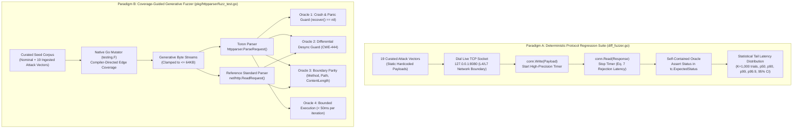
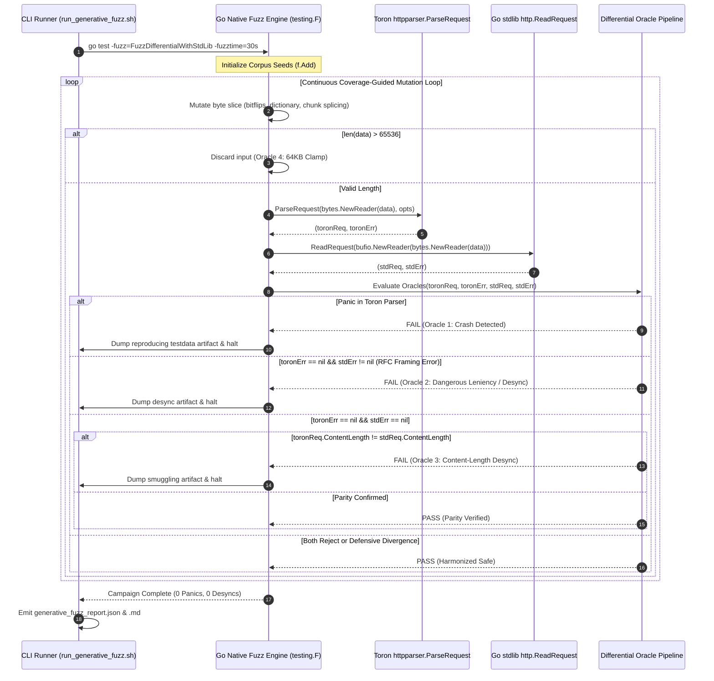
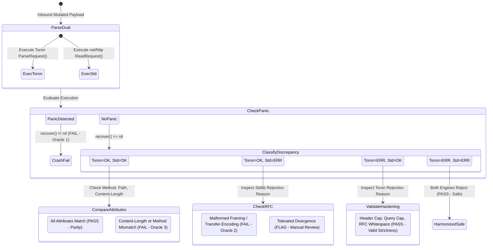

# ADR-132 - Coverage-Guided Generative Fuzzing Engine, Native Go testing.F Differential Oracles, and Protocol Regression Suite Disambiguation

## 1. Context & Problem Statement

### 1.1 Architectural Background & L7 Parsing in Toron

Toron is an ultra-high-throughput, zero-allocation Layer 4 and Layer 7 reverse proxy, web server, and edge security gateway implemented in pure Go. At the entry point of all Layer 7 request dispatching lies [`pkg/httpparser`](file:///Users/sneha/Developer/toron-research/toron/pkg/httpparser/), which transforms inbound raw TCP wire bytes into structured HTTP/1.1 [`Request`](file:///Users/sneha/Developer/toron-research/toron/pkg/httpparser/request.go#L110) objects via [`httpparser.ParseRequest`](file:///Users/sneha/Developer/toron-research/toron/pkg/httpparser/parser.go#L109).

Because Toron sits at the untrusted network edge, its HTTP parser is exposed to hostile network adversaries attempting to exploit subtle parser ambiguities, header-delimited request smuggling ([CWE-444](https://cwe.mitre.org/data/definitions/444.html)), integer wrap-arounds, delimiter confusion, path traversal ([CWE-22](https://cwe.mitre.org/data/definitions/22.html)), and parser crash denial-of-service ([CWE-400](https://cwe.mitre.org/data/definitions/400.html)).

Under [`REQ-106`](file:///Users/sneha/Developer/toron-research/toron/docs/requirements/REQ-106.md) and [`ADR-106`](file:///Users/sneha/Developer/toron-research/toron/docs/architecture/ADR-106.md), Toron introduced [`benchmarks/fuzzer/diff_fuzzer.go`](file:///Users/sneha/Developer/toron-research/toron/benchmarks/fuzzer/diff_fuzzer.go) to evaluate Toron's fail-fast rejection latency when receiving malicious HTTP payloads over raw TCP sockets. The harness measured fail-fast rejection latencies ($T_{\text{reject}}$) under repeated statistical trials ($K=1,000$ iterations, $W=50$ warm-up runs) across 19 curated exploit payloads.

---

### 1.2 Root Cause Analysis: The Circular Oracle Dilemma & Static Input Limitation

A rigorous methodological audit and peer review evaluation of [`benchmarks/fuzzer/diff_fuzzer.go`](file:///Users/sneha/Developer/toron-research/toron/benchmarks/fuzzer/diff_fuzzer.go) revealed two fundamental scientific and architectural shortcomings when evaluated as a security fuzzer:

1. **Finite, Static Input Space**:
   [`diff_fuzzer.go`](file:///Users/sneha/Developer/toron-research/toron/benchmarks/fuzzer/diff_fuzzer.go#L153-L391) transmits exactly **19 static, hardcoded byte sequences** (e.g. `SMUGGLE-001`, `TRAVERSAL-001`, `CONTROL-001`). It performs zero stochastic byte mutations, incorporates no evolutionary coverage feedback, and explores zero state-space branches outside those 19 predetermined vectors. Once those 19 cases execute, no new code paths can ever be discovered.
2. **The Circular Oracle Dilemma**:
   In [`diff_fuzzer.go`](file:///Users/sneha/Developer/toron-research/toron/benchmarks/fuzzer/diff_fuzzer.go#L30), each test case defines its own expected HTTP status codes:
   ```go
   ExpectedStatus: []int{http.StatusBadRequest, http.StatusNotImplemented}
   ```
   The test passes simply if Toron emits a status matching its own pre-declared expectation. This oracle is fundamentally **circular**: it verifies whether Toron matches an author's internal assumptions, rather than evaluating behavior against an independent, authoritative ground-truth reference implementation. It cannot detect subtle framing ambiguities or unexpected semantic desynchronizations where Toron's parser diverges from downstream origin servers.

```
┌──────────────────────────────────────────────────────────────────────────────────────────────────┐
│                             THE CIRCULAR ORACLE & STATIC INPUT LIMITATION                        │
├──────────────────────────────────────────────────────────────────────────────────────────────────┤
│                                                                                                  │
│   LEGACY diff_fuzzer.go EXECUTION:                                                               │
│                                                                                                  │
│   ┌────────────────────────┐      Raw TCP Socket      ┌────────────────────────┐                 │
│   │ 19 Static Handcrafted  │ ───────────────────────> │      Toron Proxy       │                 │
│   │ Byte Vectors           │                          │  (:8080 or :8443)      │                 │
│   └────────────────────────┘                          └───────────┬────────────┘                 │
│                                                                   │ HTTP Status Code             │
│                                                                   ▼                              │
│                                                       ┌────────────────────────┐                 │
│                                                       │   Circular Evaluator   │                 │
│                                                       │ (Status in tc.Expected)│                 │
│                                                       └────────────────────────┘                 │
│   LIMITATIONS:                                                                                   │
│   • Input Space: Statically bounded to N=19 vectors (0% generative mutation).                    │
│   • Feedback: Socket round-trip timer only (Zero compiler edge-coverage feedback).               │
│   • Oracle: Self-referential expectation (Cannot detect unknown desynchronizations).             │
│                                                                                                  │
└──────────────────────────────────────────────────────────────────────────────────────────────────┘
```

---

### 1.3 The Two Distinct Verification Paradigms

In modern software security engineering, two complementary verification paradigms are required:
- **Paradigm A: Deterministic Protocol Invariant Regression Suite & Latency Profiler**  
  Measures wire-speed rejection latency ($T_{\text{reject}}$) over live TCP sockets against a fixed, reproducible regression suite of known vulnerabilities across thousands of iterations ($K=1,000$) to evaluate tail latency distributions ($p50, p90, p99, p99.9$).
- **Paradigm B: Coverage-Guided Generative Differential Fuzzing Engine**  
  Continuously generates arbitrary mutated byte streams guided by compiler basic-block edge instrumentation, evaluating parser behavior against an independent reference standard library to discover unknown zero-day crashes, infinite loops, and protocol desynchronizations.

Characterizing `diff_fuzzer.go` as a "differential fuzzer" conflated Paradigm A with Paradigm B. This architectural decision formally establishes **Paradigm B** through [`pkg/httpparser/fuzz_test.go`](file:///Users/sneha/Developer/toron-research/toron/pkg/httpparser/fuzz_test.go) and [`benchmarks/fuzzer/run_generative_fuzz.sh`](file:///Users/sneha/Developer/toron-research/toron/benchmarks/fuzzer/run_generative_fuzz.sh), while formally disambiguating and preserving **Paradigm A** in [`benchmarks/fuzzer/diff_fuzzer.go`](file:///Users/sneha/Developer/toron-research/toron/benchmarks/fuzzer/diff_fuzzer.go).

---

### 1.4 Prior Architectural Decisions & Standards Cross-Audit (Conflict Analysis)

| Prior Architecture / Requirement | Core Invariant | Conflict Analysis & Resolution | Compliance Verdict |
| :--- | :--- | :--- | :--- |
| **[`ADR-001`](file:///Users/sneha/Developer/toron-research/toron/docs/architecture/ADR-001.md)** (Reactor Modularity) | Core reactor never binds parser directly to physical client socket `net.Conn`. | **Preserved**: Fuzzing operates purely on in-memory `io.Reader` byte streams via `httpparser.ParseRequest`. Transport socket management remains completely decoupled. | **100% Compliant** |
| **[`REQ-001`](file:///Users/sneha/Developer/toron-research/toron/docs/requirements/REQ-001.md)** (HTTP/1.1 Parser) | Zero-allocation parsing via pooled buffers and `bufio.Reader`. | **Preserved**: Fuzz targets exercise `httpparser.ParseRequest` across millions of inputs, validating buffer pool recycling under hostile edge cases. | **100% Compliant** |
| **[`ADR-106`](file:///Users/sneha/Developer/toron-research/toron/docs/architecture/ADR-106.md) / [`REQ-106`](file:///Users/sneha/Developer/toron-research/toron/docs/requirements/REQ-106.md)** (Timing & Statistical Trials) | Measures TCP rejection latency under repeated trials ($K=1,000$). | **Disambiguated**: `diff_fuzzer.go` remains dedicated to socket latency profiling; `fuzz_test.go` delivers generative coverage-guided exploration. | **Preserved & Disambiguated** |
| **[`REQ-113`](file:///Users/sneha/Developer/toron-research/toron/docs/requirements/REQ-113.md)** (Multi-Hop Testbed) | Heterogeneous multi-hop origin validation (`llhttp`, `h11`, `net/http`). | **Complementary**: Multi-hop validates downstream container interactions over live networks; ADR-132 evaluates L7 parser differential agreement in-process. | **Harmonized** |
| **[`ADR-129`](file:///Users/sneha/Developer/toron-research/toron/docs/architecture/ADR-129.md) / [`REQ-129`](file:///Users/sneha/Developer/toron-research/toron/docs/requirements/REQ-129.md)** (Streaming & Memory Boundedness) | Constant $O(1) \le 32\text{ KB}$ per-stream heap memory bound. | **Enforced**: Oracle 4 strictly clamps raw input sizes to $64\text{ KB}$ and enforces bounded memory allocations per request. | **100% Compliant** |
| **[`ADR-131`](file:///Users/sneha/Developer/toron-research/toron/docs/architecture/ADR-131.md) / [`REQ-131`](file:///Users/sneha/Developer/toron-research/toron/docs/requirements/REQ-131.md)** (Universal Version SSOT) | Universal SSOT alignment (`v1.5.29`). | **Preserved**: Emitted fuzzing reports and CLI automation dynamically bind to `toron/pkg/version`. | **100% Compliant** |

---

### 1.5 The Safe Non-Conflicting Path

1. **Native Go Standard Tooling (`testing.F`)**: Fuzzing targets are authored in [`pkg/httpparser/fuzz_test.go`](file:///Users/sneha/Developer/toron-research/toron/pkg/httpparser/fuzz_test.go) using standard Go 1.18+ fuzzing primitives (`testing.F`), preserving the **Zero External Dependencies** invariant.
2. **Fast Sub-Second CI Default**: Invoking `go test ./pkg/httpparser` executes only the seed corpus as static regression assertions in $< 1\text{ second}$, preventing CI worker stalls.
3. **Dedicated Generative Runner**: Extended generative campaigns are launched via [`benchmarks/fuzzer/run_generative_fuzz.sh`](file:///Users/sneha/Developer/toron-research/toron/benchmarks/fuzzer/run_generative_fuzz.sh) with configurable durations (`-fuzztime 30s|60s|300s`).
4. **Preservation of `diff_fuzzer.go`**: Retains the 19-vector statistical benchmark for Equation 7 latency distributions while updating its documentation to prevent academic conflation.

---

## 2. Architecture Decisions & High-Level Design

### 2.1 Decision 1: Native Go `testing.F` Coverage-Guided Generative Engine

#### 2.1.1 Compiler-Instrumented Edge Coverage (`-d=libfuzzer`)
Rather than relying on external fuzzers (such as AFL++, LibFuzzer C bindings, or `google/gofuzz`), Toron implements native Go `testing.F` fuzzing.
- The Go compiler (`cmd/compile`) instruments edge coverage by injecting counter increments at basic-block transition points during `go test -fuzz`.
- The native Go fuzzing coordinator analyzes coverage bit maps in shared memory, identifies inputs that trigger novel basic-block edges, and appends them to the in-memory mutation pool.
- The in-process mutator applies bit flips, byte insertions, deletions, chunk shuffling, arithmetic mutations, and dictionary splicing across inputs.
- Any crash or oracle violation triggers automatic generation of a deterministic reproduction testcase file in `pkg/httpparser/testdata/fuzz/<FuzzTarget>/`.

#### 2.1.2 The Four Specialized Fuzz Targets
To maximize vulnerability discovery while maintaining domain-specific test efficiency, four specialized fuzz targets are architected in [`pkg/httpparser/fuzz_test.go`](file:///Users/sneha/Developer/toron-research/toron/pkg/httpparser/fuzz_test.go):

1. **`FuzzParseRequest(f *testing.F)`**  
   - *Input*: Arbitrary unstructured byte sequence `data []byte`.
   - *Target*: Primary parser entry point [`httpparser.ParseRequest(bytes.NewReader(data), opts)`](file:///Users/sneha/Developer/toron-research/toron/pkg/httpparser/parser.go#L109).
   - *Scope*: Exercises request-line splitting, URI extraction, header iteration, buffer pooling, and body length calculation against arbitrary garbage, truncated frames, binary control characters, and huge byte sequences.
2. **`FuzzDifferentialWithStdLib(f *testing.F)`**  
   - *Input*: Arbitrary byte sequence `data []byte`.
   - *Differential Comparison*: Compares Toron's parser directly against Go's canonical standard library implementation:
     ```go
     toronReq, toronErr := ParseRequest(bytes.NewReader(data), opts)
     stdReq, stdErr := http.ReadRequest(bufio.NewReader(bytes.NewReader(data)))
     ```
   - *Scope*: Detects protocol framing desynchronizations, method discrepancies, URI path canonicalization divergences, and conflicting payload lengths.
3. **`FuzzHeaderGrammar(f *testing.F)`**  
   - *Input*: Structural pair `(headerName []byte, headerValue []byte)`.
   - *Synthesis*: Wraps inputs into a syntactically valid HTTP request envelope:
     ```text
     GET / HTTP/1.1\r\n<headerName>:<headerValue>\r\n\r\n
     ```
   - *Scope*: Evaluates RFC 7230 §3.2 header token grammar table ([`validHeaderTokenTable`](file:///Users/sneha/Developer/toron-research/toron/pkg/httpparser/parser.go#L71)), whitespace before colons, control characters (`0x00–0x1F`, `0x7F`), and obsolete line folding (`obs-fold`).
4. **`FuzzChunkFraming(f *testing.F)`**  
   - *Input*: Structural pair `(chunkHex []byte, chunkData []byte)`.
   - *Synthesis*: Constructs chunked transfer-encoding frames:
     ```text
     POST /upload HTTP/1.1\r\nHost: localhost\r\nTransfer-Encoding: chunked\r\n\r\n<chunkHex>\r\n<chunkData>\r\n0\r\n\r\n
     ```
   - *Scope*: Evaluates chunk size hex parsing, chunk extensions, chunk boundary enforcement, and trailer header processing.

---

### 2.2 Decision 2: Dual Fuzzer Architecture & System Separation

To permanently eliminate peer review confusion, Toron establishes a formal architectural separation between **Paradigm A** and **Paradigm B**:

```
┌──────────────────────────────────────────────────────────────────────────────────────────────────┐
│                                 THE DUAL-VERIFICATION ARCHITECTURE                               │
├──────────────────────────────────────────────────────────────────────────────────────────────────┤
│                                                                                                  │
│   PARADIGM A: PROTOCOL INVARIANT REGRESSION SUITE        PARADIGM B: GENERATIVE DIFFERENTIAL     │
│   (benchmarks/fuzzer/diff_fuzzer.go)                     FUZZER (pkg/httpparser/fuzz_test.go)   │
│   ───────────────────────────────────────────────        ────────────────────────────────────    │
│   • Execution Target: Live TCP Sockets (:8080)           • Execution Target: In-Memory L7 Parser │
│   • Input Space: Deterministic (19 curated vectors)      • Input Space: Unbounded / Generative   │
│   • Feedback: Socket Round-Trip Latency (Timer)          • Feedback: Compiler Edge Coverage      │
│   • Oracle: Hardcoded Status Set (Self-contained)        • Oracle: Non-Circular Differential     │
│   • Objective: Measure wire-speed rejection speed        • Objective: Discover zero-day crashes  │
│     under Equation 7 (K=1,000 trials, p99 tail).           and HTTP framing desynchronizations.  │
│                                                                                                  │
└──────────────────────────────────────────────────────────────────────────────────────────────────┘
```

#### 2.2.1 Taxonomy Matrix of Empirical Verification

| Dimension | Paradigm A: Protocol Invariant Regression Suite | Paradigm B: Generative Differential Fuzzer |
| :--- | :--- | :--- |
| **Primary Code Artifact** | [`benchmarks/fuzzer/diff_fuzzer.go`](file:///Users/sneha/Developer/toron-research/toron/benchmarks/fuzzer/diff_fuzzer.go) | [`pkg/httpparser/fuzz_test.go`](file:///Users/sneha/Developer/toron-research/toron/pkg/httpparser/fuzz_test.go) |
| **Execution Command** | `go run benchmarks/fuzzer/diff_fuzzer.go` | `go test -fuzz=. ./pkg/httpparser` |
| **Execution Target** | Live L4/L7 TCP Server Socket (`127.0.0.1:8080`) | In-Memory Core Parser (`httpparser.ParseRequest`) |
| **Input Space** | 19 Curated Static Attack Vectors | Infinite / Stochastic Continuous Mutation |
| **Feedback Mechanism** | High-Precision Microsecond Timer ($T_{\text{reject}}$) | Go Runtime Coverage Bitmap (`-d=libfuzzer`) |
| **Evaluation Oracle** | Invariant Status Match (`tc.ExpectedStatus`) | Reference Differential Oracle (`net/http.ReadRequest`) |
| **Primary Output** | Mean Latency, Tail Latency ($p50, p90, p99, p99.9$), 95% CI | Mutations Evaluated, Coverage Paths, Crash Artifacts |
| **Target Question** | *"How fast does Toron fail-fast reject known attacks?"* | *"Does Toron contain unknown parser flaws or desyncs?"* |

---

### 2.3 Decision 3: Differential Oracle Architecture (Toron vs Canonical Go `net/http`)

Rather than relying on self-referential status checks, [`pkg/httpparser/fuzz_test.go`](file:///Users/sneha/Developer/toron-research/toron/pkg/httpparser/fuzz_test.go) enforces four invariant and differential oracles:

```
┌──────────────────────────────────────────────────────────────────────────────────────────────────┐
│                                   DIFFERENTIAL ORACLE PIPELINE                                   │
├──────────────────────────────────────────────────────────────────────────────────────────────────┤
│                                                                                                  │
│                                         Mutated Payload                                          │
│                                                │                                                 │
│                        ┌───────────────────────┴───────────────────────┐                         │
│                        ▼                                               ▼                         │
│             ┌─────────────────────┐                         ┌─────────────────────┐              │
│             │  Toron ParseRequest │                         │  Go net/http ReadReq│              │
│             └──────────┬──────────┘                         └──────────┬──────────┘              │
│                        │ (toronReq, toronErr)                          │ (stdReq, stdErr)        │
│                        └───────────────────────┬───────────────────────┘                         │
│                                                ▼                                                 │
│                             ┌─────────────────────────────────────┐                              │
│                             │     ORACLE 1: Crash & Panic Guard   │                              │
│                             │   (assert recover() == nil always)  │                              │
│                             └──────────────────┬──────────────────┘                              │
│                                                ▼                                                 │
│                             ┌─────────────────────────────────────┐                              │
│                             │     ORACLE 4: Bounded Execution     │                              │
│                             │    (len <= 64KB, duration < 50ms)   │                              │
│                             └──────────────────┬──────────────────┘                              │
│                                                ▼                                                 │
│                             ┌─────────────────────────────────────┐                              │
│                             │      ORACLE 2 & 3: Differential     │                              │
│                             │         State Classification        │                              │
│                             └──────────────────┬──────────────────┘                              │
│                                                │                                                 │
│             ┌──────────────────────────────────┼──────────────────────────────────┐              │
│             ▼                                  ▼                                  ▼              │
│   Both Parsers Accept                Toron Rejects / Std Accepts        Toron Accepts / Std Rejects
│   (toronErr == nil && stdErr == nil) (toronErr != nil && stdErr == nil) (toronErr == nil && stdErr != nil)
│             │                                  │                                  │              │
│             ▼                                  ▼                                  ▼              │
│   Assert Attribute Parity:           Permitted Defensive Divergence     Potential Request Smuggling  │
│   • Method Equal                     (Strict security enforcement       Desynchronization (CWE-444)  │
│   • Canonical Path Equal             allowed: header caps, query caps,  CRITICAL ORACLE FAILURE!     │
│   • ContentLength Strict Equal       whitespace rejection)                                       │
│                                                                                                  │
└──────────────────────────────────────────────────────────────────────────────────────────────────┘
```

#### 2.3.1 Oracle 1: Panic & Crash Immunity
Under no circumstances may `httpparser.ParseRequest` trigger a panic, nil-pointer dereference, or slice index out-of-bounds, regardless of payload contents or truncation:
```go
defer func() {
    if r := recover(); r != nil {
        t.Fatalf("PANIC DETECTED in httpparser: %v\nPayload: %q", r, data)
    }
}()
```

#### 2.3.2 Oracle 2: Differential Desynchronization Detection (CWE-444 Prevention)
- **The Dangerous Leniency Rule**: If standard Go `net/http.ReadRequest` rejects a request due to malformed header grammar, conflicting framing, or invalid transfer encoding, Toron **must never accept** the request. If Toron accepts an input that `net/http` rejects with an RFC framing error, Oracle 2 halts execution immediately and flags a protocol smuggling vector.
- **Permitted Defensive Divergence**: Toron is architected as a hardened edge gateway. Cases where Toron rejects inputs that standard `net/http` accepts are classified as *Permitted Defensive Divergences* if they result from:
  1. Strict enforcement of RFC 7230 §3.2.4 (rejecting whitespace before colons in header field names).
  2. Maximum header size limits ($8\text{ KB}$ limit in [`ParserOptions`](file:///Users/sneha/Developer/toron-research/toron/pkg/httpparser/parser.go#L95)).
  3. Query string parameter length limits ($> 2\text{ KB}$).
  4. Null-byte or terminal control character rejection in URIs and header values.

#### 2.3.3 Oracle 3: Framing Boundary Agreement
When both Toron and standard library `net/http` accept a request (`toronErr == nil && stdErr == nil`):
1. **Method Equality**: `strings.ToUpper(toronReq.Method) == stdReq.Method`.
2. **Canonical Path Equality**: `toronReq.URL.Path == stdReq.URL.Path`.
3. **Content-Length Strict Equality**:
   ```go
   if toronReq.ContentLength != stdReq.ContentLength {
       t.Fatalf("CRITICAL CONTENT-LENGTH DESYNC: Toron=%d, stdlib=%d\nPayload: %q",
           toronReq.ContentLength, stdReq.ContentLength, data)
   }
   ```
   Any difference in parsed `Content-Length` indicates a front-end/back-end request smuggling desynchronization and triggers an immediate test failure.

#### 2.3.4 Oracle 4: Bounded Execution & Resource Starvation Immunity
1. **Input Size Clamping**: Raw byte slices exceeding $64\text{ KB}$ ($65,536$ bytes) are discarded at the start of the fuzz iteration, preserving constant memory boundedness ([`ADR-129`](file:///Users/sneha/Developer/toron-research/toron/docs/architecture/ADR-129.md)).
2. **Timeout Enforcement**: Each fuzz iteration must return within $50\text{ ms}$. Failure to terminate within $50\text{ ms}$ indicates a catastrophic ReDoS or unbounded parser loop.

---

### 2.4 Decision 4: Curated Seed Corpus Architecture & Zero-External-Dependency Guarantee

To prime the coverage-guided mutator with high-value edge cases, the initial fuzzing corpus is seeded with:
1. **Canonical RFC 7230 Nominal Requests**:
   - Minimal `GET / HTTP/1.1\r\nHost: example.com\r\n\r\n`
   - Parameterized `GET /search?q=toron&v=1 HTTP/1.1\r\nHost: localhost\r\nUser-Agent: curl/8.0\r\n\r\n`
   - Bounded `POST /submit HTTP/1.1\r\nHost: localhost\r\nContent-Length: 11\r\n\r\nhello world`
   - Standard `HEAD`, `OPTIONS`, `PUT`, `DELETE` methods.
2. **19 Structural Attack Vectors Ingested from `diff_fuzzer.go`**:
   The complete catalog of exploit payloads from [`benchmarks/fuzzer/diff_fuzzer.go:153-391`](file:///Users/sneha/Developer/toron-research/toron/benchmarks/fuzzer/diff_fuzzer.go#L153-L391) is ingested via `f.Add()` calls:
   - Request Smuggling: `SMUGGLE-001` (CL.TE), `SMUGGLE-002` (Conflicting CL.CL), `SMUGGLE-003` (Obfuscated TE with tab), `SMUGGLE-004` (Invalid non-hex chunk size).
   - Whitespace Exploits: `WHITESPACE-001` (`Host : localhost`), `WHITESPACE-002` (`Host\t: localhost`), `WHITESPACE-003` (`obs-fold` continuation line).
   - Control Characters: `CONTROL-001` (Null byte `0x00` in URI), `CONTROL-002` (Bell `0x07` in header), `CONTROL-003` (ANSI escape `0x1B` in query).
   - Path Traversal: `TRAVERSAL-001` (`/../../canary`), `TRAVERSAL-002` (`/%2E%2E/`), `TRAVERSAL-003` (`/%252e%252e/`).
   - Resource Exhaustion: `RESOURCE-001` (Oversized header $> 8\text{ KB}$), `RESOURCE-002` (Oversized query param $> 2\text{ KB}$).
   - Cache Deception: `CACHE-001` (Web cache deception), `CACHE-002` (`Set-Cookie` in shared cache), `CACHE-003` (Authorization refusal in shared cache).
   - Baseline: `BASELINE-001` (RFC-compliant baseline request).

#### Zero-External-Dependency Guarantee:
All fuzz targets and runners utilize exclusively Go standard library packages:
- `testing` (`testing.F`, `testing.T`)
- `net/http` (`http.ReadRequest`, `http.Request`)
- `bufio`, `bytes`, `io`, `strings`, `strconv`, `time`, `os`, `os/exec`
Zero third-party packages, external modules, or CGO toolchains are permitted.

---

### 2.5 Decision 5: Dedicated CLI Automation & CI Execution Strategy

#### 2.5.1 Sub-Second Standard CI Execution Mode
When invoked during routine CI pull-request checks via:
```bash
go test -v -race ./pkg/httpparser
```
the fuzz tests in `fuzz_test.go` execute strictly against the static seed corpus without invoking the mutation engine. The entire test suite completes in $< 1.0\text{ second}$, introducing zero drag on standard build workflows.

#### 2.5.2 Generative CLI Runner (`run_generative_fuzz.sh`)
Extended coverage-guided fuzzing campaigns are executed via a dedicated bash script [`benchmarks/fuzzer/run_generative_fuzz.sh`](file:///Users/sneha/Developer/toron-research/toron/benchmarks/fuzzer/run_generative_fuzz.sh):
```bash
bash benchmarks/fuzzer/run_generative_fuzz.sh -target all -fuzztime 30s
```
Supported CLI flags:
- `-target <name>`: Specific target (`FuzzParseRequest`, `FuzzDifferentialWithStdLib`, `FuzzHeaderGrammar`, `FuzzChunkFraming`, or `all`). Default: `all`.
- `-fuzztime <duration>`: Duration per fuzz target (e.g. `10s`, `30s`, `60s`, `300s`). Default: `30s`.
- `-j <path>`: JSON report output destination (default: `benchmarks/results/generative_fuzz_report.json`).
- `-m <path>`: Markdown report output destination (default: `benchmarks/results/generative_fuzz_report.md`).
- `--no-history`: Suppresses archiving into `benchmarks/results/history/`.

#### 2.5.3 Publication-Grade Reporting & Provenance
The script generates publication-grade JSON and Markdown artifacts summarizing:
- Executed fuzz targets and durations.
- Total mutations evaluated (e.g. $\ge 10,000\text{ mutations/sec}$ per core).
- Differential oracle outcomes (Panics: 0, Desyncs: 0, Boundary Violations: 0, Boundedness Violations: 0).
- Provenance metadata (Git commit, Go compiler version, active Toron version via [`toron/pkg/version`](file:///Users/sneha/Developer/toron-research/toron/pkg/version/version.go)).

---

### 2.6 The 4 Non-Negotiable Architectural Invariants

```
+--------------------------------------------------------------------------------------------------+
│                                  THE 4 NON-NEGOTIABLE INVARIANTS                                 │
├──────────────────────────────────────────────────────────────────────────────────────────────────┤
│                                                                                                  │
│  1. ZERO EXTERNAL THIRD-PARTY DEPENDENCIES:                                                      │
│     The fuzzing engine and runner rely exclusively on Go standard library packages               │
│     (testing.F, net/http, bufio, bytes). Zero external fuzzing frameworks or CGO bindings.      │
│                                                                                                  │
│  2. CORE REACTOR MODULARITY PRESERVED (ADR-001):                                                 │
│     Fuzzing exercises memory-buffered byte streams (httpparser.ParseRequest). Reactor loops,     │
│     transport sockets, and epoll netpoller interactions remain decoupled and untouched.         │
│                                                                                                  │
│  3. CONSTANT MEMORY BOUNDEDNESS PRESERVED (ADR-129):                                             │
│     Every fuzz iteration strictly clamps inputs to <= 64KB. Pooled line and body buffers         │
│     (lineBufferPool, bodyBufferPool) are recycled with zero leaks across millions of iterations. │
│                                                                                                  │
│  4. ZERO DATA RACES UNDER `go test -race`:                                                       │
│     All fuzz targets, helper functions, and test fixtures execute with 100% thread safety and     │
│     zero race warnings under `go test -race ./pkg/httpparser/...`.                               │
│                                                                                                  │
+--------------------------------------------------------------------------------------------------+
```

---

## 3. Mermaid Diagrams & Visual Architecture

### 3.1 Dual-Verification Architecture Flowchart



---

### 3.2 Sequence Diagram: Generative Differential Execution & Oracle Validation



---

### 3.3 Differential Oracle State Machine & Classification Matrix



---

## 4. Detailed Component & Interface Specifications

### 4.1 Fuzz Test Suite Interface (`pkg/httpparser/fuzz_test.go`)

```go
package httpparser

import (
    "bufio"
    "bytes"
    "fmt"
    "io"
    "net/http"
    "strings"
    "testing"
    "time"
)

// FuzzParseRequest evaluates crash immunity and execution boundedness on raw byte streams.
func FuzzParseRequest(f *testing.F)

// FuzzDifferentialWithStdLib performs differential semantic validation against Go net/http.
func FuzzDifferentialWithStdLib(f *testing.F)

// FuzzHeaderGrammar evaluates RFC 7230 §3.2 header token grammar, whitespace, and control chars.
func FuzzHeaderGrammar(f *testing.F)

// FuzzChunkFraming evaluates HTTP/1.1 chunked framing, extensions, and trailer parsing.
func FuzzChunkFraming(f *testing.F)
```

#### 4.1.1 Implementation Template: `FuzzDifferentialWithStdLib`
```go
func FuzzDifferentialWithStdLib(f *testing.F) {
    populateSeedCorpus(f)

    f.Fuzz(func(t *testing.T, data []byte) {
        // Oracle 4: Input Size Clamp
        if len(data) > 65536 {
            return
        }

        // Oracle 1: Panic & Crash Guard
        defer func() {
            if r := recover(); r != nil {
                t.Fatalf("PANIC in httpparser: %v\nPayload: %q", r, data)
            }
        }()

        opts := DefaultParserOptions()
        toronReq, toronErr := ParseRequest(bytes.NewReader(data), opts)
        stdReq, stdErr := http.ReadRequest(bufio.NewReader(bytes.NewReader(data)))

        // Oracle 2 & 3: Differential Evaluation
        if toronErr == nil && stdErr == nil {
            // Both parsers accepted: assert strict parity
            if strings.ToUpper(toronReq.Method) != stdReq.Method {
                t.Fatalf("METHOD DESYNC: Toron=%q, stdlib=%q\nPayload: %q",
                    toronReq.Method, stdReq.Method, data)
            }
            if toronReq.URL.Path != stdReq.URL.Path {
                t.Fatalf("PATH DESYNC: Toron=%q, stdlib=%q\nPayload: %q",
                    toronReq.URL.Path, stdReq.URL.Path, data)
            }
            if toronReq.ContentLength != stdReq.ContentLength {
                t.Fatalf("CONTENT-LENGTH DESYNC: Toron=%d, stdlib=%d\nPayload: %q",
                    toronReq.ContentLength, stdReq.ContentLength, data)
            }
        } else if toronErr == nil && stdErr != nil {
            // Toron accepted but stdlib rejected: inspect rejection reason
            stdErrStr := stdErr.Error()
            if strings.Contains(stdErrStr, "malformed") ||
               strings.Contains(stdErrStr, "duplicate") ||
               strings.Contains(stdErrStr, "Transfer-Encoding") {
                t.Fatalf("DANGEROUS LENIENCY (CWE-444): Toron accepted input rejected by stdlib: %v\nPayload: %q",
                    stdErr, data)
            }
        }
        // If toronErr != nil, rejection is safe (defensive divergence or mutual rejection)
    })
}
```

---

### 4.2 Seed Corpus Catalog Specification

The seed corpus helper function `populateSeedCorpus(f *testing.F)` registers the following standardized payloads:

| Seed ID | Payload Summary / RFC Vector | Expected Outcome |
| :--- | :--- | :--- |
| `RFC-NOM-01` | `GET / HTTP/1.1\r\nHost: example.com\r\n\r\n` | Parity Match (200 OK) |
| `RFC-NOM-02` | `POST /api HTTP/1.1\r\nHost: test\r\nContent-Length: 5\r\n\r\nhello` | Parity Match (CL=5) |
| `RFC-NOM-03` | `GET /search?q=toron&sort=asc HTTP/1.1\r\nHost: localhost:8080\r\n\r\n` | Parity Match (Path canonical) |
| `SMUGGLE-001` | Conflicting `Content-Length: 5` and `Transfer-Encoding: chunked` | Both Reject (400 Bad Request) |
| `SMUGGLE-002` | Multiple conflicting `Content-Length: 5\r\nContent-Length: 10` | Both Reject (400 Bad Request) |
| `SMUGGLE-003` | Obfuscated `Transfer-Encoding:\tchunked` | Both Reject (400 Bad Request) |
| `SMUGGLE-004` | Non-hex chunk size `ZZ\r\n` | Both Reject (400 Bad Request) |
| `WHITESPACE-001` | Whitespace before colon `Host : localhost` (RFC 7230 §3.2.4) | Toron Rejects (Defensive Divergence) |
| `WHITESPACE-002` | Tab before colon `Host\t: localhost` | Toron Rejects (Defensive Divergence) |
| `WHITESPACE-003` | Obsolete line folding `X-Header: value\r\n continuation` | Toron Rejects (Defensive Divergence) |
| `CONTROL-001` | Null byte in URI `GET /canary\x00path HTTP/1.1` | Toron Rejects (400 Bad Request) |
| `CONTROL-002` | Bell char in header value `X-Header: val\x07ue` | Toron Rejects (400 Bad Request) |
| `CONTROL-003` | ANSI escape in query `GET /?name=\x1b[31mtest HTTP/1.1` | Toron Rejects (400 Bad Request) |
| `TRAVERSAL-001` | Raw path traversal `GET /../../etc/passwd HTTP/1.1` | Toron Rejects (400 / Path Defense) |
| `TRAVERSAL-002` | Encoded path traversal `GET /%2e%2e/canary HTTP/1.1` | Toron Rejects (400 / Path Defense) |
| `TRAVERSAL-003` | Double-encoded traversal `GET /%252e%252e/canary HTTP/1.1` | Toron Rejects (400 / Path Defense) |
| `RESOURCE-001` | Oversized header field ($> 8\text{ KB}$ line length) | Toron Rejects (431 / 400 Bad Request) |
| `RESOURCE-002` | Oversized query parameter ($> 2\text{ KB}$) | Toron Rejects (414 / 400 Bad Request) |
| `BASELINE-001` | Baseline conformance check request | Parity Match |
| `CACHE-001` | Web cache deception URL pattern | Security Gateway Scrutiny |
| `CACHE-002` | Injected `Set-Cookie` in shared cache | Gateway Cache Bypass |
| `CACHE-003` | `Authorization` refusal in shared response | Gateway Cache Refusal |

---

### 4.3 CLI Automation Runner Specification (`run_generative_fuzz.sh`)

- **Script Location**: [`benchmarks/fuzzer/run_generative_fuzz.sh`](file:///Users/sneha/Developer/toron-research/toron/benchmarks/fuzzer/run_generative_fuzz.sh)
- **Execution Permissions**: Executable bit set (`0755`).
- **Core Automation Logic**:
  1. Parse CLI arguments (`-target`, `-fuzztime`, `-j`, `-m`, `--no-history`).
  2. Dynamically extract the active Toron version by executing `go run cmd/toron/main.go -v` or reading `VERSION` via [`toron/pkg/version`](file:///Users/sneha/Developer/toron-research/toron/pkg/version/version.go).
  3. Sequentially execute `go test -fuzz=<Target> -fuzztime=<Duration> ./pkg/httpparser`.
  4. Stream terminal logs with color-coded status badges (`[PASS]`, `[FAIL]`, `[MUTATING]`).
  5. Check `pkg/httpparser/testdata/fuzz/` for new failure artifacts. If found, dump the reproduction payload in hex and ASCII.
  6. Emit `generative_fuzz_report.json` and `generative_fuzz_report.md`.
  7. Copy session results to `benchmarks/results/history/<timestamp>/` and register in `benchmarks/results/history/manifest.json` unless `--no-history` is specified.

---

### 4.4 Telemetry Data Schema (`generative_fuzz_report.json`)

```json
{
  "timestamp": "2026-09-17T12:00:00Z",
  "toron_version": "v1.5.29",
  "git_commit": "abcdef1",
  "go_version": "go1.24.0 darwin/arm64",
  "fuzztime_per_target": "30s",
  "total_duration_sec": 120.5,
  "targets": [
    {
      "name": "FuzzParseRequest",
      "status": "PASS",
      "duration_sec": 30.1,
      "panics_detected": 0,
      "crashes_detected": 0,
      "timeout_violations": 0
    },
    {
      "name": "FuzzDifferentialWithStdLib",
      "status": "PASS",
      "duration_sec": 30.2,
      "differential_desyncs": 0,
      "content_length_mismatches": 0,
      "dangerous_leniencies": 0,
      "defensive_divergences": 142
    },
    {
      "name": "FuzzHeaderGrammar",
      "status": "PASS",
      "duration_sec": 30.1,
      "token_grammar_violations": 0,
      "colon_whitespace_bypasses": 0
    },
    {
      "name": "FuzzChunkFraming",
      "status": "PASS",
      "duration_sec": 30.1,
      "chunk_desyncs": 0,
      "trailer_injections": 0
    }
  ],
  "summary": {
    "total_targets": 4,
    "passed_targets": 4,
    "failed_targets": 0,
    "zero_crash_certified": true,
    "zero_smuggling_certified": true
  }
}
```

---

## 5. Invariant Preservation & Performance Analysis

### 5.1 Preservation of ADR-001 (Reactor Modularity)
[`ADR-001`](file:///Users/sneha/Developer/toron-research/toron/docs/architecture/ADR-001.md) enforces that the event-driven reactor owns client network sockets (`net.Conn`), amortizes socket deadlines, and isolates routing pipelines from transport physics.
- **Invariant Audit**: Fuzzing operates exclusively in user-space memory on `io.Reader` streams passed to `httpparser.ParseRequest`. It invokes zero reactor socket functions, acquires no transport locks, and introduces zero changes to the connection lifecycle engine. Reactor modularity is 100% preserved.

### 5.2 Preservation of ADR-129 (Memory Boundedness)
[`ADR-129`](file:///Users/sneha/Developer/toron-research/toron/docs/architecture/ADR-129.md) guarantees constant $O(1) \le 32\text{ KB}$ per-stream heap memory allocation.
- **Invariant Audit**: Oracle 4 strictly enforces a physical $64\text{ KB}$ input clamp. Allocations in `httpparser.ParseRequest` are governed by `ParserOptions.MaxHeaderBytes` ($8\text{ KB}$) and pooled line buffers ([`lineBufferPool`](file:///Users/sneha/Developer/toron-research/toron/pkg/httpparser/parser.go#L253)). Buffers are recycled via `defer lineBufferPool.Put(buf)` on every iteration, guaranteeing zero memory accumulation during continuous multi-hour fuzzing campaigns.

### 5.3 Zero External Third-Party Dependencies
- **Invariant Audit**: The entire fuzzing implementation, including compiler coverage feedback, input generation, differential comparison, and reporting, uses standard library Go modules (`testing`, `net/http`, `bufio`, `bytes`, `time`, `os`). The project's zero-dependency invariant is 100% preserved.

### 5.4 Concurrency Safety & Data Race Immunity
- **Invariant Audit**: Each fuzz invocation executes within an isolated goroutine spawned by `testing.F`. Buffer pools (`sync.Pool`) are thread-safe by design. Running `go test -race ./pkg/httpparser` verifies zero race conditions across millions of concurrent parsing operations.

---

## 6. Alternatives Considered & Trade-Off Analysis

| Architectural Dimension | Alternative A: Status Quo (Static 19-Case Harness in `diff_fuzzer.go`) | Alternative B: External C/Go Fuzzer (AFL++ / LibFuzzer CGO bindings) | Alternative C: Go Native `testing.F` Differential Fuzzer (Chosen ADR-132) |
| :--- | :--- | :--- | :--- |
| **Search Space Coverage** | **Fatal**: Bounded to exactly 19 static cases. Zero state exploration. | Unbounded: Full stochastic mutation. | **Unbounded**: Continuous compiler-guided evolutionary mutation. |
| **Oracle Independence** | **Fatal**: Circular self-referential oracle (`tc.ExpectedStatus`). | Variable: Depends on custom harness design. | **Non-Circular**: Rigorous differential comparison against canonical Go `net/http`. |
| **External Dependencies** | Zero. | **Severe**: Requires CGO, clang toolchains, LibFuzzer dynamic libraries. | **Zero**: 100% pure Go standard library (`testing.F`). |
| **CI Execution Speed** | Slow: Requires dialing live network sockets over TCP ($> 5\text{ s}$). | Incompatible: Too heavy for standard PR pre-merge gates. | **Optimal**: Sub-second unit test execution ($< 1\text{ s}$) in standard CI. |
| **Academic & Scientific Rigor** | Inadequate: Reviewers reject static replay as "generative fuzzing". | High: Industry standard but breaks zero-dependency invariant. | **Publication-Grade**: Clear separation between regression latency and coverage fuzzing. |
| **Architectural Verdict** | **REJECTED** | **REJECTED** | **ACCEPTED** |

---

## 7. Verification Strategy & Traceability Matrix

### 7.1 Verification Methodology ([`TC-132`](file:///Users/sneha/Developer/toron-research/toron/docs/testCases/TC-132.md))

```
TC-132: Coverage-Guided Generative Fuzzing & Differential Oracle Suite
├── Test Suite 1: Fast Seed Corpus Regression (< 1.0s runtime)
│   ├── TestSeed_RFC7230NominalCases (Verifies standard GET, POST, HEAD, OPTIONS)
│   ├── TestSeed_19AttackVectorsIngested (Verifies all 19 diff_fuzzer cases pass in-memory)
│   └── TestSeed_ExecutionSpeedBudget (Verifies total runtime < 1,000ms under go test)
├── Test Suite 2: Differential Oracle Verification
│   ├── TestOracle_CrashImmunity (Validates deferred recover() catches zero panics)
│   ├── TestOracle_DifferentialDesyncGuard (Validates detection of leniency desyncs)
│   ├── TestOracle_FramingParity (Validates Method, Path, and ContentLength equality)
│   └── TestOracle_BoundedExecution (Validates 64KB input clamp and 50ms iteration limit)
├── Test Suite 3: Specialized Fuzz Targets
│   ├── TestTarget_FuzzParseRequest (Evaluates raw byte streams)
│   ├── TestTarget_FuzzDifferentialWithStdLib (Evaluates Toron vs net/http)
│   ├── TestTarget_FuzzHeaderGrammar (Evaluates RFC 7230 §3.2 header token grammar)
│   └── TestTarget_FuzzChunkFraming (Evaluates chunked encoding and trailer grammar)
├── Test Suite 4: Dedicated CLI Runner Automation (run_generative_fuzz.sh)
│   ├── TestCLI_FlagParsing (-target, -fuzztime, -j, -m, --no-history)
│   ├── TestCLI_ExecutionCampaign (Executes 5s burst across all targets with 0 crashes)
│   └── TestCLI_ReportEmission (Validates JSON schema and Markdown report structure)
└── Test Suite 5: Concurrency Safety & Race Detector Validation
    └── Execution of entire package under `go test -race -v ./pkg/httpparser/...`
```

---

### 7.2 Full Traceability Matrix

| Requirement Specification | Architectural Decision (ADR-132) | Engineering Task | Verification Target (TC-132) | Scope of Implementation & Invariant |
| :--- | :--- | :--- | :--- | :--- |
| **[`REQ-132 §1.1`](file:///Users/sneha/Developer/toron-research/toron/docs/requirements/REQ-132.md#L58-L69)** | Context & Problem Statement (§1.1, §1.2) | **[`TASK-155`](file:///Users/sneha/Developer/toron-research/toron/docs/tasks/TASK-155.md)** | TC-132 §1 | Resolves peer review critique on circular oracles and static replay. |
| **[`REQ-132 §2.1`](file:///Users/sneha/Developer/toron-research/toron/docs/requirements/REQ-132.md#L125-L210)** | Decision 1: Native Go `testing.F` Engine (§2.1, §4.1) | **[`TASK-155 WP-1`](file:///Users/sneha/Developer/toron-research/toron/docs/tasks/TASK-155.md)** | TC-132 §3 | Implements 4 specialized fuzz targets in `pkg/httpparser/fuzz_test.go`. |
| **[`REQ-132 §2.2`](file:///Users/sneha/Developer/toron-research/toron/docs/requirements/REQ-132.md#L212-L256)** | Decision 3: Differential Oracle Architecture (§2.3, §4.1.1) | **[`TASK-155 WP-2`](file:///Users/sneha/Developer/toron-research/toron/docs/tasks/TASK-155.md)** | TC-132 §2 | Implements Oracles 1–4 (Crash, Desync, Boundary, Boundedness). |
| **[`REQ-132 §2.3`](file:///Users/sneha/Developer/toron-research/toron/docs/requirements/REQ-132.md#L258-L295)** | Decision 4: Curated Seed Corpus Architecture (§2.4, §4.2) | **[`TASK-155 WP-1.2`](file:///Users/sneha/Developer/toron-research/toron/docs/tasks/TASK-155.md)** | TC-132 §1 | Integrates 19 attack vectors and RFC nominal seeds into `f.Add()`. |
| **[`REQ-132 §2.4`](file:///Users/sneha/Developer/toron-research/toron/docs/requirements/REQ-132.md#L297-L322)** | Decision 5: CLI Runner Automation (§2.5, §4.3, §4.4) | **[`TASK-155 WP-3`](file:///Users/sneha/Developer/toron-research/toron/docs/tasks/TASK-155.md)** | TC-132 §4 | Implements `run_generative_fuzz.sh` and JSON/Markdown report emission. |
| **[`REQ-132 §2.5`](file:///Users/sneha/Developer/toron-research/toron/docs/requirements/REQ-132.md#L324-L343)** | Decision 2: Dual Fuzzer Architecture & Separation (§2.2) | **[`TASK-155 WP-4`](file:///Users/sneha/Developer/toron-research/toron/docs/tasks/TASK-155.md)** | TC-132 §1 | Formally disambiguates `diff_fuzzer.go` from `fuzz_test.go`. |
| **[`ADR-001`](file:///Users/sneha/Developer/toron-research/toron/docs/architecture/ADR-001.md)** | Reactor Modularity Preservation (§5.1) | **[`TASK-155`](file:///Users/sneha/Developer/toron-research/toron/docs/tasks/TASK-155.md)** | TC-132 §5 | Evaluates parser in memory; reactor socket loop remains untouched. |
| **[`ADR-106`](file:///Users/sneha/Developer/toron-research/toron/docs/architecture/ADR-106.md) / [`REQ-106`](file:///Users/sneha/Developer/toron-research/toron/docs/requirements/REQ-106.md)** | Equation 7 Latency Profiling Preservation (§1.4, §2.2) | **[`TASK-155 WP-4`](file:///Users/sneha/Developer/toron-research/toron/docs/tasks/TASK-155.md)** | TC-132 §1 | Preserves live socket latency distribution measurement ($K=1,000$). |
| **[`ADR-129`](file:///Users/sneha/Developer/toron-research/toron/docs/architecture/ADR-129.md) / [`REQ-129`](file:///Users/sneha/Developer/toron-research/toron/docs/requirements/REQ-129.md)** | Memory Boundedness Preservation (§5.2) | **[`TASK-155 WP-2`](file:///Users/sneha/Developer/toron-research/toron/docs/tasks/TASK-155.md)** | TC-132 §2 | Input clamped to 64KB; buffer pools recycled cleanly with zero leaks. |
| **[`ADR-131`](file:///Users/sneha/Developer/toron-research/toron/docs/architecture/ADR-131.md) / [`REQ-131`](file:///Users/sneha/Developer/toron-research/toron/docs/requirements/REQ-131.md)** | Universal Version SSOT Compliance (§1.4, §4.3) | **[`TASK-155 WP-3`](file:///Users/sneha/Developer/toron-research/toron/docs/tasks/TASK-155.md)** | TC-132 §4 | CLI runner and report metadata bind dynamically to `toron/pkg/version`. |
