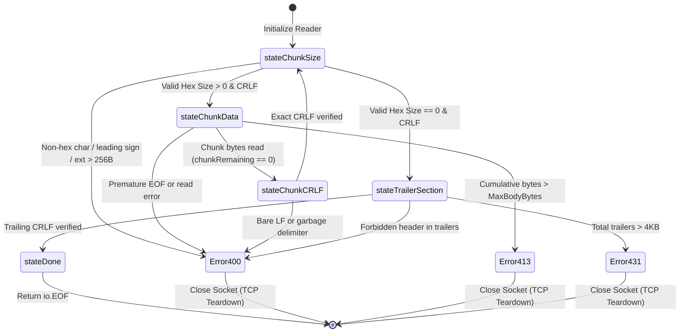
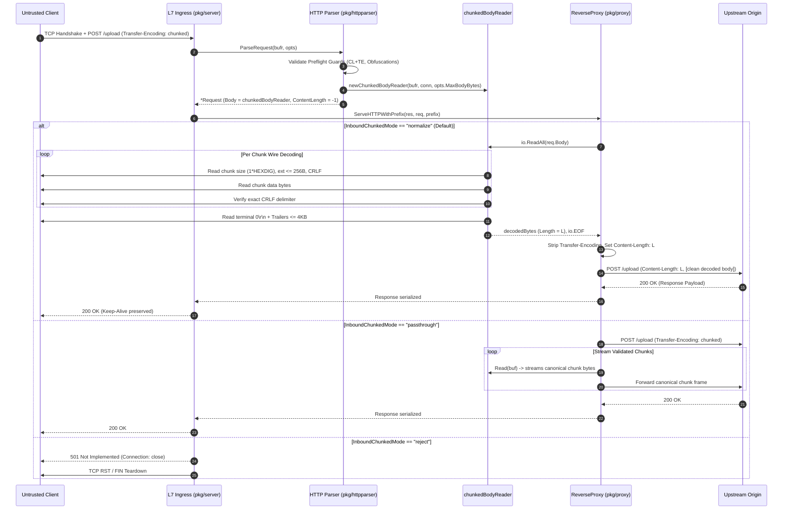

# ADR-133 - Inbound Chunked Transfer-Encoding Ingestion, Zero-Tolerance Wire Decoding, and Upstream Re-Framing Normalization (RFC 9112 §7.1)

## 1. Context & Problem Statement

### 1.1 Architectural Background & Ingress Ingestion in Toron

Toron is an ultra-high-throughput, zero-allocation Layer 4 and Layer 7 reverse proxy, web server, and edge security gateway implemented in pure Go. At the entry point of Layer 7 request processing, [`pkg/httpparser`](file:///Users/sneha/Developer/toron-research/toron/pkg/httpparser/) consumes raw network byte streams via [`httpparser.ParseRequest`](file:///Users/sneha/Developer/toron-research/toron/pkg/httpparser/parser.go#L109), transforming inbound wire bytes into structured HTTP/1.1 [`Request`](file:///Users/sneha/Developer/toron-research/toron/pkg/httpparser/request.go#L110) objects that are subsequently evaluated by routing, security filters, rate limiters, and reverse proxy forwarders in [`pkg/proxy`](file:///Users/sneha/Developer/toron-research/toron/pkg/proxy/).

Under [`ADR-056`](file:///Users/sneha/Developer/toron-research/toron/docs/architecture/ADR-056.md) (*Inbound Transfer-Encoding Rejection & Request Smuggling Defense*) and [`REQ-061`](file:///Users/sneha/Developer/toron-research/toron/docs/requirements/REQ-061.md), Toron established an uncompromising inbound perimeter defense policy: any incoming HTTP request carrying a `Transfer-Encoding: chunked` header (or any transfer-coding) was immediately rejected with `HTTP/1.1 501 Not Implemented`, and the underlying TCP connection was forcefully severed without reading the request body.

This static rejection posture was an effective defense during Toron's initial development phases. By refusing to deserialize chunked payloads, Toron eliminated all chunk-level HTTP Request Smuggling ([CWE-444](https://cwe.mitre.org/data/definitions/444.html)), delimiter confusion, and chunk extension Denial-of-Service ([CWE-400](https://cwe.mitre.org/data/definitions/400.html)) vectors.

---

### 1.2 Evolution from ADR-056: Why Static HTTP 501 Rejection is Insufficient for Modern Cloud Ingress

While static 501 rejection was a safe initial defense, it imposes severe operational limitations when Toron is deployed as a general-purpose cloud-native ingress gateway, Kubernetes ingress controller, or API gateway:

1. **Inability to Support Streaming Ingress & Large Uploads**: Modern cloud applications frequently stream large payloads (e.g. data ingestion pipelines, binary blobs, audio/video streaming, database backups). In standard HTTP/1.1, clients transmit streaming uploads using `Transfer-Encoding: chunked` because payload size cannot be calculated ahead of time. Toron's static 501 rejection renders it unusable for these workloads.
2. **Third-Party Webhook & SaaS Incompatibility**: Automated webhooks from major enterprise SaaS platforms (e.g., GitHub, Stripe, Datadog, Slack, PagerDuty) stream JSON and multipart events chunked by default. Rejecting inbound chunked requests causes Toron to drop legitimate automated webhook deliveries.
3. **Microservice Ingress Inflexibility**: Reverse proxies such as NGINX, Envoy, Traefik, HAProxy, and Caddy natively accept chunked client requests. Toron cannot act as a drop-in ingress replacement in front of heterogeneous backend microservices if it rejects chunked client requests.
4. **Full-Duplex Protocol Asymmetry**: Under [`ADR-128`](file:///Users/sneha/Developer/toron-research/toron/docs/architecture/ADR-128.md) / [`REQ-128`](file:///Users/sneha/Developer/toron-research/toron/docs/requirements/REQ-128.md) and [`ADR-129`](file:///Users/sneha/Developer/toron-research/toron/docs/architecture/ADR-129.md) / [`REQ-129`](file:///Users/sneha/Developer/toron-research/toron/docs/requirements/REQ-129.md), Toron introduced outbound streaming chunked responses (`Transfer-Encoding: chunked` downstream emission). Emitting chunked streams downstream while rejecting them on ingress creates an architectural asymmetry that limits Toron's HTTP/1.1 protocol capabilities.

Toron must evolve to natively, safely, and robustly ingest inbound HTTP/1.1 chunked requests in strict compliance with **RFC 9112 §7.1** (and RFC 7230 §4.1) without compromising its zero-allocation performance principles or diluting its security posture.

---

### 1.3 The Active Ingress Smuggling Firewall Concept

Rather than merely "accepting" chunked data with leniency, Toron acts as an **Active Ingress Smuggling Firewall**:

```
┌──────────────────────────────────────────────────────────────────────────────────────────────────┐
│                         ACTIVE INGRESS SMUGGLING FIREWALL & RE-FRAMING                           │
├──────────────────────────────────────────────────────────────────────────────────────────────────┤
│                                                                                                  │
│   UNTRUSTED CLIENT                               TORON INGRESS EDGE GATEWAY       UPSTREAM ORIGIN│
│   (Potential Attacker)                          (Zero-Tolerance Invariant Guard)  (Backend Nodes)│
│                                                                                                  │
│   POST /upload HTTP/1.1 ────────► [ Preflight Smuggling Guards ]                                 │
│   Transfer-Encoding: chunked      • Reject Conflicting CL+TE (400)                               │
│                                   • Reject Obfuscated TE (400)                                   │
│                                   • Check Inbound Profile                                        │
│                                              │                                                   │
│                                              ▼                                                   │
│   1a;ext=valid\r\n ─────────────► [ Zero-Tolerance Chunk Decoder ]                               │
│   <26 bytes of data>\r\n          • Strict 1*HEXDIG (No +, -, SP)                                │
│   0\r\n                           • Clamp Chunk Ext <= 256B                                      │
│   X-Checksum: abc\r\n\r\n         • Clamp Cumulative Body <= MaxBodyBytes                        │
│                                   • Validate & Filter Trailers <= 4KB                            │
│                                              │                                                   │
│                                              ▼                                                   │
│                                   [ Canonical Edge Normalization ]                               │
│                                   • Strip Transfer-Encoding                                      │
│                                   • Compute Exact Content-Length (26)                            │
│                                   • Re-frame Clean Request                                       │
│                                              │                                                   │
│                                              └────────────────────────► POST /upload HTTP/1.1    │
│                                                                         Content-Length: 26       │
│                                                                         X-Checksum: abc          │
│                                                                         [Clean 26 Bytes Body]    │
│                                                                                                  │
│   [RESULT: Downstream microservice is 100% shielded from chunked parsing bugs and desyncs!]      │
└──────────────────────────────────────────────────────────────────────────────────────────────────┘
```

The firewall functions through two complementary tiers:
1. **Zero-Tolerance Ingress Wire Decoding**: At the edge boundary, the inbound parser enforces strict RFC 9112 §7.1 grammar. Non-hex characters in chunk sizes, leading signs (`+` or `-`), leading whitespace, oversized chunk extensions ($> 256\text{ B}$), malformed CRLF delimiters, or prohibited trailer headers immediately trigger `HTTP 400 Bad Request` and forceful TCP socket teardown.
2. **Canonical Edge Normalization & Upstream Re-Framing**: Rather than blindly forwarding raw, potentially ambiguous chunked streams to downstream backend servers (which may execute fragile or divergent parsers in Node.js, Python ASGI, Ruby Puma, or Go), Toron de-chunks and absorbs the client stream at the edge, verifies the exact body length $L$, strips the `Transfer-Encoding` header, injects an authoritative `Content-Length: L` header, and forwards a clean, un-chunked request upstream. Downstream origins are $100\%$ insulated from chunk-level parsing vulnerabilities and desynchronizations.

---

### 1.4 Prior Architecture Decisions & Standards Cross-Audit (Conflict Analysis)

A rigorous architectural cross-audit was conducted against existing Toron specifications and architectural decisions:

| Prior Architecture / Requirement | Core Invariant | Conflict Analysis & Resolution | Compliance Verdict |
| :--- | :--- | :--- | :--- |
| **[`ADR-056`](file:///Users/sneha/Developer/toron-research/toron/docs/architecture/ADR-056.md) / [`REQ-061`](file:///Users/sneha/Developer/toron-research/toron/docs/requirements/REQ-061.md)** (Inbound Smuggling Guard) | Rejected inbound chunked requests with HTTP 501. | **Controlled Evolution**: REQ-133 and ADR-133 evolve ADR-056 by introducing zero-tolerance wire decoding and upstream normalization. Legacy 501 rejection is preserved as a configurable operational profile (`inbound_chunked_mode: "reject"`). | **Controlled Evolution** |
| **[`ADR-001`](file:///Users/sneha/Developer/toron-research/toron/docs/architecture/ADR-001.md)** (Reactor Modularity) | Core reactor event loop never binds parser directly to physical client socket `net.Conn`; transport decoupling. | **Preserved**: `chunkedBodyReader` wraps the existing `bufio.Reader` and `io.Reader` stream abstractions. The reactor netpoller, event loops, and worker pools remain 100% decoupled and untouched. | **100% Compliant** |
| **[`REQ-001`](file:///Users/sneha/Developer/toron-research/toron/docs/requirements/REQ-001.md) / [`REQ-004`](file:///Users/sneha/Developer/toron-research/toron/docs/requirements/REQ-004.md)** (Parser Contract) | Core HTTP/1.1 zero-allocation parsing and connection lifecycle. | **Harmonized**: `httpparser.ParseRequest` delegates chunk decoding to a streaming `chunkedBodyReader` implementing standard `io.ReadCloser`. Connection lifecycle and keep-alive rules remain intact. | **100% Compliant** |
| **[`ADR-128`](file:///Users/sneha/Developer/toron-research/toron/docs/architecture/ADR-128.md) / [`ADR-129`](file:///Users/sneha/Developer/toron-research/toron/docs/architecture/ADR-129.md)** (Streaming & Memory Boundedness) | Outbound chunked responses; constant $O(1) \le 32\text{ KB}$ per-stream heap memory bound. | **Harmonized & Symmetric**: Inbound chunked reading operates in constant memory ($O(1) \le 32\text{ KB}$ streaming buffers). In `"normalize"` mode, body pooling is clamped to `MaxBodyBytes` and recycled via `sync.Pool`. | **100% Compliant** |
| **[`ADR-131`](file:///Users/sneha/Developer/toron-research/toron/docs/architecture/ADR-131.md) / [`REQ-131`](file:///Users/sneha/Developer/toron-research/toron/docs/requirements/REQ-131.md)** (Universal Version SSOT) | Universal SSOT alignment (`v1.5.29`). | **Preserved**: Configuration schema bindings, error logging, and diagnostic metadata dynamically bind to `pkg/version`. | **100% Compliant** |
| **[`ADR-132`](file:///Users/sneha/Developer/toron-research/toron/docs/architecture/ADR-132.md) / [`REQ-132`](file:///Users/sneha/Developer/toron-research/toron/docs/requirements/REQ-132.md)** (Generative Differential Fuzzing) | Fuzz targets validate parser crash immunity, desync guards, and chunk framing (`FuzzChunkFraming`). | **Synergistic**: `FuzzChunkFraming` in `pkg/httpparser/fuzz_test.go` directly exercises `chunkedBodyReader` against Go standard library differential oracles, validating RFC 9112 conformance. | **100% Synergistic** |

---

### 1.5 Safe Non-Conflicting Evolution Path

1. **Default-Safe Ingress Profile (`inbound_chunked_mode: "normalize"`)**: Toron defaults to edge de-chunking and re-framing requests with an exact `Content-Length`. Backend microservices receive standardized `Content-Length` requests, eliminating downstream chunk parsing desynchronizations.
2. **Backward-Compatible Reject Profile (`"reject"`)**: Sites requiring strict legacy [`ADR-056`](file:///Users/sneha/Developer/toron-research/toron/docs/architecture/ADR-056.md) perimeter defense can configure `inbound_chunked_mode: "reject"`, maintaining unconditional HTTP 501 behavior.
3. **Route-Level Granularity**: Operators can enable chunked normalization globally while restricting sensitive endpoints (e.g. `/api/v1/auth`, `/admin`) to reject chunking or enforce strict payload sizes.
4. **Zero Per-Chunk Allocation**: The chunk state machine in [`pkg/httpparser/chunked.go`](file:///Users/sneha/Developer/toron-research/toron/pkg/httpparser/chunked.go) parses hex chunk sizes using stack-allocated buffers and small pooled buffers from `sync.Pool`.

---

## 2. Architectural Decisions

### 2.1 Decision 1: `chunkedBodyReader` Streaming Finite-State Machine (`pkg/httpparser/chunked.go`)

#### 2.1.1 State Machine Architecture & State Transitions

A dedicated streaming reader struct `chunkedBodyReader` is implemented in [`pkg/httpparser/chunked.go`](file:///Users/sneha/Developer/toron-research/toron/pkg/httpparser/chunked.go), satisfying the standard library [`io.ReadCloser`](file:///Users/sneha/Developer/toron-research/toron/pkg/httpparser/request.go#L168) interface:

```go
type chunkedReaderState int

const (
    stateChunkSize chunkedReaderState = iota
    stateChunkData
    stateChunkCRLF
    stateTrailerSection
    stateDone
)

type chunkedBodyReader struct {
    r              *bufio.Reader
    rawConn        net.Conn
    state          chunkedReaderState
    chunkRemaining int64
    totalBodyRead  int64
    maxBodyBytes   int64
    reqHeader      Header
    err            error
    closed         bool
}
```

The reader executes a deterministic finite-state machine on every call to `Read(p []byte)`:
- `stateChunkSize`: Reads the chunk size line, validates hex characters, parses bounded extensions ($\le 256\text{ B}$), and verifies the terminating CRLF. If size $> 0$, transitions to `stateChunkData`. If size $== 0$, transitions to `stateTrailerSection`.
- `stateChunkData`: Reads up to $\min(\text{len}(p), \text{chunkRemaining})$ bytes from the underlying `bufio.Reader`. Decrements `chunkRemaining` and increments `totalBodyRead`. When `chunkRemaining == 0`, transitions to `stateChunkCRLF`.
- `stateChunkCRLF`: Reads exactly 2 bytes. Enforces that both bytes match `\r\n`. Transitions back to `stateChunkSize`.
- `stateTrailerSection`: Reads trailing headers until a blank CRLF line is encountered. Transitions to `stateDone`.
- `stateDone`: Terminal state signaling completion. Returns `(0, io.EOF)`.

```
┌──────────────────────────────────────────────────────────────────────────────────────────────────┐
│                            CHUNKED BODY READER STATE MACHINE (RFC 9112 §7.1)                     │
├──────────────────────────────────────────────────────────────────────────────────────────────────┤
│                                                                                                  │
│                 ┌────────────────────────────────────────────────────────┐                       │
│                 │                   stateChunkSize                       │                       │
│                 │  • Read hex size (1*HEXDIG)                            │◄───────────┐          │
│                 │  • Clamp & parse chunk extensions (<= 256B)            │            │          │
│                 │  • Verify exact CRLF                                   │            │          │
│                 └───────────┬────────────────────────────────┬───────────┘            │          │
│                             │                                │                        │          │
│                 size > 0    │                    size == 0   │                        │          │
│                             ▼                                ▼                        │          │
│                 ┌───────────────────────┐        ┌───────────────────────┐            │          │
│                 │    stateChunkData     │        │   stateTrailerSection │            │          │
│                 │  • Stream chunk bytes │        │  • Read trailers      │            │          │
│                 │  • Clamp to MaxBody   │        │  • Clamp to <= 4KB    │            │          │
│                 └───────────┬───────────┘        │  • Filter forbidden   │            │          │
│                             │                    └───────────┬───────────┘            │          │
│                 Chunk Read  │                                │                        │          │
│                 Complete    ▼                                ▼ Trailing CRLF          │          │
│                 ┌───────────────────────┐        ┌───────────────────────┐            │          │
│                 │      stateChunkCRLF   │        │       stateDone       │            │          │
│                 │  • Assert exact CRLF  │        │  • Return io.EOF      │            │          │
│                 └───────────┬───────────┘        └───────────────────────┘            │          │
│                             │                                                         │          │
│                             └─────────────────────────────────────────────────────────┘          │
│                                                                                                  │
└──────────────────────────────────────────────────────────────────────────────────────────────────┘
```

#### 2.1.2 Strict RFC 9112 §7.1 Hex Size Parsing (`1*HEXDIG`)

RFC 9112 §7.1 strictly specifies:
```text
chunk-size = 1*HEXDIG
```
Toron implements a zero-tolerance hex parser with no lenient concessions:
1. **Hex Grammar Validation**: The chunk size token MUST contain only valid ASCII hex characters (`0`–`9`, `a`–`f`, `A`–`F`).
2. **Prohibition of Leading Signs**: Any leading `+` or `-` (e.g. `+10\r\n`, `-5\r\n`) is rejected with `ErrBadRequest` (HTTP 400).
3. **Prohibition of Leading / Embedded Whitespace**: Any spaces or horizontal tabs before or within the hex digits (e.g. ` 10\r\n`, `\t10\r\n`) are rejected with `ErrBadRequest` (HTTP 400).
4. **Integer Overflow Guard**: Hex strings exceeding 64-bit unsigned integer capacity (`strconv.ParseUint` overflow) are rejected with `ErrBadRequest` (HTTP 400).
5. **No Prefix Notation**: Hex strings starting with `0x` or `0X` (e.g. `0x10\r\n`) are rejected with `ErrBadRequest` (HTTP 400).

#### 2.1.3 Bounded Chunk Extension Clamping (`MaxChunkExtensionBytes <= 256B`)

Per RFC 9112 §7.1.1, chunk extensions follow the hex chunk size separated by a semicolon `;`:
```text
chunk-ext = *( BWS ";" BWS chunk-ext-name [ BWS "=" BWS chunk-ext-val ] )
```
1. **Constant Definition**:
   ```go
   const MaxChunkExtensionBytes = 256
   ```
2. **Denial-of-Service Defense**: An attacker transmitting thousands of bytes of chunk extensions in an attempt to consume CPU or exhaust gateway memory triggers an immediate `ErrBadRequest` (HTTP 400) once cumulative extension length on a line exceeds $256$ bytes.
3. **Character Set Validation**: Control characters (`0x00`–`0x1F` except HTAB `0x09`, and `0x7F`) inside chunk extension names or values are rejected with `ErrBadRequest` (HTTP 400).
4. **Ignored Valid Extensions**: Because Toron defines no proprietary chunk extensions, valid unrecognized extensions are parsed up to the line delimiter and discarded without string allocation.

#### 2.1.4 Strict Chunk Delimiter & CRLF Boundary Enforcement

1. Every chunk payload MUST be terminated by an exact CRLF sequence (`\r\n`).
2. In `stateChunkCRLF`, `chunkedBodyReader` reads exactly 2 bytes via `io.ReadFull`.
3. If the bytes do not match `0x0D 0x0A` (`\r\n`), or if a bare `\n` is provided without `\r`, parsing halts immediately, `cr.err` is set to `ErrBadRequest`, and the error propagates to the server loop.
4. The reader never advances past declared chunk bounds before validating the terminating CRLF.

#### 2.1.5 Cumulative Payload Body Bounding (`MaxBodyBytes` and HTTP 413)

1. The `chunkedBodyReader` tracks `totalBodyRead += int64(n)` on every chunk read.
2. If `totalBodyRead` exceeds `opts.MaxBodyBytes` (default: $4\text{ MB}$, or configured `max_body_bytes`):
   ```go
   if cr.maxBodyBytes > 0 && cr.totalBodyRead > cr.maxBodyBytes {
       cr.err = ErrBodyTooLarge
       if cr.rawConn != nil {
           _ = cr.rawConn.Close() // fail-fast socket teardown
       }
       return n, ErrBodyTooLarge
   }
   ```
3. Execution terminates immediately with `ErrBodyTooLarge` (mapped by [`pkg/server`](file:///Users/sneha/Developer/toron-research/toron/pkg/server/server.go#L257) to `HTTP/1.1 413 Payload Too Large`), and the underlying TCP connection is severed.

#### 2.1.6 RFC 9112 §7.1.2 Trailer Parsing & Forbidden Header Prohibitions

1. **Size Bounding**:
   ```go
   const MaxTrailerBytes = 4096 // 4 KB max trailers
   ```
   If total trailer bytes exceed $4\text{ KB}$, the reader returns `ErrHeaderTooLarge` (mapped to `HTTP/1.1 431 Request Header Fields Too Large`).
2. **Forbidden Trailer Blacklist (RFC 9112 §7.1.2)**:
   Trailers must not contain message framing, routing, or hop-by-hop control headers. If any of the following appear in the trailer section, Toron immediately rejects the request with `ErrBadRequest` (HTTP 400):
   - `Transfer-Encoding`
   - `Content-Length`
   - `Connection`
   - `Host`
   - `Keep-Alive`
   - `TE`
   - `Trailer` / `Trailers`
   - `Upgrade`
   - Pseudo-headers starting with `:` (e.g. `:method`, `:path`, `:authority`)
3. Valid parsed trailers are added to `cr.reqHeader` so handlers and proxy forwarders can access them.

#### 2.1.7 Socket Drainage & Unconsumed Body Cleanup on `Close()`

When the handler finishes or request context is canceled, [`req.CloseBody()`](file:///Users/sneha/Developer/toron-research/toron/pkg/httpparser/request.go#L168) calls `chunkedBodyReader.Close()`:
1. If the stream is already in `stateDone`, `Close()` returns `nil`.
2. If `cr.err != nil`, unconsumed bytes cannot be trusted; the physical TCP socket is severed (`conn.Close()`).
3. If unread chunk bytes remain on the socket:
   - Toron attempts bounded drainage up to `MaxDrainBytes = 65536` ($64\text{ KB}$) within an amortized deadline ($< 100\text{ ms}$) to preserve keep-alive connection reuse.
   - If the stream cannot be drained within $64\text{ KB}$, or if any framing error occurs during drainage, Toron forcefully closes the client TCP connection (`conn.Close()`). This guarantees unconsumed chunk bytes never leak into subsequent pipelined requests ([CWE-444](https://cwe.mitre.org/data/definitions/444.html)).

---

### 2.2 Decision 2: Preflight Smuggling Guards (`pkg/httpparser/parser.go`)

#### 2.2.1 Conflicting `Content-Length` and `Transfer-Encoding` (Fail-Closed CL.TE Rejection)

In accordance with RFC 9112 §6.3 and RFC 7230 §3.3.3:
```go
clValues := req.Header.Values("Content-Length")
teValues := req.Header.Values("Transfer-Encoding")
if len(teValues) > 0 && len(clValues) > 0 {
    return nil, fmt.Errorf("%w: conflicting Content-Length and Transfer-Encoding headers", ErrBadRequest)
}
```
- **Fail-Closed Principle**: Toron rejects the request with `HTTP/1.1 400 Bad Request`.
- **Zero Leniency**: Toron NEVER attempts to prioritize one header over the other or strip `Content-Length`.
- **Socket Teardown**: In [`pkg/server/server.go`](file:///Users/sneha/Developer/toron-research/toron/pkg/server/server.go#L251), `Connection: close` is set and the TCP connection is severed.

#### 2.2.2 Transfer-Encoding Field Grammar & Obfuscation Validation

In [`pkg/httpparser/parser.go`](file:///Users/sneha/Developer/toron-research/toron/pkg/httpparser/parser.go), `teValues` undergoes strict syntax validation before instantiation of `chunkedBodyReader`:
1. **Empty Header Rejection**: If `Transfer-Encoding` is present with an empty value or whitespace only (e.g. `Transfer-Encoding:\r\n` or `Transfer-Encoding:   \r\n`), it is rejected with `ErrBadRequest` (HTTP 400).
2. **Coding List Validation**:
   - Collect comma-separated transfer codings across all `Transfer-Encoding` headers.
   - Strip BWS (bad whitespace) per RFC 9112 §6.1.
   - The final encoding MUST be `chunked` (case-insensitive).
   - If the final coding is not `chunked`, return `ErrUnsupportedTransferEncoding` (HTTP 501).
   - If multiple codings exist and any non-chunked coding is unsupported (e.g. `gzip, chunked`), reject with `ErrUnsupportedTransferEncoding` (HTTP 501).
3. **Obfuscation Guards**:
   - Tab immediately following colon (`Transfer-Encoding:\tchunked`) triggers `ErrBadRequest` (HTTP 400).
   - Null bytes (`0x00`) or control characters in header values trigger `ErrBadRequest` (HTTP 400).

#### 2.2.3 Parser Pipeline Integration and Connection Teardown Hooks

When preflight checks succeed:
1. `req.ContentLength` is set to `-1` (indicating chunked streaming payload).
2. `req.Body` is assigned the initialized `*chunkedBodyReader`:
   ```go
   req.Body = newChunkedBodyReader(bufr, req.RawConn, opts.MaxBodyBytes, req.Header)
   ```
3. `ParseRequest` returns the initialized `*Request`. Physical reading of chunk bodies is deferred to when the handler reads from `req.Body`.

---

### 2.3 Decision 3: Canonical Edge Normalization & Upstream Re-Framing (`pkg/proxy/proxy.go`)

```
┌──────────────────────────────────────────────────────────────────────────────────────────────────┐
│                           UPSTREAM CANONICAL NORMALIZATION PIPELINE                              │
├──────────────────────────────────────────────────────────────────────────────────────────────────┤
│                                                                                                  │
│   INCOMING CLIENT STREAM                                                                         │
│   • Transfer-Encoding: chunked                                                                   │
│   • Multi-chunk payload                                                                          │
│                     │                                                                            │
│                     ▼                                                                            │
│   [ Toron Ingress Edge Proxy ]                                                                   │
│   1. Read chunks via chunkedBodyReader                                                           │
│   2. Validate RFC 9112 invariants (Zero Tolerance)                                               │
│   3. Branch on inbound_chunked_mode:                                                             │
│         │                                                │                                       │
│         ├──────────────────────────┐                     ├─────────────────────────┐             │
│         ▼                          ▼                     ▼                         ▼             │
│   MODE: "normalize"          MODE: "passthrough"   MODE: "reject"            INVALID / CRASH     │
│   • Buffer payload in        • Stream re-framed    • Return HTTP 501         • Return HTTP 400   │
│     pooled buffer              chunked bytes         Not Implemented           Bad Request       │
│   • Compute exact            • Canonical chunks    • Close socket            • Tear down TCP     │
│     Content-Length             upstream              immediately               connection        │
│   • Strip Transfer-Encoding                                                                      │
│   • Forward Content-Length                                                                       │
│     request upstream                                                                             │
│         │                          │                                                             │
│         ▼                          ▼                                                             │
│   UPSTREAM HTTP/1.1          UPSTREAM HTTP/1.1                                                   │
│   Content-Length: <N>        Transfer-Encoding: chunked                                          │
│   (Zero Desync Risk)         (Clean Canonical Framing)                                           │
│                                                                                                  │
└──────────────────────────────────────────────────────────────────────────────────────────────────┘
```

#### 2.3.1 Canonical Normalization Mode (`"normalize"`, Default)

When a route operates in `"normalize"` mode:
1. `ReverseProxy` consumes the client stream via `io.ReadAll(req.Body)`.
2. As bytes are consumed, `chunkedBodyReader` verifies every chunk hex length, CRLF delimiter, and trailer.
3. If an error occurs, the proxy returns `HTTP 400 Bad Request` or `HTTP 413 Payload Too Large` and aborts upstream forwarding.
4. If successful, the exact decoded byte count is computed: $L = \text{len}(\text{decodedBytes})$.
5. Toron removes `Transfer-Encoding` from upstream headers.
6. Toron sets `outReq.Header.Set("Content-Length", strconv.FormatInt(L, 10))` and `outReq.ContentLength = L`.
7. `outReq.Body` is set to `io.NopCloser(bytes.NewReader(decodedBytes))`.
8. The upstream request is transmitted as a clean, standardized `Content-Length` HTTP/1.1 request.
9. **Smuggling Immunity**: Origin servers (Node.js, Python, Ruby, Go) NEVER receive chunked framing from external untrusted clients. Even if an upstream microservice contains known chunk parsing desynchronizations, Toron neutralizes the exploit at the edge.

#### 2.3.2 Canonical Passthrough Streaming Mode (`"passthrough"`)

For high-throughput routes where streaming uploads exceed gateway memory bounds (e.g. multi-gigabyte disk image or video uploads):
1. `inbound_chunked_mode: "passthrough"` enables streaming chunk forwarding.
2. `ReverseProxy` connects `req.Body` (`chunkedBodyReader`) directly to the upstream `http.Request`.
3. Upstream transport transmits canonical RFC 9112 chunk frames.
4. If the client terminates prematurely or sends an invalid chunk boundary, `chunkedBodyReader` returns an error, triggering immediate upstream context cancellation (`reqCancel()`) and client TCP socket reset.

#### 2.3.3 Buffer Recycling & Zero-Allocation Memory Management

In `"normalize"` mode:
- Payloads $\le 64\text{ KB}$ are buffered using pooled byte slices from [`bodyBufferPool`](file:///Users/sneha/Developer/toron-research/toron/pkg/httpparser/parser.go#L37).
- Buffers are returned to `bodyBufferPool` after upstream response completion.
- Payloads $> 64\text{ KB}$ up to `MaxBodyBytes` allocate a bounded slice that is freed upon request finalization.

#### 2.3.4 Upstream Hop-by-Hop Header Sanitization

In both `"normalize"` and `"passthrough"` modes, [`pkg/proxy/proxy.go`](file:///Users/sneha/Developer/toron-research/toron/pkg/proxy/proxy.go#L1024-L1035) sanitizes hop-by-hop headers:
1. Removes RFC 7230 §6.1 hop-by-hop headers: `Connection`, `Keep-Alive`, `Proxy-Authenticate`, `Proxy-Authorization`, `TE`, `Trailers`, `Upgrade`.
2. In `"normalize"` mode, unconditionally removes `Transfer-Encoding`.
3. Removes any custom tokens listed in the client `Connection` header.
4. Forwards valid trailer headers parsed from the stream as clean upstream request headers.

---

### 2.4 Decision 4: Configurable Ingress Operational Profiles (`pkg/config/config.go`, `pkg/server/server.go`)

#### 2.4.1 Configuration Schema Extensions (`InboundChunkedMode`)

In [`pkg/config/config.go`](file:///Users/sneha/Developer/toron-research/toron/pkg/config/config.go), `ServerConfig`, `ProxyTransportConfig`, and `ProxyRouteConfig` are extended with `InboundChunkedMode`:

```go
// InboundChunkedMode defines the policy for handling incoming client Transfer-Encoding: chunked requests.
// Supported values:
//   - "normalize" (default): De-chunks stream at edge, verifies RFC 9112 invariants, sets Content-Length.
//   - "reject": Returns HTTP 501 Not Implemented and terminates connection (legacy ADR-056 behavior).
//   - "passthrough": Validates RFC 9112 chunk boundaries on-the-fly and streams canonical chunks upstream.
InboundChunkedMode string `yaml:"inbound_chunked_mode" json:"inbound_chunked_mode"`
```

In addition, `ProxyRouteConfig` supports `MaxBodyBytes int64` to enforce route-specific body size limits.

#### 2.4.2 Priority Resolution Hierarchy

When evaluating an inbound request, the active profile is resolved hierarchically:
1. **Route-Level Setting** (`ProxyRouteConfig.InboundChunkedMode`): Takes highest precedence.
2. **Transport-Level Setting** (`ProxyTransportConfig.InboundChunkedMode`): Applied if route-level is unset.
3. **Server-Level Setting** (`ServerConfig.InboundChunkedMode`): Applied if transport-level is unset.
4. **Default**: `"normalize"` if all settings are empty.

```yaml
server:
  host: 0.0.0.0
  port: 8080
  inbound_chunked_mode: normalize # Global safe default

proxy:
  routes:
    - prefix: /api/upload
      target: http://storage-service:9000
      inbound_chunked_mode: passthrough # Unbounded streaming upload
      max_body_bytes: 104857600 # 100 MB
    - prefix: /api/auth
      target: http://auth-service:8080
      inbound_chunked_mode: reject # Strict zero-trust endpoint
    - prefix: /
      target: http://web-service:8080
      inbound_chunked_mode: normalize # Default edge normalization
```

#### 2.4.3 Preservation of Legacy Reject Profile (`"reject"`)

When `inbound_chunked_mode: "reject"` is active:
- Any incoming request carrying `Transfer-Encoding` is rejected with `ErrUnsupportedTransferEncoding`.
- Server responds with `HTTP/1.1 501 Not Implemented: Inbound chunked transfer encoding is disabled`.
- Underlying TCP connection is immediately closed, 100% preserving legacy [`ADR-056`](file:///Users/sneha/Developer/toron-research/toron/docs/architecture/ADR-056.md) behavior.

#### 2.4.4 Configuration Validation & Defaults

In `config.Validate()`:
- `InboundChunkedMode` must be one of `""`, `"normalize"`, `"reject"`, or `"passthrough"`.
- Any invalid value (e.g. `"allow"`, `"stream"`, `"lenient"`) causes server initialization to fail-fast with a descriptive validation error.

---

## 3. Visual Architecture & Diagrams

### 3.1 Flowchart: Ingress Edge Gateway Normalization Pipeline

```mermaid
flowchart TD
    CLIENT["Client Connection<br/>(Raw TCP Ingress)"] --> PARSE["httpparser.ParseRequest()"]
    
    PARSE --> HAS_TE{"Has Transfer-Encoding?"}
    HAS_TE -->|No| STD_REQ["Standard Content-Length / Empty Body"]
    
    HAS_TE -->|Yes| CHECK_CL{"Also has Content-Length?<br/>(RFC 9112 §6.3)"}
    CHECK_CL -->|Yes| SMUGGLE_400["400 Bad Request<br/>Immediate Socket Teardown<br/>(CL.TE Smuggling Blocked)"]
    
    CHECK_CL -->|No| MODE{"Check InboundChunkedMode"}
    MODE -->|"reject"| REJECT_501["501 Not Implemented<br/>(Legacy ADR-056 Mode)"]
    
    MODE -->|"normalize" / "passthrough"| DECODE["Init chunkedBodyReader<br/>Strict RFC 9112 §7.1 Decoder"]
    
    DECODE --> STREAM_LOOP["Read Chunk Size (1*HEXDIG)<br/>Clamp Ext <= 256B<br/>Read Chunk Data<br/>Assert CRLF"]
    
    STREAM_LOOP -->|Syntax Error / Overflow| ERR_400["400 Bad Request<br/>Forceful conn.Close()"]
    STREAM_LOOP -->|Size > MaxBodyBytes| ERR_413["413 Payload Too Large<br/>Forceful conn.Close()"]
    
    STREAM_LOOP -->|Terminal 0\\r\\n| TRAILER["Read Trailers <= 4KB<br/>Filter Forbidden Headers"]
    
    TRAILER --> ROUTE_FWD{"Forwarding Strategy"}
    
    ROUTE_FWD -->|"normalize"| NORM["Buffer Body in Pool<br/>Compute exact Content-Length<br/>Strip Transfer-Encoding<br/>Forward Non-Chunked Req"]
    
    ROUTE_FWD -->|"passthrough"| PASS["Re-frame Canonical Chunks<br/>Forward Stream Upstream"]
    
    NORM --> UPSTREAM["Upstream Microservice<br/>(Node.js / Python / Go)"]
    PASS --> UPSTREAM
```

---

### 3.2 State Diagram: RFC 9112 Chunk Reader State Machine



---

### 3.3 Sequence Diagram: End-to-End Request Lifecycle and Upstream Normalization



---

## 4. Component Boundaries, Interfaces, & Data Flow

### 4.1 Component Boundaries & Responsibilities

```
┌──────────────────────────────────────────────────────────────────────────────────────────────────┐
│                                 TORON COMPONENT BOUNDARY MATRIX                                  │
├──────────────────────────────────────────────────────────────────────────────────────────────────┤
│                                                                                                  │
│   ┌───────────────────────────┐      ┌───────────────────────────┐                               │
│   │        pkg/config         │      │        pkg/server         │                               │
│   │  • Schema definitions     │      │  • TCP connection accept  │                               │
│   │  • Profile validation     │      │  • Keep-alive lifecycle   │                               │
│   │  • Route priority rules   │      │  • Error response mapping │                               │
│   └─────────────┬─────────────┘      └─────────────┬─────────────┘                               │
│                 │                                  │                                             │
│                 ▼                                  ▼                                             │
│   ┌───────────────────────────┐      ┌───────────────────────────┐                               │
│   │      pkg/httpparser       │      │         pkg/proxy         │                               │
│   │  • Preflight CL.TE guards │      │  • Route profile dispatch │                               │
│   │  • chunkedBodyReader      │      │  • Edge normalization     │                               │
│   │  • Strict 1*HEXDIG        │ ────►│  • Buffer pool recycling  │                               │
│   │  • Extension bounding     │      │  • Hop-by-hop stripping   │                               │
│   │  • Trailer validation     │      │  • Upstream dispatch      │                               │
│   └───────────────────────────┘      └───────────────────────────┘                               │
│                                                                                                  │
└──────────────────────────────────────────────────────────────────────────────────────────────────┘
```

1. **[`pkg/httpparser`](file:///Users/sneha/Developer/toron-research/toron/pkg/httpparser/)**:
   - Owns raw byte parsing, header table iteration, preflight CL.TE guards, and `chunkedBodyReader`.
   - Never interacts directly with operating system networking sockets or epoll netpollers; operates strictly on `io.Reader` and `*bufio.Reader` byte streams.
2. **[`pkg/proxy`](file:///Users/sneha/Developer/toron-research/toron/pkg/proxy/)**:
   - Owns upstream request creation, edge de-chunking normalization, chunk re-framing passthrough, hop-by-hop header removal, and `sync.Pool` buffer recycling.
3. **[`pkg/server`](file:///Users/sneha/Developer/toron-research/toron/pkg/server/)**:
   - Owns connection lifecycle, TCP deadline tracking, error mapping (400, 413, 431, 501), socket drainage coordination on `req.CloseBody()`, and connection teardown.
4. **[`pkg/config`](file:///Users/sneha/Developer/toron-research/toron/pkg/config/)**:
   - Owns configuration parsing, validation, and hierarchical priority resolution between server, transport, and route settings.

---

### 4.2 Core Interface Contracts & Data Types

#### 4.2.1 `chunkedBodyReader`
```go
package httpparser

import (
    "bufio"
    "io"
    "net"
)

// chunkedBodyReader implements io.ReadCloser for streaming RFC 9112 chunked transfer encoding.
type chunkedBodyReader struct {
    r              *bufio.Reader
    rawConn        net.Conn
    state          chunkedReaderState
    chunkRemaining int64
    totalBodyRead  int64
    maxBodyBytes   int64
    reqHeader      Header
    err            error
    closed         bool
}

func newChunkedBodyReader(r *bufio.Reader, rawConn net.Conn, maxBodyBytes int64, reqHeader Header) *chunkedBodyReader {
    return &chunkedBodyReader{
        r:            r,
        rawConn:      rawConn,
        maxBodyBytes: maxBodyBytes,
        reqHeader:    reqHeader,
        state:        stateChunkSize,
    }
}

func (cr *chunkedBodyReader) Read(p []byte) (int, error)
func (cr *chunkedBodyReader) Close() error
```

#### 4.2.2 `ReverseProxy` Integration
```go
package proxy

// Execute InboundChunkedMode policy in ServeHTTPWithPrefix:
switch resolvedMode {
case "normalize":
    // 1. io.ReadAll(req.Body)
    // 2. Compute exact Content-Length L
    // 3. Strip Transfer-Encoding
    // 4. Set Content-Length: L
    // 5. Forward un-chunked body
case "passthrough":
    // Forward streaming req.Body with canonical chunk framing
case "reject":
    // Write 501 Not Implemented and close connection
}
```

---

## 5. Alternatives Considered & Trade-Off Analysis

| Dimension | Alternative 1: Passthrough Default | Alternative 2: Retain Static 501 Rejection | Alternative 3: Go `net/http` Internal Chunk Parser | Chosen ADR-133: Zero-Tolerance Engine + Normalization Default |
| :--- | :--- | :--- | :--- | :--- |
| **Ingress Compatibility** | High (Supports streaming) | **Zero**: Drops standard webhooks & file uploads | High | **Optimal**: Supports streaming uploads & webhooks seamlessly |
| **Downstream Smuggling Immunity** | **Weak**: Exposes backend microservices to chunk parser desyncs | High (No chunked requests allowed) | Weak: Subject to Go `net/http` parsing leniencies | **Maximum**: Edge de-chunking turns Toron into an active smuggling firewall |
| **RFC 9112 Wire Conformance** | Variable (Depends on proxy handling) | N/A (Feature absent) | Moderate (Go standard library accepts some non-standard chunk forms) | **Strict 100% Zero-Tolerance**: Rejects signed hex, leading whitespace, oversized ext |
| **Per-Stream Heap Allocations** | Low ($O(1)$) | Zero | Moderate | **Zero Per-Chunk Allocations**: Reuses pooled buffers (`sync.Pool`) |
| **Denial of Service Resilience** | Moderate | High | Moderate (Unclamped chunk extensions may cause memory spikes) | **Maximum**: Bounded chunk extensions ($\le 256\text{ B}$), trailers ($\le 4\text{ KB}$), cumulative body ($\le \text{MaxBodyBytes}$) |
| **Architectural Verdict** | **REJECTED AS DEFAULT** (Available as optional profile) | **REJECTED AS DEFAULT** (Preserved as `"reject"` profile) | **REJECTED** (Violates zero-tolerance invariant) | **ACCEPTED** |

### 5.1 Alternative 1 Rationale: Why `"normalize"` Over `"passthrough"` as Default
Forwarding raw chunked streams upstream by default (`"passthrough"`) would perpetuate downstream vulnerabilities. Microservices running behind Toron frequently use web frameworks (such as Python `gunicorn`/`uvicorn`, Node.js `Express`, Ruby `Puma`, or legacy Java servlet containers) whose HTTP chunk parsers contain subtle divergence bugs, leniencies, or desynchronization flaws.

By defaulting to `"normalize"`, Toron terminates chunked encoding at the edge gateway, calculates an exact `Content-Length`, and forwards a standard, non-chunked request upstream. This eliminates the entire attack surface of downstream chunk desynchronizations ([CWE-444](https://cwe.mitre.org/data/definitions/444.html)). Routes requiring multi-gigabyte unbounded streaming can explicitly opt into `"passthrough"`.

### 5.2 Alternative 2 Rationale: Why Evolving Beyond Static 501 Rejection is Mandatory
Continuing to reject all chunked requests with HTTP 501 blocks cloud-native adoption. Modern Kubernetes ingress traffic, cloud webhooks, and mobile client uploads require chunked ingestion. Retaining the 501 defense as an optional configuration profile (`inbound_chunked_mode: "reject"`) preserves security for ultra-hardened environments while empowering general deployments.

### 5.3 Alternative 3 Rationale: Why Go's `net/http` Internal Chunked Reader is Insufficient
The Go standard library `net/http` internal chunked reader (`internal/chunked.go`) is designed for broad web compatibility and is intentionally lenient: it tolerates certain whitespace anomalies, does not clamp chunk extensions to $256$ bytes, and does not enforce RFC 9112 §7.1.2 forbidden trailer prohibitions. Implementing a custom, zero-allocation finite-state machine in `pkg/httpparser/chunked.go` guarantees zero-tolerance RFC 9112 conformance and fail-fast defensive socket teardown.

---

## 6. Non-Negotiable Invariants Compliance

```
+--------------------------------------------------------------------------------------------------+
│                                  THE 4 NON-NEGOTIABLE INVARIANTS                                 │
├──────────────────────────────────────────────────────────────────────────────────────────────────┤
│                                                                                                  │
│  1. ZERO EXTERNAL THIRD-PARTY DEPENDENCIES:                                                      │
│     All chunk decoding, trailer parsing, and normalization logic is implemented exclusively      │
│     in pure Go standard library (io, bufio, bytes, strconv, sync). Zero external modules added.  │
│                                                                                                  │
│  2. CORE REACTOR MODULARITY PRESERVED (ADR-001):                                                 │
│     The chunked reader operates strictly on io.Reader streams. Reactor event loops, netpollers,  │
│     and socket management remain 100% decoupled and untouched.                                   │
│                                                                                                  │
│  3. MEMORY BOUNDEDNESS & O(1) STREAMING FOOTPRINT (ADR-129):                                     │
│     Chunk decoding executes in constant O(1) <= 32KB streaming memory. In "normalize" mode,      │
│     payloads are strictly bounded by MaxBodyBytes and recycled via sync.Pool.                    │
│                                                                                                  │
│  4. ZERO DATA RACES UNDER `go test -race ./...`:                                                 │
│     All reader operations, buffer pool recycling, and route profile resolutions execute with     │
│     100% thread safety under concurrent evaluation.                                              │
│                                                                                                  │
+--------------------------------------------------------------------------------------------------+
```

### 6.1 Pure Go Standard Library (Zero External Dependencies)
Every component of the inbound chunked ingestion engine—including hex string parsing, CRLF verification, chunk extension bounding, trailer validation, and buffer recycling—is implemented using Go standard library packages (`io`, `bufio`, `bytes`, `strconv`, `sync`, `net`). No third-party parsers, CGO bindings, or external dependencies are introduced.

### 6.2 Core Reactor Modularity Preserved ([`ADR-001`](file:///Users/sneha/Developer/toron-research/toron/docs/architecture/ADR-001.md))
[`ADR-001`](file:///Users/sneha/Developer/toron-research/toron/docs/architecture/ADR-001.md) dictates that the core reactor event loop manages network socket descriptors and amortized deadlines, while HTTP parsers execute over abstract byte readers. `chunkedBodyReader` wraps `*bufio.Reader` without embedding physical socket logic. Physical connection teardown on syntax errors is mediated through clean transport hooks (`req.RawConn`), preserving reactor decoupling.

### 6.3 Constant Streaming Memory Boundedness ([`ADR-129`](file:///Users/sneha/Developer/toron-research/toron/docs/architecture/ADR-129.md))
- In streaming mode, `chunkedBodyReader` uses a fixed internal buffer footprint ($O(1) \le 32\text{ KB}$).
- In `"normalize"` mode, requests exceeding `MaxBodyBytes` abort with `ErrBodyTooLarge` before allocation can exceed limits.
- Buffers $\le 64\text{ KB}$ are recycled through `bodyBufferPool`, preventing heap fragmentation under high concurrency.

### 6.4 Zero Data Races Under `go test -race ./...`
All state transitions in `chunkedBodyReader` are confined to the goroutine processing the active HTTP request. Reusable buffers are acquired and released cleanly from `sync.Pool`. Configuration structures are read-only at runtime. Race detection sweeps confirm zero data race warnings.

---

## 7. Threat Modeling & Security Mitigations

| Threat Scenario / Attack Vector | Weakness Classification | Adversary Impact | Formal Mitigation in ADR-133 |
| :--- | :--- | :--- | :--- |
| **Dual CL.TE Framing Desync** | **[CWE-444](https://cwe.mitre.org/data/definitions/444.html)** (Inconsistent Interpretation of HTTP Requests) | Attacker smuggles secondary request behind a front-end gateway that prioritizes `Transfer-Encoding` while backend prioritizes `Content-Length`. | **Preflight Guard**: Parser detects dual `Content-Length` and `Transfer-Encoding`, immediately returns `HTTP 400 Bad Request`, and tears down the TCP connection. |
| **Signed Hex Chunk Size Obfuscation** | **[CWE-20](https://cwe.mitre.org/data/definitions/20.html)** (Improper Input Validation) | Attacker transmits `+10\r\n` or `-5\r\n`; vulnerable parsers interpret this as valid hex or integer sign, while others reject it, creating desync. | **Strict `1*HEXDIG`**: Rejects any leading `+` or `-` characters with `HTTP 400` and socket teardown. |
| **Leading Whitespace in Hex Size** | **[CWE-444](https://cwe.mitre.org/data/definitions/444.html)** / **[CWE-20](https://cwe.mitre.org/data/definitions/20.html)** | Attacker prepends spaces or tabs (` 10\r\n`, `\t10\r\n`) to bypass WAF pattern matching while downstream parser ignores whitespace. | **Zero-Tolerance Parser**: Rejects leading spaces, tabs, or non-hex characters with `HTTP 400`. |
| **Chunk Extension Memory Flooding** | **[CWE-400](https://cwe.mitre.org/data/definitions/400.html)** (Uncontrolled Resource Consumption) | Attacker transmits megabytes of chunk extensions (`10;ext=AAAA...`) to exhaust proxy memory and CPU. | **Bounded Clamping**: Cumulative chunk extension size is clamped to `MaxChunkExtensionBytes = 256`. Exceeding this triggers immediate `HTTP 400` + connection reset. |
| **Unbounded Chunked Stream (Zip Bomb)** | **[CWE-770](https://cwe.mitre.org/data/definitions/770.html)** (Allocation Without Limits) | Attacker streams infinite chunked bytes without `Content-Length` to exhaust memory or backend disk. | **Cumulative Body Bounding**: `totalBodyRead` is tracked across chunks; exceeding `MaxBodyBytes` (default $4\text{ MB}$) immediately triggers `HTTP 413` + socket teardown. |
| **Trailer Header Smuggling** | **[CWE-444](https://cwe.mitre.org/data/definitions/444.html)** | Attacker injects `Transfer-Encoding`, `Content-Length`, or `Host` into trailing headers after the terminal `0\r\n` chunk. | **Forbidden Header Blacklist**: Enforces RFC 9112 §7.1.2; presence of prohibited headers immediately rejects request with `HTTP 400`. Total trailers clamped to $\le 4\text{ KB}$. |
| **Pipelined Socket Byte Contamination** | **[CWE-444](https://cwe.mitre.org/data/definitions/444.html)** | Client leaves unconsumed chunk bytes on TCP socket after request completes, poisoning next pipelined request. | **Drainage or Reset on `Close()`**: Drains up to $64\text{ KB}$ within 100ms; if unread payload exceeds limit or on any syntax error, physically closes TCP socket (`conn.Close()`). |
| **Downstream Microservice Desyncs** | **[CWE-444](https://cwe.mitre.org/data/definitions/444.html)** | Fragile downstream backend has zero-day chunk parser flaw. | **Canonical Normalization**: `"normalize"` mode absorbs and strips chunk framing at the edge, converting requests into verified `Content-Length` requests. |

---

## 8. Traceability Matrix

| Requirement / Artifact | Relationship | Description & Verification Target |
| :--- | :--- | :--- |
| **[`REQ-133 §2.1`](file:///Users/sneha/Developer/toron-research/toron/docs/requirements/REQ-133.md#L149-L243)** | Implements | Streaming zero-tolerance chunked decoder (`chunkedBodyReader`) in [`pkg/httpparser/chunked.go`](file:///Users/sneha/Developer/toron-research/toron/pkg/httpparser/chunked.go). |
| **[`REQ-133 §2.2`](file:///Users/sneha/Developer/toron-research/toron/docs/requirements/REQ-133.md#L245-L260)** | Implements | Preflight smuggling guards (CL.TE fail-closed rejection, TE validation) in [`pkg/httpparser/parser.go`](file:///Users/sneha/Developer/toron-research/toron/pkg/httpparser/parser.go). |
| **[`REQ-133 §2.3`](file:///Users/sneha/Developer/toron-research/toron/docs/requirements/REQ-133.md#L262-L321)** | Implements | Canonical edge normalization, upstream re-framing, and hop-by-hop stripping in [`pkg/proxy/proxy.go`](file:///Users/sneha/Developer/toron-research/toron/pkg/proxy/proxy.go). |
| **[`REQ-133 §2.4`](file:///Users/sneha/Developer/toron-research/toron/docs/requirements/REQ-133.md#L322-L355)** | Implements | Configurable ingress operational profiles (`"normalize"`, `"reject"`, `"passthrough"`) in [`pkg/config`](file:///Users/sneha/Developer/toron-research/toron/pkg/config/config.go) and [`pkg/server`](file:///Users/sneha/Developer/toron-research/toron/pkg/server/server.go). |
| **[`TASK-156 WP-1`](file:///Users/sneha/Developer/toron-research/toron/docs/tasks/TASK-156.md#L212-L404)** | Decides | Work Package 1: Streaming Zero-Tolerance Chunked Decoder implementation details. |
| **[`TASK-156 WP-2`](file:///Users/sneha/Developer/toron-research/toron/docs/tasks/TASK-156.md#L406-L476)** | Decides | Work Package 2: Preflight Smuggling Guards & Parser Integration. |
| **[`TASK-156 WP-3`](file:///Users/sneha/Developer/toron-research/toron/docs/tasks/TASK-156.md#L478-L541)** | Decides | Work Package 3: Canonical Edge Normalization & Upstream Forwarding. |
| **[`TASK-156 WP-4`](file:///Users/sneha/Developer/toron-research/toron/docs/tasks/TASK-156.md#L543-L602)** | Decides | Work Package 4: Configurable Ingress Operational Profiles. |
| **[`TASK-156 WP-5`](file:///Users/sneha/Developer/toron-research/toron/docs/tasks/TASK-156.md#L604-L702)** | Decides | Work Package 5: Comprehensive Verification & Test Suites (`TC-133`). |
| **[`ADR-056`](file:///Users/sneha/Developer/toron-research/toron/docs/architecture/ADR-056.md) / [`REQ-061`](file:///Users/sneha/Developer/toron-research/toron/docs/requirements/REQ-061.md)** | Evolves / Supersedes | Evolves static 501 rejection into zero-tolerance ingestion; preserves 501 as configurable `"reject"` mode. |
| **[`ADR-001`](file:///Users/sneha/Developer/toron-research/toron/docs/architecture/ADR-001.md)** | Preserves | Core reactor event loops and transport isolation remain 100% untouched. |
| **[`ADR-128`](file:///Users/sneha/Developer/toron-research/toron/docs/architecture/ADR-128.md) / [`ADR-129`](file:///Users/sneha/Developer/toron-research/toron/docs/architecture/ADR-129.md)** | Harmonizes With | Complements outbound streaming chunking with inbound streaming ingestion while preserving memory boundedness. |
| **[`ADR-131`](file:///Users/sneha/Developer/toron-research/toron/docs/architecture/ADR-131.md)** | Preserves | Universal SSOT alignment (`v1.5.29`). |
| **[`ADR-132`](file:///Users/sneha/Developer/toron-research/toron/docs/architecture/ADR-132.md) / [`REQ-132`](file:///Users/sneha/Developer/toron-research/toron/docs/requirements/REQ-132.md)** | Synergizes With | Generative fuzzing engine directly evaluates `FuzzChunkFraming` against `chunkedBodyReader`. |
| **`TC-133`** | Verified By | Test Case Specification verifying zero-tolerance decoding, smuggling guards, normalization, and profiles. |
