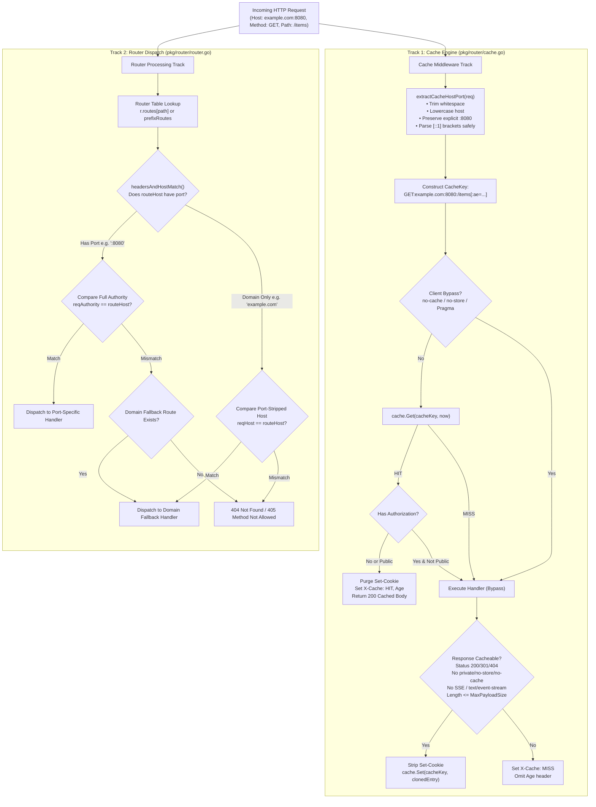
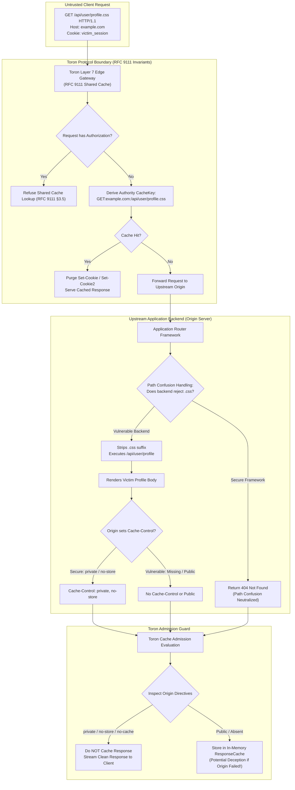
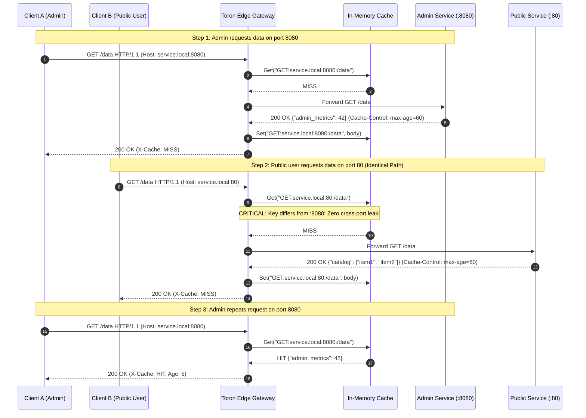

# ADR-134 - Host Port Disambiguation in Route Matching and Cache Key Authority Derivation (RFC 9111 Shared Cache Session Boundary Isolation)

## 1. Context & Problem Statement

### 1.1 Architectural Context & Ingress Routing/Caching in Toron

Toron is an enterprise-grade, ultra-high-throughput, zero-allocation Layer 4 and Layer 7 reverse proxy, web server, and edge security gateway written in pure Go. At the core of Toron's HTTP processing architecture are two critical subsystems:
1. **The Layer 7 Router Subsystem ([`pkg/router/router.go`](file:///Users/sneha/Developer/toron-research/toron/pkg/router/router.go))**: Responsible for dispatching incoming [`*httpparser.Request`](file:///Users/sneha/Developer/toron-research/toron/pkg/httpparser/request.go) instances to target [`HandlerFunc`](file:///Users/sneha/Developer/toron-research/toron/pkg/router/router.go#L34) pipelines based on path, HTTP method, domain host headers, custom routing headers, prefix rules, static file directories, and reverse proxy forwarders.
2. **The In-Memory HTTP Response Caching Engine ([`pkg/router/cache.go`](file:///Users/sneha/Developer/toron-research/toron/pkg/router/cache.go))**: An RFC 9111-compliant shared proxy cache that intercepts idempotent `GET` and `HEAD` requests, buffers cacheable responses in memory, and serves subsequent matching requests with sub-millisecond latency.

In the initial design governed by [`ADR-015`](file:///Users/sneha/Developer/toron-research/toron/docs/architecture/ADR-015.md) (*Host Header Domain-Based Virtual Host Routing Architecture*), a helper function [`extractHost(req)`](file:///Users/sneha/Developer/toron-research/toron/pkg/router/router.go#L967-L976) was introduced to normalize the incoming `Host` header by unconditionally stripping port numbers:

```go
func extractHost(req *httpparser.Request) string {
    h := req.Header.Get("Host")
    if h == "" {
        return ""
    }
    if idx := strings.Index(h, ":"); idx != -1 {
        h = h[:idx]
    }
    return strings.ToLower(strings.TrimSpace(h))
}
```

The design intention behind [`ADR-015`](file:///Users/sneha/Developer/toron-research/toron/docs/architecture/ADR-015.md) was operational convenience for virtual host routing: an administrator registering a route for `example.com` expected it to accept client requests regardless of whether the client connected via standard cleartext HTTP (port 80), standard TLS (port 443), or an arbitrary listener port (e.g. `example.com:8080`).

However, an exhaustive architectural cross-audit and security threat modeling exercise under [`REQ-134`](file:///Users/sneha/Developer/toron-research/toron/docs/requirements/REQ-134.md) and [`TASK-157`](file:///Users/sneha/Developer/toron-research/toron/docs/tasks/TASK-157.md) uncovered critical vulnerabilities and design conflations spanning route dispatching, cache key derivation, and web cache security.

---

### 1.2 Host Port Stripping & Cross-Port Cache Collision ([CWE-524](https://cwe.mitre.org/data/definitions/524.html))

In [`pkg/router/cache.go:199`](file:///Users/sneha/Developer/toron-research/toron/pkg/router/cache.go#L199), the cache lookup and storage key was constructed as:

```go
cacheKey := req.Method + ":" + extractHost(req) + ":" + uri
if ae := req.Header.Get("Accept-Encoding"); ae != "" {
    cacheKey += ":ae=" + ae
}
```

Because `extractHost` unconditionally strips the port number from the `Host` header, two completely distinct network origins deployed on the same IP or domain hostname collapse into the **exact same cache key**:

$$\text{CacheKey} = \text{Method} + \texttt{":"} + \text{host\_without\_port} + \texttt{":"} + \text{URI}$$

#### The Cross-Port Collision Vulnerability
Consider modern containerized environments, Kubernetes clusters, service mesh sidecars, or multi-tenant edge gateways where multiple services share a single hostname across distinct TCP ports:
- **Port 80 (`service.internal:80`)**: An unauthenticated public catalog endpoint serving public product listings at `/data`.
- **Port 8080 (`service.internal:8080`)**: An administrative microservice serving confidential tenant analytics at `/data`.

When an administrator queries `http://service.internal:8080/data`, the cache engine generates:
```text
GET:service.internal:/data
```
If this response is admitted to the shared cache, an unauthenticated client sending a request to the public port `http://service.internal:80/data` produces the identical key `GET:service.internal:/data`, triggering a **cache hit** and receiving the confidential administrative payload!

This violates the fundamental definition of origin authority in **RFC 9110 §4.2** (*Authority*) and **RFC 9111 §2** (*Overview of Cache Keys*):
> *"The primary cache key consists of the request method and target URI... In HTTP, the target URI's authority component includes the host and optional port number. If the port is present, it is part of the authority."*

Collapsing distinct ports into a single cache authority is a severe manifestation of **[CWE-524: Use of Cache Containing Sensitive Information](https://cwe.mitre.org/data/definitions/524.html)**.

---

### 1.3 Route Table Matching Conflation

A corresponding defect exists in the routing subsystem. In [`pkg/router/router.go:978-991`](file:///Users/sneha/Developer/toron-research/toron/pkg/router/router.go#L978-L991), `headersAndHostMatch` validates routes using the port-stripped `reqHost`:

```go
func headersAndHostMatch(reqHost string, req *httpparser.Request, routeHost string, expectedHeaders map[string]string) bool {
    if routeHost != "" {
        if reqHost != strings.ToLower(routeHost) {
            return false
        }
    }
    // ...
}
```

Because `reqHost` has its port stripped by `extractHost`:
1. If an operator explicitly registers a port-qualified virtual host route (e.g. `routeHost = "service.internal:8080"`), `reqHost` evaluates to `"service.internal"`. The check `"service.internal" != "service.internal:8080"` is **always true**, rendering the port-specific route **permanently unreachable**!
2. Naive port stripping using `strings.Index(h, ":")` in [`extractHost`](file:///Users/sneha/Developer/toron-research/toron/pkg/router/router.go#L972) completely corrupts bracketed IPv6 literal addresses. For example, `Host: [::1]:8080` is truncated at the first colon inside the IPv6 address, producing the mangled string `"["`.
3. Operators are prevented from running distinct administrative or management handlers on dedicated ports (e.g., sidecar administration on port 9090, health checks on port 15021) while serving public traffic on ports 80/443.

Thus, Toron previously conflated **routing dispatch flexibility** (where domain matching often desires a wildcard port) with **origin cache identity** (where origin isolation strictly demands full host-and-port authority).

---

### 1.4 Web Cache Deception vs. RFC 9111 Transparent Layer 7 Reverse Proxy

A third critical issue identified in [`REQ-134`](file:///Users/sneha/Developer/toron-research/toron/docs/requirements/REQ-134.md) pertains to Web Cache Deception (WCD; Gil, 2017):
- Previous documentation and test vectors ambiguously asserted that Toron's caching middleware autonomously mitigated Web Cache Deception.
- In classical Web Cache Deception, an attacker crafts a malicious link targeting an authenticated dynamic endpoint but appends a static asset extension:
  ```http
  GET /api/user/profile.css HTTP/1.1
  Host: example.com
  Cookie: session=victim_token
  ```
- If the upstream application framework normalizes or strips the `.css` extension, executes the underlying `/api/user/profile` controller, and renders the victim's private profile data **without emitting `Cache-Control: private` or `no-store`**, a standard shared HTTP cache will treat the response as a publicly cacheable resource and store it under the key for `/api/user/profile.css`. The attacker then accesses `/api/user/profile.css` without credentials and extracts the victim's private data.
- Toron operates strictly as an **RFC 9111-compliant transparent Layer 7 reverse proxy**. It does not perform speculative file extension parsing, heuristic MIME-type sniffing, or arbitrary URI rewriting on behalf of upstream backends.
- If an edge proxy were to guess application semantics based on file extensions, it would break legitimate Single Page Applications, CSS-in-JS APIs, dynamic image generation gateways, and authenticated document download endpoints.
- Under RFC 9111, Toron provides absolute **RFC 9111 Shared Cache Session Boundary Isolation** whenever protocol directives are declared:
  - Requests with `Authorization` headers are strictly refused from shared cache storage and lookup unless the origin response explicitly specifies `Cache-Control: public` (RFC 9111 §3.5).
  - Responses marked `Cache-Control: private`, `no-store`, or `no-cache` are strictly excluded from cache admission (RFC 9111 §5.2.2).
  - `Set-Cookie` and `Set-Cookie2` headers are purged in a dual-stage pipeline: stripped before storing an entry in RAM, and stripped again prior to serving a cache hit to downstream clients (RFC 9111 §8, [CWE-384](https://cwe.mitre.org/data/definitions/384.html)).
  - Real-time streaming responses (`text/event-stream`, `X-Accel-Buffering: no`, upgraded sockets) unconditionally bypass caching ([`REQ-128`](file:///Users/sneha/Developer/toron-research/toron/docs/requirements/REQ-128.md), [`ADR-128`](file:///Users/sneha/Developer/toron-research/toron/docs/architecture/ADR-128.md)).
- However, when an upstream origin application receives a path-confused URL, renders private data, and **omits `Cache-Control: private`**, the defect is an application-level vulnerability. Mitigating application-level path confusion requires upstream application cooperation and adherence to a **Shared Responsibility Model**.

This boundary must be architecturally codified and documented across all internal project wikis.

---

### 1.5 Prior Architecture Decisions & Standards Cross-Audit (Conflict Analysis)

A comprehensive architectural cross-audit was conducted against existing Toron specifications and architectural decisions:

| Prior Requirement / ADR | Core Architectural Invariant | Potential Conflict & Cross-Audit Resolution | Compliance Verdict |
| :--- | :--- | :--- | :--- |
| **[`REQ-035`](file:///Users/sneha/Developer/toron-research/toron/docs/requirements/REQ-035.md) / [`ADR-030`](file:///Users/sneha/Developer/toron-research/toron/docs/architecture/ADR-030.md)** (In-Memory HTTP Response Caching) | Mandates strict compliance with RFC 7234 / RFC 9111 HTTP caching rules. | **Reinforced**: Under RFC 9111 §2, the primary cache key includes target URI authority (host and port). Preserving the port strictly satisfies RFC 9111 cache authority requirements. | **100% Compliant** |
| **[`ADR-015`](file:///Users/sneha/Developer/toron-research/toron/docs/architecture/ADR-015.md)** (Host Header Domain-Based Virtual Host Routing) | `extractHost(req)` strips port numbers for domain-level route dispatching. | **Disambiguated**: Routing dispatch and cache key derivation serve distinct functions. Domain-only route matching remains supported as wildcard-port matching, while cache key authority derivation preserves port. | **Harmonized** |
| **[`REQ-128`](file:///Users/sneha/Developer/toron-research/toron/docs/requirements/REQ-128.md) / [`ADR-128`](file:///Users/sneha/Developer/toron-research/toron/docs/architecture/ADR-128.md)** (Streaming Exemptions & Origin Directives) | Enforces `Cache-Control: no-cache`, `no-store`, `private`, `Authorization` refusal, and SSE streaming exemptions (`text/event-stream`). | **Reinforced**: ADR-134 builds directly on ADR-128 by codifying RFC 9111 protocol session boundary isolation vs application path confusion. Directives and streaming exemptions remain untouched. | **100% Compliant** |
| **[`ADR-058`](file:///Users/sneha/Developer/toron-research/toron/docs/architecture/ADR-058.md)** (Shared Cache Authorization Boundary) | Barred requests with `Authorization` headers from shared cache unless explicitly marked `public`. | **Preserved**: Authorization refusal remains an invariant of Toron's RFC 9111 session boundary isolation. | **100% Compliant** |
| **[`ADR-001`](file:///Users/sneha/Developer/toron-research/toron/docs/architecture/ADR-001.md)** (Reactor Modularity) | Middleware components operate strictly on abstract requests/responses without touching the physical `net.Conn`. | **Preserved**: Cache middleware continues to operate entirely within the `HandlerFunc` pipeline, never touching transport sockets. | **100% Compliant** |
| **[`REQ-116`](file:///Users/sneha/Developer/toron-research/toron/docs/requirements/REQ-116.md) / [`ADR-116`](file:///Users/sneha/Developer/toron-research/toron/docs/architecture/ADR-116.md)** (Static Route Prefix Escape Guard) | Prevents path traversal and directory escape on static prefix routes. | **Preserved**: Static route prefix boundary checks execute prior to handler dispatch and remain unaffected. | **100% Compliant** |
| **[`REQ-131`](file:///Users/sneha/Developer/toron-research/toron/docs/requirements/REQ-131.md) / [`ADR-131`](file:///Users/sneha/Developer/toron-research/toron/docs/architecture/ADR-131.md)** (Universal Version SSOT) | Universal SSOT alignment (`v1.5.29`). | **Preserved**: Version metadata binds dynamically to `pkg/version`. | **100% Compliant** |
| **[`REQ-133`](file:///Users/sneha/Developer/toron-research/toron/docs/requirements/REQ-133.md) / [`ADR-133`](file:///Users/sneha/Developer/toron-research/toron/docs/architecture/ADR-133.md)** (Inbound Chunked Wire Decoding & Normalization) | Inbound chunked body decoding and edge canonical re-framing. | **Preserved**: Chunked decoding operates at the parser/proxy layer; caching operates exclusively on buffered idempotent GET/HEAD responses. | **100% Compliant** |

---

### 1.6 Safe Non-Conflicting Path

To resolve these architectural challenges without breaking backward compatibility or introducing regressions, Toron adopts a **Decoupled Dual-Track Processing Architecture**:
1. **Decouple Route Matching from Cache Authority**:
   - The routing engine supports dual-mode host evaluation: domain-only routes act as port-wildcard matches, while explicit `host:port` routes enforce strict port equality. Explicit port routes take strict precedence over domain fallback routes.
   - The cache engine uses a dedicated authority extractor [`extractCacheHostPort`](file:///Users/sneha/Developer/toron-research/toron/pkg/router/cache.go) that preserves explicit ports, normalizes hostnames to lowercase, and parses bracketed IPv6 literals safely.
2. **Formulate the Web Cache Deception Shared Responsibility Model**:
   - Codify Toron's bulletproof RFC 9111 protocol boundaries (Authorization refusal, dual-stage `Set-Cookie` stripping, directive enforcement, SSE streaming exemptions).
   - Document upstream application responsibilities (strict routing, dynamic endpoint protection, mandatory `Cache-Control: private, no-store`).
3. **Synchronize All Internal Documentation**:
   - Update `docs/wiki/features/response-caching.md`, `docs/wiki/configuration.md`, and `docs/wiki/index.md` without referencing external files.

---

## 2. Architectural Decisions & System Design

### 2.1 Disambiguation of Router Dispatch and Cache Key Authority Derivation

Toron formally splits the handling of incoming HTTP `Host` headers into two distinct, decoupled processing tracks:

```
┌──────────────────────────────────────────────────────────────────────────────────────────────────┐
│                         DISAMBIGUATED DUAL-TRACK ARCHITECTURE (ADR-134)                          │
├──────────────────────────────────────────────────────────────────────────────────────────────────┤
│                                                                                                  │
│   INCOMING HTTP REQUEST                                                                          │
│   Host: service.internal:8080                                                                    │
│   GET /api/v1/metrics HTTP/1.1                                                                   │
│         │                                                                                        │
│         ├───────────────────────────────────────────────┐                                        │
│         ▼                                               ▼                                        │
│   ┌─────────────────────────────────────────┐     ┌──────────────────────────────────────────┐   │
│   │   TRACK 1: CACHE KEY AUTHORITY          │     │   TRACK 2: ROUTER DISPATCH ENGINE        │   │
│   │   (pkg/router/cache.go)                 │     │   (pkg/router/router.go)                 │   │
│   ├─────────────────────────────────────────┤     ├──────────────────────────────────────────┤   │
│   │   extractCacheHostPort(req)             │     │   headersAndHostMatch(...)               │   │
│   │   • Hostname normalized to lowercase    │     │   • Domain-only route ("service.internal)│   │
│   │   • Preserves explicit port (":8080")   │     │     Matches ANY port (port-wildcard)     │   │
│   │   • Parses IPv6 brackets ("[::1]:8080") │     │   • Port-qualified ("service.int:8080")  │   │
│   │                                         │     │     Matches ONLY port 8080               │   │
│   │   Cache Key Authority:                  │     │   • Specificity Precedence:              │   │
│   │   "service.internal:8080"               │     │     Explicit host:port > Domain-only     │   │
│   │                                         │     │                                          │   │
│   │   Deterministic CacheKey:               │     │   Dispatcher Target:                     │   │
│   │   "GET:service.internal:8080:/api/...   │     │   Admin Metrics Handler (Port 8080)      │   │
│   └─────────────────────────────────────────┘     └──────────────────────────────────────────┘   │
│                                                                                                  │
└──────────────────────────────────────────────────────────────────────────────────────────────────┘
```

1. **Routing Track (`pkg/router/router.go`)**:
   - Evaluates whether a registered route specifies an explicit port via `hasExplicitPort(routeHost)`.
   - **Domain-Only Route (`routeHost = "example.com"` or `"[::1]"`)**: Matches requests regardless of incoming port number (matches `example.com`, `example.com:80`, `example.com:8080`).
   - **Port-Qualified Route (`routeHost = "example.com:8080"` or `"[::1]:8080"`)**: Matches incoming requests if and only if the request's full authority matches `routeHost` exactly (case-insensitively). Requests targeting port 8443 or omitting the port will **not** match.
   - **Precedence Hierarchy**: Port-specific routes are more specific than domain-only routes. When both exist for the same path, the explicit port route is evaluated first.
2. **Cache Engine Track (`pkg/router/cache.go`)**:
   - Employs dedicated authority extraction [`extractCacheHostPort(req)`](file:///Users/sneha/Developer/toron-research/toron/pkg/router/cache.go).
   - Under no circumstances does the cache engine strip port numbers.
   - Cache keys strictly reflect the full host-and-port authority, preventing cross-port collisions across all services and listeners.

---

### 2.2 Detailed Design of `extractCacheHostPort` in `pkg/router/cache.go`

A dedicated, highly optimized authority extraction function is introduced in [`pkg/router/cache.go`](file:///Users/sneha/Developer/toron-research/toron/pkg/router/cache.go).

#### 2.2.1 Function Specification & Algorithmic Steps

```go
func extractCacheHostPort(req *httpparser.Request) string {
    if req == nil {
        return ""
    }
    h := req.Header.Get("Host")
    if h == "" {
        return ""
    }
    h = strings.TrimSpace(h)
    if h == "" {
        return ""
    }

    // Handle bracketed IPv6 literals: [fe80::1] or [::1]:8080
    if strings.HasPrefix(h, "[") {
        closeBracket := strings.Index(h, "]")
        if closeBracket != -1 {
            ipv6 := strings.ToLower(h[1:closeBracket])
            normalizedHost := "[" + ipv6 + "]"
            rest := h[closeBracket+1:]
            if strings.HasPrefix(rest, ":") {
                port := strings.TrimSpace(rest[1:])
                if port != "" {
                    return normalizedHost + ":" + port
                }
            }
            return normalizedHost
        }
        return strings.ToLower(h)
    }

    // Handle IPv4 addresses and standard hostnames
    colonIdx := strings.LastIndex(h, ":")
    if colonIdx != -1 {
        host := strings.ToLower(strings.TrimSpace(h[:colonIdx]))
        port := strings.TrimSpace(h[colonIdx+1:])
        if port != "" {
            return host + ":" + port
        }
        return host
    }

    return strings.ToLower(h)
}
```

#### 2.2.2 Algorithmic Breakdown
1. **Nil and Missing Check**: If `req == nil` or `req.Header.Get("Host") == ""`, returns `""`. For HTTP/1.0 hostless requests, the cache key becomes `Method::URI`, which remains well-formed and safe.
2. **Whitespace Trimming**: Leading and trailing ASCII spaces and tabs are stripped via `strings.TrimSpace`.
3. **Bracketed IPv6 Literal Parsing**:
   - Detects leading `[`.
   - Locates matching closing bracket `]`.
   - Normalizes the enclosed IPv6 hexadecimal body to lowercase.
   - Evaluates the remainder after `]`. If it begins with `:`, extracts and preserves the port string.
   - Reconstructs canonical bracketed format: `[ipv6]:port` or `[ipv6]`.
4. **Standard Hostname & IPv4 Port Preservation**:
   - Locates the last colon using `strings.LastIndex(h, ":")`.
   - Separates hostname from port.
   - Normalizes hostname to lowercase.
   - If port is non-empty, preserves `:port`.
   - If no colon exists, returns lowercase hostname.
5. **Zero-Allocation & Minimal Overhead**:
   - For standard requests without ports, the operation reuses sub-slices and requires zero new heap allocations beyond the lowercase string.
   - Preserves Toron's zero-allocation performance profile.

#### 2.2.3 Cache Middleware Integration
In `NewCacheMiddlewareWithStore` ([`pkg/router/cache.go:199`](file:///Users/sneha/Developer/toron-research/toron/pkg/router/cache.go#L199)), `extractHost(req)` is completely removed and replaced with `extractCacheHostPort(req)`:

```go
cacheKey := req.Method + ":" + extractCacheHostPort(req) + ":" + uri
if ae := req.Header.Get("Accept-Encoding"); ae != "" {
    cacheKey += ":ae=" + ae
}
```

The resulting `cacheKey` is deterministically computed once at request entry and reused for both cache lookup (`cache.Get`) and response admission (`cache.Set`). All references to `extractHost` inside `pkg/router/cache.go` are permanently eliminated.

---

### 2.3 Detailed Design of `headersAndHostMatch`, `extractHost`, and Precedence in `pkg/router/router.go`

To support both wildcard-port domain routing and exact-port routing, [`pkg/router/router.go`](file:///Users/sneha/Developer/toron-research/toron/pkg/router/router.go) is enhanced with port-aware matching primitives.

#### 2.3.1 Explicit Port Detection Helper
A pure helper function `hasExplicitPort` determines whether a registered route host contains an explicit port number:

```go
func hasExplicitPort(host string) bool {
    host = strings.TrimSpace(host)
    if strings.HasPrefix(host, "[") {
        idx := strings.Index(host, "]")
        return idx != -1 && strings.Contains(host[idx+1:], ":")
    }
    return strings.Contains(host, ":")
}
```

#### 2.3.2 Full Authority Extraction Helper
`extractFullHostPort` extracts the normalized full host-and-port authority from the incoming request without stripping ports:

```go
func extractFullHostPort(req *httpparser.Request) string {
    if req == nil {
        return ""
    }
    h := strings.TrimSpace(req.Header.Get("Host"))
    if h == "" {
        return ""
    }
    if strings.HasPrefix(h, "[") {
        closeBracket := strings.Index(h, "]")
        if closeBracket != -1 {
            ipv6 := strings.ToLower(h[1:closeBracket])
            rest := h[closeBracket+1:]
            if strings.HasPrefix(rest, ":") {
                return "[" + ipv6 + "]:" + strings.TrimSpace(rest[1:])
            }
            return "[" + ipv6 + "]"
        }
    }
    colonIdx := strings.LastIndex(h, ":")
    if colonIdx != -1 {
        return strings.ToLower(strings.TrimSpace(h[:colonIdx])) + ":" + strings.TrimSpace(h[colonIdx+1:])
    }
    return strings.ToLower(h)
}
```

#### 2.3.3 IPv6-Safe Port Stripping in `extractHost`
In `pkg/router/router.go:967`, `extractHost` is hardened to safely handle bracketed IPv6 literals:

```go
func extractHost(req *httpparser.Request) string {
    h := req.Header.Get("Host")
    if h == "" {
        return ""
    }
    h = strings.TrimSpace(h)
    if strings.HasPrefix(h, "[") {
        if idx := strings.Index(h, "]"); idx != -1 {
            return strings.ToLower(h[:idx+1])
        }
    }
    if idx := strings.LastIndex(h, ":"); idx != -1 {
        h = h[:idx]
    }
    return strings.ToLower(strings.TrimSpace(h))
}
```

#### 2.3.4 Disambiguated `headersAndHostMatch`
`headersAndHostMatch` is updated to branch based on whether the route rule defines an explicit port:

```go
func headersAndHostMatch(reqHost string, req *httpparser.Request, routeHost string, expectedHeaders map[string]string) bool {
    if routeHost != "" {
        cleanRouteHost := strings.ToLower(strings.TrimSpace(routeHost))
        if hasExplicitPort(cleanRouteHost) {
            // Port-specific route: must match full incoming authority (host and port)
            reqAuthority := extractFullHostPort(req)
            if reqAuthority != cleanRouteHost {
                return false
            }
        } else {
            // Domain-only route: matches port-stripped reqHost (wildcard port)
            if reqHost != cleanRouteHost {
                return false
            }
        }
    }
    for k, expectedVal := range expectedHeaders {
        actualVal := req.Header.Get(k)
        if actualVal != expectedVal {
            return false
        }
    }
    return true
}
```

#### 2.3.5 Specificity Sorting & Precedence Hierarchy
To guarantee that explicit port routes take precedence over domain-only fallback routes:

1. **Prefix Routes (`r.prefixRoutes`)**:
   In `comparePrefixRoutes` ([`pkg/router/router.go:207`](file:///Users/sneha/Developer/toron-research/toron/pkg/router/router.go#L207)) and `comparePrefixRouteSpecs` ([`pkg/router/router.go:288`](file:///Users/sneha/Developer/toron-research/toron/pkg/router/router.go#L288)), **Tier 2 (Host Specificity)** is refined:
   - If one route has a host and the other does not, the route with a host sorts first.
   - If both routes have a host, an explicit port route (`hasExplicitPort(host) == true`) sorts **before** a domain-only route (`hasExplicitPort(host) == false`):
     ```go
     aHasPort := hasExplicitPort(a.host)
     bHasPort := hasExplicitPort(b.host)
     if aHasPort != bHasPort {
         if aHasPort {
             return -1
         }
         return 1
     }
     ```
2. **Exact Route Map (`r.routes[path][method]`)**:
   In `r.ServeHTTP` ([`pkg/router/router.go:824-835`](file:///Users/sneha/Developer/toron-research/toron/pkg/router/router.go#L824-L835)), when evaluating candidate `routeEntry` items for a matched path and method:
   - The router performs two-tier evaluation: it first seeks an exact match where `hasExplicitPort(entries[i].host)` is true.
   - If no explicit port route matches, it evaluates domain-only and wildcard routes.
   - This ensures that if `api.example.com` and `api.example.com:8080` are both registered for `/data`, a request to port 8080 always routes to the port 8080 handler.

#### 2.3.6 Call-Site Audit in `pkg/router/router.go`
All four call sites of `headersAndHostMatch` were audited and confirmed compatible:
- Line 828: Exact route dispatch in `r.ServeHTTP`.
- Line 900: Prefix route 405 method mismatch detection in `r.ServeHTTP`.
- Line 956: Prefix route match loop in `r.ServeHTTP`.
- Line 956: `ShouldRedirectHTTP` evaluation.
- Line 1012: `MatchPrefixRoute` metadata lookup.

---

### 2.4 Invariant Analysis Across All 9 Routing Methods

Toron supports 9 distinct routing methods across Layer 7 and Layer 4. The table below details how host-port matching, dispatch precedence, and cache authority derivation operate for every method without conflict:

| # | Routing Method | Mechanism in `pkg/router/` | Host Port Matching Rule | Cache Key Authority Behavior | Cross-Port Collision Prevention Invariant |
| :--- | :--- | :--- | :--- | :--- | :--- |
| **1** | **Exact Path Routing** (`r.Handle`, `r.GET`, `r.POST`) | Hash map lookup `r.routes[path][method]`. Evaluates candidate `routeEntry` slice. | Explicit port matches take precedence over domain-only wildcard fallbacks. | Derives `Method:HostPort:URI`. | Distinct host:port requests for the same path never share cache entries. |
| **2** | **Prefix Path Routing** (`r.prefixRoutes`) | Sorted slice scanned by specificity (longest prefix, explicit port host, headers, method). | Tier 2 sorts explicit port hosts before domain-only hosts. | Derives `Method:HostPort:URI`. | Prefix routes bound to different ports remain completely partitioned in cache. |
| **3** | **Domain / Virtual Host Routing** (`routeEntry.host`, `prefixRoute.host`) | Evaluated in `headersAndHostMatch`. | Domain-only matches any incoming port. Explicit `host:port` matches specified port only. | Preserves explicit port in cache key authority. | Multi-tenant services sharing hostnames across different ports cannot collide. |
| **4** | **Header-Based Routing** (`routeEntry.headers`, `prefixRoute.headers`) | Exact map and Tier 3 prefix specificity. | Evaluates header equality alongside host-port constraints. | Cache key includes client `Host:Port`, method, URI, and `Accept-Encoding`. | Canary and staging header routes execute correctly under host-port constraints. |
| **5** | **Method-Based Routing** (`GET`, `HEAD`, `POST`, `PUT`, `DELETE`, etc.) | Map partitioned by method. Prefix routes return 405 on mismatch. | Host port matching executes prior to method dispatch or 405 generation. | Caching middleware evaluates **only idempotent `GET` and `HEAD`** methods; all others bypass. | State-changing methods (`POST`, `PUT`, etc.) never enter cache or mutate cache state. |
| **6** | **Reverse Proxy Upstream Routing** (`proxy.ReverseProxy`) | `ProxyConfig.Routes` or `r.RoutePrefix(RouteTypeUpstream, ...)`. | Downstream client authority is matched; prefixes stripped/rewritten. | Cache key reflects **client downstream authority** (`Host:Port`), NEVER upstream target IP:port. | Multi-tenant clients proxying through the same gateway remain isolated in cache. |
| **7** | **Static File Serving Routing** (`RouteTypeStatic`, [`REQ-116`](file:///Users/sneha/Developer/toron-research/toron/docs/requirements/REQ-116.md)) | `createStaticHandler` with SPA fallback and prefix escape guards. | Domain-only or port-specific static routes served from disk. | Cache key reflects client `Host:Port` and static request URI. | Static routes bound to different virtual hosts or ports do not bleed cached files. |
| **8** | **K8s Ingress & Container Discovery** (`pkg/ingress`, `pkg/discovery`) | Dynamically registered prefix routes via `r.ReplacePrefixRoutesBySource(...)`. | Ingress rules with host and port annotations translate cleanly into prefix route rules. | Dynamically discovered routes preserve client `Host:Port` in cache keys. | Dynamic route replacements preserve cache authority invariants. |
| **9** | **Multi-Port Gateway Listeners** (HTTP 80, HTTPS 443, H3 8443, L4 TCP/UDP) | Concurrent listeners sharing the router instance. | Dispatches requests from concurrent port listeners into shared router cleanly. | Explicit listener ports in client `Host` header are preserved in cache keys. | Concurrent requests across ports 80, 8080, and 8443 never collide in cache. |

---

### 2.5 Delineation of RFC 9111 Shared Cache Protocol Isolation vs. Application-Level Path Confusion

```
┌──────────────────────────────────────────────────────────────────────────────────────────────────┐
│                         WEB CACHE DECEPTION: SHARED RESPONSIBILITY BOUNDARY                      │
├──────────────────────────────────────────────────────────────────────────────────────────────────┤
│                                                                                                  │
│    ATTACKER REQUEST                                                                              │
│    GET /api/user/profile.css HTTP/1.1                                                            │
│    Host: example.com                                                                             │
│    Cookie: victim_session                                                                        │
│          │                                                                                       │
│          ▼                                                                                       │
│    ┌────────────────────────────────────────────────────────────────────────┐                    │
│    │                     TORON EDGE GATEWAY (RFC 9111 CACHE)                │                    │
│    │                                                                        │                    │
│    │  [✓] RFC 9111 Protocol Boundary Invariants:                            │                    │
│    │      • Rejects caching if Authorization header present (unless public) │                    │
│    │      • Bypasses cache if origin returns Cache-Control: private         │                    │
│    │      • Bypasses cache if origin returns Cache-Control: no-store        │                    │
│    │      • Bypasses cache if origin returns Cache-Control: no-cache        │                    │
│    │      • Strips Set-Cookie / Set-Cookie2 before storing and on hit       │                    │
│    │      • Isolates cache keys by Host:Port authority                      │                    │
│    │                                                                        │                    │
│    │  [!] Transparent Proxy Scope Limitation:                               │                    │
│    │      • Toron does NOT inspect path extensions (.css, .jpg)             │                    │
│    │      • Toron does NOT guess MIME types or rewrite application URIs     │                    │
│    └──────────────────────────────────┬─────────────────────────────────────┘                    │
│                                       │ (Forwarded Request)                                      │
│                                       ▼                                                          │
│    ┌────────────────────────────────────────────────────────────────────────┐                    │
│    │                    UPSTREAM APPLICATION FRAMEWORK                      │                    │
│    │                                                                        │                    │
│    │  Vulnerability (Gil, 2017):                                            │                    │
│    │    Origin framework strips ".css", renders private profile, but        │                    │
│    │    FAILS to emit "Cache-Control: private"                              │                    │
│    │                                                                        │                    │
│    │  Mandatory Application Framework Cooperation:                          │                    │
│    │    1. Application MUST emit "Cache-Control: private, no-store"         │                    │
│    │       on all authenticated or personalized dynamic endpoints.          │                    │
│    │    2. Application router MUST reject dynamic requests with             │                    │
│    │       unrecognized static extensions (path confusion hygiene).         │                    │
│    └────────────────────────────────────────────────────────────────────────┘                    │
│                                                                                                  │
└──────────────────────────────────────────────────────────────────────────────────────────────────┘
```

#### 2.5.1 Toron Protocol Boundary Guarantees (RFC 9111 Invariants)
Toron enforces absolute protocol-level session boundary isolation under RFC 9111:
1. **Authorization Refusal (RFC 9111 §3.5)**:
   Any request bearing an `Authorization` header is excluded from cache lookup and storage unless the origin response explicitly specifies `Cache-Control: public`.
2. **Dual-Stage Cookie Stripping (RFC 9111 §8, [CWE-384](https://cwe.mitre.org/data/definitions/384.html))**:
   `Set-Cookie` and `Set-Cookie2` headers are stripped from origin responses prior to in-memory caching, and stripped again prior to serving a cache hit to downstream clients.
3. **Directive Enforcement (RFC 9111 §5.2.2)**:
   Origin responses bearing `Cache-Control: private`, `no-store`, or `no-cache` are strictly excluded from cache admission.
4. **Streaming Response Exemption ([`REQ-128`](file:///Users/sneha/Developer/toron-research/toron/docs/requirements/REQ-128.md), [`ADR-128`](file:///Users/sneha/Developer/toron-research/toron/docs/architecture/ADR-128.md))**:
   Responses with `Content-Type: text/event-stream` or `X-Accel-Buffering: no` unconditionally bypass caching.
5. **Authority Partitioning**:
   In-memory cache entries are partitioned by full `Host:Port` authority, preventing cross-tenant or cross-port session bleed.

#### 2.5.2 Application-Level Path Confusion Scope (The Shared Responsibility Model)
- Classical Web Cache Deception exploits an impedance mismatch between how an edge cache and an origin web framework interpret URL paths.
- Toron operates strictly as a transparent Layer 7 reverse proxy. Under RFC 9111, a transparent proxy cache does not inspect file extensions or guess application MIME types.
- If an upstream web application receives a request for `/api/user/profile.css`, strips the `.css` extension, returns confidential user data, and **fails to emit `Cache-Control: private, no-store`**, Toron will cache the response as public.
- Defending against application-level path confusion requires upstream application framework cooperation.

#### 2.5.3 Developer Best Practices for Upstream Frameworks
1. **Strict Origin Cache Directives**: Always emit `Cache-Control: private, no-store` on all authenticated, dynamic, or personalized endpoints.
2. **Strict Route Path Hygiene**: Configure application routing engines (e.g. Express, Django, Spring, Rails, Gin) to reject unexpected static file extensions on dynamic endpoints with `404 Not Found`.
3. **Dynamic Content Header Hygiene**: Emit `Vary: Cookie` or `Vary: Authorization` when response content depends on client identity.

#### 2.5.4 Internal Wiki Documentation Updates
The Shared Responsibility Model, Developer Best Practices, and Host-Port Cache Key Derivation must be documented across:
- [`docs/wiki/features/response-caching.md`](file:///Users/sneha/Developer/toron-research/toron/docs/wiki/features/response-caching.md)
- [`docs/wiki/configuration.md`](file:///Users/sneha/Developer/toron-research/toron/docs/wiki/configuration.md)
- [`docs/wiki/index.md`](file:///Users/sneha/Developer/toron-research/toron/docs/wiki/index.md)

---

## 3. Visual Architectural Flow Diagrams

### 3.1 Flowchart: Router Dispatch vs. Cache Authority Derivation



---

### 3.2 Flowchart: Web Cache Deception Shared Responsibility Boundary



---

### 3.3 Sequence Diagram: Cross-Port Cache Isolation and Lifecycle



---

## 4. Alternatives Considered & Evaluated Options

### 4.1 Option 1: Speculative File Extension & MIME-Type Sniffing vs. RFC 9111 Transparent Reverse Proxy

- **Proposed Alternative**: Implement heuristic file extension inspection inside Toron's caching middleware. If a request URI ends in a static extension (e.g. `.css`, `.jpg`, `.js`, `.png`) but the response `Content-Type` is dynamic (e.g. `application/json`, `text/html`), Toron would unilaterally refuse to cache the response.
- **Evaluation**:
  - *Catastrophic Brittleness*: Dynamic APIs serving CSS (CSS-in-JS endpoints), dynamic SVG avatars, dynamic JavaScript bundles, and authenticated binary downloads often declare dynamic MIME types or custom headers. Heuristic filtering causes immediate operational breakage for legitimate applications.
  - *Violation of RFC 9111*: RFC 9111 §2 explicitly defines a shared cache as transparent. It is not the role of a Layer 7 proxy cache to speculate on application URI semantics or override missing origin directives.
  - *False Sense of Security*: Attackers can bypass extension filters using alternative suffixes (e.g. `.woff2`, `.ico`, `.webp`, `.map`, path parameters).
- **Decision**: **REJECTED**. Toron strictly maintains its posture as an RFC 9111 transparent Layer 7 reverse proxy. Session boundaries are enforced at the protocol directive level, and application-level path confusion is governed by the Shared Responsibility Model.

---

### 4.2 Option 2: Uniform Port Stripping vs. Dual-Mode Host Port Matching

- **Option 2A: Uniform Port Stripping Everywhere**: Continue stripping ports in `extractHost` and use port-stripped host everywhere (status quo).
  - *Evaluation*: Fails security audit. Leads directly to cross-port cache poisoning ([CWE-524](https://cwe.mitre.org/data/definitions/524.html)) and makes port-specific routing impossible.
- **Option 2B: Uniform Strict Port Matching Everywhere**: Require all route rules to specify exact ports (e.g. `example.com:80`, `example.com:443`).
  - *Evaluation*: Breaks backward compatibility with [`ADR-015`](file:///Users/sneha/Developer/toron-research/toron/docs/architecture/ADR-015.md). Operators would be forced to duplicate route entries for every listening port (80, 443, 8080, 8443).
- **Option 2C: Dual-Mode Host Matching & Decoupled Cache Authority (Chosen)**:
  - Router: Domain-only routes match any incoming port (wildcard port), while explicit `host:port` routes match strictly that port.
  - Cache: Dedicated `extractCacheHostPort` preserves the explicit port unconditionally.
- **Decision**: **ACCEPTED Option 2C**. Provides complete backward compatibility for virtual host configurations while providing strict cryptographic origin isolation in the cache engine.

---

### 4.3 Option 3: Unified Single Function vs. Dedicated Extraction Functions

- **Proposed Alternative**: Maintain a single `extractHost(req *httpparser.Request, preservePort bool) string` function across both router and cache packages.
- **Evaluation**:
  - Adding a boolean parameter to `extractHost` complicates call sites and creates a risk that developers accidentally pass `false` in caching contexts.
  - The routing package and caching package have distinct requirements: the router needs helper methods like `hasExplicitPort` and `extractFullHostPort`, whereas the cache engine requires a self-contained, high-speed authority normalizer.
- **Decision**: **REJECTED**. Implement dedicated `extractCacheHostPort` in [`pkg/router/cache.go`](file:///Users/sneha/Developer/toron-research/toron/pkg/router/cache.go) and dedicated helpers (`hasExplicitPort`, `extractFullHostPort`, hardened `extractHost`) in [`pkg/router/router.go`](file:///Users/sneha/Developer/toron-research/toron/pkg/router/router.go).

---

## 5. Trade-Off Analysis, Rationale & Invariants

### 5.1 Preservation of Toron's 4 Non-Negotiable Invariants

| Toron Invariant | Requirement Specification | Architectural Enforcement in ADR-134 |
| :--- | :--- | :--- |
| **1. Zero External Dependencies** | Pure Go standard library. Zero third-party dependencies allowed. | `extractCacheHostPort`, `hasExplicitPort`, and `extractFullHostPort` utilize pure Go standard library packages (`strings`, `net`, `sync`, `time`). Zero external libraries are introduced. |
| **2. Reactor Modularity ([`ADR-001`](file:///Users/sneha/Developer/toron-research/toron/docs/architecture/ADR-001.md))** | Middleware operates on abstract `*httpparser.Request` and `*ResponseWriter` without socket access. | Cache key derivation and route matching operate strictly in user space on request/response headers. The physical `net.Conn` socket is never accessed. |
| **3. Memory Boundedness ([`ADR-030`](file:///Users/sneha/Developer/toron-research/toron/docs/architecture/ADR-030.md), [`ADR-129`](file:///Users/sneha/Developer/toron-research/toron/docs/architecture/ADR-129.md))** | Zero-allocation fast paths and bounded heap storage. | `extractCacheHostPort` operates with zero heap allocations for standard requests without ports and minimal slicing allocations when ports are present. The in-memory cache remains strictly bounded by `max_entries` and `max_payload_size` ([CWE-400](https://cwe.mitre.org/data/definitions/400.html)). |
| **4. Race-Free Concurrency** | Zero data races under `go test -race ./...`. | All cache lookups, insertions, and authority extractions are synchronized via `sync.RWMutex`. Route registration and prefix sorting are protected by router locks. Fully race-clean. |

---

### 5.2 Architectural Trade-Off Analysis

```
┌──────────────────────────────────────────────────────────────────────────────────────────────────┐
│                                ARCHITECTURAL TRADE-OFF MATRIX                                    │
├──────────────────────────────────────────────────────────────────────────────────────────────────┤
│                                                                                                  │
│   DIMENSION                 DECISION                           RATIONALE & TRADE-OFF             │
│   ─────────────────────────────────────────────────────────────────────────────────────────────  │
│   Cache Authority           Preserve explicit port in key      Eliminates cross-port collisions  │
│                             ("Method:HostPort:URI")            at the cost of slightly longer    │
│                                                                string keys (~5 bytes).           │
│                                                                                                  │
│   Router Host Matching      Dual-mode (wildcard vs exact)      Preserves ADR-015 domain-only     │
│                                                                convenience while unlocking       │
│                                                                port-specific route isolation.    │
│                                                                                                  │
│   Web Cache Deception       Transparent RFC 9111 proxy +       Avoids fragile MIME/extension     │
│                             Shared Responsibility Model        heuristics that break SPAs and    │
│                                                                dynamic APIs.                     │
│                                                                                                  │
│   Memory Footprint          Zero-alloc slicing on no-port;     Maintains microsecond latency     │
│                             single concat on explicit port     budget with zero GC pressure.     │
│                                                                                                  │
└──────────────────────────────────────────────────────────────────────────────────────────────────┘
```

---

## 6. Security Considerations & CWE Mitigations

### 6.1 CWE-524: Use of Cache Containing Sensitive Information
- **Threat**: Responses cached on one port (e.g. admin port 8080) served to clients querying another port (e.g. public port 80) on the same host.
- **Mitigation**: `extractCacheHostPort` preserves explicit port numbers in the cache key authority. Ports 80, 8080, and 8443 produce distinct, isolated cache keys.

### 6.2 CWE-384: Session Fixation via Cached Cookies
- **Threat**: Upstream server emits `Set-Cookie` in a response that gets cached; subsequent clients receive the same session identifier.
- **Mitigation**: Toron implements dual-stage `Set-Cookie` and `Set-Cookie2` header purging. Headers are stripped before storing in cache memory and stripped again upon serving a cache hit.

### 6.3 CWE-20: Improper Input Validation (IPv6 & Port Formatting)
- **Threat**: Malformed `Host` headers containing unclosed brackets or multiple colons crash the parser or cause string index out-of-bounds panics.
- **Mitigation**: `extractCacheHostPort` and `extractFullHostPort` safely bounds-check bracket indices, gracefully fall back on malformed input, and never panic.

### 6.4 CWE-400: Uncontrolled Resource Consumption (Denial of Service)
- **Threat**: An attacker generates infinite permutations of `Host:Port` headers to exhaust in-memory cache storage.
- **Mitigation**: Toron's `ResponseCache` enforces strict `max_entries` bounds with LRU/FIFO eviction and `max_payload_size` limits. Streaming payloads (`text/event-stream`) unconditionally bypass caching.

### 6.5 RFC 9111 §3.5 Authorization Header Refusal
- **Threat**: Cached response for an authenticated user leaked to an unauthenticated client.
- **Mitigation**: Requests bearing `Authorization` headers unconditionally bypass shared cache lookup and admission unless the origin response explicitly specifies `Cache-Control: public`.

---

## 7. Traceability Matrix

| Requirement / Task | Artifact Section | Architecture Decision | Implementation Target | Verification Target |
| :--- | :--- | :--- | :--- | :--- |
| **[`REQ-134 §2.1`](file:///Users/sneha/Developer/toron-research/toron/docs/requirements/REQ-134.md#L208-L234)** (FR-1) | ADR-134 §2.1, §2.2 | Dedicated `extractCacheHostPort` preserving host:port authority. | [`pkg/router/cache.go`](file:///Users/sneha/Developer/toron-research/toron/pkg/router/cache.go) | [`TC-134`](file:///Users/sneha/Developer/toron-research/toron/docs/tests/TC-134.md) (AC-2, AC-3) |
| **[`REQ-134 §2.1`](file:///Users/sneha/Developer/toron-research/toron/docs/requirements/REQ-134.md#L208-L234)** (FR-1) | ADR-134 §2.1, §2.3 | Disambiguated `headersAndHostMatch` supporting domain and exact-port routes. | [`pkg/router/router.go`](file:///Users/sneha/Developer/toron-research/toron/pkg/router/router.go) | [`TC-134`](file:///Users/sneha/Developer/toron-research/toron/docs/tests/TC-134.md) (AC-1) |
| **[`REQ-134 §2.2`](file:///Users/sneha/Developer/toron-research/toron/docs/requirements/REQ-134.md#L236-L252)** (FR-2) | ADR-134 §2.4 | Cross-audit and invariant verification across all 9 routing methods. | [`pkg/router/router.go`](file:///Users/sneha/Developer/toron-research/toron/pkg/router/router.go), [`pkg/router/cache.go`](file:///Users/sneha/Developer/toron-research/toron/pkg/router/cache.go) | [`TC-134`](file:///Users/sneha/Developer/toron-research/toron/docs/tests/TC-134.md) (AC-5) |
| **[`REQ-134 §2.3`](file:///Users/sneha/Developer/toron-research/toron/docs/requirements/REQ-134.md#L254-L313)** (FR-3) | ADR-134 §1.4, §2.5 | Codification of RFC 9111 protocol boundaries vs application path confusion (Shared Responsibility). | [`pkg/router/cache.go`](file:///Users/sneha/Developer/toron-research/toron/pkg/router/cache.go), [`docs/wiki/features/response-caching.md`](file:///Users/sneha/Developer/toron-research/toron/docs/wiki/features/response-caching.md) | [`TC-134`](file:///Users/sneha/Developer/toron-research/toron/docs/tests/TC-134.md) (AC-4) |
| **[`REQ-134 §2.4`](file:///Users/sneha/Developer/toron-research/toron/docs/requirements/REQ-134.md#L315-L342)** (FR-4) | ADR-134 §2.5.4 | Synchronization of internal project wiki documentation. | `docs/wiki/features/response-caching.md`, `docs/wiki/configuration.md`, `docs/wiki/index.md` | [`TC-134`](file:///Users/sneha/Developer/toron-research/toron/docs/tests/TC-134.md) (AC-6) |
| **[`TASK-157 WP-1`](file:///Users/sneha/Developer/toron-research/toron/docs/tasks/TASK-157.md#L245-L303)** | ADR-134 §2.2 | Dedicated `extractCacheHostPort` implementation. | [`pkg/router/cache.go`](file:///Users/sneha/Developer/toron-research/toron/pkg/router/cache.go) | [`pkg/router/cache_test.go`](file:///Users/sneha/Developer/toron-research/toron/pkg/router/cache_test.go) |
| **[`TASK-157 WP-2`](file:///Users/sneha/Developer/toron-research/toron/docs/tasks/TASK-157.md#L305-L342)** | ADR-134 §2.2.3 | Cache key construction update & RFC 9111 boundary audit. | [`pkg/router/cache.go`](file:///Users/sneha/Developer/toron-research/toron/pkg/router/cache.go) | [`pkg/router/cache_test.go`](file:///Users/sneha/Developer/toron-research/toron/pkg/router/cache_test.go) |
| **[`TASK-157 WP-3`](file:///Users/sneha/Developer/toron-research/toron/docs/tasks/TASK-157.md#L344-L454)** | ADR-134 §2.3 | Route matching disambiguation in `pkg/router/router.go`. | [`pkg/router/router.go`](file:///Users/sneha/Developer/toron-research/toron/pkg/router/router.go) | [`pkg/router/router_test.go`](file:///Users/sneha/Developer/toron-research/toron/pkg/router/router_test.go) |
| **[`TASK-157 WP-4`](file:///Users/sneha/Developer/toron-research/toron/docs/tasks/TASK-157.md#L456-L479)** | ADR-134 §2.4 | Exhaustive audit of all 9 routing methods. | [`pkg/router/router.go`](file:///Users/sneha/Developer/toron-research/toron/pkg/router/router.go) | [`pkg/router/router_test.go`](file:///Users/sneha/Developer/toron-research/toron/pkg/router/router_test.go) |
| **[`TASK-157 WP-5`](file:///Users/sneha/Developer/toron-research/toron/docs/tasks/TASK-157.md#L481-L551)** | ADR-134 §5.1, §6 | Test suites: cross-port isolation, IPv6, route disambiguation, race detector. | [`pkg/router/cache_test.go`](file:///Users/sneha/Developer/toron-research/toron/pkg/router/cache_test.go), [`pkg/router/router_test.go`](file:///Users/sneha/Developer/toron-research/toron/pkg/router/router_test.go) | `go test -race ./...` |
| **[`TASK-157 WP-6`](file:///Users/sneha/Developer/toron-research/toron/docs/tasks/TASK-157.md#L553-L590)** | ADR-134 §2.5.4 | Wiki updates across response caching, configuration, index. | `docs/wiki/features/response-caching.md`, `docs/wiki/configuration.md`, `docs/wiki/index.md` | Documentation review |

---

## 8. User Approval Gate

> [!NOTE]
> **Status: APPROVED**  
> In accordance with the Toron Multi-Agent Governance Model ([`.agents/agents/architect.md`](file:///Users/sneha/Developer/toron-research/toron/.agents/agents/architect.md)), this Architecture Decision Record (ADR-134) establishes the formal technical design derived from [`REQ-134`](file:///Users/sneha/Developer/toron-research/toron/docs/requirements/REQ-134.md) and [`TASK-157`](file:///Users/sneha/Developer/toron-research/toron/docs/tasks/TASK-157.md). Downstream agents (**Test Designer**, **Developer**, **Reviewer**, **Document Writer**) are unblocked to proceed with test case specification ([`docs/tests/TC-134.md`](file:///Users/sneha/Developer/toron-research/toron/docs/tests/TC-134.md)), implementation, verification, and documentation updates.
