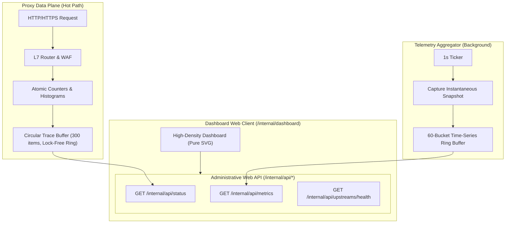

# ADR-135 - High-Density SVG Observability Architecture, Zero-Allocation Time-Series Ring Buffering, and Circular Request Tracing

## 1. Context & Architectural Decisions

### 1.1 UI Architecture: Pure SVG & Zero Runtime Dependencies
- **Decision**: All charts (Sankey traffic flow, latency percentiles, error volume bars, sparklines, histograms, and health tick strips) are rendered client-side using pure SVG without external chart libraries (no Chart.js, D3, or Canvas).
- **Rationale**: Keeps the web assets lightweight (< 100 KB total), eliminating third-party security vulnerabilities, bundler pipelines, and external CDN dependencies while delivering crisp, scalable vector graphics across all DPI displays.

### 1.2 Telemetry Engine: Preallocated In-Memory Ring Buffers
- **Decision**: Telemetry time-series data is recorded into fixed-capacity (60 buckets) circular ring buffers managed by `pkg/metrics/timeseries.go`. Request traces are recorded into a fixed-capacity (300 items) circular buffer in `pkg/server/internal_api.go`.
- **Rationale**: Prevents memory allocations and GC overhead on the proxy hot request path. Memory consumption is capped at ~200 KB total.

### 1.3 Security & DOM XSS Prevention
- **Decision**: All dynamic text (paths, hostnames, container names, rule IDs, IPs, error strings) MUST pass through `escapeHTML()` prior to `innerHTML` injection.
- **Rationale**: Prevents Stored/Reflected DOM XSS vulnerabilities (CWE-79) from malicious requests or headers.

---

## 2. Consequences

- **Positive**:
  - High-density observability control center with zero build step and zero runtime dependencies.
  - Sub-50ns telemetry overhead per request with zero dynamic memory allocation.
  - Complete visibility into traffic topology, latency percentiles, error rates, and Go runtime stats.
- **Trade-offs**:
  - In-memory metrics history resets upon process restart (Prometheus exporter remains standard for durable long-term storage).
