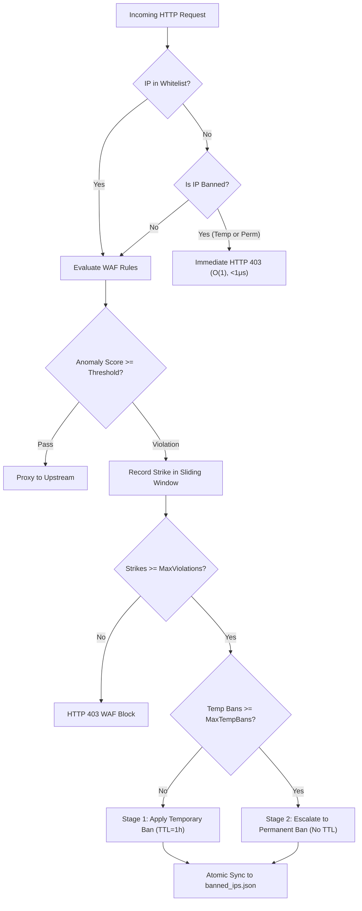

# ADR-136 - Native Dynamic 2-Stage WAF Auto-Ban Engine, Atomic File Persistence, and Multi-Tier OS Firewall Defense

## 1. Context & Architectural Decisions

### 1.1 In-Process 2-Stage Progressive Auto-Ban Engine
- **Decision**: Implement a progressive 2-stage banning mechanism inside Toron's core WAF engine:
  1. **Stage 1 (Temporary Ban)**: When an IP triggers $\ge \text{max\_violations}$ within a sliding time $\text{window}$ (e.g. 3 violations in 60s), place the IP on a temporary ban for `ban_duration` (e.g. 1 hour).
  2. **Stage 2 (Permanent Ban Escalation)**: If an IP accumulates $\ge \text{max\_temporary\_bans}$ temporary bans (e.g. 3 times), escalate the ban to **Permanent Ban** status with no expiration.
- **Rationale**: Attack tools, scanners, and botnets typically perform reconnaissance bursts. Temporary bans stop scanning activity immediately while conserving memory. Persistent abusive sources that return after temporary ban expiration are permanently neutralized, avoiding repeat CPU exhaustion on WAF regex evaluation.

### 1.2 Atomic JSON State Persistence
- **Decision**: Persist ban entries and escalation counters to a local JSON state file (`persistence_file`, default `/etc/toron/banned_ips.json`) using atomic write patterns:
  1. Write JSON payload to a temporary file in the same directory (`banned_ips.json.tmp.<pid>`).
  2. Perform `f.Sync()` to flush OS write buffers.
  3. Atomically replace the target file using `os.Rename`.
- **Rationale**: Guarantees file integrity against power loss or sudden SIGKILL/SIGTERM termination, ensuring that active temporary and permanent bans are reloaded seamlessly when Toron restarts.

### 1.3 Sub-Microsecond Fast-Path Lookup
- **Decision**: Maintain in-memory `sync.RWMutex`-protected map of active bans with pre-parsed IP addresses and pre-compiled subnet ranges.
- **Rationale**: Incoming requests are checked against the ban table before request body buffering, TLS ALPN negotiation completion, or WAF AST/regex processing, delivering $\mathcal{O}(1)$ sub-microsecond rejection with zero dynamic heap allocation.

### 1.4 Multi-Tier Defense: In-Process + OS-Level Kernel Blocking
- **Decision**: Toron provides dual-tier defense:
  - **Tier 1 (Application Layer)**: Native Go auto-ban engine for instant, platform-agnostic, zero-configuration protection.
  - **Tier 2 (Kernel / OS Layer)**: Structured security logs (`/var/log/toron/security.log`) ingested by OS firewall tools:
    - **Linux**: Fail2ban (`iptables`/`nftables`) for kernel-level packet drops.
    - **macOS**: `pfctl` (Packet Filter) automated anchor and table-based dropping.
    - **Windows**: PowerShell automation script interacting with Windows Defender Firewall (`New-NetFirewallRule`).
- **Rationale**: In-process banning provides fine-grained control and API observability, while OS-level packet drops protect kernel network stacks during high-volume volumetric floods.

---

## 2. Consequences

- **Positive**:
  - Immediate CPU relief on attack bursts without requiring manual administrator intervention.
  - State persistence ensures attackers cannot bypass bans by forcing gateway restarts.
  - Full observability and administrative control via dashboard and REST APIs.
  - Multi-platform OS-level firewall integration guides protect production environments across Linux, macOS, and Windows.
- **Trade-offs**:
  - State file disk I/O occurs on ban state transitions (buffered and decoupled from non-violating hot path).
