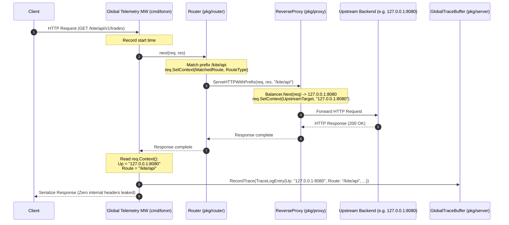

# ADR-140 - Context-Based Telemetry Ingestion and Dynamic Upstream Resolution Architecture

## 1. Context & Problem Statement

In the Toron Edge Gateway Control Center dashboard ([`public/app.js`](../../public/app.js)), the **Live Requests & Logs** section (`#/logs`) displays request execution metadata including client IP, status code, latency, matched route, and target upstream socket.

Currently, all recorded log entries emit `"gateway"` under the **Upstream** column because the global telemetry tracing middleware in [`cmd/toron/main.go`](../../cmd/toron/main.go) statically assigns `Up: "gateway"`. When requests are routed through [`pkg/router/router.go`](../../pkg/router/router.go) and proxied through [`pkg/proxy/proxy.go`](../../pkg/proxy/proxy.go), the selected upstream backend target (`targetNode.URL.Host`, e.g., `127.0.0.1:8080`) is not communicated back across the middleware boundaries. In addition, `Route` is recorded as `req.Path`, preventing hierarchical route filtering in the frontend.

An architectural pattern is required to safely pass the runtime-resolved upstream target, route prefix, and route type from inner handlers back to the outer telemetry middleware without memory overhead, data races, or security exposure to client responses.

---

## 2. Decision & Technical Architecture

### 2.1 Context-Based Telemetry Propagation Pattern

Toron adopts standard library `context.Context` request value propagation. Because [`httpparser.Request`](../../pkg/httpparser/request.go) supports in-place context mutation via `req.SetContext(ctx)`:

1. **Downstream Request Context Injection**:
   - **In Router ([`pkg/router/router.go`](../../pkg/router/router.go))**: When an incoming request matches a route, the router attaches the canonical route prefix (e.g., `/kite/api`), route type (`upstream`, `static`), and static directory destination (if applicable) into `req.Context()`.
   - **In Proxy ([`pkg/proxy/proxy.go`](../../pkg/proxy/proxy.go))**: When `ReverseProxy.ServeHTTPWithPrefix` selects an upstream target (`targetNode`), it attaches the target socket (`targetNode.URL.Host`, e.g., `127.0.0.1:8080`) to `req.Context()`.

2. **Upstream Ingestion in Middleware ([`cmd/toron/main.go`](../../cmd/toron/main.go))**:
   - When `next(req, res)` returns, the telemetry middleware reads the context keys:
     - If `proxy.GetUpstreamTarget(req.Context())` is populated, `Up` is set to that backend socket.
     - Else if `router.GetDestination(req.Context())` is populated (e.g., `static (/var/www)`), `Up` is set to that destination.
     - Else, `Up` defaults to `in-process` (for internal endpoints such as `/health` or redirects).
     - `Route` is set to `router.GetMatchedRoute(req.Context())` (or `req.Path` as fallback).
   - This entry is recorded into `server.GlobalTraceBuffer`.

---

## 3. Alternatives Evaluated

| Architecture Alternative | Pros | Cons | Verdict |
|---|---|---|---|
| **Alternative A: Context-Based Value Propagation** (Chosen) | Zero wire risk; idiomatic Go; thread-safe per-request boundary; zero external dependencies. | Requires retrieving typed context keys. | **ACCEPTED**: Secure, fast, and elegant. |
| **Alternative B: Internal Response Headers (`X-Toron-Upstream`)** | Simple string manipulation in HTTP response headers. | Risk of leaking internal network topology to untrusted external clients (CWE-200) if header deletion is missed or bypassed. | **REJECTED**: Dangerous security anti-pattern. |
| **Alternative C: Global Request Registry Map** | Decoupled from request objects. | Introduces global mutex contention, map synchronization overhead, and memory leak risks if entries are not purged. | **REJECTED**: High contention on event-driven hot path. |

---

## 4. Security Considerations (CWE & Threat Modeling)

1. **Topology Information Disclosure (CWE-200)**:
   - Internal upstream socket addresses (e.g., `127.0.0.1:8080` or internal private VPC IPs) must **never** be emitted in external client HTTP response headers.
   - Context propagation ensures the backend address exists strictly in gateway memory and is exposed only via the authenticated administrative Control Center endpoint (`/internal/api/logs`).
2. **Context Lifespan & Memory Leaks**:
   - `req.Context()` is scoped strictly to the lifecycle of the HTTP transaction and is garbage-collected immediately when connection processing concludes.
3. **Thread Safety**:
   - In Toron's reactor model, a single goroutine handles the request lifecycle serially from parse through response serialization, ensuring race-free context writes.

---

## 5. Verification Strategy

- **Proxy Unit Tests**: Validate `proxy.GetUpstreamTarget` returns the correct socket across single-target and multi-target load balancing configurations.
- **Router Unit Tests**: Validate `router.GetMatchedRoute` returns the prefix and tags static routes appropriately.
- **End-to-End Trace Verification**: Dispatch live requests against proxy and static routes and verify that `GET /internal/api/logs` contains exact target sockets and canonical route names.
- **Race Detector**: Run `go test -race -count=1 ./...` to guarantee thread safety.
