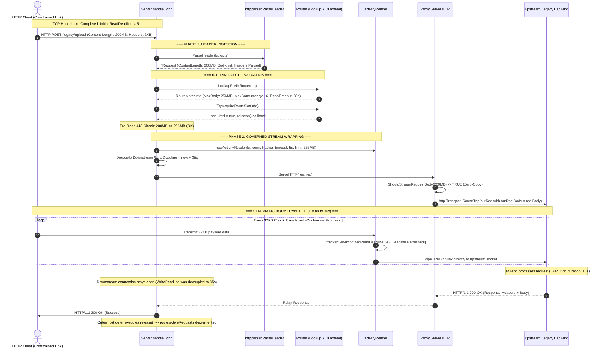
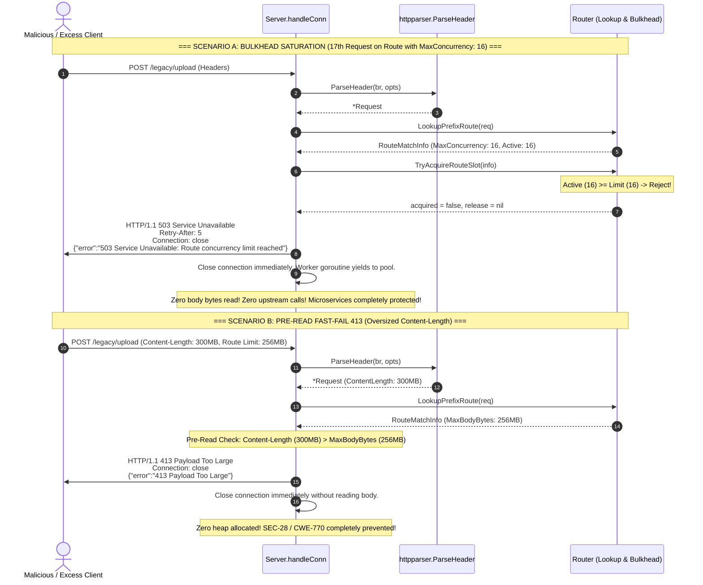

# ADR-145 - Two-Phase Request Ingestion, Activity-Refreshed Deadlines, and Bulkhead Isolation Architecture

## 1. Context & Problem Statement

### 1.1 Operational Context & The Legacy Ingress Dilemma

Toron is an event-driven, cloud-native Layer 4/Layer 7 reverse proxy, web server, and API gateway engineered for high throughput, sub-millisecond dispatch, and minimal memory consumption (see [PRD.md](../../PRD.md)). To protect the gateway against Denial-of-Service attacks, resource exhaustion, and memory depletion, Toron enforces strict global security defaults:
- Maximum request body ceiling: `4 MB` (`max_body_bytes: 4194304`).
- Static socket connection deadlines: `read_timeout: 5s`, `write_timeout: 5s`, `idle_timeout: 30s`.
- Reverse proxy upstream response header timeout: `10s` (`ResponseHeaderTimeout`).
- Fixed reactor worker pool: `128` workers (`worker_pool_size: 128`, queue capacity: `512`).
- Eager in-memory request body allocation: Incoming payloads $> 64\,\text{KB}$ are eagerly buffered into heap memory before routing or authorization occurs.

While these baseline controls defend against [CWE-400](https://cwe.mitre.org/data/definitions/400.html) (Slowloris, Slow Read) and [CWE-770](https://cwe.mitre.org/data/definitions/770.html) (Out-Of-Memory exhaustion, [`SEC-28`](ADR-084.md)), they break compatibility with enterprise legacy workloads detailed in [AN-006](../analysis/AN-006.md) and [REQ-145](../requirements/REQ-145.md):
1. **Large File Uploads**: Payloads exceeding `200 MB` (e.g. database dumps, firmware images, multipart media) are rejected at the HTTP parser layer with `HTTP 413 Payload Too Large` before route matching occurs.
2. **High Latency Backend Execution**: Monolithic transactional backends, SQL reporting engines, and batch ETL endpoints require `15s` to `60s+` to generate response headers, exceeding Toron's static write deadline (`5s`) and upstream transport timeout (`10s`).
3. **Sustained Upload Durations over Constrained Links**: Legitimate `200 MB` uploads over broadband, mobile, or branch WAN links take `15s` to `60s+`. Toron's static `5s` read deadline aborts these transfers mid-stream with `i/o timeout`.
4. **Reactor Worker Pool Saturation**: Multiple concurrent slow requests bind worker goroutines for extended durations, filling the task queue and blocking listener `Accept()`, starving health checks (`/health`) and fast microservice routes.

### 1.2 Architectural Deficiencies of Existing Single-Phase Ingestion

Analysis in [AN-006](../analysis/AN-006.md) revealed five core structural bottlenecks across the codebase:
1. **Eager Pre-Route Parser Buffering** (`pkg/httpparser/parser.go`): `ParseRequest` enforces the global `4 MB` ceiling before routing rules are evaluated. A route configured with `max_body_bytes: 256MB` is never evaluated because the parser fast-fails with `ErrBodyTooLarge` beforehand. Furthermore, line 318 executes `make([]byte, clInt)`, creating instant OOM vulnerability if the global ceiling is relaxed.
2. **Static Absolute Deadlines** (`pkg/server/server.go`): `SetAmortizedReadDeadline(5s)` establishes an absolute future timestamp (`time.Now().Add(5s)`). It does not track byte-level progress. Legitimate continuous data transfers are severed at second 5.
3. **Downstream Write Deadline Locking** (`pkg/server/server.go`): Client socket write deadlines remain locked to `s.config.WriteTimeout` (5s) while the gateway waits for an upstream backend to compute responses.
4. **Duplicate Proxy In-Memory Buffering** (`pkg/proxy/proxy.go`): In line 1164, `io.ReadAll(req.Body)` reads incoming request bodies into heap memory a second time, doubling memory consumption and precluding direct streaming.
5. **Lack of Route Concurrency Isolation** (`pkg/router/router.go`): Unconstrained slow endpoints occupy worker goroutines, leading to reactor head-of-line blocking and catastrophic service disruption.

### 1.3 Prior Requirements & Standards Cross-Audit (Traceability & Invariants)

Relaxing global server parameters (e.g., setting global `max_body_bytes: 500MB` and `read_timeout: 300s`) introduces fatal vulnerabilities (Linux OOM killer via `SIGKILL 9` and total Slowloris worker pool exhaustion). A cross-audit confirms non-negotiable architectural boundaries:

| Prior Requirement / Standard | Core Architectural Invariant | Cross-Audit Reconciliation & Boundary in ADR-145 | Compliance Verdict |
| :--- | :--- | :--- | :--- |
| **[REQ-005](../requirements/REQ-005.md)** (Input Protection & DoS Defense) | Mandates strict body size ceilings (default: 4MB) and connection timeouts to prevent Slowloris. | **Preserved**: Global defaults remain 4MB and 5s. Relaxed limits apply strictly to explicitly configured routes. Stalled connections remain subject to strict timeouts. | **100% Compliant** |
| **[REQ-087](../requirements/REQ-087.md)** / **[ADR-082](ADR-082.md)** (Bounded Concurrency & Resource Quotas) | Bounded concurrency, connection quotas, and idle deadline enforcement. | **Harmonized**: Extends bounded concurrency patterns to Layer 7 route-level bulkheads (`max_concurrency`), preventing slow routes from consuming the gateway worker pool. | **100% Compliant** |
| **[REQ-126](../requirements/REQ-126.md)** / **[ADR-126](ADR-126.md)** (Adaptive Deadlines & Streaming Invariants) | Adaptive socket deadline amortization and activity-refreshed write deadlines for streaming responses. | **Harmonized & Symmetric**: Extends activity-refreshed deadlines to inbound request body reading (`activityReader`), unifying read and write deadline behavior across streaming transfers. | **100% Compliant** |
| **[ADR-084](ADR-084.md)** / **SEC-28** (Monolithic Heap Allocation Defense) | Prohibits unbounded heap slice allocation (`make([]byte, clInt)`) before authorization/routing. | **Preserved**: Pre-route header parsing eliminates eager body allocation. Large streaming payloads stream with $O(1)$ constant memory ($\le 64\,\text{KB}$). | **100% Compliant** |
| **[REQ-133](../requirements/REQ-133.md)** (Chunked Ingestion & Smuggling Defense) | RFC 9112 zero-tolerance chunked decoding and upstream re-framing. | **Harmonized**: Streaming ingress interoperates with chunked ingestion; routes configured for streaming pass through verified canonical streams without heap buffering. | **100% Compliant** |

---

## 2. Architectural Decisions

```
+----------------------------------------------------------------------------------------------------+
|                                    FORMAL ARCHITECTURAL DECISIONS                                  |
+----------------------------------------------------------------------------------------------------+
| Decision 1: Two-Phase Request Ingestion Pipeline (ParseHeader & Interim Route Lookup)               |
| Decision 2: Declarative Route-Scoped Body Ceilings with Pre-Read Fast-Fail HTTP 413                |
| Decision 3: Progress-Based Activity-Refreshed Read Deadlines (activityReader & Anti-Drip Guard)     |
| Decision 4: Downstream Client Write Timeout Decoupling during Upstream Execution                    |
| Decision 5: Route Bulkhead Concurrency Limiter with HTTP 503 and min(32, Pool/4) Guardrail         |
| Decision 6: Zero-Copy Streaming Reverse Proxy Ingress (O(1) Direct Upstream Piping)                 |
+----------------------------------------------------------------------------------------------------+
```

---

### Decision 1: Two-Phase Request Ingestion Pipeline

We decouple HTTP request parsing in `pkg/httpparser` and request handling in `pkg/server` into two distinct, sequential phases separated by interim route lookup:

```
+──────────────────────────────────────────────────────────────────────────────────────────────────+
|                                TWO-PHASE INGESTION LIFECYCLE                                     |
+──────────────────────────────────────────────────────────────────────────────────────────────────+
|  Client Socket                                                                                   |
|        │                                                                                         |
|        ▼                                                                                         |
|  [PHASE 1: Header Ingestion] ──► httpparser.ParseHeader(br, maxHeaderBytes: 8KB)                 |
|                                  • Parses request line & headers using pooled line buffers       |
|                                  • Validates RFC 7230/9112 grammar, rejects smuggling            |
|                                  • Resolves Content-Length (clInt, -1 for chunked, 0 for empty)  |
|                                  • ZERO body bytes read, ZERO heap allocation for body           |
|        │                                                                                         |
|        ▼                                                                                         |
|  [INTERIM: Route Resolution] ──► router.LookupPrefixRoute(req)                                   |
|                                  • Resolves target route metadata & effective policies           |
|                                  • Evaluates Bulkhead Concurrency Gate                           |
|                                  • Evaluates Pre-Read Fast-Fail Content-Length                   |
|        │                                                                                         |
|        ▼                                                                                         |
|  [PHASE 2: Governed Body Ingestion]                                                              |
|        ├── If Small (<= 64 KB): Ingest using pooled 64KB buffers                                 |
|        └── If Large / Stream (> 64 KB or Chunked): Wrap socket in activityReader                |
|            Direct socket-to-upstream zero-copy streaming pipeline                                |
+──────────────────────────────────────────────────────────────────────────────────────────────────+
```

#### Contract Specification: `httpparser.ParseHeader`
```go
// ParseHeader parses only the HTTP request line and headers from r into a Request metadata structure.
// It enforces RFC 7230 / RFC 9112 syntax, header character grammar, and smuggling defenses.
// It returns the populated Request, the active *bufio.Reader (retaining unconsumed body bytes),
// and any protocol error encountered. req.Body is left uninitialized.
func ParseHeader(r io.Reader, opts ParserOptions) (*Request, *bufio.Reader, error)
```

1. **Memory Invariant**: `ParseHeader` consumes data strictly up to the blank line boundary (`\r\n\r\n` or `\n\n`) bounded by `opts.MaxHeaderBytes` (default: 8KB). If headers exceed this ceiling, it returns `ErrHeaderTooLarge` (mapped to `HTTP 431 Request Header Fields Too Large`).
2. **Smuggling Invariant**: Conflicting `Transfer-Encoding` and `Content-Length` headers, multiple conflicting `Content-Length` values, or malformed encodings immediately return `ErrBadRequest` (mapped to `HTTP 400 Bad Request`).
3. **Backward Compatibility**: `ParseRequest(r, opts)` is refactored into a thin facade calling `ParseHeader(r, opts)` followed by in-memory body buffering against global `opts.MaxBodyBytes`, preserving identical behavior for existing test suites and non-streaming callers.

---

### Decision 2: Declarative Route-Scoped Body Ceilings with Pre-Read Fast-Fail `HTTP 413` Rejection

We introduce declarative route-level body ceilings within `ProxyRouteConfig` ([`pkg/config/config.go`](../../pkg/config/config.go)) and enforce hierarchical precedence during interim route resolution before body bytes are read from the socket:

#### Hierarchical Resolution Contract
```go
// GetMaxBodyBytes returns the effective request body ceiling for the route,
// falling back to defaultVal (global server.max_body_bytes, 4MB) if unspecified (0).
func (p *ProxyRouteConfig) GetMaxBodyBytes(defaultVal int64) int64 {
    if p.MaxBodyBytes > 0 {
        return p.MaxBodyBytes
    }
    return defaultVal
}
```

#### Pre-Read Fast-Fail Enforcement
1. **Tier-1 Declared `Content-Length` Validation**:
   - Immediately following interim route lookup, the server inspects `req.ContentLength`.
   - If `req.ContentLength > effectiveMaxBody`:
     - Reject immediately with `HTTP 413 Payload Too Large`.
     - Header: `Connection: close`, `Content-Type: application/json`.
     - Body: `{"error":"413 Payload Too Large: request Content-Length exceeds effective route limit"}`.
     - Serialize response directly to socket and sever connection.
     - **Invariable Guarantee**: Zero body bytes are read from the network socket, and zero bytes of heap memory are allocated for the payload.
2. **Tier-2 Cumulative Stream Clamping**:
   - For chunked transfers (`req.ContentLength == -1`) or unannounced streams where `Content-Length` is omitted, the stream reader tracks cumulative uncompressed bytes read.
   - If total bytes read exceed `effectiveMaxBody`:
     - Ingestion immediately halts.
     - Abort transfer, return `HTTP 413 Payload Too Large`, and reset TCP connection to prevent client flooding.

---

### Decision 3: Progress-Based Activity-Refreshed Read Deadlines

To reconcile sustained high-volume data transfers (e.g. 200MB uploads taking 30s–60s) with strict Slowloris immunity ([CWE-400](https://cwe.mitre.org/data/definitions/400.html), [`REQ-005`](../requirements/REQ-005.md)), socket read deadlines are transformed from absolute static timestamps into progress-based activity-refreshed windows.

```
+──────────────────────────────────────────────────────────────────────────────────────────────────+
|                               ACTIVITY-REFRESHED READ DEADLINE                                   |
+──────────────────────────────────────────────────────────────────────────────────────────────────+
|                                                                                                  |
|   Read Chunk 1 (32KB)      Read Chunk 2 (32KB)      Read Chunk 3 (32KB)                          |
|         │                        │                        │                                      |
|         ▼                        ▼                        ▼                                      |
|   [Deadline: T0+5s] ─────► [Deadline: T1+5s] ─────► [Deadline: T2+5s] ──► Transfer Completes (60s) |
|                                                                                                  |
|   Stall Event (Client pauses > 5s):                                                              |
|   Read Chunk N (32KB) ──► [Deadline: Tn+5s] ───(Stall > 5s)───► Socket Timer Fires               |
|                                                                  └──► i/o timeout                 |
|                                                                  └──► Worker freed                |
|                                                                  └──► Socket closed               |
+──────────────────────────────────────────────────────────────────────────────────────────────────+
```

#### Component Specification: `activityReader` ([`pkg/server/server.go`](../../pkg/server/server.go))
```go
type activityReader struct {
    r            *bufio.Reader
    conn         net.Conn
    tracker      *connDeadlineTracker
    timeout      time.Duration
    remaining    int64
    totalRead    int64
    minRateBytes int64
    windowStart  time.Time
    windowBytes  int64
    mu           sync.Mutex
}
```

#### Operational Mechanics:
1. **Inter-Read Renewal**:
   - The socket read deadline is initialized to `effectiveReadTimeout` prior to reading body bytes.
   - Before each blocking read or immediately upon receiving data bytes ($n > 0$), `tracker.SetAmortizedReadDeadline(a.timeout)` refreshes the socket deadline forward by `a.timeout` (default: 5s, or route `read_timeout`).
   - Steady, active data transfers can proceed indefinitely (e.g., 200MB over 60 seconds) without hitting a static timeout wall.
2. **Strict Slowloris Invariant (REQ-005 / CWE-400)**:
   - If the client halts transmission or pauses mid-transfer for longer than `a.timeout`, no renewal occurs.
   - The OS kernel socket timer expires, returning `i/o timeout` (`net.Error.Timeout() == true`).
   - The worker goroutine catches the error, immediately closes the connection, and reclaims all resources within `a.timeout` of inactivity.
3. **Anti-Drip Progress Rate Clamping**:
   - To prevent low-rate drip-feeding Slowloris attacks (e.g. sending 1 byte every 4.9 seconds), `activityReader` tracks byte progress across renewal windows.
   - If cumulative progress across a deadline window falls below `minRateBytes` (default: minimum 1 KB per window), the connection is terminated immediately.

---

### Decision 4: Downstream Client Write Timeout Decoupling during Upstream Execution

When Toron acts as a reverse proxy to a legacy backend requiring extended execution time (e.g., 15s to 60s for report generation or complex SQL queries), the downstream client connection must not be prematurely terminated by static downstream write deadlines (`write_timeout: 5s`).

#### Architectural Mechanics:
1. **Downstream Timeout Extension**:
   - Upon identifying an upstream proxy route, `pkg/server` decouples the downstream client socket write deadline.
   - The client write deadline is extended forward to span the route's configured `response_header_timeout`:
     $$\text{downstreamWriteDeadline} = \text{route.GetResponseHeaderTimeout(10s)} + \text{s.config.WriteTimeout}$$
   - This ensures the client TCP connection remains open and healthy while the backend executes.
2. **Upstream Response Header Timeout Enforcement**:
   - Upstream HTTP transport context is bounded by `route.GetResponseHeaderTimeout(10s)` (`context.WithTimeout`).
   - If the upstream backend does not emit response headers within this duration:
     - The upstream context is canceled, aborting the backend connection.
     - The gateway responds to the downstream client with `HTTP 504 Gateway Timeout` and JSON body `{"error":"504 Gateway Timeout: Upstream response header timeout expired"}`.
   - If the upstream backend prematurely terminates or resets TCP during execution, the gateway responds with `HTTP 502 Bad Gateway`.
3. **Streaming Response Synchronization**:
   - Once upstream response headers arrive and `s.relayStreamBody` begins relaying chunks to the client, the write deadline reverts to activity-refreshed write deadlines per chunk ([ADR-126](ADR-126.md)), guaranteeing sustained streaming downloads complete without static timeout interruption.

---

### Decision 5: Route Bulkhead Concurrency Limiter with `HTTP 503` / `Retry-After: 5`

To guarantee that slow legacy transfers never exhaust Toron's fixed reactor worker pool (`worker_pool_size: 128`), we introduce Layer 7 route-level bulkhead concurrency gates in `pkg/router`.

```
+──────────────────────────────────────────────────────────────────────────────────────────────────+
|                                ROUTE BULKHEAD CONCURRENCY GATING                                 |
+──────────────────────────────────────────────────────────────────────────────────────────────────+
|                                                                                                  |
|   Arriving Request ──► Route Match: /legacy/upload (max_concurrency: 16)                         |
|                              │                                                                   |
|                              ▼                                                                   |
|                 activeRequests < max_concurrency ?                                               |
|                        ├── YES ──► atomic.AddInt64(&route.activeRequests, 1)                     |
|                        │           Acquire slot; proceed to Phase 2                              |
|                        │           defer release() [sync.Once deterministic decrement]           |
|                        │                                                                         |
|                        └── NO  ──► FAST-FAIL REJECTION                                           |
|                                    • HTTP 503 Service Unavailable                                |
|                                    • Retry-After: 5                                              |
|                                    • Connection: close                                           |
|                                    • Zero body read, Zero upstream dial                          |
|                                    • Worker goroutine released immediately                       |
|                                                                                                  |
|   REACTOR POOL GUARANTEE:                                                                        |
|   16 Slow Workers Bound  +  112 Workers Permanently Reserved for Microservices & /health         |
+──────────────────────────────────────────────────────────────────────────────────────────────────+
```

#### Contract Specification: `pkg/router`
```go
type RouteMatchInfo struct {
    Prefix                string
    RouteType             string
    MaxBodyBytes          int64
    MaxConcurrency        int
    ReadTimeout           time.Duration
    WriteTimeout          time.Duration
    ResponseHeaderTimeout time.Duration
    StreamRequestBody     *bool
    routeRef              *prefixRoute
}

func (r *Router) LookupPrefixRoute(req *httpparser.Request) (*RouteMatchInfo, bool)
func (r *Router) TryAcquireRouteSlot(info *RouteMatchInfo) (release func(), acquired bool)
```

#### Safety Guardrail Default Resolution
When an operator configures an elevated body ceiling (`max_body_bytes > 4MB`) or an elevated backend timeout (`response_header_timeout > 10s`) but omits `max_concurrency`, the gateway automatically derives a protective safety guardrail:
$$\text{effectiveMaxConcurrency} = \min\left(32, \max\left(1, \frac{\text{WorkerPoolSize}}{4}\right)\right)$$
On a standard 128-worker gateway, this caps unconfigured legacy routes to 32 concurrent requests, guaranteeing that at least $75\%$ of the reactor worker pool (96 workers) remains permanently reserved for fast microservices and operational probes (`/health`, `/metrics`).

#### Fast-Fail Rejection Protocol
When `TryAcquireRouteSlot` returns `acquired = false`:
1. Status: `HTTP 503 Service Unavailable`.
2. Header: `Retry-After: 5`.
3. Header: `Content-Type: application/json`.
4. Header: `Connection: close`.
5. Body: `{"error":"503 Service Unavailable: Route concurrency limit reached"}`.
6. The rejection response is serialized immediately during Phase 1 routing; zero payload body bytes are read from the socket, and zero upstream requests are dispatched.

---

### Decision 6: Zero-Copy Streaming Reverse Proxy Ingress

To satisfy NFR-145-1 ($O(1)$ constant memory $\le 64\,\text{KB}$ per active connection), we eliminate duplicate in-memory body buffering in `pkg/proxy/proxy.go`.

#### Architectural Mechanics:
1. **Automatic Streaming Activation**:
   Streaming proxy ingress is automatically activated when:
   - `route.StreamRequestBody` is explicitly `true`, OR
   - `route.StreamRequestBody` is `nil` (default auto mode) AND (`req.ContentLength > 65536` (64 KB) OR `req.ContentLength == -1` (chunked streaming)).
2. **Direct Socket-to-Upstream Pipe**:
   - `p.ServeHTTP` bypasses `io.ReadAll(req.Body)`.
   - The proxy assigns `outReq.Body = req.Body` directly.
   - For fixed-length uploads, `outReq.ContentLength = req.ContentLength`.
   - For chunked uploads, `outReq.ContentLength = -1` and `outReq.TransferEncoding = []string{"chunked"}`.
   - Go's `http.Transport` reads chunks directly from `activityReader`, transmitting bytes across the network in $32\,\text{KB}$ buffer chunks with zero intermediate heap allocations.
3. **Bidirectional Context & Abort Propagation**:
   - **Downstream Client Disconnect**: If the client aborts or closes the TCP socket during upload, client context cancellation immediately triggers `cancel()` on the upstream context (`reqCtx`), causing `http.Transport` to terminate the backend socket and prevent zombie backend processing.
   - **Upstream Backend Failure (Fail-Closed)**: If the upstream backend aborts mid-stream, resets TCP, or returns an I/O error, the gateway forcibly resets the downstream client socket without sending a clean termination chunk, ensuring the client is alerted of payload truncation.

---

## 3. Component Boundaries, Interfaces, and Data Flow

### 3.1 Subsystem Interaction & Boundary Map

```
┌──────────────────────────────────────────────────────────────────────────────────────────────────┐
│                               TORON ROUTE-AWARE RESILIENT INGRESS                                │
├──────────────────────────────────────────────────────────────────────────────────────────────────┤
│                                                                                                  │
│   1. NETWORKING & REACTOR (pkg/reactor, pkg/server)                                              │
│      net.Conn ──► Accepted by Reactor Worker                                                     │
│                   Tracker: newConnDeadlineTracker(conn)                                          │
│                   ReadDeadline = server.ReadTimeout (or IdleTimeout on keep-alive)               │
│                                                                                                  │
│   2. PHASE 1: PROTOCOL HEADER INGESTION (pkg/httpparser)                                         │
│      httpparser.ParseHeader(br, maxHeaderBytes: 8KB)                                             │
│      • Parse Method, URI, Protocol, Headers into *Request                                        │
│      • Content-Length parsed; req.Body remains nil (ZERO body heap allocation)                   │
│                                                                                                  │
│   3. INTERIM: ROUTE MATCHING & BULKHEAD GATING (pkg/router)                                     │
│      router.LookupPrefixRoute(req) ──► RouteMatchInfo                                            │
│      • Bulkhead Gate: router.TryAcquireRouteSlot(info)                                           │
│        └── If at capacity ──► Fast-Fail HTTP 503 + Retry-After: 5 (Worker yields)                │
│      • Pre-Read Ceiling Check: req.ContentLength > info.MaxBodyBytes                             │
│        └── If oversized  ──► Fast-Fail HTTP 413 (Zero body read, Worker yields)                  │
│                                                                                                  │
│   4. PHASE 2: GOVERNED BODY INGESTION & STREAM WRAPPING (pkg/server)                             │
│      • req.Body = newActivityReader(br, conn, tracker, route.ReadTimeout, effectiveMaxBody)      │
│      • Decouple downstream write deadline:                                                       │
│        WriteDeadline = route.ResponseHeaderTimeout + server.WriteTimeout                         │
│                                                                                                  │
│   5. ZERO-COPY UPSTREAM PROXYING (pkg/proxy)                                                     │
│      • Direct Pipe: outReq.Body = req.Body (LimitReader directly to upstream transport)          │
│      • Transport Context: WithTimeout(route.ResponseHeaderTimeout)                               │
│      • Upstream Response Relay: relayStreamBody with activity-refreshed write deadlines         │
│                                                                                                  │
└──────────────────────────────────────────────────────────────────────────────────────────────────┘
```

---

### 3.2 Sequence Diagram: End-to-End Two-Phase Ingestion & Streaming Proxy Pass

The following diagram illustrates a successful 200MB file upload over a constrained link taking 30 seconds to complete on a route configured with `max_body_bytes: 256MB`, `read_timeout: 5s`, and `response_header_timeout: 30s`:



---

### 3.3 Sequence Diagram: Bulkhead Saturation & Pre-Read Fast-Fail Rejections

The following sequence diagram details the immediate fast-fail behaviors when route bulkhead capacity is reached or when a client attempts an oversized upload:



---

## 4. Trade-Off Analysis & Mitigations

| Trade-Off / Constraint | Operational Impact | Mitigation & Architectural Resolution |
| :--- | :--- | :--- |
| **Unseekable Request Streams & Upstream Retries** | When streaming request bodies zero-copy directly to upstream connections, the stream cannot be seeked, rewound, or replayed if the upstream backend fails mid-transfer. | Fail-fast semantics: Return `HTTP 502 Bad Gateway` immediately. For idempotent operations, client-side retry handles recovery. Transparent reverse-proxy replay of partially consumed large payloads ($> 64\,\text{KB}$) is dangerous and violates memory bounds. |
| **WAF Deep Packet Body Inspection Boundary** | Zero-copy streaming ingestion bounds deep packet inspection to the initial prologue (`max_inspect_body_size: 64KB`). | Aligns with industry standards (Envoy, Cloudflare, AWS WAF). Edge reverse proxies cannot synchronously regex-scan 200MB binaries without OOM risks. File security is tiered: Toron inspects headers and multipart prologues, delegating deep virus scanning to asynchronous upstream backend pipelines. |
| **Worker Holding Duration during Extended Transfers** | A reactor worker goroutine remains bound to a slow streaming transfer for 30s–60s+. | Enforce route bulkhead concurrency limits (`max_concurrency`), defaulting to $\min(32, \text{WorkerPoolSize}/4)$. This bounds slow workers to $\le 25\%$ of the pool, guaranteeing $\ge 75\%$ capacity remains available for microservices and `/health`. |
| **Low-Rate "Drip Feeding" Denial-of-Service** | Attackers transmitting 1 byte every 4.9 seconds could keep an activity-refreshed connection alive indefinitely while staying within a 5-second read timeout. | Enforce minimum progress rate clamping within `activityReader`. If cumulative progress across a renewal window falls below 1 KB, the connection is terminated immediately. |
| **Client Abort & Orphaned Backend Execution** | Client disconnects midway through a 200MB upload while upstream backend continues processing. | Context propagation (`req.Context()`): Downstream socket termination immediately cancels the upstream HTTP request context, closing the upstream connection and stopping backend execution. |

---

## 5. Non-Functional Guarantees & Verification Matrix

### 5.1 NFR-145-1: Constant $O(1)$ Memory Footprint
- Request bodies of arbitrary magnitude (1MB to 2GB+) are streamed through fixed $32\,\text{KB}$ copy buffers.
- Eager heap allocations (`make([]byte, clInt)`) are strictly eliminated from `pkg/httpparser` and `pkg/proxy`.
- Total heap allocation growth per streaming upload is bounded at $< 10\,\text{MB}$.

### 5.2 NFR-145-2: Zero Worker Starvation
- Saturated legacy routes reject excess traffic at the bulkhead gate with `HTTP 503` in $< 1\,\text{ms}$.
- Reactor workers are never blocked on excess slow requests.
- Operational endpoints (`/health`, `/metrics`) and microservice routes maintain baseline latency ($< 5\,\text{ms}$) under 100% legacy route saturation.

### 5.3 NFR-145-3: Backward Compatibility
- Existing route configurations without legacy attributes retain the global `4 MB` body ceiling and `5s` static timeouts.
- Standalone `ParseRequest` callers continue to function without behavioral alteration.

### 5.4 NFR-145-4: Strict Slowloris Immunity
- Connections that cease transmitting data or pause for longer than the effective read timeout are forcefully terminated within that timeout window, freeing worker goroutines and socket descriptors.

---

## 6. Traceability Matrix

| Requirement / Task | Architectural Decision Element | Primary Code Owning Module | Verification Target |
| :--- | :--- | :--- | :--- |
| **[REQ-145 §2.1](../requirements/REQ-145.md)** (FR-145-1) | Two-Phase Ingestion & Interim Route Matching | [`pkg/httpparser/parser.go`](../../pkg/httpparser/parser.go), [`pkg/server/server.go`](../../pkg/server/server.go) | AC-145-01, AC-170-1 |
| **[REQ-145 §2.2](../requirements/REQ-145.md)** (FR-145-2) | Route-Scoped Body Ceilings & Pre-Read 413 | [`pkg/config/config.go`](../../pkg/config/config.go), [`pkg/server/server.go`](../../pkg/server/server.go) | AC-145-02, AC-169-2, AC-171-3 |
| **[REQ-145 §2.3](../requirements/REQ-145.md)** (FR-145-3) | Activity-Refreshed Read Deadlines & Anti-Drip | [`pkg/server/server.go`](../../pkg/server/server.go) (`activityReader`) | AC-145-03, AC-145-04, AC-171-1, AC-171-2 |
| **[REQ-145 §2.4](../requirements/REQ-145.md)** (FR-145-4) | Decoupled Response Header Timeouts | [`pkg/server/server.go`](../../pkg/server/server.go), [`pkg/proxy/proxy.go`](../../pkg/proxy/proxy.go) | AC-145-05, AC-171-5, AC-172-3 |
| **[REQ-145 §2.5](../requirements/REQ-145.md)** (FR-145-5) | Route Bulkhead Concurrency Limiter & 503 | [`pkg/router/router.go`](../../pkg/router/router.go) | AC-145-06, AC-173-2, AC-173-3 |
| **[REQ-145 §2.6](../requirements/REQ-145.md)** (FR-145-6) | Zero-Copy Streaming Proxy Ingress | [`pkg/proxy/proxy.go`](../../pkg/proxy/proxy.go) | AC-145-01, AC-172-1, AC-172-2 |
| **[TASK-169](../tasks/TASK-169.md)** | Config Schema Extensions & Accessor Helpers | [`pkg/config/config.go`](../../pkg/config/config.go), [`pkg/config/loader.go`](../../pkg/config/loader.go) | AC-169-1 .. AC-169-7 |
| **[TASK-170](../tasks/TASK-170.md)** | Two-Phase Parser Refactoring (`ParseHeader`) | [`pkg/httpparser/parser.go`](../../pkg/httpparser/parser.go) | AC-170-1 .. AC-170-6 |
| **[TASK-171](../tasks/TASK-171.md)** | `activityReader` Tracker & Timeout Decoupling | [`pkg/server/server.go`](../../pkg/server/server.go) | AC-171-1 .. AC-171-6 |
| **[TASK-172](../tasks/TASK-172.md)** | Zero-Copy Streaming Proxy Implementation | [`pkg/proxy/proxy.go`](../../pkg/proxy/proxy.go) | AC-172-1 .. AC-172-6 |
| **[TASK-173](../tasks/TASK-173.md)** | Bulkhead Concurrency Gate & Fast-Fail 503 | [`pkg/router/router.go`](../../pkg/router/router.go) | AC-173-1 .. AC-173-6 |
