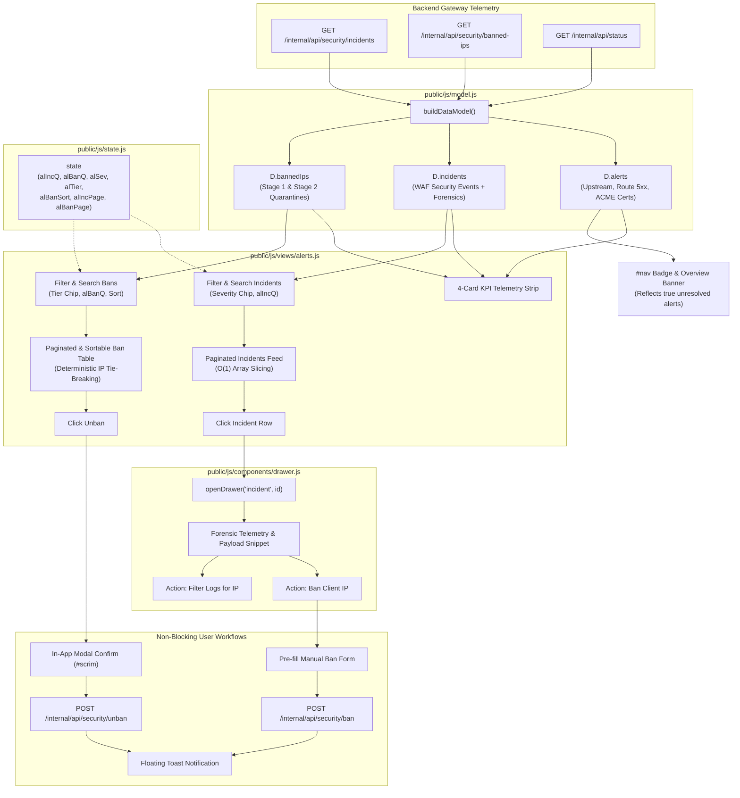

# ADR-146 - Alerts and Threat Defense Control Center Redesign

## Context

The Toron Control Center dashboard at `#/alerts` serves as the primary operations cockpit for real-time edge security monitoring and threat mitigation. Under active production workloads, Toron's Web Application Firewall (WAF) inspects incoming requests using OWASP ModSecurity Core Rules and custom regex patterns, while an automated two-stage threat defense reactor quarantines abusive actors (Stage 1: temporary 1-hour quarantine, Stage 2: permanent IP firewall ban).

As traffic volume and security events increased, operations reported severe UI friction:
> *"The alerts list and blocked ips list are getting very long. We need to redesign this page."*

Architectural and functional analysis in [`AN-007`](../analysis/AN-007.md) and requirements analysis in [`REQ-146`](../requirements/REQ-146.md) identified six structural defects in the legacy implementation:
1. **Data Model Duplication & Cardinality Distortion**: In [`public/js/model.js`](../../public/js/model.js), banned IP records from `rawApiBannedIps` were injected into both `D.alerts` and `D.bannedIps`. Every banned IP rendered twice on screen and falsely inflated the global navigation alert badge and Overview health status banner.
2. **Missing Pagination & Data Filtering**: Unpaginated rendering of incident feeds and ban tables led to unbounded DOM growth, excessive vertical scrolling, and an inability to search by IP or filter by severity/tier.
3. **Responsive Header Layout Collisions**: The manual ban input form was crammed into the card header flex row (`.card-h`), wrapping and breaking alignment on screens narrower than 1200px.
4. **Thread-Blocking Synchronous Dialogs**: Unban operations triggered browser-native `window.confirm()` and `window.alert()`, freezing the browser execution loop, stopping background telemetry polling, and breaking automated headless testing.
5. **Inaccessible Forensic Telemetry**: Backend WAF security audit events contained rich forensic metadata (`rule_id`, `anomaly_score`, `category`, `location`, `payload_snippet` via `pkg/waf/audit.go`), but the drawer controller ([`public/js/components/drawer.js`](../../public/js/components/drawer.js)) only supported route metrics and HTTP request logs.
6. **Absence of High-Level Operational Metrics**: Operators lacked an executive Key Performance Indicator (KPI) metrics strip summarizing active threats, WAF block counts, and ban tier distributions.

This architectural decision record establishes the technical architecture, data model normalization, state schema, view decomposition, forensic drawer integration, and non-blocking interaction model to solve these challenges adhering to Toron's zero-dependency native ES module design principles.

---

## Decision

We adopt **Full Frontend View Redesign & Data Model Normalization** (Option 1). The implementation decomposes across five cohesive layers without breaking backend REST APIs or introducing external runtime dependencies.

```
┌────────────────────────────────────────────────────────────────────────┐
│             Toron Control Center: Alerts & Threat Defense              │
├────────────────────────────────────────────────────────────────────────┤
│ 1. 4-CARD EXECUTIVE SECURITY KPI METRICS STRIP                         │
│  ┌───────────────┐ ┌───────────────┐ ┌───────────────┐ ┌──────────────┐│
│  │Active Alerts  │ │WAF Blocks     │ │Stage 1 Temp   │ │Stage 2 Perm  ││
│  │& Incidents    │ │(Intercepted)  │ │(1h Quarantine)│ │(Firewalled)  ││
│  └───────────────┘ └───────────────┘ └───────────────┘ └──────────────┘│
├────────────────────────────────────────────────────────────────────────┤
│ 2. UNIFIED SECURITY INCIDENTS FEED                                     │
│  [ Search Incidents: IP, Rule, Path, Payload... ] [ Sev: All|Crit|Warn]│
│  Paginated Feed (10/25/50 per page) · Click Row -> Open Forensic Drawer│
│  Showing 1–10 of 42 · [« First] [‹ Prev] [Page 1/5] [Next ›] [Last »]  │
├────────────────────────────────────────────────────────────────────────┤
│ 3. DECOUPLED ERGONOMIC MANUAL BAN TOOLBAR                              │
│  [ Client IP (IPv4/IPv6 validated) ] [ Preset: 1h▼ ] [ Reason... ] [Ban]│
├────────────────────────────────────────────────────────────────────────┤
│ 4. PAGINATED & SORTABLE THREAT DEFENSE BAN TABLE                       │
│  [ Search Bans: IP, Reason... ] [ Tier: All|Stage 1|Stage 2 ]          │
│  Header (Click Sort): IP ▲ | Tier | Created At | Strikes | Reason | TTL│
│  Rows: Paginated (25/50/100) · Non-blocking In-App Unban Modal Confirm │
│  Showing 1–25 of 86 · [« First] [‹ Prev] [Page 1/4] [Next ›] [Last »]  │
└────────────────────────────────────────────────────────────────────────┘
```

---

### 1. Data Model Normalization and Deduplication ([`public/js/model.js`](../../public/js/model.js))

The client data model builder `buildDataModel()` shall strictly isolate operational system alerts, WAF security incidents, and active firewall bans into distinct properties on the computed data model `D`:

```javascript
// model.js data model mapping
const computed = {
  // ... other core telemetry collections ...
  alerts,     // Strictly operational degradations & cert failures
  incidents,  // Dedicated array of WAF security events from rawApiIncidents
  bannedIps   // Dedicated array of active IP bans from rawApiBannedIps
};
```

#### 1.1 Structural Deduplication Rules
1. **Elimination of Banned IP Alert Injection**:
   - The loop iterating `rawApiBannedIps` to push `ban_${i}` into `alerts` is eliminated.
   - Banned IPs exist exclusively in `D.bannedIps`. Mitigated/quarantined actors are defensive statuses, not unmitigated operational emergencies.
2. **Operational Alerts Isolation (`D.alerts`)**:
   - `D.alerts` strictly contains actionable system degradations:
     - Upstream instance health check failures (`upstream_${p.id}`).
     - Route 5xx error rate spikes exceeding the 2% threshold (`route_${r.id}`).
     - Failing ACME SSL certificate renewals (`cert_${c.id}`).
     - Active unmitigated operational anomalies.
   - Preserves newest-first chronological sorting with secondary IP/ID tie-breaking per [`ADR-138`](../architecture/ADR-138.md).
3. **Dedicated Incidents Feed (`D.incidents`)**:
   - `D.incidents = rawApiIncidents || []`.
   - Each record preserves raw forensic fields defined by `pkg/waf/audit.go`:
     - `timestamp`: RFC3339 string.
     - `event`: Event identifier string.
     - `client_ip`: Offending client IP address.
     - `method`: HTTP request method (`GET`, `POST`, etc.).
     - `path`: Request path and query string.
     - `category`: Attack categorization (e.g., `SQL Injection`, `XSS`, `Path Traversal`).
     - `rule_id`: OWASP rule ID (e.g., `942100`) or custom rule identifier.
     - `anomaly_score`: Computed anomaly score integer.
     - `action`: `'blocked'` or `'logged'`.
     - `location`: Parameter location (e.g., `query`, `header`, `body`, `cookie`).
     - `payload_snippet`: Matched malicious payload substring.
4. **Navigation Badge & Overview Status Banner Parity**:
   - The navigation badge in [`public/js/app.js`](../../public/js/app.js) (`#nav button[data-nav="alerts"] .badge`) and the overview banner in [`public/js/views/overview.js`](../../public/js/views/overview.js) evaluate `(D.alerts || []).length`.
   - Banned IPs no longer falsely inflate badge counts. When all upstreams, routes, and certs are healthy and no active incidents exist, the badge disappears and the overview reports healthy status.

---

### 2. Centralized State Architecture ([`public/js/state.js`](../../public/js/state.js))

All view pagination, filtering, searching, and sorting parameters are centralized in `state` to ensure deterministic rendering and view continuity across telemetry polling cycles:

```javascript
export const state = {
  // Existing telemetry state...
  
  // Alerts & Threat Defense View State (REQ-146 / TASK-174)
  alIncQ: '',              // Search query string for incidents feed
  alBanQ: '',              // Search query string for banned IPs table
  alSev: 'all',            // Incident severity filter: 'all' | 'critical' | 'warning'
  alTier: 'all',           // Ban tier filter: 'all' | 'temporary' | 'permanent'
  alBanSort: 'created_at', // Active sort column for Banned IPs table
  alBanSortDir: 'desc',    // Active sort direction: 'desc' | 'asc'
  alIncPage: 1,            // Incidents active page index (1-based)
  alIncPageSize: 10,       // Incidents page size: 10 | 25 | 50 (default: 10)
  alBanPage: 1,            // Banned IPs active page index (1-based)
  alBanPageSize: 25,       // Banned IPs page size: 10 | 25 | 50 (default: 25)
  alConfirmBan: null       // IP address currently targeted for in-app unban confirmation
};
```

#### 2.1 State Mutation & Reactivity Lifecycle
- **Search Typing**: When the operator types into `#alIncSearch` or `#alBanSearch`, the input event updates `state.alIncQ` or `state.alBanQ` and immediately resets `state.alIncPage = 1` or `state.alBanPage = 1` prior to triggering `alUpdate(D)`.
- **Filter Chip Toggle**: Clicking a severity or tier chip updates `state.alSev` or `state.alTier`, resets the corresponding page index to 1, and updates `aria-pressed` states.
- **Pagination Navigation**: Changing pages updates `state.alIncPage` or `state.alBanPage` and triggers DOM re-slicing without triggering backend round-trips.
- **Background Telemetry Polling**: When `fetchBackendData()` receives fresh data every 2 seconds, `alUpdate(D)` renders using the active state parameters, preserving user scroll, filter, and pagination positions without visual jitter.

---

### 3. Component & View Decomposition ([`public/js/views/alerts.js`](../../public/js/views/alerts.js))

The Alerts view is structured around the SPA view protocol: `alShell()` generates the static HTML layout, `alInit()` binds event listeners once per mount, and `alUpdate(D)` performs high-performance DOM mutations.

#### 3.1 4-Card Executive Security KPI Metrics Strip
At the top of `alShell()`, a 4-card metric strip provides instant situational awareness:
1. **Active Incidents / Alerts**: Count of unresolved operational alerts and active incidents (`D.alerts.length + D.incidents.length`). Visual tone: `var(--err)` if $> 0$, else `var(--ok)`.
2. **Recent WAF Blocks**: Total threats intercepted and dropped (`action === 'blocked'`) from the telemetry window. Visual tone: `var(--c5)`.
3. **Stage 1 Temp Bans**: Total IP addresses in temporary 1-hour quarantine (`type === 'temporary'`). Visual tone: `var(--warn)`.
4. **Stage 2 Permanent Bans**: Total repeat offenders permanently firewalled (`type === 'permanent'`). Visual tone: `var(--err)`.

#### 3.2 Unified Multi-Attribute Search & Faceted Filtering
- **Incidents Feed Filtering**:
  - Search query `state.alIncQ` matches against `client_ip`, `rule_id`, `path`, `category`, and `payload_snippet` (case-insensitive substring match).
  - Severity filter `state.alSev` filters by anomaly score / action (`critical` for anomaly score $\ge 10$ or action `'blocked'`; `warning` for anomaly score $< 10$).
- **Banned IPs Table Filtering**:
  - Search query `state.alBanQ` matches against `ip`, `reason`, and `last_category`.
  - Tier filter `state.alTier` filters by `type === 'temporary'` vs `type === 'permanent'`.

#### 3.3 Non-Blocking Client-Side Pagination Pipeline
Both the Incidents feed and Banned IPs table employ $O(1)$ memory slicing:
$$\text{totalPages} = \max\left(1, \left\lceil \frac{\text{records.length}}{\text{pageSize}} \right\rceil\right)$$
$$\text{start} = (\text{page} - 1) \times \text{pageSize}, \quad \text{end} = \min(\text{records.length}, \text{start} + \text{pageSize})$$
$$\text{pageItems} = \text{records.slice}(\text{start}, \text{end})$$

- **Controls**: First (`«`), Previous (`‹`), Page indicator (`Page X / Y`), Next (`›`), Last (`»`), Page size dropdown (`10`, `25`, `50`).
- **Summary**: `Showing start+1–end of total records`.
- **Boundary Guards**: First/Prev are disabled when `page <= 1`; Next/Last are disabled when `page >= totalPages`.

#### 3.4 Multi-Level Deterministic Column Sorting
The Banned IPs table provides interactive sorting on all primary columns:
- `Client IP` (`ip`), `Ban Tier` (`type`), `Created At` (`created_at`), `Temp Bans` (`temp_ban_count`), `Reason / Category` (`reason`), `TTL / Expiry` (`remaining_seconds`).
- Direction toggling: Clicking header toggles between `desc` and `asc` with directional indicators (`▲` / `▼`).
- **Deterministic Collation**: Compliant with [`REQ-138`](../requirements/REQ-138.md) and [`ADR-138`](../architecture/ADR-138.md), any tie in the primary sort key is resolved deterministically by secondary IP collation:
  ```javascript
  (a.ip || '').localeCompare(b.ip || '', undefined, { numeric: true })
  ```

#### 3.5 Decoupled Ergonomic Manual Ban Toolbar
Relocated from the table header into a dedicated, responsive management toolbar:
- **Client IP Input**: Features client-side IPv4 / IPv6 syntax validation using standard regex patterns:
  - IPv4: `^(?:(?:25[0-5]|2[0-4][0-9]|[01]?[0-9][0-9]?)\.){3}(?:25[0-5]|2[0-4][0-9]|[01]?[0-9][0-9]?)$`
  - IPv6: standard hexadecimal colon validation.
  - Invalid formats display an inline validation warning without dispatching network requests.
- **Preset Durations**: Dropdown offering standard operations intervals:
  - `15m` (15 minutes), `1h` (1 hour - Stage 1 default), `6h` (6 hours), `24h` (24 hours), `7d` (7 days), `Permanent` (Stage 2).
  - Includes a custom duration text input when non-standard intervals are needed.
- **Reason Description**: Optional context text field (e.g. `Credential stuffing on /v1/auth`).
- **Network Dispatch**: Submits `POST /internal/api/security/ban` with JSON payload `{ ip, type, duration, reason }`. On success, clears the form and calls `fetchBackendData()`.

#### 3.6 Non-Blocking In-App Confirmation Modal & Toast Notifications
Zero calls to `window.confirm()` or `window.alert()`:
- **In-App Confirmation Modal**: Clicking `Unban` activates an in-app confirmation modal card leveraging `#scrim` or dedicated modal overlay (`#alConfirmModal`). The modal displays the target IP, ban tier, and explicit confirmation prompts ("Confirm Unban" / "Cancel").
- **Unban Dispatch**: Confirming dispatches `POST /internal/api/security/unban` with payload `{ ip }`.
- **Floating Toast System**: Non-blocking toast notifications appear at bottom-right (`position: fixed; bottom: 20px; right: 20px; z-index: 100`) reporting success or API errors, with automatic dismissal after 4 seconds. Background telemetry polling and live tailing continue without pause.

---

### 4. Deep Forensic Incident Investigation Drawer ([`public/js/components/drawer.js`](../../public/js/components/drawer.js))

The slide-out inspector drawer (`#drawer`) is extended to handle `kind === 'incident'`:

```javascript
export function openDrawer(kind, id) {
  // ...
  if (kind === 'route') {
    // Route metrics and charts
  } else if (kind === 'incident') {
    // Forensic Security Incident Investigation (REQ-146 / TASK-174)
    const D = buildDataModel();
    const inc = (D.incidents || []).find((x, i) => x.id === id || String(i) === String(id)) || {};
    renderIncidentDrawer(inc);
  } else {
    // HTTP Request Log trace
  }
}
```

#### 4.1 Forensic Telemetry Rendering
1. **Header**: Incident category, severity pill badge (`Blocked` in `var(--err)` vs `Logged` in `var(--warn)`), and full calendar datetime (`YYYY-MM-DD HH:MM:SS` per [`REQ-137`](../requirements/REQ-137.md)).
2. **Forensic Metadata Grid (`<dl class="kv">`)**:
   - **OWASP Rule ID**: `rule_id` (e.g. `942100`).
   - **Anomaly Score**: Numeric score with visual threshold indicator.
   - **Action Taken**: `blocked` (threat dropped) vs `logged` (detection mode).
   - **Parameter Location**: Detection target (`query`, `header`, `body`, `cookie`, `uri`).
   - **HTTP Method & Path**: Request method and target endpoint.
   - **Client IP**: Offending actor IP with convenient copy-to-clipboard button.
3. **Attack Payload Snippet**:
   - Rendered inside `<pre class="cs-pre">` with monospace typography, horizontal scroll overflow, and border styling to allow operators to inspect the raw attack signature safely.
4. **Integrated Quick Actions**:
   - **"Ban Client IP"**: Opens the manual ban form pre-filled with the incident's `client_ip`, recommended tier, and reason derived from the attack category.
   - **"Filter Logs for IP"**: Sets `state.lq = client_ip`, closes the drawer, and navigates to `#/logs` via `go('logs')` to inspect all request traces from that actor.

---

### 5. Design System & Responsive Styles ([`public/style.css`](../../public/style.css))

Styling additions strictly adhere to Toron's existing CSS variable design system (`var(--surface)`, `var(--line)`, `var(--err)`, `var(--warn)`, `var(--ok)`):
- `.al-kpi-grid`: Responsive 4-panel grid with `display: grid; grid-template-columns: repeat(auto-fit, minmax(200px, 1fr)); gap: 12px; margin-bottom: 16px;`.
- `.al-kpi-card`: Metric display card with numerical typography and subtext.
- `.al-toolbar`: Flexbox toolbar with search input, chips, and responsive wrapping down to mobile viewports.
- `.al-foot-bar`: Pagination footer matching `.lg-foot-bar`.
- `.al-ban-box`: Clean dedicated card or action toolbar with CSS grid inputs.
- `.al-toast`: Fixed container for non-blocking notification toasts.
- `.cs-pre`: Monospace attack payload container with horizontal scrolling.

---

## Alternatives

### Option 1: Full Frontend View Redesign & Data Model Normalization (Chosen)
- Solves all 6 identified architectural defects.
- Retains zero-dependency, pure ESM architecture.
- Interfaces with frozen v1.0.0 backend APIs without breaking changes.
- Matches established UX patterns in `public/js/views/logs.js`.

### Option 2: Server-Side Pagination and Filtering via Backend API Expansion
- Adds query parameters (`?page=1&limit=25&q=...`) to `/internal/api/security/banned-ips` and `/internal/api/security/incidents`.
- Requires adding mutex-locked filtering and pagination in `pkg/server/internal_api.go` and `pkg/waf/auto_ban.go`.
- **Verdict**: **Rejected**. In-memory ban lists ($50 - 2,000$ entries) and incident buffers (50 entries) process in $< 1\text{ ms}$ in browser JavaScript. Server-side pagination introduces unnecessary network roundtrips, search debounce latency, and breaks the frozen v1.0.0 API contract.

### Option 3: Minimal Quick Fix (CSS Clamping & Table Max-Height Only)
- Adds `max-height: 400px; overflow-y: auto` to tables and fixes flex wrapping in header.
- Leaves data model duplication, false badge inflation, thread-blocking dialogs, and missing forensic drawer untouched.
- **Verdict**: **Rejected**. Fails to meet enterprise security observability requirements.

---

## Rationale

1. **Architectural Consistency**: Adopting the pagination and deterministic sorting patterns proven in `public/js/views/logs.js` ([`ADR-143`](../architecture/ADR-143.md)) and [`ADR-138`](../architecture/ADR-138.md) ensures consistent mental models across the Control Center dashboard.
2. **Performance**: Client-side filtering and sorting of 2,000 ban records executes in under 8 ms on modern JavaScript engines, well below the 16 ms (60 fps) rendering budget.
3. **Operational Safety**: Eliminating `window.confirm()` prevents UI thread freezing and guarantees uninhibited background telemetry polling and live tailing during incident investigation.
4. **Hardened Security Observability**: Exposing OWASP rule IDs, anomaly scores, and raw attack payloads transforms `#/alerts` from a passive notice board into an active forensic investigation cockpit.

---

## Diagram



---

## Consequences

### Positive
- **Zero Duplicate Alerts**: Active IP bans no longer render twice or corrupt the navigation badge and overview banner.
- **High-Density Observability**: Operators can instantly search, filter, and page through thousands of ban records and hundreds of incidents with sub-millisecond responsiveness.
- **Deep Forensic Visibility**: Operators can inspect triggering OWASP rules, anomaly scores, parameter locations, and raw attack payloads without leaving the dashboard.
- **Non-Blocking Operations**: Unban workflows no longer freeze the browser event loop or background telemetry timers.
- **Zero New Dependencies**: Accomplished entirely within standard native ES modules and native CSS with zero bundler or third-party package overhead.

### Trade-offs & Mitigations
- **Badge Count Shift**: Navigation badge counts will decrease because banned IPs are no longer treated as active alerts. Operators must be informed that the badge now accurately reflects unresolved system emergencies.
- **Client Memory Footprint**: Storing incident and ban collections in client memory requires negligible overhead ($< 500\text{ KB}$ for 2,000 bans), which is well within standard browser capacity.

---

## Constraints

1. **Zero External Runtime Dependencies**: All styling, templating, pagination, search algorithms, and modal interactions must use native browser JavaScript (ES2022+) and native CSS3. No npm packages, frameworks, or CDNs permitted.
2. **Backward API Compatibility**: Must operate seamlessly against existing frozen v1.0.0 backend endpoints in `pkg/server/internal_api.go`.
3. **UI Thread Liveness**: Synchronous primitives (`window.confirm()`, `window.alert()`) are strictly forbidden.
4. **Footprint Budget**: Total uncompressed dashboard JavaScript under `public/js/` must not exceed 100 KB.
5. **Deterministic Collation**: Sorting tie-breaking must strictly adhere to [`REQ-138`](../requirements/REQ-138.md) and [`ADR-138`](../architecture/ADR-138.md) using numeric IP collation.
6. **Full Datetime Formatting**: All timestamps must display full calendar format `YYYY-MM-DD HH:MM:SS` adhering to [`REQ-137`](../requirements/REQ-137.md).
7. **Strictly Relative Links**: All documentation and code links must strictly use relative paths (`../requirements/REQ-146.md`, `../../public/js/model.js`). No absolute filesystem or machine URIs permitted.

---

## Open Questions

1. **Incident Retention Horizon**:
   - The backend `AuditLogger` currently maintains an in-memory ring buffer of 50 security events (`maxEvents: 50`). This provides sufficient real-time coverage for live edge anomaly inspection; historical queries beyond 50 events are persisted to disk logs.
2. **Auto-Ban Duration Presets**:
   - Quick-select presets (`15m`, `1h`, `6h`, `24h`, `7d`, `Permanent`) cover $> 99\%$ of edge operations; custom duration input handles non-standard intervals.
