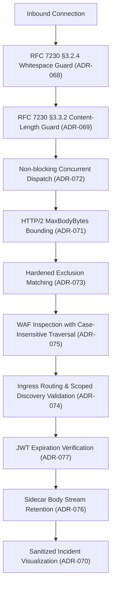

# AR-055 - Comprehensive Architecture Review for Post-Remediation Security Hardening

## 1. Executive Summary

This architecture review evaluates the 10 security findings identified during the post-remediation security audit (`SR-070` / `SECURITY_AUDIT.md`). It establishes formal Architecture Decision Records (`ADR-068` through `ADR-077`) to guide subsequent implementation without compromising the zero-dependency, ultra-lightweight, high-performance architecture of Toron.

---

## 2. Architecture Review Matrix

| Task ID | Requirement | Architecture Decision Record | Core Architectural Change |
| :--- | :--- | :--- | :--- |
| `TASK-073` | `REQ-073` | `ADR-068` | Enforce RFC 7230 §3.2.4 strict whitespace checking preceding header colons in `httpparser`. |
| `TASK-074` | `REQ-074` | `ADR-069` | Enforce RFC 7230 §3.3.2 multiple and conflicting `Content-Length` header rejection. |
| `TASK-075` | `REQ-075` | `ADR-070` | Implement contextual HTML entity encoding in dashboard (`public/app.js`) to eliminate Stored DOM XSS. |
| `TASK-076` | `REQ-076` | `ADR-071` | Apply `MaxBodyBytes` bounded streaming in HTTP/2 ingress adapter to prevent heap exhaustion. |
| `TASK-077` | `REQ-077` | `ADR-072` | Decouple TCP keep-alive waiting from fixed reactor workers to prevent connection starvation. |
| `TASK-078` | `REQ-078` | `ADR-073` | Harden path exclusion evaluation to require exact equality on root (`/`) and discard empty strings. |
| `TASK-079` | `REQ-079` | `ADR-074` | Validate container labels against root binding and reserved `/internal` endpoint shadowing. |
| `TASK-080` | `REQ-080` | `ADR-075` | Expand WAF `TRAVERSAL-001` with `(?i)` flag and case-insensitive hex percent-encoding patterns. |
| `TASK-081` | `REQ-081` | `ADR-076` | Retain and forward request bodies in sidecar proxy adapter for mutating requests. |
| `TASK-082` | `REQ-082` | `ADR-077` | Enforce presence of valid `exp` claim in JWT verification by default. |

---

## 3. High-Level Architectural Flow

---

## 4. Architectural Sign-off

The proposed architectural decisions adhere to all core principles: zero external runtime dependencies, memory safety, standard library idioms, and complete immunity to connection desynchronization and resource starvation.
