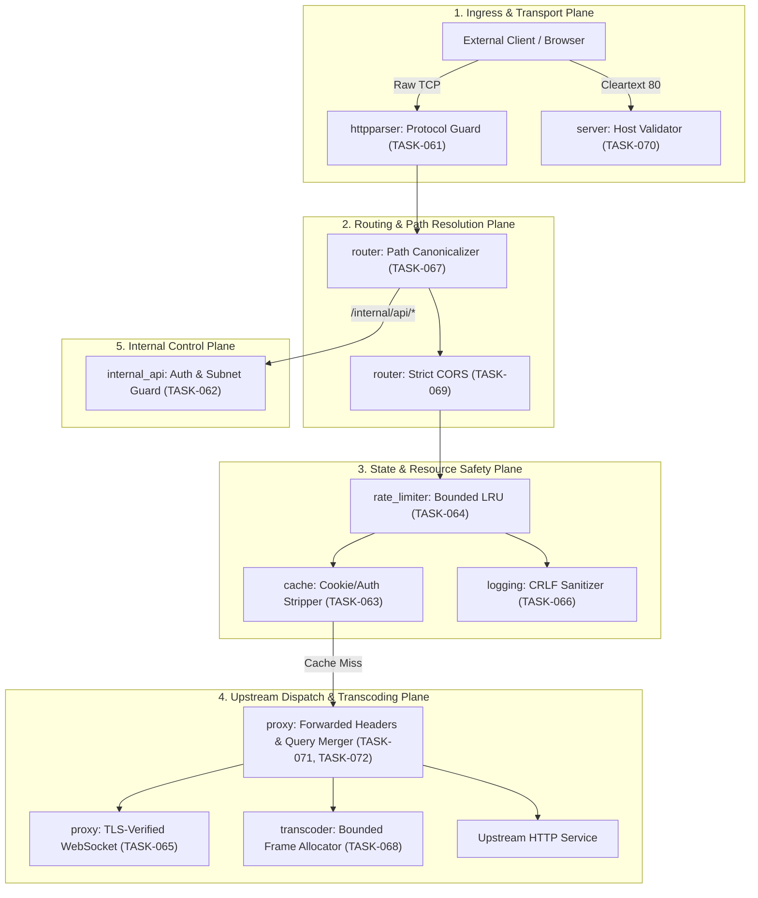

# Architecture Review: Toron Edge Gateway Security Hardening (`TASK-061` – `TASK-072`)

## 1. Executive Summary

As the **Architect (`AGENT-004`)**, a comprehensive architectural review of the **Toron Web Server & Edge Gateway** (`toron_v3`) was conducted to evaluate the technical design, system boundaries, protocol semantics, memory safety invariants, and concurrency models across the 12 newly formulated engineering tasks ([`TASK-061`](file:///Users/sneha/Developer/toron/docs/tasks/TASK-061.md) through [`TASK-072`](file:///Users/sneha/Developer/toron/docs/tasks/TASK-072.md)).

The evaluation centers on resolving vulnerabilities identified in [`SECURITY_AUDIT.md`](file:///Users/sneha/Developer/toron/SECURITY_AUDIT.md) while maintaining Toron's core design tenets:
1. **Zero External Dependencies** (standard Go library runtime).
2. **Deterministic, Bounded Resource Utilization** (no unbounded heap allocations).
3. **High-Performance Non-Blocking Concurrency** (zero lock contention on hot paths).
4. **Strict RFC & Web Standard Compliance** (RFC 7230, RFC 7234, RFC 3986, RFC 8441, W3C CORS).

---

## 2. Architectural Decomposition by Functional Plane

---

## 3. Detailed Plane-by-Plane Architectural Review

### 3.1 Plane 1: Ingress Protocol & Connection Orchestration
- **Components**: [`pkg/httpparser`](file:///Users/sneha/Developer/toron/pkg/httpparser), [`pkg/server`](file:///Users/sneha/Developer/toron/pkg/server)
- **Tasks**: [`TASK-061`](file:///Users/sneha/Developer/toron/docs/tasks/TASK-061.md), [`TASK-070`](file:///Users/sneha/Developer/toron/docs/tasks/TASK-070.md)
- **Architectural Analysis**:
  - `TASK-061` addresses HTTP Request Smuggling (CWE-444). Without body dechunking in `httpparser`, keeping the socket alive causes leftover chunk bytes to be parsed as the next request. The architectural remedy is **protocol fail-fast**: return `ErrUnsupportedTransferEncoding`, send `HTTP/1.1 501 Not Implemented` with `Connection: close`, and execute immediate TCP teardown (`conn.Close()`).
  - `TASK-070` mitigates Open Redirects (CWE-601). In `serveHTTPRedirect`, incoming `Host` values must be checked against an in-memory hash set of registered SNI hosts and route domains. If unrecognized, the listener redirects to a configured canonical host or returns `400 Bad Request`.

### 3.2 Plane 2: Routing, Path Normalization & Query Synthesis
- **Components**: [`pkg/router`](file:///Users/sneha/Developer/toron/pkg/router), [`pkg/proxy`](file:///Users/sneha/Developer/toron/pkg/proxy)
- **Tasks**: [`TASK-067`](file:///Users/sneha/Developer/toron/docs/tasks/TASK-067.md), [`TASK-072`](file:///Users/sneha/Developer/toron/docs/tasks/TASK-072.md)
- **Architectural Analysis**:
  - `TASK-067` prevents Upstream Path Traversal (CWE-22). Request paths (`req.Path`) must undergo two-stage normalization:
    1. Pre-route canonicalization (`path.Clean`) before exact and prefix route dispatch.
    2. Containment boundary assertion in `JoinProxyPath` to guarantee that relative directory dot-segments cannot escape the configured upstream target base path.
  - `TASK-072` prevents HTTP Parameter Pollution (CWE-235). When an upstream target route defines fixed query parameters (e.g. `?role=guest`), those parameters represent hard gateway constraints. Toron must prioritize target keys and strip colliding client-supplied parameters while preserving non-conflicting client parameters verbatim.

### 3.3 Plane 3: Control Plane, Management APIs & Loopback Isolation
- **Components**: [`pkg/server/internal_api.go`](file:///Users/sneha/Developer/toron/pkg/server/internal_api.go)
- **Tasks**: [`TASK-062`](file:///Users/sneha/Developer/toron/docs/tasks/TASK-062.md)
- **Architectural Analysis**:
  - Unauthenticated `/internal/api/*` endpoints expose internal network topology and telemetry. Additionally, `/internal/api/proxy-test` allows arbitrary header injection to loopback (`127.0.0.1`).
  - The architectural design introduces a dedicated management middleware enforcing:
    1. Secret token / API key authentication via `X-Toron-Admin-Key` or Bearer token.
    2. Subnet / IP CIDR allowlisting (`allowed_subnets: ["127.0.0.1/32", "10.0.0.0/8"]`).
    3. Header sanitization in `proxy-test` to strip spoofed authentication headers before dispatching loopback requests.

### 3.4 Plane 4: Memory Safety, State Eviction & Stream Sanitization
- **Components**: [`pkg/router/cache.go`](file:///Users/sneha/Developer/toron/pkg/router/cache.go), [`pkg/router/rate_limiter.go`](file:///Users/sneha/Developer/toron/pkg/router/rate_limiter.go), [`pkg/router/cors.go`](file:///Users/sneha/Developer/toron/pkg/router/cors.go), [`pkg/logging/manager.go`](file:///Users/sneha/Developer/toron/pkg/logging/manager.go), [`pkg/transcoder/framer.go`](file:///Users/sneha/Developer/toron/pkg/transcoder/framer.go), [`pkg/proxy/proxy.go`](file:///Users/sneha/Developer/toron/pkg/proxy/proxy.go)
- **Tasks**: [`TASK-063`](file:///Users/sneha/Developer/toron/docs/tasks/TASK-063.md), [`TASK-064`](file:///Users/sneha/Developer/toron/docs/tasks/TASK-064.md), [`TASK-065`](file:///Users/sneha/Developer/toron/docs/tasks/TASK-065.md), [`TASK-066`](file:///Users/sneha/Developer/toron/docs/tasks/TASK-066.md), [`TASK-068`](file:///Users/sneha/Developer/toron/docs/tasks/TASK-068.md), [`TASK-069`](file:///Users/sneha/Developer/toron/docs/tasks/TASK-069.md), [`TASK-071`](file:///Users/sneha/Developer/toron/docs/tasks/TASK-071.md)
- **Architectural Analysis**:
  - **Shared Cache (`TASK-063`)**: Strips `Set-Cookie` headers from cacheable responses per RFC 7234 §8. Rejects requests with `Authorization` headers from being stored in or served from the shared cache.
  - **Rate Limiter (`TASK-064`)**: Replaces unbounded map with a capacity-bounded LRU cache (e.g. max 100,000 buckets) and periodic sweep. Replaces spoofable `X-Forwarded-For` with socket `RemoteAddr` unless peer is in `trusted_proxies`.
  - **WebSocket Proxy TLS (`TASK-065`)**: Removes `InsecureSkipVerify: true`. Initializes root CAs or custom route CA files and populates `ServerName` for SNI.
  - **Access Logger (`TASK-066`)**: Applies `sanitizeLogField` on client strings to strip `\r`, `\n`, and non-printable control characters, neutralizing CRLF log forgery (CWE-117).
  - **gRPC Transcoder (`TASK-068`)**: Enforces `DefaultMaxGRPCFrameSize` (4 MB) in `DecodeGRPCFrame` before calling `make([]byte, length)`, eliminating OOM allocation panics.
  - **CORS Middleware (`TASK-069`)**: Rejects configurations containing `allow_origins: ["*"]` with `allow_credentials: true`. Refuses to reflect arbitrary origins on credentialed routes and injects `Vary: Origin`.
  - **Forwarded Headers (`TASK-071`)**: Derives `X-Forwarded-Proto` strictly from socket TLS state and `X-Forwarded-For` from physical socket IP unless peer IP matches `trusted_proxies`. Strips hop-by-hop headers per RFC 7230 §6.1.

---

## 4. Architecture Decision Record (ADR) Mapping

Each task is formalized into an individual Architecture Decision Record under [`docs/architecture/`](file:///Users/sneha/Developer/toron/docs/architecture/):

| Task ID | Requirement ID | ADR ID | Title |
| :--- | :--- | :--- | :--- |
| [`TASK-061`](file:///Users/sneha/Developer/toron/docs/tasks/TASK-061.md) | [`REQ-061`](file:///Users/sneha/Developer/toron/docs/requirements/REQ-061.md) | [`ADR-056`](file:///Users/sneha/Developer/toron/docs/architecture/ADR-056.md) | HTTP Request Smuggling Prevention & Transfer-Encoding Protocol Guard |
| [`TASK-062`](file:///Users/sneha/Developer/toron/docs/tasks/TASK-062.md) | [`REQ-062`](file:///Users/sneha/Developer/toron/docs/requirements/REQ-062.md) | [`ADR-057`](file:///Users/sneha/Developer/toron/docs/architecture/ADR-057.md) | Internal Management API Access Control, Token Auth & SSRF Hardening |
| [`TASK-063`](file:///Users/sneha/Developer/toron/docs/tasks/TASK-063.md) | [`REQ-063`](file:///Users/sneha/Developer/toron/docs/requirements/REQ-063.md) | [`ADR-058`](file:///Users/sneha/Developer/toron/docs/architecture/ADR-058.md) | Shared HTTP Cache Session Cookie Isolation & Authorization Boundaries |
| [`TASK-064`](file:///Users/sneha/Developer/toron/docs/tasks/TASK-064.md) | [`REQ-064`](file:///Users/sneha/Developer/toron/docs/requirements/REQ-064.md) | [`ADR-059`](file:///Users/sneha/Developer/toron/docs/architecture/ADR-059.md) | Rate Limiter Bounded LRU Cache, State Eviction & Client Identity Anchoring |
| [`TASK-065`](file:///Users/sneha/Developer/toron/docs/tasks/TASK-065.md) | [`REQ-065`](file:///Users/sneha/Developer/toron/docs/requirements/REQ-065.md) | [`ADR-060`](file:///Users/sneha/Developer/toron/docs/architecture/ADR-060.md) | Upstream TLS Certificate Verification and SNI in WebSocket Reverse Proxy |
| [`TASK-066`](file:///Users/sneha/Developer/toron/docs/tasks/TASK-066.md) | [`REQ-066`](file:///Users/sneha/Developer/toron/docs/requirements/REQ-066.md) | [`ADR-061`](file:///Users/sneha/Developer/toron/docs/architecture/ADR-061.md) | Zero-Allocation Access Log Control Character Filtering & CRLF Prevention |
| [`TASK-067`](file:///Users/sneha/Developer/toron/docs/tasks/TASK-067.md) | [`REQ-067`](file:///Users/sneha/Developer/toron/docs/requirements/REQ-067.md) | [`ADR-062`](file:///Users/sneha/Developer/toron/docs/architecture/ADR-062.md) | Two-Stage Pre-Routing Path Canonicalization & Upstream Traversal Guards |
| [`TASK-068`](file:///Users/sneha/Developer/toron/docs/tasks/TASK-068.md) | [`REQ-068`](file:///Users/sneha/Developer/toron/docs/requirements/REQ-068.md) | [`ADR-063`](file:///Users/sneha/Developer/toron/docs/architecture/ADR-063.md) | Wire Frame Size Bounding & Heap Allocation Protection in gRPC Transcoder |
| [`TASK-069`](file:///Users/sneha/Developer/toron/docs/tasks/TASK-069.md) | [`REQ-069`](file:///Users/sneha/Developer/toron/docs/requirements/REQ-069.md) | [`ADR-064`](file:///Users/sneha/Developer/toron/docs/architecture/ADR-064.md) | Strict CORS Origin Matching and Wildcard Credential Disallowance |
| [`TASK-070`](file:///Users/sneha/Developer/toron/docs/tasks/TASK-070.md) | [`REQ-070`](file:///Users/sneha/Developer/toron/docs/requirements/REQ-070.md) | [`ADR-065`](file:///Users/sneha/Developer/toron/docs/architecture/ADR-065.md) | Whitelist-Driven Host Header Validation in Cleartext HTTPS Redirection |
| [`TASK-071`](file:///Users/sneha/Developer/toron/docs/tasks/TASK-071.md) | [`REQ-071`](file:///Users/sneha/Developer/toron/docs/requirements/REQ-071.md) | [`ADR-066`](file:///Users/sneha/Developer/toron/docs/architecture/ADR-066.md) | Physical Connection State Derivation & Hop-by-Hop Header Stripping |
| [`TASK-072`](file:///Users/sneha/Developer/toron/docs/tasks/TASK-072.md) | [`REQ-072`](file:///Users/sneha/Developer/toron/docs/requirements/REQ-072.md) | [`ADR-067`](file:///Users/sneha/Developer/toron/docs/architecture/ADR-067.md) | Target Query Precedence and HTTP Parameter Pollution (HPP) Mitigation |

---

## 5. Architectural Verification & Compliance Summary

1. **Protocol Invariants**:
   - RFC 7230 §6.1 hop-by-hop headers strictly removed before upstream proxying.
   - RFC 7234 §8 session and authorization cookie isolation enforced in caching.
   - RFC 3986 §5.2.4 dot-segment normalization executed before routing dispatch.
2. **Resource & Memory Invariants**:
   - Rate limiting memory bounded to $O(N)$ with explicit LRU capacity limits and TTL eviction.
   - gRPC wire frames bounded to 4 MB pre-allocation.
   - Access logging fast-path operates with zero allocations on clean strings.
3. **Execution Readiness**:
   - All 12 ADRs provide precise technical specifications for developer implementation without ambiguous edge cases.
