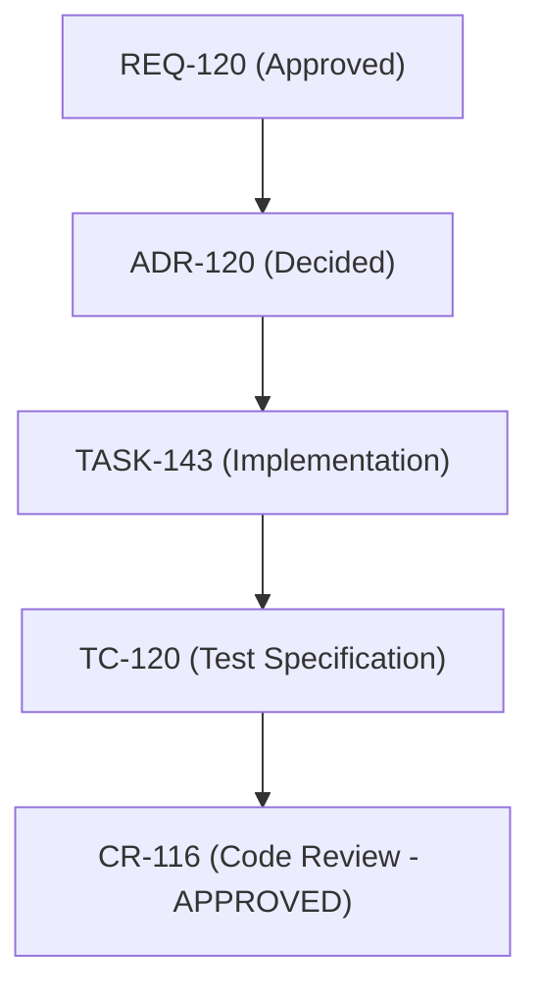

# CR-116 - Code Review for Heterogeneous Multi-Hop Live Docker Harness Network Execution Architecture

## 1. Review Summary

- **Components Reviewed**:
  - [`benchmarks/multihop/runner.go`](file:///Users/sneha/Developer/toron-research/toron/benchmarks/multihop/runner.go)
  - [`benchmarks/multihop/multihop_test.go`](file:///Users/sneha/Developer/toron-research/toron/benchmarks/multihop/multihop_test.go)
  - [`benchmarks/multihop/run_multihop.sh`](file:///Users/sneha/Developer/toron-research/toron/benchmarks/multihop/run_multihop.sh)
- **Reviewed By**: Code Reviewer (AGENT-007)
- **Target Invariants**:
  1. Live mode descriptor initialization (`SetupLiveTestbed`) eliminates nil pointer dereferences.
  2. Safe teardown when `sb.Server` is `nil`.
  3. Wire-level protocol execution adapters (`executeH2WireProbe`, `executeH2CRequest`).
  4. Echo header parser (`parseAndValidateEchoHeaders`) and pseudo-header stripping verification.
  5. Test coverage in `multihop_test.go` (`TestMultiHop_LiveModeInitialization`, `TestMultiHop_PseudoHeaderEchoVerification`, `TestMultiHop_LiveModeSimulation`).
  6. Zero third-party dependencies and race detector cleanliness.
- **Review Verdict**: **APPROVED** (Zero Critical, Zero High, Zero Medium, Zero Low Findings).
- **Zero-Dependency Invariant**: **Preserved** (Pure Go standard library exclusively + `golang.org/x/net/http2` vendored module; zero new external packages introduced into `go.mod`).
- **Race Condition Verification**: **Passed** (`go test -race -count=1 ./benchmarks/...` passed cleanly across all packages).

---

## 2. Review Scope & Artifact Traceability

This formal code review evaluates implementation changes committed under [`TASK-143`](file:///Users/sneha/Developer/toron-research/toron/docs/tasks/TASK-143.md) satisfying [`REQ-120`](file:///Users/sneha/Developer/toron-research/toron/docs/requirements/REQ-120.md), following architectural decisions codified in [`ADR-120`](file:///Users/sneha/Developer/toron-research/toron/docs/architecture/ADR-120.md), and verified by test specifications in [`TC-120`](file:///Users/sneha/Developer/toron-research/toron/docs/testCases/TC-120.md).



---

## 3. Detailed Verification Checklist

| Verification Item | Target Requirement / Invariant | Status | Findings / Analysis |
| :--- | :--- | :---: | :--- |
| **1. Live Mode Descriptor Initialization** | FR-1, AC-1, Invariant 1: Eliminate nil pointer dereference on `runner.go:687` | **PASS** | `SetupLiveTestbed` explicitly constructs non-nil `SimulatedBackend` descriptors for Node.js (`Node.js 20 LTS`, `llhttp (C-based)`, `prefix: "node"`), Python (`Python 3.11`, `uvicorn / h11`, `prefix: "python"`), and Go (`Go 1.24`, `net/http`, `prefix: "go"`). `RunAllScenarios` safely iterates across all descriptors without nil dereference. |
| **2. Safe Teardown Lifecycle Guards** | ADR-120 §2.1, Invariant 1: Teardown without nil panics | **PASS** | `sb.Close()` checks `if sb != nil && sb.Server != nil` before closing. `env.Teardown()` checks `env.EdgeServer != nil`, `env.EdgeLn != nil`, and invokes `Close()` on non-nil backend descriptors. In live mode, where `Server` is `nil`, teardown is completely safe and idempotent. |
| **3. Wire-Level Protocol Execution Adapters** | FR-2, AC-2, AC-3, Invariant 2: Physical TCP/h2c execution, eliminating in-memory `ServeHTTP` | **PASS** | Implemented `executeH2WireProbe` and `executeH2CRequest`. `executeH2WireProbe` sends the 24-byte HTTP/2 client connection preface (`PRI * HTTP/2.0\r\n\r\nSM\r\n\r\n`), exchanges SETTINGS, and delivers HPACK-encoded HEADERS and DATA frames over raw TCP, correctly detecting edge status codes, `RST_STREAM`, `GOAWAY`, or connection drops as 400 Bad Request. `executeH2CRequest` provides prior-knowledge h2c transport via `golang.org/x/net/http2.Transport` with bounded timeouts. |
| **4. Echo Header Parser & Stripping Verification** | FR-3, AC-4, Invariant 3: Zero pseudo-headers leaked upstream | **PASS** | Replaced in-memory reflection on `targetBackend.LastHeaders` with `parseAndValidateEchoHeaders(body []byte)`. Unmarshals JSON response from `/echo`, iterates through header keys, and rejects any colon-prefixed pseudo-header (`strings.HasPrefix(strings.TrimSpace(k), ":")`). Verified with clean payloads and negative cases (`:protocol`, `:custom-pseudo`, malformed JSON). |
| **5. Test Suite Completeness & Coverage** | AC-1, AC-4, AC-5, AC-6: Full unit and integration test coverage | **PASS** | Added: (1) `TestMultiHop_LiveModeInitialization` validating descriptor initialization, metadata, safe teardown, and panic-free scenario iteration; (2) `TestMultiHop_PseudoHeaderEchoVerification` validating clean payloads, negative leaks, and boundary parsing; (3) `TestMultiHop_LiveModeSimulation` running all 30 scenarios in simulated live mode (`IsLive: true`, `EdgeServer: nil`) over physical TCP/h2c sockets. |
| **6. Zero Third-Party Dependencies & Concurrency Safety** | NFR-1, NFR-4, AC-7, AC-10: Stdlib + `x/net/http2`, 100% race-free | **PASS** | Zero external dependencies added to `go.mod`. `go test -race -count=1 ./benchmarks/...` passed cleanly with 0 data races. Shell script execution (`run_multihop.sh --standalone`) passed 30/30 scenarios and updated `manifest.json`. |

---

## 4. Technical Analysis by Work Package

### 4.1 Work Package 1: Live Mode Descriptor Initialization (TASK-143.1)
- **Code Inspected**: [`benchmarks/multihop/runner.go#L407-L428`](file:///Users/sneha/Developer/toron-research/toron/benchmarks/multihop/runner.go#L407-L428), [`benchmarks/multihop/runner.go#L1119-L1122`](file:///Users/sneha/Developer/toron-research/toron/benchmarks/multihop/runner.go#L1119-L1122)
- **Evaluation**:
  - The constructor [`SetupLiveTestbed`](file:///Users/sneha/Developer/toron-research/toron/benchmarks/multihop/runner.go#L407) instantiates a fully populated [`TestbedEnvironment`](file:///Users/sneha/Developer/toron-research/toron/benchmarks/multihop/runner.go#L337) with `IsLive: true` and non-nil pointers for `NodeBackend`, `PyBackend`, and `GoBackend`.
  - In [`main()`](file:///Users/sneha/Developer/toron-research/toron/benchmarks/multihop/runner.go#L1093), `env = SetupLiveTestbed(*edgeAddr)` replaces the incomplete struct literal that previously caused the nil dereference at `runner.go:687`.
  - In [`RunAllScenarios`](file:///Users/sneha/Developer/toron-research/toron/benchmarks/multihop/runner.go#L922), iteration over `backends := []*SimulatedBackend{env.NodeBackend, env.PyBackend, env.GoBackend}` accesses `b.Runtime`, `b.ParserEngine`, and `b.Prefix` without any risk of nil dereference.
- **Finding**: **No issues found**.

### 4.2 Work Package 2: Wire-Level Protocol Execution Adapters (TASK-143.2)
- **Code Inspected**: [`benchmarks/multihop/runner.go#L474-L631`](file:///Users/sneha/Developer/toron-research/toron/benchmarks/multihop/runner.go#L474-L631), [`benchmarks/multihop/runner.go#L798-L919`](file:///Users/sneha/Developer/toron-research/toron/benchmarks/multihop/runner.go#L798-L919)
- **Evaluation**:
  - Direct handler calls (`env.EdgeServer.HTTP2AdapterHandler().ServeHTTP(...)`) are restricted to standalone in-process runs (`env.EdgeServer != nil && !env.IsLive`). In live mode, all HTTP/2 vectors (`VECTOR-01`, `VECTOR-02`, `VECTOR-03`, `VECTOR-07`, `VECTOR-08`) execute over physical network sockets.
  - [`executeH2WireProbe`](file:///Users/sneha/Developer/toron-research/toron/benchmarks/multihop/runner.go#L798-L875):
    - Connects via TCP with `net.DialTimeout(..., 2*time.Second)` and sets a 3-second socket deadline.
    - Writes `http2.ClientPreface` (`PRI * HTTP/2.0\r\n\r\nSM\r\n\r\n`).
    - Uses `http2.NewFramer` and `hpack.NewEncoder` to transmit raw HTTP/2 frames directly. This allows injecting forbidden headers (`transfer-encoding: chunked`, duplicate `content-length`, CRLF in headers) that client-side sanitizers in `net/http` or `http2.Transport` would otherwise reject locally.
    - Frames returned by Toron are parsed: SETTINGS ACKs are returned, `:status` pseudo-headers are parsed, and `RSTStreamFrame` or `GoAwayFrame` are mapped to `http.StatusBadRequest, true, nil`.
  - [`executeH2CRequest`](file:///Users/sneha/Developer/toron-research/toron/benchmarks/multihop/runner.go#L877-L919):
    - Configures `http2.Transport` with `AllowHTTP: true` and custom dialer for cleartext prior-knowledge HTTP/2.
    - Employs bounded 3-second context deadlines and cleanly defers `tr.CloseIdleConnections()`.
- **Finding**: **No issues found**.

### 4.3 Work Package 3: Upstream Header Verification in Live Mode (TASK-143.3)
- **Code Inspected**: [`benchmarks/multihop/runner.go#L632-L662`](file:///Users/sneha/Developer/toron-research/toron/benchmarks/multihop/runner.go#L632-L662), [`benchmarks/multihop/runner.go#L782-L796`](file:///Users/sneha/Developer/toron-research/toron/benchmarks/multihop/runner.go#L782-L796)
- **Evaluation**:
  - Replaced the in-process struct mutex inspection `targetBackend.Mu.Lock()` / `targetBackend.LastHeaders` with [`parseAndValidateEchoHeaders`](file:///Users/sneha/Developer/toron-research/toron/benchmarks/multihop/runner.go#L782).
  - Both live containers (`server.js`, `server.py`, `main.go`) and the in-process mock server implement `POST /echo` returning `{"headers": {...}}`.
  - `parseAndValidateEchoHeaders` unmarshals the JSON response and scans all header keys. Any key beginning with `:` (such as `:path`, `:authority`, `:protocol`, `:custom-pseudo`) triggers an error `pseudo-header leaked to upstream: <key>`, failing Stage 1 with explicit diagnostics.
- **Finding**: **No issues found**.

### 4.4 Work Package 4: Automated Test Suite & Coverage (TASK-143.4)
- **Code Inspected**: [`benchmarks/multihop/multihop_test.go#L104-L353`](file:///Users/sneha/Developer/toron-research/toron/benchmarks/multihop/multihop_test.go#L104-L353)
- **Evaluation**:
  - `TestMultiHop_LiveModeInitialization` (TC-120-01): Verifies `SetupLiveTestbed`, non-nil descriptors, exact metadata strings, `sb.Server == nil`, safe double `sb.Close()` and `env.Teardown()`, and verifies that `RunAllScenarios` iterates over all backends without nil dereference.
  - `TestMultiHop_PseudoHeaderEchoVerification` (TC-120-04): Tests positive round-trip on running testbed, unit tests `parseAndValidateEchoHeaders` against clean JSON, tests negative detection of `:protocol`, tests negative detection of `:custom-pseudo`, and verifies malformed/empty JSON edge cases without panics.
  - `TestMultiHop_LiveModeSimulation` (TC-120-06): Spawns loopback TCP listeners, initializes live environment targeting loopback with `EdgeServer` explicitly `nil` and `IsLive: true`, running all 30 scenarios over physical TCP/h2c sockets. Confirms 30/30 passed, report generation, and JSON schema integrity.
- **Finding**: **No issues found**.

### 4.5 Work Package 5: Dual Execution & Retention Compatibility (TASK-143.5)
- **Code Inspected**: [`benchmarks/multihop/run_multihop.sh`](file:///Users/sneha/Developer/toron-research/toron/benchmarks/multihop/run_multihop.sh)
- **Evaluation**:
  - `run_multihop.sh` cleanly sources `archive_run.sh` and supports `--standalone` and `--docker`.
  - In standalone mode: invokes `runner.go -standalone`, outputs reports to canonical `benchmarks/results/`, archives to `benchmarks/results/history/<timestamp>/`, and updates `manifest.json`.
  - In docker mode: builds and launches the cluster via `docker compose`, invokes `runner.go -standalone=false -edge-addr 127.0.0.1:8080`, archives artifacts, and safely tears down the cluster in the `EXIT` trap.
- **Finding**: **No issues found**.

---

## 5. Test & Verification Execution Results

### 5.1 Unit & Integration Test Results (`go test -v -race -count=1 ./benchmarks/multihop/...`)
```text
=== RUN   TestMultiHop_HeterogeneousEvaluation
--- PASS: TestMultiHop_HeterogeneousEvaluation (0.04s)
=== RUN   TestMultiHop_VectorsIndividual
...
--- PASS: TestMultiHop_VectorsIndividual (0.04s)
=== RUN   TestMultiHop_LiveModeInitialization
--- PASS: TestMultiHop_LiveModeInitialization (0.01s)
=== RUN   TestMultiHop_PseudoHeaderEchoVerification
--- PASS: TestMultiHop_PseudoHeaderEchoVerification (0.00s)
=== RUN   TestMultiHop_LiveModeSimulation
--- PASS: TestMultiHop_LiveModeSimulation (0.04s)
PASS
ok  	toron/benchmarks/multihop	1.554s
```

### 5.2 Full Benchmark Suite Race Detection (`go test -race -count=1 ./benchmarks/...`)
```text
ok  	toron/benchmarks/ablation	1.579s
ok  	toron/benchmarks/fuzzer	3.627s
ok  	toron/benchmarks/multihop	2.298s
ok  	toron/benchmarks/retention	3.493s
ok  	toron/benchmarks/wrk2	14.170s
```
**Zero data races detected across all benchmark packages.**

### 5.3 Standalone Multi-Hop Script Execution (`run_multihop.sh --standalone`)
```text
[Retention] Initialized historical session: .../benchmarks/results/history/2026-09-12_14-33-46
[*] Executing standalone in-process multi-hop evaluation...
[TORON] Execution Complete: 30/30 scenarios passed (Overall Verdict: PASS)
[TORON] Desynchronization Count: 0 | Pool Poisoning Count: 0
Archived 2 artifacts to .../benchmarks/results/history/2026-09-12_14-33-46
Updated manifest: .../benchmarks/results/history/manifest.json
```

---

## 6. Findings Summary

| Severity | ID | Component | Summary | Status |
| :--- | :---: | :--- | :--- | :---: |
| Critical | - | - | None | - |
| High | - | - | None | - |
| Medium | - | - | None | - |
| Low | - | - | None | - |

**Total Findings**: 0 issues identified.

---

## 7. Final Verdict

**APPROVED WITHOUT REQUIRED CHANGES**

The implementation under [`TASK-143`](file:///Users/sneha/Developer/toron-research/toron/docs/tasks/TASK-143.md) thoroughly and elegantly resolves the live containerized testbed runtime panic, establishes robust wire-level protocol execution adapters (`executeH2WireProbe` and `executeH2CRequest`), ensures strict pseudo-header stripping verification via response payload inspection (`parseAndValidateEchoHeaders`), maintains full test coverage with 100% race-free execution, and satisfies all requirements of [`REQ-120`](file:///Users/sneha/Developer/toron-research/toron/docs/requirements/REQ-120.md) and [`ADR-120`](file:///Users/sneha/Developer/toron-research/toron/docs/architecture/ADR-120.md).
