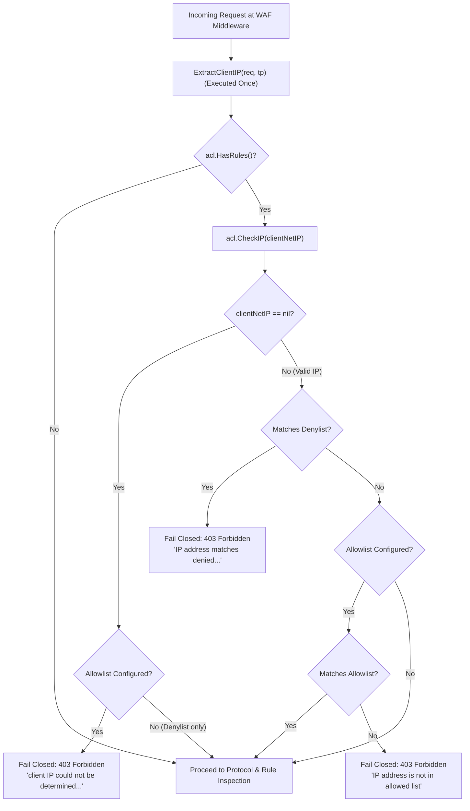

# REQ-093 - Fail-Closed WAF IP Access Control Enforcement on Unidentifiable Client IP

## 1. Context & Business Value

Toron Edge Gateway provides a high-performance Layer 7 Web Application Firewall ([`pkg/waf`](file:///Users/sneha/Developer/toron-research/toron/pkg/waf)) and CIDR IP Access Control List engine ([`pkg/waf/ip_acl.go`](file:///Users/sneha/Developer/toron-research/toron/pkg/waf/ip_acl.go)) designed to enforce strict perimeter access policies, including IP whitelisting (`allowed_ips` / `allowedSubnets`) and IP blacklisting (`denied_ips` / `deniedSubnets`).

During security review [`SR-091 Finding 2`](file:///Users/sneha/Developer/toron-research/toron/docs/securityReview/SR-091.md#L102-L127) and comprehensive vulnerability assessment [`SEC-32`](file:///Users/sneha/Developer/toron-research/toron/SECURITY_AUDIT.md#L439-L447) ([CWE-284 Improper Access Control](https://cwe.mitre.org/data/definitions/284.html), [CWE-1188 Insecure Default Initialization of Resource](https://cwe.mitre.org/data/definitions/1188.html), [CWE-693 Protection Mechanism Failure](https://cwe.mitre.org/data/definitions/693.html)), a critical flaw was identified in the interaction between the WAF middleware and the IP access control evaluation logic:

1. **Bypass via Missing Client IP in Middleware**: In [`pkg/waf/middleware.go:L58-L63`](file:///Users/sneha/Developer/toron-research/toron/pkg/waf/middleware.go#L58-L63), the IP access control evaluation was conditionally gated by:
   ```go
   if acl := engine.IPAccessList(); acl != nil && acl.HasRules() {
       if ip := ExtractClientIP(req); ip != nil {
           allowed, reason := acl.CheckIP(ip)
           if !allowed { ... }
       }
   }
   ```
   If a client's IP could not be determined (`ExtractClientIP(req)` returned `nil`), the middleware skipped the access control check entirely because `ip != nil` evaluated to `false`.
2. **Fail-Open Default in `CheckIP`**: In [`pkg/waf/ip_acl.go:L75-L78`](file:///Users/sneha/Developer/toron-research/toron/pkg/waf/ip_acl.go#L75-L78), the ACL engine evaluated:
   ```go
   if acl == nil || !acl.HasRules() || ip == nil {
       return true, ""
   }
   ```
   When `ip == nil`, the function returned `true, ""` (fail-open), unconditionally granting access regardless of whether an explicit allowlist was configured.
3. **Redundant Double Extraction**: In [`pkg/waf/middleware.go:L58-L67`](file:///Users/sneha/Developer/toron-research/toron/pkg/waf/middleware.go#L58-L67), `ExtractClientIP(req, tp)` was executed twice on the request hot path—first to populate the telemetry string `clientIP`, and immediately again to evaluate `acl.CheckIP(ip)`.
4. **Missing End-to-End Verification**: While unit tests checked individual IP matching rules, there was no end-to-end middleware and integration test coverage verifying that requests lacking client IP (e.g. nil or empty `RemoteAddr`, absent forwarded headers, or invalid non-IP strings) are strictly blocked with status `403 Forbidden` when an allowlist is active, and permitted when no allowlist is configured.

### Exploitability & Security Impact

Under an allowlist-enforced perimeter (e.g., restricting access to administrative routes, payment webhooks, or internal partner endpoints to trusted CIDRs), an external client whose network address cannot be determined—such as via stripped headers behind intermediate proxies, synthetic requests, or malformed address inputs—would completely bypass the allowlist and access sensitive backend services without authorization.

Remediating `SEC-32` guarantees **fail-closed** security behavior: when an IP allowlist is enforced, any request whose client IP cannot be definitively verified against that allowlist MUST be denied access with HTTP status `403 Forbidden`.

---

## 2. Non-Goals & Scope Exclusions

1. **Denylist-Only Fail-Open Preservation**: When no IP allowlist is configured (i.e. only IP denylists / blacklists are active or no IP ACL rules are defined), requests with unidentifiable client IP (`ExtractClientIP` returns `nil`) SHALL NOT be blocked by the IP ACL layer. Denylists are exclusionary filters intended to block known malicious sources; rejecting unknown IPs in denylist-only mode would cause severe false-positive outages across proxies or local synthetic harnesses.
2. **Protocol-Level RemoteAddr Ingress Binding**: The extraction of physical socket addresses across HTTP/1.1 non-blocking reactor, HTTP/2 multiplexer, and HTTP/3 QUIC datagrams is governed by [`REQ-092`](file:///Users/sneha/Developer/toron-research/toron/docs/requirements/REQ-092.md) and [`ADR-087`](file:///Users/sneha/Developer/toron-research/toron/docs/architecture/ADR-087.md). `REQ-093` governs the WAF engine's policy evaluation and middleware handling when client IP resolution yields `nil`.
3. **Application-Level Sticky Session Hashing**: Application load-balancer hashing in [`pkg/proxy/sticky.go`](file:///Users/sneha/Developer/toron-research/toron/pkg/proxy/sticky.go) is excluded and remains governed by [`REQ-030`](file:///Users/sneha/Developer/toron-research/toron/docs/requirements/REQ-030.md).

---

## 3. Requirements & Acceptance Criteria

### REQ-093-AC-01: Fail-Closed Denial on Unidentifiable Client IP when Allowlist is Active
- When an IP allowlist (`allowed_ips` or `allowedSubnets`) is configured and active on the WAF engine:
  - If incoming client IP cannot be determined (`ExtractClientIP(req, tp)` returns `nil`), the WAF engine MUST reject the request fail-closed.
  - The HTTP response status code MUST be `403 Forbidden`.
  - The HTTP response `Content-Type` header MUST be `application/json`.
  - The HTTP response body MUST be the JSON payload:
    ```json
    {"error":"Forbidden","message":"client IP could not be determined and allowed IP list is enforced"}
    ```
  - The access check failure reason returned by `IPAccessList.CheckIP(nil)` MUST be:
    `"client IP could not be determined and allowed IP list is enforced"`.
  - Execution of subsequent middleware handlers and backend upstream routing MUST be halted immediately.

### REQ-093-AC-02: Fail-Open Pass-Through on Unidentifiable Client IP when No Allowlist is Configured
- When no IP allowlist is active (i.e., the ACL configuration contains only `denied_ips` / `deniedSubnets`, or has no rules configured):
  - If incoming client IP cannot be determined (`ExtractClientIP(req, tp)` returns `nil`), `IPAccessList.CheckIP(nil)` MUST return `allowed: true, reason: ""`.
  - The request MUST NOT be blocked by the IP ACL check.
  - The request MUST continue through subsequent WAF inspection stages (Protocol Integrity, Custom Rules, OWASP Injection Rules) and downstream router handlers unless blocked by another security rule.

### REQ-093-AC-03: Single-Pass Client IP Extraction in WAF Middleware
- In [`pkg/waf/middleware.go`](file:///Users/sneha/Developer/toron-research/toron/pkg/waf/middleware.go), the redundant double invocation of `ExtractClientIP(req, tp)` MUST be eliminated.
- The middleware MUST call `ExtractClientIP(req, tp)` exactly once per request.
- The extracted `net.IP` object MUST be reused directly:
  1. Converted to a string (if non-nil) to populate `clientIP` for telemetry and audit logging.
  2. Passed directly to `acl.CheckIP(ip)` for access control evaluation.
- The call to `acl.CheckIP(ip)` MUST NOT be guarded by `if ip != nil`. It MUST be called unconditionally whenever `acl != nil && acl.HasRules()`.

### REQ-093-AC-04: Security Telemetry and Audit Logging for Fail-Closed Rejections
- When a request is rejected fail-closed due to an unidentifiable client IP under an active allowlist:
  - The Prometheus metric `WAFBlocked("ip_acl", req.Path)` MUST be incremented.
  - If a WAF audit logger is configured on the engine, a structured `SecurityEvent` MUST be logged with:
    - `Event`: `"ip_acl_block"`
    - `ClientIP`: `""` (empty string)
    - `Method`: `req.Method`
    - `Path`: `req.Path`
    - `Category`: `"ip_acl"`
    - `AnomalyScore`: `0`
    - `Action`: `"blocked"`
    - `Location`: `"remote_addr"`

### REQ-093-AC-05: Robust Handling Across Missing, Stripped, and Malformed Client IP Inputs
- The WAF middleware and IP ACL engine MUST consistently treat the following as an unidentifiable client IP (`nil`):
  1. Synthetic or raw requests where `req.RemoteAddr == ""` and `req.RawConn == nil`, with no forwarded headers.
  2. Requests where `RemoteAddr` contains an unparseable or non-IP string (e.g. `"invalid-host"`).
  3. Requests where `X-Forwarded-For` or `X-Real-IP` contains malformed, non-IP text (e.g. `"unknown"`, `"localhost"`, `"1234.5678"`).
  4. Requests arriving from an untrusted peer where physical IP is present but unparseable, and forwarded headers are untrusted.
- In all such cases, if an allowlist is configured, the request MUST be rejected fail-closed with HTTP `403 Forbidden`.

### REQ-093-AC-06: Concurrency and Thread Safety Invariant
- All IP ACL checks and middleware processing MUST be completely safe for concurrent execution across parallel goroutines without data races (`go test -race ./...`).
- `IPAccessList` structures MUST remain immutable during request inspection.

### REQ-093-AC-07: Zero Third-Party Dependencies Invariant
- All IP parsing, CIDR subnet matching, JSON formatting, and middleware logic MUST strictly use Go standard library packages (`net`, `net/http`, `strings`, `bytes`).
- No external third-party dependencies are permitted.

### REQ-093-AC-08: Automated Test Coverage and Verification (`TC-093`)
- Comprehensive unit and middleware test suites MUST verify:
  1. `TestIPAccessList_CheckIP_NilIP_WithAllowlist`: Verifies `acl.CheckIP(nil)` returns `false` with the exact reason `"client IP could not be determined and allowed IP list is enforced"`.
  2. `TestIPAccessList_CheckIP_NilIP_DenylistOnly`: Verifies `acl.CheckIP(nil)` returns `true, ""` when only denylists are present.
  3. `TestWAFMiddleware_NilClientIP_AllowlistEnforced`: Verifies that a request with no client IP information (`RemoteAddr == ""` and no forwarded headers) is rejected with HTTP `403 Forbidden`, JSON body `{"error":"Forbidden","message":"client IP could not be determined and allowed IP list is enforced"}`, and `WAFBlocked` metric incremented.
  4. `TestWAFMiddleware_NilClientIP_DenylistOnly`: Verifies that a request with no client IP information passes through WAF IP ACL evaluation when only a denylist is configured.
  5. `TestWAFMiddleware_MalformedClientIP_AllowlistEnforced`: Verifies that requests with invalid IP strings in `RemoteAddr` or `X-Forwarded-For` are rejected fail-closed with status `403 Forbidden` under an active allowlist.
  6. `TestWAFMiddleware_AuditLogging_NilIP_Blocked`: Verifies that audit logging emits an `ip_acl_block` event with empty `ClientIP` when a request with nil IP is blocked.

---

## 4. Rationale & Threat Model

| Threat Scenario | Attacker Action / Input | Prior Vulnerable Behavior | Remediated Behavior (REQ-093) |
| :--- | :--- | :--- | :--- |
| **Allowlist Bypass via Header Stripping** | Attacker routes request through an intermediate proxy that strips or drops `RemoteAddr` / `X-Forwarded-For`. | `ExtractClientIP` returns `nil`. Middleware evaluates `if ip != nil` as false, skipping ACL check entirely (Fail-Open). Protected endpoint accessed! | `acl.CheckIP(nil)` returns `false`. Middleware rejects request with `403 Forbidden` and fail-closed JSON payload. |
| **Allowlist Bypass via Malformed IP** | Attacker injects corrupt headers (`X-Forwarded-For: "bad-ip"`). | IP parsing fails, returning `nil`. Check bypassed fail-open. | Unresolvable IP fails closed with `403 Forbidden`. |
| **Denylist Evasion with Missing IP** | Client connects with unidentifiable IP on a server configuring only blacklists. | Request allowed through. | Request allowed through to subsequent inspection stages (fail-open for unknown IPs in denylist-only configuration, avoiding disruption). |
| **Performance Degradation on Request Hot Path** | High-throughput requests processed by WAF. | `ExtractClientIP(req, tp)` invoked twice sequentially per request. | `ExtractClientIP(req, tp)` invoked exactly once; result cached and shared between logging and ACL evaluation. |

### Defense-in-Depth Comparison Matrix



---

## 5. Constraints & Non-Functional Requirements

- **Security Policy Invariant**: Fail-closed is non-negotiable whenever an allowlist is configured. No request shall pass an allowlist without positive identification and explicit match against configured CIDRs or IPs.
- **Latency & Allocations**: Single-pass extraction ensures minimal overhead. Zero dynamic memory allocations beyond the single standard library IP extraction.
- **Standard Library Compliance**: Only standard library Go packages (`net`, `strings`, `bytes`, `net/http`). No third-party dependencies.
- **Thread Safety**: 100% data-race-free under concurrent execution (`go test -race ./...`).

---

## 6. Open Questions

- *Open Question 1*: Should the JSON error response message be customizable via YAML configuration in future WAF releases?
  - *Resolution*: For `REQ-093`, standardizing on `{"error":"Forbidden","message":"client IP could not be determined and allowed IP list is enforced"}` satisfies compliance requirements and aligns with existing WAF error payload structures. Configurable error templating can be considered as a separate future feature.

---

## 7. Traceability Matrix

| Artifact | Identifier / Reference | Description |
| :--- | :--- | :--- |
| **Security Finding** | [`SEC-32`](file:///Users/sneha/Developer/toron-research/toron/SECURITY_AUDIT.md#L439-L447) | Fail-Open WAF IP Access Control Bypass on Unidentifiable Client IP |
| **Security Review** | [`SR-091`](file:///Users/sneha/Developer/toron-research/toron/docs/securityReview/SR-091.md#L102-L127) | Finding 2: Fail-Open WAF IP Access Control Bypass |
| **Requirement** | [`REQ-093`](file:///Users/sneha/Developer/toron-research/toron/docs/requirements/REQ-093.md) | Fail-Closed WAF IP Access Control Enforcement on Unidentifiable Client IP |
| **Related Requirements**| [`REQ-001`](file:///Users/sneha/Developer/toron-research/toron/docs/requirements/REQ-001.md), [`REQ-019`](file:///Users/sneha/Developer/toron-research/toron/docs/requirements/REQ-019.md), [`REQ-041`](file:///Users/sneha/Developer/toron-research/toron/docs/requirements/REQ-041.md), [`REQ-092`](file:///Users/sneha/Developer/toron-research/toron/docs/requirements/REQ-092.md) | Core Server Engine, Reverse Proxy Gateway, WAF Engine, RemoteAddr Binding |
| **Architecture Decision**| [`ADR-088`](file:///Users/sneha/Developer/toron-research/toron/docs/architecture/ADR-088.md) | Fail-Closed WAF IP Access Control & Single-Pass Extraction |
| **Test Case** | [`TC-093`](file:///Users/sneha/Developer/toron-research/toron/docs/testCases/TC-093.md) | Verification of Fail-Closed WAF IP ACL on Missing/Malformed Client IP |

---

## 8. User Approval Gate

> [!IMPORTANT]
> In accordance with project engineering standards, this requirement specification is submitted with `status: draft`. Downstream decomposition into architecture decision records ([`ADR-088`](file:///Users/sneha/Developer/toron-research/toron/docs/architecture/ADR-088.md)), tasks ([`TASK-XXX`](file:///Users/sneha/Developer/toron-research/toron/docs/tasks/)), test design ([`TC-093`](file:///Users/sneha/Developer/toron-research/toron/docs/testCases/TC-093.md)), and implementation requires explicit user review and approval.
