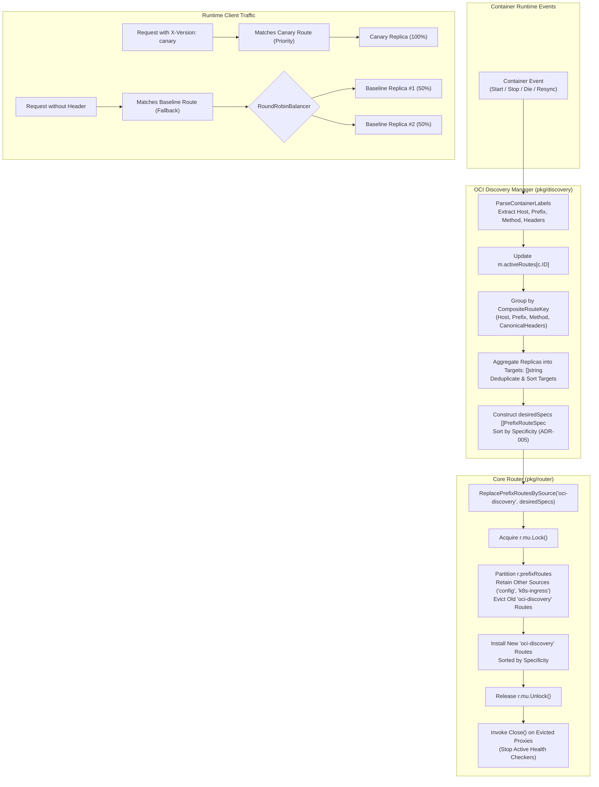

# REQ-095 - Composite Route Key Grouping, Multi-Replica Target Aggregation, and Specificity-Based Atomic Route Lifecycle in OCI Discovery Engine

## 1. Context & Business Value

Toron Edge Gateway provides an OCI container auto-discovery engine ([`pkg/discovery/manager.go`](file:///Users/sneha/Developer/toron-research/toron/pkg/discovery/manager.go)) that connects to local container runtimes (Docker, Podman, Containerd, CRI-O via universal Unix domain socket REST APIs), parses container metadata labels, and automatically provisions dynamic reverse proxy routes in Toron's core routing engine ([`pkg/router/router.go`](file:///Users/sneha/Developer/toron-research/toron/pkg/router/router.go)).

During comprehensive security audit [`SR-091 Finding 4`](file:///Users/sneha/Developer/toron-research/toron/docs/securityReview/SR-091.md#L154-L171) and vulnerability tracking [`SEC-34`](file:///Users/sneha/Developer/toron-research/toron/SECURITY_AUDIT.md#L465-L473) ([CWE-400 Uncontrolled Resource Consumption](https://cwe.mitre.org/data/definitions/400.html), [CWE-284 Improper Access Control](https://cwe.mitre.org/data/definitions/284.html), [CWE-662 Improper Synchronization](https://cwe.mitre.org/data/definitions/662.html)), severe architectural flaws were uncovered in how the OCI discovery manager interacts with the core router during container scale-up, scale-down, restarts, and multi-dimensional routing scenarios.

### Problem Statement & Failure Modes

In [`pkg/discovery/manager.go:L207-L256`](file:///Users/sneha/Developer/toron-research/toron/pkg/discovery/manager.go#L207-L256), the container discovery manager handles container lifecycle events as follows:

```go
func (m *Manager) handleContainerStart(c Container) {
    route, ok := ParseContainerLabels(c, m.cfg.DefaultWeight)
    ...
    m.activeRoutes[c.ID] = route
    if m.router != nil {
        opts := proxy.ProxyOptions{
            Targets:           []string{route.TargetURL()},
            StripPrefix:       route.StripPrefix,
            RewriteRedirects:  route.RewriteRedirects,
            RewriteCookiePath: route.RewriteCookiePath,
        }
        _ = m.router.RoutePrefix("upstream", route.Host, route.Prefix, nil, "", opts)
    }
}

func (m *Manager) handleContainerStop(containerID string) {
    ...
    delete(m.activeRoutes, containerID)
    if m.router != nil {
        m.router.RemovePrefixRoute(route.Host, route.Prefix)
    }
}
```

This interaction produces five critical failure modes:

1. **Premature Route Deletion & Service Outage (CWE-662, CWE-284)**:
   When multiple container replicas serve the same service (e.g. 3 container instances sharing `Host: "api.example.com"` and `Prefix: "/v1"`), if any single container replica stops, crashes, or is restarted for a rolling update, `handleContainerStop` calls [`m.router.RemovePrefixRoute(route.Host, route.Prefix)`](file:///Users/sneha/Developer/toron-research/toron/pkg/router/router.go#L868-L893). `RemovePrefixRoute` purges **all** prefix routes matching `(host, prefix)` from `r.prefixRoutes`. Consequently, stopping a single replica immediately cuts off traffic to all surviving, healthy container replicas, inducing an immediate denial of service (HTTP `404 Not Found`) for that service.
2. **Multi-Replica Load-Balancing Defeat & Single-Instance Starvation (CWE-400)**:
   In `handleContainerStart`, each container is registered as an independent, single-target prefix route: `Targets: []string{route.TargetURL()}`. In [`pkg/router/router.go:L626-L644`](file:///Users/sneha/Developer/toron-research/toron/pkg/router/router.go#L626-L644), `router.ServeHTTP` iterates through `r.prefixRoutes` linearly and dispatches requests to the *first matching route*. Because replica #1 was appended first, **replica #1 receives 100% of the traffic**, while replicas #2 through $M$ receive 0% of traffic. Horizontal scaling is completely defeated, and single container instances suffer cascading overload crashes.
3. **Routing Dimension Blindness (Variant Collision)**:
   The discovery engine currently only parses `toron.host` and `toron.prefix`. It lacks support for HTTP method constraints (`toron.method`) and HTTP header constraints (`toron.header.<Name>`, `toron.headers`). Grouping routes solely by `(Host, Prefix)` conflates distinct traffic variants (such as Canary deployments with `X-Version: canary` vs Baseline deployments with no header, or `POST` vs `GET` endpoints). If container discovery groups solely by `(Host, Prefix)`, canary containers would either overwrite baseline containers or be merged into the same target pool, leaking pre-release traffic to general users.
4. **Route Shadowing & Missing Specificity Ordering**:
   When routes with varying specificity exist (e.g., generic prefix `/api` vs specific prefix `/api/v1/auth`, or unconstrained route vs header-constrained Canary route), `ServeHTTP` matches whichever route appears earlier in `r.prefixRoutes`. If an unconstrained generic route is registered before a Canary route, the generic route shadows the Canary route, preventing Canary requests from ever reaching the Canary container. In accordance with [`ADR-005`](file:///Users/sneha/Developer/toron-research/toron/docs/architecture/ADR-005.md), routes must be evaluated in strict order of specificity.
5. **Lack of Method Support in `PrefixRouteSpec`**:
   [`PrefixRouteSpec`](file:///Users/sneha/Developer/toron-research/toron/pkg/router/router.go#L172-L179) lacks an explicit `Method string` field. When compiling prefix routes via `compilePrefixRoute`, the internal `prefixRoute.method` field is left empty, preventing declarative prefix routes from filtering by HTTP method.

### Security Impact & Exploitability

- **Availability Collapse (Denial of Service)**: Any container scaling event or single-replica crash immediately terminates ingress routing for all healthy replicas of that service.
- **Canary Leakage / Broken Traffic Segmentation**: Inability to isolate canary headers or method constraints causes canary traffic to spill into production or production traffic to hit unvalidated canary containers.
- **Resource Exhaustion on Scale**: Discarded proxies and orphan health checkers leak memory and socket descriptors when routes churn.

Remediating `SEC-34` through `REQ-095` establishes a resilient, **composite-key grouped, multi-replica aggregated, and specificity-ordered route lifecycle** in the OCI discovery engine and core router.

---

## 2. Non-Goals & Scope Exclusions

1. **Kubernetes Ingress Synchronization (`SEC-33`)**: Lifecycle reconciliation for Kubernetes Ingress is governed by [`REQ-094`](file:///Users/sneha/Developer/toron-research/toron/docs/requirements/REQ-094.md). While both subsystems use `ReplacePrefixRoutesBySource`, `REQ-095` strictly governs OCI container auto-discovery (`pkg/discovery`).
2. **Container Runtime Daemon Management**: Managing, starting, stopping, or configuring container runtimes (dockerd, podman daemon) is external to Toron.
3. **Third-Party Client Libraries**: Incorporating external Docker or OCI SDKs (such as `github.com/docker/docker/client`) is strictly prohibited. All communication must continue using Toron's zero-dependency standard library Unix domain socket REST client ([`pkg/discovery/unix_provider.go`](file:///Users/sneha/Developer/toron-research/toron/pkg/discovery/unix_provider.go)).

---

## 3. Requirements & Acceptance Criteria

### REQ-095-AC-01: Enhanced `DiscoveredRoute` Model with Method and Headers
- The `DiscoveredRoute` struct in [`pkg/discovery/provider.go`](file:///Users/sneha/Developer/toron-research/toron/pkg/discovery/provider.go) MUST be extended with:
  - `Method string`: Normalized HTTP method constraint (e.g., `"GET"`, `"POST"`, `"PUT"`, `"DELETE"`, or `""` for any method). If specified, it MUST be normalized to uppercase and trimmed of whitespace.
  - `Headers map[string]string`: Canonical key-value map of HTTP header match constraints (e.g., `map[string]string{"X-Version": "canary"}`).
- The `ActiveRoutes()` snapshot method on [`Manager`](file:///Users/sneha/Developer/toron-research/toron/pkg/discovery/manager.go) MUST reflect the populated `Method` and `Headers` fields for telemetry and administrative inspection.

### REQ-095-AC-02: Parsing `toron.method`, `toron.header.<Name>`, and `toron.headers` Labels
- In [`pkg/discovery/parser.go`](file:///Users/sneha/Developer/toron-research/toron/pkg/discovery/parser.go), `ParseContainerLabels` MUST extract:
  1. `toron.method`: Explicit HTTP method constraint (trimmed and uppercased).
  2. `toron.header.<HeaderName>`: Individual header constraints where `<HeaderName>` is the HTTP header key and the label value is the expected header value (e.g. `toron.header.X-Version: canary` -> `Headers["X-Version"] = "canary"`).
  3. `toron.headers`: Grouped header constraints supporting:
     - Comma-delimited key=value pairs (e.g., `"X-Version=v2,X-Env=staging"`).
     - JSON object format (e.g., `{"X-Version":"v2","X-Env":"staging"}`).
- Parsing MUST handle whitespace robustly. If both `toron.header.<Name>` and `toron.headers` are provided, individual `toron.header.<Name>` labels MUST merge additively or override conflicting keys.
- Malformed JSON in `toron.headers` MUST fallback gracefully to delimited parsing or be ignored without panicking.

### REQ-095-AC-03: `CompositeRouteKey` and Multi-Replica Target Aggregation
- In [`pkg/discovery/manager.go`](file:///Users/sneha/Developer/toron-research/toron/pkg/discovery/manager.go), container routes MUST NOT be grouped solely by `(Host, Prefix)`.
- Discovered container routes MUST be partitioned using a multi-dimensional `CompositeRouteKey`:
  $$\text{CompositeRouteKey} = (\text{Host}, \text{Prefix}, \text{Method}, \text{CanonicalHeaders})$$
  where:
  - `Host`: Normalized lowercase domain host.
  - `Prefix`: Normalized path prefix (leading slash, no trailing slash).
  - `Method`: Normalized uppercase HTTP method (or `""`).
  - `CanonicalHeaders`: Deterministically formatted string representation of `Headers` (keys sorted alphabetically, e.g. `"X-Env=staging&X-Version=v2"`) ensuring identical header sets produce identical keys regardless of Go map iteration order.
- For all active container replicas matching the same `CompositeRouteKey`:
  - Their destination target URLs (`route.TargetURL()`) MUST be aggregated into a single list of `Targets: []string{...}`.
  - Duplicate target URLs for the same replica MUST be deduplicated.
  - The aggregated targets list MUST be deterministically sorted to prevent unnecessary route churn.
  - Proxy configuration options (`StripPrefix`, `RewriteRedirects`, `RewriteCookiePath`, `HealthCheckPath`) MUST be drawn from the active replicas.

### REQ-095-AC-04: Atomic Route Replacement with Source `"oci-discovery"` via `ReplacePrefixRoutesBySource`
- When any container lifecycle event occurs (`EventStart`, `EventStop`, `EventDie`, periodic resync, or initial discovery sync):
  - `discovery.Manager` MUST recalculate the full set of aggregated `PrefixRouteSpec`s across all active containers.
  - `discovery.Manager` MUST install the desired routes atomically into `router.Router` using:
    ```go
    m.router.ReplacePrefixRoutesBySource("oci-discovery", desiredSpecs)
    ```
  - Under `r.mu.Lock()`, only prefix routes with `source == "oci-discovery"` MUST be replaced.
  - Routes belonging to other sources (`"k8s-ingress"`, `"config"`, `"static"`) MUST remain completely untouched and uninterrupted.
  - When all containers for a given route are stopped, the route is excluded from `desiredSpecs` and cleanly pruned from the router.
  - Direct calls to `m.router.RoutePrefix` and `m.router.RemovePrefixRoute` within `discovery.Manager` are strictly prohibited.

### REQ-095-AC-05: Non-Destructive Partial Replica Scale-Down
- When one replica container of a multi-replica service is stopped or terminated:
  - `handleContainerStop` MUST remove that container from `m.activeRoutes`.
  - `discovery.Manager` MUST recalculate the desired route specifications, updating `Targets` to contain only the surviving replicas.
  - `m.router.ReplacePrefixRoutesBySource("oci-discovery", desiredSpecs)` MUST atomically update the router's reverse proxy target list.
  - **Zero Downtime Invariant**: Requests dispatched to that route during or immediately after replica scale-down MUST continue to be forwarded to surviving healthy replicas with zero HTTP 404 errors, zero dropped connections, and zero service interruption.

### REQ-095-AC-06: Distinct Variant Separation (Canary vs Baseline)
- Containers serving the same host and prefix but differing in `Headers` or `Method` MUST produce distinct `CompositeRouteKey`s and separate `PrefixRouteSpec`s.
- Example:
  - 3 baseline containers (`Host: "api.example.com"`, `Prefix: "/v1"`, no headers) produce **one** route spec with 3 targets.
  - 1 canary container (`Host: "api.example.com"`, `Prefix: "/v1"`, `Headers: {"X-Version": "canary"}`) produces **one** distinct route spec with 1 target.
- Baseline and canary target pools MUST remain strictly isolated. Requests with `X-Version: canary` MUST dispatch exclusively to the canary replica; requests without that header MUST dispatch across the baseline replicas.

### REQ-095-AC-07: Specificity-Based Route Ordering & `PrefixRouteSpec.Method`
- In [`pkg/router/router.go`](file:///Users/sneha/Developer/toron-research/toron/pkg/router/router.go):
  - `PrefixRouteSpec` MUST include a `Method string` field.
  - `compilePrefixRoute` MUST set `prefixRoute.method = strings.ToUpper(strings.TrimSpace(spec.Method))`.
- **Specificity Ordering**:
  - In `ReplacePrefixRoutesBySource` (and when ordering prefix routes in `discovery.Manager` and `pkg/router`), routes MUST be sorted by specificity before insertion into `r.prefixRoutes` in accordance with [`ADR-005`](file:///Users/sneha/Developer/toron-research/toron/docs/architecture/ADR-005.md):
    1. **Longest Prefix Length First**: Longer path prefixes take precedence over shorter prefixes (e.g. `/api/v1/users` before `/api/v1` before `/api`).
    2. **Host Specificity**: Specific domain hosts (e.g. `api.example.com`) take precedence over wildcard or empty hosts (`""`).
    3. **Header Specificity**: Routes with HTTP headers take precedence over routes without headers (more header rules take precedence over fewer header rules).
    4. **Method Specificity**: Routes with explicit HTTP method constraints (e.g. `"POST"`) take precedence over wildcard / any-method (`""`).
  - This specificity ordering guarantees that generic fallback routes NEVER shadow more specific Canary or method-constrained routes, regardless of container discovery order.

### REQ-095-AC-08: Clean Proxy Teardown (`proxy.Close()`) on Route Eviction
- Whenever routes are replaced or pruned via `ReplacePrefixRoutesBySource("oci-discovery", ...)`:
  - All evicted reverse proxies (`pr.proxy != nil`) MUST have `Close()` invoked.
  - Background health check ticker goroutines (`StopActiveHealthCheck`) and idle TCP connection pools MUST be cleanly terminated.
  - Route eviction MUST NOT leak goroutines or file descriptors (`EMFILE`).

### REQ-095-AC-09: Zero Third-Party Dependencies and Concurrency Safety
- All data structures, label parsers, composite key formatters, and route sorters MUST strictly use the Go standard library (`sync`, `net/http`, `net/url`, `sort`, `strings`, `encoding/json`). No third-party packages are allowed.
- All router and manager state mutations MUST be 100% data-race-free under `go test -race ./pkg/discovery/... ./pkg/router/...`.

### REQ-095-AC-10: Automated Verification Test Coverage (`TC-095`)
- An automated test suite MUST be implemented verifying:
  1. `TestParseContainerLabels_MethodAndHeaders`: Validates parsing `toron.method`, `toron.header.<Name>`, and `toron.headers` (both CSV and JSON formats).
  2. `TestDiscoveryManager_CompositeRouteKeyAggregation`: Validates grouping multiple replicas sharing composite key into a single multi-target spec.
  3. `TestDiscoveryManager_NonDestructivePartialScaleDown`: Validates that stopping 1 of 3 replicas updates targets to 2 replicas without dropping the route or surviving traffic.
  4. `TestDiscoveryManager_DistinctVariantCanarySeparation`: Validates that canary and baseline containers generate separate route specs and do not mix targets.
  5. `TestRouter_SpecificityOrdering_NoCanaryShadowing`: Validates that a specific canary route with headers is matched ahead of a generic prefix route regardless of insertion order.
  6. `TestRouter_PrefixRouteSpec_MethodMatching`: Validates that `PrefixRouteSpec.Method` correctly restricts routing to the specified HTTP method (returning 405 or continuing match on mismatch).
  7. `TestDiscoveryManager_AtomicReplacementLifecycle`: Validates `ReplacePrefixRoutesBySource("oci-discovery", ...)` updates and clean proxy `Close()` on route removal.
  8. `TestDiscoveryManager_ConcurrentLifecycleAndRouting_RaceClean`: Concurrency test simulating rapid container start/stop/die events while sending parallel HTTP traffic, verifying race-free execution under `go test -race`.

---

## 4. Rationale & Threat Model

| Threat Scenario | Vulnerability / Root Cause | Prior Behavior (Vulnerable) | Remediated Behavior (REQ-095) |
| :--- | :--- | :--- | :--- |
| **Premature Route Deletion on Replica Stop (CWE-662)** | `handleContainerStop` calls `RemovePrefixRoute(host, prefix)` which wipes all routes for `(host, prefix)`. | Stopping or restarting 1 replica terminates all traffic (HTTP 404) for all other running replicas. | `ReplacePrefixRoutesBySource("oci-discovery", specs)` recalculates remaining replicas; surviving replicas continue serving traffic with zero 404s. |
| **Multi-Replica Load-Balancing Defeat (CWE-400)** | Replicas registered as separate 1-target routes; `ServeHTTP` matches first route entry. | Replica #1 receives 100% traffic; Replicas #2..M receive 0% traffic. Single pod overloaded, horizontal scaling defeated. | Replicas matching `CompositeRouteKey` aggregated into a single route with `Targets: [...]` and `RoundRobinBalancer` ($\approx 1/M$ traffic per replica). |
| **Route Dimension Blindness (Canary Pollution)** | Routes grouped only by `(Host, Prefix)`, ignoring HTTP headers and method. | Canary containers mixed into baseline target pool or overwrite baseline route, leaking pre-release code to normal users. | Partitioned by `CompositeRouteKey {Host, Prefix, Method, CanonicalHeaders}`. Canary and baseline routes remain completely separated. |
| **Route Shadowing & Specificity Defeat (CWE-284)** | Routes inserted in container startup order; generic routes placed before specific canary routes. | Incoming requests with `X-Version: canary` match the generic route first; canary traffic never reaches canary replica. | Router sorts prefix routes by specificity (longest prefix -> host -> headers -> method) adhering to ADR-005. Canary always evaluated first. |
| **Missing Method Filtering in Declarative Routes** | `PrefixRouteSpec` lacks `Method` field; `compilePrefixRoute` leaves `prefixRoute.method` empty. | Declarative prefix routes match all HTTP methods indiscriminately, ignoring `toron.method` label. | `PrefixRouteSpec` gains `Method` field; `ServeHTTP` enforces method matching and returns 405 on method mismatch. |
| **Socket & Goroutine Leaks on Route Churn** | Evicted reverse proxies with active health checkers left running in memory. | Background health checker goroutines and idle sockets linger indefinitely, causing memory leaks and `EMFILE` socket exhaustion. | `ReplacePrefixRoutesBySource` invokes `pr.proxy.Close()` on all evicted proxies, halting health checks and freeing sockets. |

### Architectural Flowchart: Container Lifecycle & Aggregated Replacement



---

## 5. Constraints & Non-Functional Requirements

- **Zero Downtime Invariant**: Scale-down or single-replica crash MUST NOT cause 404 or connection loss for traffic destined to surviving replicas.
- **Strict Specificity Ordering Invariant**: More specific routes (longest prefix, specific host, header-constrained, method-constrained) MUST ALWAYS precede less specific routes in route evaluation.
- **Fair Load Distribution**: Multi-replica services MUST balance traffic evenly across all healthy container instances ($\approx 1/M$ per replica).
- **Resource Cleanup Invariant**: Evicted reverse proxies MUST have `Close()` invoked immediately, preventing goroutine and socket leaks.
- **Zero Third-Party Dependencies**: Pure Go standard library implementation (`sync`, `net/http`, `net/url`, `sort`, `strings`, `encoding/json`).
- **Thread Safety**: 100% data-race-free under `go test -race ./pkg/discovery/... ./pkg/router/...`.

---

## 6. Open Questions

- *Open Question 1*: Should `CompositeRouteKey` sorting occur inside `discovery.Manager` or centrally within `r.ReplacePrefixRoutesBySource`?
  - *Resolution*: Centralizing specificity sorting within `pkg/router` (or applying it in both `discovery.Manager` and `r.ReplacePrefixRoutesBySource`) ensures that all route insertion paths maintain the specificity invariant defined in `ADR-005` regardless of caller ordering.
- *Open Question 2*: How should header matching behave if a container specifies multiple headers in `toron.headers`?
  - *Resolution*: All specified headers must match (`AND` logic), consistent with `ADR-005` and `pkg/router`'s `headersAndHostMatch`.

---

## 7. Traceability Matrix

| Artifact | Identifier / Reference | Description |
| :--- | :--- | :--- |
| **Security Finding** | [`SEC-34`](file:///Users/sneha/Developer/toron-research/toron/SECURITY_AUDIT.md#L465-L473) | Premature Route Deletion & Load-Balancing Failure Across Multi-Replica Containers in OCI Discovery Engine |
| **Security Review** | [`SR-091`](file:///Users/sneha/Developer/toron-research/toron/docs/securityReview/SR-091.md#L154-L171) | Finding 4 (SEC-34): Multi-replica container discovery routing failure and route deletion |
| **Foundational Routing REQ** | [`REQ-001`](file:///Users/sneha/Developer/toron-research/toron/docs/requirements/REQ-001.md), [`REQ-004`](file:///Users/sneha/Developer/toron-research/toron/docs/requirements/REQ-004.md) | High-Performance HTTP Request Router & Reverse Proxy Engine |
| **Header-Based Routing REQ** | [`REQ-010`](file:///Users/sneha/Developer/toron-research/toron/docs/requirements/REQ-010.md) | Header-Based HTTP Routing and Upstream Dispatching |
| **Source Replacement REQ** | [`REQ-094`](file:///Users/sneha/Developer/toron-research/toron/docs/requirements/REQ-094.md) | Source-Tagged Atomic Prefix Routing & Multi-Target Pod Aggregation |
| **Requirement (This Spec)** | [`REQ-095`](file:///Users/sneha/Developer/toron-research/toron/docs/requirements/REQ-095.md) | Composite Route Key Grouping, Multi-Replica Target Aggregation, and Specificity-Based Route Lifecycle |
| **Architecture Decision (Prior)**| [`ADR-005`](file:///Users/sneha/Developer/toron-research/toron/docs/architecture/ADR-005.md), [`ADR-089`](file:///Users/sneha/Developer/toron-research/toron/docs/architecture/ADR-089.md) | Header-Based Routing Architecture & Source-Tagged Atomic Prefix Routing |
| **Architecture Decision (New)** | [`ADR-095`](file:///Users/sneha/Developer/toron-research/toron/docs/architecture/ADR-095.md) | OCI Discovery Multi-Replica Aggregation & Specificity-Ordered Atomic Lifecycle |
| **Test Case (New)** | [`TC-095`](file:///Users/sneha/Developer/toron-research/toron/docs/testCases/TC-095.md) | Automated Verification Suite for Composite Key Grouping, Target Aggregation, and Specificity Routing |
| **Implementation Task** | [`TASK-118`](file:///Users/sneha/Developer/toron-research/toron/docs/tasks/TASK-118.md) | Implementation of Composite Route Key Grouping, Specificity Ordering, and Discovery Reconciliation |

---

## 8. User Approval Gate

> [!NOTE]
> This requirement specification has been **approved** by the user. Downstream decomposition into architecture decision records ([`ADR-095`](file:///Users/sneha/Developer/toron-research/toron/docs/architecture/ADR-095.md)), implementation tasks ([`TASK-118`](file:///Users/sneha/Developer/toron-research/toron/docs/tasks/TASK-118.md)), test cases ([`TC-095`](file:///Users/sneha/Developer/toron-research/toron/docs/testCases/TC-095.md)), and code changes is authorized to proceed.
