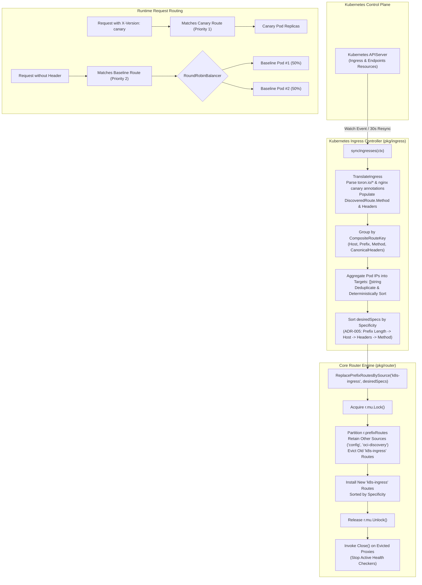

# REQ-096 - Composite Route Key Grouping, Multi-Pod Target Aggregation, and Specificity-Based Route Lifecycle in Kubernetes Ingress Controller

## 1. Context & Business Value

Toron Edge Gateway provides a native, zero-dependency Kubernetes Ingress Controller ([`pkg/ingress/controller.go`](file:///Users/sneha/Developer/toron-research/toron/pkg/ingress/controller.go)) designed to watch `networking.k8s.io/v1` `Ingress` and `Endpoints` resources from the Kubernetes API server, translate them into upstream reverse proxies ([`pkg/ingress/translator.go`](file:///Users/sneha/Developer/toron-research/toron/pkg/ingress/translator.go)), and dynamically register prefix routes within the core routing engine ([`pkg/router/router.go`](file:///Users/sneha/Developer/toron-research/toron/pkg/router/router.go)).

While [`REQ-094`](file:///Users/sneha/Developer/toron-research/toron/docs/requirements/REQ-094.md) introduced atomic route replacement (`ReplacePrefixRoutesBySource`) and basic pod aggregation, and [`REQ-095`](file:///Users/sneha/Developer/toron-research/toron/docs/requirements/REQ-095.md) / [`ADR-095`](file:///Users/sneha/Developer/toron-research/toron/docs/architecture/ADR-095.md) established the multi-dimensional `CompositeRouteKey` and specificity-based route lifecycle for the OCI Discovery Engine, the Kubernetes Ingress Controller remains limited by a naive 2-tuple grouping model: `routeKey{host, prefix}`.

### Problem Statement & Failure Modes

In [`pkg/ingress/controller.go:L143-L192`](file:///Users/sneha/Developer/toron-research/toron/pkg/ingress/controller.go#L143-L192):

```go
type routeKey struct {
    host   string
    prefix string
}

newRoutes := make(map[string]*discovery.DiscoveredRoute)
var keyOrder []routeKey
targetsByKey := make(map[routeKey][]string)
seenTarget := make(map[routeKey]map[string]bool)

for _, ing := range ingList {
    routes, ok := TranslateIngress(ing, c.cfg.IngressClass, endpointsMap)
    ...
    for _, r := range routes {
        ...
        k := routeKey{host: host, prefix: cleanPrefix}
        targetURL := r.TargetURL()
        ...
        targetsByKey[k] = append(targetsByKey[k], targetURL)
    }
}

specs := make([]router.PrefixRouteSpec, 0, len(keyOrder))
for _, k := range keyOrder {
    specs = append(specs, router.PrefixRouteSpec{
        TargetType: router.RouteTypeUpstream,
        Host:       k.host,
        Prefix:     k.prefix,
        Opts: proxy.ProxyOptions{
            Targets:   targetsByKey[k],
            Algorithm: proxy.AlgorithmRoundRobin,
        },
    })
}
```

This implementation exhibits five critical architectural flaws:

1. **Naive 2-Tuple Grouping (Dimension Blindness)**:
   `pkg/ingress/controller.go` aggregates pod endpoints using only `(Host, Prefix)`. It ignores HTTP method constraints and HTTP header matching rules, assuming that all Ingress rules for a given host and prefix belong to the same upstream service.
2. **Canary Target Pool Pollution & Traffic Bleed**:
   In modern Kubernetes environments, Canary and A/B deployments are implemented by creating a secondary Ingress rule sharing the same Host and Path Prefix as the baseline Ingress, but constrained by annotations such as `nginx.ingress.kubernetes.io/canary: "true"` and `nginx.ingress.kubernetes.io/canary-by-header: "X-Version"` (or Toron native annotations `toron.io/header.X-Version: "canary"`). Because `controller.go` groups strictly on `(Host, Prefix)`, the Canary pod IPs and Baseline pod IPs are **lumped into a single shared target pool**. As a consequence:
   - Baseline users without the header receive unvalidated Canary traffic ($\approx 33\text{--}50\%$ of requests).
   - Canary users with the header are not guaranteed to reach the Canary pods.
   - Traffic segmentation is completely defeated.
3. **Missing Ingress Annotation Parsing**:
   In [`pkg/ingress/translator.go`](file:///Users/sneha/Developer/toron-research/toron/pkg/ingress/translator.go), `TranslateIngress` ignores Ingress annotations for routing constraints. Neither Toron annotations (`toron.io/method`, `toron.io/header.<Name>`, `toron.io/headers`) nor industry-standard Ingress-NGINX Canary annotations (`nginx.ingress.kubernetes.io/canary-by-header`, `nginx.ingress.kubernetes.io/canary-by-header-value`) are parsed. Consequently, `DiscoveredRoute.Method` and `DiscoveredRoute.Headers` remain unpopulated.
4. **Route Shadowing & Discovery Order Dependency**:
   When constructing `specs`, `controller.go` iterates over `keyOrder`, which reflects the arbitrary order in which Ingress objects were returned by the Kubernetes API server. In [`pkg/router/router.go:L626-L644`](file:///Users/sneha/Developer/toron-research/toron/pkg/router/router.go#L626-L644), `ServeHTTP` performs linear scanning and stops at the *first matching route*. If the baseline Ingress appears in `specs` before the Canary Ingress, the baseline route matches all incoming requests, completely shadowing the Canary route. In accordance with [`ADR-005`](file:///Users/sneha/Developer/toron-research/toron/docs/architecture/ADR-005.md), routes must be sorted by specificity.
5. **Incomplete `PrefixRouteSpec` Population**:
   `controller.go` creates `PrefixRouteSpec` without populating `Method` or `Headers`. Even if `TranslateIngress` were to provide them, the router would receive empty headers and wildcard methods, failing to enforce traffic filtering.

### Security & Operational Impact

- **Canary Traffic Contamination**: Pre-release canary backend pods receive production baseline traffic, causing data corruption, unexpected application errors, and breach of release safety controls.
- **Canary Route Bypass (CWE-284)**: Header-based access control or canary rules are bypassed when shadowed by baseline routes due to non-deterministic Ingress discovery ordering.
- **Parity Gap**: Disconnect between the advanced `CompositeRouteKey` architecture in OCI Discovery (`pkg/discovery`) and the naive implementation in Kubernetes Ingress (`pkg/ingress`).

`REQ-096` closes this architectural gap, bringing complete **Composite Route Key grouping, multi-pod target aggregation, annotation-driven variant separation, and specificity-ordered route lifecycle** to Toron's Kubernetes Ingress Controller.

---

## 2. Non-Goals & Scope Exclusions

1. **OCI Container Discovery Lifecycle (`SEC-34`)**: OCI container discovery is governed by [`REQ-095`](file:///Users/sneha/Developer/toron-research/toron/docs/requirements/REQ-095.md). `REQ-096` strictly applies to the Kubernetes Ingress Controller (`pkg/ingress/`).
2. **Kubernetes Gateway API (`gateway.networking.k8s.io`)**: Ingress Controller support is focused on standard `networking.k8s.io/v1` `Ingress` and `Endpoints` resources; Gateway API CRDs remain outside this specification.
3. **External Client Libraries**: Strictly no third-party libraries (e.g. `k8s.io/client-go`). Pure Go standard library must be maintained.

---

## 3. Requirements & Acceptance Criteria

### REQ-096-AC-01: Ingress Annotation Parsing in `TranslateIngress`
- In [`pkg/ingress/translator.go`](file:///Users/sneha/Developer/toron-research/toron/pkg/ingress/translator.go), `TranslateIngress` MUST parse `ing.Metadata.Annotations` to extract HTTP method and header constraints:
  1. `toron.io/method`: HTTP method constraint (e.g. `"POST"`, `"GET"`), trimmed and converted to uppercase.
  2. `toron.io/header.<HeaderName>`: Individual header constraint where `<HeaderName>` is the HTTP header key and the annotation value is the expected header value (e.g. `toron.io/header.X-Version: canary` -> `Headers["X-Version"] = "canary"`).
  3. `toron.io/headers`: Grouped header constraints supporting:
     - Comma-delimited key=value format (e.g. `"X-Version=v2,X-Env=staging"`).
     - JSON object format (e.g. `{"X-Version":"v2","X-Env":"staging"}`).
  4. Industry-Standard NGINX Canary Annotations:
     - When `nginx.ingress.kubernetes.io/canary: "true"` is present:
       - `nginx.ingress.kubernetes.io/canary-by-header: "<HeaderName>"` defines the canary header key (e.g. `"X-Version"`).
       - `nginx.ingress.kubernetes.io/canary-by-header-value: "<HeaderValue>"` defines the expected value. If `canary-by-header-value` is omitted or empty, it MUST default to `"always"` in accordance with standard Ingress-NGINX specification.
- Parsing MUST handle leading/trailing whitespace robustly and merge individual `toron.io/header.<Name>` annotations additively over `toron.io/headers`.

### REQ-096-AC-02: Populate `DiscoveredRoute.Method` and `DiscoveredRoute.Headers`
- Every `DiscoveredRoute` emitted by `TranslateIngress` MUST have:
  - `Method`: Set to the parsed method constraint (or `""` if unconstrained).
  - `Headers`: Set to the parsed header constraints map (or `nil`/empty map if unconstrained).
- If no method or header annotations exist, `Method` MUST be `""` and `Headers` MUST be empty, ensuring 100% backward compatibility for standard Ingress definitions.

### REQ-096-AC-03: `CompositeRouteKey` Grouping with Deterministic Header Canonicalization
- In [`pkg/ingress/controller.go`](file:///Users/sneha/Developer/toron-research/toron/pkg/ingress/controller.go), translated routes MUST NOT be grouped solely by `(Host, Prefix)`.
- Discovered routes MUST be partitioned using a multi-dimensional `CompositeRouteKey`:
  $$\text{CompositeRouteKey} = (\text{Host}, \text{Prefix}, \text{Method}, \text{CanonicalHeaders})$$
  where:
  - `Host`: Normalized lowercase domain host (`strings.ToLower(strings.TrimSpace(r.Host))`).
  - `Prefix`: Normalized path prefix (`cleanPrefix`).
  - `Method`: Normalized uppercase HTTP method (or `""`).
  - `CanonicalHeaders`: Deterministically formatted string representation of `Headers` (keys sorted alphabetically, e.g. `"x-env=staging&x-version=v2"`), guaranteeing identical header sets produce identical keys regardless of Go map iteration order.

### REQ-096-AC-04: Multi-Pod Target Aggregation per Composite Key with `RoundRobinBalancer`
- For all active pod endpoints matching the same `CompositeRouteKey`:
  - Their destination target URLs (`r.TargetURL()`) MUST be aggregated into a single list of `Targets: []string{...}`.
  - Duplicate target URLs for the same pod IP/port MUST be deduplicated.
  - The aggregated target list MUST be deterministically sorted to prevent unnecessary route churn.
  - Exactly **one** reverse proxy route specification MUST be generated per unique `CompositeRouteKey`.

### REQ-096-AC-05: Complete `router.PrefixRouteSpec` Population
- In [`pkg/ingress/controller.go`](file:///Users/sneha/Developer/toron-research/toron/pkg/ingress/controller.go), when constructing `specs []router.PrefixRouteSpec`:
  - `spec.TargetType` = `router.RouteTypeUpstream`
  - `spec.Host` = `compositeKey.Host`
  - `spec.Prefix` = `compositeKey.Prefix`
  - `spec.Method` = `compositeKey.Method`
  - `spec.Headers` = extracted header map for that composite key
  - `spec.Opts.Targets` = aggregated pod target URLs
  - `spec.Opts.Algorithm` = `proxy.AlgorithmRoundRobin`

### REQ-096-AC-06: Strict Segregation of Canary and Baseline Ingress Variants
- Ingress resources serving the same `(Host, Prefix)` but differing in `Headers` (e.g. Canary Ingress vs Baseline Ingress) or `Method` MUST produce distinct `CompositeRouteKey`s and separate `PrefixRouteSpec`s.
- Pod IPs from a Canary Ingress MUST NEVER be merged into the Baseline Ingress target pool, and Baseline pod IPs MUST NEVER be merged into the Canary Ingress target pool.
- Incoming requests matching the canary header criteria MUST dispatch exclusively to Canary pod targets; incoming requests without the canary header MUST dispatch across Baseline pod targets.

### REQ-096-AC-07: ADR-005 Specificity Sorting on Ingress Route Specs
- In [`pkg/ingress/controller.go`](file:///Users/sneha/Developer/toron-research/toron/pkg/ingress/controller.go), before passing `specs` to `m.router.ReplacePrefixRoutesBySource("k8s-ingress", specs)`, the route specifications MUST be sorted in descending order of specificity in accordance with [`ADR-005`](file:///Users/sneha/Developer/toron-research/toron/docs/architecture/ADR-005.md):
  1. **Longest Prefix Length First**: Longer path prefixes take precedence over shorter prefixes (e.g. `/api/v1/auth` before `/api/v1` before `/api`).
  2. **Host Specificity**: Specific domain hosts (e.g. `api.example.com`) take precedence over wildcard or empty hosts (`""`).
  3. **Header Specificity**: Routes with HTTP headers take precedence over routes without headers (more header rules take precedence over fewer header rules).
  4. **Method Specificity**: Routes with explicit HTTP method constraints (e.g. `"POST"`) take precedence over wildcard / any-method (`""`).
- This specificity ordering guarantees that generic baseline Ingress routes NEVER shadow more specific Canary or method-constrained Ingress routes, regardless of Kubernetes API object discovery order.

### REQ-096-AC-08: Non-Destructive Partial Scale-Down and Clean Eviction Teardown
- Pod scaling events (e.g. terminating 1 of 3 pods for a service) MUST update the aggregated `Targets` slice to the surviving pods without dropping routes or dropping connections to healthy pods.
- When an Ingress resource is deleted from Kubernetes, `ReplacePrefixRoutesBySource("k8s-ingress", ...)` MUST purge its routes and cleanly invoke `pr.proxy.Close()`, stopping active health check tickers and releasing sockets without leaks.

### REQ-096-AC-09: Zero Third-Party Dependencies and Concurrency Safety
- All annotation parsers, composite key formatters, and route sorters MUST strictly use the Go standard library (`sync`, `net/http`, `net/url`, `sort`, `strings`, `encoding/json`, `path`). No third-party packages are allowed.
- All controller state mutations and synchronization routines MUST be 100% data-race-free under `go test -race ./pkg/ingress/... ./pkg/router/...`.

### REQ-096-AC-10: Automated Verification Test Coverage (`TC-096`)
- An automated test suite MUST be implemented verifying:
  1. `TestTranslateIngress_MethodAndHeaderAnnotations`: Validates parsing `toron.io/method`, `toron.io/header.<Name>`, `toron.io/headers` (CSV & JSON), and NGINX canary annotations.
  2. `TestIngressController_CompositeRouteKeyAggregation`: Validates grouping multiple pod endpoints sharing composite key into a single multi-target spec.
  3. `TestIngressController_CanaryBaselineStrictSegregation`: Validates canary and baseline Ingress rules produce separate route specs with isolated target pools.
  4. `TestIngressController_SpecificityOrdering_NoCanaryShadowing`: Validates that regardless of Ingress discovery order, canary route is placed ahead of baseline route in router table.
  5. `TestIngressController_PrefixRouteSpec_MethodFiltering`: Validates method-restricted Ingress routes populate `PrefixRouteSpec.Method` and restrict traffic to that method.
  6. `TestIngressController_PodScaleDown_ZeroDowntime`: Validates scaling down 1 pod out of 3 updates targets without 404 or connection drops.
  7. `TestIngressController_ConcurrentEventsAndRouting_RaceClean`: High-concurrency test simulating rapid endpoint and Ingress updates while handling parallel requests under `go test -race`.

---

## 4. Rationale & Threat Model

| Threat Scenario | Vulnerability / Root Cause | Prior Behavior (Vulnerable) | Remediated Behavior (REQ-096) |
| :--- | :--- | :--- | :--- |
| **Canary Traffic Contamination** | Routes grouped solely by `(Host, Prefix)`. Canary and baseline pods lumped together. | Baseline users randomly hit pre-release canary pods ($\approx 33\text{--}50\%$). Traffic segmentation broken. | Grouped by `CompositeRouteKey`. Canary pods and baseline pods are aggregated into separate reverse proxy target pools. |
| **Canary Route Shadowing (CWE-284)** | Routes inserted in arbitrary K8s API discovery order. Generic baseline route placed before canary route. | Requests with `X-Version: canary` match the baseline route first; canary traffic never reaches canary pods. | Routes sorted by ADR-005 specificity (longest prefix -> host -> headers -> method). Canary route always evaluated first. |
| **Method Restriction Bypass** | `PrefixRouteSpec.Method` left empty; `toron.io/method` annotation ignored. | Ingress intended only for `POST` matches `GET`, `PUT`, `DELETE`, bypassing application layer controls. | `PrefixRouteSpec.Method` populated and enforced by router; method mismatches return HTTP 405. |
| **Incompatible Annotation Ecosystem** | Only proprietary annotations supported or no annotations parsed. | Operators cannot use standard NGINX canary annotations (`canary-by-header`), hindering migration. | Full compatibility with both `toron.io/*` and `nginx.ingress.kubernetes.io/*` canary annotations. |
| **Socket & Goroutine Leaks on Ingress Deletion** | Evicted reverse proxies with active health checkers left running in memory. | Background health checker goroutines and idle sockets linger indefinitely, causing memory leaks and `EMFILE` exhaustion. | `ReplacePrefixRoutesBySource` invokes `pr.proxy.Close()` on all evicted proxies, halting health checks and freeing sockets. |

### Architectural Flowchart: Ingress Reconciliation & Multi-Variant Aggregation



---

## 5. Constraints & Non-Functional Requirements

- **Strict Traffic Segregation Invariant**: Under no circumstances shall Canary pod targets and Baseline pod targets be aggregated into the same load balancer pool.
- **Strict Specificity Ordering Invariant**: More specific routes (longest prefix, specific host, header-constrained, method-constrained) MUST ALWAYS precede less specific routes in route evaluation.
- **Zero Downtime Invariant**: Pod scaling events MUST NOT cause 404 or connection loss for traffic destined to surviving pod replicas.
- **Resource Cleanup Invariant**: Evicted reverse proxies MUST have `Close()` invoked immediately, preventing goroutine and socket leaks.
- **Zero Third-Party Dependencies**: Pure Go standard library implementation (`sync`, `net/http`, `net/url`, `sort`, `strings`, `encoding/json`, `path`).
- **Thread Safety**: 100% data-race-free under `go test -race ./pkg/ingress/... ./pkg/router/...`.

---

## 6. Open Questions

- *Open Question 1*: Should NGINX Canary weight-based routing (`nginx.ingress.kubernetes.io/canary-weight`) be included in this specification?
  - *Resolution*: Weight-based canary routing requires weighted random balancing across distinct upstream groups, whereas header-based canary routing (`canary-by-header`) maps cleanly to Toron's existing `CompositeRouteKey` and `ADR-005` specificity model. Header-based canary routing is included in REQ-096; weight-based canary routing is deferred to a future traffic splitting specification.
- *Open Question 2*: Should `toron.io/headers` support regex matching?
  - *Resolution*: In accordance with `ADR-005` and `pkg/router`'s existing `headersAndHostMatch`, exact string matching is enforced to maintain $O(1)$ header lookup performance and avoid ReDoS vulnerabilities.

---

## 7. Traceability Matrix

| Artifact | Identifier / Reference | Description |
| :--- | :--- | :--- |
| **Predecessor REQ** | [`REQ-094`](file:///Users/sneha/Developer/toron-research/toron/docs/requirements/REQ-094.md) | Bounded Route Table Lifecycle, Atomic Source Replacement, and Multi-Target Pod Aggregation in K8s Ingress |
| **Sister REQ (OCI Parity)** | [`REQ-095`](file:///Users/sneha/Developer/toron-research/toron/docs/requirements/REQ-095.md) | Composite Route Key Grouping, Multi-Replica Target Aggregation, and Specificity-Based Route Lifecycle in OCI Discovery |
| **Requirement (This Spec)** | [`REQ-096`](file:///Users/sneha/Developer/toron-research/toron/docs/requirements/REQ-096.md) | Composite Route Key Grouping, Multi-Pod Target Aggregation, and Specificity-Based Route Lifecycle in K8s Ingress |
| **Foundational Routing REQ** | [`REQ-001`](file:///Users/sneha/Developer/toron-research/toron/docs/requirements/REQ-001.md), [`REQ-004`](file:///Users/sneha/Developer/toron-research/toron/docs/requirements/REQ-004.md) | Core Routing Engine & Reverse Proxy Engine |
| **Header-Based Routing REQ** | [`REQ-010`](file:///Users/sneha/Developer/toron-research/toron/docs/requirements/REQ-010.md) | Header-Based HTTP Routing and Upstream Dispatching |
| **Architecture Decision (Prior)**| [`ADR-005`](file:///Users/sneha/Developer/toron-research/toron/docs/architecture/ADR-005.md), [`ADR-089`](file:///Users/sneha/Developer/toron-research/toron/docs/architecture/ADR-089.md), [`ADR-095`](file:///Users/sneha/Developer/toron-research/toron/docs/architecture/ADR-095.md) | Specificity Ordering, Atomic Source Replacement & Composite Route Key Architecture |
| **Architecture Decision (New)** | [`ADR-096`](file:///Users/sneha/Developer/toron-research/toron/docs/architecture/ADR-096.md) | Ingress Controller Composite Route Key Grouping & Annotation-Driven Variant Separation |
| **Test Case (New)** | [`TC-096`](file:///Users/sneha/Developer/toron-research/toron/docs/testCases/TC-096.md) | Automated Verification Suite for Ingress Composite Key Grouping, Annotation Parsing, and Canary Segregation |
| **Implementation Task** | [`TASK-119`](file:///Users/sneha/Developer/toron-research/toron/docs/tasks/TASK-119.md) | Implementation of Ingress Composite Route Key Grouping, Annotation Parsing, and Specificity Sorting |

---

## 8. User Approval Gate

> [!NOTE]
> This requirement specification has been **approved** by the user. Downstream decomposition into architecture decision records ([`ADR-096`](file:///Users/sneha/Developer/toron-research/toron/docs/architecture/ADR-096.md)), implementation tasks ([`TASK-119`](file:///Users/sneha/Developer/toron-research/toron/docs/tasks/TASK-119.md)), test cases ([`TC-096`](file:///Users/sneha/Developer/toron-research/toron/docs/testCases/TC-096.md)), and code changes is authorized to proceed.
