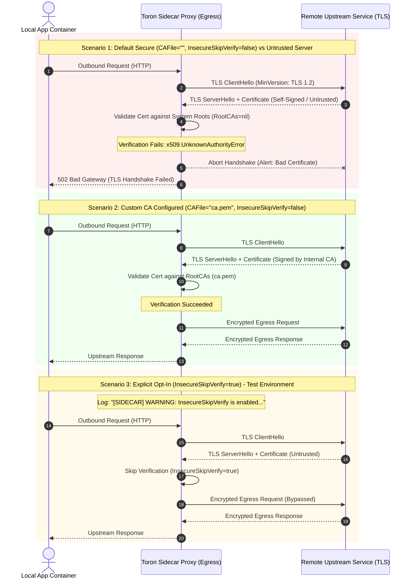

# REQ-097 - Secure Default Certificate Validation and Explicit InsecureSkipVerify Opt-In in Sidecar Client TLS Configuration

## 1. Context & Business Value

Toron Edge Gateway provides a Service Mesh Sidecar Proxy ([`pkg/sidecar/`](file:///Users/sneha/Developer/toron-research/toron/pkg/sidecar/)) designed to run alongside application microservices in containerized environments (Kubernetes pods, Nomad allocations, or Docker networks). The sidecar intercepts outbound egress traffic from the local application container and encapsulates it in mutual TLS (mTLS) or TLS tunnels to upstream destination microservices.

During comprehensive security audit [`SR-091 Finding 5`](file:///Users/sneha/Developer/toron-research/toron/docs/securityReview/SR-091.md#L173-L195) and vulnerability tracking [`SEC-35`](file:///Users/sneha/Developer/toron-research/toron/SECURITY_AUDIT.md#L474-L482) ([CWE-295 Improper Certificate Validation](https://cwe.mitre.org/data/definitions/295.html)), a critical vulnerability was uncovered in the sidecar client-side TLS configuration constructor ([`pkg/sidecar/mtls.go:L46-L74`](file:///Users/sneha/Developer/toron-research/toron/pkg/sidecar/mtls.go#L46-L74)).

### Problem Statement & Root Cause

In [`pkg/sidecar/mtls.go:L60-L72`](file:///Users/sneha/Developer/toron-research/toron/pkg/sidecar/mtls.go#L60-L72), `BuildClientTLSConfig` constructs the `*tls.Config` used by the sidecar proxy engine for outbound egress connections:

```go
func BuildClientTLSConfig(cfg config.SidecarConfig) (*tls.Config, error) {
    tlsConfig := &tls.Config{
        MinVersion: tls.VersionTLS12,
    }
    ...
    if cfg.CAFile != "" {
        caBytes, err := os.ReadFile(cfg.CAFile)
        if err != nil {
            return nil, fmt.Errorf("failed to read sidecar ca cert: %w", err)
        }
        caPool := x509.NewCertPool()
        caPool.AppendCertsFromPEM(caBytes)
        tlsConfig.RootCAs = caPool
    } else {
        // Default to insecure verify if custom CA is omitted in test environments
        tlsConfig.InsecureSkipVerify = true
    }

    return tlsConfig, nil
}
```

When `cfg.CAFile` is empty (the standard deployment pattern when relying on the host operating system's public CA trust store, standard cloud provider certificates, or public certificate authorities), the function automatically executes the `else` branch, setting:
```go
tlsConfig.InsecureSkipVerify = true
```

### Exploitability & Security Impact (CVSS:3.1 Score 8.1 - High)

- **Man-in-the-Middle (MITM) Interception (CWE-295)**: Setting `InsecureSkipVerify = true` disables all certificate verification on the client TLS connection. The client accepts any certificate presented by any endpoint, regardless of hostname mismatches, expiration, untrusted root issuers, or self-signed certificates.
- **Pod-to-Pod Egress Vulnerability**: In shared Kubernetes clusters or container networks, an attacker on the same node, adjacent container, or compromised network gateway can easily poison DNS or ARP, spoof upstream endpoints, and present an arbitrary self-signed certificate. The Toron sidecar will connect to the attacker without warning, exposing plaintext HTTP payloads, Bearer tokens, API credentials, and sensitive tenant data.
- **Violation of Secure-by-Default Principle**: Security best practices mandate that secure cryptographic verification must be enabled by default. Bypassing verification must require an explicit, intentional opt-in by the operator, coupled with audit logging.

Remediating `SEC-35` through `REQ-097` enforces **strict certificate validation by default**, automatic fallback to host system certificate trust roots when no custom CA is specified, and an explicit `insecure_skip_verify: true` configuration flag with high-visibility audit warnings for specialized testing environments.

---

## 2. Non-Goals & Scope Exclusions

1. **Server-Side mTLS Verification**: Server-side client certificate verification is governed by `BuildServerTLSConfig` and `cfg.StrictmTLS`. While related to mTLS, `REQ-097` specifically addresses client-side egress validation.
2. **ACME Automated Certificate Enrollment**: Automated certificate issuance via Let's Encrypt / RFC 8555 is governed by `pkg/acme` and is outside the scope of sidecar client TLS configuration.
3. **Custom X.509 Certificate Revocation Lists (CRL) / OCSP Stapling**: Integration of real-time OCSP responder querying for outbound sidecar connections is excluded; standard Go `crypto/tls` trust store validation semantics apply.

---

## 3. Requirements & Acceptance Criteria

### REQ-097-AC-01: Configuration Schema Extension (`insecure_skip_verify`)
- The `SidecarConfig` struct in [`pkg/config/config.go`](file:///Users/sneha/Developer/toron-research/toron/pkg/config/config.go) MUST be extended with an explicit opt-in boolean field:
  ```go
  InsecureSkipVerify bool `yaml:"insecure_skip_verify" json:"insecure_skip_verify"`
  ```
- In `defaultConfig()` in [`pkg/config/config.go`](file:///Users/sneha/Developer/toron-research/toron/pkg/config/config.go), `SidecarConfig.InsecureSkipVerify` MUST default to `false`.
- Standard Go zero-value initialization of `SidecarConfig{}` MUST result in `InsecureSkipVerify == false`.

### REQ-097-AC-02: Enforce Strict TLS Validation by Default
- In `BuildClientTLSConfig` ([`pkg/sidecar/mtls.go`](file:///Users/sneha/Developer/toron-research/toron/pkg/sidecar/mtls.go)), `tlsConfig.InsecureSkipVerify` MUST be assigned the value of `cfg.InsecureSkipVerify`:
  ```go
  tlsConfig.InsecureSkipVerify = cfg.InsecureSkipVerify
  ```
- Hardcoding `tlsConfig.InsecureSkipVerify = true` under any branch or conditional path is strictly prohibited.
- When `cfg.InsecureSkipVerify` is `false` (or omitted from configuration), `tlsConfig.InsecureSkipVerify` MUST evaluate to `false`.

### REQ-097-AC-03: System Trust Root Certificate Store Fallback
- When `cfg.CAFile == ""` and `cfg.InsecureSkipVerify == false`:
  - `tlsConfig.RootCAs` MUST remain `nil`.
  - Go's standard library `crypto/tls` runtime MUST validate the peer's certificate chain against the host operating system's standard certificate trust store (e.g., `/etc/ssl/certs`, macOS keychain, or Windows trust store).
  - Outbound egress connections to endpoints presenting valid certificates signed by public or system trust roots MUST succeed without error.
  - Outbound egress connections to endpoints presenting untrusted, expired, or self-signed certificates MUST fail with `x509.UnknownAuthorityError` or equivalent TLS handshake failure.

### REQ-097-AC-04: Custom Certificate Authority (CA) Pool Support
- When `cfg.CAFile != ""`:
  - `BuildClientTLSConfig` MUST read the file specified by `cfg.CAFile`. If reading fails, it MUST return a descriptive error.
  - The PEM-encoded certificates MUST be appended to an `x509.CertPool` and assigned to `tlsConfig.RootCAs`.
  - `tlsConfig.InsecureSkipVerify` MUST still evaluate to `cfg.InsecureSkipVerify` (defaulting to `false`).
  - Outbound connections MUST validate against the custom CA pool, successfully establishing TLS with upstream services signed by the custom CA, and rejecting services signed by other CAs.

### REQ-097-AC-05: High-Visibility Security Audit Logging on Insecure Opt-In
- When `cfg.InsecureSkipVerify == true`:
  - `BuildClientTLSConfig` MUST emit a high-visibility security audit warning to the standard logger:
    ```
    [SIDECAR] WARNING: InsecureSkipVerify is enabled for sidecar egress TLS. Certificate verification is disabled.
    ```
  - This alert MUST clearly inform operators during gateway startup and container initialization that TLS security controls are degraded.

### REQ-097-AC-06: Client Identity Certificate Pair Preservation
- When `cfg.CertFile != ""` and `cfg.KeyFile != ""`:
  - `BuildClientTLSConfig` MUST load the client certificate and private key using `tls.LoadX509KeyPair(cfg.CertFile, cfg.KeyFile)`.
  - The loaded certificate MUST be assigned to `tlsConfig.Certificates`.
  - Outbound mTLS connections MUST present this client certificate to upstream servers requesting client authentication, irrespective of the `InsecureSkipVerify` setting.

### REQ-097-AC-07: Minimum TLS Protocol Version Enforcement
- All client-side TLS configurations constructed by `BuildClientTLSConfig` MUST continue to enforce `tlsConfig.MinVersion = tls.VersionTLS12`, preventing protocol downgrade attacks to SSLv3, TLS 1.0, or TLS 1.1.

### REQ-097-AC-08: Zero Third-Party Dependencies & Concurrency Safety
- All modifications MUST use the Go standard library exclusively (`crypto/tls`, `crypto/x509`, `log`, `fmt`, `os`). No external dependencies are permitted.
- `BuildClientTLSConfig` and the resulting `*tls.Config` MUST be completely safe for concurrent access and reuse across goroutines under `go test -race ./pkg/sidecar/... ./pkg/config/...`.

### REQ-097-AC-09: Automated Verification Test Coverage (`TC-097`)
- An automated test suite MUST be implemented in `pkg/sidecar/sidecar_test.go` verifying:
  1. `TestBuildClientTLSConfig_DefaultSecure`: Verifies that a default `SidecarConfig{}` produces `InsecureSkipVerify == false` and `RootCAs == nil`.
  2. `TestBuildClientTLSConfig_CustomCA`: Verifies that providing a valid `CAFile` populates `RootCAs` with `InsecureSkipVerify == false`.
  3. `TestBuildClientTLSConfig_ExplicitInsecureOptIn`: Verifies that setting `InsecureSkipVerify: true` sets `tlsConfig.InsecureSkipVerify == true` and logs the expected warning.
  4. `TestSidecar_EgressTLS_HandshakeRejection`: End-to-end TLS test verifying that an egress connection to an untrusted self-signed upstream server fails handshake when `InsecureSkipVerify: false`.
  5. `TestSidecar_EgressTLS_HandshakeSuccess_WithCustomCA`: End-to-end TLS test verifying that an egress connection to a self-signed upstream succeeds when configured with the matching custom CA.
  6. `TestSidecar_EgressTLS_HandshakeSuccess_WithExplicitOptIn`: End-to-end TLS test verifying that an egress connection to an untrusted upstream succeeds when `InsecureSkipVerify: true` is explicitly configured.

---

## 4. Rationale & Threat Model

| Threat Scenario | Vulnerability / Root Cause | Prior Behavior (Vulnerable) | Remediated Behavior (REQ-097) |
| :--- | :--- | :--- | :--- |
| **Egress MITM Attack (CWE-295)** | `BuildClientTLSConfig` set `InsecureSkipVerify = true` whenever `CAFile == ""`. | Sidecar accepted any server certificate without validation; attacker could intercept, read, and tamper with egress traffic. | `InsecureSkipVerify` defaults to `false`. Server certificate chain is strictly verified against system trust roots. |
| **Credential & Token Theft** | Plaintext interception of Authorization headers on egress mesh connections. | Attacker spoofing upstream service acquired API keys and tokens transparently. | Attacker's invalid certificate triggers TLS handshake failure (`x509.UnknownAuthorityError`); connection is immediately aborted. |
| **Accidental Production Insecurity** | Missing custom CA configuration silently compromised entire transport security. | Deployments using standard public or cloud CAs operated completely unprotected without operator awareness. | Standard CAs are validated via system trust roots (`RootCAs = nil`); secure by default with zero silent degradation. |
| **Intentional Test Environment Bypass** | No mechanism existed to differentiate intentional test bypass from production misconfiguration. | Insecure verification was forced upon all deployments that omitted `CAFile`. | Operators must explicitly configure `insecure_skip_verify: true`, generating a clear audit log warning. |

### Architectural Sequence Diagram: Egress TLS Verification & Handshake Resolution



---

## 5. Constraints & Non-Functional Requirements

- **Secure-by-Default Invariant**: `InsecureSkipVerify` MUST evaluate to `false` in all standard configurations and zero-value struct initializations.
- **Fail-Closed Security Invariant**: When certificate verification fails, the sidecar MUST terminate the TLS handshake immediately and return HTTP 502 Bad Gateway to the local application, never falling back to insecure transport.
- **Auditability**: Any runtime activation of `InsecureSkipVerify: true` MUST emit a standard log warning to ensure detection by security information and event management (SIEM) systems.
- **Zero Third-Party Dependencies**: All cryptographic operations and TLS configurations must strictly use Go standard library packages (`crypto/tls`, `crypto/x509`).
- **Thread Safety**: The `*tls.Config` generated by `BuildClientTLSConfig` MUST be safe for concurrent use across high-concurrency request dispatching without race conditions under `go test -race`.

---

## 6. Open Questions

- *Open Question 1*: Should setting `insecure_skip_verify: true` be completely prohibited in production mode?
  - *Resolution*: Permitting explicit opt-in with a prominent audit warning is necessary for local integration testing, ephemeral CI/CD environments, and development with self-signed test certificates. Standard configuration files and documentation will explicitly mandate `insecure_skip_verify: false` for production.
- *Open Question 2*: Does altering `InsecureSkipVerify` affect server-side mutual TLS (`BuildServerTLSConfig`)?
  - *Resolution*: No. `BuildServerTLSConfig` governs inbound server authentication (`ClientAuth: RequireAndVerifyClientCert`). `InsecureSkipVerify` applies exclusively to client egress TLS connections in `BuildClientTLSConfig`.

---

## 7. Traceability Matrix

| Artifact | Identifier / Reference | Description |
| :--- | :--- | :--- |
| **Security Finding** | [`SEC-35`](file:///Users/sneha/Developer/toron-research/toron/SECURITY_AUDIT.md#L474-L482) | Insecure Default `InsecureSkipVerify` in Sidecar Client TLS Configuration |
| **Security Review** | [`SR-091`](file:///Users/sneha/Developer/toron-research/toron/docs/securityReview/SR-091.md#L173-L195) | Finding 5 (SEC-35): Default InsecureSkipVerify in sidecar mTLS client config |
| **Foundational Security REQ** | [`REQ-008`](file:///Users/sneha/Developer/toron-research/toron/docs/requirements/REQ-008.md) | TLS Termination and Cryptographic Protocol Standards |
| **Prior Sidecar REQ** | [`REQ-081`](file:///Users/sneha/Developer/toron-research/toron/docs/requirements/REQ-081.md) | Request Body Preservation in Sidecar Proxy Engine |
| **Requirement (This Spec)** | [`REQ-097`](file:///Users/sneha/Developer/toron-research/toron/docs/requirements/REQ-097.md) | Secure Default Certificate Validation and Explicit InsecureSkipVerify Opt-In |
| **Architecture Decision (New)** | [`ADR-097`](file:///Users/sneha/Developer/toron-research/toron/docs/architecture/ADR-097.md) | Secure Default Sidecar Egress TLS Configuration & Opt-In InsecureSkipVerify |
| **Test Case (New)** | [`TC-097`](file:///Users/sneha/Developer/toron-research/toron/docs/testCases/TC-097.md) | Automated Verification Suite for Sidecar Client TLS Validation & Insecure Opt-In |
| **Implementation Task** | [`TASK-120`](file:///Users/sneha/Developer/toron-research/toron/docs/tasks/TASK-120.md) | Implementation of Secure Default Client TLS Config and Configuration Schema Extension |

---

## 8. User Approval Gate

> [!NOTE]
> This requirement specification has been **approved** by the user. Downstream decomposition into architecture decision records ([`ADR-097`](file:///Users/sneha/Developer/toron-research/toron/docs/architecture/ADR-097.md)), implementation tasks ([`TASK-120`](file:///Users/sneha/Developer/toron-research/toron/docs/tasks/TASK-120.md)), test cases ([`TC-097`](file:///Users/sneha/Developer/toron-research/toron/docs/testCases/TC-097.md)), and code changes is authorized to proceed.
