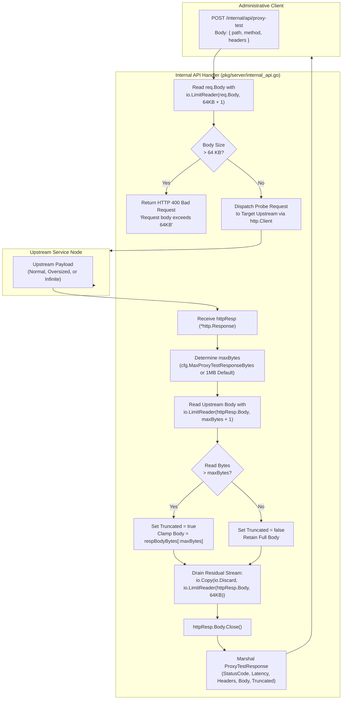

# REQ-098 - Bounded Request Ingestion and Upstream Response Buffering in Internal API Proxy Test Probe

## 1. Context & Business Value

Toron Edge Gateway provides an administrative management REST API under the `/internal/api/` path prefix ([`pkg/server/internal_api.go`](file:///Users/sneha/Developer/toron-research/toron/pkg/server/internal_api.go)) allowing operators and diagnostic tools to inspect cluster status, health check upstreams, list routes, view WAF telemetry, and dynamically test configured upstream routes via `POST /internal/api/proxy-test`.

During comprehensive security audit [`SR-091 Finding 6`](file:///Users/sneha/Developer/toron-research/toron/docs/securityReview/SR-091.md#L197-L212) and vulnerability assessment [`SEC-36`](file:///Users/sneha/Developer/toron-research/toron/SECURITY_AUDIT.md#L483-L491) ([CWE-400 Uncontrolled Resource Consumption](https://cwe.mitre.org/data/definitions/400.html), [CWE-770 Allocation of Resources Without Limits or Throttling](https://cwe.mitre.org/data/definitions/770.html), [CWE-775 Missing Release of File Descriptor or Handle after Effective Lifetime](https://cwe.mitre.org/data/definitions/775.html)), two severe unbounded memory buffering flaws and a socket leak vulnerability were identified in `POST /internal/api/proxy-test`.

### Problem Statement & Failure Modes

In [`pkg/server/internal_api.go:L516-L669`](file:///Users/sneha/Developer/toron-research/toron/pkg/server/internal_api.go#L516-L669), `POST /internal/api/proxy-test` handles incoming test probes and executes an upstream HTTP request against the tested route:

1. **Unbounded Inbound Request Ingestion (CWE-400)**:
   At line 520:
   ```go
   bodyBytes, err := io.ReadAll(req.Body)
   ```
   The handler ingests the caller's incoming request body into heap memory using `io.ReadAll(req.Body)` without any length limitation. An authenticated or authorized client (or compromised internal system) transmitting an arbitrarily large payload (e.g. 500 MB of JSON data) forces the gateway to allocate unbounded byte slices on the heap, inducing memory bloat, high GC latency, and potential Out-Of-Memory (OOM) termination.
2. **Unbounded Upstream Response Buffering (CWE-400 / CWE-770)**:
   At line 651:
   ```go
   respBodyBytes, _ := io.ReadAll(httpResp.Body)
   ```
   The handler forwards the probe request to the local server or upstream target and buffers the entire response body using `io.ReadAll(httpResp.Body)` without any bounded reader or limit. If a probed endpoint returns an unbounded stream (such as `/dev/urandom`, an infinite SSE/event-stream, or a multi-gigabyte ISO/database dump), `io.ReadAll` continuously expands an internal buffer in memory until heap memory is exhausted and the operating system's OOM killer terminates the entire Toron edge gateway process.
3. **Socket Descriptor Exhaustion & Connection Hangs (CWE-775)**:
   When capping an oversized response, if the response stream is simply truncated without proper draining or closing, residual unread bytes remain pending on the TCP socket. If `httpResp.Body` is not properly drained and closed, the underlying HTTP/1.1 transport connection cannot be reused in the client keep-alive connection pool, leading to lingering open sockets, socket descriptor exhaustion (`EMFILE`), and transport connection leaks.

### Security Impact (CVSS:3.1 Score 6.5 - Medium)

- **Denial of Service (DoS) via Heap Exhaustion**: Probing an upstream route that streams high-volume or unbounded content causes rapid, monotonic heap allocation, crashing the gateway and severing ingress traffic for all production tenants.
- **Cascading Failure**: A slow or misconfigured upstream microservice returning an unexpectedly large payload can take down the edge gateway proxying all other healthy services.
- **Resource Leakage**: Unread connection streams left in limbo leak socket descriptors and goroutines.

Remediating `SEC-36` through `REQ-098` establishes **strictly bounded request body ingestion, configurable upstream response clamping with truncation signaling, and clean transport connection draining**.

---

## 2. Non-Goals & Scope Exclusions

1. **General Reverse Proxy Response Streaming (`pkg/proxy`)**: Normal client proxy traffic routed through Toron's core reverse proxy engine ([`pkg/proxy/proxy.go`](file:///Users/sneha/Developer/toron-research/toron/pkg/proxy/proxy.go)) already streams responses incrementally between upstream and downstream sockets without in-memory buffering. `REQ-098` applies exclusively to the administrative diagnostic test endpoint `POST /internal/api/proxy-test`.
2. **Binary Payload Decoding**: The proxy test endpoint returns response bodies as string payloads in JSON. Parsing or transforming binary formats (e.g., gzip decompression or protobuf transcoding) inside the test response is excluded; raw byte truncation is applied.

---

## 3. Requirements & Acceptance Criteria

### REQ-098-AC-01: Configurable Upstream Response Body Limit
- The `InternalAPIConfig` struct in [`pkg/server/internal_api.go`](file:///Users/sneha/Developer/toron-research/toron/pkg/server/internal_api.go) MUST be extended with:
  ```go
  MaxProxyTestResponseBytes int64 `json:"max_proxy_test_response_bytes,omitempty"`
  ```
- **Default Value**: If `MaxProxyTestResponseBytes` is omitted, `0`, or negative in configuration, the handler MUST default to **1 MB** (`1048576` bytes = `1 * 1024 * 1024`).
- When explicitly configured to a positive value (e.g. `2 * 1024 * 1024` for 2 MB or `256 * 1024` for 256 KB), the handler MUST strictly enforce that configured limit.

### REQ-098-AC-02: Bounded Upstream Response Ingestion & Truncation
- In `POST /internal/api/proxy-test`, upstream response ingestion MUST use a bounded reader:
  ```go
  limitedReader := io.LimitReader(httpResp.Body, maxBytes+1)
  respBodyBytes, _ := io.ReadAll(limitedReader)
  ```
- If the number of bytes read exceeds `maxBytes` (i.e. `int64(len(respBodyBytes)) > maxBytes`):
  - The captured body slice MUST be truncated to exactly `maxBytes`: `respBodyBytes = respBodyBytes[:maxBytes]`.
  - The response payload MUST indicate truncation by setting `Truncated: true`.
- If the response size is less than or equal to `maxBytes`:
  - The complete response body MUST be captured without modification.
  - `Truncated` MUST evaluate to `false`.

### REQ-098-AC-03: Truncation Flag in Output Schema
- The `ProxyTestResponse` struct in [`pkg/server/internal_api.go`](file:///Users/sneha/Developer/toron-research/toron/pkg/server/internal_api.go) MUST be extended with:
  ```go
  Truncated bool `json:"truncated,omitempty"`
  ```
- When serialized to JSON:
  - An oversized response that was truncated MUST include `"truncated": true`.
  - Normal responses within the limit MUST omit the field or set `"truncated": false`.

### REQ-098-AC-04: Bounded Inbound Request Body Ingestion
- In `POST /internal/api/proxy-test`, the incoming client request body `req.Body` MUST be read using a bounded reader limited to **64 KB** (`64 * 1024 = 65536` bytes):
  ```go
  bodyBytes, err := io.ReadAll(io.LimitReader(req.Body, 64*1024+1))
  ```
- If `int64(len(bodyBytes)) > 64*1024`:
  - The handler MUST immediately reject the request without executing any upstream probe.
  - The handler MUST respond with HTTP `400 Bad Request`:
    ```json
    {"error":"400 Bad Request","message":"Request body exceeds maximum allowed size of 64KB"}
    ```
- If the request body is empty or contains invalid JSON syntax, the handler MUST respond with HTTP `400 Bad Request`.

### REQ-098-AC-05: Clean Connection Draining & Socket Teardown
- After reading the response up to `maxBytes + 1`:
  - Any remaining unread bytes in `httpResp.Body` MUST be drained safely with a bounded limit:
    ```go
    _, _ = io.Copy(io.Discard, io.LimitReader(httpResp.Body, 64*1024))
    ```
  - `httpResp.Body.Close()` MUST be explicitly invoked.
- This ensures that HTTP/1.1 keep-alive connections can be cleanly recycled by Go's `http.Transport` without leaking file descriptors (`EMFILE`) or hanging background socket readers on infinite streams.

### REQ-098-AC-06: Zero Third-Party Dependencies
- All bounds checking, reader limiting, buffer truncations, and JSON serialization MUST strictly use the Go standard library (`io`, `net/http`, `encoding/json`, `fmt`, `time`, `strings`). No external dependencies are permitted.

### REQ-098-AC-07: Concurrency Safety & Thread Safety
- The bounded proxy-test handler MUST be 100% thread-safe and free of data races under concurrent executions of `POST /internal/api/proxy-test` from multiple administrative clients.
- Verified under `go test -race ./pkg/server/...`.

### REQ-098-AC-08: Automated Verification Test Coverage (`TC-098`)
- An automated test suite MUST be implemented in `pkg/server/internal_api_test.go` verifying:
  1. `TestProxyTest_NormalResponse_UnderLimit`: Validates that a standard upstream response (e.g. 512 bytes) is read completely with `truncated == false`.
  2. `TestProxyTest_OversizedResponse_Truncated`: Validates that an upstream response exceeding the limit (e.g. 2 MB against a 1 MB limit) is clamped to 1 MB and returns `truncated == true` without crashing.
  3. `TestProxyTest_InfiniteStream_BoundedTermination`: Validates that probing an infinite streaming upstream (e.g. continuous `/dev/urandom` or chunked generator) terminates promptly after reading 1 MB, releases the socket, and returns `truncated == true` with bounded heap memory.
  4. `TestProxyTest_CustomConfiguredLimit`: Validates that setting `MaxProxyTestResponseBytes: 256 * 1024` clamps responses at 256 KB.
  5. `TestProxyTest_OversizedRequestBody_Rejection`: Validates that sending an inbound request body larger than 64 KB is rejected with HTTP `400 Bad Request`.
  6. `TestProxyTest_ConcurrentProbes_RaceClean`: High-concurrency test running multiple simultaneous oversized and infinite probe tests under `go test -race`.

---

## 4. Rationale & Threat Model

| Threat Scenario | Vulnerability / Root Cause | Prior Behavior (Vulnerable) | Remediated Behavior (REQ-098) |
| :--- | :--- | :--- | :--- |
| **Upstream OOM Exhaustion (CWE-400 / CWE-770)** | `io.ReadAll(httpResp.Body)` with zero bound. Upstream returns multi-gigabyte or infinite stream. | Process heap memory expands continuously until OOM killer aborts edge gateway, terminating all traffic. | Ingestion strictly bounded by `io.LimitReader` (default 1 MB). Response clamped safely; `truncated: true` reported. |
| **Inbound Request Memory Exhaustion (CWE-400)** | `io.ReadAll(req.Body)` with zero bound on client JSON payload. | Attacker or misconfigured client sends massive JSON payload, allocating large heap buffers. | Inbound request ingestion capped at 64 KB. Excess bytes trigger immediate HTTP 400 rejection. |
| **Socket Descriptor Leakage (CWE-775)** | Abandoned socket connections with unread bytes on truncated streams. | Socket descriptors remain open or transport hangs, leaking file descriptors (`EMFILE`) and connection pools. | Residual bytes bounded and drained up to 64 KB; `httpResp.Body.Close()` called cleanly to enable keep-alive reuse. |
| **Silent Data Incomplete Interpretation** | Operator unaware that diagnostic response body is incomplete. | Operator assumes truncated body is the full response, misdiagnosing upstream service behavior. | `Truncated: true` explicitly returned in output JSON schema whenever capping occurs. |

### Architectural Flowchart: Bounded Upstream Response Ingestion & Safe Draining



---

## 5. Constraints & Non-Functional Requirements

- **Memory Bound Invariant**: Ingesting an infinite or multi-gigabyte upstream stream MUST NOT allocate more than $O(\text{maxBytes})$ heap memory (default $\le 1\text{ MB} + \epsilon$).
- **Bounded Ingress Invariant**: Ingestion of inbound client requests for proxy tests MUST NOT exceed 64 KB.
- **Fail-Safe Socket Cleanup Invariant**: Upstream response bodies MUST be cleanly drained and closed upon reading, preventing socket leaks (`EMFILE`).
- **Zero Third-Party Dependencies**: Pure Go standard library implementation only (`io`, `net/http`, `encoding/json`, `fmt`, `time`, `strings`).
- **Thread Safety**: 100% data-race-free under `go test -race ./pkg/server/...`.

---

## 6. Open Questions

- *Open Question 1*: Should truncated responses return an HTTP error status (e.g. 502) or the actual upstream status code with `truncated: true`?
  - *Resolution*: The proxy test probe's purpose is diagnostic visibility. It must faithfully report the upstream server's actual HTTP status code (e.g. 200 OK) while setting `truncated: true` and clamping the body string, allowing operators to verify status codes without crashing the gateway.
- *Open Question 2*: What should happen if an operator configures `max_proxy_test_response_bytes` to an extremely large value (e.g. 100 MB)?
  - *Resolution*: `InternalAPIConfig` can apply a sensible upper sanity ceiling (e.g., maximum allowable limit of 10 MB) if configured beyond safe thresholds, preventing accidental operator self-DoS.

---

## 7. Traceability Matrix

| Artifact | Identifier / Reference | Description |
| :--- | :--- | :--- |
| **Security Finding** | [`SEC-36`](file:///Users/sneha/Developer/toron-research/toron/SECURITY_AUDIT.md#L483-L491) | Memory Exhaustion via Unbounded Upstream Response Buffering in Internal API Proxy Test Probe |
| **Security Review** | [`SR-091`](file:///Users/sneha/Developer/toron-research/toron/docs/securityReview/SR-091.md#L197-L212) | Finding 6 (SEC-36): Unbounded Response Buffering in internal API proxy-test |
| **Foundational Routing REQ** | [`REQ-001`](file:///Users/sneha/Developer/toron-research/toron/docs/requirements/REQ-001.md), [`REQ-008`](file:///Users/sneha/Developer/toron-research/toron/docs/requirements/REQ-008.md) | Core Routing Engine & Security Controls |
| **Prior Management API REQ** | [`REQ-047`](file:///Users/sneha/Developer/toron-research/toron/docs/requirements/REQ-047.md) | Administrative Route Management & Diagnostic Probes |
| **Requirement (This Spec)** | [`REQ-098`](file:///Users/sneha/Developer/toron-research/toron/docs/requirements/REQ-098.md) | Bounded Request Ingestion and Upstream Response Buffering in Internal API Proxy Test Probe |
| **Architecture Decision (New)** | [`ADR-098`](file:///Users/sneha/Developer/toron-research/toron/docs/architecture/ADR-098.md) | Bounded Upstream Response Buffering and Ingress Limiting in Proxy Test API |
| **Test Case (New)** | [`TC-098`](file:///Users/sneha/Developer/toron-research/toron/docs/testCases/TC-098.md) | Automated Verification Suite for Bounded Proxy Test Response and Ingress Limiting |
| **Implementation Task** | [`TASK-121`](file:///Users/sneha/Developer/toron-research/toron/docs/tasks/TASK-121.md) | Implementation of Bounded Readers, Response Truncation, and Draining in Internal API |

---

## 8. User Approval Gate

> [!IMPORTANT]
> In accordance with project engineering standards, this requirement specification is submitted with `status: draft`. Downstream decomposition into architecture decision records ([`ADR-098`](file:///Users/sneha/Developer/toron-research/toron/docs/architecture/ADR-098.md)), implementation tasks ([`TASK-121`](file:///Users/sneha/Developer/toron-research/toron/docs/tasks/TASK-121.md)), test cases ([`TC-098`](file:///Users/sneha/Developer/toron-research/toron/docs/testCases/TC-098.md)), and code changes requires explicit user review and sign-off.
