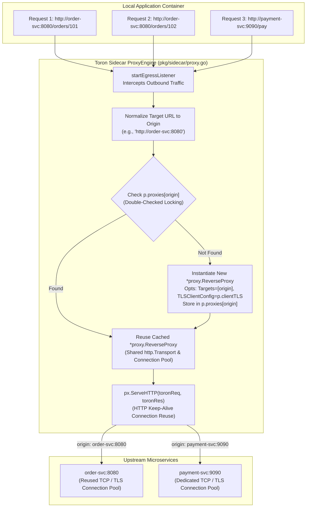

# REQ-099 - Thread-Safe ReverseProxy Caching, Transport Teardown, and Client mTLS Lifecycle Management in Service Mesh Sidecar Proxy

## 1. Context & Business Value

Toron Edge Gateway provides a Service Mesh Sidecar Proxy ([`pkg/sidecar/`](file:///Users/sneha/Developer/toron-research/toron/pkg/sidecar/)) designed to execute alongside microservices in containerized environments (Kubernetes pods, Nomad allocations, or Docker networks). The sidecar intercepts outbound egress HTTP traffic from the local application container and encapsulates it in mutual TLS (mTLS) or TLS tunnels to upstream destination microservices.

During comprehensive security audit [`SR-091 Finding 7`](file:///Users/sneha/Developer/toron-research/toron/docs/securityReview/SR-091.md) and vulnerability tracking [`SEC-37`](file:///Users/sneha/Developer/toron-research/toron/SECURITY_AUDIT.md#L492-L500) ([CWE-400 Uncontrolled Resource Consumption](https://cwe.mitre.org/data/definitions/400.html), [CWE-772 Missing Release of Resource after Effective Lifetime](https://cwe.mitre.org/data/definitions/772.html)), a critical performance and stability flaw was identified in the sidecar egress proxy forwarding engine ([`pkg/sidecar/proxy.go:L192-L202`](file:///Users/sneha/Developer/toron-research/toron/pkg/sidecar/proxy.go#L192-L202)).

### Problem Statement & Failure Modes

In [`pkg/sidecar/proxy.go`](file:///Users/sneha/Developer/toron-research/toron/pkg/sidecar/proxy.go), every incoming HTTP request intercepted by the egress proxy listener triggers `proxyToURL`:

```go
func (p *ProxyEngine) proxyToURL(w http.ResponseWriter, r *http.Request, targetURL string) {
    opts := proxy.ProxyOptions{
        Targets: []string{targetURL},
    }

    px, err := proxy.NewProxyWithOptions(opts)
    if err != nil {
        http.Error(w, fmt.Sprintf("Sidecar proxy error: %v", err), http.StatusBadGateway)
        return
    }
    ...
    px.ServeHTTP(toronReq, toronRes)
    ...
}
```

This implementation induces four severe failure modes:

1. **Per-Request Transport & Client Allocation (CWE-400 / CWE-772)**:
   For every single HTTP request forwarded by the sidecar, `proxy.NewProxyWithOptions(opts)` allocates a brand-new [`proxy.ReverseProxy`](file:///Users/sneha/Developer/toron-research/toron/pkg/proxy/proxy.go#L36), a new `*http.Client`, and a new `*http.Transport` with its own connection pool (`MaxIdleConns: 100`, `IdleConnTimeout: 90s`). Each transport maintains its own internal connection caches, TLS session state, and socket pools. Because these transports are allocated per request and never reused or closed, thousands of idle TCP sockets accumulate concurrently without connection pooling. Under standard microservice production traffic (e.g., 500–5,000 requests/sec), this leads to rapid file descriptor exhaustion (`EMFILE: too many open files`), heavy garbage collector thrashing, steep heap memory consumption, and catastrophic gateway failure.
2. **Missing Transport Connection Teardown in `ReverseProxy.Close()` (CWE-772)**:
   In [`pkg/proxy/proxy.go:L596-L600`](file:///Users/sneha/Developer/toron-research/toron/pkg/proxy/proxy.go#L596-L600), `ReverseProxy.Close()` only halts the active health check ticker on the load balancer (`p.Balancer.Stop()`). It completely omits closing idle connections on the underlying `http.Transport` (`tr.CloseIdleConnections()`). When reverse proxies are discarded or replaced, their open TCP connections linger in the kernel until remote servers time them out.
3. **Cache Key Explosion Risk via Dynamic Request Paths**:
   In `startEgressListener` ([`pkg/sidecar/proxy.go:L174-L179`](file:///Users/sneha/Developer/toron-research/toron/pkg/sidecar/proxy.go#L174-L179)), dynamic request target URLs (e.g. `http://service-b:8080/users/123` vs `http://service-b:8080/users/456`) include variable path segments and query strings. If a proxy cache keys on raw URLs rather than normalized target origins (`scheme://host[:port]`), the cache map will grow unbounded ($O(N)$ with request volume), creating a secondary memory exhaustion vector.
4. **Client mTLS Configuration Disconnect**:
   When `proxyToURL` instantiated `proxy.NewProxyWithOptions(opts)`, it passed an empty `opts.TLS` configuration. The client TLS settings configured on `SidecarConfig` (such as custom `CAFile`, client certificates `CertFile`/`KeyFile`, and the `InsecureSkipVerify` flag defined in [`REQ-097`](file:///Users/sneha/Developer/toron-research/toron/docs/requirements/REQ-097.md) / `SEC-35`) were never propagated to the reverse proxy transport, breaking egress mTLS authentication and secure certificate verification.

### Security & Operational Impact (CVSS:3.1 Score 7.5 - Medium)

- **Service Mesh Availability Collapse**: Socket descriptor exhaustion (`EMFILE`) prevents the sidecar from accepting new connections or routing outbound requests, causing system-wide cascading failure across microservice meshes.
- **High Memory Bloat & GC Latency**: Continuous heap allocation of transport structs and connection pools causes latency spikes and OOM termination.
- **Broken Transport Security**: Inability to pass sidecar client TLS configs to reverse proxies breaks mTLS encryption or bypasses certificate trust configurations.

Remediating `SEC-37` through `REQ-099` establishes **thread-safe `ReverseProxy` caching keyed by normalized origin, comprehensive transport idle connection teardown, and seamless client TLS propagation**.

---

## 2. Non-Goals & Scope Exclusions

1. **Dynamic Upstream Endpoint Discovery in Sidecar**: Dynamic DNS polling or Kubernetes Endpoints watching within the sidecar is excluded; the sidecar routes egress traffic based on static destination URLs or split backend definitions.
2. **Layer 4 TCP Stream Caching**: This requirement applies specifically to Layer 7 HTTP/HTTPS reverse proxies within the sidecar proxy engine.
3. **HTTP/3 QUIC Sidecar Egress**: HTTP/3 transport for sidecar egress is outside current service mesh scope; standard HTTP/1.1 and HTTP/2 multiplexing via `http.Transport` are governed.

---

## 3. Requirements & Acceptance Criteria

### REQ-099-AC-01: ReverseProxy Transport Teardown
- In `ReverseProxy.Close()` ([`pkg/proxy/proxy.go`](file:///Users/sneha/Developer/toron-research/toron/pkg/proxy/proxy.go)), the teardown logic MUST close all idle TCP connections on the underlying HTTP transport:
  ```go
  if p.Client != nil {
      if tr, ok := p.Client.Transport.(*http.Transport); ok {
          tr.CloseIdleConnections()
      }
  }
  ```
- This MUST execute in addition to halting the active health check ticker on the load balancer (`p.Balancer.Stop()`).
- When a `ReverseProxy` is closed, all associated idle TCP connections MUST be immediately terminated, preventing lingering sockets and file descriptor leaks.

### REQ-099-AC-02: `ProxyOptions` TLSClientConfig Support
- The `ProxyOptions` struct in [`pkg/proxy/proxy.go`](file:///Users/sneha/Developer/toron-research/toron/pkg/proxy/proxy.go) MUST be extended with:
  ```go
  TLSClientConfig *tls.Config
  ```
- In `NewProxyWithOptions` ([`pkg/proxy/proxy.go`](file:///Users/sneha/Developer/toron-research/toron/pkg/proxy/proxy.go)):
  - If `opts.TLSClientConfig != nil`, the constructed `*http.Transport` MUST use `opts.TLSClientConfig` as its `TLSClientConfig`:
    ```go
    if opts.TLSClientConfig != nil {
        tr.TLSClientConfig = opts.TLSClientConfig
    }
    ```
  - This allows callers to pass a pre-built, shared `*tls.Config` directly into the reverse proxy transport without reloading certificates or re-parsing CA files per proxy.

### REQ-099-AC-03: Thread-Safe Proxy Caching in `ProxyEngine`
- In [`pkg/sidecar/proxy.go`](file:///Users/sneha/Developer/toron-research/toron/pkg/sidecar/proxy.go), `ProxyEngine` MUST be extended with:
  ```go
  proxies   map[string]*proxy.ReverseProxy // origin -> *proxy.ReverseProxy
  clientTLS *tls.Config
  ```
- In `NewProxyEngine`:
  - `p.clientTLS` MUST be initialized by calling `BuildClientTLSConfig(cfg)`. If an error occurs loading client certificates or CA files, `NewProxyEngine` MUST return that error immediately.
  - `p.proxies` MUST be initialized as `make(map[string]*proxy.ReverseProxy)`.
- The engine MUST provide a thread-safe helper method:
  ```go
  getOrCreateProxy(targetURL string) (*proxy.ReverseProxy, error)
  ```
  implementing double-checked locking using `p.mu.RLock()` for the fast read path and `p.mu.Lock()` for the insertion path.

### REQ-099-AC-04: Cache Key Origin Normalization
- In `getOrCreateProxy`, the incoming `targetURL` MUST be normalized to its canonical origin (`scheme://host[:port]`):
  - Strip path segments, query strings, and fragments.
  - Convert scheme and host to lowercase.
  - Default scheme to `http` if unspecified.
- Distinct request paths targeting the same upstream service (e.g. `http://order-service:8080/orders/1` and `http://order-service:8080/orders/2`) MUST resolve to the exact same cache key (`http://order-service:8080`).
- Unbounded cache map growth across variable request paths is strictly prohibited ($O(U)$ bounded memory, where $U$ is the number of distinct upstream services).

### REQ-099-AC-05: Cached Proxy Routing in `proxyToURL`
- In `ProxyEngine.proxyToURL` ([`pkg/sidecar/proxy.go`](file:///Users/sneha/Developer/toron-research/toron/pkg/sidecar/proxy.go)):
  - The handler MUST obtain the reverse proxy instance via `p.getOrCreateProxy(targetURL)`.
  - Calling `proxy.NewProxyWithOptions` per incoming request is strictly prohibited.
  - Multiple sequential and concurrent requests to the same upstream origin MUST reuse the exact same `*proxy.ReverseProxy` and underlying `*http.Transport` connection pool, enabling TCP keep-alive connection reuse.

### REQ-099-AC-06: Comprehensive Teardown on Engine Stop
- In `ProxyEngine.Stop()` ([`pkg/sidecar/proxy.go`](file:///Users/sneha/Developer/toron-research/toron/pkg/sidecar/proxy.go)):
  - Under `p.mu.Lock()`, the engine MUST iterate over all cached proxies in `p.proxies` and invoke `px.Close()` on each.
  - `p.proxies` MUST be cleared: `p.proxies = make(map[string]*proxy.ReverseProxy)`.
  - All idle connections across all cached transports MUST be closed cleanly, ensuring zero socket descriptor leaks upon sidecar shutdown.

### REQ-099-AC-07: Egress Client mTLS Preservation
- When creating a cached proxy for an upstream destination, `opts.TLSClientConfig` MUST be set to `p.clientTLS`.
- Egress HTTPS/mTLS connections MUST strictly respect the configured client TLS parameters:
  - Validate upstream certificates against system trust roots or custom `CAFile` (in compliance with [`REQ-097`](file:///Users/sneha/Developer/toron-research/toron/docs/requirements/REQ-097.md) / `SEC-35`).
  - Present client identity certificates (`CertFile` and `KeyFile`) for upstream mTLS authentication.
  - Enforce minimum TLS 1.2 protocol version.

### REQ-099-AC-08: Zero Third-Party Dependencies
- All connection pooling, origin normalization, locking mechanisms, and proxy caching MUST strictly use the Go standard library (`net/http`, `crypto/tls`, `sync`, `net/url`, `io`, `fmt`, `time`, `strings`). No third-party packages are allowed.

### REQ-099-AC-09: Concurrency Safety & Thread Safety
- The proxy caching mechanism, double-checked locking, and request forwarding MUST be 100% thread-safe.
- Concurrent execution of thousands of simultaneous requests through `proxyToURL` across diverse endpoints MUST operate with zero data races, zero panics, and zero connection leaks under `go test -race ./pkg/sidecar/... ./pkg/proxy/...`.

### REQ-099-AC-10: Automated Verification Test Coverage (`TC-099`)
- An automated test suite MUST be implemented in `pkg/sidecar/sidecar_test.go` and `pkg/proxy/proxy_test.go` verifying:
  1. `TestReverseProxy_Close_ClosesIdleConnections`: Verifies that `ReverseProxy.Close()` invokes `tr.CloseIdleConnections()` and releases idle TCP sockets.
  2. `TestProxyEngine_ProxyCaching_SingletonPerOrigin`: Verifies that sending 100 sequential requests to `http://backend:8080/path1`, `/path2`, `/path3` reuses exactly one `ReverseProxy` instance.
  3. `TestProxyEngine_OriginNormalization`: Verifies that URLs differing by path, query params, or fragments map to the same origin cache key.
  4. `TestProxyEngine_MultiOrigin_Isolation`: Verifies that different target origins (`http://svc-a:8080` vs `http://svc-b:9090`) instantiate and maintain separate isolated reverse proxies.
  5. `TestProxyEngine_Stop_CleansUpAllProxies`: Verifies that calling `engine.Stop()` closes all cached proxies and releases all idle connections.
  6. `TestProxyEngine_ClientTLS_Propagation`: Verifies that egress HTTPS requests via cached proxy carry the configured `clientTLS` (custom CA and mTLS client certs).
  7. `TestProxyEngine_HighConcurrency_RaceClean`: High-concurrency benchmark/test running 50 concurrent goroutines executing 500 requests through `proxyToURL` under `go test -race`.

---

## 4. Rationale & Threat Model

| Threat Scenario | Vulnerability / Root Cause | Prior Behavior (Vulnerable) | Remediated Behavior (REQ-099) |
| :--- | :--- | :--- | :--- |
| **Socket Exhaustion DoS (CWE-400 / CWE-772)** | `proxyToURL` called `NewProxyWithOptions` on every request. | Each request allocated a new `http.Transport`. Sockets accumulated without reuse until `EMFILE` crash. | Proxies cached by origin. Connections pooled and reused via standard HTTP keep-alive; zero socket accumulation. |
| **Memory Leak via Transport Retention** | Transport connection pools remained active after proxy discard. | `ReverseProxy.Close()` only stopped health checks, leaving idle socket goroutines lingering in memory. | `ReverseProxy.Close()` invokes `tr.CloseIdleConnections()`; `engine.Stop()` cleans up all cached transports. |
| **Cache Key Explosion Memory DoS** | Dynamic request paths used directly as map keys. | Millions of unique URLs (`/items/1`, `/items/2`) created millions of map entries, exhausting RAM. | Target URLs normalized to origin (`scheme://host[:port]`); map size bounded strictly by number of upstream services. |
| **Broken Egress mTLS Authentication** | Per-request proxy did not configure `TLSClientConfig`. | Client certificates and custom CAs configured in `SidecarConfig` were ignored during proxying. | `p.clientTLS` constructed during initialization and passed to all cached proxies via `opts.TLSClientConfig`. |

### Architectural Flowchart: ReverseProxy Caching & Connection Reuse



---

## 5. Constraints & Non-Functional Requirements

- **Connection Reuse Invariant**: Multiple sequential requests to the same upstream destination MUST reuse existing idle TCP connections when keep-alive is supported by the server.
- **Bounded Cache Size Invariant**: The memory consumption of `p.proxies` MUST be strictly $O(U)$ where $U$ is the number of distinct upstream origin hosts, independent of request volume or URI path cardinality.
- **Zero Socket Leak Invariant**: Invoking `ReverseProxy.Close()` or `ProxyEngine.Stop()` MUST immediately terminate all idle connections, leaving zero lingering sockets.
- **Zero Third-Party Dependencies**: Pure Go standard library packages only (`net/http`, `crypto/tls`, `sync`, `net/url`, `io`, `fmt`, `time`, `strings`).
- **Thread Safety**: 100% data-race-free under `go test -race ./pkg/sidecar/... ./pkg/proxy/...`.

---

## 6. Open Questions

- *Open Question 1*: Should cached proxies have an idle Time-To-Live (TTL) eviction policy?
  - *Resolution*: In typical service mesh deployments, the number of distinct upstream microservices contacted by a single pod is small ($U < 50$). An unbounded origin cache with $O(U)$ footprint is highly memory-efficient ($\approx$ tens of kilobytes total). A TTL eviction mechanism adds unnecessary locking overhead and complex ticker goroutines. If dynamic routing introduces hundreds of transient endpoints in the future, an LRU eviction strategy can be introduced via a dedicated ADR.
- *Open Question 2*: How should dynamic host routing behave if the target URL has no scheme?
  - *Resolution*: The origin normalizer must default to `http://` if no scheme is present in the target string.

---

## 7. Traceability Matrix

| Artifact | Identifier / Reference | Description |
| :--- | :--- | :--- |
| **Security Finding** | [`SEC-37`](file:///Users/sneha/Developer/toron-research/toron/SECURITY_AUDIT.md#L492-L500) | Unbounded HTTP Client & Transport Allocation per Request in Service Mesh Sidecar Proxy |
| **Security Review** | [`SR-091`](file:///Users/sneha/Developer/toron-research/toron/docs/securityReview/SR-091.md) | Finding 7 (SEC-37): Per-request transport allocation and socket descriptor leak |
| **Foundational Routing REQ** | [`REQ-001`](file:///Users/sneha/Developer/toron-research/toron/docs/requirements/REQ-001.md), [`REQ-008`](file:///Users/sneha/Developer/toron-research/toron/docs/requirements/REQ-008.md) | Core Routing Engine & TLS Security Standards |
| **Prior Sidecar REQs** | [`REQ-081`](file:///Users/sneha/Developer/toron-research/toron/docs/requirements/REQ-081.md), [`REQ-086`](file:///Users/sneha/Developer/toron-research/toron/docs/requirements/REQ-086.md) | Request Body Preservation & Configurable Request Body Limits |
| **Sidecar TLS REQ** | [`REQ-097`](file:///Users/sneha/Developer/toron-research/toron/docs/requirements/REQ-097.md) | Secure Default Certificate Validation and Explicit InsecureSkipVerify Opt-In |
| **Requirement (This Spec)** | [`REQ-099`](file:///Users/sneha/Developer/toron-research/toron/docs/requirements/REQ-099.md) | Thread-Safe ReverseProxy Caching, Transport Teardown, and Client mTLS Lifecycle Management |
| **Architecture Decision (New)** | [`ADR-099`](file:///Users/sneha/Developer/toron-research/toron/docs/architecture/ADR-099.md) | Origin-Keyed ReverseProxy Caching and Transport Lifecycle Management |
| **Test Case (New)** | [`TC-099`](file:///Users/sneha/Developer/toron-research/toron/docs/testCases/TC-099.md) | Automated Verification Suite for Sidecar Proxy Caching, Transport Teardown, and mTLS |
| **Implementation Task** | [`TASK-122`](file:///Users/sneha/Developer/toron-research/toron/docs/tasks/TASK-122.md) | Implementation of Origin Normalization, Proxy Caching, and Transport Connection Teardown |

---

## 8. User Approval Gate

> [!IMPORTANT]
> In accordance with project engineering standards, this requirement specification is submitted with `status: draft`. Downstream decomposition into architecture decision records ([`ADR-099`](file:///Users/sneha/Developer/toron-research/toron/docs/architecture/ADR-099.md)), implementation tasks ([`TASK-122`](file:///Users/sneha/Developer/toron-research/toron/docs/tasks/TASK-122.md)), test cases ([`TC-099`](file:///Users/sneha/Developer/toron-research/toron/docs/testCases/TC-099.md)), and code changes requires explicit user review and sign-off.
