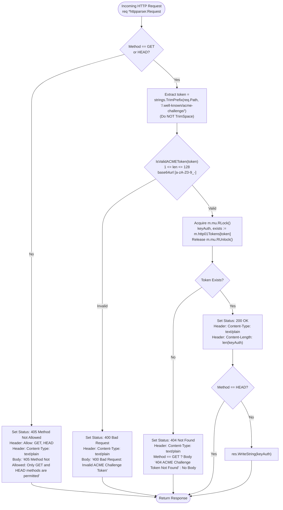

# REQ-100 - RFC 8555 Token Syntax & Length Validation and HTTP Method Hardening in ACME HTTP-01 Challenge Handler

## 1. Context & Business Value

Toron Edge Gateway features an integrated Automated Certificate Management Environment (ACME) engine ([`pkg/acme/`](file:///Users/sneha/Developer/toron-research/toron/pkg/acme/)) designed for zero-touch provisioning and automatic background renewal of TLS certificates from Automated Certificate Authorities such as Let's Encrypt and ZeroSSL. As part of this engine, Toron registers an automated HTTP-01 challenge responder handler ([`ACMEManager.ServeHTTP01Handler`](file:///Users/sneha/Developer/toron-research/toron/pkg/acme/acme.go#L193-L208)) serving challenge validation requests routed under the standard path prefix `/.well-known/acme-challenge/{token}`.

During comprehensive security review [`SR-091 Finding 8`](file:///Users/sneha/Developer/toron-research/toron/docs/securityReview/SR-091.md#L235-L251) and vulnerability tracking [`SEC-38`](file:///Users/sneha/Developer/toron-research/toron/SECURITY_AUDIT.md#L539-L547) ([CWE-20 Improper Input Validation](https://cwe.mitre.org/data/definitions/20.html), [CWE-703 Improper Handling of Exceptional Conditions](https://cwe.mitre.org/data/definitions/703.html)), multiple input validation and protocol compliance deficiencies were identified in [`pkg/acme/acme.go:L193-L208`](file:///Users/sneha/Developer/toron-research/toron/pkg/acme/acme.go#L193-L208).

### Problem Statement & Failure Modes

In [`pkg/acme/acme.go`](file:///Users/sneha/Developer/toron-research/toron/pkg/acme/acme.go), `ServeHTTP01Handler` processes incoming challenge validation requests:

```go
// ServeHTTP01Handler handles incoming GET /.well-known/acme-challenge/{token} requests.
func (m *ACMEManager) ServeHTTP01Handler(req *httpparser.Request, res *httpparser.Response) {
	token := strings.TrimPrefix(req.Path, "/.well-known/acme-challenge/")
	token = strings.TrimSpace(token)

	keyAuth, exists := m.GetHTTP01Challenge(token)
	if !exists {
		res.SetStatus(http.StatusNotFound)
		res.Header.Set("Content-Type", "text/plain")
		_, _ = res.WriteString("404 ACME Challenge Token Not Found")
		return
	}

	res.SetStatus(http.StatusOK)
	res.Header.Set("Content-Type", "text/plain")
	_, _ = res.WriteString(keyAuth)
}
```

The handler exhibits the following critical structural flaws:

1. **Unvalidated Token Querying (CWE-20, CWE-703)**:
   The handler strips `/.well-known/acme-challenge/` and passes the resulting `token` directly to `m.GetHTTP01Challenge(token)` without syntax or length validation. This permits arbitrary, unvalidated client input to directly query the internal synchronized map `m.http01Tokens` protected by `m.mu.RLock()`.
2. **Violation of RFC 8555 §8.3 Base64URL Character Set Restrictions**:
   [RFC 8555 §8.3](https://datatracker.ietf.org/doc/html/rfc8555#section-8.3) explicitly specifies that ACME HTTP-01 challenge tokens MUST contain *only* characters from the base64url alphabet ([RFC 4648 §5](https://datatracker.ietf.org/doc/html/rfc4648#section-5)) without padding:
   $$\text{Alphabet} = \{ \text{'a'-'z'}, \text{'A'-'Z'}, \text{'0'-'9'}, \text{'-'}, \text{'_'} \}$$
   Characters such as base64 padding (`=`), directory separators (`/`, `\`), directory traversal sequences (`..`), non-printable control characters, null bytes (`\x00`), and non-ASCII/UTF-8 bytes are strictly forbidden. The current implementation allows all of these characters to pass into the lookup logic.
3. **Unbounded Token Length**:
   ACME challenge tokens generated by compliant CAs possess bounded entropy (typically 128 bits, represented in 22 or 43 base64url characters, and bounded at 128 characters). The current handler accepts arbitrarily large strings (e.g., 10 MB payloads) in the URL path, forcing heap retention and redundant string hashing during map lookup.
4. **Permissive HTTP Method Acceptance**:
   ACME HTTP-01 challenges specify validation via HTTP `GET` and `HEAD` methods. The current handler ignores `req.Method`, executing challenge lookup and returning status `200 OK` for non-idempotent or arbitrary HTTP verbs (`POST`, `PUT`, `DELETE`, `PATCH`, `OPTIONS`, `CONNECT`, etc.), violating RFC 8555 and standard HTTP REST semantics.
5. **Missing RFC 7231 `HEAD` Method Support**:
   [RFC 8555 §8.3](https://datatracker.ietf.org/doc/html/rfc8555#section-8.3) and [RFC 7231 §4.3.2](https://datatracker.ietf.org/doc/html/rfc7231#section-4.3.2) mandate that clients and validation probes MUST be able to perform `HEAD` requests. If a client sends a `HEAD` request, the server must return identical status and headers to `GET` (including `Content-Type: text/plain` and `Content-Length`), but MUST NOT transmit a response body. The current handler does not distinguish `HEAD` and incorrectly writes the response body string to `res.Body`.
6. **Silent Whitespace Forgiveness**:
   Calling `strings.TrimSpace(token)` silently masks malformed client input containing leading or trailing whitespace (e.g., spaces, tabs, carriage returns). Under RFC 8555, whitespace in tokens is invalid and MUST result in an explicit client error (`400 Bad Request`) rather than implicit sanitization.

### Security & Compliance Impact (CVSS:3.1 Score 3.7 - Low)

- **Map Flooding & Hash Churn**: Unbounded strings submitted via high-volume probes degrade map lookup efficiency and waste CPU cycles computing 64-bit hashes for oversized inputs.
- **Protocol Non-Compliance**: Automated validation probes from strict ACME CAs or monitoring tools attempting `HEAD` requests receive non-compliant HTTP response structures.
- **Path Ambiguity**: Unchecked path separators (`/`) or dots (`.`) in `token` permit malformed subpath requests (e.g. `/.well-known/acme-challenge/foo/bar` or `/.well-known/acme-challenge/..`) to reach the token resolver rather than failing fast at ingress.

Remediating `SEC-38` through `REQ-100` introduces **strict RFC 8555 base64url token syntax validation, strict length bounding ($1 \le \text{len} \le 128$), fail-fast HTTP 400 rejection, HTTP method restriction to `GET` and `HEAD` with HTTP 405, and RFC 7231 `HEAD` semantics**.

---

## 2. Non-Goals & Scope Exclusions

1. **TLS-ALPN-01 Challenge Validation (`pkg/acme`)**:
   TLS-ALPN-01 challenges are negotiated at the TLS layer via ALPN protocol negotiation (`acme-tls/1`) and synthetic X.509 certificates ([RFC 8737](https://datatracker.ietf.org/doc/html/rfc8737)). `REQ-100` pertains exclusively to the HTTP-01 challenge endpoint (`/.well-known/acme-challenge/*`).
2. **ACME Client Account & Order Management**:
   The logic for generating account private keys, computing JWK thumbprints ([RFC 7638](https://datatracker.ietf.org/doc/html/rfc7638)), and submitting CSR orders to Let's Encrypt or other CAs is unaffected by this requirement.
3. **External Upstream Routing / Reverse Proxying**:
   Static file provisioning or upstream forwarding for ACME challenges managed by external processes (e.g., Certbot webroot) outside the embedded `ACMEManager` is governed by general route configuration ([`REQ-057`](file:///Users/sneha/Developer/toron-research/toron/docs/requirements/REQ-057.md)) and remains separate.

---

## 3. Requirements & Acceptance Criteria

### REQ-100-AC-01: RFC 8555 Base64URL Token Syntax & Length Validator
- A public, standalone validator function MUST be defined in package `acme`:
  ```go
  // IsValidACMEToken reports whether token conforms strictly to RFC 8555 §8.3 base64url alphabet without padding.
  func IsValidACMEToken(token string) bool
  ```
- **Length Constraint**: The token length MUST satisfy:
  $$1 \le \text{len}(token) \le 128$$
  Empty tokens (`len == 0`) or tokens exceeding 128 bytes (`len > 128`) MUST return `false`.
- **Character Set Constraint**: Every byte in `token` MUST belong strictly to the unpadded base64url character set ([RFC 4648 §5](https://datatracker.ietf.org/doc/html/rfc4648#section-5)):
  - ASCII uppercase letters: `'A'` through `'Z'` (`0x41` - `0x5A`)
  - ASCII lowercase letters: `'a'` through `'z'` (`0x61` - `0x7A`)
  - ASCII decimal digits: `'0'` through `'9'` (`0x30` - `0x39`)
  - Hyphen / Minus: `'-'` (`0x2D`)
  - Underscore: `'_'` (`0x5F`)
- **Strict Prohibition**: The following characters MUST return `false` immediately:
  - Base64 padding `=`
  - Path characters `/`, `\`, `.`
  - Whitespace characters (`' '`, `'\t'`, `'\r'`, `'\n'`)
  - Control characters (`0x00` - `0x1F`, `0x7F`)
  - Extended ASCII and multibyte UTF-8 characters (`>= 0x80`)
- **Zero Allocations**: The validation MUST be implemented as a zero-allocation single-pass byte scan with $O(N)$ time complexity and $O(1)$ space.

### REQ-100-AC-02: HTTP Method Restriction & 405 Method Not Allowed Enforcement
- In `ServeHTTP01Handler`, the HTTP request method MUST be checked before any token extraction or challenge map inspection.
- **Allowed Methods**: Only `GET` and `HEAD` methods MUST be allowed:
  - `req.Method == "GET"` or `req.Method == "HEAD"` (case-sensitive or uppercase-normalized).
- **Disallowed Methods**: If any other HTTP method is received (`POST`, `PUT`, `DELETE`, `PATCH`, `OPTIONS`, `CONNECT`, `TRACE`, etc.):
  - The handler MUST set HTTP status code `405 Method Not Allowed`.
  - The handler MUST set response header:
    ```http
    Allow: GET, HEAD
    ```
  - The handler MUST set response header:
    ```http
    Content-Type: text/plain
    ```
  - The handler MUST write a descriptive error body:
    ```text
    405 Method Not Allowed: Only GET and HEAD methods are permitted
    ```
  - The handler MUST immediately return without querying `m.GetHTTP01Challenge`.

### REQ-100-AC-03: Fail-Fast Token Syntax & Length Rejection (HTTP 400 Bad Request)
- In `ServeHTTP01Handler`, the path prefix `/.well-known/acme-challenge/` MUST be extracted.
- The handler MUST NOT call `strings.TrimSpace(token)` to silently strip whitespace.
- If `!IsValidACMEToken(token)`:
  - The handler MUST set HTTP status code `400 Bad Request`.
  - The handler MUST set response header:
    ```http
    Content-Type: text/plain
    ```
  - The handler MUST write the standardized error response body:
    ```text
    400 Bad Request: Invalid ACME Challenge Token
    ```
  - The handler MUST immediately return without calling `m.GetHTTP01Challenge(token)` and without acquiring `m.mu.RLock()`.

### REQ-100-AC-04: RFC 7231 HEAD Method Semantics
- When an incoming request uses the `HEAD` method (`req.Method == "HEAD"`) and specifies a valid, registered token:
  - The handler MUST set HTTP status code `200 OK`.
  - The handler MUST set response header:
    ```http
    Content-Type: text/plain
    ```
  - The handler MUST set response header `Content-Length` matching the exact byte count of the key authorization string:
    ```go
    res.Header.Set("Content-Length", strconv.Itoa(len(keyAuth)))
    ```
  - The handler MUST NOT write any data to `res.Body` (`res.Body.Len() == 0`).

### REQ-100-AC-05: RFC 8555 GET Challenge Resolution
- When an incoming request uses the `GET` method (`req.Method == "GET"`) and specifies a valid, registered token:
  - The handler MUST set HTTP status code `200 OK`.
  - The handler MUST set response header:
    ```http
    Content-Type: text/plain
    ```
  - The handler MUST set response header:
    ```go
    res.Header.Set("Content-Length", strconv.Itoa(len(keyAuth)))
    ```
  - The handler MUST write the exact key authorization payload string into `res.Body`:
    ```go
    _, _ = res.WriteString(keyAuth)
    ```

### REQ-100-AC-06: Non-Existent Challenge Token Handling (HTTP 404 Not Found)
- If `IsValidACMEToken(token)` returns `true`, but `m.GetHTTP01Challenge(token)` indicates the token is not currently registered in `m.http01Tokens` (`exists == false`):
  - The handler MUST set HTTP status code `404 Not Found`.
  - The handler MUST set response header:
    ```http
    Content-Type: text/plain
    ```
  - If `req.Method == "GET"`:
    - The handler MUST write response body:
      ```text
      404 ACME Challenge Token Not Found
      ```
  - If `req.Method == "HEAD"`:
    - The handler MUST NOT write a response body.

### REQ-100-AC-07: Concurrency Safety & Race-Free Operation
- All operations within `IsValidACMEToken` MUST be pure, stateless, and safe for concurrent execution across arbitrary goroutines.
- Reads to `m.http01Tokens` within `GetHTTP01Challenge` MUST maintain lock safety via `m.mu.RLock()` and `m.mu.RUnlock()`.
- The test suite MUST execute with zero race conditions under `go test -race ./pkg/acme/...`.

### REQ-100-AC-08: Zero Third-Party Dependencies Rule
- Implementation MUST rely strictly on the Go standard library (`net/http`, `strconv`, `strings`, `sync`, `toron/pkg/httpparser`).
- External validation libraries, regex packages with heavy overhead, or third-party ACME dependencies MUST NOT be introduced.

---

## 4. Architectural Sequence & Control Flow

The following sequence diagram illustrates the hardened execution flow of `ServeHTTP01Handler`:



---

## 5. Constraints & Non-Functional Requirements

- **RFC Conformance**:
  - RFC 8555 §8.3 (ACME HTTP-01 Challenge).
  - RFC 4648 §5 (Base64URL Encoding without Padding).
  - RFC 7231 §4.3.2 (HTTP HEAD Method).
  - RFC 7231 §6.5.5 (HTTP 405 Method Not Allowed & Allow Header).
- **Performance & Efficiency**:
  - Zero heap allocations during token validation. `IsValidACMEToken` must inspect ASCII byte values directly (`byte >= 'a' && byte <= 'z'`, etc.) without allocating regex engines or substring slices.
- **Fail-Fast Isolation**:
  - Malformed tokens are rejected before acquiring read locks on `m.mu`, eliminating lock contention and cache pollution during denial-of-service attempts.
- **Thread Safety**:
  - 100% data-race-free under `go test -count=1 -race ./pkg/acme/...`.
- **Zero Third-Party Dependencies**:
  - Standard library only.

---

## 6. Open Questions & Technical Resolutions

- *Open Question 1*: Should `strings.TrimSpace` be retained before token validation?
  - *Resolution*: No. RFC 8555 §8.3 defines token syntax strictly as base64url characters. Whitespace characters are invalid. Silently stripping whitespace masks client-side bugs and could allow ambiguous or non-standard token representations. Any token containing whitespace must fail validation and return `400 Bad Request`.
- *Open Question 2*: Should `HEAD` requests set the `Content-Length` header?
  - *Resolution*: Yes. Per RFC 7231 §4.3.2, the server SHOULD send the same header fields in response to a `HEAD` request as would have been sent to a `GET` request. Setting `Content-Length: len(keyAuth)` allows automated validation probes to inspect response sizing without consuming bandwidth.
- *Open Question 3*: What should `ServeHTTP01Handler` return if a request arrives for path `/.well-known/acme-challenge/` (with no token)?
  - *Resolution*: Stripping the prefix yields an empty string `""`. Because `len("") == 0`, `IsValidACMEToken("")` returns `false`, and the handler correctly returns `400 Bad Request: Invalid ACME Challenge Token`.

---

## 7. Traceability Matrix

| Artifact | Identifier / Reference | Description |
| :--- | :--- | :--- |
| **Security Finding** | [`SEC-38`](file:///Users/sneha/Developer/toron-research/toron/SECURITY_AUDIT.md#L539-L547) | Missing Token Syntax and Length Validation in ACME HTTP-01 Challenge Handler |
| **Security Review** | [`SR-091`](file:///Users/sneha/Developer/toron-research/toron/docs/securityReview/SR-091.md#L235-L251) | Finding 8 (SEC-38): Missing Token Syntax and Length Validation in ACME HTTP-01 Challenge Handler |
| **Foundational Routing REQ** | [`REQ-001`](file:///Users/sneha/Developer/toron-research/toron/docs/requirements/REQ-001.md) | Core Routing Engine & Security Controls |
| **ACME Provisioning REQ** | [`REQ-033`](file:///Users/sneha/Developer/toron-research/toron/docs/requirements/REQ-033.md) | ACME HTTP-01 and TLS-ALPN-01 Challenge Handlers for Zero-Touch Production SSL Provisioning |
| **Cleartext Exemption REQ** | [`REQ-057`](file:///Users/sneha/Developer/toron-research/toron/docs/requirements/REQ-057.md) | Cleartext HTTP Route Redirection Exemption for ACME Challenge Endpoints |
| **Requirement (This Spec)** | [`REQ-100`](file:///Users/sneha/Developer/toron-research/toron/docs/requirements/REQ-100.md) | RFC 8555 Token Syntax & Length Validation and HTTP Method Hardening in ACME HTTP-01 Challenge Handler |
| **Architecture Decision (New)** | [`ADR-100`](file:///Users/sneha/Developer/toron-research/toron/docs/architecture/ADR-100.md) | ACME HTTP-01 Token Syntax Validation and HTTP Method Hardening |
| **Test Case (New)** | [`TC-100`](file:///Users/sneha/Developer/toron-research/toron/docs/testCases/TC-100.md) | Automated Verification Suite for ACME HTTP-01 Token Validation and Method Hardening |
| **Implementation Task** | [`TASK-123`](file:///Users/sneha/Developer/toron-research/toron/docs/tasks/TASK-123.md) | Implementation of `IsValidACMEToken`, Method Restriction, and HEAD Semantics in `pkg/acme` |

---

## 8. User Approval Gate

> [!IMPORTANT]
> In accordance with project engineering standards, this requirement specification is submitted with `status: draft`. Downstream decomposition into architecture decision records ([`ADR-100`](file:///Users/sneha/Developer/toron-research/toron/docs/architecture/ADR-100.md)), implementation tasks ([`TASK-123`](file:///Users/sneha/Developer/toron-research/toron/docs/tasks/TASK-123.md)), test cases ([`TC-100`](file:///Users/sneha/Developer/toron-research/toron/docs/testCases/TC-100.md)), and code changes requires explicit user review and sign-off.
