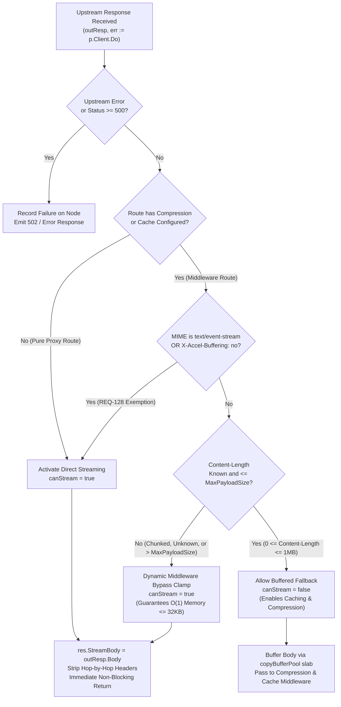

# REQ-129 - Streaming by Default Reverse Proxy Architecture, RFC 7230 Outbound Chunked Framing, and Memory Boundedness Invariants

## 1. Description & Problem Statement

### 1.1 Problem Context & The Upstream Infinite Stream OOM Bomb
In high-throughput, enterprise-grade reverse proxies, buffering entire upstream HTTP response payloads into heap memory creates a catastrophic denial-of-service vulnerability: the **"Upstream Infinite Stream OOM Bomb"** ([`SEC-36`](file:///Users/sneha/Developer/toron-research/toron/SECURITY_AUDIT.md#L483-L491), [CWE-400 Uncontrolled Resource Consumption](https://cwe.mitre.org/data/definitions/400.html), [CWE-770 Allocation of Resources Without Limits or Throttling](https://cwe.mitre.org/data/definitions/770.html)).

Under [`REQ-125`](file:///Users/sneha/Developer/toron-research/toron/docs/requirements/REQ-125.md) and [`REQ-128`](file:///Users/sneha/Developer/toron-research/toron/docs/requirements/REQ-128.md), Toron established a direct socket streaming fast-path via [`httpparser.Response.StreamBody`](file:///Users/sneha/Developer/toron-research/toron/pkg/httpparser/response.go#L180) and exempted Server-Sent Events (`text/event-stream`) and unbuffered streams (`X-Accel-Buffering: no`) from in-memory response caching and transparent compression.

However, an architectural audit of Toron's core reverse proxy engine revealed critical systemic limitations:
1. **Unbounded Buffering on Standard Routes**:
   In [`pkg/proxy/proxy.go:1105`](file:///Users/sneha/Developer/toron-research/toron/pkg/proxy/proxy.go#L1105), streaming is restricted by `canStream`:
   ```go
   canStream := p.streamResponse && ((!p.routeHasCompression && !p.routeHasCache) || isStreamingMIME || isUnbuffered)
   ```
   Whenever a route enables caching or compression (the standard production configuration for API and web gateways) and the upstream response does not explicitly declare `text/event-stream` or `X-Accel-Buffering: no`, Toron unconditionally falls back to:
   ```go
   bufPtr := httpparser.GetCopyBuffer()
   _, _ = io.CopyBuffer(res.Body, outResp.Body, *bufPtr)
   httpparser.PutCopyBuffer(bufPtr)
   ```
   `io.CopyBuffer` continuously reads bytes from `outResp.Body` into `res.Body` (`*bytes.Buffer`) without an upper memory limit.
2. **The Infinite Stream Failure Mode**:
   If an upstream endpoint emits a large file download (e.g. multi-gigabyte disk image, database export, archive), an endless telemetry feed, or a continuous data stream (e.g. `/dev/urandom`), `res.Body` expands dynamically on the Go heap until the operating system Out-Of-Memory (OOM) killer terminates the Toron gateway process, severing ingress traffic for all production services.
3. **HTTP/1.1 Persistent Connection Degradation on Streaming**:
   In [`pkg/server/server.go:344-376`](file:///Users/sneha/Developer/toron-research/toron/pkg/server/server.go#L344-L376), when `res.StreamBody != nil`, Toron writes response headers and then writes raw stream chunks directly to the client socket without RFC 7230 Chunked Transfer Encoding framing (`Transfer-Encoding: chunked`). Because streaming payloads lack a known `Content-Length`, HTTP/1.1 clients cannot determine where the response body ends without connection closure. This prevents HTTP/1.1 persistent connection reuse (`Connection: keep-alive`) across streaming responses and induces stream boundary desynchronization.
4. **Smuggling Defense Decoupling**:
   Under [`ADR-056`](file:///Users/sneha/Developer/toron-research/toron/docs/architecture/ADR-056.md), [`REQ-061`](file:///Users/sneha/Developer/toron-research/toron/docs/requirements/REQ-061.md), and [`REQ-042`](file:///Users/sneha/Developer/toron-research/toron/docs/requirements/REQ-042.md), Toron strictly guards against HTTP Request Smuggling ([CWE-444](https://cwe.mitre.org/data/definitions/444.html)) by rejecting inbound client requests declaring `Transfer-Encoding: chunked` with HTTP `501 Not Implemented`. Outbound response chunking must be implemented without weakening inbound request smuggling defenses.

---

### 1.2 Prior Requirements & Standards Cross-Audit (Conflict Analysis)

A comprehensive cross-audit against existing Toron specifications and architectural decisions was conducted:

| Prior Requirement / ADR | Core Architectural Invariant | Potential Conflict & Cross-Audit Resolution | Compliance Verdict |
| :--- | :--- | :--- | :--- |
| **[`ADR-001`](file:///Users/sneha/Developer/toron-research/toron/docs/architecture/ADR-001.md)** (Event-Driven Reactor) | Strict modularity: proxy and router must NEVER touch the physical client socket (`net.Conn`). | **Preserved**: Proxy transfers body ownership via `res.StreamBody io.ReadCloser`. Server core coordinates chunk relaying to `net.Conn`. | **100% Compliant** |
| **[`ADR-056`](file:///Users/sneha/Developer/toron-research/toron/docs/architecture/ADR-056.md) / [`REQ-061`](file:///Users/sneha/Developer/toron-research/toron/docs/requirements/REQ-061.md) / [`REQ-042`](file:///Users/sneha/Developer/toron-research/toron/docs/requirements/REQ-042.md)** (Smuggling Guard) | Inbound `Transfer-Encoding: chunked` requests rejected with HTTP 501. | **Preserved**: Inbound guard remains strictly active. Outbound chunked framing is restricted strictly to response generation in `pkg/server`. | **100% Compliant** |
| **[`REQ-098`](file:///Users/sneha/Developer/toron-research/toron/docs/requirements/REQ-098.md) / [`ADR-098`](file:///Users/sneha/Developer/toron-research/toron/docs/architecture/ADR-098.md)** (Bounded Ingestion) | Upstream payloads bounded to prevent heap OOM (`SEC-36`, CWE-400, CWE-770). | **Extended**: Clamping logic applied to all reverse proxy routes: payloads $\le \text{MaxPayloadSize}$ can buffer; larger/chunked payloads stream directly. | **Harmonized** |
| **[`REQ-034`](file:///Users/sneha/Developer/toron-research/toron/docs/requirements/REQ-034.md) / [`ADR-029`](file:///Users/sneha/Developer/toron-research/toron/docs/architecture/ADR-029.md)** (Transparent Compression) | Compresses full response bodies; sets `Content-Encoding` and `Content-Length`. | **Harmonized**: Payloads $\le \text{MaxPayloadSize}$ are buffered and compressed; oversized/chunked payloads bypass compression cleanly. | **Zero Conflict** |
| **[`REQ-035`](file:///Users/sneha/Developer/toron-research/toron/docs/requirements/REQ-035.md) / [`ADR-030`](file:///Users/sneha/Developer/toron-research/toron/docs/architecture/ADR-030.md)** (Response Caching) | Caches responses matching status and size criteria up to `MaxPayloadSize`. | **Harmonized**: Payloads $\le \text{MaxPayloadSize}$ are cached; oversized/chunked payloads bypass cache storage cleanly (`X-Cache: MISS`). | **Zero Conflict** |
| **[`REQ-125`](file:///Users/sneha/Developer/toron-research/toron/docs/requirements/REQ-125.md) / [`ADR-125`](file:///Users/sneha/Developer/toron-research/toron/docs/architecture/ADR-125.md)** (Streaming Fast-Path) | WebSocket-aligned stream hand-off (`res.StreamBody`) for SSE and unbuffered streams. | **Promoted**: Direct streaming becomes the default mode (`streamResponse: true`) across all proxy routes and profiles. | **Direct Evolution** |
| **[`REQ-126`](file:///Users/sneha/Developer/toron-research/toron/docs/requirements/REQ-126.md) / [`ADR-126`](file:///Users/sneha/Developer/toron-research/toron/docs/architecture/ADR-126.md)** (Adaptive Deadlines) | Activity-refreshed write deadlines protect against Slow Read DoS (CWE-400). | **Integrated**: Outbound chunked relay loop refreshes write deadlines per chunk, preventing slow clients from hanging upstream sockets. | **Synergistic Alignment** |
| **[`REQ-127`](file:///Users/sneha/Developer/toron-research/toron/docs/requirements/REQ-127.md) / [`ADR-127`](file:///Users/sneha/Developer/toron-research/toron/docs/architecture/ADR-127.md)** (TCP_NODELAY & Buffer Recycling) | Disables Nagle buffering; recycles 32KB copy buffers from `sync.Pool`. | **Integrated**: Chunk framing emits immediately without delayed ACK stalls, using recycled 32KB copy buffer slabs. | **Synergistic Alignment** |
| **[`REQ-128`](file:///Users/sneha/Developer/toron-research/toron/docs/requirements/REQ-128.md) / [`ADR-128`](file:///Users/sneha/Developer/toron-research/toron/docs/architecture/ADR-128.md)** (Middleware Exemptions) | `text/event-stream`, `X-Accel-Buffering: no`, and `no-cache` bypass middleware. | **Foundation**: REQ-129 generalizes this exemption to all oversized, chunked, or dynamic streams exceeding `MaxPayloadSize`. | **Harmonized** |

---

### 1.3 Safe Non-Conflicting Path

To permanently eliminate the Upstream Infinite Stream OOM Bomb while maintaining full support for caching, compression, request smuggling security, and core reactor modularity:

1. **Streaming by Default**: Configure `streamResponse: true` as the global default across all proxy profiles and routes.
2. **Dynamic Bounded Ingestion Clamping**:
   - For routes with middleware requiring complete bodies (caching, compression):
     - If upstream `Content-Length` is declared, valid, and $\le \text{MaxPayloadSize}$ (e.g. 1 MB), allow buffered ingestion into `res.Body` to enable caching and compression.
     - If upstream `Content-Length` exceeds `MaxPayloadSize`, is omitted, or indicates chunked transfer encoding (`Transfer-Encoding: chunked`), dynamically bypass caching and compression, hand off `outResp.Body` directly to `res.StreamBody`, and stream directly to the client socket.
     - Memory allocated per stream is strictly clamped to $O(1) \le 32\text{KB}$.
3. **Core Reactor Modularity (ADR-001)**:
   - The proxy and router layers strictly manipulate `httpparser.Response` and `res.StreamBody io.ReadCloser`. Neither layer ever accesses or controls the physical client socket `net.Conn`.
   - The server core ([`pkg/server/server.go`](file:///Users/sneha/Developer/toron-research/toron/pkg/server/server.go)) coordinates chunk relaying, socket options, write deadlines, and connection lifecycle.
4. **Outbound RFC 7230 Chunked Response Framing**:
   - In HTTP/1.1, when `res.StreamBody != nil` and `Content-Length` is absent, the server frames streaming response bytes as `Transfer-Encoding: chunked` (`<hex-len>\r\n<data>\r\n... terminal 0\r\n\r\n`).
   - Enables HTTP/1.1 persistent connections (`Connection: keep-alive`) to be reused across streaming transactions.
5. **Fail-Closed Framing Invariant (Anti-Desynchronization Guard)**:
   - On upstream read errors, context cancellation, or client write timeouts, the server must **NEVER** emit the terminal chunk `0\r\n\r\n`. It must immediately close the TCP socket (`conn.Close()`), preventing downstream stream corruption and cache poisoning.
6. **Multi-Protocol Streaming Parity (HTTP/2 & HTTP/3)**:
   - Provide zero-buffering parity in `http2AdapterHandler` via `http.Flusher` loop, dispatching binary `DATA` frames directly to HTTP/2 and HTTP/3 clients.

---

## 2. Functional Requirements

### 2.1 Streaming by Default & Dynamic Bounded Ingestion Clamping (`pkg/proxy/proxy.go`, `pkg/config`)

1. **Default Configuration Update**:
   - In [`pkg/config/defaults.go`](file:///Users/sneha/Developer/toron-research/toron/pkg/config/defaults.go) and [`pkg/proxy/proxy.go`](file:///Users/sneha/Developer/toron-research/toron/pkg/proxy/proxy.go), `stream_response` shall default to **`true`** across all proxy profiles, including `"balanced"` and `"raw_speed"`.
   - Route-level configuration in `routes.yaml` may explicitly override this behavior via `routes[].transport.stream_response`.

2. **Dynamic Ingestion Clamping Decision Matrix**:
   Inside `ReverseProxy.ServeHTTPWithPrefix`, upon receiving upstream response headers `outResp`, evaluate streaming eligibility:
   ```go
   contentType := strings.ToLower(outResp.Header.Get("Content-Type"))
   isStreamingMIME := strings.HasPrefix(contentType, "text/event-stream")
   isUnbuffered := strings.EqualFold(strings.TrimSpace(outResp.Header.Get("X-Accel-Buffering")), "no")
   
   // Resolve maximum allowed buffering threshold for route (default: 1 MB)
   maxPayloadSize := p.maxPayloadSize
   if maxPayloadSize <= 0 {
       maxPayloadSize = 1024 * 1024 // 1 MB default
   }

   // Inspect Content-Length
   contentLength := outResp.ContentLength
   isChunkedOrUnknown := contentLength < 0 || strings.EqualFold(outResp.Header.Get("Transfer-Encoding"), "chunked")
   isOversized := contentLength > maxPayloadSize

   // Dynamic Bounded Ingestion Clamping Rule:
   // Direct streaming activates if:
   // 1. streamResponse is enabled AND route has no compression/caching; OR
   // 2. Response is explicitly unbuffered (text/event-stream or X-Accel-Buffering: no); OR
   // 3. Upstream payload is chunked/unknown length, or exceeds maxPayloadSize.
   canStream := p.streamResponse && (
       (!p.routeHasCompression && !p.routeHasCache) ||
       isStreamingMIME ||
       isUnbuffered ||
       isChunkedOrUnknown ||
       isOversized,
   )
   ```

3. **Execution Branching**:
   - **When `canStream == true`**:
     - ReverseProxy shall transfer ownership of `outResp.Body` directly to `res.StreamBody = outResp.Body`.
     - ReverseProxy shall **omit** `defer outResp.Body.Close()`.
     - ReverseProxy shall immediately return execution to the router, taking $< 0.05\text{ms}$ with **zero in-memory payload buffering**.
   - **When `canStream == false`** (Only for routes with caching/compression where `0 <= contentLength <= maxPayloadSize`):
     - ReverseProxy shall safely buffer `outResp.Body` into `res.Body` using a recycled copy buffer from `copyBufferPool` bounded by `io.LimitReader(outResp.Body, maxPayloadSize + 1)`.
     - Downstream `CompressionMiddleware` and `CacheMiddleware` process the buffered payload normally.



---

### 2.2 Core Reactor Modularity Preservation (ADR-001) & Lifecycle Management

1. **Strict Separation of Concerns**:
   - The reverse proxy (`pkg/proxy`) and routing engine (`pkg/router`) shall **never** access, wrap, or manipulate the physical client socket `net.Conn`.
   - The reverse proxy communicates streaming intent solely through the `httpparser.Response` data structure via the `StreamBody io.ReadCloser` handle.
   - All socket deadline updates, chunk encoding, TCP write operations, and socket teardowns are strictly orchestrated by the server core in [`pkg/server/server.go`](file:///Users/sneha/Developer/toron-research/toron/pkg/server/server.go).

2. **Stream Context Cancellation & Socket Teardown (CWE-775 Mitigation)**:
   - Upstream requests dispatched by `ReverseProxy` shall be bound to the downstream client request context (`req.Context()`):
     ```go
     outReq = outReq.WithContext(req.Context())
     ```
   - When a client disconnects abruptly (TCP RST, FIN, or client cancellation), the downstream request context is cancelled, immediately aborting upstream reads in Go's `http.Transport`.
   - In [`Server.handleConnection`](file:///Users/sneha/Developer/toron-research/toron/pkg/server/server.go), `res.StreamBody.Close()` shall be registered via `defer` immediately upon detecting `res.StreamBody != nil`, guaranteeing upstream socket release under all normal and exceptional exit conditions.

---

### 2.3 Outbound RFC 7230 Chunked Response Framing & Smuggling Defense (ADR-056)

1. **Inbound Smuggling Guard Preservation (ADR-056 / REQ-061)**:
   - In [`pkg/httpparser/parser.go`](file:///Users/sneha/Developer/toron-research/toron/pkg/httpparser/parser.go), any incoming client request declaring `Transfer-Encoding: chunked` (or any unsupported transfer coding) shall **remain strictly rejected** with HTTP `501 Not Implemented`.
   - The connection shall be immediately closed (`conn.Close()`), discarding any residual socket bytes.
   - Outbound chunked framing shall be strictly isolated to downstream HTTP response serialization.

2. **Outbound Response Framing in HTTP/1.1 (`Server.handleConnection`)**:
   In HTTP/1.1, when `res.StreamBody != nil`:
   - **Case A: Known Fixed Length Streaming**:
     If `outResp.ContentLength >= 0` and the response is not chunked, emit `Content-Length: <len>` and relay stream chunks raw without chunked framing.
   - **Case B: Chunked Streaming (Unknown Length / Dynamic Streams)**:
     If `outResp.ContentLength < 0` or upstream response was chunked:
     - The server shall emit `Transfer-Encoding: chunked` in the HTTP/1.1 response header.
     - Any existing `Content-Length` header shall be strictly stripped to eliminate conflicting length headers (RFC 7230 §3.3.3).
     - The chunk relay loop in `Server.handleConnection` shall wrap each chunk read from `res.StreamBody` into valid RFC 7230 §4.1 chunk framing:
       $$\text{chunk} = \text{hex-length} + \text{"\textbackslash r\textbackslash n"} + \text{data} + \text{"\textbackslash r\textbackslash n"}$$
     - Upon receiving `io.EOF` indicating clean stream termination, the server shall emit the terminal chunk:
       $$\text{"0\textbackslash r\textbackslash n\textbackslash r\textbackslash n"}$$
     - **Keep-Alive Connection Reuse**: Following emission of the terminal chunk on a clean stream, if the client requested `Connection: keep-alive` and server configuration permits, the underlying TCP connection shall remain open for subsequent HTTP/1.1 requests.

3. **Zero-Allocation Chunk Formatting**:
   Hex length formatting and CRLF delimiters shall be written using recycled buffer slabs from `httpparser.GetResponseBuffer()`, avoiding heap string allocations during chunk framing.

```
+-------------------------------------------------------------------------------+
|                       RFC 7230 CHUNKED RESPONSE FRAMING                       |
|                                                                               |
|  HTTP/1.1 200 OK\r\n                                                          |
|  Content-Type: application/octet-stream\r\n                                   |
|  Transfer-Encoding: chunked\r\n                                               |
|  \r\n                                                                         |
|  8000\r\n               <--- Hex representation of 32,768 bytes               |
|  [32 KB binary data]                                                          |
|  \r\n                                                                         |
|  1F40\r\n               <--- Hex representation of 8,000 bytes                |
|  [8 KB binary data]                                                           |
|  \r\n                                                                         |
|  0\r\n\r\n              <--- Terminal chunk on clean EOF                      |
|                                                                               |
|  =====> TCP Connection preserved for subsequent keep-alive request! =====>   |
+-------------------------------------------------------------------------------+
```

---

### 2.4 Fail-Closed Framing Invariant (Anti-Desynchronization Guard, CWE-444)

1. **Premature Termination Safety**:
   If an upstream stream encounters an unexpected network error, read failure, context timeout, or downstream write error before `res.StreamBody.Read()` returns `io.EOF`:
   - The server core must **NEVER** emit the terminal chunk `0\r\n\r\n`.
   - Emitting `0\r\n\r\n` on an incomplete or errored stream would falsely signal clean completion to the client and any intermediate HTTP caching proxies, causing severe data truncation, cache poisoning, and stream desynchronization ([CWE-444](https://cwe.mitre.org/data/definitions/444.html)).
2. **Immediate Socket Teardown**:
   Upon detecting any non-EOF read error or write error during chunk relay:
   - Immediately close the underlying client TCP socket via `conn.Close()`.
   - Abrupt TCP connection termination signals a network failure to the client/browser, forcing downstream consumers to discard partial or corrupted payloads without desynchronizing connection state.

---

### 2.5 Multi-Protocol Streaming Parity (HTTP/2 & HTTP/3)

1. **Zero-Buffering Data Frame Streaming**:
   In [`pkg/server/server.go:http2AdapterHandler`](file:///Users/sneha/Developer/toron-research/toron/pkg/server/server.go#L486-L514), when `res.StreamBody != nil`:
   - Stream chunks directly to the `http.ResponseWriter` using a recycled 32KB copy buffer slab.
   - Immediately flush each chunk to the wire using `http.Flusher.Flush()`:
     ```go
     n, readErr := res.StreamBody.Read(buf)
     if n > 0 {
         if _, writeErr := w.Write(buf[:n]); writeErr != nil {
             return
         }
         if isFlusher {
             flusher.Flush() // Emits HTTP/2 or HTTP/3 DATA frame immediately
         }
     }
     ```
   - In HTTP/2 and HTTP/3, framing is handled natively by the protocol transport layer (multiplexed binary `DATA` frames with `END_STREAM` flags), eliminating userspace chunk framing overhead while preserving identical streaming semantics.

2. **Client Abort Propagation**:
   The HTTP/2 relay loop shall actively monitor `select { case <-r.Context().Done(): return }`, terminating the relay loop and closing `res.StreamBody` immediately if the client resets the HTTP/2 stream (`RST_STREAM`) or severs the QUIC connection.

---

## 3. Non-Functional Requirements

### 3.1 The 4 Non-Negotiable Invariants

#### Invariant 1: Constant $O(1)$ Memory Boundedness
- Memory allocated per active stream shall remain strictly **$O(1) \le 32\text{ KB}$** across all routes, upstream media types, and payload sizes.
- Ingesting multi-gigabyte or infinite upstream responses shall never increase Toron gateway process heap allocation beyond the fixed 32KB copy buffer slab, completely neutralizing the Upstream Infinite Stream OOM Bomb (`SEC-36`, CWE-400, CWE-770).

#### Invariant 2: Strict Inbound Smuggling Guard (ADR-056)
- The inbound request smuggling guard established in [`ADR-056`](file:///Users/sneha/Developer/toron-research/toron/docs/architecture/ADR-056.md) and [`REQ-061`](file:///Users/sneha/Developer/toron-research/toron/docs/requirements/REQ-061.md) shall remain **100% active and uncompromised**.
- Inbound client requests with `Transfer-Encoding: chunked` remain strictly rejected with HTTP `501 Not Implemented`.
- Outbound RFC 7230 chunked framing is restricted strictly to response generation in the HTTP/1.1 server engine.

#### Invariant 3: Fail-Closed Framing (Anti-Desynchronization Guard, CWE-444)
- On upstream read errors, context cancellation, or write deadline timeouts, the server must **NEVER** emit the terminal chunk `0\r\n\r\n`.
- The server must immediately terminate the client TCP connection (`conn.Close()`), preventing downstream clients and intermediate proxy caches from mistaking an aborted stream for a successful completion.

#### Invariant 4: Slow-Client Protection via Activity-Refreshed Write Deadlines
- Every chunk transmission in the streaming relay loop must refresh the socket write deadline (`conn.SetWriteDeadline(time.Now().Add(WriteTimeout))`) in accordance with [`REQ-126`](file:///Users/sneha/Developer/toron-research/toron/docs/requirements/REQ-126.md).
- Stalled or malicious slow clients (Slow Read DoS, CWE-400) shall be deterministically disconnected within `WriteTimeout`, freeing upstream backend sockets and server worker goroutines.

---

### 3.2 Performance & Zero-Allocation Characteristics

1. **Recycled Copy Slabs**: All chunk transfers must utilize 32KB buffer slabs recycled via `sync.Pool` (`copyBufferPool`), yielding **zero heap allocations per chunk**.
2. **Sub-Millisecond Chunk Delivery**: Combined with explicit `TCP_NODELAY` socket configuration ([`ADR-127`](file:///Users/sneha/Developer/toron-research/toron/docs/architecture/ADR-127.md)), chunks are transmitted immediately to the network with $< 1\text{ms}$ latency without Nagle buffering stalls.
3. **Zero Third-Party Dependencies**: All chunk formatting, reader wrapping, context propagation, and framing must rely strictly on the Go standard library (`io`, `net`, `net/http`, `sync`, `strconv`, `fmt`, `context`).

---

## 4. Acceptance Criteria

### 4.1 Configuration & Defaults (`pkg/config`)
- [ ] `ProxyTransportConfig.StreamResponse` defaults to `true` across all profiles (`raw_speed`, `balanced`, and custom).
- [ ] Route-level `routes[].transport.stream_response` overrides take precedence over global settings.

### 4.2 Dynamic Bounded Ingestion Clamping (`pkg/proxy`)
- [ ] Routes without compression and caching stream responses directly via `res.StreamBody` with zero in-memory body copies.
- [ ] Routes with compression or caching enabled inspect upstream `Content-Length`:
  - [ ] If $0 \le \text{Content-Length} \le \text{MaxPayloadSize}$ (default 1MB), response is buffered into `res.Body` and processed by compression/cache middleware.
  - [ ] If $\text{Content-Length} > \text{MaxPayloadSize}$, response dynamically bypasses compression/cache and streams directly via `res.StreamBody`.
  - [ ] If `Content-Length < 0` (unknown length or chunked upstream), response dynamically bypasses compression/cache and streams directly via `res.StreamBody`.
- [ ] Memory allocation per stream during reverse proxy execution remains strictly $O(1) \le 32\text{KB}$.

### 4.3 Core Reactor Modularity & Lifecycle (`pkg/proxy`, `pkg/server`)
- [ ] Reverse proxy and routing layers contain zero references to or manipulations of client `net.Conn`.
- [ ] Upstream request context is derived from client request context (`outReq = outReq.WithContext(req.Context())`).
- [ ] Client TCP disconnect or cancellation immediately triggers upstream context cancellation.
- [ ] `res.StreamBody.Close()` is deferred in `Server.handleConnection`, ensuring zero file descriptor leaks (`EMFILE`, CWE-775).

### 4.4 Outbound RFC 7230 Chunked Framing (`pkg/server`)
- [ ] In HTTP/1.1, streaming responses of unknown length emit `Transfer-Encoding: chunked` and omit static `Content-Length`.
- [ ] Each chunk read from `res.StreamBody` is formatted and emitted as `<hex-len>\r\n<data>\r\n`.
- [ ] On clean EOF, the server emits terminal chunk `0\r\n\r\n`.
- [ ] HTTP/1.1 keep-alive connections remain open and can process subsequent requests following clean chunked response completion.

### 4.5 Security Guards & Invariants
- [ ] **Smuggling Guard**: Inbound client requests declaring `Transfer-Encoding: chunked` remain strictly rejected with HTTP `501 Not Implemented` and immediate socket closure under ADR-056.
- [ ] **Fail-Closed Framing**: Upstream error, abort, or timeout mid-stream results in immediate `conn.Close()` without emitting `0\r\n\r\n`.
- [ ] **Slow-Client Protection**: Stalled clients failing to consume chunks within `WriteTimeout` are disconnected with a write deadline timeout error.

### 4.6 Multi-Protocol Parity (HTTP/2 & HTTP/3)
- [ ] `http2AdapterHandler` relays `res.StreamBody` chunks directly using `http.Flusher` without intermediate buffering.
- [ ] Client stream reset (`RST_STREAM`) immediately halts the relay loop and closes `res.StreamBody`.

### 4.7 Concurrency Safety & Automated Test Suite (`TC-129`)
- [ ] Automated integration tests verify keep-alive connection reuse across chunked streaming responses.
- [ ] Automated tests verify that multi-gigabyte or infinite upstream streams maintain constant bounded heap memory ($\le 32\text{KB}$).
- [ ] Automated tests verify fail-closed socket termination on aborted upstream streams.
- [ ] All unit, integration, and security tests pass with 100% success under `go test -race ./pkg/proxy/... ./pkg/server/... ./pkg/config/...`.

---

## 5. Rationale & Threat Modeling

| Threat Scenario | Vulnerability & CWE | Prior Behavior (Vulnerable) | Remediated Behavior (REQ-129) |
| :--- | :--- | :--- | :--- |
| **Upstream Infinite Stream OOM Bomb** | [CWE-400](https://cwe.mitre.org/data/definitions/400.html), [CWE-770](https://cwe.mitre.org/data/definitions/770.html), [`SEC-36`](file:///Users/sneha/Developer/toron-research/toron/SECURITY_AUDIT.md#L483-L491) | Unbounded `io.CopyBuffer(res.Body, outResp.Body)` buffered multi-GB or infinite streams into heap RAM until OOM process crash. | Dynamic clamp limits buffering to `MaxPayloadSize` ($\le 1\text{MB}$). Oversized/chunked streams stream directly via `res.StreamBody` with $O(1) \le 32\text{KB}$ memory bound. |
| **HTTP Request Smuggling** | [CWE-444](https://cwe.mitre.org/data/definitions/444.html) | Potential conflict between inbound chunked decoding and outbound chunked framing. | ADR-056 inbound guard strictly preserved (501 rejection). Outbound chunked framing restricted strictly to response generation. |
| **Stream Boundary Desynchronization** | [CWE-444](https://cwe.mitre.org/data/definitions/444.html) | Emitting a premature terminal chunk (`0\r\n\r\n`) on an aborted stream tricks client/cache into caching truncated data. | Fail-closed invariant: server never emits `0\r\n\r\n` on error; immediately closes TCP socket (`conn.Close()`). |
| **Socket Descriptor Leakage** | [CWE-775](https://cwe.mitre.org/data/definitions/775.html) | Client aborts left upstream `outResp.Body` open, exhausting OS file descriptors (`EMFILE`). | Client disconnect cancels upstream context and executes deferred `res.StreamBody.Close()`. |
| **Slow-Read Denial of Service** | [CWE-400](https://cwe.mitre.org/data/definitions/400.html) | Slow client reads chunks at 1 byte/minute, hanging upstream connection and worker goroutines indefinitely. | Activity-refreshed write deadlines (REQ-126) terminate slow clients within `WriteTimeout`. |

---

## 6. Open Questions

- *Open Question 1*: Should the maximum buffering clamp threshold (`MaxPayloadSize`) be configurable per route or globally?
  - *Resolution*: Support both. `InternalAPIConfig` and `ProxyConfig` provide a global default of 1 MB (`1048576` bytes), while route entries in `routes.yaml` can override this via `routes[].max_payload_size`.
- *Open Question 2*: Should HTTP/1.0 clients receiving a streaming response receive chunked transfer encoding?
  - *Resolution*: RFC 7230 §3.3.1 explicitly specifies that HTTP/1.0 does not support `Transfer-Encoding: chunked`. For HTTP/1.0 clients, the server must emit headers without `Transfer-Encoding`, stream raw chunks, and close the connection upon stream completion (`Connection: close`).

---

## 7. Traceability Matrix

| Requirement / Artifact | Relationship | Description / Verification Target |
| :--- | :--- | :--- |
| **[`REQ-129 §2.1`](file:///Users/sneha/Developer/toron-research/toron/docs/requirements/REQ-129.md#L182-L242)** | Implements | Streaming by default and dynamic bounded ingestion clamping in `pkg/proxy/proxy.go`. |
| **[`REQ-129 §2.2`](file:///Users/sneha/Developer/toron-research/toron/docs/requirements/REQ-129.md#L244-L264)** | Upholds | Core reactor modularity (ADR-001) and context cancellation lifecycle. |
| **[`REQ-129 §2.3`](file:///Users/sneha/Developer/toron-research/toron/docs/requirements/REQ-129.md#L266-L320)** | Implements | Outbound RFC 7230 chunked response framing in `pkg/server/server.go`. |
| **[`REQ-129 §2.4`](file:///Users/sneha/Developer/toron-research/toron/docs/requirements/REQ-129.md#L322-L336)** | Enforces | Fail-closed framing invariant preventing stream desynchronization (CWE-444). |
| **[`REQ-129 §2.5`](file:///Users/sneha/Developer/toron-research/toron/docs/requirements/REQ-129.md#L338-L362)** | Implements | Multi-protocol streaming parity for HTTP/2 and HTTP/3 via `http.Flusher`. |
| **[`ADR-001`](file:///Users/sneha/Developer/toron-research/toron/docs/architecture/ADR-001.md)** | Preserves | Guarantees proxy and router never touch physical client sockets. |
| **[`ADR-056`](file:///Users/sneha/Developer/toron-research/toron/docs/architecture/ADR-056.md) / [`REQ-061`](file:///Users/sneha/Developer/toron-research/toron/docs/requirements/REQ-061.md)** | Preserves | Inbound `Transfer-Encoding: chunked` requests rejected with HTTP 501. |
| **[`REQ-098`](file:///Users/sneha/Developer/toron-research/toron/docs/requirements/REQ-098.md) / [`ADR-098`](file:///Users/sneha/Developer/toron-research/toron/docs/architecture/ADR-098.md)** | Extends | Extends bounded ingestion clamp to all proxy routes to remediate SEC-36 / CWE-400. |
| **[`REQ-125`](file:///Users/sneha/Developer/toron-research/toron/docs/requirements/REQ-125.md) / [`ADR-125`](file:///Users/sneha/Developer/toron-research/toron/docs/architecture/ADR-125.md)** | Promotes | Makes direct socket streaming the default behavior across all routes. |
| **[`REQ-126`](file:///Users/sneha/Developer/toron-research/toron/docs/requirements/REQ-126.md) / [`ADR-126`](file:///Users/sneha/Developer/toron-research/toron/docs/architecture/ADR-126.md)** | Integrates | Activity-refreshed write deadlines protect streaming relay against slow clients. |
| **[`REQ-127`](file:///Users/sneha/Developer/toron-research/toron/docs/requirements/REQ-127.md) / [`ADR-127`](file:///Users/sneha/Developer/toron-research/toron/docs/architecture/ADR-127.md)** | Integrates | Explicit `TCP_NODELAY` and `sync.Pool` 32KB copy slabs power zero-alloc chunk relay. |
| **[`REQ-128`](file:///Users/sneha/Developer/toron-research/toron/docs/requirements/REQ-128.md) / [`ADR-128`](file:///Users/sneha/Developer/toron-research/toron/docs/architecture/ADR-128.md)** | Harmonizes | Middleware exemptions for streaming responses harmonized with dynamic clamp. |
| **`TC-129`** | Verified By | Verification test suite for REQ-129 (chunked framing, OOM immunity, fail-closed socket teardown). |
| **`ADR-129`** | Decided By | Architectural decision record governing streaming-by-default and outbound chunking. |

---

## 8. User Approval Gate

> [!IMPORTANT]
> In accordance with Toron engineering governance standards, this requirement specification is submitted with **`status: draft`**.
> Downstream decomposition into Architectural Decision Records ([`ADR-129`](file:///Users/sneha/Developer/toron-research/toron/docs/architecture/ADR-129.md)), Engineering Task Work Packages (`TASK-129`), Test Case Suites (`TC-129`), and code implementation is blocked until explicit user sign-off is received.
