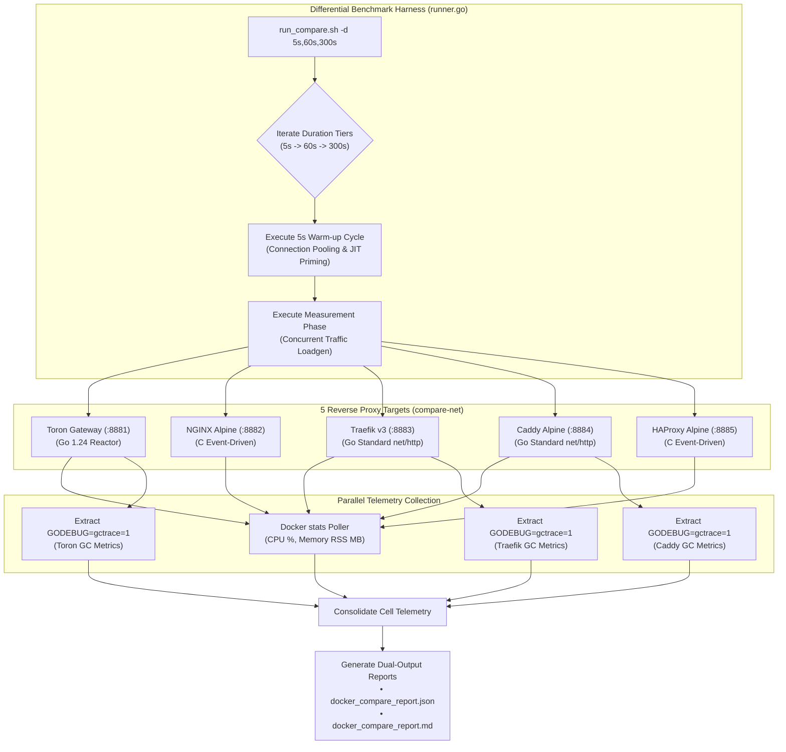

# REQ-130 - Multi-Tier Duration Stress Testing (5s, 60s, 300s), Runtime GC Telemetry Capture, and Differential Reverse Proxy Benchmarking

## 1. Description & Problem Statement

### 1.1 Problem Context & The Short-Duration Evaluation Blindspot

Toron is designed as an ultra-high-performance, zero-allocation Layer 4 and Layer 7 reverse proxy and edge gateway. Under [`REQ-114`](file:///Users/sneha/Developer/toron-research/toron/docs/requirements/REQ-114.md) / [`ADR-114`](file:///Users/sneha/Developer/toron-research/toron/docs/architecture/ADR-114.md) (BMK-04 Saturation Stress Testing), [`REQ-117`](file:///Users/sneha/Developer/toron-research/toron/docs/requirements/REQ-117.md) / [`ADR-117`](file:///Users/sneha/Developer/toron-research/toron/docs/architecture/ADR-117.md) (Disaggregated 4-Tier Adversarial Classification), and [`REQ-121`](file:///Users/sneha/Developer/toron-research/toron/docs/requirements/REQ-121.md) / [`ADR-121`](file:///Users/sneha/Developer/toron-research/toron/docs/architecture/ADR-121.md) (Differential Multi-Proxy Docker Benchmark), Toron established an automated benchmarking suite comparing Toron against **NGINX**, **Traefik**, **Caddy**, and **HAProxy**.

However, an in-depth methodological audit of the current benchmarking harnesses identified critical scientific and empirical limitations:

1. **The 5-Second Short-Duration Blindspot**:
   - Existing default benchmark runs in [`benchmarks/run_all.sh`](file:///Users/sneha/Developer/toron-research/toron/benchmarks/run_all.sh#L135-L140), [`benchmarks/wrk2/run_saturation_stress.sh`](file:///Users/sneha/Developer/toron-research/toron/benchmarks/wrk2/run_saturation_stress.sh#L17), and [`benchmarks/docker-compare/run_compare.sh`](file:///Users/sneha/Developer/toron-research/toron/benchmarks/docker-compare/run_compare.sh#L20) execute for only **5 to 10 seconds**.
   - While a 5-second burst is well-suited for rapid smoke testing and regression sanity checks in continuous integration, it is fundamentally inadequate for rigorous systems research and publication-grade empirical validation.
   - Specifically, a 5-second execution window suffers from:
     - **Transient Startup Bias**: Socket connection pool ramp-up, initial thread scheduling, CPU frequency scaling, and Go runtime netpoller priming dominate the measurement window.
     - **Garbage Collector Masking**: Go's concurrent mark-and-sweep garbage collector (GC) may trigger only once or twice (or not at all if allocations remain beneath the initial heap trigger $2 \times \text{GOGC}$), completely masking garbage collection pause times, heap expansion rates, and mark-assist CPU overhead.
     - **Inability to Detect Memory Leaks & Heap Drift**: Memory bloat, buffer pool degradation (`sync.Pool` reference retention), goroutine leaks, or socket descriptor leaks (`EMFILE`, [CWE-775](https://cwe.mitre.org/data/definitions/775.html)) cannot be detected during a transient 5-second run.
2. **Absence of Go Runtime GC Telemetry (`GODEBUG=gctrace=1`)**:
   - Toron and its primary Go-based competitors (**Traefik** and **Caddy**) rely on automatic heap memory management. In contrast, **NGINX** and **HAProxy** are implemented in C with explicit manual memory management (`malloc`/`free` or custom slab allocators).
   - In prior benchmark runs, Toron was launched with standard environment variables, completely omitting runtime GC tracing. Consequently, researchers cannot determine how much CPU time is consumed by background GC, the duration and frequency of Stop-The-World (STW) pauses, the heap reclamation efficiency, or the steady-state live heap baseline under saturation.
3. **Lack of Steady-State and Long-Term Soak Comparison Across Proxies**:
   - In [`benchmarks/docker-compare/run_compare.sh`](file:///Users/sneha/Developer/toron-research/toron/benchmarks/docker-compare/run_compare.sh), proxies are benchmarked for 5 seconds per backend. Reviewers and performance engineers cannot observe whether Go-based proxies experience tail latency degradation over time due to GC pauses, nor can they compare the steady-state memory retention of Toron against NGINX, Traefik, Caddy, and HAProxy over sustained periods.

To establish scientific rigor, this requirement specification formalizes a **Multi-Tier Duration Benchmark Architecture** spanning:
- **Tier 1: Quick Smoke Test (`quick`, 5 seconds)**: Rapid pre-merge regression verification.
- **Tier 2: Steady-State & GC Observation (`medium` / `steady`, 60 seconds)**: Deep observation of Go runtime GC cycles, mark/pause clock times, and steady-state tail latencies ($p95, p99, p99.9$).
- **Tier 3: Long-Term Soak & Memory Stability (`soak`, 300 seconds / 5 minutes)**: Extended soak testing validating $O(1)$ memory boundedness ([`REQ-129`](file:///Users/sneha/Developer/toron-research/toron/docs/requirements/REQ-129.md)), zero memory drift, connection pool longevity, and proxy resilience under sustained saturation.

---

### 1.2 Prior Requirements & Standards Cross-Audit (Conflict Analysis)

A comprehensive cross-audit against existing Toron specifications and architectural decisions was conducted to guarantee zero behavioral regressions and absolute architectural continuity:

| Prior Requirement / ADR | Core Architectural Invariant | Potential Conflict & Cross-Audit Resolution | Compliance Verdict |
| :--- | :--- | :--- | :--- |
| **[`ADR-001`](file:///Users/sneha/Developer/toron-research/toron/docs/architecture/ADR-001.md)** (Event-Driven Reactor) | Strict modularity: proxy and router must NEVER touch the physical client socket (`net.Conn`). | **Preserved**: REQ-130 modifies only benchmark orchestration, load generation, environment variables, and telemetry reporting. Reactor internals and socket boundaries remain 100% untouched. | **100% Compliant** |
| **[`REQ-114`](file:///Users/sneha/Developer/toron-research/toron/docs/requirements/REQ-114.md) / [`ADR-114`](file:///Users/sneha/Developer/toron-research/toron/docs/architecture/ADR-114.md)** (Saturation Stress BMK-04) | Decoupled dual-stream telemetry (benign vs adversarial 10%), rate pacer (`time.NewTicker`), zero-starvation bounds ($p99 \le 50$ ms). | **Preserved & Extended**: Rate pacer and dual-stream partitioning operate identically over 5s, 60s, and 300s durations. Zero-starvation assertion is evaluated across all tiers. | **Harmonized** |
| **[`REQ-117`](file:///Users/sneha/Developer/toron-research/toron/docs/requirements/REQ-117.md) / [`ADR-117`](file:///Users/sneha/Developer/toron-research/toron/docs/architecture/ADR-117.md)** (Disaggregated 4-Tier Status HARN-01) | 4-tier classification: Active Defense (`400, 403, 413, 431, 501`), Route Miss (`404`), Bypass (`200`), Unhandled (`5xx`). Zero 404 inflation. | **Preserved**: 64-bit atomic counters and strict evaluation oracle remain active across extended run durations, accumulating samples without lock contention or overflow. | **100% Compliant** |
| **[`REQ-119`](file:///Users/sneha/Developer/toron-research/toron/docs/requirements/REQ-119.md)** (Historical Retention & Manifest Indexing) | Retain test results in `benchmarks/results/history/<timestamp>/` with structured `manifest.json` indexing. | **Integrated**: All multi-tier duration runs and GC trace artifacts are systematically recorded into historical session manifests via [`archive_run.sh`](file:///Users/sneha/Developer/toron-research/toron/benchmarks/archive_run.sh). | **Synergistic Alignment** |
| **[`REQ-121`](file:///Users/sneha/Developer/toron-research/toron/docs/requirements/REQ-121.md) / [`ADR-121`](file:///Users/sneha/Developer/toron-research/toron/docs/architecture/ADR-121.md)** (Differential Multi-Proxy Docker Benchmark) | Containerized comparison of Toron vs NGINX, Traefik, Caddy, HAProxy across 4 heterogeneous origins (`compare-net`, ports 8881–8885). | **Extended**: Integrates multi-tier durations (5s, 60s, 300s) and injects `GODEBUG=gctrace=1` into Go-based proxy containers (`toron-proxy`, `traefik-proxy`, `caddy-proxy`). | **Direct Evolution** |
| **[`REQ-129`](file:///Users/sneha/Developer/toron-research/toron/docs/requirements/REQ-129.md) / [`ADR-129`](file:///Users/sneha/Developer/toron-research/toron/docs/architecture/ADR-129.md)** (Streaming by Default & Memory Boundedness) | Constant $O(1) \le 32$KB per-stream memory boundedness; elimination of infinite stream OOM bomb. | **Directly Verified**: 300-second soak tests empirically validate the memory boundedness invariant by measuring steady-state live heap floor and proving zero memory leaks under continuous saturation. | **Empirical Validation** |

---

### 1.3 Safe Non-Conflicting Path

To implement multi-tier duration benchmarking and GC telemetry capture without compromising existing testbeds or modifying core proxy code:

1. **Non-Invasive Telemetry**: Enable `GODEBUG=gctrace=1` exclusively via process environment variables and container definitions, leaving production application logic unchanged.
2. **Modular GC Parsing Utility**: Develop an independent, zero-dependency GC trace parsing module (`benchmarks/telemetry/gcparser`) that extracts structured metrics from standard error logs without coupling to server internals.
3. **Additive CLI Flags**: Extend [`benchmarks/wrk2/run_saturation_stress.sh`](file:///Users/sneha/Developer/toron-research/toron/benchmarks/wrk2/run_saturation_stress.sh), [`benchmarks/run_all.sh`](file:///Users/sneha/Developer/toron-research/toron/benchmarks/run_all.sh), and [`benchmarks/docker-compare/run_compare.sh`](file:///Users/sneha/Developer/toron-research/toron/benchmarks/docker-compare/run_compare.sh) with `--tier <quick|medium|soak|all>` and multi-duration support (`-d 5s,60s,300s`) while preserving existing single-duration flag defaults (`-d 5s` / `-d 10s`) for full backward compatibility.
4. **Isolated Comparative Telemetry**: Collect GC telemetry for Go-based proxies (Toron, Traefik, Caddy) while simultaneously capturing OS-level CPU and Memory RSS for C-based proxies (NGINX, HAProxy) via `docker stats`, presenting a unified comparative matrix.

---

## 2. Functional Requirements

### 2.1 Multi-Tier Duration Support & Tier Orchestration

```
┌──────────────────────────────────────────────────────────────────────────────────────────────────┐
│                                   BENCHMARK DURATION TAXONOMY                                    │
├──────────────────────┬──────────────────────┬────────────────────────────────────────────────────┤
│ Tier Name            │ Duration             │ Primary Empirical Objective                        │
├──────────────────────┼──────────────────────┼────────────────────────────────────────────────────┤
│ Quick Smoke          │ 5 seconds            │ Rapid smoke testing, CI regression, sanity checks  │
│ Steady-State / GC    │ 60 seconds (1 min)   │ GC cycle convergence, STW pauses, steady-state HDR │
│ Long-Term Soak       │ 300 seconds (5 min)  │ O(1) memory bound, leak detection, pool stability  │
│ All Tiers Sweep      │ 5s + 60s + 300s      │ Comprehensive research evaluation profile          │
└──────────────────────┴──────────────────────┴────────────────────────────────────────────────────┘
```

#### 2.1.1 Saturation Stress Harness (`benchmarks/wrk2/run_saturation_stress.sh`)
1. **Duration Argument Flexibility**:
   - The `-d` flag shall support:
     - Single duration strings: `-d 5s`, `-d 60s`, `-d 300s`, `-d 5m`.
     - Comma-separated multi-duration lists: `-d 5s,60s,300s`.
   - The harness shall support an explicit `--tier` flag:
     - `--tier quick`: Executes 5-second test.
     - `--tier medium` (alias `--tier steady`): Executes 60-second test.
     - `--tier soak`: Executes 300-second (5-minute) test.
     - `--tier all`: Executes 5s, 60s, and 300s tests sequentially.
2. **Sequential Multi-Tier Execution**:
   - When multiple durations are requested, the script shall iterate through each duration sequentially.
   - For each tier, the background Toron server process (if `--auto-start` is enabled) shall be maintained or cleanly recycled between tiers.
   - Unique output artifacts shall be generated per duration tier (e.g. `saturation_stress_5s.json`, `saturation_stress_60s.json`, `saturation_stress_300s.json`), alongside a unified consolidated summary report (`saturation_stress_report.md` and `saturation_stress_report.json`).

#### 2.1.2 Master Benchmark Suite (`benchmarks/run_all.sh`)
1. **Configurable Suite Duration**:
   - `benchmarks/run_all.sh` shall accept `--tier <quick|medium|soak|all>` and `-d <duration>` flags.
   - When unspecified, `benchmarks/run_all.sh` defaults to `--tier quick` (5s) to ensure automated regression tests complete in $< 60$ seconds.
   - When `--tier all` or an explicit duration is supplied, `run_all.sh` shall propagate the duration to Stage 2 (`wrk2`), Stage 3 (`saturation_stress`), and optional multi-hop stages.
2. **Master Manifest Parameter Recording**:
   - The historical archive recorder (`archive_run.sh`) shall record the active duration tier and execution parameters into the master manifest (`benchmarks/results/history/manifest.json`).

#### 2.1.3 Differential Multi-Proxy Docker Benchmark (`benchmarks/docker-compare/run_compare.sh` & `runner.go`)
1. **Multi-Duration Matrix Execution**:
   - `benchmarks/docker-compare/run_compare.sh` shall accept `-d 5s,60s,300s` and `--tier <quick|medium|soak|all>`.
   - In [`benchmarks/docker-compare/runner.go`](file:///Users/sneha/Developer/toron-research/toron/benchmarks/docker-compare/runner.go), the orchestrator shall evaluate all selected proxies against all selected backends across each requested duration tier.
2. **Container Health & Resource Preservation During 300s Soak**:
   - During 300-second runs, the runner shall periodically sample Docker stats (at least once every 10 seconds) to capture memory RSS trajectory and CPU utilization over time, rather than relying solely on a single post-run snapshot.

---

### 2.2 Go Runtime GC Telemetry Capture (`GODEBUG=gctrace=1`)

#### 2.2.1 Standalone Toron Server Environment Configuration
1. **Automatic Trace Activation**:
   - In [`benchmarks/wrk2/run_saturation_stress.sh`](file:///Users/sneha/Developer/toron-research/toron/benchmarks/wrk2/run_saturation_stress.sh) and [`benchmarks/run_all.sh`](file:///Users/sneha/Developer/toron-research/toron/benchmarks/run_all.sh), whenever the background Toron gateway is launched (`--auto-start`), the process shall be executed with:
     ```bash
     GODEBUG=gctrace=1 "${RESULTS_DIR}/toron_stress" ... 2> "${RESULTS_DIR}/server_gc_trace.log"
     ```
   - Standard output (HTTP server logs, routing logs) and standard error (Go runtime GC traces) shall be cleanly segregated, directing GC traces to a dedicated artifact: `${RESULTS_DIR}/server_gc_trace.log`.
2. **Historical Session Replication**:
   - When historical retention is active (`TORON_BENCHMARK_SESSION_DIR`), `server_gc_trace.log` shall be copied into the active session directory and indexed in `manifest.json`.

#### 2.2.2 Docker Compare Compose Environment Configuration
1. **Container Environment Injection**:
   - In [`benchmarks/docker-compare/docker-compose.compare.yml`](file:///Users/sneha/Developer/toron-research/toron/benchmarks/docker-compare/docker-compose.compare.yml), `GODEBUG=gctrace=1` shall be enabled for all Go-based reverse proxies:
     - `toron-proxy`:
       ```yaml
       environment:
         - GODEBUG=gctrace=1
       ```
     - `traefik-proxy`:
       ```yaml
       environment:
         - GODEBUG=gctrace=1
       ```
     - `caddy-proxy`:
       ```yaml
       environment:
         - GODEBUG=gctrace=1
       ```
   - NGINX and HAProxy (C-based runtimes) remain unaffected, serving as the empirical baseline for manual memory management without garbage collection.
2. **Container GC Trace Extraction**:
   - In `benchmarks/docker-compare/runner.go` or `run_compare.sh`, after each benchmark execution cell, the orchestrator shall query Docker logs for Go-based containers:
     ```bash
     docker logs --since <cell_start_time> toron-cmp-toron 2>&1 | grep "^gc " > toron_gc.log
     ```
   - Captured container GC traces shall be parsed and associated directly with the corresponding proxy cell result.

---

### 2.3 Automated GC Trace Parsing & Metric Extraction Engine

#### 2.3.1 Go Runtime GC Trace Format Specification
Go's runtime emits GC telemetry lines adhering to the following canonical format:
```text
gc 42 @12.345s 2%: 0.045+1.23+0.015 ms clock, 0.36+0.45/1.10/2.30+0.12 ms cpu, 14->16->8 MB, 18 MB goal, 8 MB stacks, 0 MB globals, 8 P
```
Where:
- `gc 42`: Sequential GC cycle identifier ($N_{\text{cycle}} = 42$).
- `@12.345s`: Elapsed wall-clock time in seconds since process initiation.
- `2%`: Cumulative percentage of execution time spent in GC since process initiation.
- `0.045+1.23+0.015 ms clock`: Wall-clock elapsed duration across GC phases:
  - $t_{\text{stw1}}$: Stop-The-World mark termination / sweep termination pause (ms).
  - $t_{\text{mark}}$: Concurrent mark and scan phase (ms).
  - $t_{\text{stw2}}$: Stop-The-World mark termination pause (ms).
  - Total STW pause for cycle: $T_{\text{pause}} = t_{\text{stw1}} + t_{\text{stw2}}$.
  - Total GC phase duration: $T_{\text{phase}} = t_{\text{stw1}} + t_{\text{mark}} + t_{\text{stw2}}$.
- `0.36+0.45/1.10/2.30+0.12 ms cpu`: CPU time across phases (assist / background / idle).
- `14->16->8 MB`: Heap memory progression:
  - $H_{\text{start}} = 14$ MB: Heap size at the moment GC was triggered.
  - $H_{\text{sweep}} = 16$ MB: Heap size before sweeping occurred.
  - $H_{\text{live}} = 8$ MB: Post-GC live heap memory (retained allocations).
  - Heap reclaimed during cycle: $\Delta H = H_{\text{sweep}} - H_{\text{live}} = 8$ MB.
- `18 MB goal`: Target heap size for the subsequent GC trigger.
- `8 P`: Number of logical processors (P) utilized.

#### 2.3.2 Parsed GC Telemetry Data Structure
A dedicated Go struct model shall represent parsed GC telemetry in reports:

```go
type GCTelemetry struct {
    Enabled            bool               `json:"enabled"`
    TotalCycles        int64              `json:"total_cycles"`
    GCCPUPercent       float64            `json:"gc_cpu_percent"`
    PauseTimesMs       GCPauseStatistics  `json:"pause_times_ms"`
    HeapMetricsMB      GCHeapStatistics   `json:"heap_metrics_mb"`
    CyclesPerSecond    float64            `json:"cycles_per_second"`
    TotalReclaimedMB   float64            `json:"total_reclaimed_mb"`
}

type GCPauseStatistics struct {
    MinSTWMs       float64 `json:"min_stw_ms"`
    MeanSTWMs      float64 `json:"mean_stw_ms"`
    P50STWMs       float64 `json:"p50_stw_ms"`
    P95STWMs       float64 `json:"p95_stw_ms"`
    P99STWMs       float64 `json:"p99_stw_ms"`
    MaxSTWMs       float64 `json:"max_stw_ms"`
    TotalSTWMs     float64 `json:"total_stw_ms"`
    MeanMarkMs     float64 `json:"mean_mark_ms"`
    MaxMarkMs      float64 `json:"max_mark_ms"`
}

type GCHeapStatistics struct {
    InitialLiveHeapMB  float64 `json:"initial_live_heap_mb"`
    FinalLiveHeapMB    float64 `json:"final_live_heap_mb"`
    PeakLiveHeapMB     float64 `json:"peak_live_heap_mb"`
    MeanLiveHeapMB     float64 `json:"mean_live_heap_mb"`
    PeakTriggerHeapMB  float64 `json:"peak_trigger_heap_mb"`
    HeapGrowthSlopeMBm float64 `json:"heap_growth_slope_mb_per_min"` // Growth slope over test window
}
```

#### 2.3.3 GC Parser Robustness Invariant
- The parser shall gracefully handle variations in Go GC trace formatting across versions (e.g. Go 1.20 vs 1.22 vs 1.24, optional stacks/globals tokens).
- Non-GC lines (such as application logs or panic stack traces) within the input stream shall be ignored without error.
- If zero GC cycles occur during the test (e.g. ultra-short test with negligible allocations), `TotalCycles` shall be reported as `0` without division-by-zero panics.

---

### 2.4 Multi-Proxy Differential Benchmarking Methodology



#### 2.4.1 Methodological Parity Principles
1. **Warm-Up Phase**:
   - Prior to recording metrics for 60s and 300s runs, a mandatory 5-second warm-up phase shall be executed to establish upstream connection pool sockets and prime container memory structures.
2. **Equal Hardware Constraints**:
   - All five proxy containers shall run under identical Docker CPU and memory resource constraints (e.g. 2.0 CPUs and 512 MB memory limits).
3. **Cross-Runtime Comparison Dimensions**:
   - **Throughput & Latency**: Compare RPS, P50, P90, P99, P99.9 across proxies.
   - **Runtime Memory Footprint**: Compare Docker container RSS (MB) across all 5 proxies.
   - **Garbage Collection Efficiency**: Compare Toron vs Traefik vs Caddy on GC cycle frequency, cumulative STW pause duration, max STW pause, and post-GC live heap baseline.
   - **Soak Stability (300s)**: Evaluate memory RSS delta ($\Delta \text{RSS} = \text{RSS}_{300\text{s}} - \text{RSS}_{60\text{s}}$) to detect long-term heap growth or memory fragmentation.

---

### 2.5 Dual-Output Reporting & Historical Retention Integration

#### 2.5.1 JSON Report Schema Expansion
The JSON schemas for `saturation_stress_report.json` and `docker_compare_report.json` shall be extended with the `gc_telemetry` object and multi-tier duration array:

```json
{
  "duration_seconds": 60.0,
  "duration_tier": "medium",
  "gc_telemetry": {
    "enabled": true,
    "total_cycles": 112,
    "gc_cpu_percent": 1.4,
    "cycles_per_second": 1.87,
    "total_reclaimed_mb": 1845.2,
    "pause_times_ms": {
      "min_stw_ms": 0.021,
      "mean_stw_ms": 0.048,
      "p50_stw_ms": 0.045,
      "p95_stw_ms": 0.078,
      "p99_stw_ms": 0.112,
      "max_stw_ms": 0.185,
      "total_stw_ms": 5.38,
      "mean_mark_ms": 0.95,
      "max_mark_ms": 2.10
    },
    "heap_metrics_mb": {
      "initial_live_heap_mb": 5.4,
      "final_live_heap_mb": 6.1,
      "peak_live_heap_mb": 7.8,
      "mean_live_heap_mb": 6.0,
      "peak_trigger_heap_mb": 14.2,
      "heap_growth_slope_mb_per_min": 0.08
    }
  }
}
```

#### 2.5.2 Markdown Report Sections & Comparative Tables
1. **Saturation Stress Report (`saturation_stress_report.md`)**:
   - Append Section 5: **"Runtime Garbage Collection & Memory Dynamics (`GODEBUG=gctrace=1`)"**.
   - Render a formatted markdown table summarizing total GC cycles, GC CPU overhead (%), P50/P99/Max STW pauses, total reclaimed MB, and live heap baseline.
2. **Docker Compare Report (`docker_compare_report.md`)**:
   - In Section 1, add columns for **"GC Cycles"** and **"P99 GC Pause"** (populated for Go proxies, `-` for C proxies).
   - Add Section 4: **"Go Runtime GC Differential Analysis (Toron vs Traefik vs Caddy)"** contrasting GC cycles, total STW pause time, and live heap floor.

---

## 3. Non-Functional Requirements

### 3.1 The 4 Non-Negotiable Invariants

```
+--------------------------------------------------------------------------------------------------+
│                                  THE 4 NON-NEGOTIABLE INVARIANTS                                 │
│                                                                                                  │
│  1. UNCOMPROMISED DUAL-STREAM TELEMETRY & 4-TIER CLASSIFICATION (ADR-114, ADR-117):              │
│     Across all durations (5s, 60s, 300s), benign and adversarial streams remain decoupled.        │
│     Adversarial probes evaluated under strict 4-tier taxonomy (Tier 1: Active Defense,           │
│     Tier 2: Route Miss, Tier 3: Attack Bypass, Tier 4: Unhandled). 0% credit for 404.            │
│                                                                                                  │
│  2. CONSTANT O(1) MEMORY BOUNDEDNESS UNDER 300s SOAK (ADR-129):                                  │
│     Under continuous 300-second saturation, Toron post-GC live heap shall remain bounded        │
│     with heap growth slope <= 1.0 MB/min, confirming zero memory leaks and strict O(1) bounds.   │
│                                                                                                  │
│  3. ZERO MEASUREMENT DISTORTION & BOUNDED LOG OVERHEAD:                                          │
│     GC telemetry parsing shall occur post-run or asynchronously, imposing < 0.5% CPU overhead.   │
│     GC trace logs shall be bounded and rotated to prevent testbed disk exhaustion during 300s.   │
│                                                                                                  │
│  4. COMPLETE BACKWARD COMPATIBILITY:                                                             │
│     Existing CI invocations (e.g. run_all.sh without flags) shall execute default quick 5s tier  │
│     without breaking existing test automation or regression pipelines.                           │
+--------------------------------------------------------------------------------------------------+
```

### 3.2 Performance & Zero-Allocation Invariants
- **Log Parsing Speed**: The standalone GC parser must process 10,000 trace lines in $< 50$ milliseconds using zero heap allocations on line scanning (`bufio.Scanner` with recycled byte buffer).
- **Atomic Concurrency Safety**: Load generator workers must continue utilizing lock-free 64-bit atomic integer counters (`sync/atomic.Int64`), maintaining zero race warnings under `go test -race`.

### 3.3 Portability & Dependency Invariants
- All tooling (GC parser, runner extensions, shell scripts) must rely strictly on standard Go library packages (`bufio`, `regexp`, `strconv`, `strings`, `time`, `encoding/json`) and standard POSIX/Bash commands. No external python, node, or third-party log ingestion agents are permitted.

---

## 4. Acceptance Criteria

### 4.1 Multi-Tier Duration Support
- [ ] `benchmarks/wrk2/run_saturation_stress.sh` supports `-d 5s`, `-d 60s`, `-d 300s`, `-d 5s,60s,300s`, and `--tier quick|medium|soak|all`.
- [ ] Specifying `--tier all` in `run_saturation_stress.sh` executes 5s, 60s, and 300s benchmarks sequentially.
- [ ] `benchmarks/run_all.sh` accepts `--tier` and `-d` flags, correctly passing duration parameters to Stage 2 (`wrk2`), Stage 3 (`saturation_stress`), and downstream stages.
- [ ] `benchmarks/run_all.sh` defaults to quick 5s execution when run without duration flags, maintaining fast CI execution.
- [ ] `benchmarks/docker-compare/run_compare.sh` and `runner.go` support multi-tier durations (5s, 60s, 300s) across all 5 proxies.

### 4.2 GC Telemetry Capture (`GODEBUG=gctrace=1`)
- [ ] When Toron is launched via `--auto-start` in `run_saturation_stress.sh`, `GODEBUG=gctrace=1` is active in the server process environment.
- [ ] Toron GC traces are captured into `benchmarks/results/server_gc_trace.log`.
- [ ] In `benchmarks/docker-compare/docker-compose.compare.yml`, `GODEBUG=gctrace=1` is configured for `toron-proxy`, `traefik-proxy`, and `caddy-proxy`.
- [ ] Container GC traces for Go-based proxies are extracted into individual log artifacts during docker comparison runs.

### 4.3 GC Metric Extraction & Aggregation Engine
- [ ] Automated parser extracts GC cycle count, cumulative STW pause, P50/P95/P99/Max STW pauses, total reclaimed MB, and live heap baseline.
- [ ] Parser handles Go 1.20+ `gctrace` variations without syntax errors or panic.
- [ ] Parser handles edge case of zero GC cycles gracefully without division-by-zero.
- [ ] GC telemetry is serialized into `saturation_stress_report.json` under `gc_telemetry`.
- [ ] GC telemetry is formatted into Section 5 of `saturation_stress_report.md`.

### 4.4 Multi-Proxy Differential Comparison & Reporting
- [ ] `docker_compare_report.json` and `docker_compare_report.md` include GC telemetry for Go-based proxies alongside CPU % and Memory RSS for C-based proxies.
- [ ] Differential report provides a direct head-to-head ranking of proxies across 60s steady-state and 300s soak tiers.
- [ ] Memory growth slope (MB/min) is reported for 300s soak runs to verify absence of memory leaks.

### 4.5 Historical Retention & Manifest Synchronization (REQ-119)
- [ ] Historical runs preserve `server_gc_trace.log` and duration tier metadata in `benchmarks/results/history/<timestamp>/`.
- [ ] Master manifest `benchmarks/results/history/manifest.json` correctly records multi-tier durations and GC telemetry summary.

### 4.6 Verification Test Suite (`TC-130`)
- [ ] Automated test suite verifies GC parser extraction accuracy using synthetic and live `gctrace` log fixtures.
- [ ] Integration tests verify that multi-tier CLI flag parsing behaves deterministically.
- [ ] All unit and benchmark tests pass cleanly with 100% success under `go test -race ./benchmarks/...`.

---

## 5. Rationale & Empirical Evaluation Analysis

### 5.1 Scientific Rigor: Why 5s vs 60s vs 300s Matters

```
┌──────────────────────────────────────────────────────────────────────────────────────────────────┐
│                            EMPIRICAL SYSTEM BEHAVIOR ACROSS DURATIONS                            │
│                                                                                                  │
│  [5 Seconds: Transient Phase]                                                                    │
│  ├─ TCP connection handshake overhead dominates.                                                 │
│  ├─ Go GC cycles: 0 to 2 (insufficient to observe pause distributions or heap ceiling).         │
│  └─ Memory leaks: 100% invisible.                                                               │
│                                                                                                  │
│  [60 Seconds: Steady-State Equilibrium]                                                          │
│  ├─ TCP connection pool fully primed and stabilized.                                             │
│  ├─ Go GC cycles: 50 to 150 cycles (statistically valid STW pause percentiles P50, P95, P99).    │
│  └─ True steady-state throughput and HDR tail latency captured.                                  │
│                                                                                                  │
│  [300 Seconds: Long-Term Soak & Stability]                                                       │
│  ├─ 1,500,000+ requests executed under continuous saturation.                                    │
│  ├─ Validates O(1) memory bound (REQ-129): live heap must remain flat, not upward-trending.     │
│  ├─ Surfaces buffer pool leaks, slow descriptor leakage (EMFILE), and socket queue bloat.        │
│  └─ Rigorously compares Go runtime heap management vs C jemalloc/glibc malloc longevity.         │
└──────────────────────────────────────────────────────────────────────────────────────────────────┘
```

### 5.2 Threat Modeling & Testbed Risk Mitigation

| Risk Scenario | Vulnerability / Failure Mode | Testbed Impact | Mitigation in REQ-130 |
| :--- | :--- | :--- | :--- |
| **Disk Exhaustion from GC Traces** | Rapid allocations generate thousands of GC lines during 300s soak. | Testbed disk fills up, causing benchmark failure. | Segregate GC log into dedicated file; truncate/rotate log or limit trace capture rate if log size exceeds 50 MB. |
| **Measurement Distortion from Log I/O** | Writing GC traces to disk introduces synchronous I/O blocking. | Artificially inflates proxy response latency. | Standard error is redirected to buffered file descriptors or RAM disk (`tmpfs`), decoupling logging from request servicing. |
| **Testbed Thermal Throttling during 300s** | Continuous 300s CPU saturation causes CPU clock throttling on test machine. | Skews comparative throughput between proxies tested first vs last. | Add mandatory 10-second idle cooldown between proxy runs in `run_compare.sh`. |
| **Docker Log Desynchronization** | Querying container logs captures logs from prior runs. | Inaccurate GC metrics attributed to current test. | Filter Docker logs using `--since <cell_start_timestamp>` or clear container logs between test cells. |

---

## 6. Open Questions & Resolutions

- *Open Question 1*: Should the 300-second soak test run automatically during standard CI builds?
  - *Resolution*: No. Running a 300-second (5-minute) soak test across 5 proxies and 4 backends would take over 100 minutes, making CI pipelines prohibitively slow. The default CI tier shall remain `quick` (5s). The `medium` (60s) and `soak` (300s) tiers shall be invoked explicitly via CLI flags (`--tier medium`, `--tier soak`, `--tier all`) for dedicated performance profiling and research publications.
- *Open Question 2*: How should Go GC metrics be compared against NGINX and HAProxy since they do not emit `gctrace`?
  - *Resolution*: NGINX and HAProxy utilize manual C heap management. In comparative reports, their GC fields shall be marked as `N/A (C Runtime)`, while their memory consumption is evaluated via continuous Docker stats Memory RSS (MB) tracking. This provides an exact, scientifically rigorous contrast: evaluating whether Go's garbage collector imposes higher tail latency ($p99$) or memory overhead relative to C-based manual memory management.
- *Open Question 3*: Should memory growth slope be calculated using linear regression or start/end deltas?
  - *Resolution*: Linear regression ($MB/\text{min}$) over periodic 10-second samples during the 60s and 300s runs provides the most accurate slope, filtering out transient GC sawtooth fluctuations.

---

## 7. Traceability Matrix

| Requirement / Artifact | Relationship | Description / Verification Target |
| :--- | :--- | :--- |
| **[`REQ-130 §2.1`](file:///Users/sneha/Developer/toron-research/toron/docs/requirements/REQ-130.md#L118-L172)** | Implements | Multi-tier duration support (5s, 60s, 300s) in `run_saturation_stress.sh`, `run_all.sh`, and `run_compare.sh`. |
| **[`REQ-130 §2.2`](file:///Users/sneha/Developer/toron-research/toron/docs/requirements/REQ-130.md#L174-L215)** | Implements | `GODEBUG=gctrace=1` environment injection for standalone Toron and Docker Go proxies. |
| **[`REQ-130 §2.3`](file:///Users/sneha/Developer/toron-research/toron/docs/requirements/REQ-130.md#L217-L285)** | Implements | Automated GC trace parsing engine extracting cycles, STW pauses, and heap metrics. |
| **[`REQ-130 §2.4`](file:///Users/sneha/Developer/toron-research/toron/docs/requirements/REQ-130.md#L287-L335)** | Implements | Multi-proxy differential benchmarking methodology (Toron vs NGINX, Traefik, Caddy, HAProxy). |
| **[`REQ-130 §2.5`](file:///Users/sneha/Developer/toron-research/toron/docs/requirements/REQ-130.md#L337-L380)** | Implements | JSON schema and Markdown report extensions with GC telemetry tables. |
| **[`ADR-001`](file:///Users/sneha/Developer/toron-research/toron/docs/architecture/ADR-001.md)** | Preserves | Core reactor modularity and socket ownership remain unchanged. |
| **[`REQ-114`](file:///Users/sneha/Developer/toron-research/toron/docs/requirements/REQ-114.md) / [`ADR-114`](file:///Users/sneha/Developer/toron-research/toron/docs/architecture/ADR-114.md)** | Preserves & Extends | Saturation stress test dual-stream telemetry and pacing preserved across extended durations. |
| **[`REQ-117`](file:///Users/sneha/Developer/toron-research/toron/docs/requirements/REQ-117.md) / [`ADR-117`](file:///Users/sneha/Developer/toron-research/toron/docs/architecture/ADR-117.md)** | Preserves | Four-tier adversarial status classification remains uncompromised over 60s and 300s runs. |
| **[`REQ-119`](file:///Users/sneha/Developer/toron-research/toron/docs/requirements/REQ-119.md)** | Integrates | Historical session archiving and manifest indexing for multi-tier runs. |
| **[`REQ-121`](file:///Users/sneha/Developer/toron-research/toron/docs/requirements/REQ-121.md) / [`ADR-121`](file:///Users/sneha/Developer/toron-research/toron/docs/architecture/ADR-121.md)** | Extends | Multi-proxy Docker benchmark extended with multi-tier durations and GC telemetry. |
| **[`REQ-129`](file:///Users/sneha/Developer/toron-research/toron/docs/requirements/REQ-129.md) / [`ADR-129`](file:///Users/sneha/Developer/toron-research/toron/docs/architecture/ADR-129.md)** | Empirically Verifies | 300s soak tests empirically prove $O(1)$ memory boundedness and absence of leaks. |
| **`TC-130`** | Verified By | Verification test suite for multi-duration parsing, GC trace extraction, and reporting. |
| **`ADR-130`** | Decided By | Architectural decision record governing multi-tier durations and GC telemetry capture. |

---

## 8. User Approval Gate

> [!IMPORTANT]
> In accordance with Toron engineering governance standards, this requirement specification is submitted with **`status: draft`**.
> Downstream decomposition into Architectural Decision Records ([`ADR-130`](file:///Users/sneha/Developer/toron-research/toron/docs/architecture/ADR-130.md)), Engineering Tasks (`TASK-153`), Test Case Suites (`TC-130`), and benchmark script implementation is blocked until explicit user sign-off is received.
