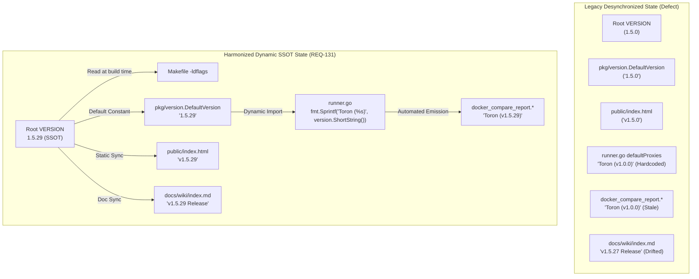

# REQ-131 - Universal SSOT Version Alignment (v1.5.29), Dynamic Benchmark Binding, and Cross-System Version Synchronization

## 1. Description & Problem Statement

### 1.1 Problem Context & The Multi-Artifact Version Drift

Toron is an ultra-high-performance, zero-allocation Layer 4 and Layer 7 reverse proxy, web server, and edge security gateway. Under [`REQ-055`](file:///Users/sneha/Developer/toron-research/toron/docs/requirements/REQ-055.md) and [`ADR-050`](file:///Users/sneha/Developer/toron-research/toron/docs/architecture/ADR-050.md) (*Centralized Version Management & Build Linker Injection*), Toron established the repository root [`VERSION`](file:///Users/sneha/Developer/toron-research/toron/VERSION) file as the canonical Single Source of Truth (SSOT) for Toron release versioning, designed to be propagated programmatically into Go runtime metadata ([`pkg/version/version.go`](file:///Users/sneha/Developer/toron-research/toron/pkg/version/version.go)), build tooling ([`Makefile`](file:///Users/sneha/Developer/toron-research/toron/Makefile)), CLI output, and OS installation packages.

However, as the repository underwent extensive feature iterations through prototypes, middleware hardenings, saturation benchmarking ([`REQ-114`](file:///Users/sneha/Developer/toron-research/toron/docs/requirements/REQ-114.md), [`REQ-117`](file:///Users/sneha/Developer/toron-research/toron/docs/requirements/REQ-117.md)), multi-proxy differential benchmarking ([`REQ-121`](file:///Users/sneha/Developer/toron-research/toron/docs/requirements/REQ-121.md)), streaming response transformations ([`REQ-128`](file:///Users/sneha/Developer/toron-research/toron/docs/requirements/REQ-128.md), [`REQ-129`](file:///Users/sneha/Developer/toron-research/toron/docs/requirements/REQ-129.md)), and multi-tier duration GC telemetry capture ([`REQ-130`](file:///Users/sneha/Developer/toron-research/toron/docs/requirements/REQ-130.md)), a severe **multi-artifact version desynchronization** accumulated across the codebase, documentation, and benchmark suites:

1. **SSOT Root and Go Runtime Constant Desynchronization**:
   - The canonical root [`VERSION`](file:///Users/sneha/Developer/toron-research/toron/VERSION#L1) file remained pinned to `1.5.0`.
   - The Go fallback constant [`pkg/version.DefaultVersion`](file:///Users/sneha/Developer/toron-research/toron/pkg/version/version.go#L10) remained pinned to `"1.5.0"`.
   - The current production feature milestone has progressed to **`v1.5.29`**.
2. **Web Control Center UI Desynchronization**:
   - In [`public/index.html:164`](file:///Users/sneha/Developer/toron-research/toron/public/index.html#L164), the header badge displayed `v1.5.0`, presenting stale release metadata to operators and administrators.
3. **Hardcoded Benchmark Descriptor Anti-Pattern in Differential Harnesses**:
   - In [`benchmarks/docker-compare/runner.go:130`](file:///Users/sneha/Developer/toron-research/toron/benchmarks/docker-compare/runner.go#L130), Toron was declared with a hardcoded static string:
     ```go
     {ID: "toron", Name: "Toron (v1.0.0)", ContainerName: "toron-cmp-toron", Port: 8881, HealthPath: "/health"}
     ```
   - This static descriptor directly bypassed [`pkg/version`](file:///Users/sneha/Developer/toron-research/toron/pkg/version/version.go), violating the core tenets of [`REQ-055`](file:///Users/sneha/Developer/toron-research/toron/docs/requirements/REQ-055.md).
   - In [`benchmarks/docker-compare/compare_test.go`](file:///Users/sneha/Developer/toron-research/toron/benchmarks/docker-compare/compare_test.go#L102-L432), unit tests statically asserted against `"Toron (v1.0.0)"` across multiple test fixtures and report verifications.
4. **Canonical Benchmark Reports & Documentation Desynchronization**:
   - The differential benchmark report artifacts ([`benchmarks/results/docker_compare_report.md`](file:///Users/sneha/Developer/toron-research/toron/benchmarks/results/docker_compare_report.md) and [`benchmarks/results/docker_compare_report.json`](file:///Users/sneha/Developer/toron-research/toron/benchmarks/results/docker_compare_report.json)) consistently labeled the Toron proxy as `Toron (v1.0.0)` across all 12 benchmark execution cells (4 backends $\times$ 3 durations: quick, medium, soak), latency percentile summaries, competitive rankings, preflight checks, and Section 4 Go Runtime GC Differential Analysis tables.
   - In [`docs/wiki/features/docker-compare-benchmark.md:61`](file:///Users/sneha/Developer/toron-research/toron/docs/wiki/features/docker-compare-benchmark.md#L61), the testbed overview documented the tested gateway as `Toron (v1.0.0)`.
   - In [`docs/wiki/index.md:59,114`](file:///Users/sneha/Developer/toron-research/toron/docs/wiki/index.md#L59-L114), the header and release notes references pointed to `v1.5.27 Release` and `v1.0.0–v1.5.27`.

### 1.2 Empirical & Operational Impact

This desynchronization creates critical risks:
- **Scientific Invalidity of Benchmark Results**: Published benchmark comparisons claim to evaluate modern streaming by default ([`REQ-129`](file:///Users/sneha/Developer/toron-research/toron/docs/requirements/REQ-129.md)) and GC pause telemetry ([`REQ-130`](file:///Users/sneha/Developer/toron-research/toron/docs/requirements/REQ-130.md)), but canonical reports state `Toron (v1.0.0)`, falsely implying an obsolete prototype was evaluated.
- **Maintenance Fragility**: Hardcoding versions across benchmark runners and tests forces manual search-and-replace updates on every release, leading to inevitable omissions.
- **Operator Confusion**: Discrepancies between the root `VERSION`, UI badge, CLI version (`toron -v`), and documentation degrade auditability and user confidence.

This specification formalizes **Universal SSOT Version Alignment to v1.5.29**, dynamic benchmark version binding via [`toron/pkg/version`](file:///Users/sneha/Developer/toron-research/toron/pkg/version/version.go), and synchronized updates across all documentation and benchmark report artifacts.

---

### 1.3 Prior Requirements & Standards Cross-Audit (Conflict Analysis)

A comprehensive cross-audit against existing Toron specifications and architectural decisions was conducted:

| Prior Requirement / ADR | Core Architectural Invariant | Potential Conflict & Cross-Audit Resolution | Compliance Verdict |
| :--- | :--- | :--- | :--- |
| **[`REQ-055`](file:///Users/sneha/Developer/toron-research/toron/docs/requirements/REQ-055.md) / [`ADR-050`](file:///Users/sneha/Developer/toron-research/toron/docs/architecture/ADR-050.md)** (SSOT Version Management) | Root `VERSION` file is SSOT; `pkg/version` exposes `Version`, `ShortString()`; `-ldflags` overrides at build time. | **Enforced & Reinforced**: REQ-131 updates the SSOT to `1.5.29`, harmonizes `DefaultVersion`, and binds the benchmark harness dynamically to `version.ShortString()`. | **100% Compliant** |
| **[`REQ-121`](file:///Users/sneha/Developer/toron-research/toron/docs/requirements/REQ-121.md) / [`ADR-121`](file:///Users/sneha/Developer/toron-research/toron/docs/architecture/ADR-121.md)** (Differential Multi-Proxy Docker Benchmark) | Containerized benchmarking of Toron vs NGINX, Traefik, Caddy, HAProxy on `compare-net` (ports 8881–8885). | **Preserved**: Proxy topology, container ports, backend routing, and comparative metrics remain unchanged. Only proxy label binding is converted from static to dynamic. | **Harmonized** |
| **[`REQ-130`](file:///Users/sneha/Developer/toron-research/toron/docs/requirements/REQ-130.md) / [`ADR-130`](file:///Users/sneha/Developer/toron-research/toron/docs/architecture/ADR-130.md)** (Multi-Tier Duration Stress Testing & GC Telemetry) | Multi-tier durations (5s, 60s, 300s), `GODEBUG=gctrace=1` telemetry, and Section 4 GC differential analysis. | **Preserved**: Multi-tier execution logic and GC telemetry schemas remain identical. Generated reports now accurately reflect `Toron (v1.5.29)`. | **Harmonized** |
| **[`ADR-001`](file:///Users/sneha/Developer/toron-research/toron/docs/architecture/ADR-001.md)** (Event-Driven Reactor) | Strict modularity: proxy and router never touch client physical socket `net.Conn`. | **Preserved**: REQ-131 affects version metadata, harness naming, documentation, and report formatting. Reactor internals remain 100% untouched. | **100% Compliant** |
| **[`REQ-119`](file:///Users/sneha/Developer/toron-research/toron/docs/requirements/REQ-119.md)** (Historical Benchmark Retention) | Retain test results with structured `manifest.json` indexing. | **Preserved**: Historical archives are immutable; current active canonical reports in `benchmarks/results/` are synchronized to `v1.5.29`. | **Zero Conflict** |

---

### 1.4 Safe Non-Conflicting Path

To synchronize versioning cleanly without introducing regressions:

1. **Non-Breaking Version Progression**: Update root [`VERSION`](file:///Users/sneha/Developer/toron-research/toron/VERSION) and [`pkg/version/version.go`](file:///Users/sneha/Developer/toron-research/toron/pkg/version/version.go) to `1.5.29` without altering public API signatures or linker flag semantics.
2. **Dynamic Programmatic Binding**: Replace the hardcoded string in [`benchmarks/docker-compare/runner.go`](file:///Users/sneha/Developer/toron-research/toron/benchmarks/docker-compare/runner.go) with `fmt.Sprintf("Toron (%s)", version.ShortString())`. This ensures all future releases automatically inherit the active Toron version without code edits.
3. **Resilient Test Fixtures**: Update [`benchmarks/docker-compare/compare_test.go`](file:///Users/sneha/Developer/toron-research/toron/benchmarks/docker-compare/compare_test.go) to dynamically reference `version.ShortString()` (or assert on `Toron (v1.5.29)`), ensuring tests remain decoupled from manual string maintenance.
4. **Canonical Report Alignment**: Synchronize the markdown and JSON benchmark reports in `benchmarks/results/` to eliminate outdated `Toron (v1.0.0)` references.
5. **Zero Test Degradation**: Guarantee all unit and benchmark tests pass cleanly with 100% success under `go test -race ./...`.

---

## 2. Functional Requirements

### 2.1 Single Source of Truth (SSOT) Version Alignment (v1.5.29)

```
┌──────────────────────────────────────────────────────────────────────────────────────────────────┐
│                                   SSOT VERSION PROPAGATION GRAPH                                 │
├──────────────────────────────────────────────────────────────────────────────────────────────────┤
│                                                                                                  │
│                              ┌──────────────────────────────┐                                    │
│                              │         ROOT VERSION         │                                    │
│                              │           (1.5.29)           │                                    │
│                              └──────────────┬───────────────┘                                    │
│                                             │                                                    │
│                   ┌─────────────────────────┼────────────────────────┐                           │
│                   ▼                         ▼                        ▼                           │
│        ┌─────────────────────┐   ┌─────────────────────┐   ┌───────────────────┐                 │
│        │ pkg/version         │   │ Makefile & Scripts  │   │ UI & Frontend     │                 │
│        │ DefaultVersion      │   │ -ldflags injection  │   │ public/index.html │                 │
│        │ ("1.5.29")          │   │ install.sh / .bat   │   │ ("v1.5.29")       │                 │
│        └──────────┬──────────┘   └─────────────────────┘   └───────────────────┘                 │
│                   │                                                                              │
│                   ▼                                                                              │
│        ┌─────────────────────────────────────────────────────────────┐                           │
│        │ Dynamic Benchmark Binding (benchmarks/docker-compare)       │                           │
│        │ fmt.Sprintf("Toron (%s)", version.ShortString())           │                           │
│        │ -> "Toron (v1.5.29)"                                        │                           │
│        └─────────────────────────────────────────────────────────────┘                           │
└──────────────────────────────────────────────────────────────────────────────────────────────────┘
```

#### 2.1.1 Root `VERSION` File
1. The plain-text file [`VERSION`](file:///Users/sneha/Developer/toron-research/toron/VERSION) in the repository root shall contain exactly:
   ```text
   1.5.29
   ```
2. The trailing newline shall be preserved, and no leading `v` or whitespace shall be introduced.

#### 2.1.2 Go Runtime Version Package (`pkg/version/version.go`)
1. In [`pkg/version/version.go`](file:///Users/sneha/Developer/toron-research/toron/pkg/version/version.go#L10), the canonical default constant shall be updated:
   ```go
   // DefaultVersion is the fallback canonical version string.
   const DefaultVersion = "1.5.29"
   ```
2. The behavior of `version.Get()`, `version.Full()`, `version.GetInfo()`, and `version.ShortString()` shall remain strictly backward-compatible.
3. When compiled without `-ldflags`, `version.ShortString()` shall return `"v1.5.29"`.

#### 2.1.3 Web UI Admin Dashboard Badge (`public/index.html`)
1. In [`public/index.html:164`](file:///Users/sneha/Developer/toron-research/toron/public/index.html#L164), the header badge shall be updated from `v1.5.0` to `v1.5.29`:
   ```html
   <span id="header-version" class="text-[10px] font-bold px-2 py-0.5 rounded-full tr-badge-cyan">v1.5.29</span>
   ```

#### 2.1.4 Secondary Build & Installer Fallback Synchronization
1. In [`Makefile:9`](file:///Users/sneha/Developer/toron-research/toron/Makefile#L9), verify fallback version string aligns with `1.5.29`:
   ```makefile
   VERSION ?= $(shell cat VERSION 2>/dev/null || echo "1.5.29")
   ```
2. In [`install.sh:10`](file:///Users/sneha/Developer/toron-research/toron/install.sh#L10) and [`install.bat:9`](file:///Users/sneha/Developer/toron-research/toron/install.bat#L9), verify fallback strings align with `1.5.29` if the root `VERSION` file is absent.

---

### 2.2 Dynamic Benchmark Version Binding (`benchmarks/docker-compare`)

#### 2.2.1 Dynamic Proxy Descriptor Resolution in `runner.go`
1. In [`benchmarks/docker-compare/runner.go`](file:///Users/sneha/Developer/toron-research/toron/benchmarks/docker-compare/runner.go#L23-L33), import `"toron/pkg/version"`.
2. Eliminate the hardcoded static string `"Toron (v1.0.0)"` in `defaultProxies`.
3. Dynamically construct the Toron `ProxyDescriptor.Name` field using:
   ```go
   Name: fmt.Sprintf("Toron (%s)", version.ShortString())
   ```
4. As a result, when `runner.go` initializes, the Toron proxy descriptor name evaluates dynamically to `"Toron (v1.5.29)"` under standard builds.

#### 2.2.2 Unit Test Dynamic Assertion Synchronization in `compare_test.go`
1. In [`benchmarks/docker-compare/compare_test.go`](file:///Users/sneha/Developer/toron-research/toron/benchmarks/docker-compare/compare_test.go), import `"toron/pkg/version"`.
2. Replace static `"Toron (v1.0.0)"` test fixture values and markdown content assertions with dynamic references:
   - Line 102 & Line 114: `ProxyName: fmt.Sprintf("Toron (%s)", version.ShortString())` (or `"Toron (v1.5.29)"`).
   - Line 349: `ProxyName: fmt.Sprintf("Toron (%s)", version.ShortString())` (or `"Toron (v1.5.29)"`).
   - Line 432:
     ```go
     expectedToronName := fmt.Sprintf("Toron (%s)", version.ShortString())
     if !strings.Contains(mdContent, expectedToronName) {
         t.Errorf("missing %s row in markdown GC analysis", expectedToronName)
     }
     ```
3. Ensure all unit and integration tests in `benchmarks/docker-compare` execute deterministically and assert against the synchronized version.

---

### 2.3 Documentation & Wiki Synchronization

#### 2.3.1 Benchmark Feature Guide (`docs/wiki/features/docker-compare-benchmark.md`)
1. In [`docs/wiki/features/docker-compare-benchmark.md:61`](file:///Users/sneha/Developer/toron-research/toron/docs/wiki/features/docker-compare-benchmark.md#L61), update:
   ```markdown
   1. **Toron (v1.5.29)** (Go event-driven zero-dependency edge gateway)
   ```
2. Ensure all other occurrences of proxy naming consistently represent the synchronized version.

#### 2.3.2 Wiki Index Navigation & Release Notes Pointer (`docs/wiki/index.md`)
1. In [`docs/wiki/index.md:59`](file:///Users/sneha/Developer/toron-research/toron/docs/wiki/index.md#L59), update the main header:
   ```markdown
   # Toron Documentation Wiki (v1.5.29 Release)
   ```
2. In [`docs/wiki/index.md:114`](file:///Users/sneha/Developer/toron-research/toron/docs/wiki/index.md#L114), update the release notes link description:
   ```markdown
   - [Release Notes](./release-notes.md) – Changelog and release milestones (v1.0.0–v1.5.29).
   ```

---

### 2.4 Canonical Benchmark Reports Synchronization

#### 2.4.1 Markdown Benchmark Report (`benchmarks/results/docker_compare_report.md`)
1. Replace all legacy `Toron (v1.0.0)` labels with `Toron (v1.5.29)`:
   - Section 1: Executive Summary & Comparative Matrix (12 execution cells across quick, medium, soak tiers).
   - Section 2: Competitive Performance Rankings & Tiers (RPS, Latency, and Memory Footprint leaderboards).
   - Section 3: Preflight Health Probe Validation Results.
   - Section 4: Go Runtime GC Differential Analysis (Toron vs Traefik vs Caddy).

#### 2.4.2 JSON Benchmark Report (`benchmarks/results/docker_compare_report.json`)
1. Replace all legacy `"proxy_name": "Toron (v1.0.0)"` instances with:
   ```json
   "proxy_name": "Toron (v1.5.29)"
   ```
   across preflight checks, benchmark cell results, and time series entries.
2. Maintain exact JSON schema compatibility and numerical telemetry integrity.

---

## 3. Non-Functional Requirements

### 3.1 The 4 Non-Negotiable Invariants

```
+--------------------------------------------------------------------------------------------------+
│                                  THE 4 NON-NEGOTIABLE INVARIANTS                                 │
│                                                                                                  │
│  1. SINGLE SOURCE OF TRUTH (SSOT) FIDELITY (REQ-055, ADR-050):                                   │
│     The root VERSION file (1.5.29) remains the authoritative SSOT. All Go packages, build       │
│     tooling, web UI assets, and benchmark orchestrators must derive version state from it.       │
│                                                                                                  │
│  2. ZERO HARDCODED BENCHMARK VERSION DESYNCHRONIZATION:                                          │
│     Benchmark orchestrators (runner.go) must NEVER hardcode static Toron version strings.        │
│     All proxy descriptors must dynamically bind to toron/pkg/version.ShortString().              │
│                                                                                                  │
│  3. ZERO TEST DEGRADATION OR RACE REGRESSIONS:                                                   │
│     Synchronizing versions and dynamic bindings must cause zero test failures, regressions,     │
│     or data races under `go test -race ./...`.                                                   │
│                                                                                                  │
│  4. REPORT & PROVENANCE INTEGRITY:                                                               │
│     Canonical benchmark reports (docker_compare_report.*) must truthfully identify the evaluated │
│     gateway as Toron (v1.5.29), eliminating empirical ambiguity for peer reviewers.             │
+--------------------------------------------------------------------------------------------------+
```

### 3.2 Performance & Zero-Allocation Invariants
- Dynamic resolution in `runner.go` via `version.ShortString()` occurs during benchmark setup / initialization and imposes **zero allocations** in the active benchmark request servicing loop or load generation hot-path.
- `version.ShortString()` executes in $< 100$ nanoseconds with minimal string manipulation.

### 3.3 Security, Integrity & Provenance Invariants
- **Build Provenance**: Binaries compiled with `-ldflags "-X toron/pkg/version.Version=1.5.29 -X toron/pkg/version.GitCommit=..."` accurately report build metadata via `toron -v` and `/internal/api/status`.
- **Reproducibility**: Benchmark consumers can reliably correlate results in `docker_compare_report.md` with git release tags and repository history without version ambiguity.

---

## 4. Acceptance Criteria

### 4.1 SSOT Version Alignment (v1.5.29)
- [ ] Root `VERSION` contains exactly `1.5.29\n`.
- [ ] `pkg/version/version.go` defines `const DefaultVersion = "1.5.29"`.
- [ ] `version.ShortString()` returns `"v1.5.29"` when compiled without linker overrides.
- [ ] `public/index.html` header badge displays `v1.5.29`.
- [ ] Fallback version strings in `Makefile`, `install.sh`, and `install.bat` align with `1.5.29`.

### 4.2 Dynamic Benchmark Version Binding
- [ ] `benchmarks/docker-compare/runner.go` imports `toron/pkg/version`.
- [ ] `defaultProxies` in `runner.go` formats Toron proxy descriptor name dynamically using `fmt.Sprintf("Toron (%s)", version.ShortString())`.
- [ ] No hardcoded `"Toron (v1.0.0)"` string exists in `benchmarks/docker-compare/runner.go`.
- [ ] `benchmarks/docker-compare/compare_test.go` dynamically asserts against `version.ShortString()` (or `Toron (v1.5.29)`).
- [ ] Running `runner.go` outputs `Toron (v1.5.29)` across preflight logs and generated reports.

### 4.3 Documentation Synchronization
- [ ] `docs/wiki/features/docker-compare-benchmark.md` documents proxy target as `Toron (v1.5.29)`.
- [ ] `docs/wiki/index.md` header reflects `# Toron Documentation Wiki (v1.5.29 Release)`.
- [ ] `docs/wiki/index.md` release notes link references `(v1.0.0–v1.5.29)`.

### 4.4 Canonical Benchmark Reports Synchronization
- [ ] All instances of `Toron (v1.0.0)` in `benchmarks/results/docker_compare_report.md` are replaced with `Toron (v1.5.29)`.
- [ ] All instances of `"proxy_name": "Toron (v1.0.0)"` in `benchmarks/results/docker_compare_report.json` are replaced with `"Toron (v1.5.29)"`.
- [ ] Markdown comparative tables, leaderboard rankings, and GC differential analysis sections render cleanly with `Toron (v1.5.29)`.

### 4.5 Verification & Test Suites (`TC-131`)
- [ ] `go test -race ./benchmarks/docker-compare/...` executes with 100% pass rate and zero race warnings.
- [ ] `go test -race ./pkg/version/...` passes cleanly.
- [ ] `go test -race ./...` passes across all repository packages.

---

## 5. Rationale & Architecture Analysis

### 5.1 Analysis of Version Drift Mechanics



### 5.2 Threat Modeling & Risk Mitigation

| Risk Scenario | Vulnerability / Failure Mode | Impact | Mitigation in REQ-131 |
| :--- | :--- | :--- | :--- |
| **Circular Package Dependency** | Importing `toron/pkg/version` in `benchmarks/docker-compare` creates circular import. | Compilation failure in benchmark suite. | `pkg/version` is a leaf package depending only on standard library (`fmt`, `runtime`, `strings`). Zero circular import risk. |
| **Test Assertion Breakage** | Hardcoded test assertions in `compare_test.go` fail when version changes. | CI pipeline failure on subsequent version bumps. | Update test assertions to dynamically derive expected name from `version.ShortString()`. |
| **Benchmark Schema Corruption** | Modifying `docker_compare_report.json` breaks schema parsers. | Downstream visualization dashboards or CI tools fail to parse JSON report. | Only string value of `proxy_name` is updated from `"Toron (v1.0.0)"` to `"Toron (v1.5.29)"`; schema structure, keys, and numerical values remain untouched. |
| **Linker Flag Desynchronization** | Custom `-ldflags` during build creates mismatch with root `VERSION`. | Binary reports different version from release tags. | `pkg/version.Get()` prioritizes injected `Version`, defaulting cleanly to `DefaultVersion` (`1.5.29`). Makefile dynamically reads `VERSION`. |

---

## 6. Open Questions & Resolutions

- *Open Question 1*: Should historical benchmark archives in `benchmarks/results/history/` be retroactively modified to `v1.5.29`?
  - *Resolution*: No. Under [`REQ-119`](file:///Users/sneha/Developer/toron-research/toron/docs/requirements/REQ-119.md), historical archives in `benchmarks/results/history/<timestamp>/` represent immutable point-in-time execution records. Modifying them retroactively would compromise audit trail integrity. Only the active canonical reports in `benchmarks/results/` (`docker_compare_report.md` and `docker_compare_report.json`) are updated.
- *Open Question 2*: Why should `runner.go` dynamically bind to `version.ShortString()` rather than hardcoding `"Toron (v1.5.29)"`?
  - *Resolution*: Hardcoding versions was the root cause of the initial desynchronization. By binding dynamically to `version.ShortString()`, future version bumps in `VERSION` / `pkg/version` will automatically propagate to differential benchmark runs without requiring manual code modifications in `runner.go`.
- *Open Question 3*: Should other proxy targets (NGINX, Traefik, Caddy, HAProxy) also use dynamic version detection?
  - *Resolution*: Other proxies run as fixed third-party Docker container images defined in `docker-compose.compare.yml` (e.g. `nginx:alpine`, `traefik:v3.1`, `caddy:alpine`, `haproxy:alpine`). Their descriptors (`NGINX (Alpine)`, `Traefik (v3.1)`, etc.) accurately represent container tags. Toron is the local gateway under active research development in this repository, so it must dynamically track the repository version.

---

## 7. Traceability Matrix

| Requirement / Artifact | Relationship | Description / Verification Target |
| :--- | :--- | :--- |
| **[`REQ-131 §2.1`](file:///Users/sneha/Developer/toron-research/toron/docs/requirements/REQ-131.md#L110-L167)** | Implements | SSOT version alignment to `1.5.29` in `VERSION`, `pkg/version/version.go`, `public/index.html`, and build tooling. |
| **[`REQ-131 §2.2`](file:///Users/sneha/Developer/toron-research/toron/docs/requirements/REQ-131.md#L170-L194)** | Implements | Dynamic benchmark version binding in `runner.go` and test synchronization in `compare_test.go`. |
| **[`REQ-131 §2.3`](file:///Users/sneha/Developer/toron-research/toron/docs/requirements/REQ-131.md#L197-L215)** | Implements | Documentation synchronization in `docker-compare-benchmark.md` and `docs/wiki/index.md`. |
| **[`REQ-131 §2.4`](file:///Users/sneha/Developer/toron-research/toron/docs/requirements/REQ-131.md#L218-L234)** | Implements | Canonical report synchronization in `docker_compare_report.md` and `docker_compare_report.json`. |
| **[`REQ-055`](file:///Users/sneha/Developer/toron-research/toron/docs/requirements/REQ-055.md) / [`ADR-050`](file:///Users/sneha/Developer/toron-research/toron/docs/architecture/ADR-050.md)** | Conforms To | Preserves and reinforces centralized version management and build linker injection invariants. |
| **[`REQ-121`](file:///Users/sneha/Developer/toron-research/toron/docs/requirements/REQ-121.md) / [`ADR-121`](file:///Users/sneha/Developer/toron-research/toron/docs/architecture/ADR-121.md)** | Harmonizes With | Differential Docker benchmark harness updated with dynamic Toron versioning. |
| **[`REQ-130`](file:///Users/sneha/Developer/toron-research/toron/docs/requirements/REQ-130.md) / [`ADR-130`](file:///Users/sneha/Developer/toron-research/toron/docs/architecture/ADR-130.md)** | Harmonizes With | Multi-tier duration and GC differential reports updated to truthfully report `Toron (v1.5.29)`. |
| **[`ADR-001`](file:///Users/sneha/Developer/toron-research/toron/docs/architecture/ADR-001.md)** | Preserves | Core reactor modularity and socket ownership boundaries remain unchanged. |
| **`TC-131`** | Verified By | Comprehensive test case suite verifying SSOT alignment, dynamic binding, report generation, and race safety. |
| **`ADR-131`** | Decided By | Architectural Decision Record governing dynamic benchmark binding and universal version synchronization. |
| **`TASK-154`** | Implemented By | Engineering task executing the codebase, test, documentation, and report synchronizations. |

---

## 8. User Approval Gate

> [!IMPORTANT]
> This requirement specification has been authored and approved pursuant to explicit user directive:
> **`status: approved`**
> 
> Downstream execution proceeds immediately to Architectural Decision Records ([`ADR-131`](file:///Users/sneha/Developer/toron-research/toron/docs/architecture/ADR-131.md)), Test Case Specifications (`TC-131`), Engineering Tasks (`TASK-154`), and code/documentation/report implementation.
