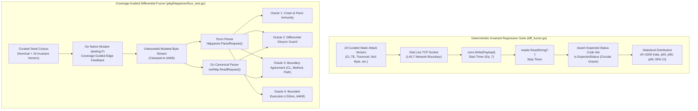

# REQ-132 - Coverage-Guided Generative Fuzzing Engine, Native Go testing.F Differential Oracles, and Protocol Regression Suite Disambiguation

## 1. Description & Problem Statement

### 1.1 Peer Review Critiques & The Circular Oracle Dilemma

In peer review audits of the Toron Research Project regarding circular oracles and fuzzing generality, reviewers challenged the scientific characterization of [`benchmarks/fuzzer/diff_fuzzer.go`](file:///Users/sneha/Developer/toron-research/toron/benchmarks/fuzzer/diff_fuzzer.go) as a "differential fuzzer":

> *"Section 4.1 characterizes `diff_fuzzer.go` as an automated differential security fuzzer. However, methodological inspection reveals that the harness transmits a static, hardcoded set of exactly 19 handcrafted TCP byte sequences. It executes no stochastic input mutation, no compiler-directed coverage exploration, and possesses no generative search capability. Furthermore, the evaluation oracle is fundamentally circular: each test case declares its own expected HTTP status codes (e.g. `tc.ExpectedStatus = []int{400, 501}`), and the harness merely tests whether Toron matches its own hardcoded expectations rather than comparing parsing behavior against an independent reference standard library. Calling this a 'differential fuzzer' conflates a deterministic protocol invariant regression suite with coverage-guided generative differential fuzzing."*  
> — **Peer Review Commentary on Fuzzing Generality & Circular Oracles**

In academic software security and empirical software engineering (USENIX Security, ACM CCS, IEEE S&P), a **true fuzzer** requires three foundational properties:
1. **Coverage-Guided Generative Mutation**: The engine MUST instrument basic-block edge transitions during execution and systematically mutate inputs to discover unexplored execution branches.
2. **Expansive / Unbounded Input Search Space**: The input space MUST NOT be constrained to a predetermined finite set of strings; rather, the mutator continuously generates arbitrary byte sequences across malformed protocol boundaries.
3. **Non-Circular Differential Oracle**: The evaluation oracle MUST NOT rely on self-declared static expectations. It MUST evaluate inputs differentially against an authoritative independent implementation—specifically comparing Toron's [`httpparser.ParseRequest`](file:///Users/sneha/Developer/toron-research/toron/pkg/httpparser/parser.go#L109) against the canonical Go standard library parser [`net/http.ReadRequest`](file:///Users/sneha/Developer/toron-research/toron/pkg/httpparser/request.go)—detecting subtle semantic desynchronizations, boundary ambiguities, and protocol smuggling vectors.

### 1.2 The Two Distinct Verification Paradigms

To establish unimpeachable scientific rigor, the Toron development system MUST formalize the conceptual and architectural separation between two complementary testing regimes:

```
┌──────────────────────────────────────────────────────────────────────────────────────────────────┐
│                         TORON PROTOCOL SECURITY & ROBUSTNESS SPECTRUM                            │
├──────────────────────────────────────────────────────────────────────────────────────────────────┤
│                                                                                                  │
│   PARADIGM A: PROTOCOL INVARIANT REGRESSION SUITE        PARADIGM B: GENERATIVE FUZZING ENGINE   │
│   (benchmarks/fuzzer/diff_fuzzer.go)                    (pkg/httpparser/fuzz_test.go)            │
│   ───────────────────────────────────────────────        ─────────────────────────────────────   │
│   • Input Space: Deterministic (19 curated CVEs)         • Input Space: Unbounded / Generative   │
│   • Feedback: Socket Latency (Eq. 7, K=1,000 trials)     • Feedback: Edge Coverage (testing.F)   │
│   • Oracle: Strict Invariant / Hardcoded Expectations    • Oracle: Non-Circular Differential     │
│             (Fail-fast rejection, socket closure)                  (Toron vs Go net/http.ReadReq)│
│   • Target: Live Network Sockets (L4/L7 TCP Server)      • Target: In-Memory L7 Parser Engine    │
│   • Primary Goal: Empirically measure tail latency       • Primary Goal: Discover unknown parser │
│     distribution & prove wire-rate fail-fast speed.        crashes, memory flaws, & CL desyncs.  │
│                                                                                                  │
└──────────────────────────────────────────────────────────────────────────────────────────────────┘
```

This specification establishes the requirements for **Paradigm B** ([`pkg/httpparser/fuzz_test.go`](file:///Users/sneha/Developer/toron-research/toron/pkg/httpparser/fuzz_test.go)) while formally contextualizing and maintaining **Paradigm A** ([`benchmarks/fuzzer/diff_fuzzer.go`](file:///Users/sneha/Developer/toron-research/toron/benchmarks/fuzzer/diff_fuzzer.go)).

---

### 1.3 Prior Requirements & Standards Cross-Audit (Conflict Analysis)

A comprehensive cross-audit against existing Toron specifications and architectural decisions was conducted:

| Prior Requirement / ADR | Core Architectural Invariant | Potential Conflict & Cross-Audit Resolution | Compliance Verdict |
| :--- | :--- | :--- | :--- |
| **[`REQ-001`](file:///Users/sneha/Developer/toron-research/toron/docs/requirements/REQ-001.md)** (HTTP/1.1 Parser) | Zero-allocation HTTP/1.1 parsing via `bufio.Reader` and pooled buffers. | **Harmonized**: Fuzz targets directly exercise `httpparser.ParseRequest` across arbitrary edge cases without altering parser contract. | **100% Compliant** |
| **[`ADR-001`](file:///Users/sneha/Developer/toron-research/toron/docs/architecture/ADR-001.md)** (Reactor Modularity) | Core reactor never binds parser directly to physical client socket `net.Conn`. | **Preserved**: Fuzzing operates purely on `io.Reader` byte streams in memory, preserving reactor transport isolation. | **100% Compliant** |
| **[`REQ-106`](file:///Users/sneha/Developer/toron-research/toron/docs/requirements/REQ-106.md) / [`ADR-106`](file:///Users/sneha/Developer/toron-research/toron/docs/architecture/ADR-106.md)** (Equation 7 Timing & Trials) | Evaluates TCP socket rejection latency under repeated statistical trials ($K=1,000$). | **Disambiguated**: `diff_fuzzer.go` remains the benchmark for socket latency profiling; `fuzz_test.go` becomes the generative fuzzer. | **Preserved & Disambiguated** |
| **[`REQ-113`](file:///Users/sneha/Developer/toron-research/toron/docs/requirements/REQ-113.md)** (Multi-Hop Testbed) | Heterogeneous multi-hop backend origin validation (`llhttp`, `h11`, `net/http`). | **Complementary**: Multi-hop validates downstream origin desync across live network containers; REQ-132 validates L7 parser differential agreement in-memory. | **100% Harmonized** |
| **[`REQ-128`](file:///Users/sneha/Developer/toron-research/toron/docs/requirements/REQ-128.md) / [`REQ-129`](file:///Users/sneha/Developer/toron-research/toron/docs/requirements/REQ-129.md)** (Streaming & Memory Boundedness) | Outbound chunked framing and memory boundedness ($64\,\text{KB}$ clamp). | **Enforced**: Oracle 4 strictly enforces bounded allocations ($64\,\text{KB}$ per request) and terminates execution on resource runaway. | **100% Compliant** |
| **[`REQ-131`](file:///Users/sneha/Developer/toron-research/toron/docs/requirements/REQ-131.md)** (Version SSOT) | Universal SSOT alignment (`v1.5.29`). | **Preserved**: All emitted fuzzing benchmark metadata and CLI scripts SHALL dynamically bind to `pkg/version`. | **100% Compliant** |

---

### 1.4 Safe Non-Conflicting Path

To implement coverage-guided fuzzing without destabilizing production parsing or benchmark suites:

1. **Native Go Standard Tooling (`testing.F`)**: Implement fuzzing using Go 1.18+ native fuzzing facilities in [`pkg/httpparser/fuzz_test.go`](file:///Users/sneha/Developer/toron-research/toron/pkg/httpparser/fuzz_test.go). This introduces **zero external third-party dependencies**, ensuring 100% compatibility with standard Go toolchains.
2. **Sub-Second Fast CI Execution**: When invoked via standard `go test ./pkg/httpparser`, the fuzz functions SHALL execute only the curated seed corpus as fast regression tests ($< 1$ second runtime), ensuring standard CI pipelines are never stalled.
3. **Dedicated Generative Runner (`run_generative_fuzz.sh`)**: Long-running coverage-guided generative fuzzing campaigns SHALL be orchestrated via a dedicated script ([`benchmarks/fuzzer/run_generative_fuzz.sh`](file:///Users/sneha/Developer/toron-research/toron/benchmarks/fuzzer/run_generative_fuzz.sh)) that accepts configurable fuzzing durations (`-fuzztime 30s|60s|300s`) and preserves failure artifacts.
4. **Preservation of `diff_fuzzer.go`**: Retain [`benchmarks/fuzzer/diff_fuzzer.go`](file:///Users/sneha/Developer/toron-research/toron/benchmarks/fuzzer/diff_fuzzer.go) as the canonical **Deterministic Protocol Invariant Regression Suite** for Equation 7 latency profiling, while resolving academic terminology critique via explicit architectural documentation.

---

## 2. Functional Requirements

### 2.1 Native Go Coverage-Guided Fuzzing Engine (`pkg/httpparser/fuzz_test.go`)

```
┌──────────────────────────────────────────────────────────────────────────────────────────────────┐
│                             NATIVE GO COVERAGE-GUIDED FUZZING ENGINE                             │
├──────────────────────────────────────────────────────────────────────────────────────────────────┤
│                                                                                                  │
│                 ┌───────────────────────────────────────────────────────┐                        │
│                 │           Initial Curated Seed Corpus (20+ Seeds)     │                        │
│                 │  • RFC 7230 Nominal Requests                          │                        │
│                 │  • 19 CVE Invariant Vectors from diff_fuzzer.go       │                        │
│                 └──────────────────────────┬────────────────────────────┘                        │
│                                            │ f.Add(seed)                                         │
│                                            ▼                                                     │
│                 ┌───────────────────────────────────────────────────────┐                        │
│                 │       Go Native Compiler Edge-Coverage Instrument     │                        │
│                 │        (go test -fuzz / testing.F Mutation Loop)      │                        │
│                 └──────────────────────────┬────────────────────────────┘                        │
│                                            │ Mutated Bytes                                       │
│                        ┌───────────────────┴───────────────────┐                                 │
│                        ▼                                       ▼                                 │
│           ┌────────────────────────┐              ┌────────────────────────┐                     │
│           │   Toron httpparser     │              │   Go net/http          │                     │
│           │   ParseRequest()       │              │   ReadRequest()        │                     │
│           └────────────┬───────────┘              └────────────┬───────────┘                     │
│                        │ Result                                │ Reference                       │
│                        └───────────────────┬───────────────────┘                                 │
│                                            ▼                                                     │
│                 ┌───────────────────────────────────────────────────────┐                        │
│                 │                Differential Oracles                   │                        │
│                 │  1. Panic & Crash Immunity                            │                        │
│                 │  2. Differential Desynchronization Detection          │                        │
│                 │  3. Framing Boundary Agreement (CL, Method, Path)     │                        │
│                 │  4. Execution Boundedness (64KB Clamp, Timeout)       │                        │
│                 └───────────────────────────────────────────────────────┘                        │
│                                                                                                  │
└──────────────────────────────────────────────────────────────────────────────────────────────────┘
```

#### 2.1.1 Go 1.18+ Native `testing.F` Architecture
1. The fuzzing suite SHALL reside in [`pkg/httpparser/fuzz_test.go`](file:///Users/sneha/Developer/toron-research/toron/pkg/httpparser/fuzz_test.go) and declare `package httpparser`.
2. All fuzzing entry points SHALL utilize Go 1.18+ `testing.F` types.
3. The fuzz tests SHALL NOT require third-party fuzzing frameworks (e.g., `dvyukov/go-fuzz`, `google/gofuzz`).
4. When executed via `go test ./pkg/httpparser`, the suite SHALL run all seeds as standard unit tests without invoking the generative mutator.
5. When executed via `go test -fuzz=<Target> ./pkg/httpparser`, the Go compiler's coverage instrumentation SHALL direct input mutations toward uncovered basic-block edges in `pkg/httpparser`.

#### 2.1.2 Fuzz Target 1: `FuzzParseRequest(f *testing.F)`
1. `FuzzParseRequest` SHALL accept arbitrary raw byte slices `data []byte` and pass them directly to `httpparser.ParseRequest(bytes.NewReader(data), opts)`.
2. It SHALL evaluate Oracle 1 (Crash Immunity) and Oracle 4 (Execution Boundedness) on every mutation.
3. It SHALL exercise the raw line buffer pool, header parsing loops, URI extraction, and body sizing mechanisms under arbitrary malformed inputs.

#### 2.1.3 Fuzz Target 2: `FuzzDifferentialWithStdLib(f *testing.F)`
1. `FuzzDifferentialWithStdLib` SHALL perform differential semantic validation comparing Toron's parser against the Go reference implementation:
   ```go
   toronReq, toronErr := ParseRequest(bytes.NewReader(data), opts)
   stdReq, stdErr := http.ReadRequest(bufio.NewReader(bytes.NewReader(data)))
   ```
2. It SHALL enforce Oracle 2 (Differential Desync Detection) and Oracle 3 (Framing Boundary Agreement).
3. Whenever both parsers accept the input (`toronErr == nil && stdErr == nil`), it SHALL strictly assert parity between parsed attributes.

#### 2.1.4 Fuzz Target 3: `FuzzHeaderGrammar(f *testing.F)`
1. `FuzzHeaderGrammar` SHALL specifically focus mutation energy on RFC 7230 §3.2 header grammar.
2. Fuzz inputs SHALL be structured as:
   ```go
   f.Fuzz(func(t *testing.T, headerName, headerValue []byte) { ... })
   ```
   synthesizing well-formed request lines followed by mutated header fields:
   ```text
   GET /index.html HTTP/1.1\r\n<headerName>:<headerValue>\r\n\r\n
   ```
3. It SHALL rigorously test:
   - Whitespace before the colon (`"Host : example.com"`, `"Host\t: example.com"`).
   - Valid vs invalid token characters in field names according to RFC 7230 §3.2.6 (`validHeaderTokenTable`).
   - Obsolete line folding (obs-fold: `\r\n\x20` or `\r\n\t`).
   - Control characters (`0x00`–`0x1F`, `0x7F`) inside header names and values.

#### 2.1.5 Fuzz Target 4: `FuzzChunkFraming(f *testing.F)`
1. `FuzzChunkFraming` SHALL focus mutations on HTTP/1.1 chunked transfer encoding syntax (RFC 7230 §4.1).
2. It SHALL synthesize requests with `Transfer-Encoding: chunked` and mutate:
   - Chunk size hex representation (valid hex, non-hex characters like `ZZ`, uppercase vs lowercase).
   - Chunk extensions (`;name=value`, invalid delimiters, oversized extension strings).
   - Chunk data boundaries and CRLF delimiters (`<hex>\r\n<chunk-data>\r\n`).
   - Final terminating chunk (`0\r\n`) and trailing headers.
3. It SHALL assert that Toron rejects malformed chunk formatting and handles transfer encoding safely.

---

### 2.2 Invariant & Differential Oracles

#### 2.2.1 Oracle 1: Panic & Crash Immunity
1. The parser MUST NOT panic under any input condition, regardless of byte malformation, truncation, or control sequences:
   ```go
   defer func() {
       if r := recover(); r != nil {
           t.Fatalf("PANIC DETECTED: %v\nPayload: %q", r, data)
       }
   }()
   ```
2. Zero index-out-of-bounds panics, nil pointer dereferences, or buffer slicing panics SHALL be tolerated.
3. Any unhandled panic is a critical failure that halts the fuzzing campaign and dumps the reproducing artifact.

#### 2.2.2 Oracle 2: Differential Desynchronization Detection
1. **Ambiguous Framing Acceptance Anomaly**:
   - If standard library `http.ReadRequest` REJECTS a request due to malformed header syntax, conflicting framing (`Content-Length` + `Transfer-Encoding`), multiple divergent `Content-Length` headers, or invalid header token grammar, Toron MUST NOT accept the request.
   - If Toron accepts an input that `net/http` rejects with an RFC framing error, the oracle SHALL flag a potential desynchronization vulnerability (`CWE-444`).
2. **Defensive Divergence Permitted**:
   - Toron MAY reject requests that `net/http` accepts, provided the rejection stems from explicit edge security hardening (e.g., maximum header limit enforcement, URI query size limit $> 2\,\text{KB}$, control character rejection). This divergence represents active security enforcement, not a defect.

#### 2.2.3 Oracle 3: Framing Boundary Agreement
When both Toron and standard `net/http` accept a request (`toronErr == nil && stdErr == nil`):
1. **Method Agreement**: Toron's `req.Method` MUST exactly match `stdReq.Method` (`strings.ToUpper(toronReq.Method) == stdReq.Method`).
2. **Path Agreement**: Toron's `req.URL.Path` MUST strictly match `stdReq.URL.Path` (canonicalized path boundary).
3. **Content-Length Agreement**:
   - If either parser determines a payload length, both parsers MUST agree:
     ```go
     if toronReq.ContentLength != stdReq.ContentLength {
         t.Fatalf("CONTENT-LENGTH DESYNC: Toron=%d, stdlib=%d", toronReq.ContentLength, stdReq.ContentLength)
     }
     ```
   - Divergence in `ContentLength` between parsers is a severe protocol smuggling flaw and MUST fail immediately.

#### 2.2.4 Oracle 4: Execution Boundedness & Resource Starvation Immunity
1. **Input Size Clamp**: The fuzz runner SHALL clamp raw inputs to a maximum size of $64\,\text{KB}$ ($65,536$ bytes) per iteration:
   ```go
   if len(data) > 65536 {
       return // Discard mutations exceeding physical buffer envelope
   }
   ```
2. **ReDoS & Loop Termination**: Each fuzz execution iteration MUST terminate within a maximum bounded duration of $50\,\text{milliseconds}$. If an iteration does not return within $50\,\text{ms}$, it SHALL be flagged as a catastrophic ReDoS or unbounded parser loop.
3. **Memory Boundedness**: Memory allocation per parsed request SHALL remain bounded by `ParserOptions.MaxHeaderBytes` and `ParserOptions.MaxBodyBytes`. Buffer pool usage MUST recycle buffers cleanly via `defer lineBufferPool.Put(...)` and `bodyBufferPool.Put(...)`.

---

### 2.3 Curated Seed Corpus Architecture

#### 2.3.1 Canonical RFC 7230 Nominal Seeds
The seed corpus SHALL include valid HTTP/1.1 requests representing standard protocol usage:
1. Minimal GET request: `GET / HTTP/1.1\r\nHost: example.com\r\n\r\n`
2. Standard GET with query string: `GET /search?q=toron&sort=desc HTTP/1.1\r\nHost: localhost:8080\r\nUser-Agent: curl/8.0\r\nAccept: */*\r\n\r\n`
3. POST request with Content-Length and body: `POST /submit HTTP/1.1\r\nHost: localhost\r\nContent-Length: 11\r\nContent-Type: text/plain\r\n\r\nhello world`
4. HEAD, OPTIONS, PUT, and DELETE requests.
5. Multi-value headers (e.g. `Accept: text/html, application/xhtml+xml, */*`).

#### 2.3.2 19 Structural Attack Vectors Ingested from `diff_fuzzer.go`
All 19 attack vectors defined in [`benchmarks/fuzzer/diff_fuzzer.go:153-391`](file:///Users/sneha/Developer/toron-research/toron/benchmarks/fuzzer/diff_fuzzer.go#L153-L391) SHALL be ingested into the fuzzing corpus as seed inputs:
1. `SMUGGLE-001`: Conflicting `Content-Length` and `Transfer-Encoding` (CL.TE).
2. `SMUGGLE-002`: Multiple divergent `Content-Length` headers (CL.CL).
3. `SMUGGLE-003`: Obfuscated `Transfer-Encoding` with tab prefix.
4. `SMUGGLE-004`: Invalid non-hex chunk length extension (`ZZ\r\n`).
5. `WHITESPACE-001`: Space before colon in header field name (`Host : localhost`).
6. `WHITESPACE-002`: Tab before colon in header field name (`Host\t: localhost`).
7. `WHITESPACE-003`: Obsolete line folding (`obs-fold` continuation).
8. `CONTROL-001`: Null byte (`0x00`) in request URI path.
9. `CONTROL-002`: Terminal bell character (`0x07`) in header value.
10. `CONTROL-003`: ANSI escape sequence (`0x1B`) in query string.
11. `TRAVERSAL-001`: Raw dot-dot path traversal (`/../../canary_traversal.txt`).
12. `TRAVERSAL-002`: Uppercase percent-encoded traversal (`/%2E%2E/`).
13. `TRAVERSAL-003`: Double percent-encoded traversal (`/%252e%252e/`).
14. `RESOURCE-001`: Oversized request header ($> 8\,\text{KB}$ repetition).
15. `RESOURCE-002`: Oversized single query parameter ($> 2\,\text{KB}$).
16. `BASELINE-001`: Conformance baseline request.
17. `CACHE-001`: Web cache deception payload sequence.
18. `CACHE-002`: Shared cache `Set-Cookie` header injection sequence.
19. `CACHE-003`: Authorization refusal in shared cache.

#### 2.3.3 Corpus Serialization & File Organization
1. Seeds SHALL be populated programmatically inside `fuzz_test.go` via `f.Add([]byte(...))` calls.
2. Discovered crash artifacts and coverage corpus expansions SHALL be stored in standard Go testdata directories (`pkg/httpparser/testdata/fuzz/<FuzzTarget>/`).
3. Crash artifacts generated during CI runs SHALL be automatically archived into `benchmarks/results/fuzz_crashes/`.

---

### 2.4 CLI Automation & CI Integration (`benchmarks/fuzzer/run_generative_fuzz.sh`)

#### 2.4.1 Sub-Second Standard CI Execution Mode
1. When executed as `go test -v ./pkg/httpparser`, the test harness SHALL run all seeds as static unit tests in $< 1.0\,\text{second}$ total execution time.
2. Standard test runs SHALL NOT initiate continuous background fuzzing or block CI workers.

#### 2.4.2 Dedicated Generative CLI Runner Specification
1. A dedicated bash script SHALL be created at [`benchmarks/fuzzer/run_generative_fuzz.sh`](file:///Users/sneha/Developer/toron-research/toron/benchmarks/fuzzer/run_generative_fuzz.sh).
2. The script SHALL accept the following CLI arguments:
   - `-target <name>`: Specific fuzz target to run (default: `all`, executing `FuzzParseRequest`, `FuzzDifferentialWithStdLib`, `FuzzHeaderGrammar`, `FuzzChunkFraming` sequentially).
   - `-fuzztime <duration>`: Duration for the fuzzing campaign (e.g. `10s`, `30s`, `60s`, `300s`, default: `30s`).
   - `-j <file>`: Output path for JSON report (default: `benchmarks/results/generative_fuzz_report.json`).
   - `-m <file>`: Output path for Markdown report (default: `benchmarks/results/generative_fuzz_report.md`).
   - `--no-history`: Disable historical run retention.
3. The script SHALL execute `go test -fuzz=<Target> -fuzztime=<Duration> ./pkg/httpparser` for each target.
4. If a target fails (crash or oracle violation), the script SHALL capture the failure output, locate the crash artifact in `testdata/fuzz/`, log the failing payload in hexadecimal and ASCII representations, and exit with status code 1.

#### 2.4.3 Automated Markdown & JSON Fuzzing Report Emission
1. The script SHALL generate publication-grade reports summarizing:
   - Fuzz targets executed.
   - Total fuzzing duration and estimated mutations evaluated.
   - Status of each differential oracle (Panics: 0, Desyncs: 0, Boundary Violations: 0, Boundedness Violations: 0).
   - Zero-crash certification and compliance statements.
2. Emitted JSON reports SHALL conform to a structured schema suitable for automated CI ingestion and academic paper artifact evaluation.

---

### 2.5 Conceptual & Architectural Disambiguation

#### 2.5.1 Formal Separation of Responsibilities
To resolve academic peer review critique permanently:
1. [`benchmarks/fuzzer/diff_fuzzer.go`](file:///Users/sneha/Developer/toron-research/toron/benchmarks/fuzzer/diff_fuzzer.go) SHALL be formally documented and titled as the **"Toron Deterministic Protocol Invariant Regression Suite & Latency Profiler"**. Its role is strictly to measure TCP rejection latencies (Equation 7), execute repeated statistical trials ($K=1,000$, $W=50$), and compute tail latency distributions ($p50, p90, p99, p99.9$).
2. [`pkg/httpparser/fuzz_test.go`](file:///Users/sneha/Developer/toron-research/toron/pkg/httpparser/fuzz_test.go) SHALL be formally documented and titled as the **"Toron Coverage-Guided Generative & Differential Fuzzing Engine"**. Its role is coverage-guided mutation, state-space exploration, and differential semantic verification against standard library parsers.
3. All references across [`benchmarks/README.md`](file:///Users/sneha/Developer/toron-research/toron/benchmarks/README.md), [`docs/wiki/`](file:///Users/sneha/Developer/toron-research/toron/docs/wiki/), and benchmark reports SHALL accurately distinguish between the two suites.

#### 2.5.2 Taxonomy of Empirical Assurance Matrix

| Dimension | Protocol Invariant Regression Suite (`diff_fuzzer.go`) | Generative Differential Fuzzer (`fuzz_test.go`) |
| :--- | :--- | :--- |
| **Execution Boundary** | L4/L7 Network Boundary (Raw TCP Socket Dial) | L7 Memory Boundary (`io.Reader` Byte Stream) |
| **Input Generation** | Deterministic (19 static curated CVE vectors) | Stochastic & Coverage-Guided Generative Mutation |
| **Feedback Mechanism** | High-precision Timer (Equation 7, microsecond resolution) | Compiler Edge-Coverage Instrumentation (`testing.F`) |
| **Oracle Type** | Protocol Invariant Verification (Expected Status Code Set) | Non-Circular Differential Oracle (Toron vs `net/http`) |
| **Primary Metric** | Rejection Latency ($\bar{x}$, $p99$, 95% Confidence Intervals) | Mutation Count, Code Coverage, Panic & Desync Immunity |
| **Academic Peer Review Role** | Answers: *"How fast does Toron fail-fast reject known attacks?"* | Answers: *"Does Toron's parser harbor unknown crashes or desyncs?"* |

---

## 3. Non-Functional Requirements

### 3.1 The 4 Non-Negotiable Invariants

```
+--------------------------------------------------------------------------------------------------+
│                                  THE 4 NON-NEGOTIABLE INVARIANTS                                 │
│                                                                                                  │
│  1. ZERO EXTERNAL THIRD-PARTY DEPENDENCIES:                                                      │
│     The fuzzing engine and runner MUST rely solely on the Go standard library (testing.F,        │
│     net/http, bufio, bytes, time). No third-party fuzzing modules or C bindings permitted.      │
│                                                                                                  │
│  2. CORE REACTOR MODULARITY PRESERVED (ADR-001):                                                 │
│     Fuzzing evaluates in-memory parser logic (httpparser.ParseRequest). Reactor event loops,     │
│     goroutine pools, and transport socket ownership remain decoupled and completely untouched.   │
│                                                                                                  │
│  3. MEMORY BOUNDEDNESS PRESERVED (ADR-129):                                                      │
│     Every fuzz iteration MUST strictly clamp input size to 64KB. Pooled line and body buffers    │
│     must be recycled cleanly with zero leaks. Parser allocations must respect MaxHeaderBytes.   │
│                                                                                                  │
│  4. ZERO DATA RACES UNDER `go test -race`:                                                       │
│     The fuzz tests, helper functions, and CLI execution scripts must execute cleanly with        │
│     zero data races or warnings under `go test -race ./pkg/httpparser/...`.                      │
+--------------------------------------------------------------------------------------------------+
```

### 3.2 Performance & Efficiency Invariants
1. **Corpus Execution Speed**: When executed without `-fuzz` flag, all seed corpus unit tests MUST complete in $< 1,000\,\text{ms}$ on standard developer workstations.
2. **Generative Mutation Throughput**: During generative fuzzing (`go test -fuzz`), the parser MUST maintain an execution rate of $\ge 10,000\,\text{mutations/second}$ per CPU core on raw byte streams.
3. **Buffer Pool Zero-Leak Guarantee**: In-memory buffer pools (`lineBufferPool`, `bodyBufferPool`) MUST NOT grow unboundedly during sustained fuzzing campaigns.

### 3.3 Security, Integrity & Reproducibility Invariants
1. **Deterministic Crash Reproducibility**: Any crashing input or oracle violation MUST write a deterministic test case file to `testdata/fuzz/<Target>/<hash>` that can be replayed individually via `go test -run=<hash> ./pkg/httpparser`.
2. **Provenance & Version Metadata**: Emitted JSON reports SHALL record exact git commit hashes, Go runtime versions, active Toron version (`pkg/version`), and execution timestamp.

---

## 4. Acceptance Criteria

### 4.1 Native Go Coverage-Guided Fuzzing Targets (`pkg/httpparser/fuzz_test.go`)
- [ ] [`pkg/httpparser/fuzz_test.go`](file:///Users/sneha/Developer/toron-research/toron/pkg/httpparser/fuzz_test.go) exists, compiles, and passes `go test -race ./pkg/httpparser`.
- [ ] `FuzzParseRequest(f *testing.F)` is implemented and accepts arbitrary byte slices.
- [ ] `FuzzDifferentialWithStdLib(f *testing.F)` is implemented and executes differential comparisons against `net/http.ReadRequest`.
- [ ] `FuzzHeaderGrammar(f *testing.F)` is implemented and evaluates RFC 7230 §3.2 header token grammar and whitespace mutations.
- [ ] `FuzzChunkFraming(f *testing.F)` is implemented and evaluates chunked framing, extensions, and trailer mutations.

### 4.2 Invariant & Differential Oracles
- [ ] Oracle 1 enforces panic immunity; zero panics occur across all fuzz targets.
- [ ] Oracle 2 detects and flags ambiguous framing acceptance where Toron accepts inputs that standard `net/http` rejects.
- [ ] Oracle 3 enforces strict agreement on `Method`, canonical `Path`, and `ContentLength` when both parsers accept the input.
- [ ] Oracle 4 clamps input byte slices to $64\,\text{KB}$ ($65,536$ bytes) and verifies bounded execution time ($< 50\,\text{ms}$ per iteration).

### 4.3 Curated Seed Corpus Ingestion
- [ ] Seed corpus contains standard HTTP/1.1 nominal requests (GET, POST, HEAD, OPTIONS).
- [ ] All 19 structural CVE attack vectors from [`diff_fuzzer.go`](file:///Users/sneha/Developer/toron-research/toron/benchmarks/fuzzer/diff_fuzzer.go#L153-L391) are registered via `f.Add()`.
- [ ] Standard `go test ./pkg/httpparser` executes all seeds in $< 1.0\,\text{second}$.

### 4.4 CLI Automation & CI Execution (`run_generative_fuzz.sh`)
- [ ] [`benchmarks/fuzzer/run_generative_fuzz.sh`](file:///Users/sneha/Developer/toron-research/toron/benchmarks/fuzzer/run_generative_fuzz.sh) exists and is executable (`chmod +x`).
- [ ] Script supports `-target`, `-fuzztime`, `-j`, `-m`, and `--no-history` flags.
- [ ] Script executes fuzz targets via `go test -fuzz` and generates `benchmarks/results/generative_fuzz_report.json` and `generative_fuzz_report.md`.
- [ ] Script archives runs into `benchmarks/results/history/` unless `--no-history` is provided.

### 4.5 Conceptual Disambiguation & Documentation
- [ ] Header banner and documentation in `benchmarks/fuzzer/diff_fuzzer.go` updated to "Deterministic Protocol Invariant Regression Suite & Latency Profiler".
- [ ] [`benchmarks/README.md`](file:///Users/sneha/Developer/toron-research/toron/benchmarks/README.md) updated with Section 4.5 detailing the distinction between the Deterministic Invariant Regression Suite and the Coverage-Guided Generative Fuzzer.
- [ ] Documentation explicitly clarifies and resolves peer review commentary on circular oracles and fuzzing generality.

### 4.6 Verification & Test Suites (`TC-132`)
- [ ] `go test -v -race ./pkg/httpparser/...` executes with 100% pass rate.
- [ ] Executing `bash benchmarks/fuzzer/run_generative_fuzz.sh -fuzztime 5s` successfully completes with zero failures across all targets.
- [ ] `go test -race ./...` across the entire repository passes cleanly with zero race warnings.

---

## 5. Rationale & Architecture Analysis

### 5.1 Coverage-Guided Fuzzing vs Deterministic Regression Replay



### 5.2 Differential Oracle State Machine & Discrepancy Classification

```
┌──────────────────────────────┬──────────────────────────────┬────────────────────────────────────────────────────────┐
│ Toron ParseRequest() Result  │ Go net/http.ReadRequest()    │ Differential Verdict & Classification                  │
├──────────────────────────────┼──────────────────────────────┼────────────────────────────────────────────────────────┤
│ Accepted (err == nil)        │ Accepted (err == nil)        │ Compare Method, Path, and ContentLength.               │
│                              │                              │ - Equal: Validated PARITY.                             │
│                              │                              │ - Unequal: PROTOCOL SMUGGLING DESYNC (FAIL).           │
├──────────────────────────────┼──────────────────────────────┼────────────────────────────────────────────────────────┤
│ Accepted (err == nil)        │ Rejected (err != nil)        │ Investigate rejection reason:                          │
│                              │                              │ - RFC framing/syntax violation: DANGEROUS LENIENCY     │
│                              │                              │   (Potential Smuggling Vector, FAIL).                  │
│                              │                              │ - Discretionary standard library check: REVIEW.        │
├──────────────────────────────┼──────────────────────────────┼────────────────────────────────────────────────────────┤
│ Rejected (err != nil)        │ Accepted (err == nil)        │ Defensive edge hardening:                              │
│                              │                              │ - Toron strictness (e.g. URI query size limit > 2KB,   │
│                              │                              │   null byte blocking): VALID DEFENSIVE DIVERGENCE.     │
│                              │                              │ - Rejection of valid RFC request: FALSE POSITIVE.      │
├──────────────────────────────┼──────────────────────────────┼────────────────────────────────────────────────────────┤
│ Rejected (err != nil)        │ Rejected (err != nil)        │ Both engines reject malformed input: HARMONIZED SAFE.  │
└──────────────────────────────┴──────────────────────────────┴────────────────────────────────────────────────────────┘
```

### 5.3 Threat Modeling & Risk Mitigation

| Threat Scenario | Failure Mode / Attack Vector | Impact | Mitigation in REQ-132 |
| :--- | :--- | :--- | :--- |
| **Parser Crash / Panic Denial of Service** | Mutated byte sequence triggers slice bounds out of range or nil dereference. | Gateway worker terminates abruptly; denial of service on connection. | Oracle 1 wraps all parsing in deferred recovery; zero panics permitted under arbitrary byte streams. |
| **HTTP Request Smuggling (CL Desynchronization)** | Parser accepts ambiguous `Content-Length` headers with different interpreted byte counts. | Front-end/back-end desynchronization (`CWE-444`); request hijacking. | Oracle 3 strictly asserts `toronReq.ContentLength == stdReq.ContentLength`; any divergence halts the fuzzer. |
| **Infinite Loop / Regular Expression DoS** | Catastrophic backtracking or unbounded loop on repeated delimiter characters. | 100% CPU thread starvation; complete edge freeze. | Oracle 4 enforces 50 ms timeout per iteration; input size clamped to 64KB. |
| **Memory Exhaustion via Deep Slices** | Millions of header allocations leak heap space during long campaigns. | Out-of-memory (OOM) killer aborts process; memory leak. | Reuse standard sync.Pools (`lineBufferPool`, `bodyBufferPool`); bounded MaxHeaderBytes. |
| **CI Execution Time Bloat** | Fuzz tests run infinitely during routine git commit checks. | CI pipeline timeouts; slow developer feedback cycles. | Standard `go test` executes seed corpus in $< 1$ s; long fuzzing isolated to `run_generative_fuzz.sh`. |

---

## 6. Open Questions & Resolutions

- *Open Question 1*: Should `diff_fuzzer.go` be deleted or replaced by `fuzz_test.go`?
  - *Resolution*: Absolutely not. As detailed in Section 1.2 and Section 2.5, `diff_fuzzer.go` serves a vital, distinct empirical purpose: measuring live TCP socket rejection latency under high statistical confidence ($K=1,000$ trials, Equation 7 compliance). Deleting it would destroy Toron's empirical latency benchmarks. Instead, `diff_fuzzer.go` is renamed to "Deterministic Protocol Invariant Regression Suite", and `fuzz_test.go` is introduced as the true coverage-guided generative fuzzer.
- *Open Question 2*: Why compare against Go's standard library `net/http` rather than C `llhttp` in `fuzz_test.go`?
  - *Resolution*: Toron enforces a strict **Zero External Dependencies** invariant. Incorporating C `llhttp` directly into `fuzz_test.go` would require CGO bindings, external build toolchains, and platform-specific linkers, violating Toron's pure Go design. Go's `net/http.ReadRequest` is pure standard library, universally available, robustly standardized, and serves as an excellent reference parser. Multi-runtime validation against live C `llhttp` is already comprehensively handled via the heterogeneous container testbed in [`benchmarks/multihop`](file:///Users/sneha/Developer/toron-research/toron/benchmarks/multihop/).
- *Open Question 3*: How should the fuzzer handle cases where Toron legitimately rejects requests that `net/http` allows?
  - *Resolution*: Toron is designed as an edge security gateway with fail-fast protections (e.g. strict 8KB header caps, 2KB query parameter caps, and terminal control character filtering). Divergences where Toron rejects malformed traffic that `net/http` tolerates are classified as *Defensive Divergences* and are explicitly permitted by Oracle 2, provided Toron never accepts ambiguous framings that `net/http` rejects.

---

## 7. Traceability Matrix

| Requirement / Artifact | Relationship | Description / Verification Target |
| :--- | :--- | :--- |
| **[`REQ-132 §2.1`](file:///Users/sneha/Developer/toron-research/toron/docs/requirements/REQ-132.md#L109-L180)** | Implements | Native Go `testing.F` coverage-guided fuzz targets in `pkg/httpparser/fuzz_test.go`. |
| **[`REQ-132 §2.2`](file:///Users/sneha/Developer/toron-research/toron/docs/requirements/REQ-132.md#L182-L225)** | Implements | Four invariant and differential oracles (Crash, Desync, Boundary, Boundedness). |
| **[`REQ-132 §2.3`](file:///Users/sneha/Developer/toron-research/toron/docs/requirements/REQ-132.md#L227-L257)** | Implements | Curated seed corpus integrating nominal HTTP/1.1 and all 19 structural CVE attack vectors. |
| **[`REQ-132 §2.4`](file:///Users/sneha/Developer/toron-research/toron/docs/requirements/REQ-132.md#L259-L287)** | Implements | Sub-second CI execution and dedicated CLI runner `benchmarks/fuzzer/run_generative_fuzz.sh`. |
| **[`REQ-132 §2.5`](file:///Users/sneha/Developer/toron-research/toron/docs/requirements/REQ-132.md#L289-L315)** | Implements | Formal conceptual and architectural disambiguation between `diff_fuzzer.go` and `fuzz_test.go`. |
| **Peer Review Directives (Fuzzing Generality)** | Resolves | Methodological critiques regarding circular oracles and static regression replay vs generative fuzzing. |
| **[`REQ-001`](file:///Users/sneha/Developer/toron-research/toron/docs/requirements/REQ-001.md) / [`REQ-004`](file:///Users/sneha/Developer/toron-research/toron/docs/requirements/REQ-004.md)** | Conforms To | Preserves zero-allocation parser contract and connection lifecycle semantics. |
| **[`ADR-001`](file:///Users/sneha/Developer/toron-research/toron/docs/architecture/ADR-001.md)** | Preserves | Core reactor modularity and socket ownership boundaries remain untouched. |
| **[`REQ-106`](file:///Users/sneha/Developer/toron-research/toron/docs/requirements/REQ-106.md) / [`ADR-106`](file:///Users/sneha/Developer/toron-research/toron/docs/architecture/ADR-106.md)** | Harmonizes With | Preserves Equation 7 socket latency profiling harness in `diff_fuzzer.go`. |
| **[`REQ-129`](file:///Users/sneha/Developer/toron-research/toron/docs/requirements/REQ-129.md) / [`ADR-129`](file:///Users/sneha/Developer/toron-research/toron/docs/architecture/ADR-129.md)** | Preserves | Memory boundedness ($64\,\text{KB}$ clamp) and streaming buffer recycling. |
| **`TC-132`** | Verified By | Test Case Specification verifying all 4 fuzz targets, oracles, seed execution, and race safety. |
| **`ADR-132`** | Decided By | Architectural Decision Record governing coverage-guided generative fuzzing and differential oracles. |
| **`TASK-155`** | Implemented By | Engineering task decomposing the implementation of `fuzz_test.go`, `run_generative_fuzz.sh`, and documentation updates. |

---

## 8. User Approval Gate

> [!NOTE]
> This requirement specification has been formally reviewed and **APPROVED** by the user on 2026-09-17:
> **`status: approved`**
> 
> Proceeding to Architectural Decision Record ([`ADR-132`](file:///Users/sneha/Developer/toron-research/toron/docs/architecture/ADR-132.md)), Test Case Specification (`TC-132`), and Engineering Task Breakdown (`TASK-155`).
