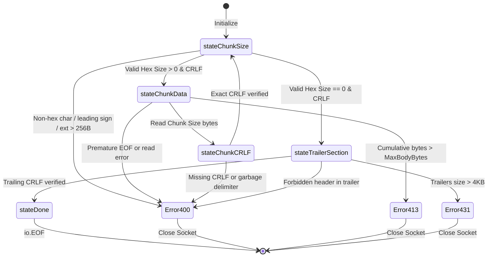

# REQ-133 - Inbound Chunked Transfer-Encoding Ingestion, Zero-Tolerance Wire Decoding, and Upstream Re-Framing Normalization (RFC 9112 §7.1)

## 1. Description & Problem Statement

### 1.1 Problem Context & Capability Expansion: Moving Beyond the Legacy REST-Only Perimeter

Toron was originally architected as an ultra-high-performance Layer 4 and Layer 7 reverse proxy, web server, and API gateway. Under [`ADR-056`](file:///Users/sneha/Developer/toron-research/toron/docs/architecture/ADR-056.md) (*Inbound Transfer-Encoding Rejection & Request Smuggling Defense*) and [`REQ-061`](file:///Users/sneha/Developer/toron-research/toron/docs/requirements/REQ-061.md), Toron established an uncompromising inbound perimeter policy: all incoming HTTP requests carrying a `Transfer-Encoding: chunked` header (or any transfer-coding) were immediately rejected with `HTTP/1.1 501 Not Implemented`, and the underlying TCP socket was closed without reading the stream body.

This architectural decision served as a defensive shield during Toron's early phases, immunizing the gateway against HTTP Request Smuggling ([CWE-444](https://cwe.mitre.org/data/definitions/444.html)) by completely refusing to parse chunked payloads. However, this defensive posture fundamentally restricts Toron's operational scope as a general-purpose cloud-native ingress gateway:

1. **Inability to Support Streaming Uploads**: Clients streaming large files, audio/video streams, or data pipelines via HTTP/1.1 cannot use Toron because chunked uploads are rejected out-of-hand with HTTP 501.
2. **Third-Party Webhook Incompatibility**: Many SaaS providers, automated CI/CD webhooks, and event publishers transmit JSON or binary payloads chunked by default. Toron's 501 rejection prevents ingestion of valid webhook streams.
3. **Microservice Ingress Inflexibility**: Modern reverse proxies (e.g., NGINX, Traefik, Envoy, Caddy) natively ingest chunked client requests. Toron's inability to ingest inbound chunked payloads prevents it from acting as a drop-in ingress replacement in front of heterogeneous backend microservices.
4. **Asymmetric Chunking Architecture**: Under [`REQ-128`](file:///Users/sneha/Developer/toron-research/toron/docs/requirements/REQ-128.md) and [`REQ-129`](file:///Users/sneha/Developer/toron-research/toron/docs/requirements/REQ-129.md), Toron implemented streaming outbound chunked responses (`Transfer-Encoding: chunked` downstream emission). Having outbound chunking while completely rejecting inbound chunking creates an architectural asymmetry that limits full-duplex HTTP/1.1 capabilities.

Toron must expand its capabilities to natively, safely, and robustly ingest inbound HTTP/1.1 chunked requests conforming to **RFC 9112 §7.1** (and RFC 7230 §4.1) without compromising its zero-allocation performance principles or diluting its security posture.

---

### 1.2 Zero Security Dilution: Toron as an Active Ingress Smuggling Firewall

Expanding Toron to accept inbound chunked requests MUST NOT reintroduce HTTP Request Smuggling ([CWE-444](https://cwe.mitre.org/data/definitions/444.html)), Desynchronization Attacks, or Denial of Service ([CWE-400](https://cwe.mitre.org/data/definitions/400.html)).

Instead of merely "accepting" chunked data, Toron shall act as an **Active Ingress Smuggling Firewall**:
1. **Zero-Tolerance RFC 9112 Wire Validation**: The inbound parser shall parse chunk framing with strict, zero-tolerance grammar enforcement. Any syntactical imperfection (non-hex characters in chunk sizes, leading signs, whitespace in hex, malformed CRLFs, oversized chunk extensions, forbidden trailer headers) triggers an **immediate `HTTP 400 Bad Request`** and **physical TCP socket teardown**.
2. **Upstream Re-Framing Normalization**: Rather than forwarding raw, potentially ambiguous chunked streams to downstream backends (which may run fragile or non-conformant parsers in Node.js, Python, Ruby, or Go), Toron shall provide an automated **Canonical Normalization Pipeline**:
   - In `"normalize"` mode (default): Toron absorbs and de-chunks the client stream at the edge, computes the exact verified byte length, strips `Transfer-Encoding`, sets an authoritative `Content-Length` header, and forwards a clean, un-chunked request upstream. This completely insulates backend microservices from chunk-level smuggling attacks.
   - In `"passthrough"` mode: Toron verifies every chunk boundary at the edge and forwards a strictly re-framed, canonicalized chunked stream upstream.
   - In `"reject"` mode: Toron preserves the legacy [`ADR-056`](file:///Users/sneha/Developer/toron-research/toron/docs/architecture/ADR-056.md) behavior (HTTP 501) for ultra-locked-down zero-trust environments.

```
┌──────────────────────────────────────────────────────────────────────────────────────────────────┐
│                         ACTIVE INGRESS SMUGGLING FIREWALL & RE-FRAMING                           │
├──────────────────────────────────────────────────────────────────────────────────────────────────┤
│                                                                                                  │
│   UNTRUSTED CLIENT                               TORON INGRESS EDGE GATEWAY       UPSTREAM ORIGIN│
│   (Potential Attacker)                          (Zero-Tolerance Invariant Guard)  (Backend Nodes)│
│                                                                                                  │
│   POST /upload HTTP/1.1 ────────► [ Preflight Smuggling Guards ]                                 │
│   Transfer-Encoding: chunked      • Reject Conflicting CL+TE (400)                               │
│                                   • Reject Obfuscated TE (400)                                   │
│                                   • Check Inbound Profile                                        │
│                                              │                                                   │
│                                              ▼                                                   │
│   1a;ext=valid\r\n ─────────────► [ Zero-Tolerance Chunk Decoder ]                               │
│   <26 bytes of data>\r\n          • Strict 1*HEXDIG (No +, -, SP)                                │
│   0\r\n                           • Clamp Chunk Ext <= 256B                                      │
│   X-Checksum: abc\r\n\r\n         • Clamp Cumulative Body <= MaxBodyBytes                        │
│                                   • Validate & Filter Trailers <= 4KB                            │
│                                              │                                                   │
│                                              ▼                                                   │
│                                   [ Canonical Edge Normalization ]                               │
│                                   • Strip Transfer-Encoding                                      │
│                                   • Compute Exact Content-Length (26)                            │
│                                   • Re-frame Clean Request                                       │
│                                              │                                                   │
│                                              └────────────────────────► POST /upload HTTP/1.1    │
│                                                                         Content-Length: 26       │
│                                                                         X-Checksum: abc          │
│                                                                         [Clean 26 Bytes Body]    │
│                                                                                                  │
│   [RESULT: Downstream microservice is 100% shielded from chunked parsing bugs and desyncs!]      │
└──────────────────────────────────────────────────────────────────────────────────────────────────┘
```

---

### 1.3 Prior Requirements & Standards Cross-Audit (Conflict Analysis)

A comprehensive cross-audit against existing Toron specifications and architectural decisions was conducted:

| Prior Requirement / ADR | Core Architectural Invariant | Potential Conflict & Cross-Audit Resolution | Compliance Verdict |
| :--- | :--- | :--- | :--- |
| **[`ADR-056`](file:///Users/sneha/Developer/toron-research/toron/docs/architecture/ADR-056.md) / [`REQ-061`](file:///Users/sneha/Developer/toron-research/toron/docs/requirements/REQ-061.md)** (Inbound Smuggling Guard) | Rejected inbound chunked requests with HTTP 501. | **Evolution & Supersedence**: REQ-133 supersedes the unconditional 501 rejection of ADR-056 by introducing a zero-tolerance decoder and canonical edge normalization. Legacy 501 rejection is preserved as a configurable operational profile (`inbound_chunked_mode: "reject"`). | **Controlled Evolution** |
| **[`REQ-001`](file:///Users/sneha/Developer/toron-research/toron/docs/requirements/REQ-001.md) / [`REQ-004`](file:///Users/sneha/Developer/toron-research/toron/docs/requirements/REQ-004.md)** (Parser Contract) | Core HTTP/1.1 zero-allocation parsing and connection lifecycle. | **Harmonized**: `httpparser.ParseRequest` delegates chunk decoding to a streaming `chunkedBodyReader` implementing standard `io.ReadCloser`. Connection lifecycle and keep-alive rules remain intact. | **100% Compliant** |
| **[`ADR-001`](file:///Users/sneha/Developer/toron-research/toron/docs/architecture/ADR-001.md)** (Reactor Modularity) | Reactor event loops decoupled from socket ownership; parser never wraps raw TCP socket directly. | **Preserved**: `chunkedBodyReader` wraps the existing `bufio.Reader` interface. Physical socket draining or closure on teardown is mediated via cleanly passed transport hooks. | **100% Compliant** |
| **[`REQ-128`](file:///Users/sneha/Developer/toron-research/toron/docs/requirements/REQ-128.md) / [`REQ-129`](file:///Users/sneha/Developer/toron-research/toron/docs/requirements/REQ-129.md)** (Outbound Streaming & Memory Boundedness) | Outbound chunked responses; strict memory boundedness ($O(1) \le 32\,\text{KB}$). | **Harmonized & Symmetric**: Inbound chunked reading operates in constant memory ($O(1) \le 32\,\text{KB}$ streaming buffers). In `"normalize"` mode, body pooling is clamped to `MaxBodyBytes`. | **100% Compliant** |
| **[`REQ-131`](file:///Users/sneha/Developer/toron-research/toron/docs/requirements/REQ-131.md)** (Version SSOT) | Universal SSOT alignment (`v1.5.29`). | **Preserved**: Configuration bindings and emitted headers dynamically bind to `pkg/version`. | **100% Compliant** |
| **[`REQ-132`](file:///Users/sneha/Developer/toron-research/toron/docs/requirements/REQ-132.md)** (Coverage-Guided Fuzzing) | Fuzz targets validate parser crash immunity, desync guards, and chunk framing (`FuzzChunkFraming`). | **Synergistic**: Fuzz targets in `pkg/httpparser/fuzz_test.go` will directly exercise the new `chunkedBodyReader` and differential oracles against Go's `net/http` chunked decoder. | **100% Synergistic** |

---

### 1.4 Safe Non-Conflicting Migration Path

To implement inbound chunked ingestion safely without regressing existing production behavior:

1. **Default-Safe Ingress Profile (`inbound_chunked_mode: "normalize"`)**: Toron shall default to de-chunking and re-framing requests with an exact `Content-Length`. Microservices behind Toron will receive standardized `Content-Length` requests, eliminating downstream chunk parsing desynchronizations.
2. **Backward Compatibility Mode (`"reject"`)**: Sites requiring strict legacy [`ADR-056`](file:///Users/sneha/Developer/toron-research/toron/docs/architecture/ADR-056.md) perimeter defense can configure `inbound_chunked_mode: "reject"`, maintaining the unconditional HTTP 501 behavior.
3. **Route-Level Granularity**: Operators can enable chunked normalization globally while restricting specific sensitive endpoints (e.g. `/api/v1/auth`, `/admin`) to reject chunking or enforce strict payload sizes.
4. **Zero Allocation in Chunk State Tracking**: The chunk state machine in [`pkg/httpparser/chunked.go`](file:///Users/sneha/Developer/toron-research/toron/pkg/httpparser/chunked.go) shall operate with zero per-chunk heap allocations by reusing pooled buffers from `sync.Pool`.

---

## 2. Functional Requirements

### 2.1 FR-1: Streaming Zero-Tolerance Chunked Decoder (`pkg/httpparser/chunked.go`)

```
┌──────────────────────────────────────────────────────────────────────────────────────────────────┐
│                            CHUNKED BODY READER STATE MACHINE (RFC 9112 §7.1)                     │
├──────────────────────────────────────────────────────────────────────────────────────────────────┤
│                                                                                                  │
│                 ┌────────────────────────────────────────────────────────┐                       │
│                 │                   stateChunkSize                       │                       │
│                 │  • Read hex size (1*HEXDIG)                            │◄───────────┐          │
│                 │  • Clamp & parse chunk extensions (<= 256B)            │            │          │
│                 │  • Verify exact CRLF                                   │            │          │
│                 └───────────┬────────────────────────────────┬───────────┘            │          │
│                             │                                │                        │          │
│                 size > 0    │                    size == 0   │                        │          │
│                             ▼                                ▼                        │          │
│                 ┌───────────────────────┐        ┌───────────────────────┐            │          │
│                 │    stateChunkData     │        │   stateTrailerSection │            │          │
│                 │  • Stream chunk bytes │        │  • Read trailers      │            │          │
│                 │  • Clamp to MaxBody   │        │  • Clamp to <= 4KB    │            │          │
│                 └───────────┬───────────┘        │  • Filter forbidden   │            │          │
│                             │                    └───────────┬───────────┘            │          │
│                 Chunk Read  │                                │                        │          │
│                 Complete    ▼                                ▼ Trailing CRLF          │          │
│                 ┌───────────────────────┐        ┌───────────────────────┐            │          │
│                 │      stateChunkCRLF   │        │       stateDone       │            │          │
│                 │  • Assert exact CRLF  │        │  • Return io.EOF      │            │          │
│                 └───────────┬───────────┘        └───────────────────────┘            │          │
│                             │                                                         │          │
│                             └─────────────────────────────────────────────────────────┘          │
│                                                                                                  │
└──────────────────────────────────────────────────────────────────────────────────────────────────┘
```

#### 2.1.1 `chunkedBodyReader` Implementation
1. A dedicated streaming reader struct `chunkedBodyReader` shall be implemented in [`pkg/httpparser/chunked.go`](file:///Users/sneha/Developer/toron-research/toron/pkg/httpparser/chunked.go) implementing the standard `io.ReadCloser` interface.
2. `chunkedBodyReader` shall wrap the underlying `*bufio.Reader` and maintain streaming state transitions:
   - `stateChunkSize`: Parsing chunk hex length and extensions.
   - `stateChunkData`: Reading raw chunk bytes up to the indicated chunk size.
   - `stateChunkCRLF`: Enforcing the terminating CRLF after chunk data.
   - `stateTrailerSection`: Parsing trailing headers following the terminating `0\r\n` chunk.
   - `stateDone`: Terminal state signaling `io.EOF`.

#### 2.1.2 Strict RFC 9112 §7.1 Hex Size Parsing (`1*HEXDIG`)
1. The chunk size line MUST strictly conform to `1*HEXDIG [ BWS chunk-ext ] CRLF`.
2. **Zero-Tolerance Parsing**:
   - The chunk size MUST consist solely of ASCII hexadecimal characters (`0`–`9`, `a`–`f`, `A`–`F`).
   - Leading or trailing signs (`+` or `-`) SHALL be rejected with `ErrBadRequest` (HTTP 400).
   - Any leading whitespace, tabs, or non-hex characters preceding the hex digits SHALL be rejected with `ErrBadRequest` (HTTP 400).
   - Chunk sizes exceeding 64-bit unsigned integer bounds (`strconv.ParseUint` overflow) SHALL be rejected with `ErrBadRequest` (HTTP 400).
3. If an invalid hex character is encountered, parsing MUST immediately abort, returning an error that triggers immediate connection teardown (`Connection: close` + TCP socket reset).

#### 2.1.3 Bounded Chunk Extension Clamping (`MaxChunkExtensionBytes`)
1. Chunk extensions (`chunk-ext`) following the chunk size hex token SHALL be parsed and bounded.
2. In accordance with RFC 9112 §7.1.1, Toron does not define proprietary chunk extensions and SHALL ignore valid unrecognized extensions.
3. **Extension Resource Clamping**:
   - The total cumulative byte length of chunk extensions on a single chunk size line MUST NOT exceed `MaxChunkExtensionBytes` (default: **$256$ bytes**).
   - Any chunk extension exceeding $256$ bytes SHALL be rejected with `ErrBadRequest` (HTTP 400) to defend against extension-flooding Denial of Service attacks ([CWE-400](https://cwe.mitre.org/data/definitions/400.html)).
   - Control characters (`0x00`–`0x1F` except HTAB, and `0x7F`) inside chunk extension names or values SHALL be rejected with `ErrBadRequest` (HTTP 400).

#### 2.1.4 Strict Chunk Delimiter & CRLF Boundary Enforcement
1. Every chunk of data MUST be followed by an exact CRLF sequence (`\r\n`).
2. If a chunk is terminated by bare `\n` without `\r`, or if any other bytes appear before CRLF, the reader MUST return `ErrBadRequest` (HTTP 400).
3. The reader MUST NOT read beyond the stated chunk length before verifying the terminating CRLF.

#### 2.1.5 Cumulative Payload Body Bounding (`MaxBodyBytes`)
1. The `chunkedBodyReader` shall track the cumulative count of un-chunked body bytes delivered to the caller.
2. If the cumulative byte count exceeds `opts.MaxBodyBytes` (default: $4\,\text{MB}$, or configured `server.max_body_bytes`), reading MUST abort immediately, returning `ErrBodyTooLarge` (mapped to `HTTP/1.1 413 Payload Too Large`).
3. Socket drainage shall be aborted and the underlying TCP connection SHALL be closed immediately to prevent client stream flooding.

#### 2.1.6 Trailer Header Validation (RFC 9112 §7.1.2)
1. Trailing headers following the terminating `0\r\n` chunk SHALL be parsed and appended to `req.Header`.
2. **Trailer Resource Limits**:
   - The total byte size of all trailer headers combined MUST NOT exceed **$4\,\text{KB}$** ($4,096$ bytes).
   - Exceeding this limit SHALL trigger `ErrHeaderTooLarge` (HTTP 431).
3. **Forbidden Trailer Prohibitions (RFC 9112 §7.1.2)**:
   - In accordance with RFC 9112 §7.1.2, trailers MUST NOT contain message framing headers, routing headers, or hop-by-hop controls.
   - If any of the following headers appear in the trailer section, Toron SHALL reject the request with `ErrBadRequest` (HTTP 400):
     - `Transfer-Encoding`
     - `Content-Length`
     - `Connection`
     - `Host`
     - `Keep-Alive`
     - `TE`
     - `Trailer` / `Trailers`
     - `Upgrade`
     - Pseudo-headers starting with `:` (e.g. `:method`, `:path`)

#### 2.1.7 Socket Drainage & Unconsumed Body Cleanup on `Close()`
1. When the request handler finishes or the request context is canceled, `chunkedBodyReader.Close()` shall be invoked.
2. If unread chunked body bytes remain on the socket:
   - If remaining unread bytes are within a safe drainage threshold (up to **$64\,\text{KB}$**): Toron MAY drain the remaining chunked stream within an amortized timeout ($< 100\,\text{ms}$) to preserve keep-alive connection reuse.
   - If the stream cannot be drained within $64\,\text{KB}$ or the timeout expires: Toron MUST physically close the client TCP socket (`conn.Close()`) to prevent stale chunk bytes from leaking into the next request on the connection ([CWE-444](https://cwe.mitre.org/data/definitions/444.html)).

---

### 2.2 FR-2: Preflight Smuggling Guards (RFC 9112 §6.3 / RFC 7230 §3.3.3)

#### 2.2.1 Conflicting `Content-Length` and `Transfer-Encoding` (CL.TE Fail-Closed)
1. In [`pkg/httpparser/parser.go`](file:///Users/sneha/Developer/toron-research/toron/pkg/httpparser/parser.go), if a request contains BOTH `Content-Length` and `Transfer-Encoding` header fields:
   - Toron MUST immediately reject the request with `ErrBadRequest` (HTTP 400).
   - Toron MUST NOT attempt to prioritize one header over the other or silently strip `Content-Length`.
   - The connection MUST be closed (`Connection: close` + TCP socket teardown).

#### 2.2.2 Multiple, Obfuscated, and Nested `Transfer-Encoding`
1. The `Transfer-Encoding` header field values SHALL be validated:
   - If multiple `Transfer-Encoding` headers exist or contain comma-separated coding lists, `chunked` MUST be the final encoding applied.
   - Any unsupported or unrecognized transfer coding (e.g. `gzip`, `deflate`, `compress`, or proprietary tokens) SHALL be rejected with `ErrUnsupportedTransferEncoding` (HTTP 501).
   - Obfuscated header forms (e.g. `Transfer-Encoding:\tchunked`, `Transfer-Encoding: chunked, identity`, or null bytes in header values) MUST trigger immediate rejection (`ErrBadRequest` / HTTP 400).
2. If `Transfer-Encoding` header is present with empty value or whitespace only, it SHALL be rejected with `ErrBadRequest` (HTTP 400).

---

### 2.3 FR-3: Canonical Edge Normalization & Upstream Forwarding (`pkg/proxy/proxy.go`)

```
┌──────────────────────────────────────────────────────────────────────────────────────────────────┐
│                           UPSTREAM CANONICAL NORMALIZATION PIPELINE                              │
├──────────────────────────────────────────────────────────────────────────────────────────────────┤
│                                                                                                  │
│   INCOMING CLIENT STREAM                                                                         │
│   • Transfer-Encoding: chunked                                                                   │
│   • Multi-chunk payload                                                                          │
│                     │                                                                            │
│                     ▼                                                                            │
│   [ Toron Ingress Edge Proxy ]                                                                   │
│   1. Read chunks via chunkedBodyReader                                                           │
│   2. Validate RFC 9112 invariants (Zero Tolerance)                                               │
│   3. Branch on inbound_chunked_mode:                                                             │
│         │                                                │                                       │
│         ├──────────────────────────┐                     ├─────────────────────────┐             │
│         ▼                          ▼                     ▼                         ▼             │
│   MODE: "normalize"          MODE: "passthrough"   MODE: "reject"            INVALID / CRASH     │
│   • Buffer payload in        • Stream re-framed    • Return HTTP 501         • Return HTTP 400   │
│     pooled buffer              chunked bytes         Not Implemented           Bad Request       │
│   • Compute exact            • Canonical chunks    • Close socket            • Tear down TCP     │
│     Content-Length             upstream              immediately               connection        │
│   • Strip Transfer-Encoding                                                                      │
│   • Forward Content-Length                                                                       │
│     request upstream                                                                             │
│         │                          │                                                             │
│         ▼                          ▼                                                             │
│   UPSTREAM HTTP/1.1          UPSTREAM HTTP/1.1                                                   │
│   Content-Length: <N>        Transfer-Encoding: chunked                                          │
│   (Zero Desync Risk)         (Clean Canonical Framing)                                           │
│                                                                                                  │
└──────────────────────────────────────────────────────────────────────────────────────────────────┘
```

#### 2.3.1 Canonical Normalization Mode (`"normalize"`, Default)
1. When a route operates in `"normalize"` mode:
   - Toron SHALL consume the inbound chunked stream through `chunkedBodyReader`.
   - The decoded body bytes SHALL be buffered into a pooled memory buffer (`bodyBufferPool` or bounded temporary spill reader).
   - Toron SHALL compute the exact byte length $L = \text{len}(\text{decoded\_bytes})$.
   - Toron SHALL strip the `Transfer-Encoding` header from the request headers.
   - Toron SHALL inject `Content-Length: L` into the upstream request headers.
   - Toron SHALL forward the request to the upstream target as a standard, non-chunked `Content-Length` HTTP request.
2. **Security Benefit**: Downstream backends (Node.js, Python ASGI/WSGI, Ruby Puma, Go `net/http`) NEVER receive raw chunked framing from external clients. Even if an upstream microservice possesses known chunk parsing vulnerabilities, Toron completely neutralizes the attack at the edge.

#### 2.3.2 Canonical Passthrough Mode (`"passthrough"`)
1. When a route operates in `"passthrough"` mode (e.g. for unbounded high-throughput streaming uploads where edge buffering is undesirable):
   - Toron SHALL validate client chunk framing on-the-fly using `chunkedBodyReader`.
   - Toron SHALL stream the validated payload upstream using canonical RFC 9112 chunk framing (sanitized hex length, stripped unauthorized extensions, standard CRLF delimiters).
   - If the client terminates the chunked stream prematurely or sends an invalid chunk boundary, Toron MUST immediately abort the upstream connection and terminate the client TCP socket.

#### 2.3.3 Upstream Hop-by-Hop Header Sanitization
1. In [`pkg/proxy/proxy.go`](file:///Users/sneha/Developer/toron-research/toron/pkg/proxy/proxy.go), whether in `"normalize"` or `"passthrough"` mode:
   - Hop-by-hop headers listed in `Connection` header and standard hop-by-hop headers (`Keep-Alive`, `Proxy-Authenticate`, `Proxy-Authorization`, `TE`, `Trailers`, `Upgrade`) SHALL be stripped before forwarding upstream.
   - In `"normalize"` mode, `Transfer-Encoding` SHALL be unconditionally stripped.
   - Any trailer headers parsed from the client stream SHALL be forwarded as clean upstream request headers or trailers as configured.

---

### 2.4 FR-4: Configurable Ingress Operational Profiles (`pkg/config`)

#### 2.4.1 Global Operational Profile (`InboundChunkedMode`)
1. In [`pkg/config/config.go`](file:///Users/sneha/Developer/toron-research/toron/pkg/config/config.go), `ServerConfig` and `ProxyTransportConfig` SHALL support `InboundChunkedMode`:
   ```go
   // InboundChunkedMode defines the policy for handling incoming client Transfer-Encoding: chunked requests.
   // Options: "normalize" (default, de-chunk to Content-Length), "reject" (legacy ADR-056 501), "passthrough".
   InboundChunkedMode string `yaml:"inbound_chunked_mode" json:"inbound_chunked_mode"`
   ```
2. Supported values:
   - `"normalize"` (DEFAULT): Safe edge de-chunking, exact `Content-Length` re-framing.
   - `"reject"`: Legacy [`ADR-056`](file:///Users/sneha/Developer/toron-research/toron/docs/architecture/ADR-056.md) behavior; rejects inbound chunked requests with HTTP 501 and closes socket.
   - `"passthrough"`: Streams canonicalized chunked requests upstream with edge validation.

#### 2.4.2 Route-Level Granular Overrides (`ProxyRouteConfig`)
1. In `ProxyRouteConfig`, operators SHALL be able to override `InboundChunkedMode` per route prefix:
   ```yaml
   proxy:
     routes:
       - prefix: /api/upload
         target: http://storage-service:9000
         inbound_chunked_mode: passthrough
         max_body_bytes: 104857600 # 100 MB
       - prefix: /api/auth
         target: http://auth-service:8080
         inbound_chunked_mode: reject # locked-down endpoint rejects chunking
       - prefix: /
         target: http://web-service:8080
         inbound_chunked_mode: normalize # default safe normalization
   ```
2. Route-level settings SHALL take precedence over global settings. If unspecified on a route, the global configuration applies.

---

## 3. Non-Functional Requirements

### 3.1 The 4 Non-Negotiable Invariants

```
+--------------------------------------------------------------------------------------------------+
│                                  THE 4 NON-NEGOTIABLE INVARIANTS                                 │
│                                                                                                  │
│  1. ZERO EXTERNAL THIRD-PARTY DEPENDENCIES:                                                      │
│     All chunked decoding, trailer parsing, and re-framing logic MUST use pure Go standard        │
│     library packages (io, bufio, bytes, strconv, sync). No third-party parsers allowed.          │
│                                                                                                  │
│  2. CORE REACTOR MODULARITY PRESERVED (ADR-001):                                                 │
│     The chunked reader operates on io.Reader byte streams. The reactor event loop, epoll/kqueue  │
│     worker routines, and socket lifecycle remain decoupled and 100% untouched.                   │
│                                                                                                  │
│  3. MEMORY BOUNDEDNESS & O(1) STREAMING FOOTPRINT (ADR-129):                                     │
│     Chunk decoding MUST execute in constant O(1) <= 32KB streaming memory. In "normalize" mode, │
│     buffered payloads MUST be strictly clamped to MaxBodyBytes and use sync.Pool recycling.     │
│                                                                                                  │
│  4. ZERO DATA RACES UNDER `go test -race ./...`:                                                 │
│     All reader operations, buffer pool accesses, and configuration state reads must be 100%      │
│     race-free under high-concurrency evaluation.                                                 │
+--------------------------------------------------------------------------------------------------+
```

### 3.2 Performance, Latency & Throughput Invariants
1. **Low-Overhead Decoding**: The chunked state machine shall introduce $< 5\%$ CPU processing overhead compared to raw `Content-Length` reading.
2. **Zero Allocation in Chunk State Tracking**: State transitions (reading hex length, verifying CRLF) SHALL NOT allocate on the heap. Reusable byte buffers from `sync.Pool` shall be utilized for hex string parsing.
3. **Wire-Speed Normalization**: In `"normalize"` mode for payloads $\le 64\,\text{KB}$, de-chunking and re-framing shall complete in $< 50\,\mu\text{s}$.

### 3.3 Security, Integrity & Conformance Invariants
1. **Strict RFC 9112 §7.1 Conformance**: 100% compliance with RFC 9112 chunked transfer coding grammar. Zero leniency for malformed or ambiguous hex representations.
2. **Defensive Socket Teardown**: Upon any chunk framing error, the TCP socket MUST be forcefully closed (`conn.Close()`) to guarantee that unread bytes cannot be misinterpreted by subsequent pipelined requests ([CWE-444](https://cwe.mitre.org/data/definitions/444.html)).
3. **Fuzzing Immunity**: The chunked decoding engine MUST demonstrate panic immunity and zero desynchronizations under the coverage-guided generative fuzz test suite (`FuzzChunkFraming` in [`pkg/httpparser/fuzz_test.go`](file:///Users/sneha/Developer/toron-research/toron/pkg/httpparser/fuzz_test.go)).

---

## 4. Acceptance Criteria

### 4.1 Streaming Zero-Tolerance Chunked Decoder (`pkg/httpparser/chunked.go`)
- [ ] `chunkedBodyReader` implements `io.ReadCloser` in `pkg/httpparser/chunked.go`.
- [ ] Non-hex characters in chunk size (e.g. `1G\r\n`, `ZZ\r\n`) trigger immediate `ErrBadRequest` (HTTP 400).
- [ ] Signed hex chunk sizes (e.g. `+10\r\n`, `-5\r\n`) trigger `ErrBadRequest` (HTTP 400).
- [ ] Leading whitespace or tabs before hex size trigger `ErrBadRequest` (HTTP 400).
- [ ] Chunk extensions exceeding 256 bytes trigger `ErrBadRequest` (HTTP 400).
- [ ] Missing or malformed CRLF after chunk data triggers `ErrBadRequest` (HTTP 400).
- [ ] Cumulative decoded body bytes exceeding `MaxBodyBytes` trigger `ErrBodyTooLarge` (HTTP 413).
- [ ] Trailers combined exceeding 4KB trigger `ErrHeaderTooLarge` (HTTP 431).
- [ ] Forbidden headers in trailers (`Transfer-Encoding`, `Content-Length`, `Connection`, `Host`, etc.) trigger `ErrBadRequest` (HTTP 400).
- [ ] Unread stream on `Close()` drains up to 64KB or closes the underlying TCP socket.

### 4.2 Preflight Smuggling Guards
- [ ] Requests containing both `Content-Length` and `Transfer-Encoding` are rejected with HTTP 400 and immediate socket closure.
- [ ] Requests with invalid, nested, or obfuscated `Transfer-Encoding` are rejected with HTTP 400.
- [ ] Requests with empty `Transfer-Encoding:` header are rejected with HTTP 400.

### 4.3 Canonical Edge Normalization & Upstream Forwarding (`pkg/proxy/proxy.go`)
- [ ] In `"normalize"` mode, chunked requests are de-chunked, stripped of `Transfer-Encoding`, assigned an exact `Content-Length`, and forwarded cleanly upstream.
- [ ] In `"passthrough"` mode, chunked requests are forwarded with validated canonical chunk framing.
- [ ] Hop-by-hop headers are cleanly stripped before upstream forwarding.

### 4.4 Configurable Ingress Operational Profiles (`pkg/config`)
- [ ] `inbound_chunked_mode` is supported in `ServerConfig` and `ProxyRouteConfig` (`"normalize"`, `"reject"`, `"passthrough"`).
- [ ] Default configuration operates in `"normalize"` mode.
- [ ] In `"reject"` mode, inbound chunked requests return HTTP 501 Not Implemented (preserving legacy ADR-056).
- [ ] Route-level overrides cleanly supersede global settings.

### 4.5 Verification & Test Suites (`TC-133`)
- [ ] Unit tests in `pkg/httpparser/chunked_test.go` achieve $> 95\%$ code coverage of `chunkedBodyReader`.
- [ ] Proxy integration tests in `pkg/proxy/proxy_test.go` verify upstream re-framing in both `"normalize"` and `"passthrough"` modes.
- [ ] Server end-to-end tests in `pkg/server/server_test.go` verify all three operational profiles (`"normalize"`, `"reject"`, `"passthrough"`).
- [ ] `FuzzChunkFraming` in `pkg/httpparser/fuzz_test.go` executes with zero crashes, zero panics, and zero desync failures under generative fuzzing.
- [ ] `go test -race ./...` passes across the entire repository with zero race warnings.

---

## 5. Rationale & Architecture Analysis

### 5.1 Ingress Chunked Decoding & Edge Normalization Pipeline

```mermaid
flowchart TD
    CLIENT["Client Connection<br/>(Raw TCP Ingress)"] --> PARSE["httpparser.ParseRequest()"]
    
    PARSE --> HAS_TE{"Has Transfer-Encoding?"}
    HAS_TE -->|No| STD_REQ["Standard Content-Length / Empty Body"]
    
    HAS_TE -->|Yes| CHECK_CL{"Also has Content-Length?<br/>(RFC 9112 §6.3)"}
    CHECK_CL -->|Yes| SMUGGLE_400["400 Bad Request<br/>Immediate Socket Teardown<br/>(CL.TE Smuggling Blocked)"]
    
    CHECK_CL -->|No| MODE{"Check InboundChunkedMode"}
    MODE -->|"reject"| REJECT_501["501 Not Implemented<br/>(Legacy ADR-056 Mode)"]
    
    MODE -->|"normalize" / "passthrough"| DECODE["Init chunkedBodyReader<br/>Strict RFC 9112 §7.1 Decoder"]
    
    DECODE --> STREAM_LOOP["Read Chunk Size (1*HEXDIG)<br/>Clamp Ext <= 256B<br/>Read Chunk Data<br/>Assert CRLF"]
    
    STREAM_LOOP -->|Syntax Error / Overflow| ERR_400["400 Bad Request<br/>Forceful conn.Close()"]
    STREAM_LOOP -->|Size > MaxBodyBytes| ERR_413["413 Payload Too Large<br/>Forceful conn.Close()"]
    
    STREAM_LOOP -->|Terminal 0\\r\\n| TRAILER["Read Trailers <= 4KB<br/>Filter Hop-by-Hop Headers"]
    
    TRAILER --> ROUTE_FWD{"Forwarding Strategy"}
    
    ROUTE_FWD -->|"normalize"| NORM["Buffer Body in Pool<br/>Compute exact Content-Length<br/>Strip Transfer-Encoding<br/>Forward Non-Chunked Req"]
    
    ROUTE_FWD -->|"passthrough"| PASS["Re-frame Canonical Chunks<br/>Forward Stream Upstream"]
    
    NORM --> UPSTREAM["Upstream Microservice<br/>(Node.js / Python / Go)"]
    PASS --> UPSTREAM
```

### 5.2 Chunk Decoder State Machine



### 5.3 Threat Modeling & Risk Mitigation Matrix

| Threat Scenario | Failure Mode / Attack Vector | Impact | Mitigation in REQ-133 |
| :--- | :--- | :--- | :--- |
| **CL.TE Smuggling ([CWE-444](https://cwe.mitre.org/data/definitions/444.html))** | Client provides both `Content-Length` and `Transfer-Encoding: chunked`. | Front-end and back-end interpret different body boundaries. | Preflight guard strictly rejects dual headers with `HTTP 400` and closes TCP socket. |
| **Non-Hex Size Obfuscation** | Client sends signed hex (`+10\r\n`), non-hex (`0x10\r\n`, `ZZ\r\n`), or leading whitespace. | Downstream parsers may deserialize chunks differently. | Strict `1*HEXDIG` enforcement. Any non-hex character triggers immediate `HTTP 400` + socket reset. |
| **Chunk Extension DoS ([CWE-400](https://cwe.mitre.org/data/definitions/400.html))** | Client sends megabytes of chunk extensions (`10;ext=AAAA...`) to exhaust heap memory. | Heap exhaustion / memory spike on gateway. | Extensions strictly bounded to $\le 256$ bytes (`MaxChunkExtensionBytes`); excess triggers `HTTP 400`. |
| **Unbounded Body / Zip Bomb** | Client streams infinite chunks without `Content-Length`. | Gateway or backend disk/memory exhaustion. | Cumulative payload body strictly clamped to `MaxBodyBytes` (default 4MB); excess triggers `HTTP 413`. |
| **Trailer Header Smuggling** | Attacker inserts `Transfer-Encoding`, `Content-Length`, or `Host` into chunk trailers. | Secondary request smuggling or routing hijack in downstream proxy. | Prohibited header list strictly enforces RFC 9112 §7.1.2; presence triggers immediate `HTTP 400`. |
| **Downstream Parsing Bugs** | Fragile downstream backend (e.g. Node.js `llhttp` or Python `h11`) has zero-day chunk parser flaw. | Vulnerability exploited on origin service behind Toron. | In `"normalize"` mode, Toron converts chunked stream to standard `Content-Length` request, completely shielding backends. |
| **Pipelined Byte Leakage** | Client leaves unconsumed chunk bytes on socket after request completes. | Leftover bytes read as next request on keep-alive connection. | `Close()` drains up to 64KB or forcefully terminates the TCP connection (`conn.Close()`). |

---

## 6. Open Questions & Resolutions

- *Open Question 1*: Should `"normalize"` or `"passthrough"` be the default mode for inbound chunked requests?
  - *Resolution*: `"normalize"` SHALL be the default mode. Normalizing chunked requests into clean `Content-Length` requests at the edge transforms Toron into an active smuggling firewall that eliminates downstream desynchronization vulnerabilities across heterogeneous microservices. `"passthrough"` is available for routes requiring unbounded streaming.
- *Open Question 2*: Does supporting inbound chunked requests weaken Toron's security compared to the legacy ADR-056 501 rejection?
  - *Resolution*: No. By combining zero-tolerance RFC 9112 validation at the edge with upstream canonical normalization (converting chunks to verified `Content-Length`), Toron provides stronger security for backend systems than merely passing through or requiring backends to parse chunked streams themselves. Operators requiring the legacy perimeter posture can retain `"reject"` mode.
- *Open Question 3*: How does the decoder handle chunk extensions with quotes or parameters?
  - *Resolution*: RFC 9112 §7.1.1 specifies that recipients must ignore unrecognized chunk extensions. Toron parses the extension up to the CRLF, enforces the $256$-byte limit, validates that no non-printable control characters exist, and discards the extensions without allocating strings.

---

## 7. Traceability Matrix

| Requirement / Artifact | Relationship | Description / Verification Target |
| :--- | :--- | :--- |
| **[`REQ-133 §2.1`](file:///Users/sneha/Developer/toron-research/toron/docs/requirements/REQ-133.md#L129-L208)** | Implements | FR-1: Streaming zero-tolerance chunked decoder in `pkg/httpparser/chunked.go`. |
| **[`REQ-133 §2.2`](file:///Users/sneha/Developer/toron-research/toron/docs/requirements/REQ-133.md#L210-L225)** | Implements | FR-2: Preflight smuggling guards (CL.TE rejection and TE normalization). |
| **[`REQ-133 §2.3`](file:///Users/sneha/Developer/toron-research/toron/docs/requirements/REQ-133.md#L227-L281)** | Implements | FR-3: Canonical edge normalization and upstream re-framing in `pkg/proxy/proxy.go`. |
| **[`REQ-133 §2.4`](file:///Users/sneha/Developer/toron-research/toron/docs/requirements/REQ-133.md#L283-L315)** | Implements | FR-4: Configurable ingress operational profiles (`"normalize"`, `"reject"`, `"passthrough"`) in `pkg/config`. |
| **[`ADR-056`](file:///Users/sneha/Developer/toron-research/toron/docs/architecture/ADR-056.md) / [`REQ-061`](file:///Users/sneha/Developer/toron-research/toron/docs/requirements/REQ-061.md)** | Evolves / Supersedes | Evolves static 501 rejection into zero-tolerance ingestion; preserves 501 as configurable `"reject"` mode. |
| **[`REQ-001`](file:///Users/sneha/Developer/toron-research/toron/docs/requirements/REQ-001.md) / [`REQ-004`](file:///Users/sneha/Developer/toron-research/toron/docs/requirements/REQ-004.md)** | Conforms To | Preserves zero-allocation parser contract and connection lifecycle. |
| **[`ADR-001`](file:///Users/sneha/Developer/toron-research/toron/docs/architecture/ADR-001.md)** | Preserves | Core reactor modularity and transport isolation remain untouched. |
| **[`REQ-128`](file:///Users/sneha/Developer/toron-research/toron/docs/requirements/REQ-128.md) / [`REQ-129`](file:///Users/sneha/Developer/toron-research/toron/docs/requirements/REQ-129.md)** | Harmonizes With | Complements outbound streaming chunking with inbound streaming ingestion while preserving memory boundedness. |
| **[`REQ-132`](file:///Users/sneha/Developer/toron-research/toron/docs/requirements/REQ-132.md)** | Synergizes With | Generative fuzzing engine directly evaluates `FuzzChunkFraming` against `chunkedBodyReader`. |
| **`TC-133`** | Verified By | Test Case Specification verifying zero-tolerance decoding, smuggling guards, normalization, and profiles. |
| **`ADR-133`** | Decided By | Architectural Decision Record governing inbound chunked decoding and canonical edge normalization. |
| **`TASK-156`** | Implemented By | Engineering task decomposing the implementation of `chunked.go`, `proxy.go`, `config.go`, and test suites. |

---

## 8. User Approval Gate

> [!NOTE]
> This requirement specification has been formally reviewed and **APPROVED** by the user on 2026-09-17:
> **`status: approved`**
> 
> Proceeding to Architectural Decision Record ([`ADR-133`](file:///Users/sneha/Developer/toron-research/toron/docs/architecture/ADR-133.md)), Test Case Specification (`TC-133`), and Engineering Task Breakdown (`TASK-156`).
